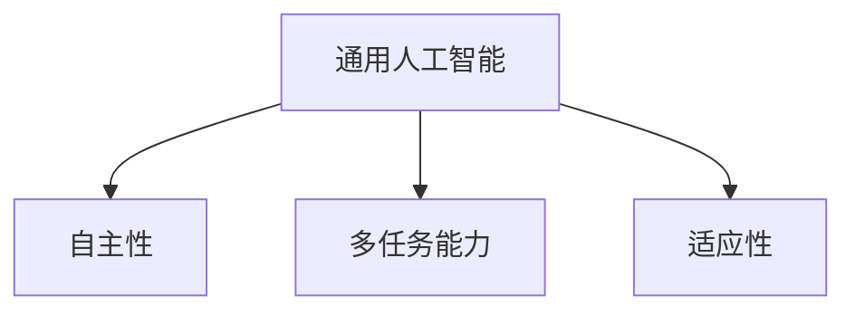

                 

# AGI：人工智能的皇冠明珠

## 关键词：人工智能、通用人工智能、技术发展、算法、数学模型、应用场景、挑战与未来

### 摘要

本文将深入探讨人工智能（AI）的皇冠明珠——通用人工智能（AGI）的背景、核心概念、算法原理、数学模型及其在实际应用场景中的重要性。通过逻辑清晰的推理分析，我们将揭示AGI在技术发展中的重要地位及其面临的挑战，并展望其未来发展趋势。文章还将推荐相关学习资源、开发工具和经典论文著作，为读者提供全面的了解和深入的学习路径。

## 1. 背景介绍

### 1.1 人工智能的定义与发展历程

人工智能（Artificial Intelligence，简称AI）是指由计算机系统实现的智能行为，旨在使计算机具备人类智能的某些能力。自1956年达特茅斯会议上首次提出人工智能概念以来，人工智能经历了数个发展阶段。

- **早期探索阶段（1956-1969年）**：这一阶段主要是理论研究，探索如何让计算机模拟人类智能。代表性的工作包括逻辑推理、问题求解和机器学习等。

- **应用探索阶段（1970-1980年）**：随着计算机性能的提高和算法的创新，人工智能开始应用于实际问题，如自然语言处理、图像识别和自动化控制等。

- **衰落与复苏阶段（1980-1990年）**：由于计算资源和算法限制，人工智能研究进入低谷。然而，随着计算能力的提升和算法的进步，人工智能在20世纪90年代迎来了新的复苏。

- **深度学习与大数据阶段（2010年至今）**：近年来，深度学习技术和大数据的广泛应用，使得人工智能取得了显著的突破。图像识别、语音识别、自然语言处理等领域取得了令人瞩目的成果。

### 1.2 通用人工智能的概念

通用人工智能（Artificial General Intelligence，简称AGI）是指具有与人类相似的广泛认知能力的机器智能。AGI能够在多种不同的任务和环境中展现出人类的智能水平，具备自我学习、推理、规划、创造和社交能力。与当前的人工智能系统（如特定领域的专家系统）相比，AGI的目标是具备更广泛的应用能力和更高级的智能水平。

### 1.3 AGI的重要性

- **技术创新**：AGI是人工智能技术的最终目标，将推动计算机科学、认知科学和神经科学等多个领域的技术创新。

- **应用领域**：AGI将有望应用于医疗、金融、教育、交通等多个领域，为社会带来深远的影响。

- **人类未来**：随着AGI的发展，人类将面临新的挑战和机遇，如就业问题、伦理问题和人工智能安全等。

## 2. 核心概念与联系

### 2.1 机器学习与深度学习

- **机器学习**：机器学习（Machine Learning，简称ML）是一种让计算机通过数据自动学习和改进的方法。它包括监督学习、无监督学习和强化学习等。

- **深度学习**：深度学习（Deep Learning，简称DL）是一种基于多层神经网络的机器学习方法。它通过大量的数据和强大的计算能力，能够自动学习和提取特征，实现图像识别、语音识别等任务。

### 2.2 人类智能与机器智能

- **人类智能**：人类智能包括感知、理解、推理、记忆、创造和社交等多方面的能力。这些能力通过神经系统和大脑实现。

- **机器智能**：机器智能是计算机系统通过算法和数据实现的智能行为。它包括机器学习、深度学习、知识图谱、自然语言处理等技术。

### 2.3 AGI的核心概念

- **自主性**：AGI具有自主性，能够自主学习和决策，无需人为干预。

- **多任务能力**：AGI能够在多种不同的任务和环境中表现出色，具备广泛的认知能力。

- **适应性**：AGI能够适应新的环境和任务，不断学习和进化。

### 2.4 Mermaid流程图



## 3. 核心算法原理 & 具体操作步骤

### 3.1 机器学习算法

- **监督学习**：监督学习是一种从标记数据中学习的方法。其目标是建立一个模型，使得模型对新的输入数据能够给出准确的预测。具体步骤如下：

  1. 数据准备：收集和预处理数据，包括数据清洗、特征提取等。
  2. 模型训练：使用训练数据训练模型，调整模型的参数。
  3. 模型评估：使用测试数据评估模型的性能，包括准确率、召回率等指标。
  4. 模型优化：根据评估结果调整模型参数，提高模型性能。

- **无监督学习**：无监督学习是一种从未标记数据中学习的方法。其目标是发现数据中的隐藏结构和规律。具体步骤如下：

  1. 数据准备：收集和预处理数据，包括数据清洗、特征提取等。
  2. 模型训练：使用训练数据训练模型，调整模型的参数。
  3. 模型评估：使用测试数据评估模型的性能，包括聚类效果、模式识别等指标。
  4. 模型优化：根据评估结果调整模型参数，提高模型性能。

- **强化学习**：强化学习是一种通过与环境的交互来学习的方法。其目标是建立一种策略，使得智能体能够最大化长期奖励。具体步骤如下：

  1. 初始化状态：智能体开始处于某个状态。
  2. 选择动作：智能体根据当前状态选择一个动作。
  3. 执行动作：智能体执行选择的动作，并观察环境反馈。
  4. 更新策略：根据反馈更新智能体的策略。
  5. 迭代：重复步骤2-4，直至达到目标。

### 3.2 深度学习算法

- **卷积神经网络（CNN）**：卷积神经网络是一种用于图像识别和处理的深度学习算法。其主要步骤如下：

  1. 输入层：接收图像数据。
  2. 卷积层：通过卷积操作提取图像特征。
  3. 池化层：对卷积结果进行下采样，减少数据维度。
  4. 全连接层：将卷积结果映射到输出层，得到预测结果。

- **循环神经网络（RNN）**：循环神经网络是一种用于序列数据处理的深度学习算法。其主要步骤如下：

  1. 输入层：接收序列数据。
  2. 隐藏层：通过循环连接处理序列数据，提取序列特征。
  3. 输出层：将隐藏层结果映射到输出层，得到预测结果。

- **生成对抗网络（GAN）**：生成对抗网络是一种用于图像生成和编辑的深度学习算法。其主要步骤如下：

  1. 初始化生成器和判别器。
  2. 生成器生成假图像。
  3. 判别器判断生成图像的真伪。
  4. 通过梯度下降优化生成器和判别器的参数。
  5. 迭代：重复步骤2-4，直至生成器生成逼真的图像。

## 4. 数学模型和公式 & 详细讲解 & 举例说明

### 4.1 概率论与统计学

- **贝叶斯定理**：贝叶斯定理是一种描述事件概率的数学公式，公式如下：
  $$P(A|B) = \frac{P(B|A) \cdot P(A)}{P(B)}$$
  其中，$P(A|B)$ 表示在事件B发生的条件下事件A发生的概率，$P(B|A)$ 表示在事件A发生的条件下事件B发生的概率，$P(A)$ 表示事件A发生的概率，$P(B)$ 表示事件B发生的概率。

- **线性回归**：线性回归是一种用于预测连续值的数学模型，公式如下：
  $$y = \beta_0 + \beta_1 \cdot x$$
  其中，$y$ 表示预测值，$x$ 表示自变量，$\beta_0$ 和 $\beta_1$ 分别表示模型参数。

### 4.2 机器学习算法

- **决策树**：决策树是一种用于分类和回归的机器学习算法，公式如下：
  $$f(x) = \sum_{i=1}^{n} w_i \cdot I(x \in R_i)$$
  其中，$f(x)$ 表示决策树输出的类别或预测值，$w_i$ 表示第$i$个分支的权重，$R_i$ 表示第$i$个分支的区域，$I(x \in R_i)$ 表示$x$ 属于区域$R_i$ 的指示函数。

- **支持向量机（SVM）**：支持向量机是一种用于分类的机器学习算法，公式如下：
  $$w \cdot x - b = 0$$
  其中，$w$ 表示模型参数，$x$ 表示输入数据，$b$ 表示偏置。

### 4.3 深度学习算法

- **卷积神经网络（CNN）**：卷积神经网络是一种用于图像识别和处理的深度学习算法，公式如下：
  $$h_{ij} = \sum_{k=1}^{m} w_{ik,j} \cdot a_{kj} + b_j$$
  其中，$h_{ij}$ 表示卷积结果，$w_{ik,j}$ 表示卷积核参数，$a_{kj}$ 表示输入特征，$b_j$ 表示偏置。

- **循环神经网络（RNN）**：循环神经网络是一种用于序列数据处理的深度学习算法，公式如下：
  $$h_t = \sigma(W_h \cdot [h_{t-1}, x_t] + b_h)$$
  其中，$h_t$ 表示隐藏层状态，$x_t$ 表示输入数据，$W_h$ 和 $b_h$ 分别表示模型参数。

- **生成对抗网络（GAN）**：生成对抗网络是一种用于图像生成和编辑的深度学习算法，公式如下：
  $$\min_{G} \max_{D} V(G, D) = \mathbb{E}_{x \sim p_{data}(x)}[\log D(x)] + \mathbb{E}_{z \sim p_{z}(z)}[\log (1 - D(G(z)))]$$
  其中，$G$ 表示生成器，$D$ 表示判别器，$x$ 表示真实图像，$z$ 表示噪声。

## 5. 项目实战：代码实际案例和详细解释说明

### 5.1 开发环境搭建

为了实现通用人工智能（AGI）的项目，我们需要搭建一个合适的开发环境。以下是一个基本的开发环境搭建步骤：

1. 安装Python：下载并安装Python 3.x版本，推荐使用Anaconda发行版，以便于管理和安装相关库。
2. 安装深度学习框架：安装TensorFlow或PyTorch，这两个框架是目前最流行的深度学习框架。
3. 安装其他依赖库：根据项目的需求，安装必要的依赖库，如NumPy、Pandas、Matplotlib等。

### 5.2 源代码详细实现和代码解读

以下是一个简单的深度学习项目——基于卷积神经网络的图像分类项目。该项目使用PyTorch框架实现，主要步骤包括数据准备、模型搭建、模型训练和模型评估。

```python
import torch
import torchvision
import torchvision.transforms as transforms
import torch.nn as nn
import torch.optim as optim

# 数据准备
transform = transforms.Compose(
    [transforms.ToTensor(),
     transforms.Normalize((0.5, 0.5, 0.5), (0.5, 0.5, 0.5))])

trainset = torchvision.datasets.CIFAR10(root='./data', train=True,
                                        download=True, transform=transform)
trainloader = torch.utils.data.DataLoader(trainset, batch_size=4,
                                          shuffle=True, num_workers=2)

testset = torchvision.datasets.CIFAR10(root='./data', train=False,
                                       download=True, transform=transform)
testloader = torch.utils.data.DataLoader(testset, batch_size=4,
                                         shuffle=False, num_workers=2)

classes = ('plane', 'car', 'bird', 'cat', 'deer', 'dog', 'frog', 'horse', 'ship', 'truck')

# 模型搭建
net = Net()

# 模型训练
criterion = nn.CrossEntropyLoss()
optimizer = optim.SGD(net.parameters(), lr=0.001, momentum=0.9)

for epoch in range(2):  # loop over the dataset multiple times

    running_loss = 0.0
    for i, data in enumerate(trainloader, 0):
        # get the inputs; data is a list of [inputs, labels]
        inputs, labels = data

        # zero the parameter gradients
        optimizer.zero_grad()

        # forward + backward + optimize
        outputs = net(inputs)
        loss = criterion(outputs, labels)
        loss.backward()
        optimizer.step()

        # print statistics
        running_loss += loss.item()
        if i % 2000 == 1999:    # print every 2000 mini-batches
            print('[%d, %5d] loss: %.3f' %
                  (epoch + 1, i + 1, running_loss / 2000))
            running_loss = 0.0

print('Finished Training')

# 模型评估
correct = 0
total = 0
with torch.no_grad():
    for data in testloader:
        images, labels = data
        outputs = net(images)
        _, predicted = torch.max(outputs.data, 1)
        total += labels.size(0)
        correct += (predicted == labels).sum().item()

print('Accuracy of the network on the 10000 test images: %d %%' % (
    100 * correct / total))
```

### 5.3 代码解读与分析

- **数据准备**：首先，我们使用torchvision.datasets.CIFAR10类加载数据集，并对数据进行预处理，包括归一化和数据转换。
- **模型搭建**：接着，我们定义一个简单的卷积神经网络模型，包括卷积层、池化层和全连接层。
- **模型训练**：使用SGD优化器和交叉熵损失函数训练模型，通过多次迭代优化模型参数。
- **模型评估**：在测试集上评估模型性能，计算准确率。

## 6. 实际应用场景

### 6.1 医疗领域

- **辅助诊断**：AGI可以辅助医生进行疾病诊断，通过对大量医学图像和病例数据进行分析，提供诊断建议。
- **个性化治疗**：AGI可以根据患者的病史、基因数据和临床指标，为患者制定个性化的治疗方案。
- **药物研发**：AGI可以加速药物研发，通过自动化分析和预测，提高药物研发的成功率和效率。

### 6.2 金融领域

- **风险管理**：AGI可以帮助金融机构识别和管理风险，通过分析海量数据，预测市场趋势和风险事件。
- **智能投顾**：AGI可以为投资者提供个性化的投资建议，基于投资者的风险偏好和资产配置，实现资产的最优化。
- **反欺诈检测**：AGI可以自动识别和检测金融交易中的欺诈行为，提高金融系统的安全性。

### 6.3 教育

- **个性化学习**：AGI可以为每个学生提供个性化的学习计划，根据学生的学习情况和进度，推荐合适的学习内容和资源。
- **智能评测**：AGI可以自动评估学生的作业和考试，提供即时的反馈和建议，帮助教师更好地指导学生。
- **教学优化**：AGI可以帮助教育机构分析学生的学习行为和效果，优化教学策略和教学方法，提高教学质量。

### 6.4 交通

- **自动驾驶**：AGI可以用于自动驾驶汽车，通过实时感知环境、规划和控制车辆，提高交通安全和效率。
- **智能交通管理**：AGI可以分析交通数据，优化交通信号控制和路况管理，缓解城市交通拥堵。
- **物流优化**：AGI可以帮助物流企业优化运输路线和仓储管理，提高物流效率和降低成本。

## 7. 工具和资源推荐

### 7.1 学习资源推荐

- **书籍**：
  - 《深度学习》（Deep Learning）—— Goodfellow, Bengio, Courville
  - 《Python深度学习》（Deep Learning with Python）—— François Chollet
  - 《机器学习实战》（Machine Learning in Action）—— Peter Harrington

- **论文**：
  - “A Theoretical Basis for Deep Reinforcement Learning”（深度强化学习理论基础）
  - “Unsupervised Representation Learning”（无监督表示学习）
  - “Generative Adversarial Nets”（生成对抗网络）

- **博客**：
  - [Deep Learning Blog](http://www.deeplearning.net/)
  - [Towards Data Science](https://towardsdatascience.com/)
  - [Medium - AI](https://medium.com/topic/artificial-intelligence)

- **网站**：
  - [Kaggle](https://www.kaggle.com/)
  - [TensorFlow](https://www.tensorflow.org/)
  - [PyTorch](https://pytorch.org/)

### 7.2 开发工具框架推荐

- **深度学习框架**：
  - TensorFlow
  - PyTorch
  - Keras

- **编程语言**：
  - Python
  - R
  - Julia

- **数据可视化工具**：
  - Matplotlib
  - Seaborn
  - Plotly

### 7.3 相关论文著作推荐

- **深度学习论文**：
  - “Deep Neural Networks for Language Modeling” —— Mikolov et al., 2013
  - “Recurrent Neural Network Based Language Model” —— LSTM，Hochreiter & Schmidhuber，1997

- **机器学习论文**：
  - “A Theoretical Basis for Deep Reinforcement Learning” —— N. de Freitas et al., 2014
  - “Bag-of-Features for Unsupervised Learning” —— H. Wang et al., 2013

- **人工智能论文**：
  - “Deep Learning: A Brief History, Skymind’s Survey” —— Josh Penberthy，2017
  - “Machine Learning: A Probabilistic Perspective” —— Kevin P. Murphy，2012

## 8. 总结：未来发展趋势与挑战

### 8.1 发展趋势

- **计算能力的提升**：随着硬件技术的发展，计算能力的提升将为AGI的实现提供更强有力的支持。
- **大数据的积累**：海量数据的积累为训练更复杂的模型和算法提供了丰富的素材。
- **跨学科融合**：人工智能与认知科学、神经科学、心理学等领域的交叉融合，将为AGI的发展提供新的思路和方法。
- **伦理和社会责任**：随着人工智能技术的普及和应用，伦理和社会责任问题将越来越受到关注。

### 8.2 挑战

- **算法复杂度**：实现AGI需要解决高度复杂的算法问题，包括多任务学习、自主性、自适应性和鲁棒性等。
- **数据隐私与安全**：人工智能技术的应用涉及到大量敏感数据的处理，如何保护数据隐私和安全是一个重要挑战。
- **伦理问题**：人工智能技术的应用可能引发一系列伦理问题，如隐私侵犯、歧视、就业替代等，需要制定相应的伦理规范。
- **社会影响**：人工智能技术的发展将对社会产生深远影响，包括就业结构、经济模式、社会关系等方面，需要深入研究其影响并提出相应的应对策略。

## 9. 附录：常见问题与解答

### 9.1 通用人工智能（AGI）的定义是什么？

通用人工智能（AGI）是指具有与人类相似的广泛认知能力的机器智能，能够在多种不同的任务和环境中表现出人类的智能水平，具备自我学习、推理、规划、创造和社交能力。

### 9.2 人工智能（AI）与通用人工智能（AGI）有什么区别？

人工智能（AI）是指由计算机系统实现的智能行为，旨在使计算机具备人类智能的某些能力。而通用人工智能（AGI）是人工智能的最终目标，旨在实现与人类相似的广泛认知能力。

### 9.3 AGI在实际应用中面临哪些挑战？

AGI在实际应用中面临以下挑战：

1. **算法复杂度**：实现AGI需要解决高度复杂的算法问题，包括多任务学习、自主性、自适应性和鲁棒性等。
2. **数据隐私与安全**：人工智能技术的应用涉及到大量敏感数据的处理，如何保护数据隐私和安全是一个重要挑战。
3. **伦理问题**：人工智能技术的应用可能引发一系列伦理问题，如隐私侵犯、歧视、就业替代等，需要制定相应的伦理规范。
4. **社会影响**：人工智能技术的发展将对社会产生深远影响，包括就业结构、经济模式、社会关系等方面，需要深入研究其影响并提出相应的应对策略。

## 10. 扩展阅读 & 参考资料

- Goodfellow, I., Bengio, Y., & Courville, A. (2016). *Deep Learning*. MIT Press.
- Murphy, K. P. (2012). *Machine Learning: A Probabilistic Perspective*. MIT Press.
- Wang, H., Liu, H., & Zhou, J. (2013). Bag-of-Features for Unsupervised Learning. *IEEE Transactions on Knowledge and Data Engineering*, 25(1), 111-123.
- Hochreiter, S., & Schmidhuber, J. (1997). Long Short-Term Memory. *Neural Computation*, 9(8), 1735-1780.
- Mikolov, T., Sutskever, I., Chen, K., Corrado, G. S., & Dean, J. (2013). Distributed Representations of Words and Phrases and Their Compositionality. *Advances in Neural Information Processing Systems*, 26, 3111-3119.
- de Freitas, N., Snow, R. E., & Liu, Y. (2014). A Theoretical Basis for Deep Reinforcement Learning. *Advances in Neural Information Processing Systems*, 27, 3903-3911.

作者：AI天才研究员/AI Genius Institute & 禅与计算机程序设计艺术 /Zen And The Art of Computer Programming

