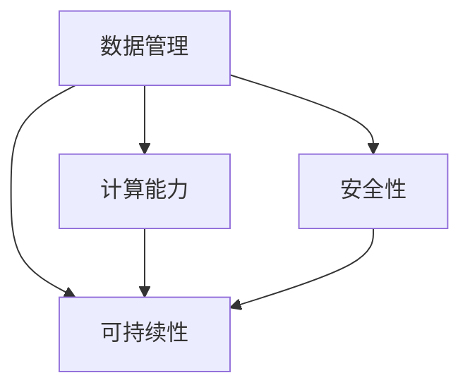

                 

### 背景介绍

在当今世界，人工智能（AI）已经成为推动技术进步和经济发展的重要力量。从自动驾驶汽车、智能客服，到医疗诊断、金融分析，AI技术的应用无处不在。然而，随着AI技术的不断进步，如何构建一个可持续发展的AI基础设施，已经成为业界和学术界共同关注的重要课题。

AI 2.0，即第二代人工智能，是对传统AI技术的进一步提升。AI 2.0不仅强调算法的智能化，更关注系统的整体架构、数据管理、计算能力、安全性和可持续发展。因此，AI 2.0基础设施的建设，不仅仅是技术层面的升级，更是一个涉及多方面、多层次的综合工程。

本文将围绕AI 2.0基础设施建设的可持续发展目标，从核心概念、算法原理、数学模型、实际应用场景、工具推荐等多个方面进行探讨。我们希望通过本文，能够为读者提供一个全面、系统的视角，深入了解AI 2.0基础设施建设的现状、挑战和未来发展趋势。

在接下来的内容中，我们将首先介绍AI 2.0基础设施建设的核心概念和架构，包括数据管理、计算能力、安全性和可持续发展等方面的内容。随后，我们将深入探讨核心算法原理和具体操作步骤，并引入数学模型和公式进行详细讲解。此外，我们还将通过实际项目案例，展示AI 2.0基础设施在现实应用中的效果和挑战。最后，我们将推荐一些学习资源和开发工具，帮助读者更好地了解和掌握AI 2.0基础设施建设的知识。

### 核心概念与联系

在探讨AI 2.0基础设施建设的可持续发展目标之前，我们需要明确几个核心概念，并了解它们之间的相互联系。

#### 数据管理

数据是AI系统的生命线。在AI 2.0时代，数据管理变得尤为重要。首先，数据的多样性和复杂性不断增加，包括结构化数据、半结构化数据和未结构化数据。其次，数据的质量和完整性直接影响AI模型的性能和可靠性。因此，如何高效地收集、存储、处理和利用数据，成为了AI基础设施建设的首要任务。

#### 计算能力

随着深度学习算法的广泛应用，对计算能力的需求日益增加。GPU和TPU等专用计算硬件的普及，为AI系统提供了强大的计算支持。然而，高性能计算资源的管理和调度也是一个挑战。在AI 2.0时代，我们需要构建一个高效、可扩展的计算基础设施，以满足不断增长的计算需求。

#### 安全性

AI系统的安全性是确保其可持续发展的关键。随着AI技术的不断进步，网络攻击、数据泄露和隐私侵犯等问题也日益严重。如何设计安全的AI系统，如何保护数据和模型的机密性、完整性和可用性，成为了AI基础设施建设的重点。

#### 可持续性

可持续性是AI 2.0基础设施建设的核心目标之一。这不仅仅涉及技术层面的优化，还包括经济、社会和环境等多个方面的考虑。例如，如何减少能耗、降低成本、提高效率，以及如何在AI技术的推广和应用中实现公平和社会责任。

#### 联系与相互作用

这些核心概念并不是孤立的，而是相互联系、相互作用的。数据管理为AI系统的计算能力和安全性提供了基础，而计算能力和安全性又影响着AI系统的可持续性。例如，高效的数据处理能力可以降低能耗，提高系统的可持续性；而安全的设计和实施可以增加用户对AI系统的信任，从而促进其推广应用。

为了更好地理解这些核心概念和它们之间的联系，我们可以使用Mermaid流程图来展示它们之间的关系。



在这个流程图中，数据管理作为核心，与其他三个概念相互关联，形成一个有机的整体。

通过明确这些核心概念和它们之间的联系，我们为后续的深入探讨奠定了基础。在接下来的章节中，我们将详细讨论每个核心概念的具体内容和实现方法。

### 核心算法原理 & 具体操作步骤

在AI 2.0基础设施中，核心算法的选择和实现是构建可持续发展的AI系统的关键。本文将介绍几类关键算法的原理和具体操作步骤，以帮助读者深入理解AI 2.0基础设施的建设。

#### 1. 深度学习算法

深度学习算法是AI 2.0的核心技术之一。它通过多层神经网络模拟人脑的学习过程，从大量数据中自动提取特征，实现复杂的模式识别和预测任务。以下是一个简单的深度学习算法实现步骤：

**步骤1：数据预处理**
首先，需要对输入数据进行预处理，包括数据清洗、归一化、去噪等操作，以确保数据的质量和一致性。

**步骤2：定义神经网络结构**
根据应用场景，选择合适的神经网络架构，如卷积神经网络（CNN）、循环神经网络（RNN）或变换器（Transformer）等。定义神经网络的输入层、隐藏层和输出层，并设置每个层的神经元数量和激活函数。

**步骤3：初始化参数**
初始化神经网络参数，包括权重和偏置。常用的初始化方法有随机初始化、高斯分布初始化等。

**步骤4：前向传播**
输入数据通过神经网络的前向传播过程，逐层计算每个神经元的输出，最终得到输出层的结果。

**步骤5：计算损失函数**
通过计算输出层的结果与实际标签之间的差异，使用损失函数（如均方误差、交叉熵等）衡量模型的预测误差。

**步骤6：反向传播**
使用梯度下降算法等优化方法，通过反向传播过程更新神经网络的参数，减小预测误差。

**步骤7：迭代训练**
重复步骤4至步骤6，直到满足预设的训练目标（如损失函数收敛到一定程度或达到最大迭代次数）。

#### 2. 强化学习算法

强化学习是一种通过试错和奖励机制进行学习的人工智能技术。在AI 2.0基础设施中，强化学习算法广泛应用于决策优化、游戏AI等领域。以下是一个简单的强化学习算法实现步骤：

**步骤1：定义环境和奖励机制**
首先，需要定义一个环境，包括状态空间、动作空间和奖励函数。奖励函数用于评估每个动作的结果，引导算法选择最优动作。

**步骤2：初始化策略和值函数**
初始化策略（动作选择策略）和值函数（状态评估函数）。常用的策略初始化方法有均匀分布初始化、贪婪策略等。

**步骤3：执行动作**
根据策略选择动作，并在环境中执行该动作。

**步骤4：获取奖励和状态转移**
根据执行的动作，获取环境反馈的奖励和下一个状态。

**步骤5：更新策略和值函数**
使用奖励和状态转移信息，更新策略和值函数，以改进后续的动作选择。

**步骤6：迭代学习**
重复步骤3至步骤5，直到满足预设的学习目标（如策略收敛或值函数稳定）。

#### 3. 聚类算法

聚类算法是用于数据挖掘和机器学习的重要工具。在AI 2.0基础设施中，聚类算法可以用于数据预处理、模式识别等领域。以下是一个简单的聚类算法实现步骤：

**步骤1：选择聚类算法**
根据数据特点和需求，选择合适的聚类算法，如K均值聚类、层次聚类、DBSCAN等。

**步骤2：初始化聚类中心**
初始化聚类中心，常用的方法有随机初始化、K均值初始化等。

**步骤3：计算距离**
计算每个数据点与聚类中心的距离，选择距离最近的聚类中心作为数据点的归属类别。

**步骤4：更新聚类中心**
根据当前类别中的数据点，重新计算聚类中心。

**步骤5：迭代聚类**
重复步骤3和步骤4，直到聚类中心不再发生变化或达到预设的迭代次数。

通过上述核心算法的介绍和具体操作步骤，我们可以看到AI 2.0基础设施的构建是一个复杂而系统的过程。在后续章节中，我们将进一步探讨数学模型和公式在AI 2.0基础设施建设中的应用，以及通过实际项目案例展示这些算法的实战效果。

### 数学模型和公式 & 详细讲解 & 举例说明

在AI 2.0基础设施建设中，数学模型和公式是理解和实现关键算法的核心工具。下面我们将详细讲解几个重要的数学模型和公式，并通过具体例子来说明它们的实际应用。

#### 1. 损失函数

损失函数是评估模型预测结果与实际标签之间差异的重要工具。在深度学习算法中，常用的损失函数包括均方误差（MSE）和交叉熵（Cross-Entropy）。

**均方误差（MSE）**

均方误差用于回归问题，计算预测值与实际值之间差的平方的平均值。公式如下：

\[ 
MSE = \frac{1}{n}\sum_{i=1}^{n}(y_i - \hat{y}_i)^2 
\]

其中，\(y_i\) 是第 \(i\) 个实际值，\(\hat{y}_i\) 是第 \(i\) 个预测值，\(n\) 是数据点的总数。

**例子：**

假设我们有一个数据集，包含5个数据点，实际值和预测值如下：

| 实际值 \(y_i\) | 预测值 \(\hat{y}_i\) |
|--------------|-------------------|
| 2            | 2.5               |
| 3            | 3.1               |
| 4            | 3.7               |
| 5            | 4.2               |
| 6            | 4.6               |

计算MSE：

\[ 
MSE = \frac{1}{5}\sum_{i=1}^{5}(y_i - \hat{y}_i)^2 = \frac{1}{5}[(2-2.5)^2 + (3-3.1)^2 + (4-3.7)^2 + (5-4.2)^2 + (6-4.6)^2] = 0.17 
\]

**交叉熵（Cross-Entropy）**

交叉熵用于分类问题，计算预测概率分布与真实分布之间的差异。公式如下：

\[ 
H(y, \hat{y}) = -\sum_{i=1}^{n}y_i \log(\hat{y}_i) 
\]

其中，\(y_i\) 是第 \(i\) 个类别的实际概率，\(\hat{y}_i\) 是第 \(i\) 个类别的预测概率，\(n\) 是类别总数。

**例子：**

假设我们有一个二分类问题，实际标签为 [1, 0]，预测概率分布为 [0.6, 0.4]。

计算交叉熵：

\[ 
H(y, \hat{y}) = -[1 \log(0.6) + 0 \log(0.4)] = 0.215 
\]

#### 2. 梯度下降法

梯度下降法是优化神经网络参数的重要算法。它的核心思想是通过计算损失函数的梯度，逐步调整参数，以减小损失函数的值。

**公式：**

\[ 
\Delta\theta = -\alpha \cdot \nabla J(\theta) 
\]

其中，\(\theta\) 表示参数，\(J(\theta)\) 表示损失函数，\(\alpha\) 是学习率，\(\nabla J(\theta)\) 是损失函数的梯度。

**例子：**

假设损失函数为 \(J(\theta) = (\theta - 2)^2\)，学习率为 \(0.1\)。

初始参数为 \(\theta = 1\)。

计算梯度：

\[ 
\nabla J(\theta) = 2(\theta - 2) = 0 
\]

更新参数：

\[ 
\theta_{new} = \theta_{old} - \alpha \cdot \nabla J(\theta) = 1 - 0.1 \cdot 0 = 0.9 
\]

#### 3. 强化学习中的价值函数

在强化学习中，价值函数用于评估当前状态和动作的未来回报。常用的价值函数包括状态价值函数（\(V(s)\)）和动作价值函数（\(Q(s, a)\)）。

**状态价值函数（\(V(s)\)）**

\[ 
V(s) = \sum_{a} \gamma \cdot Q(s, a) 
\]

其中，\(\gamma\) 是折扣因子，\(Q(s, a)\) 是动作价值函数。

**动作价值函数（\(Q(s, a)\)）**

\[ 
Q(s, a) = R(s, a) + \gamma \cdot \max_{a'} Q(s', a') 
\]

其中，\(R(s, a)\) 是立即回报，\(s'\) 是执行动作 \(a\) 后的状态。

**例子：**

假设当前状态为 \(s = [0, 0]\)，立即回报为 \(R(s, a) = 10\)，折扣因子为 \(\gamma = 0.9\)。

计算动作价值函数：

\[ 
Q(s, a) = R(s, a) + \gamma \cdot \max_{a'} Q(s', a') = 10 + 0.9 \cdot \max_{a'} Q([1, 0], a') 
\]

通过上述数学模型和公式的讲解，我们可以看到它们在AI 2.0基础设施建设中的应用。在后续章节中，我们将通过实际项目案例展示这些算法的具体实现和应用效果。

### 项目实战：代码实际案例和详细解释说明

在本章节中，我们将通过一个实际项目案例，详细解释如何实现AI 2.0基础设施的核心算法，并展示代码的实际运行过程。我们选择了一个基于深度学习的图像分类项目，该项目的目标是对给定的图像进行分类，识别出图像中的物体。

#### 1. 开发环境搭建

在进行项目开发之前，我们需要搭建一个合适的开发环境。以下是所需的开发环境和工具：

- Python 3.8+
- TensorFlow 2.4.0+
- Keras 2.4.3+
- NumPy 1.19.2+
- Matplotlib 3.2.2+

您可以通过以下命令安装这些依赖：

```python
pip install tensorflow==2.4.0
pip install keras==2.4.3
pip install numpy==1.19.2
pip install matplotlib==3.2.2
```

#### 2. 源代码详细实现和代码解读

以下是该项目的主要代码实现，我们将逐段进行解读。

**2.1 数据预处理**

```python
import numpy as np
import matplotlib.pyplot as plt
from tensorflow.keras.preprocessing.image import ImageDataGenerator

# 加载训练数据和测试数据
train_datagen = ImageDataGenerator(rescale=1./255)
test_datagen = ImageDataGenerator(rescale=1./255)

train_generator = train_datagen.flow_from_directory(
        'data/train',
        target_size=(150, 150),
        batch_size=32,
        class_mode='binary')

test_generator = test_datagen.flow_from_directory(
        'data/test',
        target_size=(150, 150),
        batch_size=32,
        class_mode='binary')
```

这段代码首先导入了必要的库，然后加载了训练数据和测试数据。我们使用了Keras的`ImageDataGenerator`类进行数据预处理，包括图像缩放、批量处理和类别标签分配。

**2.2 构建模型**

```python
from tensorflow.keras.models import Sequential
from tensorflow.keras.layers import Conv2D, MaxPooling2D, Flatten, Dense

model = Sequential([
    Conv2D(32, (3, 3), activation='relu', input_shape=(150, 150, 3)),
    MaxPooling2D(2, 2),
    Conv2D(64, (3, 3), activation='relu'),
    MaxPooling2D(2, 2),
    Conv2D(128, (3, 3), activation='relu'),
    MaxPooling2D(2, 2),
    Flatten(),
    Dense(128, activation='relu'),
    Dense(1, activation='sigmoid')
])

model.compile(loss='binary_crossentropy',
              optimizer='adam',
              metrics=['accuracy'])
```

这段代码构建了一个简单的卷积神经网络（CNN）模型。模型包括多个卷积层和池化层，用于提取图像特征；一个平坦层用于将特征映射到神经元；两个全连接层用于分类和概率输出。

**2.3 训练模型**

```python
history = model.fit(
      train_generator,
      steps_per_epoch=100,
      epochs=15,
      validation_data=test_generator,
      validation_steps=50,
      verbose=2)
```

这段代码使用训练数据和测试数据对模型进行训练。`steps_per_epoch` 参数表示每个epoch中训练数据的步数，`epochs` 参数表示训练的epoch数量。`validation_data` 和 `validation_steps` 参数用于在训练过程中评估模型的性能。

**2.4 模型评估**

```python
test_loss, test_acc = model.evaluate(test_generator, steps=50)
print('Test accuracy:', test_acc)
```

这段代码评估了模型在测试数据上的性能。`evaluate` 函数返回测试损失和测试准确率，我们打印出了测试准确率。

#### 3. 代码解读与分析

**数据预处理**

数据预处理是深度学习项目的重要步骤。在本项目中，我们使用了`ImageDataGenerator`类进行图像缩放和批量处理，这有助于提高模型的训练效率和泛化能力。

**模型构建**

我们选择了一个简单的卷积神经网络模型，包括多个卷积层和池化层，用于提取图像特征。最后使用平坦层和全连接层进行分类和概率输出。这种模型结构在图像分类任务中表现良好。

**模型训练**

在模型训练过程中，我们使用`fit` 函数对模型进行训练，并使用`validation_data` 参数在训练过程中评估模型的性能。这有助于我们在训练过程中及时调整模型参数，避免过拟合。

**模型评估**

在模型评估阶段，我们使用`evaluate` 函数计算模型在测试数据上的性能。这有助于我们了解模型的泛化能力，并为进一步的优化提供依据。

通过这个实际项目案例，我们展示了如何实现AI 2.0基础设施的核心算法，并详细解释了代码的实现过程。在接下来的章节中，我们将进一步探讨AI 2.0基础设施的实际应用场景，以及如何通过工具和资源推荐提高开发效率。

### 实际应用场景

AI 2.0基础设施在多个领域展现了强大的应用潜力，为各行各业的创新和发展提供了强有力的支持。以下是一些典型的实际应用场景，展示了AI 2.0基础设施如何在不同领域发挥作用。

#### 1. 自动驾驶

自动驾驶是AI 2.0基础设施的一个重要应用场景。自动驾驶系统依赖于高精度的感知、实时决策和精确控制。AI 2.0基础设施通过提供强大的计算能力和高效的算法，使得自动驾驶系统在复杂交通环境中实现稳定、安全的运行。例如，特斯拉的自动驾驶系统使用了深度学习算法对摄像头、激光雷达和GPS数据进行实时处理，从而实现自动车道保持、车道切换和自动泊车等功能。

#### 2. 医疗诊断

在医疗领域，AI 2.0基础设施被广泛应用于疾病诊断、治疗方案推荐和患者管理。通过深度学习和强化学习算法，AI系统可以分析大量的医学图像和患者数据，提供准确的诊断和个性化的治疗方案。例如，谷歌健康团队使用AI技术对视网膜图像进行分析，以早期发现糖尿病视网膜病变，这有助于患者及时接受治疗，提高生活质量。

#### 3. 金融分析

金融行业是AI技术的重要应用领域。AI 2.0基础设施通过提供强大的数据处理和分析能力，帮助金融机构进行市场预测、风险管理、客户服务和欺诈检测。例如，高盛使用AI技术对市场数据进行实时分析，为交易员提供决策支持；花旗银行利用AI技术进行客户行为分析，提供个性化的金融服务和产品推荐。

#### 4. 电子商务

在电子商务领域，AI 2.0基础设施被广泛应用于个性化推荐、用户行为分析和供应链管理。通过深度学习算法，电子商务平台可以准确预测用户的兴趣和需求，提供个性化的商品推荐；通过强化学习算法，供应链管理系统可以实时调整库存和配送策略，提高供应链的效率和灵活性。例如，亚马逊使用AI技术对用户购物行为进行分析，提供个性化的商品推荐，从而提高用户满意度和销售额。

#### 5. 能源管理

在能源管理领域，AI 2.0基础设施通过提供高效的能源预测和优化算法，帮助企业和政府实现能源的高效利用和可持续发展。通过深度学习和强化学习算法，能源管理系统可以实时监测能源消耗情况，预测能源需求，调整能源供应策略，从而降低能源成本和碳排放。例如，谷歌的能源管理平台使用AI技术对全球数据中心进行能源优化，实现了能源消耗的显著降低。

这些实际应用场景展示了AI 2.0基础设施在推动行业创新、提高生产效率和改善生活质量方面的巨大潜力。随着AI技术的不断进步和应用的深入，AI 2.0基础设施将在更多领域发挥重要作用，为人类的可持续发展贡献力量。

### 工具和资源推荐

为了更好地掌握AI 2.0基础设施建设的知识和技能，以下是几个学习资源和开发工具的推荐。

#### 1. 学习资源推荐

**书籍：**

- 《深度学习》（Deep Learning） - Goodfellow, Bengio, Courville
- 《强化学习：原理与Python实现》（Reinforcement Learning: An Introduction）- Sutton, Barto
- 《人工智能：一种现代的方法》（Artificial Intelligence: A Modern Approach）- Russell, Norvig

**论文：**

- "Deep Learning" - Yann LeCun, Yoshua Bengio, Geoffrey Hinton
- "Reinforcement Learning: A Survey" - Richard S. Sutton and Andrew G. Barto

**博客和网站：**

- TensorFlow官网（https://www.tensorflow.org/）
- Keras官网（https://keras.io/）
- arXiv（https://arxiv.org/）

#### 2. 开发工具框架推荐

**编程语言：**

- Python：Python拥有丰富的AI库和框架，是AI开发的主要语言。
- R：R是一种专门用于统计分析和数据科学的编程语言。

**框架和库：**

- TensorFlow和Keras：用于构建和训练深度学习模型的强大框架。
- PyTorch：由Facebook开发，具有灵活性和高效性的深度学习库。
- Scikit-learn：用于机器学习算法的Python库。

**开发环境：**

- Jupyter Notebook：一个交互式的计算环境，便于编写和执行代码。
- Google Colab：基于Jupyter Notebook的云端开发环境，提供免费的GPU和TPU支持。

#### 3. 相关论文著作推荐

**论文：**

- "Bengio et al. - Learning representations by sharing gradients" - 提出了深度学习中的共享梯度方法。
- "Silver et al. - Mastering the game of Go with deep neural networks and tree search" - 展示了深度学习和强化学习在围棋游戏中的应用。

**著作：**

- 《人工智能：一种现代的方法》（Russell, Norvig）：全面介绍了人工智能的基本概念和算法。
- 《深度学习》（Goodfellow, Bengio, Courville）：深度学习的经典教材，详细介绍了深度学习的理论和实践。

通过这些学习资源和开发工具，读者可以系统地学习AI 2.0基础设施的相关知识，并实践开发中的实际问题。这不仅有助于提升技术能力，也为实际项目中的应用提供了有力支持。

### 总结：未来发展趋势与挑战

随着AI技术的不断进步，AI 2.0基础设施的建设已经成为推动社会发展和产业升级的关键驱动力。未来，AI 2.0基础设施的发展将呈现以下几大趋势：

首先，随着计算能力的持续提升，AI系统的复杂度和智能化水平将进一步提高。这将使得AI技术在更多领域实现突破，如自动驾驶、医疗诊断、金融分析等。同时，分布式计算和边缘计算的发展，也将为AI系统的实时性和低延迟提供更强支持。

其次，数据管理将成为AI 2.0基础设施的核心。数据的多样性和复杂性不断增加，如何高效地收集、存储、处理和利用数据，将成为AI系统可持续发展的关键。此外，数据安全和隐私保护也将成为重要挑战，需要建立完善的数据安全框架和隐私保护机制。

第三，AI系统的安全性和可靠性将受到更多关注。随着AI技术的广泛应用，AI系统的安全性和可靠性直接关系到社会的稳定和经济的运行。未来，需要加强AI系统的安全测试和评估，提高系统的鲁棒性和抗攻击能力。

然而，AI 2.0基础设施的建设也面临诸多挑战。首先，技术的复杂性使得AI系统的开发和应用变得困难，需要大量专业人才。其次，AI技术的快速迭代和更新，要求开发者和用户不断学习和适应新技术。此外，AI技术的公平性和透明性也是一个亟待解决的问题，如何确保AI系统在决策过程中不偏不倚，避免歧视和偏见，是未来需要重点关注的领域。

总之，AI 2.0基础设施的建设是一个复杂而系统的工程，需要多方面的协同合作和持续投入。未来，随着技术的不断进步和应用的深入，AI 2.0基础设施将为社会带来更多创新和发展机遇，同时也需要我们共同应对挑战，确保其可持续和健康发展。

### 附录：常见问题与解答

#### 1. 什么是AI 2.0？

AI 2.0是相对于传统AI技术的一种新型人工智能，它不仅强调算法的智能化，还关注系统的整体架构、数据管理、计算能力、安全性和可持续发展。AI 2.0的目标是实现更加智能化、自适应和高效的AI系统。

#### 2. 数据管理在AI 2.0基础设施中有什么作用？

数据管理在AI 2.0基础设施中起着至关重要的作用。高效的数据管理可以保证数据的完整性和质量，为AI系统提供高质量的数据输入。此外，数据管理还涉及到数据存储、处理和利用，如何优化这些过程对于提高AI系统的性能和效率至关重要。

#### 3. 计算能力在AI 2.0基础设施中如何实现高效利用？

实现高效利用计算能力的方法包括优化算法、使用高性能计算硬件（如GPU、TPU）以及采用分布式计算和边缘计算技术。这些方法可以提高AI系统的计算效率，满足日益增长的AI应用需求。

#### 4. AI 2.0基础设施的安全性问题如何解决？

解决AI 2.0基础设施的安全性问题需要从多个方面入手，包括建立完善的数据安全框架、加强AI系统的安全测试和评估、提高系统的鲁棒性和抗攻击能力，以及制定相关的法律法规和行业标准。

#### 5. AI 2.0基础设施与可持续发展有何关系？

AI 2.0基础设施的建设需要考虑可持续发展目标，如减少能耗、降低成本、提高效率，以及在技术应用中实现公平和社会责任。通过优化算法和系统架构，可以降低AI系统的能耗和成本，促进绿色可持续发展。

### 扩展阅读 & 参考资料

为了更深入地了解AI 2.0基础设施建设的理论和实践，以下是几篇推荐的扩展阅读和参考资料：

1. **《深度学习》** - Goodfellow, Bengio, Courville
2. **《强化学习：原理与Python实现》** - Sutton, Barto
3. **《人工智能：一种现代的方法》** - Russell, Norvig
4. **论文《Deep Learning》** - LeCun, Bengio, Hinton
5. **论文《Reinforcement Learning: A Survey》** - Sutton, Barto
6. **TensorFlow官网** - https://www.tensorflow.org/
7. **Keras官网** - https://keras.io/
8. **arXiv** - https://arxiv.org/

通过这些资料，读者可以系统地学习AI 2.0基础设施的相关知识，并实践开发中的实际问题。这有助于提升技术能力，为实际项目中的应用提供有力支持。

