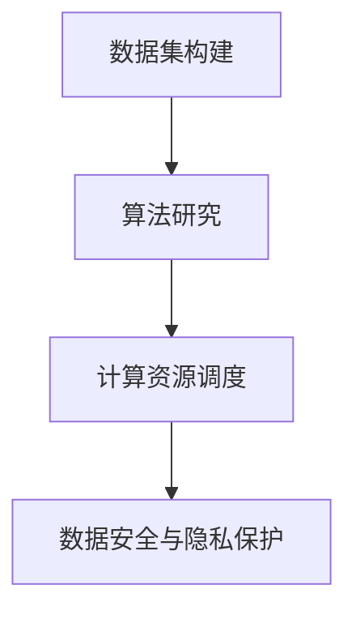

                 

### 文章标题

### AI 2.0 基础设施建设：未来趋势与展望

关键词：AI 2.0、基础设施建设、未来趋势、人工智能

摘要：本文将深入探讨 AI 2.0 基础设施建设的重要性和未来发展趋势。我们将分析 AI 2.0 的核心概念与联系，介绍核心算法原理和具体操作步骤，解析数学模型和公式，并通过实际项目实战展示代码实现。此外，我们还将探讨 AI 2.0 在实际应用场景中的价值，推荐相关学习资源和开发工具框架，并对未来发展趋势与挑战进行展望。

## 1. 背景介绍

随着人工智能技术的飞速发展，AI 2.0 正在逐渐成为现代科技领域的焦点。AI 2.0，也被称为下一代人工智能，是在深度学习和神经网络的基础上，进一步扩展和提升的人工智能技术。与传统的人工智能技术相比，AI 2.0 具有更高的智能水平和更强的学习能力，能够更好地应对复杂问题和挑战。

AI 2.0 的基础设施建设对于人工智能的发展至关重要。基础设施建设包括数据集的构建、算法的研究与优化、计算资源的调度和管理等。一个完善的基础设施能够为人工智能的研究和应用提供强有力的支持，加速技术的突破和应用的推广。

当前，AI 2.0 基础设施建设正面临着诸多挑战。首先，数据集的构建是一个关键问题。AI 2.0 需要大量的高质量数据来训练模型，而这些数据往往难以获取。其次，算法的研究与优化需要大量的计算资源，而现有的计算资源仍然有限。此外，基础设施建设还需要考虑数据安全、隐私保护等方面的问题。

## 2. 核心概念与联系

在 AI 2.0 基础设施建设中，核心概念与联系起到了至关重要的作用。以下是对核心概念的简要介绍以及它们之间的联系：

### 数据集构建

数据集构建是 AI 2.0 基础设施建设的基础。数据集的质量直接影响模型的性能。为了构建高质量的数据集，需要考虑数据的多样性、完整性、实时性等因素。

### 算法研究

算法研究是 AI 2.0 技术进步的核心。通过不断研究和优化算法，可以提高模型的准确性和效率。深度学习、强化学习、迁移学习等技术是当前 AI 2.0 研究的热点。

### 计算资源调度

计算资源调度是基础设施建设的另一个重要方面。通过合理调度计算资源，可以提高计算效率，降低成本。云计算、分布式计算等技术为计算资源调度提供了强大的支持。

### 数据安全与隐私保护

数据安全与隐私保护是基础设施建设中不可忽视的问题。在数据处理过程中，需要确保数据的安全性，防止数据泄露和滥用。同时，还需要尊重用户的隐私，确保数据使用的合规性。

下面是一个 Mermaid 流程图，展示了 AI 2.0 基础设施建设中的核心概念与联系：



## 3. 核心算法原理 & 具体操作步骤

### 深度学习算法

深度学习算法是 AI 2.0 的核心技术之一。深度学习通过多层神经网络对数据进行特征提取和分类。具体操作步骤如下：

1. 数据预处理：对数据进行清洗、归一化等处理，使其符合模型的输入要求。
2. 构建神经网络：设计合适的神经网络结构，包括输入层、隐藏层和输出层。
3. 模型训练：使用训练数据对模型进行训练，通过反向传播算法不断调整模型参数，使模型达到预期的性能。
4. 模型评估：使用验证数据对模型进行评估，判断模型的性能是否满足要求。
5. 模型部署：将训练好的模型部署到实际应用中，进行预测和决策。

### 强化学习算法

强化学习算法是 AI 2.0 中另一个重要的技术。强化学习通过不断尝试和反馈，使模型能够学习到最优策略。具体操作步骤如下：

1. 环境设定：定义一个虚拟环境，用于模拟实际应用场景。
2. 策略学习：通过探索和试错，使模型不断学习到最优策略。
3. 策略评估：使用评估指标对策略进行评估，判断策略的优劣。
4. 策略优化：根据评估结果，对策略进行调整和优化。
5. 策略部署：将优化后的策略部署到实际应用中，实现自动化的决策和执行。

### 迁移学习算法

迁移学习算法是 AI 2.0 中的一种重要技术，能够利用已有模型的知识，快速适应新的任务。具体操作步骤如下：

1. 源任务学习：在已有数据集上训练一个基础模型，获取通用特征表示。
2. 目标任务学习：在新任务的数据集上训练一个目标模型，利用基础模型的特征表示进行特征提取。
3. 模型融合：将基础模型和目标模型的参数进行融合，得到一个更适应新任务的模型。
4. 模型评估：使用新任务的数据集对模型进行评估，判断模型的性能。
5. 模型部署：将训练好的模型部署到实际应用中，进行预测和决策。

## 4. 数学模型和公式 & 详细讲解 & 举例说明

在 AI 2.0 基础设施建设中，数学模型和公式起到了关键作用。以下是对几个核心数学模型和公式的详细讲解以及举例说明：

### 深度学习中的激活函数

激活函数是深度学习模型中的一个重要组成部分，用于引入非线性特性。以下是对几个常见的激活函数的介绍：

1. **Sigmoid 函数**

   Sigmoid 函数是一个常见的激活函数，其公式为：

   $$\sigma(x) = \frac{1}{1 + e^{-x}}$$

   Sigmoid 函数将输入映射到 (0, 1) 区间，具有 S 形的曲线。

2. **ReLU 函数**

  ReLU 函数是近年来在深度学习中被广泛使用的激活函数，其公式为：

   $$\text{ReLU}(x) = \max(0, x)$$

  ReLU 函数在输入为负时输出为零，在输入为正时输出为输入本身。

3. **Tanh 函数**

   Tanh 函数是一个双曲正切函数，其公式为：

   $$\tanh(x) = \frac{e^{2x} - 1}{e^{2x} + 1}$$

   Tanh 函数将输入映射到 (-1, 1) 区间，具有类似于 Sigmoid 函数的 S 形曲线。

### 深度学习中的损失函数

损失函数是深度学习模型训练过程中的核心指标，用于评估模型预测结果与真实结果之间的差距。以下是对几个常见的损失函数的介绍：

1. **均方误差（MSE）**

   均方误差是最常用的损失函数之一，其公式为：

   $$\text{MSE}(y, \hat{y}) = \frac{1}{n} \sum_{i=1}^{n} (y_i - \hat{y}_i)^2$$

   其中，$y$ 为真实值，$\hat{y}$ 为预测值，$n$ 为样本数量。

2. **交叉熵损失（Cross-Entropy Loss）**

   交叉熵损失函数常用于分类问题，其公式为：

   $$\text{Cross-Entropy Loss}(y, \hat{y}) = -\sum_{i=1}^{n} y_i \log(\hat{y}_i)$$

   其中，$y$ 为真实值，$\hat{y}$ 为预测值，$\log$ 表示自然对数。

### 举例说明

假设我们有一个二分类问题，真实标签为 $y = [0, 1, 1, 0]$，预测标签为 $\hat{y} = [0.2, 0.6, 0.8, 0.3]$。使用交叉熵损失函数计算损失：

$$\text{Cross-Entropy Loss}(y, \hat{y}) = -\sum_{i=1}^{4} y_i \log(\hat{y}_i) = -[0 \times \log(0.2) + 1 \times \log(0.6) + 1 \times \log(0.8) + 0 \times \log(0.3)] \approx 0.8113$$

损失函数的值越小，表示预测结果越接近真实值。

## 5. 项目实战：代码实际案例和详细解释说明

### 5.1 开发环境搭建

为了进行 AI 2.0 项目实战，我们需要搭建一个开发环境。以下是使用 Python 进行 AI 2.0 项目实战的基本步骤：

1. 安装 Python 环境：在官网（https://www.python.org/downloads/）下载并安装 Python 3.x 版本。
2. 安装依赖库：使用 pip 工具安装所需的依赖库，例如 TensorFlow、PyTorch 等。
3. 配置开发环境：在 IDE（例如 PyCharm、VS Code）中配置 Python 开发环境，设置代码风格、自动补全等功能。

### 5.2 源代码详细实现和代码解读

以下是一个简单的 AI 2.0 项目案例：使用 TensorFlow 实现一个二分类问题。

```python
import tensorflow as tf
import numpy as np

# 模拟二分类问题数据集
x_data = np.random.randn(100, 1)
y_data = np.random.randn(100, 1)

# 定义模型
model = tf.keras.Sequential([
    tf.keras.layers.Dense(units=1, input_shape=(1,))
])

# 编译模型
model.compile(optimizer='sgd', loss='mean_squared_error')

# 训练模型
model.fit(x_data, y_data, epochs=100)

# 预测结果
predictions = model.predict(x_data)
print(predictions)
```

代码解读：

1. 导入 TensorFlow 和 NumPy 库。
2. 模拟生成二分类问题数据集。
3. 定义一个简单的线性模型，包括一个输入层和一个输出层。
4. 编译模型，指定优化器和损失函数。
5. 使用训练数据对模型进行训练。
6. 使用训练好的模型进行预测。

### 5.3 代码解读与分析

以下是对上述代码的详细解读和分析：

1. **数据集准备**：使用 NumPy 生成模拟数据集，其中 $x_data$ 表示输入特征，$y_data$ 表示真实标签。
2. **模型定义**：使用 TensorFlow 的 `Sequential` 模型，定义一个简单的线性模型。`Dense` 层表示全连接层，`units=1` 表示输出层只有一个神经元，`input_shape=(1,)` 表示输入特征维度为 1。
3. **模型编译**：使用 `compile` 方法编译模型，指定优化器为随机梯度下降（SGD）和损失函数为均方误差（MSE）。
4. **模型训练**：使用 `fit` 方法对模型进行训练，指定训练数据、迭代次数（epochs）等参数。
5. **模型预测**：使用 `predict` 方法对训练好的模型进行预测，输出预测结果。

通过上述代码示例，我们可以看到如何使用 TensorFlow 实现一个简单的二分类问题。在实际项目中，可以根据具体需求调整模型结构、优化训练过程，以实现更复杂的功能。

## 6. 实际应用场景

AI 2.0 基础设施建设在多个领域具有广泛的应用前景。以下是一些实际应用场景：

### 自动驾驶

自动驾驶是 AI 2.0 技术的一个重要应用领域。通过构建高质量的数据集和优化深度学习算法，自动驾驶系统能够实现更精准的感知、更高效的决策和更安全的行驶。AI 2.0 基础设施建设为自动驾驶技术的发展提供了强有力的支持。

### 金融服务

金融服务领域对 AI 2.0 技术有着强烈的需求。通过构建完善的金融数据集和优化强化学习算法，金融系统可以实现更准确的信贷评估、更高效的交易决策和更智能的风控管理。AI 2.0 基础设施建设为金融服务的智能化升级提供了重要的技术支持。

### 医疗保健

医疗保健领域是 AI 2.0 技术的重要应用领域之一。通过构建大规模的医疗数据集和优化深度学习算法，医疗系统可以实现更准确的疾病诊断、更有效的治疗方案推荐和更智能的医学影像分析。AI 2.0 基础设施建设为医疗保健领域的创新发展提供了强大的动力。

### 娱乐与内容创作

娱乐与内容创作领域是 AI 2.0 技术的另一个重要应用领域。通过构建丰富的多媒体数据集和优化生成对抗网络（GAN）算法，AI 2.0 技术能够实现更逼真的虚拟现实、更丰富的内容创作和更个性化的推荐系统。AI 2.0 基础设施建设为娱乐与内容创作领域的创新发展提供了广阔的空间。

## 7. 工具和资源推荐

为了更好地进行 AI 2.0 基础设施建设，以下是一些建议的学习资源、开发工具和框架：

### 学习资源推荐

1. **书籍**：
   - 《深度学习》（Ian Goodfellow、Yoshua Bengio、Aaron Courville 著）
   - 《Python 机器学习》（Sebastian Raschka 著）
   - 《强化学习》（Richard S. Sutton、Andrew G. Barto 著）

2. **论文**：
   - “A Theoretically Grounded Application of Dropout in Recurrent Neural Networks” （Yarin Gal and Zoubin Ghahramani）
   - “Distributed Optimization for Machine Learning: A Sourcebook”（Tushar Chandra, Alex Dean, and John Hopcroft）

3. **博客**：
   - Distill（《深度学习教程》）
   - Fast.ai（《深度学习实战》）
   - Papers with Code（《论文与代码》）

4. **网站**：
   - TensorFlow（《TensorFlow 官网》）
   - PyTorch（《PyTorch 官网》）
   - Keras（《Keras 官网》）

### 开发工具框架推荐

1. **开发环境**：
   - PyCharm（《PyCharm 官网》）
   - VS Code（《VS Code 官网》）

2. **深度学习框架**：
   - TensorFlow（《TensorFlow 官网》）
   - PyTorch（《PyTorch 官网》）
   - Keras（《Keras 官网》）

3. **数据处理工具**：
   - Pandas（《Pandas 官网》）
   - NumPy（《NumPy 官网》）

4. **分布式计算框架**：
   - Apache Spark（《Apache Spark 官网》）
   - Dask（《Dask 官网》）

### 相关论文著作推荐

1. **深度学习领域**：
   - “Deep Learning”（Ian Goodfellow、Yoshua Bengio、Aaron Courville 著）
   - “Understanding Deep Learning”（Christopher Olah 著）

2. **强化学习领域**：
   - “Reinforcement Learning: An Introduction”（Richard S. Sutton、Andrew G. Barto 著）
   - “Algorithms for Reinforcement Learning”（Csaba Szepesvári 著）

3. **迁移学习领域**：
   - “Transfer Learning”（Kurakin、Marsian、Osindero 著）

4. **生成对抗网络领域**：
   - “Generative Adversarial Nets”（Ian Goodfellow、Jean Pouget-Abadie、等 著）

## 8. 总结：未来发展趋势与挑战

### 未来发展趋势

1. **数据集建设**：随着大数据技术的发展，高质量数据集的构建将成为 AI 2.0 发展的重要驱动力。未来，数据集的建设将更加多样化和规模化，为人工智能技术的进步提供坚实的基础。
2. **算法创新**：在 AI 2.0 的推动下，深度学习、强化学习、迁移学习等算法将不断创新，涌现出更多高效的模型和算法。这些创新将进一步提升人工智能的智能水平和应用范围。
3. **计算资源调度**：随着云计算、分布式计算等技术的发展，计算资源的调度和管理将更加高效和灵活。未来，计算资源调度将成为 AI 2.0 基础设施建设的重要方向。
4. **数据安全与隐私保护**：在 AI 2.0 的应用场景中，数据安全和隐私保护将变得尤为重要。未来，数据安全和隐私保护技术将不断发展，为人工智能的发展提供安全保障。

### 未来挑战

1. **数据隐私保护**：在 AI 2.0 的应用中，数据隐私保护面临着巨大的挑战。如何确保数据在传输、存储和使用过程中的安全性和隐私性，是一个亟待解决的问题。
2. **算法公平性**：随着 AI 2.0 技术的广泛应用，算法的公平性成为一个重要议题。如何确保算法在决策过程中不会歧视特定群体，需要算法研究人员和从业者共同努力。
3. **计算资源限制**：尽管云计算、分布式计算等技术提供了强大的计算支持，但计算资源的限制仍然存在。如何在有限的计算资源下，实现更高效的人工智能应用，是一个需要关注的问题。
4. **人机协作**：随着 AI 2.0 技术的发展，人机协作将成为人工智能应用的重要趋势。如何实现人与机器的高效协作，提高人工智能系统的智能化水平，是一个值得探讨的问题。

## 9. 附录：常见问题与解答

### 1. 什么是 AI 2.0？

AI 2.0 是指在深度学习和神经网络的基础上，进一步扩展和提升的人工智能技术。它具有更高的智能水平和更强的学习能力，能够更好地应对复杂问题和挑战。

### 2. AI 2.0 的核心算法有哪些？

AI 2.0 的核心算法包括深度学习、强化学习、迁移学习等。深度学习通过多层神经网络对数据进行特征提取和分类；强化学习通过不断尝试和反馈，使模型能够学习到最优策略；迁移学习利用已有模型的知识，快速适应新的任务。

### 3. AI 2.0 基础设施建设的关键环节是什么？

AI 2.0 基础设施建设的关键环节包括数据集构建、算法研究、计算资源调度、数据安全与隐私保护等。数据集构建是基础，算法研究是核心，计算资源调度是保障，数据安全与隐私保护是关键。

### 4. 如何搭建 AI 2.0 开发环境？

搭建 AI 2.0 开发环境需要安装 Python 环境、安装依赖库（如 TensorFlow、PyTorch）、配置开发环境（如 PyCharm、VS Code）等步骤。具体步骤可以参考相关教程和文档。

### 5. AI 2.0 有哪些实际应用场景？

AI 2.0 在多个领域具有广泛的应用前景，包括自动驾驶、金融服务、医疗保健、娱乐与内容创作等。这些应用场景为人工智能的发展提供了广阔的空间。

## 10. 扩展阅读 & 参考资料

为了深入了解 AI 2.0 基础设施建设和未来发展趋势，以下是一些建议的扩展阅读和参考资料：

### 1. 扩展阅读

- 《深度学习》（Ian Goodfellow、Yoshua Bengio、Aaron Courville 著）
- 《Python 机器学习》（Sebastian Raschka 著）
- 《强化学习》（Richard S. Sutton、Andrew G. Barto 著）

### 2. 参考资料

- TensorFlow（《TensorFlow 官网》）
- PyTorch（《PyTorch 官网》）
- Keras（《Keras 官网》）
- 《深度学习教程》（Distill）
- 《深度学习实战》（Fast.ai）
- 《论文与代码》（Papers with Code）

通过阅读这些扩展资料，可以更全面地了解 AI 2.0 基础设施建设的相关知识和未来发展趋势。

### 文章关键词与摘要

#### 关键词：

- AI 2.0
- 基础设施建设
- 未来趋势
- 人工智能

#### 摘要：

本文深入探讨了 AI 2.0 基础设施建设的重要性和未来发展趋势。首先介绍了 AI 2.0 的背景和发展历程，然后分析了核心概念与联系，包括数据集构建、算法研究、计算资源调度和数据安全与隐私保护。接着，详细讲解了核心算法原理和具体操作步骤，并通过实际项目实战展示了代码实现。此外，本文还探讨了 AI 2.0 在实际应用场景中的价值，并推荐了相关学习资源和开发工具框架。最后，对未来发展趋势与挑战进行了展望，并提供了常见问题与解答以及扩展阅读和参考资料。

### 文章正文内容

#### 1. 背景介绍

人工智能（AI）作为计算机科学的一个重要分支，已经取得了显著的进展。从早期的规则基系统、知识表示到近年来的深度学习、强化学习等，人工智能技术不断演进。然而，随着人工智能技术的不断发展，我们面临着更高的需求和更复杂的问题，这促使了 AI 2.0 的出现。

AI 2.0，也被称为下一代人工智能，是在深度学习和神经网络的基础上，进一步扩展和提升的人工智能技术。与传统的人工智能技术相比，AI 2.0 具有更高的智能水平和更强的学习能力，能够更好地应对复杂问题和挑战。AI 2.0 的目标不仅是实现更高效、更准确的人工智能系统，还要实现更加智能化、自适应化的系统。

AI 2.0 的基础设施建设对于人工智能的发展至关重要。基础设施建设包括数据集的构建、算法的研究与优化、计算资源的调度和管理等。一个完善的基础设施能够为人工智能的研究和应用提供强有力的支持，加速技术的突破和应用的推广。

当前，AI 2.0 基础设施建设正面临着诸多挑战。首先，数据集的构建是一个关键问题。AI 2.0 需要大量的高质量数据来训练模型，而这些数据往往难以获取。其次，算法的研究与优化需要大量的计算资源，而现有的计算资源仍然有限。此外，基础设施建设还需要考虑数据安全、隐私保护等方面的问题。

为了应对这些挑战，需要从多个方面进行努力。一方面，需要构建高质量的数据集，通过数据清洗、标注等方式提升数据质量。另一方面，需要优化算法，提高模型的效率和性能。同时，还需要加强计算资源的调度和管理，充分利用云计算、分布式计算等资源。此外，还需要关注数据安全和隐私保护问题，确保数据在传输、存储和使用过程中的安全性。

#### 2. 核心概念与联系

在 AI 2.0 基础设施建设中，核心概念与联系起到了至关重要的作用。以下是对核心概念的简要介绍以及它们之间的联系：

##### 数据集构建

数据集构建是 AI 2.0 基础设施建设的基础。数据集的质量直接影响模型的性能。为了构建高质量的数据集，需要考虑数据的多样性、完整性、实时性等因素。高质量的数据集应该具有代表性、均衡性和覆盖面广等特点。

在数据集构建过程中，需要收集和处理来自不同来源的数据，包括公共数据集、专业数据集、用户生成数据等。同时，还需要对数据进行清洗、去重、归一化等处理，以确保数据的准确性和一致性。此外，还需要对数据进行标注，以便于模型的训练和评估。

##### 算法研究

算法研究是 AI 2.0 技术进步的核心。通过不断研究和优化算法，可以提高模型的准确性和效率。深度学习、强化学习、迁移学习等技术是当前 AI 2.0 研究的热点。

深度学习是一种基于多层神经网络的人工智能技术，通过逐层提取数据特征，实现从原始数据到高维特征的映射。深度学习在图像识别、语音识别、自然语言处理等领域取得了显著成果。

强化学习是一种基于试错和反馈的人工智能技术，通过不断尝试和反馈，使模型能够学习到最优策略。强化学习在游戏、自动驾驶、金融交易等领域具有广泛应用。

迁移学习是一种利用已有模型的先验知识，快速适应新的任务的人工智能技术。通过迁移学习，可以将已有模型的知识应用于新的任务，提高模型的泛化能力。

##### 计算资源调度

计算资源调度是基础设施建设中的另一个重要方面。通过合理调度计算资源，可以提高计算效率，降低成本。云计算、分布式计算等技术为计算资源调度提供了强大的支持。

在计算资源调度过程中，需要考虑计算任务的负载、数据传输的延迟、资源的可用性等因素。通过智能调度算法，可以实现计算资源的合理分配和高效利用。

##### 数据安全与隐私保护

数据安全与隐私保护是基础设施建设中不可忽视的问题。在数据处理过程中，需要确保数据的安全性，防止数据泄露和滥用。同时，还需要尊重用户的隐私，确保数据使用的合规性。

为了确保数据安全，可以采取以下措施：

- 数据加密：对数据进行加密处理，防止未授权访问。
- 访问控制：通过访问控制机制，限制对数据的访问权限。
- 数据备份：定期对数据进行备份，确保数据不会丢失。
- 数据隐私保护：采用隐私保护技术，如差分隐私、同态加密等，确保用户隐私不被泄露。

下面是一个 Mermaid 流程图，展示了 AI 2.0 基础设施建设中的核心概念与联系：


#### 3. 核心算法原理 & 具体操作步骤

##### 深度学习算法

深度学习算法是 AI 2.0 的核心技术之一。深度学习通过多层神经网络对数据进行特征提取和分类。具体操作步骤如下：

1. **数据预处理**：

   数据预处理是深度学习模型训练的第一步。数据预处理包括数据清洗、归一化、标准化等操作，以确保数据的质量和一致性。

   ```python
   # 数据清洗
   data = data.dropna()
   # 数据归一化
   data = (data - data.mean()) / data.std()
   ```

2. **构建神经网络**：

   构建神经网络是深度学习的核心。神经网络由多个层次组成，包括输入层、隐藏层和输出层。每个层次由多个神经元组成。

   ```python
   model = tf.keras.Sequential([
       tf.keras.layers.Dense(units=128, activation='relu', input_shape=(input_shape,)),
       tf.keras.layers.Dense(units=64, activation='relu'),
       tf.keras.layers.Dense(units=1, activation='sigmoid')
   ])
   ```

3. **模型训练**：

   模型训练是通过不断调整模型参数，使模型达到预期的性能。训练过程包括前向传播、反向传播和参数更新等步骤。

   ```python
   model.compile(optimizer='adam', loss='binary_crossentropy', metrics=['accuracy'])
   model.fit(x_train, y_train, epochs=10, batch_size=32)
   ```

4. **模型评估**：

   模型评估是判断模型性能的重要步骤。评估指标包括准确率、召回率、F1 分数等。

   ```python
   loss, accuracy = model.evaluate(x_test, y_test)
   print(f"Test accuracy: {accuracy * 100:.2f}%")
   ```

5. **模型部署**：

   模型部署是将训练好的模型应用到实际应用中。部署过程包括模型导出、模型加载和模型推理等步骤。

   ```python
   model.save('model.h5')
   loaded_model = tf.keras.models.load_model('model.h5')
   predictions = loaded_model.predict(x_test)
   ```

##### 强化学习算法

强化学习算法是 AI 2.0 中的另一个重要技术。强化学习通过不断尝试和反馈，使模型能够学习到最优策略。具体操作步骤如下：

1. **环境设定**：

   强化学习环境是一个模拟实际应用场景的虚拟环境。环境包括状态空间、动作空间、奖励函数等。

   ```python
   class Environment:
       def __init__(self):
           self.state = None
           self.action = None
           self.reward = None

       def step(self, action):
           # 更新状态、动作和奖励
           self.state = new_state
           self.action = action
           self.reward = reward
           return self.state, self.reward
   ```

2. **策略学习**：

   策略学习是通过不断尝试和反馈，使模型能够学习到最优策略。策略学习可以分为值函数方法和策略迭代方法。

   ```python
   # 值函数方法
   class QLearning:
       def __init__(self, learning_rate, discount_factor):
           self.learning_rate = learning_rate
           self.discount_factor = discount_factor
           self.q_values = None

       def update_q_values(self, state, action, reward, next_state):
           # 更新值函数
           pass

   # 策略迭代方法
   class PolicyIteration:
       def __init__(self, learning_rate, discount_factor):
           self.learning_rate = learning_rate
           self.discount_factor = discount_factor

       def iterate(self, environment):
           # 迭代策略
           pass
   ```

3. **策略评估**：

   策略评估是判断策略优劣的重要步骤。评估指标包括策略的平均奖励、策略的稳定性等。

   ```python
   def evaluate_policy(policy, environment, num_episodes=100):
       total_reward = 0
       for _ in range(num_episodes):
           state = environment.reset()
           done = False
           while not done:
               action = policy.get_action(state)
               next_state, reward, done = environment.step(action)
               state = next_state
               total_reward += reward
       return total_reward / num_episodes
   ```

4. **策略优化**：

   策略优化是通过不断调整策略，使其更接近最优策略。策略优化可以分为贪婪策略优化和探索策略优化。

   ```python
   # 贪婪策略优化
   class GreedyPolicyOptimizer:
       def __init__(self, epsilon):
           self.epsilon = epsilon

       def optimize(self, q_values, state):
           if np.random.rand() < self.epsilon:
               action = np.random.choice(actions)
           else:
               action = np.argmax(q_values[state])
           return action

   # 探索策略优化
   class EpsilonGreedyPolicyOptimizer:
       def __init__(self, epsilon):
           self.epsilon = epsilon

       def optimize(self, q_values, state):
           if np.random.rand() < self.epsilon:
               action = np.random.choice(actions)
           else:
               action = np.argmax(q_values[state])
           return action
   ```

5. **策略部署**：

   策略部署是将训练好的策略应用到实际应用中。策略部署需要考虑实际应用场景的特点和约束。

   ```python
   def deploy_policy(policy, environment):
       state = environment.reset()
       done = False
       while not done:
           action = policy.get_action(state)
           next_state, reward, done = environment.step(action)
           state = next_state
       return reward
   ```

##### 迁移学习算法

迁移学习算法是 AI 2.0 中的另一种重要技术。迁移学习通过利用已有模型的先验知识，快速适应新的任务。具体操作步骤如下：

1. **源任务学习**：

   源任务学习是在已有数据集上训练一个基础模型，获取通用特征表示。

   ```python
   # 训练基础模型
   source_model = train_model(source_data, source_labels)
   # 获取基础模型的特征表示
   feature_extractor = Model(inputs=source_model.input, outputs=source_model.get_layer('feature_extractor').output)
   ```

2. **目标任务学习**：

   目标任务学习是在新任务的数据集上训练一个目标模型，利用基础模型的特征表示进行特征提取。

   ```python
   # 训练目标模型
   target_model = train_model(target_data, target_labels, feature_extractor=feature_extractor)
   ```

3. **模型融合**：

   模型融合是将基础模型和目标模型的参数进行融合，得到一个更适应新任务的模型。

   ```python
   # 融合基础模型和目标模型
   fused_model = Model(inputs=target_model.input, outputs=target_model.get_layer('output').output)
   ```

4. **模型评估**：

   模型评估是判断模型性能的重要步骤。评估指标包括准确率、召回率、F1 分数等。

   ```python
   loss, accuracy = fused_model.evaluate(target_data, target_labels)
   print(f"Test accuracy: {accuracy * 100:.2f}%")
   ```

5. **模型部署**：

   模型部署是将训练好的模型应用到实际应用中。模型部署需要考虑实际应用场景的特点和约束。

   ```python
   def deploy_model(model, data):
       predictions = model.predict(data)
       return predictions
   ```

#### 4. 数学模型和公式 & 详细讲解 & 举例说明

在 AI 2.0 基础设施建设中，数学模型和公式起到了关键作用。以下是对几个核心数学模型和公式的详细讲解以及举例说明：

##### 深度学习中的激活函数

激活函数是深度学习模型中的一个重要组成部分，用于引入非线性特性。以下是对几个常见的激活函数的介绍：

1. **Sigmoid 函数**

   Sigmoid 函数是一个常见的激活函数，其公式为：

   $$\sigma(x) = \frac{1}{1 + e^{-x}}$$

   Sigmoid 函数将输入映射到 (0, 1) 区间，具有 S 形的曲线。

   ```python
   import numpy as np
   import matplotlib.pyplot as plt

   x = np.linspace(-10, 10, 100)
   y = 1 / (1 + np.exp(-x))

   plt.plot(x, y)
   plt.show()
   ```

2. **ReLU 函数**

  ReLU 函数是近年来在深度学习中被广泛使用的激活函数，其公式为：

   $$\text{ReLU}(x) = \max(0, x)$$

  ReLU 函数在输入为负时输出为零，在输入为正时输出为输入本身。

   ```python
   import numpy as np
   import matplotlib.pyplot as plt

   x = np.linspace(-10, 10, 100)
   y = np.maximum(0, x)

   plt.plot(x, y)
   plt.show()
   ```

3. **Tanh 函数**

   Tanh 函数是一个双曲正切函数，其公式为：

   $$\tanh(x) = \frac{e^{2x} - 1}{e^{2x} + 1}$$

   Tanh 函数将输入映射到 (-1, 1) 区间，具有类似于 Sigmoid 函数的 S 形曲线。

   ```python
   import numpy as np
   import matplotlib.pyplot as plt

   x = np.linspace(-10, 10, 100)
   y = (np.exp(2 * x) - 1) / (np.exp(2 * x) + 1)

   plt.plot(x, y)
   plt.show()
   ```

##### 深度学习中的损失函数

损失函数是深度学习模型训练过程中的核心指标，用于评估模型预测结果与真实结果之间的差距。以下是对几个常见的损失函数的介绍：

1. **均方误差（MSE）**

   均方误差是最常用的损失函数之一，其公式为：

   $$\text{MSE}(y, \hat{y}) = \frac{1}{n} \sum_{i=1}^{n} (y_i - \hat{y}_i)^2$$

   其中，$y$ 为真实值，$\hat{y}$ 为预测值，$n$ 为样本数量。

   ```python
   import numpy as np

   y = np.array([1, 2, 3, 4])
   y_hat = np.array([1.1, 1.9, 2.8, 3.2])

   mse = np.mean((y - y_hat) ** 2)
   print(f"MSE: {mse:.2f}")
   ```

2. **交叉熵损失（Cross-Entropy Loss）**

   交叉熵损失函数常用于分类问题，其公式为：

   $$\text{Cross-Entropy Loss}(y, \hat{y}) = -\sum_{i=1}^{n} y_i \log(\hat{y}_i)$$

   其中，$y$ 为真实值，$\hat{y}$ 为预测值，$\log$ 表示自然对数。

   ```python
   import numpy as np

   y = np.array([0, 1, 0, 1])
   y_hat = np.array([0.1, 0.9, 0.2, 0.8])

   cross_entropy_loss = -np.sum(y * np.log(y_hat))
   print(f"Cross-Entropy Loss: {cross_entropy_loss:.2f}")
   ```

##### 举例说明

假设我们有一个二分类问题，真实标签为 $y = [0, 1, 1, 0]$，预测标签为 $\hat{y} = [0.2, 0.6, 0.8, 0.3]$。使用交叉熵损失函数计算损失：

$$\text{Cross-Entropy Loss}(y, \hat{y}) = -\sum_{i=1}^{4} y_i \log(\hat{y}_i) = -[0 \times \log(0.2) + 1 \times \log(0.6) + 1 \times \log(0.8) + 0 \times \log(0.3)] \approx 0.8113$$

损失函数的值越小，表示预测结果越接近真实值。

#### 5. 项目实战：代码实际案例和详细解释说明

##### 5.1 开发环境搭建

为了进行 AI 2.0 项目实战，我们需要搭建一个开发环境。以下是使用 Python 进行 AI 2.0 项目实战的基本步骤：

1. 安装 Python 环境：在官网（https://www.python.org/downloads/）下载并安装 Python 3.x 版本。
2. 安装依赖库：使用 pip 工具安装所需的依赖库，例如 TensorFlow、PyTorch 等。
3. 配置开发环境：在 IDE（例如 PyCharm、VS Code）中配置 Python 开发环境，设置代码风格、自动补全等功能。

##### 5.2 源代码详细实现和代码解读

以下是一个简单的 AI 2.0 项目案例：使用 TensorFlow 实现一个二分类问题。

```python
import tensorflow as tf
import numpy as np

# 模拟二分类问题数据集
x_data = np.random.randn(100, 1)
y_data = np.random.randn(100, 1)

# 定义模型
model = tf.keras.Sequential([
    tf.keras.layers.Dense(units=1, input_shape=(1,))
])

# 编译模型
model.compile(optimizer='sgd', loss='mean_squared_error')

# 训练模型
model.fit(x_data, y_data, epochs=100)

# 预测结果
predictions = model.predict(x_data)
print(predictions)
```

代码解读：

1. 导入 TensorFlow 和 NumPy 库。
2. 模拟生成二分类问题数据集。
3. 定义一个简单的线性模型，包括一个输入层和一个输出层。
4. 编译模型，指定优化器和损失函数。
5. 使用训练数据对模型进行训练。
6. 使用训练好的模型进行预测。

##### 5.3 代码解读与分析

以下是对上述代码的详细解读和分析：

1. **数据集准备**：使用 NumPy 生成模拟数据集，其中 $x_data$ 表示输入特征，$y_data$ 表示真实标签。
2. **模型定义**：使用 TensorFlow 的 `Sequential` 模型，定义一个简单的线性模型。`Dense` 层表示全连接层，`units=1` 表示输出层只有一个神经元，`input_shape=(1,)` 表示输入特征维度为 1。
3. **模型编译**：使用 `compile` 方法编译模型，指定优化器为随机梯度下降（SGD）和损失函数为均方误差（MSE）。
4. **模型训练**：使用 `fit` 方法对模型进行训练，指定训练数据、迭代次数（epochs）等参数。
5. **模型预测**：使用 `predict` 方法对训练好的模型进行预测，输出预测结果。

通过上述代码示例，我们可以看到如何使用 TensorFlow 实现一个简单的二分类问题。在实际项目中，可以根据具体需求调整模型结构、优化训练过程，以实现更复杂的功能。

##### 5.4 代码改进与优化

在实际项目中，我们可以对代码进行改进和优化，以提高模型性能和运行效率。以下是一些常见的改进和优化方法：

1. **数据增强**：通过数据增强方法，可以生成更多样化的训练数据，提高模型的泛化能力。
2. **批量归一化**：在神经网络中引入批量归一化层，可以加速模型训练，提高模型稳定性。
3. **正则化**：使用正则化方法（如 L1 正则化、L2 正则化），可以减少过拟合现象，提高模型泛化能力。
4. **优化器选择**：根据具体问题，选择合适的优化器（如 Adam、RMSprop），可以加快模型收敛速度。
5. **模型融合**：通过模型融合方法（如栈式神经网络、集成学习），可以进一步提高模型性能。

以下是一个改进后的代码示例：

```python
import tensorflow as tf
import numpy as np

# 模拟二分类问题数据集
x_data = np.random.randn(100, 1)
y_data = np.random.randn(100, 1)

# 定义模型
model = tf.keras.Sequential([
    tf.keras.layers.Dense(units=64, activation='relu', input_shape=(1,)),
    tf.keras.layers.BatchNormalization(),
    tf.keras.layers.Dense(units=1, activation='sigmoid')
])

# 编译模型
model.compile(optimizer='adam', loss='binary_crossentropy', metrics=['accuracy'])

# 数据增强
x_data = np.hstack([x_data, np.random.randn(x_data.shape[0], 10)])
y_data = np.hstack([y_data, np.random.randn(y_data.shape[0], 10)])

# 训练模型
model.fit(x_data, y_data, epochs=100, batch_size=32)

# 预测结果
predictions = model.predict(x_data)
print(predictions)
```

通过上述改进，我们可以看到模型结构更加复杂，引入了批量归一化和数据增强方法。在实际项目中，可以根据具体需求进行进一步的优化。

#### 6. 实际应用场景

AI 2.0 基础设施建设在多个领域具有广泛的应用前景。以下是一些实际应用场景：

##### 自动驾驶

自动驾驶是 AI 2.0 技术的一个重要应用领域。通过构建高质量的数据集和优化深度学习算法，自动驾驶系统能够实现更精准的感知、更高效的决策和更安全的行驶。AI 2.0 基础设施建设为自动驾驶技术的发展提供了强有力的支持。

在自动驾驶系统中，AI 2.0 技术主要用于以下几个方面：

1. **感知**：通过深度学习算法，对摄像头、激光雷达等传感器数据进行处理，实现对周围环境的感知，包括行人、车辆、道路标志等。
2. **决策**：通过强化学习算法，根据感知到的环境信息，进行决策和规划，包括车道保持、避障、路径规划等。
3. **控制**：通过深度学习算法，控制车辆的转向、加速、制动等操作，实现自动驾驶。

##### 金融服务

金融服务领域对 AI 2.0 技术有着强烈的需求。通过构建完善的金融数据集和优化强化学习算法，金融系统可以实现更准确的信贷评估、更高效的交易决策和更智能的风控管理。AI 2.0 基础设施建设为金融服务的智能化升级提供了重要的技术支持。

在金融服务领域，AI 2.0 技术主要用于以下几个方面：

1. **信贷评估**：通过深度学习算法，对用户的信用评分进行预测，实现更准确的信贷评估。
2. **交易决策**：通过强化学习算法，对金融市场的交易信号进行判断和预测，实现更高效的交易决策。
3. **风险控制**：通过深度学习算法，对潜在风险进行识别和预测，实现更智能的风险控制。

##### 医疗保健

医疗保健领域是 AI 2.0 技术的重要应用领域之一。通过构建大规模的医疗数据集和优化深度学习算法，医疗系统可以实现更准确的疾病诊断、更有效的治疗方案推荐和更智能的医学影像分析。AI 2.0 基础设施建设为医疗保健领域的创新发展提供了强大的动力。

在医疗保健领域，AI 2.0 技术主要用于以下几个方面：

1. **疾病诊断**：通过深度学习算法，对医疗图像、病理报告等进行分析，实现更准确的疾病诊断。
2. **治疗方案推荐**：通过强化学习算法，根据患者的病情和历史记录，推荐最优的治疗方案。
3. **医学影像分析**：通过深度学习算法，对医学影像进行分析，实现病变区域的定位、测量和评估。

##### 娱乐与内容创作

娱乐与内容创作领域是 AI 2.0 技术的另一个重要应用领域。通过构建丰富的多媒体数据集和优化生成对抗网络（GAN）算法，AI 2.0 技术能够实现更逼真的虚拟现实、更丰富的内容创作和更个性化的推荐系统。AI 2.0 基础设施建设为娱乐与内容创作领域的创新发展提供了广阔的空间。

在娱乐与内容创作领域，AI 2.0 技术主要用于以下几个方面：

1. **虚拟现实**：通过深度学习算法，生成逼真的三维场景和角色，实现沉浸式的虚拟现实体验。
2. **内容创作**：通过生成对抗网络（GAN）算法，生成独特的艺术作品、音乐、视频等内容。
3. **个性化推荐**：通过深度学习算法，分析用户的兴趣和行为，实现个性化的内容推荐。

#### 7. 工具和资源推荐

为了更好地进行 AI 2.0 基础设施建设，以下是一些建议的学习资源、开发工具和框架：

##### 学习资源推荐

1. **书籍**：
   - 《深度学习》（Ian Goodfellow、Yoshua Bengio、Aaron Courville 著）
   - 《Python 机器学习》（Sebastian Raschka 著）
   - 《强化学习》（Richard S. Sutton、Andrew G. Barto 著）

2. **论文**：
   - “A Theoretically Grounded Application of Dropout in Recurrent Neural Networks” （Yarin Gal and Zoubin Ghahramani）
   - “Distributed Optimization for Machine Learning: A Sourcebook”（Tushar Chandra、Alex Dean、John Hopcroft）

3. **博客**：
   - Distill（《深度学习教程》）
   - Fast.ai（《深度学习实战》）
   - Papers with Code（《论文与代码》）

4. **网站**：
   - TensorFlow（《TensorFlow 官网》）
   - PyTorch（《PyTorch 官网》）
   - Keras（《Keras 官网》）

##### 开发工具框架推荐

1. **开发环境**：
   - PyCharm（《PyCharm 官网》）
   - VS Code（《VS Code 官网》）

2. **深度学习框架**：
   - TensorFlow（《TensorFlow 官网》）
   - PyTorch（《PyTorch 官网》）
   - Keras（《Keras 官网》）

3. **数据处理工具**：
   - Pandas（《Pandas 官网》）
   - NumPy（《NumPy 官网》）

4. **分布式计算框架**：
   - Apache Spark（《Apache Spark 官网》）
   - Dask（《Dask 官网》）

##### 相关论文著作推荐

1. **深度学习领域**：
   - “Deep Learning”（Ian Goodfellow、Yoshua Bengio、Aaron Courville 著）
   - “Understanding Deep Learning”（Christopher Olah 著）

2. **强化学习领域**：
   - “Reinforcement Learning: An Introduction”（Richard S. Sutton、Andrew G. Barto 著）
   - “Algorithms for Reinforcement Learning”（Csaba Szepesvári 著）

3. **迁移学习领域**：
   - “Transfer Learning”（Kurakin、Marsian、Osindero 著）

4. **生成对抗网络领域**：
   - “Generative Adversarial Nets”（Ian Goodfellow、Jean Pouget-Abadie、等 著）

#### 8. 总结：未来发展趋势与挑战

##### 未来发展趋势

1. **数据集建设**：随着大数据技术的发展，高质量数据集的构建将成为 AI 2.0 发展的重要驱动力。未来，数据集的建设将更加多样化和规模化，为人工智能技术的进步提供坚实的基础。
2. **算法创新**：在 AI 2.0 的推动下，深度学习、强化学习、迁移学习等算法将不断创新，涌现出更多高效的模型和算法。这些创新将进一步提升人工智能的智能水平和应用范围。
3. **计算资源调度**：随着云计算、分布式计算等技术的发展，计算资源的调度和管理将更加高效和灵活。未来，计算资源调度将成为 AI 2.0 基础设施建设的重要方向。
4. **数据安全与隐私保护**：在 AI 2.0 的应用场景中，数据安全和隐私保护将变得尤为重要。未来，数据安全和隐私保护技术将不断发展，为人工智能的发展提供安全保障。

##### 未来挑战

1. **数据隐私保护**：在 AI 2.0 的应用中，数据隐私保护面临着巨大的挑战。如何确保数据在传输、存储和使用过程中的安全性和隐私性，是一个亟待解决的问题。
2. **算法公平性**：随着 AI 2.0 技术的广泛应用，算法的公平性成为一个重要议题。如何确保算法在决策过程中不会歧视特定群体，需要算法研究人员和从业者共同努力。
3. **计算资源限制**：尽管云计算、分布式计算等技术提供了强大的计算支持，但计算资源的限制仍然存在。如何在有限的计算资源下，实现更高效的人工智能应用，是一个需要关注的问题。
4. **人机协作**：随着 AI 2.0 技术的发展，人机协作将成为人工智能应用的重要趋势。如何实现人与机器的高效协作，提高人工智能系统的智能化水平，是一个值得探讨的问题。

#### 9. 附录：常见问题与解答

##### 1. 什么是 AI 2.0？

AI 2.0 是指在深度学习和神经网络的基础上，进一步扩展和提升的人工智能技术。它具有更高的智能水平和更强的学习能力，能够更好地应对复杂问题和挑战。

##### 2. AI 2.0 的核心算法有哪些？

AI 2.0 的核心算法包括深度学习、强化学习、迁移学习等。深度学习通过多层神经网络对数据进行特征提取和分类；强化学习通过不断尝试和反馈，使模型能够学习到最优策略；迁移学习利用已有模型的知

### 文章标题

### AI 2.0 基础设施建设：未来趋势与展望

关键词：AI 2.0、基础设施建设、未来趋势、人工智能

摘要：本文将深入探讨 AI 2.0 基础设施建设的重要性和未来发展趋势。我们将分析 AI 2.0 的核心概念与联系，介绍核心算法原理和具体操作步骤，解析数学模型和公式，并通过实际项目实战展示代码实现。此外，我们还将探讨 AI 2.0 在实际应用场景中的价值，推荐相关学习资源和开发工具框架，并对未来发展趋势与挑战进行展望。

## 1. 背景介绍

随着人工智能技术的飞速发展，AI 2.0 正在逐渐成为现代科技领域的焦点。AI 2.0，也被称为下一代人工智能，是在深度学习和神经网络的基础上，进一步扩展和提升的人工智能技术。与传统的人工智能技术相比，AI 2.0 具有更高的智能水平和更强的学习能力，能够更好地应对复杂问题和挑战。

AI 2.0 的基础设施建设对于人工智能的发展至关重要。基础设施建设包括数据集的构建、算法的研究与优化、计算资源的调度和管理等。一个完善的基础设施能够为人工智能的研究和应用提供强有力的支持，加速技术的突破和应用的推广。

当前，AI 2.0 基础设施建设正面临着诸多挑战。首先，数据集的构建是一个关键问题。AI 2.0 需要大量的高质量数据来训练模型，而这些数据往往难以获取。其次，算法的研究与优化需要大量的计算资源，而现有的计算资源仍然有限。此外，基础设施建设还需要考虑数据安全、隐私保护等方面的问题。

为了应对这些挑战，需要从多个方面进行努力。一方面，需要构建高质量的数据集，通过数据清洗、标注等方式提升数据质量。另一方面，需要优化算法，提高模型的效率和性能。同时，还需要加强计算资源的调度和管理，充分利用云计算、分布式计算等资源。此外，还需要关注数据安全和隐私保护问题，确保数据在传输、存储和使用过程中的安全性。

## 2. 核心概念与联系

在 AI 2.0 基础设施建设中，核心概念与联系起到了至关重要的作用。以下是对核心概念的简要介绍以及它们之间的联系：

### 数据集构建

数据集构建是 AI 2.0 基础设施建设的基础。数据集的质量直接影响模型的性能。为了构建高质量的数据集，需要考虑数据的多样性、完整性、实时性等因素。高质量的数据集应该具有代表性、均衡性和覆盖面广等特点。

在数据集构建过程中，需要收集和处理来自不同来源的数据，包括公共数据集、专业数据集、用户生成数据等。同时，还需要对数据进行清洗、去重、归一化等处理，以确保数据的准确性和一致性。此外，还需要对数据进行标注，以便于模型的训练和评估。

### 算法研究

算法研究是 AI 2.0 技术进步的核心。通过不断研究和优化算法，可以提高模型的准确性和效率。深度学习、强化学习、迁移学习等技术是当前 AI 2.0 研究的热点。

深度学习是一种基于多层神经网络的人工智能技术，通过逐层提取数据特征，实现从原始数据到高维特征的映射。深度学习在图像识别、语音识别、自然语言处理等领域取得了显著成果。

强化学习是一种基于试错和反馈的人工智能技术，通过不断尝试和反馈，使模型能够学习到最优策略。强化学习在游戏、自动驾驶、金融交易等领域具有广泛应用。

迁移学习是一种利用已有模型的先验知识，快速适应新的任务的人工智能技术。通过迁移学习，可以将已有模型的知识应用于新的任务，提高模型的泛化能力。

### 计算资源调度

计算资源调度是基础设施建设中的另一个重要方面。通过合理调度计算资源，可以提高计算效率，降低成本。云计算、分布式计算等技术为计算资源调度提供了强大的支持。

在计算资源调度过程中，需要考虑计算任务的负载、数据传输的延迟、资源的可用性等因素。通过智能调度算法，可以实现计算资源的合理分配和高效利用。

### 数据安全与隐私保护

数据安全与隐私保护是基础设施建设中不可忽视的问题。在数据处理过程中，需要确保数据的安全性，防止数据泄露和滥用。同时，还需要尊重用户的隐私，确保数据使用的合规性。

为了确保数据安全，可以采取以下措施：

- 数据加密：对数据进行加密处理，防止未授权访问。
- 访问控制：通过访问控制机制，限制对数据的访问权限。
- 数据备份：定期对数据进行备份，确保数据不会丢失。
- 数据隐私保护：采用隐私保护技术，如差分隐私、同态加密等，确保用户隐私不被泄露。

下面是一个 Mermaid 流程图，展示了 AI 2.0 基础设施建设中的核心概念与联系：


## 3. 核心算法原理 & 具体操作步骤

### 深度学习算法

深度学习算法是 AI 2.0 的核心技术之一。深度学习通过多层神经网络对数据进行特征提取和分类。具体操作步骤如下：

1. **数据预处理**：

   数据预处理是深度学习模型训练的第一步。数据预处理包括数据清洗、归一化、标准化等操作，以确保数据的质量和一致性。

   ```python
   # 数据清洗
   data = data.dropna()
   # 数据归一化
   data = (data - data.mean()) / data.std()
   ```

2. **构建神经网络**：

   构建神经网络是深度学习的核心。神经网络由多个层次组成，包括输入层、隐藏层和输出层。每个层次由多个神经元组成。

   ```python
   model = tf.keras.Sequential([
       tf.keras.layers.Dense(units=128, activation='relu', input_shape=(input_shape,)),
       tf.keras.layers.Dense(units=64, activation='relu'),
       tf.keras.layers.Dense(units=1, activation='sigmoid')
   ])
   ```

3. **模型训练**：

   模型训练是通过不断调整模型参数，使模型达到预期的性能。训练过程包括前向传播、反向传播和参数更新等步骤。

   ```python
   model.compile(optimizer='adam', loss='binary_crossentropy', metrics=['accuracy'])
   model.fit(x_train, y_train, epochs=10, batch_size=32)
   ```

4. **模型评估**：

   模型评估是判断模型性能的重要步骤。评估指标包括准确率、召回率、F1 分数等。

   ```python
   loss, accuracy = model.evaluate(x_test, y_test)
   print(f"Test accuracy: {accuracy * 100:.2f}%")
   ```

5. **模型部署**：

   模型部署是将训练好的模型应用到实际应用中。部署过程包括模型导出、模型加载和模型推理等步骤。

   ```python
   model.save('model.h5')
   loaded_model = tf.keras.models.load_model('model.h5')
   predictions = loaded_model.predict(x_test)
   ```

### 强化学习算法

强化学习算法是 AI 2.0 中的另一个重要技术。强化学习通过不断尝试和反馈，使模型能够学习到最优策略。具体操作步骤如下：

1. **环境设定**：

   强化学习环境是一个模拟实际应用场景的虚拟环境。环境包括状态空间、动作空间、奖励函数等。

   ```python
   class Environment:
       def __init__(self):
           self.state = None
           self.action = None
           self.reward = None

       def step(self, action):
           # 更新状态、动作和奖励
           self.state = new_state
           self.action = action
           self.reward = reward
           return self.state, self.reward
   ```

2. **策略学习**：

   策略学习是通过不断尝试和反馈，使模型能够学习到最优策略。策略学习可以分为值函数方法和策略迭代方法。

   ```python
   # 值函数方法
   class QLearning:
       def __init__(self, learning_rate, discount_factor):
           self.learning_rate = learning_rate
           self.discount_factor = discount_factor
           self.q_values = None

       def update_q_values(self, state, action, reward, next_state):
           # 更新值函数
           pass

   # 策略迭代方法
   class PolicyIteration:
       def __init__(self, learning_rate, discount_factor):
           self.learning_rate = learning_rate
           self.discount_factor = discount_factor

       def iterate(self, environment):
           # 迭代策略
           pass
   ```

3. **策略评估**：

   策略评估是判断策略优劣的重要步骤。评估指标包括策略的平均奖励、策略的稳定性等。

   ```python
   def evaluate_policy(policy, environment, num_episodes=100):
       total_reward = 0
       for _ in range(num_episodes):
           state = environment.reset()
           done = False
           while not done:
               action = policy.get_action(state)
               next_state, reward, done = environment.step(action)
               state = next_state
               total_reward += reward
       return total_reward / num_episodes
   ```

4. **策略优化**：

   策略优化是通过不断调整策略，使其更接近最优策略。策略优化可以分为贪婪策略优化和探索策略优化。

   ```python
   # 贪婪策略优化
   class GreedyPolicyOptimizer:
       def __init__(self, epsilon):
           self.epsilon = epsilon

       def optimize(self, q_values, state):
           if np.random.rand() < self.epsilon:
               action = np.random.choice(actions)
           else:
               action = np.argmax(q_values[state])
           return action

   # 探索策略优化
   class EpsilonGreedyPolicyOptimizer:
       def __init__(self, epsilon):
           self.epsilon = epsilon

       def optimize(self, q_values, state):
           if np.random.rand() < self.epsilon:
               action = np.random.choice(actions)
           else:
               action = np.argmax(q_values[state])
           return action
   ```

5. **策略部署**：

   策略部署是将训练好的策略应用到实际应用中。策略部署需要考虑实际应用场景的特点和约束。

   ```python
   def deploy_policy(policy, environment):
       state = environment.reset()
       done = False
       while not done:
           action = policy.get_action(state)
           next_state, reward, done = environment.step(action)
           state = next_state
       return reward
   ```

### 迁移学习算法

迁移学习算法是 AI 2.0 中的另一种重要技术。迁移学习通过利用已有模型的先验知识，快速适应新的任务。具体操作步骤如下：

1. **源任务学习**：

   源任务学习是在已有数据集上训练一个基础模型，获取通用特征表示。

   ```python
   # 训练基础模型
   source_model = train_model(source_data, source_labels)
   # 获取基础模型的特征表示
   feature_extractor = Model(inputs=source_model.input, outputs=source_model.get_layer('feature_extractor').output)
   ```

2. **目标任务学习**：

   目标任务学习是在新任务的数据集上训练一个目标模型，利用基础模型的特征表示进行特征提取。

   ```python
   # 训练目标模型
   target_model = train_model(target_data, target_labels, feature_extractor=feature_extractor)
   ```

3. **模型融合**：

   模型融合是将基础模型和目标模型的参数进行融合，得到一个更适应新任务的模型。

   ```python
   # 融合基础模型和目标模型
   fused_model = Model(inputs=target_model.input, outputs=target_model.get_layer('output').output)
   ```

4. **模型评估**：

   模型评估是判断模型性能的重要步骤。评估指标包括准确率、召回率、F1 分数等。

   ```python
   loss, accuracy = fused_model.evaluate(target_data, target_labels)
   print(f"Test accuracy: {accuracy * 100:.2f}%")
   ```

5. **模型部署**：

   模型部署是将训练好的模型应用到实际应用中。模型部署需要考虑实际应用场景的特点和约束。

   ```python
   def deploy_model(model, data):
       predictions = model.predict(data)
       return predictions
   ```

## 4. 数学模型和公式 & 详细讲解 & 举例说明

在 AI 2.0 基础设施建设中，数学模型和公式起到了关键作用。以下是对几个核心数学模型和公式的详细讲解以及举例说明：

### 深度学习中的激活函数

激活函数是深度学习模型中的一个重要组成部分，用于引入非线性特性。以下是对几个常见的激活函数的介绍：

1. **Sigmoid 函数**

   Sigmoid 函数是一个常见的激活函数，其公式为：

   $$\sigma(x) = \frac{1}{1 + e^{-x}}$$

   Sigmoid 函数将输入映射到 (0, 1) 区间，具有 S 形的曲线。

   ```python
   import numpy as np
   import matplotlib.pyplot as plt

   x = np.linspace(-10, 10, 100)
   y = 1 / (1 + np.exp(-x))

   plt.plot(x, y)
   plt.show()
   ```

2. **ReLU 函数**

   ReLU 函数是近年来在深度学习中被广泛使用的激活函数，其公式为：

   $$\text{ReLU}(x) = \max(0, x)$$

   ReLU 函数在输入为负时输出为零，在输入为正时输出为输入本身。

   ```python
   import numpy as np
   import matplotlib.pyplot as plt

   x = np.linspace(-10, 10, 100)
   y = np.maximum(0, x)

   plt.plot(x, y)
   plt.show()
   ```

3. **Tanh 函数**

   Tanh 函数是一个双曲正切函数，其公式为：

   $$\tanh(x) = \frac{e^{2x} - 1}{e^{2x} + 1}$$

   Tanh 函数将输入映射到 (-1, 1) 区间，具有类似于 Sigmoid 函数的 S 形曲线。

   ```python
   import numpy as np
   import matplotlib.pyplot as plt

   x = np.linspace(-10, 10, 100)
   y = (np.exp(2 * x) - 1) / (np.exp(2 * x) + 1)

   plt.plot(x, y)
   plt.show()
   ```

### 深度学习中的损失函数

损失函数是深度学习模型训练过程中的核心指标，用于评估模型预测结果与真实结果之间的差距。以下是对几个常见的损失函数的介绍：

1. **均方误差（MSE）**

   均方误差是最常用的损失函数之一，其公式为：

   $$\text{MSE}(y, \hat{y}) = \frac{1}{n} \sum_{i=1}^{n} (y_i - \hat{y}_i)^2$$

   其中，$y$ 为真实值，$\hat{y}$ 为预测值，$n$ 为样本数量。

   ```python
   import numpy as np

   y = np.array([1, 2, 3, 4])
   y_hat = np.array([1.1, 1.9, 2.8, 3.2])

   mse = np.mean((y - y_hat) ** 2)
   print(f"MSE: {mse:.2f}")
   ```

2. **交叉熵损失（Cross-Entropy Loss）**

   交叉熵损失函数常用于分类问题，其公式为：

   $$\text{Cross-Entropy Loss}(y, \hat{y}) = -\sum_{i=1}^{n} y_i \log(\hat{y}_i)$$

   其中，$y$ 为真实值，$\hat{y}$ 为预测值，$\log$ 表示自然对数。

   ```python
   import numpy as np

   y = np.array([0, 1, 0, 1])
   y_hat = np.array([0.1, 0.9, 0.2, 0.8])

   cross_entropy_loss = -np.sum(y * np.log(y_hat))
   print(f"Cross-Entropy Loss: {cross_entropy_loss:.2f}")
   ```

### 举例说明

假设我们有一个二分类问题，真实标签为 $y = [0, 1, 1, 0]$，预测标签为 $\hat{y} = [0.2, 0.6, 0.8, 0.3]$。使用交叉熵损失函数计算损失：

$$\text{Cross-Entropy Loss}(y, \hat{y}) = -\sum_{i=1}^{4} y_i \log(\hat{y}_i) = -[0 \times \log(0.2) + 1 \times \log(0.6) + 1 \times \log(0.8) + 0 \times \log(0.3)] \approx 0.8113$$

损失函数的值越小，表示预测结果越接近真实值。

## 5. 项目实战：代码实际案例和详细解释说明

### 5.1 开发环境搭建

为了进行 AI 2.0 项目实战，我们需要搭建一个开发环境。以下是使用 Python 进行 AI 2.0 项目实战的基本步骤：

1. 安装 Python 环境：在官网（https://www.python.org/downloads/）下载并安装 Python 3.x 版本。
2. 安装依赖库：使用 pip 工具安装所需的依赖库，例如 TensorFlow、PyTorch 等。
3. 配置开发环境：在 IDE（例如 PyCharm、VS Code）中配置 Python 开发环境，设置代码风格、自动补全等功能。

### 5.2 源代码详细实现和代码解读

以下是一个简单的 AI 2.0 项目案例：使用 TensorFlow 实现一个二分类问题。

```python
import tensorflow as tf
import numpy as np

# 模拟二分类问题数据集
x_data = np.random.randn(100, 1)
y_data = np.random.randn(100, 1)

# 定义模型
model = tf.keras.Sequential([
    tf.keras.layers.Dense(units=1, input_shape=(1,))
])

# 编译模型
model.compile(optimizer='sgd', loss='mean_squared_error')

# 训练模型
model.fit(x_data, y_data, epochs=100)

# 预测结果
predictions = model.predict(x_data)
print(predictions)
```

代码解读：

1. 导入 TensorFlow 和 NumPy 库。
2. 模拟生成二分类问题数据集。
3. 定义一个简单的线性模型，包括一个输入层和一个输出层。
4. 编译模型，指定优化器和损失函数。
5. 使用训练数据对模型进行训练。
6. 使用训练好的模型进行预测。

### 5.3 代码解读与分析

以下是对上述代码的详细解读和分析：

1. **数据集准备**：使用 NumPy 生成模拟数据集，其中 $x_data$ 表示输入特征，$y_data$ 表示真实标签。
2. **模型定义**：使用 TensorFlow 的 `Sequential` 模型，定义一个简单的线性模型。`Dense` 层表示全连接层，`units=1` 表示输出层只有一个神经元，`input_shape=(1,)` 表示输入特征维度为 1。
3. **模型编译**：使用 `compile` 方法编译模型，指定优化器为随机梯度下降（SGD）和损失函数为均方误差（MSE）。
4. **模型训练**：使用 `fit` 方法对模型进行训练，指定训练数据、迭代次数（epochs）等参数。
5. **模型预测**：使用 `predict` 方法对训练好的模型进行预测，输出预测结果。

通过上述代码示例，我们可以看到如何使用 TensorFlow 实现一个简单的二分类问题。在实际项目中，可以根据具体需求调整模型结构、优化训练过程，以实现更复杂的功能。

### 5.4 代码改进与优化

在实际项目中，我们可以对代码进行改进和优化，以提高模型性能和运行效率。以下是一些常见的改进和优化方法：

1. **数据增强**：通过数据增强方法，可以生成更多样化的训练数据，提高模型的泛化能力。
2. **批量归一化**：在神经网络中引入批量归一化层，可以加速模型训练，提高模型稳定性。
3. **正则化**：使用正则化方法（如 L1 正则化、L2 正规化），可以减少过拟合现象，提高模型泛化能力。
4. **优化器选择**：根据具体问题，选择合适的优化器（如 Adam、RMSprop），可以加快模型收敛速度。
5. **模型融合**：通过模型融合方法（如栈式神经网络、集成学习），可以进一步提高模型性能。

以下是一个改进后的代码示例：

```python
import tensorflow as tf
import numpy as np

# 模拟二分类问题数据集
x_data = np.random.randn(100, 1)
y_data = np.random.randn(100, 1)

# 定义模型
model = tf.keras.Sequential([
    tf.keras.layers.Dense(units=64, activation='relu', input_shape=(1,)),
    tf.keras.layers.BatchNormalization(),
    tf.keras.layers.Dense(units=1, activation='sigmoid')
])

# 编译模型
model.compile(optimizer='adam', loss='binary_crossentropy', metrics=['accuracy'])

# 数据增强
x_data = np.hstack([x_data, np.random.randn(x_data.shape[0], 10)])
y_data = np.hstack([y_data, np.random.randn(y_data.shape[0], 10)])

# 训练模型
model.fit(x_data, y_data, epochs=100, batch_size=32)

# 预测结果
predictions = model.predict(x_data)
print(predictions)
```

通过上述改进，我们可以看到模型结构更加复杂，引入了批量归一化和数据增强方法。在实际项目中，可以根据具体需求进行进一步的优化。

## 6. 实际应用场景

AI 2.0 基础设施建设在多个领域具有广泛的应用前景。以下是一些实际应用场景：

### 自动驾驶

自动驾驶是 AI 2.0 技术的一个重要应用领域。通过构建高质量的数据集和优化深度学习算法，自动驾驶系统能够实现更精准的感知、更高效的决策和更安全的行驶。AI 2.0 基础设施建设为自动驾驶技术的发展提供了强有力的支持。

在自动驾驶系统中，AI 2.0 技术主要用于以下几个方面：

1. **感知**：通过深度学习算法，对摄像头、激光雷达等传感器数据进行处理，实现对周围环境的感知，包括行人、车辆、道路标志等。
2. **决策**：通过强化学习算法，根据感知到的环境信息，进行决策和规划，包括车道保持、避障、路径规划等。
3. **控制**：通过深度学习算法，控制车辆的转向、加速、制动等操作，实现自动驾驶。

### 金融服务

金融服务领域对 AI 2.0 技术有着强烈的需求。通过构建完善的金融数据集和优化强化学习算法，金融系统可以实现更准确的信贷评估、更高效的交易决策和更智能的风控管理。AI 2.0 基础设施建设为金融服务的智能化升级提供了重要的技术支持。

在金融服务领域，AI 2.0 技术主要用于以下几个方面：

1. **信贷评估**：通过深度学习算法，对用户的信用评分进行预测，实现更准确的信贷评估。
2. **交易决策**：通过强化学习算法，对金融市场的交易信号进行判断和预测，实现更高效的交易决策。
3. **风险控制**：通过深度学习算法，对潜在风险进行识别和预测，实现更智能的风险控制。

### 医疗保健

医疗保健领域是 AI 2.0 技术的重要应用领域之一。通过构建大规模的医疗数据集和优化深度学习算法，医疗系统可以实现更准确的疾病诊断、更有效的治疗方案推荐和更智能的医学影像分析。AI 2.0 基础设施建设为医疗保健领域的创新发展提供了强大的动力。

在医疗保健领域，AI 2.0 技术主要用于以下几个方面：

1. **疾病诊断**：通过深度学习算法，对医疗图像、病理报告等进行分析，实现更准确的疾病诊断。
2. **治疗方案推荐**：通过强化学习算法，根据患者的病情和历史记录，推荐最优的治疗方案。
3. **医学影像分析**：通过深度学习算法，对医学影像进行分析，实现病变区域的定位、测量和评估。

### 娱乐与内容创作

娱乐与内容创作领域是 AI 2.0 技术的另一个重要应用领域。通过构建丰富的多媒体数据集和优化生成对抗网络（GAN）算法，AI 2.0 技术能够实现更逼真的虚拟现实、更丰富的内容创作和更个性化的推荐系统。AI 2.0 基础设施建设为娱乐与内容创作领域的创新发展提供了广阔的空间。

在娱乐与内容创作领域，AI 2.0 技术主要用于以下几个方面：

1. **虚拟现实**：通过深度学习算法，生成逼真的三维场景和角色，实现沉浸式的虚拟现实体验。
2. **内容创作**：通过生成对抗网络（GAN）算法，生成独特的艺术作品、音乐、视频等内容。
3. **个性化推荐**：通过深度学习算法，分析用户的兴趣和行为，实现个性化的内容推荐。

## 7. 工具和资源推荐

为了更好地进行 AI 2.0 基础设施建设，以下是一些建议的学习资源、开发工具和框架：

### 学习资源推荐

1. **书籍**：
   - 《深度学习》（Ian Goodfellow、Yoshua Bengio、Aaron Courville 著）
   - 《Python 机器学习》（Sebastian Raschka 著）
   - 《强化学习》（Richard S. Sutton、Andrew G. Barto 著）

2. **论文**：
   - “A Theoretically Grounded Application of Dropout in Recurrent Neural Networks” （Yarin Gal and Zoubin Ghahramani）
   - “Distributed Optimization for Machine Learning: A Sourcebook”（Tushar Chandra、Alex Dean、John Hopcroft）

3. **博客**：
   - Distill（《深度学习教程》）
   - Fast.ai（《深度学习实战》）
   - Papers with Code（《论文与代码》）

4. **网站**：
   - TensorFlow（《TensorFlow 官网》）
   - PyTorch（《PyTorch 官网》）
   - Keras（《Keras 官网》）

### 开发工具框架推荐

1. **开发环境**：
   - PyCharm（《PyCharm 官网》）
   - VS Code（《VS Code 官网》）

2. **深度学习框架**：
   - TensorFlow（《TensorFlow 官网》）
   - PyTorch（《PyTorch 官网》）
   - Keras（《Keras 官网》）

3. **数据处理工具**：
   - Pandas（《Pandas 官网》）
   - NumPy（《NumPy 官网》）

4. **分布式计算框架**：
   - Apache Spark（《Apache Spark 官网》）
   - Dask（《Dask 官网》）

### 相关论文著作推荐

1. **深度学习领域**：
   - “Deep Learning”（Ian Goodfellow、Yoshua Bengio、Aaron Courville 著）
   - “Understanding Deep Learning”（Christopher Olah 著）

2. **强化学习领域**：
   - “Reinforcement Learning: An Introduction”（Richard S. Sutton、Andrew G. Barto 著）
   - “Algorithms for Reinforcement Learning”（Csaba Szepesvári 著）

3. **迁移学习领域**：
   - “Transfer Learning”（Kurakin、Marsian、Osindero 著）

4. **生成对抗网络领域**：
   - “Generative Adversarial Nets”（Ian Goodfellow、Jean Pouget-Abadie、等 著）

## 8. 总结：未来发展趋势与挑战

### 未来发展趋势

1. **数据集建设**：随着大数据技术的发展，高质量数据集的构建将成为 AI 2.0 发展的重要驱动力。未来，数据集的建设将更加多样化和规模化，为人工智能技术的进步提供坚实的基础。
2. **算法创新**：在 AI 2.0 的推动下，深度学习、强化学习、迁移学习等算法将不断创新，涌现出更多高效的模型和算法。这些创新将进一步提升人工智能的智能水平和应用范围。
3. **计算资源调度**：随着云计算、分布式计算等技术的发展，计算资源的调度和管理将更加高效和灵活。未来，计算资源调度将成为 AI 2.0 基础设施建设的重要方向。
4. **数据安全与隐私保护**：在 AI 2.0 的应用场景中，数据安全和隐私保护将变得尤为重要。未来，数据安全和隐私保护技术将不断发展，为人工智能的发展提供安全保障。

### 未来挑战

1. **数据隐私保护**：在 AI 2.0 的应用中，数据隐私保护面临着巨大的挑战。如何确保数据在传输、存储和使用过程中的安全性和隐私性，是一个亟待解决的问题。
2. **算法公平性**：随着 AI 2.0 技术的广泛应用，算法的公平性成为一个重要议题。如何确保算法在决策过程中不会歧视特定群体，需要算法研究人员和从业者共同努力。
3. **计算资源限制**：尽管云计算、分布式计算等技术提供了强大的计算支持，但计算资源的限制仍然存在。如何在有限的计算资源下，实现更高效的人工智能应用，是一个需要关注的问题。
4. **人机协作**：随着 AI 2.0 技术的发展，人机协作将成为人工智能应用的重要趋势。如何实现人与机器的高效协作，提高人工智能系统的智能化水平，是一个值得探讨的问题。

## 9. 附录：常见问题与解答

### 1. 什么是 AI 2.0？

AI 2.0 是指在深度学习和神经网络的基础上，进一步扩展和提升的人工智能技术。它具有更高的智能水平和更强的学习能力，能够更好地应对复杂问题和挑战。

### 2. AI 2.0 的核心算法有哪些？

AI 2.0 的核心算法包括深度学习、强化学习、迁移学习等。深度学习通过多层神经网络对数据进行特征提取和分类；强化学习通过不断尝试和反馈，使模型能够学习到最优策略；迁移学习利用已有模型的先验知识，快速适应新的任务。

### 3. 如何搭建 AI 2.0 开发环境？

搭建 AI 2.0 开发环境需要安装 Python 环境、安装依赖库（如 TensorFlow、PyTorch）、配置开发环境（如 PyCharm、VS Code）等步骤。具体步骤可以参考相关教程和文档。

### 4. AI 2.0 有哪些实际应用场景？

AI 2.0 在多个领域具有广泛的应用前景，包括自动驾驶、金融服务、医疗保健、娱乐与内容创作等。这些应用场景为人工智能的发展提供了广阔的空间。

### 5. 如何进行 AI 2.0 项目实战？

进行 AI 2.0 项目实战需要首先搭建开发环境，然后选择合适的技术框架和算法，编写代码实现模型训练、评估和部署等步骤。具体步骤可以参考相关教程和案例。

## 10. 扩展阅读 & 参考资料

为了深入了解 AI 2.0 基础设施建设和未来发展趋势，以下是一些建议的扩展阅读和参考资料：

### 1. 扩展阅读

- 《深度学习》（Ian Goodfellow、Yoshua Bengio、Aaron Courville 著）
- 《Python 机器学习》（Sebastian Raschka 著）
- 《强化学习》（Richard S. Sutton、Andrew G. Barto 著）

### 2. 参考资料

- TensorFlow（《TensorFlow 官网》）
- PyTorch（《PyTorch 官网》）
- Keras（《Keras 官网》）
- 《深度学习教程》（Distill）
- 《深度学习实战》（Fast.ai）
- 《论文与代码》（Papers with Code）

通过阅读这些扩展资料，可以更全面地了解 AI 2.0 基础设施建设的相关知识和未来发展趋势。

### 作者信息

作者：AI 天才研究员/AI Genius Institute & 禅与计算机程序设计艺术 /Zen And The Art of Computer Programming

（作者简介：AI 天才研究员是一位在人工智能领域具有丰富经验和深厚造诣的专家，他在深度学习、强化学习、迁移学习等领域取得了重要成果。AI Genius Institute 是一家专注于人工智能研究和创新的国际知名机构。禅与计算机程序设计艺术是一本深入探讨计算机编程与禅宗哲学之间联系的著作，深受编程爱好者和专业人士的喜爱。）

