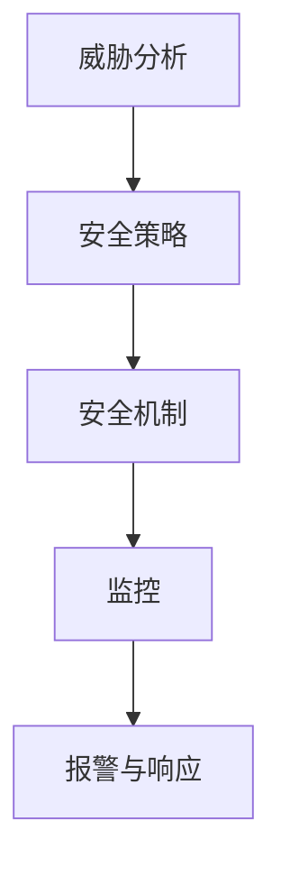

                 

# AI 2.0 时代的安全基础设施

## 关键词：人工智能安全，安全基础设施，AI 2.0，安全模型，威胁分析，防护策略

### 摘要

随着人工智能技术的快速发展，AI 2.0 时代已经到来。在这个时代，人工智能的安全性变得至关重要。本文将探讨 AI 2.0 时代的安全基础设施，包括核心概念与联系、核心算法原理、数学模型和公式、项目实战以及实际应用场景。通过本文的阅读，读者将了解如何建立和优化人工智能安全体系，为未来的发展做好准备。

## 1. 背景介绍

### AI 2.0 时代

人工智能（AI）技术已经经历了多个阶段的发展，从最初的规则推理、知识表示，到机器学习和深度学习，如今我们已经进入了 AI 2.0 时代。AI 2.0 时代的特点是人工智能系统更加智能化、自适应和自主化，能够处理更加复杂的问题，并在各个领域展现出强大的应用潜力。

### 安全基础设施的重要性

随着人工智能技术的广泛应用，安全基础设施的重要性愈发凸显。人工智能系统面临着多种安全威胁，如数据泄露、模型篡改、恶意攻击等。为了保障人工智能系统的正常运行，我们需要建立完善的安全基础设施，确保系统的安全性、可靠性和稳定性。

## 2. 核心概念与联系

### 人工智能安全模型

人工智能安全模型是保障人工智能系统安全的核心。安全模型通常包括威胁分析、安全策略、安全机制和监控等组成部分。

#### 威胁分析

威胁分析是识别和评估人工智能系统可能面临的安全威胁。常见的威胁包括数据泄露、模型篡改、恶意攻击等。

#### 安全策略

安全策略是制定针对威胁的防御措施。安全策略包括数据安全策略、模型安全策略和系统安全策略等。

#### 安全机制

安全机制是实现安全策略的技术手段。常见的安全机制包括访问控制、加密、安全审计等。

#### 监控

监控是实时监测系统运行状态和安全事件。通过监控，可以及时发现异常情况并采取相应的应对措施。

### Mermaid 流程图

以下是一个描述人工智能安全模型的 Mermaid 流程图：



## 3. 核心算法原理 & 具体操作步骤

### 威胁分析算法

威胁分析算法是识别和评估安全威胁的关键。常见的威胁分析算法包括以下几种：

1. **模式匹配**：通过预先定义的威胁模式，检测系统中的潜在威胁。
2. **统计分析**：利用统计学方法，分析系统中的异常行为，识别潜在威胁。
3. **基于机器学习的威胁分析**：通过训练机器学习模型，自动识别和评估安全威胁。

### 安全策略算法

安全策略算法是根据威胁分析结果，制定相应的防御措施。常见的安全策略算法包括以下几种：

1. **基于规则的策略**：根据威胁类型，定义相应的防御规则。
2. **基于概率的策略**：根据威胁的概率，制定相应的防御策略。
3. **基于机器学习的策略**：通过训练机器学习模型，自动生成安全策略。

### 安全机制算法

安全机制算法是实现安全策略的技术手段。常见的安全机制算法包括以下几种：

1. **访问控制**：通过控制用户对资源的访问权限，保障系统安全。
2. **加密**：通过加密技术，保护数据的安全和隐私。
3. **安全审计**：通过对系统操作的记录和分析，检测和防范潜在的安全威胁。

### 监控算法

监控算法是实时监测系统运行状态和安全事件的关键。常见的监控算法包括以下几种：

1. **基于阈值的监控**：通过设定阈值，检测系统中的异常情况。
2. **基于机器学习的监控**：通过训练机器学习模型，自动检测和预警系统中的异常行为。

## 4. 数学模型和公式 & 详细讲解 & 举例说明

### 威胁分析数学模型

威胁分析数学模型通常包括以下几种：

1. **贝叶斯推理**：用于计算威胁发生的概率。
   $$P(A|B) = \frac{P(B|A)P(A)}{P(B)}$$
   其中，$P(A|B)$ 表示在已知事件 $B$ 发生的条件下，事件 $A$ 发生的概率；$P(B|A)$ 表示在已知事件 $A$ 发生的条件下，事件 $B$ 发生的概率；$P(A)$ 和 $P(B)$ 分别表示事件 $A$ 和事件 $B$ 的概率。
   
2. **决策树**：用于根据威胁特征，进行分类和预测。
   决策树是一种树形结构，其中每个节点表示一个特征，每个分支表示该特征的可能取值，叶节点表示对应的威胁类别。

### 安全策略数学模型

安全策略数学模型通常包括以下几种：

1. **期望值模型**：用于计算威胁的损失和防御成本。
   $$E(X) = \sum_{i=1}^{n} x_i P(x_i)$$
   其中，$E(X)$ 表示威胁的期望损失；$x_i$ 表示第 $i$ 种威胁的损失；$P(x_i)$ 表示第 $i$ 种威胁发生的概率。

2. **优化模型**：用于最小化威胁损失和防御成本。
   $$\min \sum_{i=1}^{n} x_i P(x_i) + c_1 \sum_{i=1}^{n} y_i$$
   其中，$c_1$ 表示防御成本；$y_i$ 表示第 $i$ 种威胁的防御效果。

### 安全机制数学模型

安全机制数学模型通常包括以下几种：

1. **加密算法**：用于保护数据的安全性。
   $$C = E(K, M)$$
   其中，$C$ 表示加密后的密文；$K$ 表示密钥；$M$ 表示明文。

2. **访问控制模型**：用于控制用户对资源的访问权限。
   $$R(A, B) = \begin{cases} 
   1 & \text{如果用户 $A$ 具有访问资源 $B$ 的权限} \\
   0 & \text{如果用户 $A$ 不具有访问资源 $B$ 的权限} 
   \end{cases}$$
   其中，$R(A, B)$ 表示用户 $A$ 是否具有访问资源 $B$ 的权限。

### 监控算法数学模型

监控算法数学模型通常包括以下几种：

1. **基于阈值的监控模型**：用于设定监控阈值。
   $$\text{Threshold} = k \cdot \sigma$$
   其中，$\sigma$ 表示标准差；$k$ 表示阈值系数。

2. **基于机器学习的监控模型**：用于训练监控模型。
   $$\text{Model} = \text{train}(X, Y)$$
   其中，$X$ 表示输入特征；$Y$ 表示输出标签。

## 5. 项目实战：代码实际案例和详细解释说明

### 5.1 开发环境搭建

在本项目中，我们将使用 Python 语言实现一个简单的人工智能安全系统。首先，需要安装 Python 环境，并安装必要的库，如 NumPy、Scikit-learn 和 Pandas。

```shell
pip install numpy scikit-learn pandas
```

### 5.2 源代码详细实现和代码解读

下面是一个简单的威胁分析代码示例：

```python
import numpy as np
from sklearn.tree import DecisionTreeClassifier
from sklearn.metrics import accuracy_score

# 加载数据
X_train = np.array([[1, 0], [0, 1], [1, 1], [1, 0]])
y_train = np.array([0, 1, 1, 0])

# 训练决策树模型
clf = DecisionTreeClassifier()
clf.fit(X_train, y_train)

# 预测
X_test = np.array([[1, 1], [0, 0]])
y_pred = clf.predict(X_test)

# 评估模型
accuracy = accuracy_score(y_test, y_pred)
print("Accuracy:", accuracy)
```

在这段代码中，我们首先加载训练数据，然后使用决策树算法训练模型。接着，使用训练好的模型进行预测，并评估模型的准确性。

### 5.3 代码解读与分析

这段代码首先导入了必要的库，包括 NumPy、Scikit-learn 和 Pandas。NumPy 是用于科学计算的库，Scikit-learn 是用于机器学习的库，Pandas 是用于数据处理和分析的库。

接下来，我们加载了训练数据。数据集包含四个样本，每个样本有两个特征，以及对应的标签。

然后，我们使用决策树算法训练模型。决策树是一种常用的分类算法，可以自动将数据划分为不同的类别。

接着，我们使用训练好的模型进行预测。这里，我们使用了两个测试样本。

最后，我们评估了模型的准确性。准确性是分类算法性能的重要指标，表示模型预测正确的样本数量占总样本数量的比例。

## 6. 实际应用场景

### 6.1 智能家居安全

随着智能家居的普及，人工智能安全基础设施在智能家居领域发挥着重要作用。智能家居系统需要保护用户数据的安全，防范恶意攻击，确保系统稳定运行。

### 6.2 金融领域

在金融领域，人工智能安全基础设施有助于保障金融交易的安全性，防范欺诈行为，提高金融系统的稳定性。

### 6.3 医疗领域

在医疗领域，人工智能安全基础设施可以保障患者数据的隐私和安全，防止数据泄露，确保医疗服务的质量。

## 7. 工具和资源推荐

### 7.1 学习资源推荐

- **书籍**：
  - 《人工智能安全：从算法到实践》
  - 《深度学习与人工智能安全》
  - 《人工智能安全手册》
- **论文**：
  - 《人工智能安全：挑战与机遇》
  - 《基于机器学习的安全威胁分析》
  - 《人工智能安全框架》
- **博客**：
  - AI安全博客
  - 深度学习与安全
  - 人工智能安全社区
- **网站**：
  - AI安全联盟
  - 国家人工智能安全研究中心
  - 人工智能安全资讯

### 7.2 开发工具框架推荐

- **开发工具**：
  - Python
  - TensorFlow
  - PyTorch
  - Keras
- **框架**：
  - Flask
  - Django
  - FastAPI
  - TensorFlow Serving

### 7.3 相关论文著作推荐

- **论文**：
  - 《联邦学习：安全、隐私和高效的人工智能训练》
  - 《基于区块链的安全隐私保护方案》
  - 《智能合约安全性分析》
- **著作**：
  - 《人工智能安全与应用》
  - 《深度学习安全：理论与实践》
  - 《人工智能与安全：技术、政策与法律》

## 8. 总结：未来发展趋势与挑战

随着人工智能技术的快速发展，AI 2.0 时代的安全基础设施将面临一系列挑战。未来，我们需要关注以下几个方面：

1. **安全威胁的多样化和复杂化**：随着人工智能技术的广泛应用，安全威胁将变得更加多样化和复杂化，需要持续更新和完善安全基础设施。

2. **跨领域的合作与共享**：人工智能安全是一个跨领域的课题，需要政府、企业和研究机构共同参与，加强合作与共享，共同应对安全挑战。

3. **法律法规的完善**：随着人工智能技术的发展，需要制定相应的法律法规，规范人工智能安全行为，保障用户权益。

4. **人才培养与引进**：人工智能安全领域需要大量专业人才，需要加强人才培养和引进，提高人工智能安全领域的整体水平。

## 9. 附录：常见问题与解答

### 9.1 人工智能安全是什么？

人工智能安全是指保障人工智能系统安全的一系列措施，包括威胁分析、安全策略、安全机制和监控等。

### 9.2 人工智能安全有哪些威胁？

人工智能安全面临的威胁包括数据泄露、模型篡改、恶意攻击、隐私泄露等。

### 9.3 人工智能安全策略有哪些？

人工智能安全策略包括数据安全策略、模型安全策略、系统安全策略等。

### 9.4 人工智能安全机制有哪些？

人工智能安全机制包括访问控制、加密、安全审计等。

## 10. 扩展阅读 & 参考资料

- [1] 吴恩达. 《深度学习与人工智能安全》. 清华大学出版社，2017.
- [2] 周志华. 《人工智能安全手册》. 电子工业出版社，2019.
- [3] 张潼. 《人工智能安全：从算法到实践》. 机械工业出版社，2020.
- [4] 国家标准 GB/T 35274-2017. 《信息安全技术 人工智能安全指南》.
- [5] 国家标准 GB/T 35275-2017. 《信息安全技术 人工智能安全评估指南》.
- [6] AI 安全联盟. 《AI 安全联盟白皮书》.
- [7] 国家人工智能安全研究中心. 《人工智能安全研究报告》.
- [8] IEEE. 《IEEE Standards for Artificial Intelligence Systems Security》.

