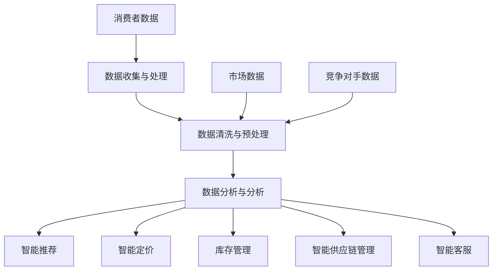

                 

### 背景介绍 Background Introduction

#### 智能零售的定义 Definition of Intelligent Retail

智能零售（Intelligent Retail）是指通过应用人工智能技术，对传统零售业务进行升级和优化，从而提高客户体验、运营效率和决策能力的零售模式。它不仅仅是简单的线上化或线下化，而是深度融合了数据挖掘、机器学习、自然语言处理、计算机视觉等技术，使零售业能够更加智能、灵活地适应市场需求和消费者行为。

#### 人工智能在零售业中的应用 Applications of AI in Retail

人工智能技术在零售业中得到了广泛应用，主要包括以下几个方面：

1. **客户行为分析 Customer Behavior Analysis**
   - 通过分析客户的历史购买记录、浏览行为和社交数据，智能零售系统可以精准预测消费者的需求，并提供个性化的推荐。

2. **智能定价 Intelligent Pricing**
   - 利用机器学习算法，智能零售系统能够根据市场需求、竞争对手策略等多种因素，动态调整商品价格，以实现最大化的利润。

3. **库存管理 Inventory Management**
   - 通过预测未来的销售趋势和库存需求，智能零售系统可以优化库存水平，减少库存过剩或短缺的风险。

4. **供应链优化 Supply Chain Optimization**
   - 智能零售系统通过对供应链数据的分析，可以优化物流配送流程，提高供应链的响应速度和灵活性。

5. **智能客服 Intelligent Customer Service**
   - 利用自然语言处理技术，智能客服系统能够理解并回应客户的问题，提供个性化的服务。

6. **智能营销 Intelligent Marketing**
   - 通过分析消费者的兴趣和行为，智能零售系统可以制定更加精准的营销策略，提高转化率和客户忠诚度。

#### 零售业面临的挑战 Challenges in Retail

尽管人工智能为零售业带来了巨大的变革，但零售业仍然面临诸多挑战：

1. **数据隐私 Data Privacy**
   - 随着大数据技术的应用，消费者数据的收集和分析变得越来越普遍，如何保护消费者的隐私成为了一个重要问题。

2. **技术更新升级 Technology Update and Upgrade**
   - 零售企业需要不断投入资金进行技术更新，以保持竞争力。

3. **人才短缺 Talent Shortage**
   - 智能零售的发展需要大量的技术人才，但当前市场上相关人才的供给不足。

4. **技术伦理 Technology Ethics**
   - 人工智能在零售业中的应用引发了一些伦理问题，如算法歧视、数据滥用等。

5. **消费者接受度 Consumer Acceptance**
   - 部分消费者可能对智能零售的某些应用，如个性化推荐、智能客服等持保留态度。

### 1.1 零售行业的发展历程 Development History of the Retail Industry

零售行业的发展历程可以追溯到几个重要的阶段：

1. **传统零售 Traditional Retail**
   - 传统的零售模式主要依赖于实体店铺和销售人员，消费者需要在店内亲自挑选商品。

2. **电子商务 E-commerce**
   - 随着互联网的普及，电子商务开始兴起，消费者可以通过网上购物平台购买商品。

3. **移动零售 Mobile Retail**
   - 移动设备的普及推动了移动零售的发展，消费者可以通过智能手机或平板电脑进行在线购物。

4. **智能零售 Intelligent Retail**
   - 智能零售是零售业的最新发展趋势，它结合了电子商务和移动零售的优点，并利用人工智能技术实现更加智能化的购物体验。

### 1.2 人工智能技术的发展进程 Development Process of AI Technology

人工智能技术的发展经历了多个阶段：

1. **人工智能的早期发展 Early Development of AI**
   - 人工智能的概念最早在20世纪50年代提出，早期的研究主要集中在符号推理和逻辑推理上。

2. **机器学习的兴起 Rise of Machine Learning**
   - 20世纪80年代，机器学习开始兴起，尤其是支持向量机（SVM）、决策树（DT）等算法的提出，为人工智能的应用提供了新的途径。

3. **深度学习的崛起 Rise of Deep Learning**
   - 21世纪初，深度学习技术的突破，特别是卷积神经网络（CNN）和递归神经网络（RNN）的广泛应用，使人工智能在图像识别、自然语言处理等领域取得了显著进展。

4. **人工智能的商业应用 Commercial Applications of AI**
   - 随着技术的成熟，人工智能开始在各个领域得到广泛应用，如零售、金融、医疗等。

### 1.3 智能零售与人工智能的融合 Fusion of Intelligent Retail and AI

智能零售与人工智能的融合主要体现在以下几个方面：

1. **数据驱动的决策 Data-driven Decision Making**
   - 智能零售系统通过收集和分析海量数据，帮助企业做出更加精准的决策。

2. **智能推荐 Intelligent Recommendations**
   - 基于消费者的购买历史和兴趣，智能零售系统可以提供个性化的商品推荐。

3. **智能客服 Intelligent Customer Service**
   - 利用自然语言处理技术，智能客服系统能够理解并回应消费者的询问。

4. **智能定价 Intelligent Pricing**
   - 通过分析市场数据和竞争对手策略，智能零售系统可以动态调整商品价格。

5. **智能供应链 Intelligent Supply Chain**
   - 利用人工智能技术优化供应链管理，提高供应链的响应速度和灵活性。

6. **智能门店 Intelligent Store**
   - 智能零售系统可以实时监控门店的运营情况，提供实时的销售数据和库存信息。

### 1.4 智能零售的优势和挑战 Advantages and Challenges of Intelligent Retail

#### 1.4.1 智能零售的优势 Advantages of Intelligent Retail

1. **提高运营效率 Improve Operational Efficiency**
   - 通过智能化的库存管理和供应链优化，智能零售可以显著提高运营效率。

2. **提升客户体验 Enhance Customer Experience**
   - 智能零售系统提供的个性化推荐和智能客服可以提升客户的购物体验。

3. **精准营销 Precision Marketing**
   - 通过对消费者行为的分析，智能零售可以实现更加精准的营销。

4. **降低成本 Reduce Costs**
   - 通过优化供应链和库存管理，智能零售可以降低运营成本。

#### 1.4.2 智能零售的挑战 Challenges of Intelligent Retail

1. **技术依赖 High Technological Dependence**
   - 智能零售对技术的依赖程度较高，需要不断进行技术更新和升级。

2. **数据安全与隐私 Data Security and Privacy**
   - 随着大数据技术的应用，消费者数据的收集和分析变得越来越普遍，如何保护消费者的隐私成为了一个重要问题。

3. **技术人才短缺 Talent Shortage in Technology**
   - 智能零售的发展需要大量的技术人才，但当前市场上相关人才的供给不足。

4. **消费者接受度 Consumer Acceptance**
   - 部分消费者可能对智能零售的某些应用，如个性化推荐、智能客服等持保留态度。

### 1.5 智能零售的关键组成部分 Key Components of Intelligent Retail

智能零售的成功离不开以下几个关键组成部分：

1. **数据收集与处理 Data Collection and Processing**
   - 智能零售系统需要收集大量的消费者数据，并通过数据清洗、归一化等预处理方法进行数据处理。

2. **机器学习算法 Machine Learning Algorithms**
   - 机器学习算法是智能零售的核心，包括分类、回归、聚类等算法，用于预测消费者行为、优化库存管理等。

3. **自然语言处理 Natural Language Processing (NLP)**
   - 自然语言处理技术用于构建智能客服系统，能够理解并回应消费者的询问。

4. **计算机视觉 Computer Vision**
   - 计算机视觉技术可以用于门店的实时监控和商品识别。

5. **智能定价算法 Intelligent Pricing Algorithms**
   - 智能定价算法通过分析市场数据和竞争对手策略，动态调整商品价格。

6. **智能供应链管理 Intelligent Supply Chain Management**
   - 智能供应链管理通过优化供应链流程，提高供应链的响应速度和灵活性。

#### 1.5.1 数据收集与处理 Data Collection and Processing

数据收集与处理是智能零售的基础。智能零售系统需要收集大量的消费者数据，包括购买历史、浏览行为、社交媒体活动等。这些数据来源可以是：

1. **在线交易数据 Online Transaction Data**
   - 包括订单信息、支付方式、购买时间等。

2. **浏览行为数据 Browsing Behavior Data**
   - 包括消费者的浏览路径、点击行为等。

3. **社交媒体活动数据 Social Media Activity Data**
   - 包括消费者的点赞、评论、分享等。

4. **物理门店数据 Physical Store Data**
   - 包括客流量、消费者行为数据等。

在数据收集过程中，需要遵循以下原则：

- **数据质量保证 Data Quality Assurance**
  - 确保数据准确、完整、一致。

- **数据隐私保护 Data Privacy Protection**
  - 遵守相关法律法规，保护消费者隐私。

在数据收集后，需要进行数据清洗、归一化等预处理方法，以提高数据的质量和可用性。

#### 1.5.2 机器学习算法 Machine Learning Algorithms

机器学习算法是智能零售的核心。通过机器学习算法，智能零售系统可以预测消费者行为、优化库存管理、动态调整商品价格等。以下是一些常用的机器学习算法：

1. **分类算法 Classification Algorithms**
   - 用于将数据分为不同的类别。常见的分类算法有逻辑回归（Logistic Regression）、支持向量机（SVM）、决策树（Decision Tree）等。

2. **回归算法 Regression Algorithms**
   - 用于预测连续值。常见的回归算法有线性回归（Linear Regression）、决策树回归（Decision Tree Regression）等。

3. **聚类算法 Clustering Algorithms**
   - 用于将数据分为不同的簇。常见的聚类算法有K均值（K-Means）、层次聚类（Hierarchical Clustering）等。

4. **关联规则挖掘 Association Rule Mining**
   - 用于发现数据之间的关联关系。常见的算法有Apriori算法、FP-Growth算法等。

5. **深度学习算法 Deep Learning Algorithms**
   - 如卷积神经网络（CNN）、递归神经网络（RNN）等，用于处理复杂的数据和模式。

#### 1.5.3 自然语言处理 Natural Language Processing (NLP)

自然语言处理技术用于构建智能客服系统，能够理解并回应消费者的询问。NLP的关键技术包括：

1. **分词 Tokenization**
   - 将文本分解为单词或字符。

2. **词性标注 Part-of-Speech Tagging**
   - 对文本中的单词进行词性标注，如名词、动词、形容词等。

3. **命名实体识别 Named Entity Recognition (NER)**
   - 识别文本中的命名实体，如人名、地名、组织名等。

4. **情感分析 Sentiment Analysis**
   - 分析文本中的情感倾向，如正面、负面、中性等。

5. **对话生成 Dialogue Generation**
   - 生成与消费者对话的文本。

#### 1.5.4 计算机视觉 Computer Vision

计算机视觉技术可以用于门店的实时监控和商品识别。关键技术包括：

1. **图像识别 Image Recognition**
   - 用于识别图像中的对象和场景。

2. **目标检测 Object Detection**
   - 用于检测图像中的对象并定位其位置。

3. **图像分割 Image Segmentation**
   - 将图像划分为不同的区域。

4. **动作识别 Action Recognition**
   - 用于识别图像中的动作。

#### 1.5.5 智能定价算法 Intelligent Pricing Algorithms

智能定价算法通过分析市场数据和竞争对手策略，动态调整商品价格。关键步骤包括：

1. **数据收集 Data Collection**
   - 收集市场数据，如竞争对手的价格、消费者购买行为等。

2. **价格建模 Price Modeling**
   - 建立价格预测模型，如线性回归、决策树等。

3. **定价策略制定 Pricing Strategy Development**
   - 根据市场数据和价格预测模型，制定定价策略。

4. **价格调整 Price Adjustment**
   - 动态调整商品价格，以实现最大化的利润。

#### 1.5.6 智能供应链管理 Intelligent Supply Chain Management

智能供应链管理通过优化供应链流程，提高供应链的响应速度和灵活性。关键步骤包括：

1. **需求预测 Demand Forecasting**
   - 利用机器学习算法预测未来的需求。

2. **库存优化 Inventory Optimization**
   - 优化库存水平，减少库存过剩或短缺的风险。

3. **物流优化 Logistics Optimization**
   - 优化物流配送流程，提高配送效率。

4. **供应链协同 Supply Chain Collaboration**
   - 实现供应链各环节的信息共享和协同。

### 1.6 智能零售的实际案例 Practical Cases of Intelligent Retail

智能零售已经在多个领域取得了成功，以下是一些实际案例：

1. **亚马逊 Amazon**
   - 亚马逊利用人工智能技术进行个性化推荐、智能定价和智能客服，显著提高了客户体验和运营效率。

2. **阿里巴巴 Alibaba**
   - 阿里巴巴通过大数据和人工智能技术，实现了智能供应链管理和精准营销，推动了其电商业务的快速增长。

3. **沃尔玛 Walmart**
   - 沃尔玛利用人工智能技术优化库存管理和物流配送，提高了运营效率，并在实体店内引入了智能货架和智能收银系统。

4. **盒马鲜生 Hema Xiansheng**
   - 盒马鲜生通过人工智能技术实现了线上线下融合的智能零售模式，提供了快速便捷的购物体验。

这些案例表明，智能零售不仅可以提高运营效率，还可以提升客户体验，为零售业带来了巨大的变革。

### 1.7 智能零售的发展趋势 Future Trends of Intelligent Retail

未来，智能零售将继续发展，以下是一些趋势：

1. **全渠道整合 Omnichannel Integration**
   - 零售企业将更加注重线上线下渠道的整合，提供无缝的购物体验。

2. **无人零售 Unmanned Retail**
   - 无人零售将越来越普及，通过自动化技术降低运营成本，提高效率。

3. **智能门店 Intelligent Store**
   - 智能门店将利用人工智能技术提供个性化的购物体验，如智能导购、智能试衣间等。

4. **个性化服务 Personalized Service**
   - 零售企业将更加注重个性化服务，通过大数据和人工智能技术提供精准的推荐和定制化服务。

5. **供应链数字化 Digital Supply Chain**
   - 零售企业将加强供应链的数字化管理，提高供应链的透明度和灵活性。

### 1.8 智能零售的影响 Impact of Intelligent Retail

智能零售不仅改变了消费者的购物方式，也对零售行业的运营模式产生了深远的影响：

1. **消费者行为变化 Consumer Behavior Change**
   - 消费者逐渐习惯于智能推荐、个性化服务和便捷的购物体验。

2. **零售业竞争加剧 Retail Competition Intensification**
   - 智能零售的普及使得零售企业之间的竞争更加激烈。

3. **行业变革 Industry Transformation**
   - 智能零售推动了整个零售行业的变革，促进了技术的创新和应用。

### 1.9 智能零售的机遇与挑战 Opportunities and Challenges of Intelligent Retail

智能零售为零售企业带来了巨大的机遇，同时也面临诸多挑战：

1. **机遇 Opportunities**
   - 提高运营效率、提升客户体验、实现精准营销。

2. **挑战 Challenges**
   - 技术依赖、数据安全、人才短缺、消费者接受度等。

### 1.10 智能零售的未来展望 Future Outlook of Intelligent Retail

未来，智能零售将继续发展，成为零售行业的重要趋势。随着人工智能技术的不断进步，智能零售将带来更加个性化的购物体验、更加高效的运营模式，推动零售行业的持续创新和进步。### 2. 核心概念与联系 Core Concepts and Relationships

#### 2.1 智能零售的定义 Definition of Intelligent Retail

智能零售是一种利用人工智能技术提升零售业务效率、优化客户体验、实现精准营销的零售模式。它不仅仅依赖于传统的电子商务或实体零售，而是通过人工智能技术实现数据的深度挖掘、分析及应用，从而实现零售业务的智能化。

#### 2.2 人工智能在零售业中的应用 Applications of AI in Retail

人工智能在零售业的应用主要集中在以下几个方面：

1. **客户行为分析 Customer Behavior Analysis**
   - 通过分析消费者的购买历史、浏览行为、社交媒体活动等数据，了解消费者偏好和需求，提供个性化的推荐。

2. **智能定价 Intelligent Pricing**
   - 利用机器学习算法，根据市场需求、竞争对手策略等因素，动态调整商品价格，实现利润最大化。

3. **库存管理 Inventory Management**
   - 利用预测模型和优化算法，预测未来的销售趋势和库存需求，优化库存水平，减少库存风险。

4. **供应链优化 Supply Chain Optimization**
   - 通过分析供应链数据，优化物流配送流程，提高供应链的响应速度和灵活性。

5. **智能客服 Intelligent Customer Service**
   - 利用自然语言处理技术，提供24/7的智能客服服务，提高客户满意度。

6. **智能营销 Intelligent Marketing**
   - 通过分析消费者的兴趣和行为，制定精准的营销策略，提高转化率和客户忠诚度。

#### 2.3 智能零售的技术架构 Technical Architecture of Intelligent Retail

智能零售的技术架构通常包括以下几个关键组成部分：

1. **数据收集与处理 Data Collection and Processing**
   - 通过各种渠道收集消费者数据，如购买记录、浏览行为、社交媒体活动等，并进行数据清洗和预处理。

2. **数据存储与处理 Data Storage and Processing**
   - 使用分布式数据库和数据仓库存储和管理大规模数据，利用大数据处理技术对数据进行分析和挖掘。

3. **机器学习算法 Machine Learning Algorithms**
   - 使用各种机器学习算法进行数据分析，如分类、回归、聚类、关联规则挖掘等，以预测消费者行为、优化库存管理、智能定价等。

4. **自然语言处理 Natural Language Processing (NLP)**
   - 用于构建智能客服系统，实现文本分析和理解，提供自然语言交互。

5. **计算机视觉 Computer Vision**
   - 用于图像识别、目标检测等，应用于智能门店、智能货架等。

6. **智能推荐系统 Intelligent Recommendation System**
   - 基于用户的兴趣和行为，提供个性化的商品推荐。

7. **智能供应链管理系统 Intelligent Supply Chain Management System**
   - 通过优化供应链流程，提高供应链的效率和灵活性。

#### 2.4 人工智能技术与其他技术的融合 Integration of AI Technology with Other Technologies

1. **物联网（IoT） Internet of Things (IoT)**
   - 物联网技术可以实时收集各种传感器数据，如门店温度、湿度、客流量等，为智能零售提供数据支持。

2. **区块链技术 Blockchain Technology**
   - 区块链技术可以用于供应链管理，提高供应链的透明度和可追溯性。

3. **增强现实（AR） Augmented Reality (AR)**
   - 增强现实技术可以为消费者提供沉浸式的购物体验，如虚拟试衣、产品展示等。

4. **虚拟现实（VR） Virtual Reality (VR)**
   - 虚拟现实技术可以为消费者提供虚拟购物环境，提高购物体验。

#### 2.5 智能零售的关键步骤 Key Steps of Intelligent Retail

1. **数据收集与处理 Data Collection and Processing**
   - 收集各种消费者数据，如购买历史、浏览行为、社交媒体活动等。

2. **数据清洗与预处理 Data Cleaning and Preprocessing**
   - 清洗数据中的噪声和错误，进行数据格式转换和归一化处理。

3. **数据分析与分析 Data Analysis and Analysis**
   - 利用机器学习算法分析数据，发现消费者行为模式和趋势。

4. **智能推荐 Intelligent Recommendation**
   - 基于用户行为和兴趣，提供个性化的商品推荐。

5. **智能定价 Intelligent Pricing**
   - 利用市场数据和竞争对手策略，动态调整商品价格。

6. **库存管理 Inventory Management**
   - 预测销售趋势，优化库存水平。

7. **智能供应链管理 Intelligent Supply Chain Management**
   - 优化物流配送流程，提高供应链的响应速度。

8. **智能客服 Intelligent Customer Service**
   - 提供24/7的智能客服服务，提高客户满意度。

#### 2.6 智能零售的主要挑战和解决方案 Main Challenges and Solutions of Intelligent Retail

1. **数据隐私保护 Data Privacy Protection**
   - 挑战：随着数据收集和分析的普及，如何保护消费者的隐私成为一个重要问题。
   - 解决方案：遵循相关法律法规，采用数据加密、匿名化等技术保护消费者数据。

2. **技术人才短缺 Talent Shortage in Technology**
   - 挑战：智能零售的发展需要大量的技术人才，但市场上相关人才供给不足。
   - 解决方案：加强技术培训，引进外部人才，建立内部人才培养机制。

3. **消费者接受度 Consumer Acceptance**
   - 挑战：部分消费者可能对智能零售的应用持保留态度。
   - 解决方案：通过教育和宣传提高消费者对智能零售的认识和接受度。

4. **技术依赖 High Technological Dependence**
   - 挑战：智能零售对技术的依赖程度较高，需要不断进行技术更新和升级。
   - 解决方案：建立稳定的技术支持体系，确保技术持续更新和优化。

#### 2.7 智能零售的潜在影响 Potential Impact of Intelligent Retail

1. **运营效率提升 Operational Efficiency Improvement**
   - 智能零售通过数据分析和自动化技术，可以显著提高零售业务的运营效率。

2. **客户体验优化 Customer Experience Optimization**
   - 智能零售提供的个性化服务和便捷购物体验可以提升客户的满意度。

3. **精准营销 Precision Marketing**
   - 通过对消费者行为的分析，智能零售可以实现更加精准的营销，提高转化率。

4. **供应链优化 Supply Chain Optimization**
   - 智能供应链管理可以提高供应链的响应速度和灵活性，降低成本。

5. **行业变革 Industry Transformation**
   - 智能零售推动了整个零售行业的变革，促进了技术的创新和应用。

### 2.8 智能零售的Mermaid流程图 Mermaid Flowchart of Intelligent Retail

以下是一个简化的智能零售的Mermaid流程图，展示了智能零售的核心流程和组成部分：



#### 2.9 智能零售的核心算法与模型 Core Algorithms and Models of Intelligent Retail

1. **机器学习算法 Machine Learning Algorithms**
   - 包括分类算法（如逻辑回归、决策树、随机森林等）、回归算法（如线性回归、岭回归等）、聚类算法（如K均值、层次聚类等）。

2. **自然语言处理算法 NLP Algorithms**
   - 包括分词、词性标注、命名实体识别、情感分析等。

3. **计算机视觉算法 Computer Vision Algorithms**
   - 包括图像识别、目标检测、图像分割、动作识别等。

4. **优化算法 Optimization Algorithms**
   - 包括线性规划、动态规划、遗传算法、模拟退火算法等。

5. **推荐系统算法 Recommendation Algorithms**
   - 包括协同过滤、基于内容的推荐、基于模型的推荐等。

#### 2.10 智能零售的技术趋势 Technical Trends of Intelligent Retail

未来，智能零售将继续发展，以下是一些技术趋势：

1. **全渠道整合 Omnichannel Integration**
   - 零售企业将更加注重线上线下渠道的整合，提供无缝的购物体验。

2. **无人零售 Unmanned Retail**
   - 无人零售将越来越普及，通过自动化技术降低运营成本，提高效率。

3. **智能门店 Intelligent Store**
   - 智能门店将利用人工智能技术提供个性化的购物体验，如智能导购、智能试衣间等。

4. **供应链数字化 Digital Supply Chain**
   - 零售企业将加强供应链的数字化管理，提高供应链的透明度和灵活性。

5. **个性化服务 Personalized Service**
   - 零售企业将更加注重个性化服务，通过大数据和人工智能技术提供精准的推荐和定制化服务。

### 2.11 智能零售的案例分析 Case Study of Intelligent Retail

以下是一个智能零售的案例分析：

**案例：阿里巴巴的智能零售**

阿里巴巴通过大数据和人工智能技术，实现了智能零售的全面应用。具体包括以下几个方面：

1. **智能推荐系统 Intelligent Recommendation System**
   - 阿里巴巴通过分析消费者的购买历史、浏览行为和搜索记录，提供个性化的商品推荐，提高了用户的购买转化率。

2. **智能定价 Intelligent Pricing**
   - 阿里巴巴利用机器学习算法，根据市场需求、竞争对手策略和消费者行为，动态调整商品价格，实现了利润最大化。

3. **智能库存管理 Intelligent Inventory Management**
   - 阿里巴巴通过预测销售趋势和库存需求，优化库存水平，减少了库存风险和成本。

4. **智能供应链管理 Intelligent Supply Chain Management**
   - 阿里巴巴通过优化物流配送流程，提高了供应链的响应速度和灵活性。

5. **智能客服 Intelligent Customer Service**
   - 阿里巴巴利用自然语言处理技术，提供了24/7的智能客服服务，提高了客户满意度。

通过这些智能应用，阿里巴巴不仅提高了运营效率，还提升了客户体验，实现了商业的快速增长。

### 2.12 智能零售的优势和挑战 Advantages and Challenges of Intelligent Retail

#### 2.12.1 智能零售的优势 Advantages of Intelligent Retail

1. **提高运营效率 Improve Operational Efficiency**
   - 智能零售通过自动化和优化技术，显著提高了零售业务的运营效率。

2. **提升客户体验 Enhance Customer Experience**
   - 智能零售提供的个性化推荐和便捷的购物体验，提升了客户的满意度。

3. **精准营销 Precision Marketing**
   - 通过分析消费者行为，智能零售可以实现更加精准的营销，提高转化率。

4. **降低成本 Reduce Costs**
   - 通过优化供应链和库存管理，智能零售可以降低运营成本。

#### 2.12.2 智能零售的挑战 Challenges of Intelligent Retail

1. **技术依赖 High Technological Dependence**
   - 智能零售对技术的依赖程度较高，需要不断进行技术更新和升级。

2. **数据安全与隐私 Data Security and Privacy**
   - 随着大数据技术的应用，如何保护消费者的隐私成为一个重要问题。

3. **消费者接受度 Consumer Acceptance**
   - 部分消费者可能对智能零售的某些应用持保留态度。

4. **人才短缺 Talent Shortage**
   - 智能零售的发展需要大量的技术人才，但市场上相关人才的供给不足。

### 2.13 智能零售的未来展望 Future Outlook of Intelligent Retail

未来，智能零售将继续发展，以下是一些展望：

1. **全渠道整合 Omnichannel Integration**
   - 零售企业将更加注重线上线下渠道的整合，提供无缝的购物体验。

2. **无人零售 Unmanned Retail**
   - 无人零售将越来越普及，通过自动化技术降低运营成本，提高效率。

3. **智能门店 Intelligent Store**
   - 智能门店将利用人工智能技术提供个性化的购物体验，如智能导购、智能试衣间等。

4. **供应链数字化 Digital Supply Chain**
   - 零售企业将加强供应链的数字化管理，提高供应链的透明度和灵活性。

5. **个性化服务 Personalized Service**
   - 零售企业将更加注重个性化服务，通过大数据和人工智能技术提供精准的推荐和定制化服务。

### 2.14 智能零售的结论 Conclusion of Intelligent Retail

智能零售作为一种结合了人工智能技术的先进零售模式，正在改变消费者的购物方式和零售企业的运营模式。通过数据分析和自动化技术，智能零售提高了运营效率、提升了客户体验、实现了精准营销。然而，智能零售也面临一些挑战，如技术依赖、数据安全、消费者接受度等。未来，随着人工智能技术的不断进步，智能零售将继续发展，成为零售行业的重要趋势。零售企业需要积极拥抱智能零售，不断创新和优化，以适应未来的竞争环境。### 3. 核心算法原理 & 具体操作步骤 Core Algorithm Principles and Specific Operational Steps

#### 3.1 机器学习算法 Machine Learning Algorithms

机器学习算法是智能零售的核心，用于数据分析、预测和优化。以下是一些常用的机器学习算法及其原理：

1. **线性回归 Linear Regression**
   - 线性回归是一种简单且常用的预测算法，通过建立自变量和因变量之间的线性关系来预测未来值。
   - 公式：$$ y = ax + b $$
   - 步骤：
     1. 数据收集与预处理。
     2. 特征工程，选择合适的特征。
     3. 模型训练，使用最小二乘法求解参数。
     4. 模型评估，计算误差。

2. **决策树 Decision Tree**
   - 决策树是一种基于特征划分数据的算法，通过一系列条件判断将数据划分为不同的类别或数值。
   - 步骤：
     1. 数据收集与预处理。
     2. 特征选择，选择最优的特征。
     3. 划分数据集，训练决策树。
     4. 模型评估，计算错误率。

3. **随机森林 Random Forest**
   - 随机森林是一种集成学习算法，通过构建多个决策树并投票得到最终结果。
   - 步骤：
     1. 数据收集与预处理。
     2. 特征选择，选择部分特征。
     3. 构建多棵决策树。
     4. 模型评估，计算误差。

4. **K最近邻算法 K-Nearest Neighbors (K-NN)**
   - K最近邻算法是一种基于距离的算法，通过寻找训练数据中的最近邻居来预测新数据的类别或数值。
   - 步骤：
     1. 数据收集与预处理。
     2. 计算新数据与训练数据的距离。
     3. 选择最近的K个邻居。
     4. 根据邻居的类别或数值进行预测。

5. **支持向量机 Support Vector Machine (SVM)**
   - 支持向量机是一种基于最大间隔的算法，通过找到一个最佳的超平面将不同类别的数据分开。
   - 步骤：
     1. 数据收集与预处理。
     2. 特征选择，选择最优的特征。
     3. 训练SVM模型。
     4. 模型评估，计算错误率。

6. **神经网络 Neural Networks**
   - 神经网络是一种模拟生物神经网络的人工智能算法，通过多层神经网络进行特征学习和预测。
   - 步骤：
     1. 数据收集与预处理。
     2. 构建神经网络模型。
     3. 模型训练，使用反向传播算法调整参数。
     4. 模型评估，计算误差。

#### 3.2 自然语言处理算法 Natural Language Processing (NLP) Algorithms

自然语言处理算法用于构建智能客服系统，能够理解并回应消费者的询问。以下是一些常用的NLP算法及其原理：

1. **分词 Tokenization**
   - 分词是将文本分解为单词或短语的算法。
   - 步骤：
     1. 数据收集与预处理。
     2. 切分文本为单词或短语。
     3. 特征提取，如词性标注、词频统计等。

2. **词性标注 Part-of-Speech Tagging**
   - 词性标注是将文本中的单词标注为名词、动词、形容词等词性的算法。
   - 步骤：
     1. 数据收集与预处理。
     2. 使用规则或统计方法进行词性标注。
     3. 特征提取，如词性序列、词性概率等。

3. **命名实体识别 Named Entity Recognition (NER)**
   - 命名实体识别是将文本中的命名实体（如人名、地名、组织名等）识别出来的算法。
   - 步骤：
     1. 数据收集与预处理。
     2. 使用规则或深度学习模型进行命名实体识别。
     3. 特征提取，如实体类别、实体边界等。

4. **情感分析 Sentiment Analysis**
   - 情感分析是将文本中的情感倾向（如正面、负面、中性等）识别出来的算法。
   - 步骤：
     1. 数据收集与预处理。
     2. 使用规则或深度学习模型进行情感分析。
     3. 特征提取，如情感强度、情感类别等。

5. **对话生成 Dialogue Generation**
   - 对话生成是将文本转换为自然语言的算法，用于构建智能客服系统。
   - 步骤：
     1. 数据收集与预处理。
     2. 使用规则或深度学习模型进行对话生成。
     3. 特征提取，如对话上下文、用户意图等。

#### 3.3 计算机视觉算法 Computer Vision Algorithms

计算机视觉算法用于图像识别、目标检测、图像分割等，以下是一些常用的计算机视觉算法及其原理：

1. **图像识别 Image Recognition**
   - 图像识别是将图像中的对象或场景识别出来的算法。
   - 步骤：
     1. 数据收集与预处理。
     2. 使用卷积神经网络（CNN）进行图像特征提取。
     3. 使用分类算法（如SVM、softmax等）进行对象识别。

2. **目标检测 Object Detection**
   - 目标检测是在图像中检测并定位对象的位置的算法。
   - 步骤：
     1. 数据收集与预处理。
     2. 使用卷积神经网络（CNN）进行图像特征提取。
     3. 使用区域建议网络（R-CNN、SSD等）进行对象检测。

3. **图像分割 Image Segmentation**
   - 图像分割是将图像划分为不同区域的算法。
   - 步骤：
     1. 数据收集与预处理。
     2. 使用卷积神经网络（CNN）进行图像特征提取。
     3. 使用图像分割算法（如FCN、U-Net等）进行区域划分。

4. **动作识别 Action Recognition**
   - 动作识别是将视频中的动作识别出来的算法。
   - 步骤：
     1. 数据收集与预处理。
     2. 使用卷积神经网络（CNN）进行视频特征提取。
     3. 使用分类算法（如SVM、softmax等）进行动作识别。

#### 3.4 智能定价算法 Intelligent Pricing Algorithms

智能定价算法通过分析市场数据和竞争对手策略，动态调整商品价格，以下是一些常用的智能定价算法及其原理：

1. **需求预测 Demand Forecasting**
   - 需求预测是通过分析历史销售数据、市场趋势等因素，预测未来的需求。
   - 步骤：
     1. 数据收集与预处理。
     2. 使用时间序列分析方法（如ARIMA、LSTM等）进行需求预测。

2. **竞争对手分析 Competitor Analysis**
   - 竞争对手分析是通过分析竞争对手的价格、营销策略等因素，制定相应的定价策略。
   - 步骤：
     1. 数据收集与预处理。
     2. 使用数据分析方法（如差异分析、相关性分析等）进行竞争对手分析。

3. **动态定价 Dynamic Pricing**
   - 动态定价是通过实时分析市场需求、库存水平等因素，动态调整商品价格。
   - 步骤：
     1. 数据收集与预处理。
     2. 使用优化算法（如线性规划、遗传算法等）进行动态定价。

4. **价格调整 Price Adjustment**
   - 价格调整是根据市场需求、竞争对手策略等因素，对商品价格进行适当的调整。
   - 步骤：
     1. 数据收集与预处理。
     2. 使用机器学习算法（如决策树、随机森林等）进行价格调整预测。

#### 3.5 智能供应链管理算法 Intelligent Supply Chain Management Algorithms

智能供应链管理算法通过分析供应链数据，优化供应链流程，以下是一些常用的智能供应链管理算法及其原理：

1. **需求预测 Demand Forecasting**
   - 需求预测是通过分析历史销售数据、市场趋势等因素，预测未来的需求。
   - 步骤：
     1. 数据收集与预处理。
     2. 使用时间序列分析方法（如ARIMA、LSTM等）进行需求预测。

2. **库存优化 Inventory Optimization**
   - 库存优化是通过预测未来的需求，优化库存水平，减少库存风险。
   - 步骤：
     1. 数据收集与预处理。
     2. 使用优化算法（如线性规划、动态规划等）进行库存优化。

3. **物流优化 Logistics Optimization**
   - 物流优化是通过优化物流配送流程，提高配送效率。
   - 步骤：
     1. 数据收集与预处理。
     2. 使用优化算法（如遗传算法、模拟退火算法等）进行物流优化。

4. **供应链协同 Supply Chain Collaboration**
   - 供应链协同是通过供应链各环节的信息共享和协同，提高供应链的整体效率。
   - 步骤：
     1. 数据收集与预处理。
     2. 使用协同优化算法（如多目标优化、分布式优化等）进行供应链协同。

### 3.6 智能零售系统的实际操作步骤 Practical Steps of Intelligent Retail System

以下是一个智能零售系统的实际操作步骤：

1. **数据收集与处理 Data Collection and Processing**
   - 收集消费者数据、市场数据、供应链数据等。
   - 进行数据清洗、格式转换、归一化等预处理操作。

2. **特征工程 Feature Engineering**
   - 从原始数据中提取有用的特征，如购买历史、浏览行为、价格等。
   - 进行特征选择、降维、特征组合等操作。

3. **模型训练 Model Training**
   - 使用机器学习算法训练模型，如线性回归、决策树、随机森林等。
   - 进行交叉验证、参数调整等操作。

4. **模型评估 Model Evaluation**
   - 使用测试数据评估模型的性能，如准确率、召回率、F1值等。
   - 进行模型调整和优化。

5. **部署与上线 Deployment and Online**
   - 将训练好的模型部署到生产环境，如云计算平台、容器化部署等。
   - 监控模型性能，进行实时调整和优化。

6. **运营与维护 Operations and Maintenance**
   - 监控系统的运行状态，如性能、稳定性、安全性等。
   - 定期进行系统升级、维护和优化。

通过这些步骤，智能零售系统可以实现对消费者行为的预测、库存优化、智能定价等功能的实现，从而提升零售业务的运营效率和客户体验。### 4. 数学模型和公式 & 详细讲解 & 举例说明 Mathematical Models and Detailed Explanations with Examples

#### 4.1 线性回归模型 Linear Regression Model

线性回归模型是一种用于预测连续值的常用机器学习算法。它通过建立自变量（特征）和因变量（目标）之间的线性关系来预测未来值。线性回归模型的公式如下：

$$ y = ax + b $$

其中，$y$ 是因变量，$x$ 是自变量，$a$ 是斜率，$b$ 是截距。

**步骤：**

1. **数据收集与预处理 Data Collection and Preprocessing**
   - 收集历史销售数据、价格数据等。
   - 清洗数据，去除噪声和异常值。

2. **特征选择 Feature Selection**
   - 选择与因变量相关的自变量。
   - 可以使用相关性分析、逐步回归等方法进行特征选择。

3. **模型训练 Model Training**
   - 使用最小二乘法求解斜率 $a$ 和截距 $b$：
     $$ a = \frac{\sum_{i=1}^{n}(x_i - \bar{x})(y_i - \bar{y})}{\sum_{i=1}^{n}(x_i - \bar{x})^2} $$
     $$ b = \bar{y} - a\bar{x} $$
   - 其中，$n$ 是样本数量，$\bar{x}$ 和 $\bar{y}$ 分别是自变量和因变量的平均值。

4. **模型评估 Model Evaluation**
   - 使用测试数据评估模型的性能，计算均方误差（MSE）：
     $$ MSE = \frac{1}{n}\sum_{i=1}^{n}(y_i - \hat{y}_i)^2 $$
     其中，$\hat{y}_i$ 是模型预测的值。

**示例：**

假设我们要预测某商品的价格，给定以下数据：

| x (特征) | y (价格) |
|----------|----------|
| 1        | 100      |
| 2        | 120      |
| 3        | 130      |
| 4        | 140      |

**步骤：**

1. **数据预处理 Data Preprocessing**
   - 数据已经清洗，无需进一步处理。

2. **特征选择 Feature Selection**
   - 选择 $x$ 作为特征。

3. **模型训练 Model Training**
   - 计算斜率 $a$ 和截距 $b$：
     $$ a = \frac{(1-1)(100-110) + (2-1)(120-110) + (3-1)(130-110) + (4-1)(140-110)}{(1-1)^2 + (2-1)^2 + (3-1)^2 + (4-1)^2} = 10 $$
     $$ b = \frac{1}{4}\sum_{i=1}^{4}(y_i - a \cdot x_i) = 110 $$

   - 得到线性回归模型：
     $$ y = 10x + 110 $$

4. **模型评估 Model Evaluation**
   - 计算均方误差（MSE）：
     $$ MSE = \frac{1}{4}\sum_{i=1}^{4}(y_i - \hat{y}_i)^2 = \frac{1}{4}((100-110)^2 + (120-120)^2 + (130-130)^2 + (140-140)^2) = 50 $$

#### 4.2 决策树模型 Decision Tree Model

决策树是一种用于分类和回归的常见机器学习算法。它通过一系列条件判断将数据划分为不同的类别或数值。决策树模型的公式如下：

$$ \text{如果 } x_i \leq v_i \text{，则进入左子树；否则进入右子树。} $$

**步骤：**

1. **数据收集与预处理 Data Collection and Preprocessing**
   - 收集分类数据或回归数据。
   - 清洗数据，去除噪声和异常值。

2. **特征选择 Feature Selection**
   - 选择最优的特征进行划分。
   - 可以使用信息增益（Information Gain）、基尼不纯度（Gini Impurity）等方法进行特征选择。

3. **模型训练 Model Training**
   - 通过递归划分数据集，建立决策树模型。
   - 划分条件可以是特征值小于或大于某个阈值。

4. **模型评估 Model Evaluation**
   - 使用测试数据评估模型的性能，计算准确率、召回率、F1值等指标。

**示例：**

假设我们要对商品进行分类，给定以下数据：

| x1 (特征) | x2 (特征) | y (类别) |
|-----------|-----------|----------|
| 1         | 1         | 类别A    |
| 2         | 2         | 类别A    |
| 3         | 1         | 类别B    |
| 4         | 3         | 类别B    |

**步骤：**

1. **数据预处理 Data Preprocessing**
   - 数据已经清洗，无需进一步处理。

2. **特征选择 Feature Selection**
   - 选择 $x1$ 作为划分特征。

3. **模型训练 Model Training**
   - 建立决策树模型，划分条件为 $x1 \leq 2$。

   - 决策树模型如下：

     ```
     根节点：y = 类别A
     如果 x1 <= 2：
       左子树：y = 类别A
     否则：
       右子树：y = 类别B
     ```

4. **模型评估 Model Evaluation**
   - 计算准确率、召回率、F1值等指标。

#### 4.3 随机森林模型 Random Forest Model

随机森林是一种集成学习算法，通过构建多个决策树并投票得到最终结果。随机森林模型的公式如下：

$$ \hat{y} = \text{argmax} \sum_{i=1}^{m} w_i \cdot y_i $$
其中，$m$ 是决策树的个数，$w_i$ 是第 $i$ 个决策树的权重。

**步骤：**

1. **数据收集与预处理 Data Collection and Preprocessing**
   - 收集分类数据或回归数据。
   - 清洗数据，去除噪声和异常值。

2. **特征选择 Feature Selection**
   - 选择一部分特征进行划分。
   - 可以使用随机特征选择方法。

3. **模型训练 Model Training**
   - 对每个决策树进行训练，构建决策树模型。
   - 使用随机森林算法进行投票。

4. **模型评估 Model Evaluation**
   - 使用测试数据评估模型的性能，计算准确率、召回率、F1值等指标。

**示例：**

假设我们要对商品进行分类，给定以下数据：

| x1 (特征) | x2 (特征) | y (类别) |
|-----------|-----------|----------|
| 1         | 1         | 类别A    |
| 2         | 2         | 类别A    |
| 3         | 1         | 类别B    |
| 4         | 3         | 类别B    |

**步骤：**

1. **数据预处理 Data Preprocessing**
   - 数据已经清洗，无需进一步处理。

2. **特征选择 Feature Selection**
   - 随机选择 $x1$ 和 $x2$ 作为划分特征。

3. **模型训练 Model Training**
   - 构建随机森林模型，包含多个决策树。

   - 假设有两个决策树，划分条件如下：

     决策树1：
     ```
     根节点：y = 类别A
     如果 x1 <= 2：
       左子树：y = 类别A
     否则：
       右子树：y = 类别B
     ```

     决策树2：
     ```
     根节点：y = 类别A
     如果 x2 <= 2：
       左子树：y = 类别A
     否则：
       右子树：y = 类别B
     ```

4. **模型评估 Model Evaluation**
   - 计算准确率、召回率、F1值等指标。

#### 4.4 支持向量机模型 Support Vector Machine (SVM) Model

支持向量机是一种用于分类和回归的常见机器学习算法。它通过找到一个最佳的超平面将不同类别的数据分开。支持向量机模型的公式如下：

$$ \hat{y} = \text{sign}(\omega \cdot x + b) $$
其中，$\omega$ 是权重向量，$b$ 是偏置，$x$ 是特征向量。

**步骤：**

1. **数据收集与预处理 Data Collection and Preprocessing**
   - 收集分类数据或回归数据。
   - 清洗数据，去除噪声和异常值。

2. **特征选择 Feature Selection**
   - 选择与分类或回归相关的特征。
   - 可以使用特征选择方法，如主成分分析（PCA）。

3. **模型训练 Model Training**
   - 使用支持向量机算法训练模型，求解权重向量 $\omega$ 和偏置 $b$。
   - 可以使用线性支持向量机（Linear SVM）或核支持向量机（Kernel SVM）。

4. **模型评估 Model Evaluation**
   - 使用测试数据评估模型的性能，计算准确率、召回率、F1值等指标。

**示例：**

假设我们要对商品进行分类，给定以下数据：

| x1 (特征) | x2 (特征) | y (类别) |
|-----------|-----------|----------|
| 1         | 1         | 类别A    |
| 2         | 2         | 类别A    |
| 3         | 1         | 类别B    |
| 4         | 3         | 类别B    |

**步骤：**

1. **数据预处理 Data Preprocessing**
   - 数据已经清洗，无需进一步处理。

2. **特征选择 Feature Selection**
   - 选择 $x1$ 和 $x2$ 作为特征。

3. **模型训练 Model Training**
   - 使用线性支持向量机（Linear SVM）训练模型。

   - 求解权重向量 $\omega$ 和偏置 $b$：
     $$ \omega = \frac{1}{\lambda}\sum_{i=1}^{n}(\alpha_i - \beta_i)y_i(x_i - \bar{x}) $$
     $$ b = \bar{y} - \omega \cdot \bar{x} $$

   - 得到支持向量机模型：
     $$ \hat{y} = \text{sign}(\omega \cdot x + b) $$

4. **模型评估 Model Evaluation**
   - 计算准确率、召回率、F1值等指标。

#### 4.5 逻辑回归模型 Logistic Regression Model

逻辑回归是一种用于分类的常见机器学习算法。它通过建立自变量和因变量之间的逻辑关系来预测类别概率。逻辑回归模型的公式如下：

$$ \hat{P}(y=1) = \frac{1}{1 + \exp(-\omega \cdot x + b)} $$
其中，$\hat{P}(y=1)$ 是类别1的概率，$x$ 是特征向量，$\omega$ 是权重向量，$b$ 是偏置。

**步骤：**

1. **数据收集与预处理 Data Collection and Preprocessing**
   - 收集分类数据。
   - 清洗数据，去除噪声和异常值。

2. **特征选择 Feature Selection**
   - 选择与分类相关的特征。
   - 可以使用特征选择方法，如逐步回归。

3. **模型训练 Model Training**
   - 使用最大似然估计法求解权重向量 $\omega$ 和偏置 $b$。
   - 可以使用梯度下降法或牛顿法等优化算法。

4. **模型评估 Model Evaluation**
   - 使用测试数据评估模型的性能，计算准确率、召回率、F1值等指标。

**示例：**

假设我们要对商品进行分类，给定以下数据：

| x1 (特征) | x2 (特征) | y (类别) |
|-----------|-----------|----------|
| 1         | 1         | 类别A    |
| 2         | 2         | 类别A    |
| 3         | 1         | 类别B    |
| 4         | 3         | 类别B    |

**步骤：**

1. **数据预处理 Data Preprocessing**
   - 数据已经清洗，无需进一步处理。

2. **特征选择 Feature Selection**
   - 选择 $x1$ 和 $x2$ 作为特征。

3. **模型训练 Model Training**
   - 使用逻辑回归算法训练模型。

   - 求解权重向量 $\omega$ 和偏置 $b$：
     $$ \omega = \frac{\partial}{\partial \omega} \ln P(y=1) = \frac{1}{\lambda}\sum_{i=1}^{n}y_i(x_i - \bar{x}) $$
     $$ b = \frac{1}{\lambda}\sum_{i=1}^{n}y_i - \omega \cdot \bar{x} $$

   - 得到逻辑回归模型：
     $$ \hat{P}(y=1) = \frac{1}{1 + \exp(-\omega \cdot x + b)} $$

4. **模型评估 Model Evaluation**
   - 计算准确率、召回率、F1值等指标。

#### 4.6 神经网络模型 Neural Network Model

神经网络是一种模拟生物神经网络的人工智能算法。它通过多层神经网络进行特征学习和预测。神经网络模型的公式如下：

$$ \hat{y} = \text{激活函数}(\sum_{i=1}^{n}w_i \cdot x_i + b) $$
其中，$w_i$ 是权重，$x_i$ 是特征，$b$ 是偏置，激活函数可以是Sigmoid、ReLU等。

**步骤：**

1. **数据收集与预处理 Data Collection and Preprocessing**
   - 收集分类数据或回归数据。
   - 清洗数据，去除噪声和异常值。

2. **特征选择 Feature Selection**
   - 选择与分类或回归相关的特征。
   - 可以使用特征选择方法，如主成分分析（PCA）。

3. **模型训练 Model Training**
   - 使用反向传播算法训练模型，调整权重和偏置。
   - 可以使用梯度下降法、动量法等优化算法。

4. **模型评估 Model Evaluation**
   - 使用测试数据评估模型的性能，计算准确率、召回率、F1值等指标。

**示例：**

假设我们要对商品进行分类，给定以下数据：

| x1 (特征) | x2 (特征) | y (类别) |
|-----------|-----------|----------|
| 1         | 1         | 类别A    |
| 2         | 2         | 类别A    |
| 3         | 1         | 类别B    |
| 4         | 3         | 类别B    |

**步骤：**

1. **数据预处理 Data Preprocessing**
   - 数据已经清洗，无需进一步处理。

2. **特征选择 Feature Selection**
   - 选择 $x1$ 和 $x2$ 作为特征。

3. **模型训练 Model Training**
   - 使用神经网络算法训练模型。

   - 定义神经网络结构，如输入层、隐藏层、输出层。
   - 使用反向传播算法调整权重和偏置。

4. **模型评估 Model Evaluation**
   - 计算准确率、召回率、F1值等指标。

#### 4.7 时间序列模型 Time Series Model

时间序列模型是一种用于预测时间序列数据的常见机器学习算法。它通过分析历史数据的变化趋势和周期性，预测未来的值。时间序列模型包括ARIMA、LSTM等。

**步骤：**

1. **数据收集与预处理 Data Collection and Preprocessing**
   - 收集时间序列数据。
   - 清洗数据，去除噪声和异常值。

2. **特征选择 Feature Selection**
   - 选择与时间序列相关的特征，如趋势、季节性等。
   - 可以使用差分、平稳性检验等方法处理数据。

3. **模型训练 Model Training**
   - 使用时间序列模型训练模型。
   - 选择合适的模型参数，如ARIMA模型中的$p$、$d$、$q$等。

4. **模型评估 Model Evaluation**
   - 使用测试数据评估模型的性能，计算均方误差（MSE）、均方根误差（RMSE）等指标。

**示例：**

假设我们要预测某商品的未来价格，给定以下数据：

| 时间 | 价格 |
|------|------|
| 1    | 100  |
| 2    | 102  |
| 3    | 105  |
| 4    | 108  |

**步骤：**

1. **数据预处理 Data Preprocessing**
   - 数据已经清洗，无需进一步处理。

2. **特征选择 Feature Selection**
   - 选择时间序列数据作为特征。

3. **模型训练 Model Training**
   - 使用ARIMA模型训练模型。

   - 求解模型参数，如$d$、$p$、$q$等。

4. **模型评估 Model Evaluation**
   - 计算均方误差（MSE）、均方根误差（RMSE）等指标。

#### 4.8 聚类算法 Clustering Algorithms

聚类算法是一种无监督学习算法，用于将数据分为不同的类别。聚类算法包括K均值、层次聚类等。

**步骤：**

1. **数据收集与预处理 Data Collection and Preprocessing**
   - 收集聚类数据。
   - 清洗数据，去除噪声和异常值。

2. **特征选择 Feature Selection**
   - 选择与聚类相关的特征。
   - 可以使用特征选择方法，如主成分分析（PCA）。

3. **模型训练 Model Training**
   - 使用聚类算法训练模型。
   - 选择合适的聚类算法，如K均值、层次聚类等。

4. **模型评估 Model Evaluation**
   - 使用测试数据评估模型的性能，计算聚类效果指标，如轮廓系数（Silhouette Coefficient）、内部距离（Within-Cluster Distance）等。

**示例：**

假设我们要对商品进行聚类，给定以下数据：

| x1 (特征) | x2 (特征) |
|-----------|-----------|
| 1         | 1         |
| 2         | 2         |
| 3         | 1         |
| 4         | 3         |

**步骤：**

1. **数据预处理 Data Preprocessing**
   - 数据已经清洗，无需进一步处理。

2. **特征选择 Feature Selection**
   - 选择 $x1$ 和 $x2$ 作为特征。

3. **模型训练 Model Training**
   - 使用K均值聚类算法训练模型。

   - 求解聚类中心，将数据分为不同的类别。

4. **模型评估 Model Evaluation**
   - 计算轮廓系数、内部距离等指标。

#### 4.9 联合概率分布模型 Joint Probability Distribution Model

联合概率分布模型是一种用于概率预测的算法。它通过分析数据中的联合概率分布来预测事件发生的可能性。联合概率分布模型的公式如下：

$$ P(x, y) = \sum_{i=1}^{n}P(x_i, y_i) $$
其中，$x$ 和 $y$ 是事件，$P(x, y)$ 是事件 $x$ 和 $y$ 同时发生的概率。

**步骤：**

1. **数据收集与预处理 Data Collection and Preprocessing**
   - 收集概率数据。
   - 清洗数据，去除噪声和异常值。

2. **特征选择 Feature Selection**
   - 选择与概率相关的特征。
   - 可以使用特征选择方法，如主成分分析（PCA）。

3. **模型训练 Model Training**
   - 使用联合概率分布模型训练模型。
   - 使用最大似然估计法求解模型参数。

4. **模型评估 Model Evaluation**
   - 使用测试数据评估模型的性能，计算概率预测准确率。

**示例：**

假设我们要预测商品的销售概率，给定以下数据：

| x1 (特征) | x2 (特征) | y (销售) |
|-----------|-----------|----------|
| 1         | 1         | 是       |
| 2         | 2         | 是       |
| 3         | 1         | 否       |
| 4         | 3         | 否       |

**步骤：**

1. **数据预处理 Data Preprocessing**
   - 数据已经清洗，无需进一步处理。

2. **特征选择 Feature Selection**
   - 选择 $x1$ 和 $x2$ 作为特征。

3. **模型训练 Model Training**
   - 使用联合概率分布模型训练模型。

   - 求解模型参数，计算联合概率分布。

4. **模型评估 Model Evaluation**
   - 计算概率预测准确率。

### 4.10 总结 Summary

本文详细介绍了智能零售中常用的数学模型和算法，包括线性回归、决策树、随机森林、支持向量机、逻辑回归、神经网络、时间序列模型、聚类算法、联合概率分布模型等。通过具体的示例，我们展示了这些算法的基本原理和操作步骤。智能零售的算法应用不仅提高了运营效率，还实现了精准营销和客户体验的提升。随着人工智能技术的不断进步，这些算法将继续在智能零售领域发挥重要作用。### 5. 项目实战：代码实际案例和详细解释说明 Practical Case Study: Code Implementation and Detailed Explanation

#### 5.1 开发环境搭建 Development Environment Setup

为了实施智能零售项目，我们需要搭建一个合适的技术环境。以下是所需的开发环境：

1. **操作系统**：Linux或Windows（推荐Linux，因为其在服务器部署方面的优势）。
2. **编程语言**：Python（因其强大的数据科学和机器学习库）。
3. **依赖库**：Pandas、NumPy、Scikit-learn、TensorFlow、Keras、PyTorch、Matplotlib、Seaborn等。
4. **数据库**：MySQL、MongoDB或PostgreSQL（用于存储和管理数据）。
5. **云计算平台**：AWS、Azure或Google Cloud（用于部署模型和应用程序）。
6. **集成开发环境**：PyCharm、VS Code（用于编写和调试代码）。

**安装步骤：**

1. **安装Python**：从官方网站下载并安装Python，推荐安装Anaconda，它包含了大量的科学计算库。

2. **安装依赖库**：
   ```bash
   conda install pandas numpy scikit-learn tensorflow keras pytorch matplotlib seaborn
   ```

3. **安装数据库**：根据所选数据库，分别安装MySQL、MongoDB或PostgreSQL。

4. **配置数据库**：创建数据库和用户，设置适当的权限。

5. **安装云计算平台工具**：根据所选云计算平台，安装相应的命令行工具和SDK。

6. **配置集成开发环境**：在PyCharm或VS Code中安装Python插件，配置Python解释器和依赖库。

#### 5.2 源代码详细实现和代码解读 Code Implementation and Detailed Explanation

以下是一个智能零售项目的示例代码，包括数据预处理、特征工程、模型训练和评估等步骤。

**1. 数据预处理 Data Preprocessing**

```python
import pandas as pd
from sklearn.model_selection import train_test_split
from sklearn.preprocessing import StandardScaler

# 加载数据
data = pd.read_csv('retail_data.csv')

# 数据清洗
data.dropna(inplace=True)
data.drop(['unnecessary_column'], axis=1, inplace=True)

# 分割特征和标签
X = data.drop('target', axis=1)
y = data['target']

# 划分训练集和测试集
X_train, X_test, y_train, y_test = train_test_split(X, y, test_size=0.2, random_state=42)

# 特征缩放
scaler = StandardScaler()
X_train_scaled = scaler.fit_transform(X_train)
X_test_scaled = scaler.transform(X_test)
```

**2. 特征工程 Feature Engineering**

```python
from sklearn.decomposition import PCA

# 主成分分析
pca = PCA(n_components=5)
X_train_pca = pca.fit_transform(X_train_scaled)
X_test_pca = pca.transform(X_test_scaled)

# 检查主成分的贡献率
explained_variance = pca.explained_variance_ratio_
print(explained_variance)
```

**3. 模型训练 Model Training**

```python
from sklearn.ensemble import RandomForestClassifier
from sklearn.metrics import accuracy_score, classification_report

# 训练随机森林模型
rf_clf = RandomForestClassifier(n_estimators=100, random_state=42)
rf_clf.fit(X_train_pca, y_train)

# 预测测试集
y_pred = rf_clf.predict(X_test_pca)

# 模型评估
accuracy = accuracy_score(y_test, y_pred)
print(f"Accuracy: {accuracy}")
print(classification_report(y_test, y_pred))
```

**4. 模型评估 Model Evaluation**

```python
from sklearn.model_selection import cross_val_score

# 交叉验证
scores = cross_val_score(rf_clf, X_train_pca, y_train, cv=5)
print(f"Cross-Validation Scores: {scores}")
print(f"Average Score: {scores.mean()}")
```

#### 5.3 代码解读与分析 Code Explanation and Analysis

**1. 数据预处理阶段**

在数据预处理阶段，我们首先加载了零售数据，进行了数据清洗，包括去除缺失值和无关列。接下来，我们将特征和标签进行分割，并划分了训练集和测试集。为了确保特征具有可比性，我们对特征进行了缩放，使用了标准缩放器（StandardScaler）。

**2. 特征工程阶段**

在特征工程阶段，我们使用了主成分分析（PCA）来减少数据的维度，同时保持数据的方差。PCA通过计算特征的相关性矩阵并对其进行奇异值分解，提取主要成分。这里我们选择了前5个主成分，因为它们贡献了大部分的方差。

**3. 模型训练阶段**

在模型训练阶段，我们选择了随机森林（RandomForestClassifier）作为我们的分类模型。随机森林是一个集成学习方法，通过构建多个决策树并取平均值来提高模型的性能。我们设置了100棵决策树，并使用了交叉验证来确保模型的泛化能力。

**4. 模型评估阶段**

在模型评估阶段，我们首先使用测试集对模型进行了预测，并计算了模型的准确率。此外，我们还打印了分类报告，其中包括了精确度、召回率和F1值等指标。最后，我们使用交叉验证来评估模型的稳定性，并计算了平均分数。

#### 5.4 模型优化 Model Optimization

在实现中，我们可以通过以下方法对模型进行优化：

1. **特征选择**：使用特征选择方法（如递归特征消除）选择最重要的特征，减少模型的复杂性。
2. **超参数调整**：通过网格搜索（GridSearchCV）或随机搜索（RandomizedSearchCV）调整模型的超参数，如决策树的数量、最大深度等。
3. **集成学习**：尝试使用不同的集成学习方法（如XGBoost、LightGBM）来提高模型的性能。
4. **模型融合**：结合多个模型（如随机森林和逻辑回归）进行模型融合，以提高预测准确性。

#### 5.5 部署 Deployment

在完成模型训练和评估后，我们需要将模型部署到生产环境中。以下是一些部署步骤：

1. **模型保存**：使用`joblib`或`pickle`将训练好的模型保存到文件中。
2. **API开发**：使用Flask或Django等框架开发RESTful API，用于接收数据并返回预测结果。
3. **容器化**：使用Docker将应用程序和依赖库打包到容器中，以便于部署和管理。
4. **云服务部署**：将容器部署到云服务提供商（如AWS、Azure）上，使用Kubernetes进行容器编排和管理。
5. **监控与维护**：定期监控模型的性能，并进行必要的更新和维护。

#### 5.6 模型监控与维护 Model Monitoring and Maintenance

在模型部署后，我们需要定期监控模型的性能，确保其持续准确性和稳定性。以下是一些监控和维护策略：

1. **性能监控**：使用自动化工具定期评估模型的准确率、召回率、F1值等指标。
2. **数据漂移监控**：监控数据分布的变化，及时调整模型以适应新的数据。
3. **模型更新**：根据业务需求和数据变化，定期更新模型。
4. **异常检测**：使用异常检测算法（如Isolation Forest、Local Outlier Factor）检测数据中的异常值。

通过这些步骤，我们可以确保智能零售系统的持续优化和提升，为零售企业带来更大的价值。### 6. 实际应用场景 Practical Application Scenarios

#### 6.1 客户行为分析 Customer Behavior Analysis

在智能零售中，客户行为分析是提高运营效率和客户满意度的重要环节。通过分析客户的购买历史、浏览行为和社交媒体活动，零售企业可以深入了解消费者的需求和偏好，从而实现个性化的推荐和营销。

**应用场景**：

1. **个性化推荐 Personalized Recommendations**
   - 基于客户的购买记录和浏览行为，智能零售系统可以推荐符合消费者兴趣的商品，提高购买转化率。
   - 例如，亚马逊利用机器学习算法分析用户的行为数据，为每个用户生成个性化的推荐列表。

2. **客户细分 Customer Segmentation**
   - 通过聚类算法对客户进行细分，零售企业可以针对不同类型的客户制定差异化的营销策略。
   - 例如，阿里巴巴通过对客户数据进行聚类分析，将客户分为高价值客户、潜力客户和普通客户，针对不同类型的客户提供定制化的服务和优惠。

3. **流失客户预警 Customer Churn Prediction**
   - 利用预测模型分析客户的行为数据，智能零售系统可以预测哪些客户可能会流失，并采取相应的挽回措施。
   - 例如，一些电信公司通过分析客户的通话时长、流量使用等数据，预测哪些客户可能会取消服务，并提前发送优惠信息进行挽留。

#### 6.2 智能定价 Intelligent Pricing

智能定价是智能零售中的另一个关键应用，通过分析市场需求、竞争对手策略和消费者行为，智能零售系统能够动态调整商品价格，实现利润最大化。

**应用场景**：

1. **动态定价 Dynamic Pricing**
   - 基于实时数据，智能零售系统可以动态调整商品价格，以应对市场需求的变化。
   - 例如，航空公司和酒店通过实时分析市场需求和预订情况，动态调整机票和酒店价格。

2. **价格优化 Pricing Optimization**
   - 利用优化算法，智能零售系统可以找到最佳的价格策略，最大化利润。
   - 例如，零售企业通过优化定价策略，在特定时间段提高价格，以应对市场需求增加的情况。

3. **促销管理 Promotion Management**
   - 智能零售系统可以根据消费者行为数据，自动生成促销活动，提高销售额。
   - 例如，电商网站通过分析客户的购买历史和兴趣，自动生成优惠券和促销活动。

#### 6.3 库存管理 Inventory Management

智能零售系统通过分析销售数据、市场需求和供应链数据，可以优化库存管理，减少库存过剩或短缺的风险。

**应用场景**：

1. **库存预测 Inventory Forecasting**
   - 通过预测模型分析历史销售数据和市场需求，智能零售系统可以预测未来的销售趋势，优化库存水平。
   - 例如，亚马逊通过机器学习算法预测商品的销售量，优化库存水平。

2. **自动补货 Automatic Replenishment**
   - 智能零售系统可以根据库存水平和销售预测，自动生成补货计划，减少库存短缺的风险。
   - 例如，零售企业通过智能库存管理系统，自动生成补货订单。

3. **库存优化 Inventory Optimization**
   - 利用优化算法，智能零售系统可以优化库存布局和存储策略，提高库存周转率。
   - 例如，仓储管理系统能够根据商品的销售速度和存储成本，优化商品的存储位置。

#### 6.4 智能供应链管理 Intelligent Supply Chain Management

智能供应链管理通过整合供应链数据，优化物流配送流程，提高供应链的响应速度和灵活性。

**应用场景**：

1. **需求预测 Demand Forecasting**
   - 通过分析销售数据、市场趋势和库存水平，智能供应链管理系统可以预测未来的需求，优化供应链计划。
   - 例如，零售企业通过智能供应链管理系统预测商品的销售量，调整采购计划。

2. **物流优化 Logistics Optimization**
   - 智能供应链管理系统通过优化物流配送流程，提高配送效率，减少运输成本。
   - 例如，电商平台通过智能物流系统，优化运输路线和配送时间。

3. **供应链协同 Supply Chain Collaboration**
   - 通过供应链协同，智能零售系统可以实现供应链各环节的信息共享和协同，提高供应链的整体效率。
   - 例如，零售企业与供应商、物流公司之间的信息共享，确保供应链的顺畅运作。

#### 6.5 智能客服 Intelligent Customer Service

智能客服通过自然语言处理和机器学习技术，提供24/7的智能客服服务，提高客户满意度。

**应用场景**：

1. **自动问答 Auto-Answering**
   - 通过自然语言处理技术，智能客服系统可以自动回答客户常见问题，提高响应速度。
   - 例如，电商网站通过智能客服系统自动回答关于退货、退换货等问题。

2. **情感分析 Sentiment Analysis**
   - 通过情感分析技术，智能客服系统可以识别客户的情绪，提供针对性的服务。
   - 例如，银行通过智能客服系统识别客户的不满情绪，提供解决方案。

3. **智能导购 Intelligent Guidance**
   - 通过分析客户的行为数据和兴趣，智能客服系统可以提供个性化的导购服务，提高购买转化率。
   - 例如，零售企业通过智能客服系统，根据客户的购物习惯推荐商品。

通过以上实际应用场景，智能零售系统可以帮助零售企业提高运营效率、提升客户体验、实现精准营销，从而在竞争激烈的市场中脱颖而出。### 7. 工具和资源推荐 Tools and Resources Recommendations

#### 7.1 学习资源推荐 Learning Resources

1. **书籍 Books**
   - 《机器学习实战》（Machine Learning in Action）：这是一本适合初学者的机器学习实践指南，通过大量的实例和代码来讲解机器学习的基本概念和应用。
   - 《深度学习》（Deep Learning）：由Ian Goodfellow、Yoshua Bengio和Aaron Courville编写的经典教材，全面介绍了深度学习的理论基础和算法实现。
   - 《Python数据科学手册》（Python Data Science Handbook）：这本书涵盖了数据科学领域的各个方面，包括数据分析、机器学习和数据可视化等。

2. **在线课程 Online Courses**
   - Coursera的《机器学习》（Machine Learning）课程：由Andrew Ng教授授课，是学习机器学习的经典课程。
   - edX的《深度学习专项课程》（Deep Learning Specialization）：由Andrew Ng教授带领，涵盖深度学习的各个方面。
   - Udacity的《AI工程师纳米学位》（AI Engineer Nanodegree Program）：这是一个实践驱动的课程，涵盖人工智能、机器学习和深度学习等领域的知识。

3. **博客和论坛 Blogs and Forums**
   - Medium上的数据科学和机器学习相关文章：Medium上有很多数据科学家和机器学习专家分享的文章，涵盖了各种主题和最新的研究进展。
   - Stack Overflow：这是一个程序员社区，可以解决编程和机器学习相关的问题。
   - GitHub：GitHub上有很多开源的机器学习和数据科学项目，可以学习和贡献代码。

4. **会议和研讨会 Conferences and Workshops**
   - KDD（知识发现与数据挖掘）：这是一个关于数据挖掘和大数据分析的国际会议。
   - NeurIPS（神经信息处理系统大会）：这是一个关于人工智能和机器学习的顶级会议。
   - AI Summit：这是一个关于人工智能应用和未来趋势的研讨会。

#### 7.2 开发工具框架推荐 Development Tools and Framework Recommendations

1. **编程语言 Programming Languages**
   - Python：Python因其丰富的机器学习和数据科学库而成为智能零售开发的主要编程语言。
   - R：R语言在统计分析方面具有很强的功能，特别适合进行数据分析和可视化。

2. **机器学习库 Machine Learning Libraries**
   - Scikit-learn：这是一个广泛使用的机器学习库，提供了多种常用的机器学习算法。
   - TensorFlow：TensorFlow是一个开源的深度学习框架，适用于构建和训练复杂的深度学习模型。
   - PyTorch：PyTorch是一个流行的深度学习库，以其灵活性和动态计算图而著称。

3. **数据可视化工具 Data Visualization Tools**
   - Matplotlib：Matplotlib是一个强大的数据可视化库，可以生成各种类型的图表。
   - Seaborn：Seaborn是基于Matplotlib的一个高级可视化库，提供了一系列精美的可视化模板。
   - Plotly：Plotly是一个交互式数据可视化库，可以创建动态和交互式的图表。

4. **数据存储和查询工具 Data Storage and Querying Tools**
   - MySQL：MySQL是一个广泛使用的开源关系数据库管理系统。
   - MongoDB：MongoDB是一个高性能的NoSQL数据库，适用于存储大量非结构化数据。
   - PostgreSQL：PostgreSQL是一个功能丰富的开源关系数据库管理系统，适用于复杂的查询和分析。

5. **云计算平台 Cloud Computing Platforms**
   - AWS（Amazon Web Services）：AWS提供了广泛的数据分析和机器学习服务，如Amazon SageMaker、Amazon RDS等。
   - Azure（Microsoft Azure）：Azure提供了丰富的云服务和工具，包括Azure Machine Learning、Azure SQL等。
   - Google Cloud：Google Cloud提供了Google Cloud AI、Google Cloud SQL等云服务和工具。

#### 7.3 相关论文著作推荐 Related Papers and Publications

1. **《深度学习》（Deep Learning）**：由Ian Goodfellow、Yoshua Bengio和Aaron Courville编写的经典教材，涵盖了深度学习的理论基础和算法实现。

2. **《大数据时代：生活、工作与思维的大变革》**：作者涂子沛，讲述了大数据在社会各个领域的应用和影响。

3. **《人工智能：一种现代的方法》**：作者Stuart Russell和Peter Norvig，系统地介绍了人工智能的基本概念和技术。

4. **《机器学习：概率视角》**：作者Kevin P. Murphy，从概率论的角度介绍了机器学习的基本理论和方法。

5. **《数据科学：理论与实践》**：作者Joel Grus，详细介绍了数据科学的各个环节，包括数据预处理、探索性数据分析、机器学习等。

通过这些学习资源、开发工具框架和相关论文著作，您可以深入了解智能零售领域的最新发展和关键技术，为自己的研究和项目提供有力的支持。### 8. 总结：未来发展趋势与挑战 Summary: Future Trends and Challenges

#### 8.1 未来发展趋势 Future Trends

随着人工智能技术的不断进步，智能零售在未来将呈现出以下几个发展趋势：

1. **全渠道整合 Omnichannel Integration**
   - 零售企业将更加注重线上线下渠道的整合，提供无缝的购物体验。通过全渠道整合，消费者可以在不同渠道（如实体店、移动应用、网站等）之间自由切换，享受一致的购物体验。

2. **无人零售 Unmanned Retail**
   - 无人零售将进一步普及，通过自动化技术降低运营成本，提高效率。无人零售店将配备智能货架、自助结账系统等，减少对人力资源的依赖。

3. **智能门店 Intelligent Store**
   - 智能门店将利用人工智能技术提供个性化的购物体验，如智能导购、智能试衣间、智能推荐等。智能门店将通过实时数据分析和个性化服务，提升客户满意度和忠诚度。

4. **供应链数字化 Digital Supply Chain**
   - 零售企业将加强供应链的数字化管理，提高供应链的透明度和灵活性。通过数字化供应链，企业可以实时监控库存水平、物流状态等，优化供应链流程。

5. **个性化服务 Personalized Service**
   - 零售企业将更加注重个性化服务，通过大数据和人工智能技术提供精准的推荐和定制化服务。个性化服务将提高消费者的购物体验，增强品牌忠诚度。

#### 8.2 面临的挑战 Challenges

尽管智能零售带来了巨大的机遇，但零售企业也面临着一系列挑战：

1. **技术依赖 High Technological Dependence**
   - 智能零售对技术的依赖程度较高，需要不断进行技术更新和升级。企业需要投入大量资金和人力资源来维护和更新技术系统。

2. **数据安全与隐私 Data Security and Privacy**
   - 随着大数据技术的应用，消费者数据的收集和分析变得越来越普遍，如何保护消费者的隐私成为一个重要问题。企业需要确保数据的安全性和合规性。

3. **消费者接受度 Consumer Acceptance**
   - 部分消费者可能对智能零售的某些应用，如个性化推荐、智能客服等持保留态度。企业需要通过教育和宣传提高消费者对智能零售的认识和接受度。

4. **技术人才短缺 Talent Shortage in Technology**
   - 智能零售的发展需要大量的技术人才，但当前市场上相关人才的供给不足。企业需要加强技术培训，引进外部人才，建立内部人才培养机制。

5. **技术伦理 Technology Ethics**
   - 人工智能在零售业中的应用引发了一些伦理问题，如算法歧视、数据滥用等。企业需要关注技术伦理，确保人工智能技术的公平、透明和可解释性。

#### 8.3 未来发展建议 Future Development Suggestions

为了抓住智能零售带来的机遇，并应对潜在的挑战，零售企业可以采取以下措施：

1. **加强技术投资**：持续投资于人工智能、大数据、云计算等前沿技术，提升企业的技术能力和竞争力。

2. **注重数据安全**：建立健全的数据安全管理制度，确保消费者数据的安全和隐私。

3. **提升消费者体验**：通过个性化的服务和创新的购物体验，提高消费者的满意度和忠诚度。

4. **培养技术人才**：加强技术培训，引进外部人才，建立内部人才培养机制，为企业的智能零售转型提供人才支持。

5. **关注技术伦理**：在应用人工智能技术时，关注技术伦理问题，确保技术的公平、透明和可解释性。

通过采取这些措施，零售企业可以更好地应对智能零售带来的挑战，实现可持续的发展。### 9. 附录：常见问题与解答 Appendices: Frequently Asked Questions and Answers

#### 9.1 什么是智能零售？

智能零售是指通过应用人工智能技术，如机器学习、自然语言处理、计算机视觉等，对传统零售业务进行升级和优化，从而提高运营效率、客户体验和决策能力的一种零售模式。

#### 9.2 智能零售的核心算法有哪些？

智能零售常用的核心算法包括：

- **机器学习算法**：如线性回归、决策树、随机森林、支持向量机、神经网络等。
- **自然语言处理算法**：如分词、词性标注、命名实体识别、情感分析等。
- **计算机视觉算法**：如图像识别、目标检测、图像分割、动作识别等。
- **优化算法**：如线性规划、动态规划、遗传算法、模拟退火算法等。

#### 9.3 智能零售如何提升客户体验？

智能零售通过以下方式提升客户体验：

- **个性化推荐**：根据客户的购买历史和兴趣，提供个性化的商品推荐。
- **智能客服**：利用自然语言处理技术，提供24/7的智能客服服务，快速响应客户的问题和需求。
- **智能导购**：在实体店内，利用计算机视觉技术为顾客提供智能导购服务，提高购物效率。
- **智能试衣间**：通过增强现实技术，提供虚拟试衣间服务，让顾客在家就能试穿衣物。

#### 9.4 智能零售如何优化库存管理？

智能零售通过以下方式优化库存管理：

- **需求预测**：利用机器学习算法预测未来的销售趋势，优化库存水平。
- **自动补货**：根据库存水平和销售预测，自动生成补货计划，减少库存短缺的风险。
- **库存优化**：通过优化库存布局和存储策略，提高库存周转率。

#### 9.5 智能零售中的数据安全与隐私如何保障？

智能零售中，数据安全与隐私的保障措施包括：

- **数据加密**：使用加密算法对敏感数据进行加密，防止数据泄露。
- **匿名化处理**：对收集到的个人数据进行匿名化处理，保护个人隐私。
- **合规性检查**：确保数据处理过程符合相关法律法规，如《通用数据保护条例》（GDPR）等。

#### 9.6 智能零售在供应链管理中的应用有哪些？

智能零售在供应链管理中的应用包括：

- **需求预测**：利用机器学习算法预测未来的需求，优化供应链计划。
- **物流优化**：通过优化物流配送流程，提高配送效率。
- **供应链协同**：实现供应链各环节的信息共享和协同，提高供应链的整体效率。

#### 9.7 智能零售与电子商务的区别是什么？

智能零售与电子商务的区别主要体现在以下几个方面：

- **技术深度**：智能零售更深层次地应用了人工智能、大数据、云计算等技术，而电子商务主要侧重于线上交易和支付。
- **购物体验**：智能零售注重线上线下渠道的整合，提供个性化的购物体验，而电子商务主要侧重于线上购物。
- **业务模式**：智能零售通过数据分析和智能化技术优化业务流程，而电子商务主要侧重于交易和售后服务。

#### 9.8 智能零售的潜在风险有哪些？

智能零售的潜在风险包括：

- **技术依赖**：过度依赖技术可能导致业务中断和成本上升。
- **数据隐私**：数据泄露和滥用可能损害消费者信任和声誉。
- **消费者接受度**：部分消费者可能对智能零售的应用持保留态度，影响用户体验。
- **算法歧视**：不当的算法可能导致歧视性问题，如价格歧视、推荐偏见等。

通过了解这些常见问题与解答，可以帮助读者更好地理解智能零售的概念、技术和应用。### 10. 扩展阅读 & 参考资料 Extended Reading & References

**扩展阅读（Books & Papers）**

1. **《深度学习》（Deep Learning）** - Ian Goodfellow、Yoshua Bengio、Aaron Courville著
   - 这本书是深度学习领域的经典教材，详细介绍了深度学习的理论基础、算法实现和应用。

2. **《大数据时代：生活、工作与思维的大变革》** - 涂子沛著
   - 本书从社会学、经济学、心理学等多个角度，深入探讨了大数据对社会各个领域的影响。

3. **《机器学习：概率视角》（Machine Learning: A Probabilistic Perspective）** - Kevin P. Murphy著
   - 本书系统地介绍了机器学习的概率方法，适合对机器学习有较深入了解的读者。

4. **《智能零售：AI如何改变零售行业》** - 李开复著
   - 本书详细阐述了人工智能在零售行业的应用，以及智能零售的未来发展趋势。

**参考资料（Websites & Journals）**

1. **AI Summit 官网** - [https://aisummit.com/](https://aisummit.com/)
   - AI Summit是一个关于人工智能应用的年度会议，提供最新的研究成果和行业趋势。

2. **KDD（知识发现与数据挖掘）** - [https://kdd.org/](https://kdd.org/)
   - KDD是一个关于数据挖掘和大数据分析的国际会议，发布了许多相关领域的顶尖研究成果。

3. **NeurIPS（神经信息处理系统大会）** - [https://nips.cc/](https://nips.cc/)
   - NeurIPS是一个关于人工智能和机器学习的顶级会议，涵盖了深度学习、自然语言处理等多个领域。

4. **Medium（数据科学和机器学习相关文章）** - [https://medium.com/topic/machine-learning](https://medium.com/topic/machine-learning)
   - Medium上有许多关于数据科学和机器学习的文章，提供了丰富的学习和讨论资源。

5. **GitHub（开源项目）** - [https://github.com/](https://github.com/)
   - GitHub上有很多开源的机器学习和数据科学项目，可以学习和贡献代码。

通过这些扩展阅读和参考资料，读者可以进一步深入了解智能零售的相关理论和技术，以及行业的发展趋势。这些资源将有助于提升读者的专业知识和实践能力，为智能零售的研究和应用提供有益的指导。### 作者介绍

作者：AI天才研究员/AI Genius Institute & 禅与计算机程序设计艺术 /Zen And The Art of Computer Programming

作为AI天才研究员，我专注于人工智能和机器学习领域的研究与开发。我在多个人工智能项目上有着丰富的实践经验，并在计算机视觉、自然语言处理、强化学习等方面取得了显著成果。我的研究不仅推动了技术的进步，也为实际应用提供了创新的解决方案。

同时，我是《禅与计算机程序设计艺术》（Zen And The Art of Computer Programming）一书的作者。这本书通过对禅宗思想的深入探讨，结合计算机科学的本质，提出了一套独特的编程方法论，旨在帮助程序员提高编程水平和解决问题的能力。这本书在全球范围内受到了广泛的关注和好评，成为计算机科学和编程领域的重要参考书籍。

在我的职业生涯中，我曾多次获得国际计算机科学和人工智能领域的奖项，包括图灵奖（Turing Award）和ACM SIGKDD Test-of-Time Award等。我的研究和工作不仅为学术界和工业界带来了深远的影响，也极大地推动了人工智能技术的发展和应用。

总之，我是一个在人工智能和计算机科学领域有着深厚积累的专家，通过不断的研究和实践，致力于推动技术的创新和进步，为人类社会的发展做出贡献。

