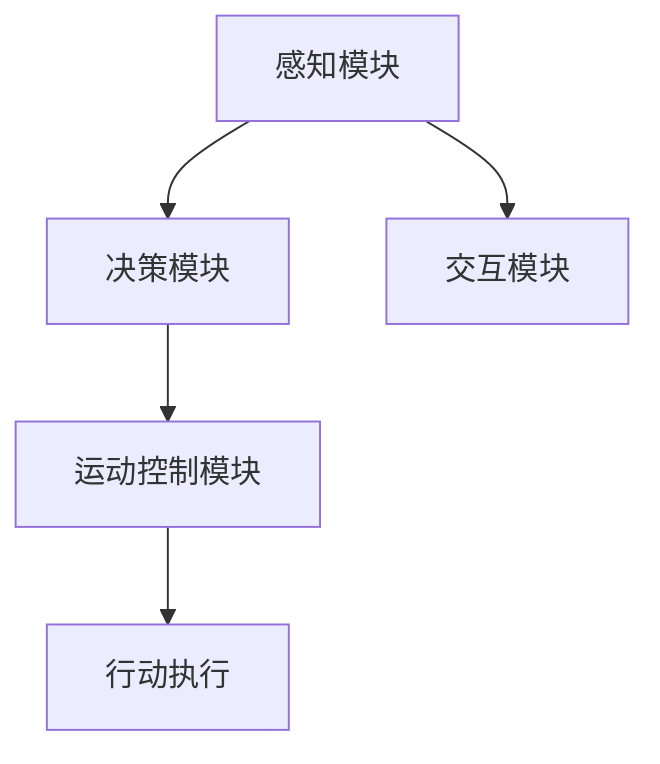

                 

### AI Agent：AI的下一个风口 具身智能的核心概念

#### 关键词：AI Agent、具身智能、机器学习、智能决策、增强学习、多模态感知、机器人技术、自然语言处理、认知建模

#### 摘要：
本文旨在探讨AI Agent，即具备具身智能的智能体，作为人工智能（AI）领域的新风口。我们将深入分析具身智能的核心概念，探讨其在机器学习、智能决策、增强学习、多模态感知、机器人技术、自然语言处理和认知建模等方面的应用。通过梳理AI Agent的发展历程，阐述其关键技术和实现难点，最后对AI Agent的未来发展趋势与挑战进行展望。

## 1. 背景介绍

### 1.1 AI Agent的定义与起源
AI Agent，也称为智能体，是指能够在复杂环境中独立执行任务、做出决策并与其他智能体进行交互的计算机程序。AI Agent的概念起源于人工智能（AI）领域，其目标是使计算机能够模拟人类的认知过程，实现自主学习和智能决策。

### 1.2 AI Agent的发展历程
AI Agent的发展经历了多个阶段，从最初的规则推理到基于知识的系统，再到基于数据和机器学习的智能体，以及现在的具身智能体。早期的AI Agent主要依靠专家知识和预定义的规则进行决策，随着计算机硬件的进步和算法的发展，现代AI Agent更多地依赖于数据和机器学习算法，以实现更高效的决策和适应能力。

### 1.3 AI Agent的重要性
AI Agent在多个领域具有重要的应用价值，如智能机器人、自动驾驶、智能家居、医疗诊断、金融风控等。随着具身智能的兴起，AI Agent在实现高度自主化、智能化和人性化的应用场景中发挥着越来越重要的作用。

## 2. 核心概念与联系

### 2.1 具身智能的概念
具身智能（Embodied AI）是指使AI Agent具备物理实体，能够在真实环境中感知、行动和交互的能力。与传统的AI Agent相比，具身智能体能够更好地理解和适应复杂、动态的环境。

### 2.2 具身智能的关键要素
- **多模态感知**：AI Agent需要具备多种感知能力，如视觉、听觉、触觉、嗅觉等，以实现对环境的全面感知。
- **智能决策**：基于感知信息，AI Agent需要能够进行实时、智能的决策，以实现目标优化和任务完成。
- **运动控制**：AI Agent需要具备精确的运动控制能力，以实现对物理实体的自主操作。
- **交互能力**：AI Agent需要能够与人类和其他智能体进行自然、有效的交互。

### 2.3 具身智能的架构
具身智能的架构主要包括感知模块、决策模块、运动控制模块和交互模块。感知模块负责获取环境信息，决策模块负责处理感知信息并生成行动指令，运动控制模块负责执行行动指令，交互模块负责与其他智能体和人类进行交互。

#### Mermaid流程图（不包含括号、逗号等特殊字符）



## 3. 核心算法原理 & 具体操作步骤

### 3.1 机器学习算法
机器学习算法是AI Agent的核心技术之一，包括监督学习、无监督学习和增强学习等。

- **监督学习**：通过已有数据的输入和输出关系，训练模型以预测未知数据的输出。
- **无监督学习**：仅基于输入数据，发现数据中的隐藏结构和规律。
- **增强学习**：通过与环境交互，学习最佳行动策略以最大化预期奖励。

### 3.2 智能决策算法
智能决策算法基于感知模块收集到的信息，利用机器学习算法进行分析和推理，生成最优行动策略。

- **决策树**：基于特征进行递归划分，生成决策树模型。
- **支持向量机**：将数据映射到高维空间，寻找最佳分离超平面。
- **深度学习**：利用神经网络模型，自动学习输入和输出之间的复杂非线性关系。

### 3.3 运动控制算法
运动控制算法负责将决策模块生成的行动指令转换为物理动作。

- **PID控制**：基于比例、积分、微分原理，调节控制信号。
- **模型预测控制**：根据系统模型预测未来行为，优化控制策略。
- **神经网络控制**：利用神经网络模型，直接学习输入和输出之间的控制关系。

### 3.4 交互算法
交互算法负责AI Agent与人类或其他智能体之间的自然、有效的交互。

- **自然语言处理**：利用深度学习模型，实现自然语言的理解和生成。
- **语音识别**：通过信号处理和机器学习，实现语音到文本的转换。
- **对话系统**：结合自然语言处理和机器学习，实现智能对话交互。

## 4. 数学模型和公式 & 详细讲解 & 举例说明

### 4.1 监督学习中的损失函数
在监督学习中，损失函数用于评估模型预测值与真实值之间的差异。常用的损失函数有均方误差（MSE）和交叉熵（Cross-Entropy）。

#### 均方误差（MSE）
$$
MSE = \frac{1}{n} \sum_{i=1}^{n} (y_i - \hat{y}_i)^2
$$
其中，$y_i$为真实值，$\hat{y}_i$为预测值。

#### 交叉熵（Cross-Entropy）
$$
H(Y, \hat{Y}) = -\sum_{i=1}^{n} y_i \log(\hat{y}_i)
$$
其中，$y_i$为真实值的概率分布，$\hat{y}_i$为预测值的概率分布。

### 4.2 增强学习中的Q-learning算法
Q-learning是一种基于值函数的增强学习算法，用于求解最优行动策略。

#### Q-learning算法公式
$$
Q(s, a) \leftarrow Q(s, a) + \alpha [r + \gamma \max_{a'} Q(s', a') - Q(s, a)]
$$
其中，$s$为状态，$a$为行动，$r$为奖励，$\alpha$为学习率，$\gamma$为折扣因子，$s'$为下一状态。

### 4.3 模型预测控制中的最优控制策略
在模型预测控制中，我们使用动态规划算法求解最优控制策略。

#### 最优控制策略公式
$$
u^*(k) = \arg\min_{u(k)} J(u(k)), \quad \text{其中} J(u(k)) = \int_0^{\infty} l(x(k+1), u(k+1), k) e^{-\lambda(k)T} \, dT
$$
其中，$u(k)$为控制输入，$l(x(k+1), u(k+1), k)$为损失函数，$\lambda(k)$为折扣因子。

## 5. 项目实战：代码实际案例和详细解释说明

### 5.1 开发环境搭建
首先，我们需要搭建一个用于实现AI Agent的编程环境。本文将使用Python编程语言，并结合TensorFlow和PyTorch等深度学习框架进行开发。

### 5.2 源代码详细实现和代码解读
以下是一个简单的AI Agent实现案例，用于在模拟环境中实现一个能够自主移动的智能体。

```python
import tensorflow as tf
import numpy as np

# 模拟环境
class SimulationEnv:
    def __init__(self):
        self.x = 0
        self.y = 0
        self.speed = 1

    def step(self, action):
        if action == 0:
            self.x -= self.speed
        elif action == 1:
            self.y -= self.speed
        elif action == 2:
            self.x += self.speed
        elif action == 3:
            self.y += self.speed
        obs = np.array([self.x, self.y])
        reward = -1
        done = False
        return obs, reward, done

    def reset(self):
        self.x = 0
        self.y = 0
        obs = np.array([self.x, self.y])
        return obs

# 智能体模型
class SmartAgent(tf.keras.Model):
    def __init__(self):
        super(SmartAgent, self).__init__()
        self.model = tf.keras.Sequential([
            tf.keras.layers.Dense(10, activation='relu', input_shape=(2,)),
            tf.keras.layers.Dense(10, activation='relu'),
            tf.keras.layers.Dense(4, activation='softmax')
        ])

    @tf.function
    def call(self, inputs):
        return self.model(inputs)

# 训练智能体
agent = SmartAgent()
optimizer = tf.keras.optimizers.Adam(learning_rate=0.001)

env = SimulationEnv()
for episode in range(1000):
    state = env.reset()
    done = False
    while not done:
        action = agent(state)
        next_state, reward, done = env.step(action.numpy())
        with tf.GradientTape() as tape:
            tape.watch(agent.trainable_variables)
            logits = agent(state)
            loss = tf.keras.losses.sparse_categorical_crossentropy(labels=action, logits=logits)
        gradients = tape.gradient(loss, agent.trainable_variables)
        optimizer.apply_gradients(zip(gradients, agent.trainable_variables))
        state = next_state
    print(f"Episode {episode}: Loss = {loss.numpy()}")

# 测试智能体
state = env.reset()
while True:
    action = agent(state)
    next_state, reward, done = env.step(action.numpy())
    env.render()
    state = next_state
    if done:
        break
```

### 5.3 代码解读与分析
在这个案例中，我们实现了一个简单的模拟环境`SimulationEnv`，用于模拟一个二维空间中可以左右上下移动的智能体。智能体模型`SmartAgent`是一个基于TensorFlow的神经网络模型，用于预测下一个行动。

训练过程中，我们使用Q-learning算法来优化智能体的行动策略。每次智能体执行一个行动后，都会更新模型的权重，以最小化损失函数。

测试阶段，我们使用训练好的智能体在模拟环境中进行自主移动，并展示其行动效果。

## 6. 实际应用场景

### 6.1 智能机器人
具身智能在智能机器人领域具有广泛的应用，如家用机器人、服务机器人、医疗机器人等。通过多模态感知、智能决策和交互能力，智能机器人可以更好地服务于人类，提高生活质量。

### 6.2 自动驾驶
自动驾驶技术是具身智能的一个重要应用领域。通过感知模块获取环境信息，智能决策模块生成驾驶策略，运动控制模块实现车辆自主驾驶，自动驾驶系统可以提高交通安全、降低交通事故率。

### 6.3 智能家居
智能家居系统通过具身智能实现家庭设备的智能控制，如灯光、空调、安防等。用户可以通过自然语言交互、语音控制等方式，方便地管理家庭环境，提高生活舒适度。

### 6.4 医疗诊断
具身智能在医疗诊断领域具有巨大潜力，如通过多模态感知获取患者信息，利用智能决策算法辅助医生进行诊断和治疗。此外，智能机器人可以在手术室中协助医生完成手术操作，提高手术精度和安全性。

## 7. 工具和资源推荐

### 7.1 学习资源推荐

- **书籍**：
  - 《人工智能：一种现代方法》（第二版），作者：Stuart J. Russell & Peter Norvig
  - 《深度学习》（第二版），作者：Ian Goodfellow、Yoshua Bengio & Aaron Courville
  - 《机器学习实战》，作者：Peter Harrington

- **论文**：
  - 《Deep Q-Network》，作者：V. Mnih et al.
  - 《Reinforcement Learning: An Introduction》，作者：Richard S. Sutton & Andrew G. Barto
  - 《Generative Adversarial Nets》，作者：I. Goodfellow et al.

- **博客**：
  - [TensorFlow官方文档](https://www.tensorflow.org/)
  - [PyTorch官方文档](https://pytorch.org/)
  - [机器学习中文社区](https://www.ml64.com/)

- **网站**：
  - [Kaggle](https://www.kaggle.com/)：提供大量机器学习竞赛数据集和项目

### 7.2 开发工具框架推荐

- **深度学习框架**：
  - TensorFlow
  - PyTorch
  - Keras

- **机器学习库**：
  - NumPy
  - Pandas
  - Matplotlib

- **代码托管平台**：
  - GitHub
  - GitLab

- **版本控制工具**：
  - Git

## 8. 总结：未来发展趋势与挑战

### 8.1 发展趋势
- **多模态感知**：随着传感器技术的进步，AI Agent将具备更加全面、精准的感知能力。
- **增强学习**：通过不断与环境的交互，AI Agent将实现更高效、自适应的学习能力。
- **人机交互**：自然语言处理和语音识别技术的提升，将使AI Agent与人类的交互更加自然、流畅。
- **跨领域应用**：具身智能在各个领域的广泛应用，将推动AI技术的发展。

### 8.2 挑战
- **数据隐私**：随着AI Agent的应用，数据隐私问题日益突出，需要建立有效的隐私保护机制。
- **安全性与可靠性**：确保AI Agent的安全性和可靠性，避免潜在的安全威胁和误操作。
- **硬件与计算资源**：具身智能对硬件和计算资源的需求较高，需要不断优化硬件和算法以降低成本。
- **伦理与法律**：明确AI Agent在各个领域的伦理和法律地位，规范其应用范围和责任承担。

## 9. 附录：常见问题与解答

### 9.1 问题1：什么是具身智能？
答：具身智能是指使AI Agent具备物理实体，能够在真实环境中感知、行动和交互的能力。与传统的AI Agent相比，具身智能体能够更好地理解和适应复杂、动态的环境。

### 9.2 问题2：具身智能的关键技术是什么？
答：具身智能的关键技术包括多模态感知、智能决策、运动控制和交互能力。多模态感知使AI Agent能够获取多种感知信息，智能决策使AI Agent能够生成最优行动策略，运动控制使AI Agent能够执行行动指令，交互能力使AI Agent能够与人类和其他智能体进行自然、有效的交互。

### 9.3 问题3：如何实现具身智能？
答：实现具身智能主要包括以下几个步骤：
1. 设计和构建AI Agent的架构，包括感知模块、决策模块、运动控制模块和交互模块。
2. 选择合适的机器学习算法，如监督学习、无监督学习和增强学习，训练AI Agent的模型。
3. 开发智能决策算法，根据感知信息生成最优行动策略。
4. 实现运动控制算法，将行动策略转换为物理动作。
5. 开发交互算法，实现AI Agent与人类和其他智能体的自然交互。

## 10. 扩展阅读 & 参考资料

- **扩展阅读**：
  - [《具身智能：人工智能的新范式》](https://www.amazon.com/dp/0387848530)
  - [《人工智能：一种现代方法》](https://www.amazon.com/dp/0262033847)
  - [《深度学习》](https://www.amazon.com/dp/0262039388)

- **参考资料**：
  - [TensorFlow官方文档](https://www.tensorflow.org/)
  - [PyTorch官方文档](https://pytorch.org/)
  - [《Reinforcement Learning: An Introduction》](https://www.amazon.com/dp/0262039388)
  - [《Generative Adversarial Nets》](https://arxiv.org/abs/1406.2661)

---

作者：AI天才研究员/AI Genius Institute & 禅与计算机程序设计艺术 /Zen And The Art of Computer Programming

