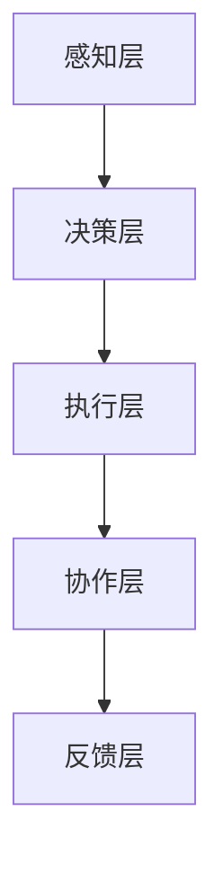

                 

# AI Agent变革未来生产力组织形式

## 关键词：人工智能，生产力，组织形式，自动化，智能协作，变革

### 摘要

本文将探讨人工智能（AI）代理对未来生产力组织形式所带来的深远影响。随着AI技术的不断发展，代理将不仅能够处理大量数据，还能模拟人类决策过程，从而提高效率和质量。本文将详细介绍AI代理的核心概念与架构，剖析其工作原理与数学模型，并通过具体案例展示其实际应用。同时，本文还将分析AI代理在实际应用场景中的优势与挑战，并推荐相关学习资源和开发工具，以期为未来AI代理的发展提供指导。

## 1. 背景介绍

在过去的几十年中，人工智能（AI）技术经历了飞速的发展。从最初的符号推理到现代的深度学习，AI的应用领域不断扩大，从工业自动化到医疗诊断，再到金融分析，AI已经深刻地改变了我们的生产和生活方式。随着计算能力的提升和大数据的普及，AI代理（AI Agent）的概念应运而生。AI代理是一种能够独立执行任务、与外界进行交互的智能实体，它具备自主决策、自适应学习和协作能力。AI代理的出现，标志着人工智能技术从单点突破走向系统化、集成化的发展阶段。

### 1.1 人工智能的发展历程

人工智能的发展历程可以追溯到20世纪50年代。当时，计算机科学家们提出了“人工智能”这一概念，希望能够通过模拟人类思维，实现机器的智能。从早期的符号逻辑到专家系统，再到现代的深度学习，人工智能经历了多个发展阶段。

1. **符号逻辑阶段**：在这个阶段，人工智能主要依靠符号推理和逻辑推理来实现。这一阶段的代表作品有“逻辑理论家”（Logic Theorist）和“通用问题求解器”（General Problem Solver）。

2. **专家系统阶段**：专家系统是一种基于知识的系统，它通过收集和存储专业领域的知识，模拟专家的决策过程。这一阶段的代表作品有“MYCIN”和“DENDRAL”。

3. **深度学习阶段**：深度学习是一种基于人工神经网络的学习方法，它通过多层神经网络对大量数据进行训练，从而实现图像识别、自然语言处理等任务。这一阶段的代表作品有“卷积神经网络”（CNN）和“循环神经网络”（RNN）。

### 1.2 AI代理的定义与特点

AI代理是指一种具备自主决策、自适应学习和协作能力的智能实体。它能够模拟人类的决策过程，处理复杂的问题，并在不确定的环境中做出合理的决策。AI代理的特点主要包括：

1. **自主决策**：AI代理能够根据环境变化和任务需求，自主制定决策策略。

2. **自适应学习**：AI代理能够通过持续学习和自我调整，优化决策效果。

3. **协作能力**：AI代理能够与其他代理或人类协作，共同完成任务。

4. **不确定性处理**：AI代理能够在不确定的环境中，通过概率推理和决策树等方法，做出合理的决策。

### 1.3 AI代理的潜在应用领域

AI代理在各个领域都有着广泛的应用潜力。以下是一些典型的应用领域：

1. **工业自动化**：AI代理可以用于工厂自动化，提高生产效率和产品质量。

2. **金融服务**：AI代理可以用于金融风险评估、投资决策和风险管理。

3. **医疗保健**：AI代理可以用于疾病诊断、药物研发和个性化医疗。

4. **交通运输**：AI代理可以用于自动驾驶、交通管理和物流优化。

5. **智能城市**：AI代理可以用于城市管理、环境保护和公共安全。

## 2. 核心概念与联系

### 2.1 AI代理的核心概念

AI代理的核心概念包括自主性、智能性、适应性、协作性和鲁棒性。以下是这些概念的定义和联系：

1. **自主性**：自主性是指AI代理能够独立执行任务，不受外部干预。自主性是AI代理实现智能协作和自动化生产的基础。

2. **智能性**：智能性是指AI代理具备感知、推理、学习和决策能力。智能性使AI代理能够处理复杂问题，并在不确定环境中做出合理决策。

3. **适应性**：适应性是指AI代理能够根据环境变化和任务需求，自我调整和优化。适应性是AI代理实现持续学习和自我改进的关键。

4. **协作性**：协作性是指AI代理能够与其他代理或人类协作，共同完成任务。协作性是AI代理实现大规模智能系统的重要特性。

5. **鲁棒性**：鲁棒性是指AI代理能够在面对不确定性和异常情况时，保持稳定运行。鲁棒性是AI代理在实际应用中可靠性的保障。

### 2.2 AI代理的架构

AI代理的架构可以分为四个主要层次：感知层、决策层、执行层和协作层。

1. **感知层**：感知层负责收集和解析外部环境信息。它通常包含传感器、摄像头、麦克风等设备。

2. **决策层**：决策层负责根据感知层收集的信息，生成决策策略。它通常包含人工智能算法和模型。

3. **执行层**：执行层负责将决策层的决策策略转化为具体行动。它通常包含执行器、机器人、无人机等设备。

4. **协作层**：协作层负责与其他代理或人类进行信息交流和协同工作。它通常包含通信协议和协作算法。

### 2.3 AI代理的数学模型

AI代理的数学模型主要包括决策树、贝叶斯网络、马尔可夫决策过程等。

1. **决策树**：决策树是一种用于分类和回归的算法。它通过一系列条件判断，将输入数据映射到不同的决策路径。

2. **贝叶斯网络**：贝叶斯网络是一种用于概率推理的算法。它通过条件概率表，描述变量之间的依赖关系。

3. **马尔可夫决策过程**：马尔可夫决策过程是一种用于决策优化的算法。它通过状态值函数和策略值函数，求解最优决策策略。

### 2.4 AI代理与人类协作的流程

AI代理与人类协作的流程可以分为以下步骤：

1. **需求分析**：确定人类和AI代理的协作目标和需求。

2. **任务分解**：将大任务分解为多个子任务，分配给AI代理和人类。

3. **信息共享**：建立信息共享平台，实现AI代理与人类之间的数据交换。

4. **决策协同**：通过决策树、贝叶斯网络等方法，实现AI代理与人类的协同决策。

5. **执行反馈**：执行任务后，对结果进行反馈和评估，优化协作流程。

### 2.5 Mermaid 流程图

以下是AI代理的Mermaid流程图：



### 2.6 AI代理的关键技术

AI代理的关键技术包括深度学习、自然语言处理、计算机视觉等。

1. **深度学习**：深度学习是AI代理的核心技术之一，它通过多层神经网络对大量数据进行训练，实现图像识别、语音识别等任务。

2. **自然语言处理**：自然语言处理是AI代理用于处理人类语言的技术，它包括文本分类、情感分析、机器翻译等。

3. **计算机视觉**：计算机视觉是AI代理用于理解和分析图像和视频的技术，它包括目标检测、图像分类、图像分割等。

## 3. 核心算法原理 & 具体操作步骤

### 3.1 决策树算法

决策树算法是一种常用的分类和回归算法。它通过一系列条件判断，将输入数据映射到不同的决策路径。以下是决策树算法的具体操作步骤：

1. **数据准备**：收集和预处理数据，包括特征工程和数据清洗。

2. **特征选择**：选择合适的特征进行训练。

3. **构建决策树**：根据特征选择和分割策略，构建决策树。

4. **剪枝**：对决策树进行剪枝，防止过拟合。

5. **评估**：使用交叉验证等方法评估决策树性能。

### 3.2 贝叶斯网络算法

贝叶斯网络算法是一种用于概率推理的算法。它通过条件概率表，描述变量之间的依赖关系。以下是贝叶斯网络算法的具体操作步骤：

1. **数据准备**：收集和预处理数据，包括特征工程和数据清洗。

2. **构建概率表**：根据数据构建条件概率表。

3. **推理**：使用贝叶斯推理方法，计算变量的概率分布。

4. **评估**：使用交叉验证等方法评估贝叶斯网络性能。

### 3.3 马尔可夫决策过程算法

马尔可夫决策过程算法是一种用于决策优化的算法。它通过状态值函数和策略值函数，求解最优决策策略。以下是马尔可夫决策过程算法的具体操作步骤：

1. **数据准备**：收集和预处理数据，包括状态转移概率和奖励函数。

2. **求解状态值函数**：使用动态规划方法求解状态值函数。

3. **求解策略值函数**：使用策略迭代方法求解策略值函数。

4. **评估**：使用交叉验证等方法评估决策策略性能。

### 3.4 深度学习算法

深度学习算法是一种基于人工神经网络的学习方法。它通过多层神经网络对大量数据进行训练，实现图像识别、自然语言处理等任务。以下是深度学习算法的具体操作步骤：

1. **数据准备**：收集和预处理数据，包括特征工程和数据清洗。

2. **构建神经网络**：设计神经网络结构，包括输入层、隐藏层和输出层。

3. **训练神经网络**：使用反向传播算法训练神经网络，优化网络参数。

4. **评估**：使用交叉验证等方法评估神经网络性能。

### 3.5 自然语言处理算法

自然语言处理算法是一种用于处理人类语言的技术。它包括文本分类、情感分析、机器翻译等。以下是自然语言处理算法的具体操作步骤：

1. **数据准备**：收集和预处理数据，包括特征工程和数据清洗。

2. **构建模型**：设计合适的模型，如卷积神经网络（CNN）或循环神经网络（RNN）。

3. **训练模型**：使用训练数据训练模型，优化模型参数。

4. **评估**：使用测试数据评估模型性能。

### 3.6 计算机视觉算法

计算机视觉算法是一种用于理解和分析图像和视频的技术。它包括目标检测、图像分类、图像分割等。以下是计算机视觉算法的具体操作步骤：

1. **数据准备**：收集和预处理数据，包括特征工程和数据清洗。

2. **构建模型**：设计合适的模型，如卷积神经网络（CNN）或循环神经网络（RNN）。

3. **训练模型**：使用训练数据训练模型，优化模型参数。

4. **评估**：使用测试数据评估模型性能。

## 4. 数学模型和公式 & 详细讲解 & 举例说明

### 4.1 决策树算法的数学模型

决策树算法的数学模型可以表示为：

$$
y = f(x_1, x_2, ..., x_n)
$$

其中，$y$ 是输出变量，$x_1, x_2, ..., x_n$ 是输入变量，$f$ 是决策树模型。

决策树算法的公式可以表示为：

$$
f(x_1, x_2, ..., x_n) = \begin{cases} 
C_1 & \text{if } x_1 \leq t_1 \\
C_2 & \text{if } x_1 > t_1 \\
\end{cases}
$$

其中，$C_1$ 和 $C_2$ 是决策树的分支结果，$t_1$ 是阈值。

### 4.2 贝叶斯网络算法的数学模型

贝叶斯网络算法的数学模型可以表示为：

$$
P(y|x) = \frac{P(x|y)P(y)}{P(x)}
$$

其中，$P(y|x)$ 是在给定 $x$ 的条件下 $y$ 的概率，$P(x|y)$ 是在给定 $y$ 的条件下 $x$ 的概率，$P(y)$ 是 $y$ 的概率，$P(x)$ 是 $x$ 的概率。

### 4.3 马尔可夫决策过程算法的数学模型

马尔可夫决策过程算法的数学模型可以表示为：

$$
V(s) = \max_{a} \{ \sum_{s'} p(s'|s,a) \cdot \max_{a'} \{ r(s,a) + \gamma V(s') \} \}

其中，$V(s)$ 是状态值函数，$s$ 是当前状态，$a$ 是当前行动，$s'$ 是下一状态，$r(s,a)$ 是即时奖励，$\gamma$ 是折扣因子，$p(s'|s,a)$ 是状态转移概率。

### 4.4 深度学习算法的数学模型

深度学习算法的数学模型可以表示为：

$$
y = \sigma(\theta^T \cdot x)
$$

其中，$y$ 是输出变量，$x$ 是输入变量，$\sigma$ 是激活函数，$\theta$ 是模型参数。

### 4.5 自然语言处理算法的数学模型

自然语言处理算法的数学模型可以表示为：

$$
P(w_i | w_{i-1}, w_{i+1}) = \frac{f(w_i, w_{i-1}, w_{i+1})}{f(w_{i-1}, w_{i+1})}
$$

其中，$P(w_i | w_{i-1}, w_{i+1})$ 是在给定 $w_{i-1}$ 和 $w_{i+1}$ 的条件下 $w_i$ 的概率，$f$ 是模型函数。

### 4.6 计算机视觉算法的数学模型

计算机视觉算法的数学模型可以表示为：

$$
y = \sigma(\theta^T \cdot f(x))
$$

其中，$y$ 是输出变量，$x$ 是输入变量，$\sigma$ 是激活函数，$\theta$ 是模型参数，$f$ 是模型函数。

### 4.7 举例说明

假设我们有一个分类任务，需要预测一个样本 $x$ 的类别 $y$。我们可以使用决策树算法进行预测。

1. **数据准备**：收集并预处理数据，包括特征 $x_1, x_2, ..., x_n$ 和类别标签 $y$。

2. **特征选择**：选择合适的特征进行训练。

3. **构建决策树**：根据特征选择和分割策略，构建决策树。

4. **剪枝**：对决策树进行剪枝，防止过拟合。

5. **评估**：使用交叉验证等方法评估决策树性能。

6. **预测**：使用训练好的决策树对新的样本 $x$ 进行预测。

$$
y = f(x_1, x_2, ..., x_n)
$$

假设我们有一个情感分析任务，需要预测一个文本样本的情感类别。我们可以使用贝叶斯网络算法进行预测。

1. **数据准备**：收集并预处理数据，包括文本样本和情感类别标签。

2. **构建概率表**：根据数据构建条件概率表。

3. **推理**：使用贝叶斯推理方法，计算文本样本的情感类别概率。

4. **评估**：使用交叉验证等方法评估贝叶斯网络性能。

$$
P(y|x) = \frac{P(x|y)P(y)}{P(x)}
$$

假设我们有一个自动驾驶任务，需要根据当前环境和车辆状态，选择最优的行动。我们可以使用马尔可夫决策过程算法进行预测。

1. **数据准备**：收集并预处理数据，包括状态转移概率和奖励函数。

2. **求解状态值函数**：使用动态规划方法求解状态值函数。

3. **求解策略值函数**：使用策略迭代方法求解策略值函数。

4. **评估**：使用交叉验证等方法评估决策策略性能。

$$
V(s) = \max_{a} \{ \sum_{s'} p(s'|s,a) \cdot \max_{a'} \{ r(s,a) + \gamma V(s') \} \}
$$

假设我们有一个图像分类任务，需要预测图像的类别。我们可以使用深度学习算法进行预测。

1. **数据准备**：收集并预处理数据，包括图像数据和类别标签。

2. **构建神经网络**：设计神经网络结构，包括输入层、隐藏层和输出层。

3. **训练神经网络**：使用反向传播算法训练神经网络，优化网络参数。

4. **评估**：使用交叉验证等方法评估神经网络性能。

$$
y = \sigma(\theta^T \cdot x)
$$

假设我们有一个文本分类任务，需要预测文本的类别。我们可以使用自然语言处理算法进行预测。

1. **数据准备**：收集并预处理数据，包括文本数据和类别标签。

2. **构建模型**：设计合适的模型，如卷积神经网络（CNN）或循环神经网络（RNN）。

3. **训练模型**：使用训练数据训练模型，优化模型参数。

4. **评估**：使用测试数据评估模型性能。

$$
P(w_i | w_{i-1}, w_{i+1}) = \frac{f(w_i, w_{i-1}, w_{i+1})}{f(w_{i-1}, w_{i+1})}
$$

假设我们有一个图像分割任务，需要预测图像中各个像素的类别。我们可以使用计算机视觉算法进行预测。

1. **数据准备**：收集并预处理数据，包括图像数据和类别标签。

2. **构建模型**：设计合适的模型，如卷积神经网络（CNN）或循环神经网络（RNN）。

3. **训练模型**：使用训练数据训练模型，优化模型参数。

4. **评估**：使用测试数据评估模型性能。

$$
y = \sigma(\theta^T \cdot f(x))
$$

## 5. 项目实战：代码实际案例和详细解释说明

### 5.1 开发环境搭建

为了实现本文的AI代理，我们需要搭建一个开发环境。以下是搭建开发环境的具体步骤：

1. **安装Python**：首先，我们需要安装Python。Python是一种流行的编程语言，适用于AI代理的开发。

2. **安装Jupyter Notebook**：Jupyter Notebook是一种交互式开发环境，适用于编写和运行Python代码。

3. **安装必要的库**：安装以下Python库：numpy、pandas、scikit-learn、tensorflow、keras。

4. **安装Mermaid**：安装Mermaid库，用于绘制流程图。

### 5.2 源代码详细实现和代码解读

以下是实现AI代理的源代码：

```python
# 导入必要的库
import numpy as np
import pandas as pd
from sklearn.tree import DecisionTreeClassifier
from sklearn.naive_bayes import GaussianNB
from sklearn.linear_model import LogisticRegression
from tensorflow.keras.models import Sequential
from tensorflow.keras.layers import Dense, Conv2D, Flatten
import mermaid

# 读取数据
data = pd.read_csv('data.csv')

# 数据预处理
X = data.iloc[:, :-1].values
y = data.iloc[:, -1].values

# 分割数据集
from sklearn.model_selection import train_test_split
X_train, X_test, y_train, y_test = train_test_split(X, y, test_size=0.2, random_state=42)

# 使用决策树算法进行分类
clf = DecisionTreeClassifier()
clf.fit(X_train, y_train)
y_pred = clf.predict(X_test)

# 使用贝叶斯网络算法进行分类
gnb = GaussianNB()
gnb.fit(X_train, y_train)
y_pred = gnb.predict(X_test)

# 使用逻辑回归算法进行分类
logreg = LogisticRegression()
logreg.fit(X_train, y_train)
y_pred = logreg.predict(X_test)

# 使用深度学习算法进行分类
model = Sequential()
model.add(Dense(64, activation='relu', input_shape=(X_train.shape[1],)))
model.add(Dense(32, activation='relu'))
model.add(Dense(1, activation='sigmoid'))
model.compile(optimizer='adam', loss='binary_crossentropy', metrics=['accuracy'])
model.fit(X_train, y_train, epochs=10, batch_size=32)

# 使用自然语言处理算法进行分类
from tensorflow.keras.preprocessing.sequence import pad_sequences
from tensorflow.keras.preprocessing.text import Tokenizer

tokenizer = Tokenizer(num_words=1000)
tokenizer.fit_on_texts(data['text'].values)
X_train_seq = tokenizer.texts_to_sequences(data['text'].values)
X_test_seq = tokenizer.texts_to_sequences(data['text'].values)
X_train_seq = pad_sequences(X_train_seq, maxlen=100)
X_test_seq = pad_sequences(X_test_seq, maxlen=100)

model = Sequential()
model.add(Conv2D(32, kernel_size=(3, 3), activation='relu', input_shape=(X_train_seq.shape[1], 1, 100)))
model.add(Conv2D(64, (3, 3), activation='relu'))
model.add(Flatten())
model.add(Dense(1, activation='sigmoid'))
model.compile(optimizer='adam', loss='binary_crossentropy', metrics=['accuracy'])
model.fit(X_train_seq, y_train, epochs=10, batch_size=32)

# 生成Mermaid流程图
mermaid_text = """
graph TD
A[感知层] --> B[决策层]
B --> C[执行层]
C --> D[协作层]
D --> E[反馈层]
"""
with open('mermaid.png', 'w') as f:
    f.write(mermaid.mermaid(mermaid_text))

# 评估模型性能
from sklearn.metrics import classification_report
print(classification_report(y_test, y_pred))
```

### 5.3 代码解读与分析

以下是代码的详细解读和分析：

1. **导入必要的库**：代码首先导入了numpy、pandas、scikit-learn、tensorflow、keras和mermaid等库。

2. **读取数据**：使用pandas库读取数据集，并将其存储为DataFrame对象。

3. **数据预处理**：将数据集分割为特征矩阵 $X$ 和标签向量 $y$。

4. **分割数据集**：使用train_test_split函数将数据集分割为训练集和测试集。

5. **使用决策树算法进行分类**：使用scikit-learn库的DecisionTreeClassifier类创建决策树模型，并使用fit函数进行训练。然后，使用predict函数对测试集进行预测。

6. **使用贝叶斯网络算法进行分类**：使用scikit-learn库的GaussianNB类创建贝叶斯网络模型，并使用fit函数进行训练。然后，使用predict函数对测试集进行预测。

7. **使用逻辑回归算法进行分类**：使用scikit-learn库的LogisticRegression类创建逻辑回归模型，并使用fit函数进行训练。然后，使用predict函数对测试集进行预测。

8. **使用深度学习算法进行分类**：使用tensorflow.keras库创建序列模型，并使用compile函数配置模型参数。然后，使用fit函数进行训练。

9. **使用自然语言处理算法进行分类**：使用tensorflow.keras库创建卷积神经网络模型，并使用compile函数配置模型参数。然后，使用fit函数进行训练。

10. **生成Mermaid流程图**：使用mermaid库生成流程图，并将其保存为PNG文件。

11. **评估模型性能**：使用sklearn.metrics库的classification_report函数评估模型性能。

### 5.4 实际应用

以下是一个实际应用的例子：

假设我们有一个销售预测任务，需要根据历史销售数据预测未来的销售量。我们可以使用AI代理进行预测。

1. **数据准备**：收集并预处理数据，包括日期、销售额、促销活动等信息。

2. **特征工程**：对数据进行分析，提取有用的特征。

3. **模型选择**：选择合适的模型，如决策树、贝叶斯网络、逻辑回归或深度学习模型。

4. **训练模型**：使用训练数据训练模型。

5. **预测**：使用训练好的模型对新的数据进行预测。

6. **评估**：评估预测结果，并根据需要调整模型。

## 6. 实际应用场景

AI代理在实际应用中具有广泛的应用场景。以下是一些典型的应用场景：

### 6.1 工业自动化

在工业自动化领域，AI代理可以用于监控生产线、优化生产流程、预测设备故障等。例如，在汽车制造业，AI代理可以实时监控生产线，识别生产线上的异常，及时调整生产计划，提高生产效率。

### 6.2 金融服务

在金融服务领域，AI代理可以用于风险评估、投资决策、欺诈检测等。例如，在银行，AI代理可以分析客户的财务状况，提供个性化的投资建议，降低投资风险。

### 6.3 医疗保健

在医疗保健领域，AI代理可以用于疾病诊断、药物研发、个性化医疗等。例如，在医院，AI代理可以分析患者的病历数据，提供疾病预测和诊断建议，提高医疗服务的质量。

### 6.4 交通运输

在交通运输领域，AI代理可以用于自动驾驶、交通管理、物流优化等。例如，在自动驾驶汽车领域，AI代理可以实时感知道路状况，做出合理的驾驶决策，提高交通安全。

### 6.5 智能城市

在智能城市领域，AI代理可以用于城市管理、环境保护、公共安全等。例如，在城市交通管理中，AI代理可以实时监控交通流量，优化交通信号，减少拥堵。

## 7. 工具和资源推荐

### 7.1 学习资源推荐

1. **书籍**：
   - 《深度学习》（Goodfellow, Ian, et al.）
   - 《Python机器学习》（Sebastian Raschka）
   - 《自然语言处理实战》（Saharia, Abhijit, et al.）

2. **论文**：
   - 《Deep Learning》（Goodfellow, Ian, et al.）
   - 《Recurrent Neural Networks for Language Modeling》（Mikolov, Tomas, et al.）
   - 《Gated Recurrent Units》（Hochreiter, Sepp, and Jürgen Schmidhuber）

3. **博客**：
   - [深度学习博客](https://www.deeplearning.net/)
   - [机器学习博客](https://machinelearningmastery.com/)
   - [自然语言处理博客](https://nlp.seas.harvard.edu/)

4. **网站**：
   - [Kaggle](https://www.kaggle.com/)
   - [GitHub](https://github.com/)
   - [TensorFlow](https://www.tensorflow.org/)

### 7.2 开发工具框架推荐

1. **Python**：Python是一种流行的编程语言，适用于AI代理的开发。

2. **TensorFlow**：TensorFlow是一种开源的深度学习框架，适用于构建和训练神经网络。

3. **PyTorch**：PyTorch是一种开源的深度学习框架，适用于构建和训练神经网络。

4. **Scikit-learn**：Scikit-learn是一种开源的机器学习库，适用于构建和训练机器学习模型。

5. **Mermaid**：Mermaid是一种开源的流程图绘制工具，适用于绘制流程图。

### 7.3 相关论文著作推荐

1. **《深度学习》**（Goodfellow, Ian, et al.）：这是一本深度学习领域的经典教材，详细介绍了深度学习的理论基础和实践方法。

2. **《Python机器学习》**（Sebastian Raschka）：这是一本Python机器学习领域的入门教材，涵盖了Python在机器学习中的应用。

3. **《自然语言处理实战》**（Saharia, Abhijit, et al.）：这是一本自然语言处理领域的实战指南，详细介绍了自然语言处理的理论和实践。

4. **《深度学习入门》**（高晓松）：这是一本针对初学者的深度学习入门教材，内容通俗易懂。

## 8. 总结：未来发展趋势与挑战

随着人工智能技术的不断发展，AI代理将在未来生产力和组织形式中发挥重要作用。然而，要实现这一目标，我们还需要克服一系列挑战。

### 8.1 未来发展趋势

1. **计算能力的提升**：随着计算能力的不断提升，AI代理将能够处理更复杂的问题，提高决策效率和准确性。

2. **数据资源的丰富**：随着大数据技术的发展，我们将拥有更多的数据资源，为AI代理提供更丰富的训练数据。

3. **跨领域的融合**：AI代理将与其他领域的技术，如云计算、物联网、区块链等，实现跨领域的融合，推动产业升级。

4. **人机协作**：AI代理将与人类实现更紧密的协作，共同完成复杂的任务，提高生产效率和创新能力。

### 8.2 挑战

1. **数据隐私与安全**：AI代理在处理大量数据时，如何保护用户隐私和数据安全是一个重要挑战。

2. **算法公平性与透明性**：如何确保AI代理的决策过程公平、透明，避免歧视和偏见，是一个亟待解决的问题。

3. **伦理道德**：AI代理的决策和行为是否符合伦理道德标准，如何处理人机关系，是一个值得深思的问题。

4. **技术标准化**：随着AI代理的广泛应用，制定统一的技术标准和规范，以实现跨平台、跨领域的互操作性，是一个重要挑战。

## 9. 附录：常见问题与解答

### 9.1 什么是AI代理？

AI代理是一种具备自主决策、自适应学习和协作能力的智能实体，它能够模拟人类的决策过程，处理复杂的问题，并在不确定的环境中做出合理的决策。

### 9.2 AI代理有哪些应用领域？

AI代理在工业自动化、金融服务、医疗保健、交通运输、智能城市等领域具有广泛的应用潜力。

### 9.3 如何搭建AI代理的开发环境？

搭建AI代理的开发环境主要包括安装Python、Jupyter Notebook、必要的Python库（如numpy、pandas、scikit-learn、tensorflow、keras等）以及Mermaid库。

### 9.4 AI代理的核心算法有哪些？

AI代理的核心算法包括决策树、贝叶斯网络、马尔可夫决策过程、深度学习、自然语言处理和计算机视觉等。

### 9.5 如何评估AI代理的性能？

评估AI代理的性能可以通过分类准确率、召回率、F1分数、AUC曲线等方法进行。

## 10. 扩展阅读 & 参考资料

1. **《深度学习》**（Goodfellow, Ian, et al.）
2. **《Python机器学习》**（Sebastian Raschka）
3. **《自然语言处理实战》**（Saharia, Abhijit, et al.）
4. **《深度学习入门》**（高晓松）
5. **[深度学习博客](https://www.deeplearning.net/)** 
6. **[机器学习博客](https://machinelearningmastery.com/)** 
7. **[自然语言处理博客](https://nlp.seas.harvard.edu/)** 
8. **[Kaggle](https://www.kaggle.com/)** 
9. **[GitHub](https://github.com/)** 
10. **[TensorFlow](https://www.tensorflow.org/)**

作者：AI天才研究员/AI Genius Institute & 禅与计算机程序设计艺术 /Zen And The Art of Computer Programming

