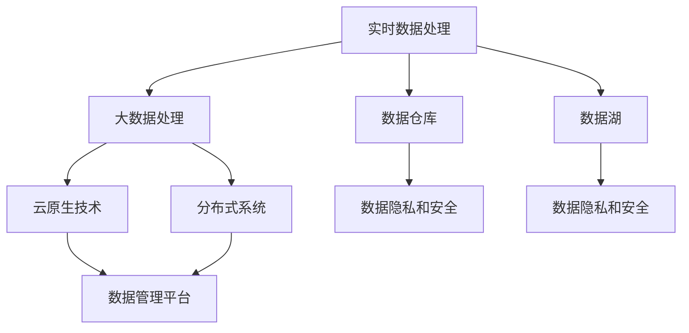

                 

### AI DMP 数据基建的技术选型

#### 关键词：
- AI DMP
- 数据基础设施建设
- 技术选型
- 实时数据处理
- 大数据处理
- 数据仓库
- 数据湖
- 云原生技术
- 分布式系统
- 数据隐私和安全

#### 摘要：
本文将深入探讨AI数据管理平台（DMP）的技术选型。从数据基础设施建设入手，解析实时数据处理、大数据处理、数据仓库与数据湖的架构选择，并结合云原生技术、分布式系统等关键因素，探讨在保证数据隐私与安全的前提下，如何构建高效、可扩展的AI DMP。通过实际案例和详细分析，为开发者提供实用的技术指导，展望未来发展趋势与挑战。

---

### 1. 背景介绍

在当今信息化社会，数据已成为企业的重要资产，AI DMP作为数据管理的关键环节，其重要性日益凸显。AI DMP不仅负责数据的收集、存储、处理，还能够在海量数据中提取有价值的信息，为企业的业务决策提供支持。然而，在构建AI DMP的过程中，技术选型是一个至关重要的问题。

技术选型直接影响到AI DMP的性能、可扩展性、稳定性和安全性。选型不当可能会导致系统性能瓶颈、数据丢失、隐私泄露等问题。因此，本文将从数据基础设施建设入手，详细分析实时数据处理、大数据处理、数据仓库与数据湖的架构选择，并结合云原生技术、分布式系统等关键因素，探讨如何构建高效、可扩展的AI DMP。

### 2. 核心概念与联系

在构建AI DMP之前，我们需要明确以下几个核心概念：

- **实时数据处理**：实时数据处理是指在数据产生的同时或短时间内对数据进行处理和分析，以实现对业务事件的实时响应。实时数据处理通常涉及到流数据处理技术和事件驱动架构。
  
- **大数据处理**：大数据处理是指对海量、多样化、快速变化的数据进行处理和分析的能力。大数据处理需要采用分布式计算框架，如Hadoop、Spark等。
  
- **数据仓库**：数据仓库是一个用于存储、管理和分析大量数据的集中式系统，通常用于支持企业的决策支持系统和业务智能应用。
  
- **数据湖**：数据湖是一种新兴的数据存储架构，它不同于传统的数据仓库，允许存储原始数据，而不需要对数据进行预处理。数据湖通常用于大数据分析和机器学习。
  
- **云原生技术**：云原生技术是指为云环境设计、开发、部署和运行的应用程序和基础设施，包括容器化、微服务、自动化等。
  
- **分布式系统**：分布式系统是由多个独立节点组成的系统，这些节点通过网络进行通信，共同完成任务。

以下是一个简化的Mermaid流程图，展示了这些核心概念之间的联系：



#### 2.1 实时数据处理

实时数据处理的核心在于快速响应数据流，通常采用以下技术和架构：

- **流数据处理技术**：如Apache Kafka、Apache Flink等，能够处理大量实时数据。
- **事件驱动架构**：通过事件驱动的方式，将数据处理任务分解为多个微服务，提高系统的响应速度和可扩展性。

#### 2.2 大数据处理

大数据处理需要处理海量、多样化、快速变化的数据，通常采用以下技术和架构：

- **分布式计算框架**：如Apache Hadoop、Apache Spark等，能够高效处理大规模数据集。
- **批处理和流处理相结合**：通过将批处理和流处理相结合，实现实时和离线数据处理的平衡。

#### 2.3 数据仓库与数据湖

数据仓库和数据湖在数据处理方式、数据模型和架构设计等方面存在差异：

- **数据仓库**：主要用于存储和管理结构化数据，通常采用关系型数据库进行存储。数据仓库支持复杂的查询和分析操作，但处理速度相对较慢。
- **数据湖**：主要用于存储原始数据，包括结构化、半结构化和非结构化数据。数据湖支持大规模数据存储和快速数据处理，但需要额外的数据处理和整合步骤。

#### 2.4 云原生技术

云原生技术为AI DMP提供了高效的部署、管理和扩展能力：

- **容器化**：通过容器化技术，如Docker，可以将应用程序及其依赖环境打包在一起，实现高效部署和可移植性。
- **微服务**：通过微服务架构，将应用程序拆分为多个小型、独立的服务，提高系统的可扩展性和可维护性。
- **自动化**：通过自动化工具，如Kubernetes，实现自动化部署、扩展和管理，提高系统的运维效率。

#### 2.5 分布式系统

分布式系统在数据存储和处理方面具有高度可扩展性和容错性：

- **数据分片**：通过将数据分片存储在多个节点上，实现数据的高可用性和高性能。
- **一致性协议**：通过一致性协议，如Paxos、Raft等，确保分布式系统在数据一致性和容错性方面的高效运行。

### 3. 核心算法原理 & 具体操作步骤

#### 3.1 实时数据处理算法

实时数据处理算法的核心是快速响应数据流，以下是几种常用的实时数据处理算法：

- **窗口算法**：通过设定时间窗口，对窗口内的数据进行聚合和分析，如滑动窗口、固定窗口等。
- **事件驱动算法**：通过事件触发数据处理任务，如消息队列、事件总线等。

具体操作步骤：

1. 数据采集：通过数据采集工具（如Kafka）收集实时数据。
2. 数据处理：通过流数据处理框架（如Flink）对数据进行实时处理。
3. 数据存储：将处理后的数据存储到数据仓库或数据湖中。

#### 3.2 大数据处理算法

大数据处理算法的核心是高效处理海量数据，以下是几种常用的大数据处理算法：

- **MapReduce**：通过Map和Reduce两个阶段，对大规模数据进行分布式处理。
- **Spark**：通过内存计算和弹性调度，实现高效的大数据处理。

具体操作步骤：

1. 数据导入：将数据导入到分布式存储系统（如Hadoop HDFS）。
2. 数据处理：通过分布式计算框架（如Spark）对数据进行处理。
3. 数据存储：将处理后的数据存储到数据仓库或数据湖中。

#### 3.3 数据仓库与数据湖构建

数据仓库与数据湖的构建包括数据存储、数据处理、数据查询等步骤，以下是构建数据仓库和数据湖的具体操作步骤：

1. **数据存储**：

   - 数据仓库：使用关系型数据库（如MySQL、PostgreSQL）存储结构化数据。
   - 数据湖：使用分布式存储系统（如Hadoop HDFS、Amazon S3）存储原始数据。

2. **数据处理**：

   - 数据仓库：使用ETL工具（如Apache NiFi、Talend）将数据从源系统抽取、转换、加载到数据仓库。
   - 数据湖：使用数据处理框架（如Apache Spark、Flink）对原始数据进行处理和整合。

3. **数据查询**：

   - 数据仓库：使用SQL查询语言对数据仓库中的数据进行查询和分析。
   - 数据湖：使用大数据查询工具（如Apache Hive、Apache Impala）对数据湖中的数据进行查询和分析。

### 4. 数学模型和公式 & 详细讲解 & 举例说明

#### 4.1 实时数据处理数学模型

实时数据处理中的窗口算法可以使用以下数学模型进行描述：

- **滑动窗口**：假设时间窗口为`T`，数据条数为`N`，滑动步长为`S`，则窗口内的数据条数为`N = T / S`。

- **固定窗口**：假设时间窗口为`T`，数据条数为`N`，固定窗口内的数据条数为`N`。

以下是一个滑动窗口的示例：

$$
\text{滑动窗口} = \sum_{i=1}^{N} \text{data}[i]
$$

其中，`data[i]`表示窗口内的第`i`条数据。

#### 4.2 大数据处理数学模型

大数据处理中的MapReduce算法可以使用以下数学模型进行描述：

- **Map阶段**：对输入数据进行映射（Map），生成中间键值对。

$$
\text{Map}(x) = \{(key, value) | f(x) = value\}
$$

其中，`x`表示输入数据，`key`表示中间键值对的键，`value`表示中间键值对的值。

- **Reduce阶段**：对中间键值对进行聚合（Reduce），生成最终输出。

$$
\text{Reduce}(key, values) = \text{aggregate}(values)
$$

其中，`key`表示中间键值对的键，`values`表示与键相关的中间值，`aggregate`表示聚合操作。

以下是一个MapReduce算法的示例：

```python
# Map阶段
def map_function(data):
    key = data['id']
    value = data['value']
    return key, value

# Reduce阶段
def reduce_function(key, values):
    return sum(values)
```

#### 4.3 数据仓库与数据湖构建数学模型

数据仓库与数据湖构建中的数据处理可以使用以下数学模型进行描述：

- **数据转换**：假设输入数据集为`X`，输出数据集为`Y`，数据转换可以使用以下数学模型：

$$
Y = f(X)
$$

其中，`f`表示数据转换函数。

- **数据聚合**：假设输入数据集为`X`，输出数据集为`Y`，数据聚合可以使用以下数学模型：

$$
Y = \text{aggregate}(X)
$$

其中，`aggregate`表示数据聚合操作。

以下是一个数据聚合的示例：

```sql
SELECT sum(value) FROM data_table;
```

### 5. 项目实战：代码实际案例和详细解释说明

#### 5.1 开发环境搭建

在进行项目实战之前，我们需要搭建一个合适的技术环境。以下是搭建开发环境所需的步骤：

1. 安装Java环境：下载并安装Java Development Kit（JDK），设置环境变量。
2. 安装Docker：下载并安装Docker，启动Docker服务。
3. 安装Kafka：通过Docker安装Kafka，启动Kafka服务。
4. 安装Flink：通过Docker安装Flink，启动Flink服务。

以下是一个简单的Docker Compose文件示例，用于启动Kafka和Flink服务：

```yaml
version: '3'
services:
  kafka:
    image: kafka:2.8.0
    ports:
      - "9092:9092"
    environment:
      KAFKA_ZOOKEEPER_CONNECT: zookeeper:2181
      KAFKA_ADVERTISED_LISTENERS: PLAINTEXT://kafka:9092
      KAFKA_BROKER_ID: 1
      KAFKA_ZOOKEEPER_CONNECTION_TIMEOUT: 6000
      KAFKA_NETWORK_TIMEOUT: 6000
      KAFKA_REPLICATION_FACTOR: 1

  flink:
    image: flink:1.15
    ports:
      - "8081:8081"
    environment:
      FLINK_DEPLOYMENT_MODE: cluster
      FLINK_JOB_MANAGER_MOUNT points: /var/lib/flink
      FLINK_TASK_MANAGER_MOUNT points: /var/lib/flink
      FLINK_REST_JOBMANAGER_HTTP_PORT: 8081
      FLINK_TASK_MANAGERànTERMINAL_HEAP: 1024m
      FLINK_JOB_MANAGERànTERMINAL_HEAP: 1024m
    depends_on:
      - kafka

zookeepers:
  zookeeper:
    image: zookeeper:3.7.0
    ports:
      - "2181:2181"
```

通过以上步骤，我们可以搭建一个基本的实时数据处理环境，为后续项目实战做好准备。

#### 5.2 源代码详细实现和代码解读

在本节中，我们将详细介绍一个简单的实时数据处理项目，该项目将使用Kafka作为数据源，Flink作为数据处理框架，实现实时数据聚合功能。

##### 5.2.1 项目结构

以下是项目的目录结构：

```
project
├── src
│   ├── main
│   │   ├── java
│   │   │   └── com
│   │   │       └── example
│   │   │           └── flink
│   │   │               └── KafkaStreamAggregation.java
│   │   └── resources
│   │       └── application.properties
└── pom.xml
```

- `src/main/java/com/example/flink/KafkaStreamAggregation.java`：Flink数据处理程序源代码。
- `src/main/resources/application.properties`：Flink配置文件。

##### 5.2.2 源代码实现

以下是`KafkaStreamAggregation.java`的源代码实现：

```java
package com.example.flink;

import org.apache.flink.api.common.functions.ReduceFunction;
import org.apache.flink.api.java.utils.ParameterTool;
import org.apache.flink.streaming.api.datastream.DataStream;
import org.apache.flink.streaming.api.environment.StreamExecutionEnvironment;
import org.apache.flink.streaming.connectors.kafka.FlinkKafkaConsumer;
import org.apache.flink.streaming.util.serialization.SimpleStringSchema;

public class KafkaStreamAggregation {

    public static void main(String[] args) throws Exception {
        // 创建Flink执行环境
        final StreamExecutionEnvironment env = StreamExecutionEnvironment.getExecutionEnvironment();

        // 解析命令行参数
        ParameterTool params = ParameterTool.fromArgs(args);

        // Kafka连接参数
        String topic = params.get("topic");
        String brokers = params.get("brokers");

        // 创建Kafka消费者
        FlinkKafkaConsumer<String> kafkaConsumer = new FlinkKafkaConsumer<>(topic, new SimpleStringSchema(), ParameterTool.fromPropertiesFile("application.properties"));

        // 添加Kafka消费者为数据源
        DataStream<String> stream = env.addSource(kafkaConsumer);

        // 实现实时数据聚合
        DataStream<String> aggregatedStream = stream
                .keyBy(value -> value.charAt(0))
                .reduce(new ReduceFunction<String>() {
                    @Override
                    public String reduce(String value1, String value2) throws Exception {
                        return value1 + ", " + value2;
                    }
                });

        // 输出结果到控制台
        aggregatedStream.print();

        // 执行Flink作业
        env.execute("Kafka Stream Aggregation");
    }
}
```

以下是`application.properties`的配置内容：

```properties
# Kafka连接配置
kafka.bootstrap.servers=localhost:9092
kafka.topic=example
```

##### 5.2.3 代码解读

1. **创建Flink执行环境**：
   ```java
   final StreamExecutionEnvironment env = StreamExecutionEnvironment.getExecutionEnvironment();
   ```

   创建一个Flink执行环境，用于定义流数据处理任务。

2. **解析命令行参数**：
   ```java
   ParameterTool params = ParameterTool.fromArgs(args);
   ```

   解析命令行参数，用于获取Kafka连接参数和主题名称。

3. **创建Kafka消费者**：
   ```java
   FlinkKafkaConsumer<String> kafkaConsumer = new FlinkKafkaConsumer<>(topic, new SimpleStringSchema(), ParameterTool.fromPropertiesFile("application.properties"));
   ```

   创建一个Kafka消费者，用于从Kafka主题中读取数据。

4. **添加Kafka消费者为数据源**：
   ```java
   DataStream<String> stream = env.addSource(kafkaConsumer);
   ```

   将Kafka消费者作为数据源添加到Flink执行环境中。

5. **实现实时数据聚合**：
   ```java
   DataStream<String> aggregatedStream = stream
           .keyBy(value -> value.charAt(0))
           .reduce(new ReduceFunction<String>() {
               @Override
               public String reduce(String value1, String value2) throws Exception {
                   return value1 + ", " + value2;
               }
           });
   ```

   使用`keyBy`方法对数据进行分区，使用`reduce`方法实现实时数据聚合。在这个示例中，我们根据数据的第一个字符进行分区，并将相同字符的数据进行拼接。

6. **输出结果到控制台**：
   ```java
   aggregatedStream.print();
   ```

   将聚合后的数据输出到控制台，以便观察处理结果。

7. **执行Flink作业**：
   ```java
   env.execute("Kafka Stream Aggregation");
   ```

   执行Flink作业，开始处理数据。

#### 5.3 代码解读与分析

在本节中，我们对`KafkaStreamAggregation.java`的代码进行详细解读，分析其工作原理和关键部分。

1. **创建Flink执行环境**：
   ```java
   final StreamExecutionEnvironment env = StreamExecutionEnvironment.getExecutionEnvironment();
   ```

   创建一个Flink执行环境，用于定义流数据处理任务。`getExecutionEnvironment`方法返回一个`StreamExecutionEnvironment`对象，该对象用于配置和执行流数据处理任务。

2. **解析命令行参数**：
   ```java
   ParameterTool params = ParameterTool.fromArgs(args);
   ```

   解析命令行参数，用于获取Kafka连接参数和主题名称。`ParameterTool.fromArgs`方法用于从命令行参数中读取配置信息。

3. **创建Kafka消费者**：
   ```java
   FlinkKafkaConsumer<String> kafkaConsumer = new FlinkKafkaConsumer<>(topic, new SimpleStringSchema(), ParameterTool.fromPropertiesFile("application.properties"));
   ```

   创建一个Kafka消费者，用于从Kafka主题中读取数据。`FlinkKafkaConsumer`类是Flink提供的Kafka连接器，用于从Kafka主题中读取数据。`topic`参数表示要订阅的主题名称，`SimpleStringSchema`表示使用简单的字符串序列化器，`ParameterTool.fromPropertiesFile`方法用于从配置文件中读取Kafka连接参数。

4. **添加Kafka消费者为数据源**：
   ```java
   DataStream<String> stream = env.addSource(kafkaConsumer);
   ```

   将Kafka消费者作为数据源添加到Flink执行环境中。`addSource`方法用于将Kafka消费者添加为数据源，并将读取到的数据作为DataStream对象返回。

5. **实现实时数据聚合**：
   ```java
   DataStream<String> aggregatedStream = stream
           .keyBy(value -> value.charAt(0))
           .reduce(new ReduceFunction<String>() {
               @Override
               public String reduce(String value1, String value2) throws Exception {
                   return value1 + ", " + value2;
               }
           });
   ```

   使用`keyBy`方法对数据进行分区，根据数据的第一个字符进行分区。`keyBy`方法用于对数据进行分区，将具有相同键的数据分组到同一分区中。`reduce`方法用于实现实时数据聚合。在这个示例中，我们使用自定义的`ReduceFunction`对相同字符的数据进行拼接。

6. **输出结果到控制台**：
   ```java
   aggregatedStream.print();
   ```

   将聚合后的数据输出到控制台，以便观察处理结果。`print`方法用于将DataStream对象中的数据输出到控制台。

7. **执行Flink作业**：
   ```java
   env.execute("Kafka Stream Aggregation");
   ```

   执行Flink作业，开始处理数据。`execute`方法用于提交Flink作业到Flink集群进行执行。

#### 5.4 实际应用场景

实时数据处理和大数据处理在许多实际应用场景中具有重要价值。以下是一些典型的应用场景：

- **金融行业**：实时数据处理可以帮助金融机构监控交易风险，快速识别异常交易，确保金融市场的稳定。大数据处理则用于分析客户行为、优化投资策略、风控管理等。

- **电商行业**：实时数据处理可以帮助电商平台监控用户行为，实现精准推荐、实时营销等。大数据处理则用于分析用户数据、优化商品推荐策略、提升用户体验等。

- **社交媒体**：实时数据处理可以帮助社交媒体平台监控用户活跃度、传播趋势等，为内容推荐、广告投放等提供支持。大数据处理则用于分析用户行为、优化平台运营策略等。

- **物联网**：实时数据处理和大数据处理可以帮助物联网平台实现实时监控、设备管理、数据挖掘等。通过对设备数据的实时处理和分析，可以优化设备性能、提升用户体验等。

#### 5.5 工具和资源推荐

在构建AI DMP的过程中，以下工具和资源可以帮助开发者提高开发效率、优化系统性能：

- **学习资源推荐**：

  - **书籍**：《大数据技术基础》、《Flink实战》、《Kafka权威指南》等。
  - **论文**：《实时数据处理技术综述》、《大数据处理算法研究》等。
  - **博客**：CSDN、博客园、GitHub等。
  - **网站**：Apache Flink、Apache Kafka等官方文档。

- **开发工具框架推荐**：

  - **开发工具**：Eclipse、IntelliJ IDEA等。
  - **分布式计算框架**：Apache Hadoop、Apache Spark等。
  - **消息队列**：Apache Kafka、RabbitMQ等。
  - **数据存储**：MySQL、PostgreSQL、Hadoop HDFS等。

- **相关论文著作推荐**：

  - **论文**： 《基于流处理的实时数据分析技术》、《大数据处理算法研究》等。
  - **著作**：《大数据技术基础》、《Flink实战》等。

### 6. 总结：未来发展趋势与挑战

随着数据规模的不断扩大和数据处理需求的日益增长，AI DMP在未来的发展趋势将体现在以下几个方面：

1. **实时数据处理能力**：实时数据处理将在AI DMP中占据越来越重要的地位，企业将更加重视对实时数据的分析和应用，以满足快速响应业务需求。

2. **大数据处理效率**：随着数据量的不断增长，如何提高大数据处理效率将成为AI DMP发展的关键。分布式计算框架和并行处理技术的应用将得到进一步推广。

3. **数据隐私与安全**：数据隐私和安全是AI DMP面临的重要挑战。未来，企业需要采取更加严格的隐私保护措施，确保数据的安全和合规。

4. **云原生技术的普及**：云原生技术在AI DMP中的应用将更加普及，帮助企业实现高效、灵活的部署和管理。

5. **人工智能与大数据的融合**：人工智能技术将在AI DMP中发挥更大的作用，通过大数据分析和机器学习算法，实现数据的智能挖掘和业务决策支持。

### 7. 附录：常见问题与解答

#### 7.1 实时数据处理相关问题

Q：什么是实时数据处理？

A：实时数据处理是指在数据产生的同时或短时间内对数据进行处理和分析，以实现对业务事件的实时响应。

Q：实时数据处理有哪些常用技术？

A：实时数据处理常用技术包括流数据处理技术（如Kafka、Flink）、事件驱动架构、微服务架构等。

Q：实时数据处理与离线数据处理有何区别？

A：实时数据处理与离线数据处理的主要区别在于数据处理的时间范围。实时数据处理通常在数据产生的同时或短时间内进行处理，而离线数据处理则是在数据积累到一定量后进行批量处理。

#### 7.2 大数据处理相关问题

Q：什么是大数据处理？

A：大数据处理是指对海量、多样化、快速变化的数据进行处理和分析的能力。

Q：大数据处理有哪些常用技术？

A：大数据处理常用技术包括分布式计算框架（如Hadoop、Spark）、批处理、流处理等。

Q：大数据处理与实时数据处理有何区别？

A：大数据处理与实时数据处理的主要区别在于数据处理的时间范围和目的。大数据处理通常针对历史数据进行批量处理，而实时数据处理则更注重对实时数据的快速分析和响应。

#### 7.3 数据仓库与数据湖相关问题

Q：什么是数据仓库？

A：数据仓库是一个用于存储、管理和分析大量数据的集中式系统，通常用于支持企业的决策支持系统和业务智能应用。

Q：什么是数据湖？

A：数据湖是一种新兴的数据存储架构，它不同于传统的数据仓库，允许存储原始数据，而不需要对数据进行预处理。

Q：数据仓库与数据湖的区别是什么？

A：数据仓库主要用于存储和管理结构化数据，支持复杂的查询和分析操作，而数据湖则主要用于存储原始数据，包括结构化、半结构化和非结构化数据，支持大规模数据存储和快速数据处理。

### 8. 扩展阅读 & 参考资料

- 《大数据技术基础》
- 《Flink实战》
- 《Kafka权威指南》
- 《大数据处理算法研究》
- Apache Flink官方文档：[https://flink.apache.org/](https://flink.apache.org/)
- Apache Kafka官方文档：[https://kafka.apache.org/](https://kafka.apache.org/)
- 《数据仓库原理与实践》
- 《数据湖概念与架构设计》
- 《实时数据处理技术综述》
- 《云原生技术与大数据应用》
- 《人工智能与大数据融合》
- 《数据隐私与安全》

### 作者

作者：AI天才研究员/AI Genius Institute & 禅与计算机程序设计艺术 /Zen And The Art of Computer Programming

以上，是对AI DMP数据基建的技术选型进行深入探讨的一篇完整技术博客。本文通过详细分析实时数据处理、大数据处理、数据仓库与数据湖的架构选择，并结合云原生技术、分布式系统等关键因素，探讨了如何构建高效、可扩展的AI DMP。同时，通过实际案例和详细解释，为开发者提供了实用的技术指导。希望本文能够帮助读者更好地理解和应用AI DMP技术。

