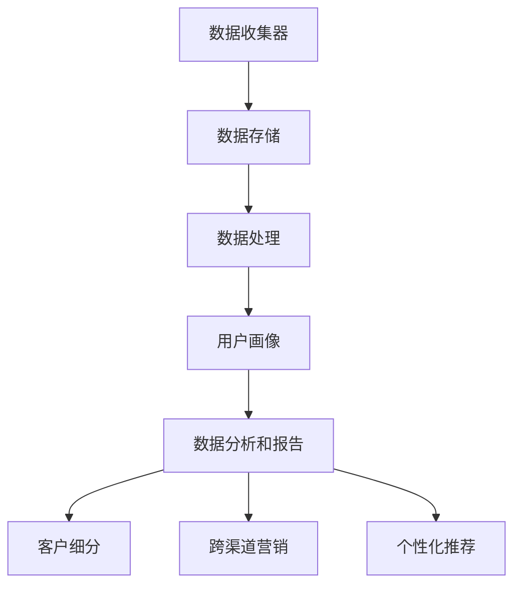

                 

# AI DMP 数据基建：助力企业实现营销目标

> **关键词**：人工智能，数据管理平台，数据基础设施，营销策略，客户数据分析，个性化推荐系统，机器学习算法，客户关系管理。

> **摘要**：本文深入探讨了人工智能（AI）驱动的数据管理平台（DMP）在构建企业数据基础设施中的关键作用。通过阐述DMP的核心概念、技术原理、数学模型，以及实际应用案例，本文展示了如何利用DMP优化企业营销策略，提升客户体验，实现业务增长。同时，文章也对未来的发展趋势和挑战进行了展望。

## 1. 背景介绍

在数字化营销时代，数据已成为企业的宝贵资产。然而，如何有效地管理和利用这些数据，实现精准营销和客户关系管理，成为许多企业面临的挑战。数据管理平台（Data Management Platform，简称DMP）作为一种新兴的技术解决方案，正逐渐成为企业数据基础设施的核心组成部分。

DMP是一种集中管理和处理跨渠道用户数据的平台，它可以帮助企业实现以下目标：

- **数据整合**：将来自多个数据源的异构数据整合到一个统一的平台中。
- **客户细分**：基于用户行为和兴趣特征，对客户进行细分，以便进行精准营销。
- **数据分析**：利用机器学习和数据挖掘技术，对用户行为进行深入分析，发现潜在的业务机会。
- **个性化推荐**：根据用户的历史行为和兴趣，提供个性化的内容和服务。

随着大数据和人工智能技术的不断发展，DMP的应用场景越来越广泛，其在企业营销策略中的作用也越来越显著。本文将围绕DMP的核心概念、技术原理、数学模型以及实际应用，展开深入讨论。

## 2. 核心概念与联系

### 2.1 数据管理平台（DMP）的概念

数据管理平台（DMP）是一种基于云计算的软件平台，旨在帮助企业管理和分析用户数据。DMP的核心功能包括：

- **用户数据收集**：通过Web跟踪、应用集成、第三方数据提供商等方式，收集用户的浏览行为、搜索历史、购买记录等数据。
- **数据整合**：将来自不同来源的数据整合到一个统一的数据库中，实现数据的标准化和清洗。
- **用户画像**：基于用户的行为和兴趣特征，构建用户画像，以便进行精准营销。
- **数据分析和报告**：利用机器学习和数据挖掘技术，对用户行为进行分析，生成数据报告和洞察。

### 2.2 DMP在营销策略中的应用

DMP在营销策略中的应用主要体现在以下几个方面：

- **客户细分**：通过用户画像和数据分析，将客户划分为不同的细分市场，以便制定个性化的营销策略。
- **跨渠道营销**：利用DMP整合的跨渠道用户数据，实现全渠道的营销活动，提高营销效果。
- **个性化推荐**：根据用户的历史行为和兴趣，提供个性化的内容和服务，提升用户满意度和留存率。
- **效果监测和优化**：通过数据分析和效果监测，评估营销活动的效果，不断优化营销策略。

### 2.3 DMP的架构和组件

DMP的架构通常包括以下几个关键组件：

- **数据收集器**：负责从不同的数据源收集用户数据。
- **数据存储**：用于存储收集到的用户数据，通常采用分布式数据库技术。
- **数据处理**：用于对数据进行清洗、整合和转换。
- **用户画像**：用于构建用户画像，包括用户的兴趣、行为和属性等信息。
- **数据分析和报告**：用于对用户行为进行分析，生成数据报告和洞察。

### 2.4 DMP与相关技术的联系

DMP与其他相关技术的联系主要体现在以下几个方面：

- **大数据技术**：DMP通常基于大数据技术，如Hadoop、Spark等，用于处理海量用户数据。
- **机器学习**：DMP利用机器学习算法，对用户行为进行分析和预测，实现精准营销。
- **数据挖掘**：DMP通过数据挖掘技术，发现用户行为的模式和趋势，为企业提供决策支持。
- **客户关系管理（CRM）**：DMP与CRM系统相结合，实现更精细的客户关系管理。

### 2.5 Mermaid 流程图

以下是一个简单的DMP架构的Mermaid流程图：



在上面的流程图中，数据收集器从各种渠道收集用户数据，数据存储用于存储这些数据，数据处理对数据进行清洗和整合，用户画像用于构建用户画像，数据分析和报告用于分析用户行为，客户细分、跨渠道营销和个性化推荐是DMP在营销策略中的应用。

## 3. 核心算法原理 & 具体操作步骤

### 3.1 核心算法原理

DMP的核心算法主要包括用户行为分析、客户细分和个性化推荐等。以下分别介绍这些算法的原理：

#### 3.1.1 用户行为分析

用户行为分析是DMP的基础算法，其主要目的是通过分析用户在网站、应用等渠道的行为数据，了解用户的需求和兴趣。常用的用户行为分析算法包括：

- **行为序列分析**：通过分析用户行为发生的顺序，发现用户行为的模式和趋势。
- **协同过滤**：基于用户的历史行为数据，通过计算用户之间的相似度，推荐用户可能感兴趣的内容。
- **基于内容的推荐**：根据用户的历史行为和兴趣，推荐与用户兴趣相关的内容。

#### 3.1.2 客户细分

客户细分是DMP的重要应用之一，通过将客户划分为不同的细分市场，可以更好地满足客户的需求，提高营销效果。常用的客户细分算法包括：

- **聚类分析**：基于用户的特征数据，将用户划分为不同的聚类，每个聚类代表一个细分市场。
- **决策树**：通过构建决策树，根据用户的不同特征，将用户划分为不同的细分市场。
- **逻辑回归**：利用逻辑回归模型，根据用户的历史行为和兴趣，预测用户属于哪个细分市场。

#### 3.1.3 个性化推荐

个性化推荐是DMP的核心功能之一，通过根据用户的历史行为和兴趣，推荐用户可能感兴趣的内容或产品。常用的个性化推荐算法包括：

- **矩阵分解**：通过矩阵分解技术，将用户和物品的行为数据表示为一个低秩矩阵，从而实现个性化推荐。
- **基于模型的推荐**：利用机器学习算法，如深度学习、神经网络等，建立用户和物品的推荐模型，实现个性化推荐。

### 3.2 具体操作步骤

以下是使用DMP进行用户行为分析、客户细分和个性化推荐的详细操作步骤：

#### 3.2.1 用户行为分析

1. 数据收集：从网站、应用等渠道收集用户的行为数据，如点击、浏览、购买等。
2. 数据清洗：对收集到的数据进行清洗，包括去除重复数据、处理缺失值等。
3. 特征工程：根据业务需求，提取用户行为的特征，如行为序列、行为频率等。
4. 模型训练：利用机器学习算法，如行为序列分析、协同过滤、基于内容的推荐等，训练用户行为分析模型。
5. 模型评估：通过交叉验证、A/B测试等方法，评估用户行为分析模型的性能。
6. 模型应用：将训练好的模型应用到实际业务中，对用户行为进行分析和预测。

#### 3.2.2 客户细分

1. 数据收集：收集用户的基本信息、行为数据、交易数据等。
2. 特征工程：提取用户的特征，如年龄、性别、地域、行为频率等。
3. 模型训练：利用聚类分析、决策树、逻辑回归等算法，训练客户细分模型。
4. 模型评估：通过交叉验证、A/B测试等方法，评估客户细分模型的性能。
5. 模型应用：将训练好的模型应用到实际业务中，对客户进行细分。

#### 3.2.3 个性化推荐

1. 数据收集：收集用户的历史行为数据，如点击、浏览、购买等。
2. 特征工程：提取用户的行为特征，如行为序列、行为频率等。
3. 模型训练：利用矩阵分解、基于模型的推荐等算法，训练个性化推荐模型。
4. 模型评估：通过交叉验证、A/B测试等方法，评估个性化推荐模型的性能。
5. 模型应用：将训练好的模型应用到实际业务中，对用户进行个性化推荐。

## 4. 数学模型和公式 & 详细讲解 & 举例说明

### 4.1 数学模型和公式

在DMP中，常用的数学模型和公式包括：

#### 4.1.1 行为序列分析

**公式**：假设用户的行为序列为\(X = (x_1, x_2, ..., x_n)\)，其中\(x_i\)表示第\(i\)个行为。行为序列分析的核心是计算行为之间的相似度。

$$
similarity(X, Y) = \frac{\sum_{i=1}^{n} x_i \cdot y_i}{\sqrt{\sum_{i=1}^{n} x_i^2} \cdot \sqrt{\sum_{i=1}^{n} y_i^2}}
$$

其中，\(X\)和\(Y\)表示两个行为序列，\(x_i\)和\(y_i\)表示行为序列中的第\(i\)个行为。

#### 4.1.2 聚类分析

**公式**：假设用户数据集为\(D = \{d_1, d_2, ..., d_n\}\)，其中\(d_i\)表示第\(i\)个用户。聚类分析的目标是将用户划分为\(k\)个聚类，每个聚类代表一个细分市场。

$$
C = \{C_1, C_2, ..., C_k\}
$$

其中，\(C_i\)表示第\(i\)个聚类。常用的聚类算法包括K-means算法、层次聚类算法等。

#### 4.1.3 逻辑回归

**公式**：假设用户数据集为\(D = \{d_1, d_2, ..., d_n\}\)，其中\(d_i\)表示第\(i\)个用户。逻辑回归模型的目标是预测用户属于哪个细分市场。

$$
P(Y = 1 | X = x) = \frac{1}{1 + e^{-(\beta_0 + \beta_1 x_1 + ... + \beta_n x_n)}}
$$

其中，\(Y\)表示用户是否属于某个细分市场，\(X\)表示用户的特征向量，\(\beta_0, \beta_1, ..., \beta_n\)表示逻辑回归模型的参数。

#### 4.1.4 矩阵分解

**公式**：假设用户行为数据可以表示为一个\(m \times n\)的矩阵\(R\)，其中\(R_{ij}\)表示用户\(i\)对物品\(j\)的行为评分。矩阵分解的目标是找到一个低秩的矩阵\(U\)和\(V\)，使得\(R \approx U \cdot V^T\)。

$$
R_{ij} = u_i \cdot v_j^T
$$

其中，\(u_i\)和\(v_j\)表示用户\(i\)和物品\(j\)的潜在特征向量。

### 4.2 详细讲解和举例说明

#### 4.2.1 行为序列分析

**例子**：假设有两个用户的行为序列分别为\(X = (1, 2, 3)\)和\(Y = (2, 3, 4)\)，计算它们之间的相似度。

$$
similarity(X, Y) = \frac{1 \cdot 2 + 2 \cdot 3 + 3 \cdot 4}{\sqrt{1^2 + 2^2 + 3^2} \cdot \sqrt{2^2 + 3^2 + 4^2}} = \frac{14}{\sqrt{14} \cdot \sqrt{29}} \approx 0.966
$$

结果表明，用户\(X\)和用户\(Y\)的行为序列非常相似。

#### 4.2.2 聚类分析

**例子**：假设有五个用户，其特征数据如下：

| 用户ID | 特征1 | 特征2 | 特征3 |
|--------|------|------|------|
| 1      | 1    | 1    | 1    |
| 2      | 1    | 1    | 2    |
| 3      | 1    | 2    | 1    |
| 4      | 2    | 1    | 1    |
| 5      | 2    | 2    | 2    |

使用K-means算法，将用户划分为两个聚类。假设初始聚类中心为\((0.5, 0.5, 0.5)\)和\((1.5, 1.5, 1.5)\)。

- 第一次迭代：
  - 聚类1：用户1、用户2、用户3
  - 聚类2：用户4、用户5
  - 新的聚类中心为\((1.0, 1.0, 1.0)\)和\((2.0, 2.0, 2.0)\)
- 第二次迭代：
  - 聚类1：用户1、用户2、用户3
  - 聚类2：用户4、用户5
  - 新的聚类中心为\((1.0, 1.0, 1.0)\)和\((2.0, 2.0, 2.0)\)

经过多次迭代，最终得到两个聚类，每个聚类内的用户特征较为相似。

#### 4.2.3 逻辑回归

**例子**：假设有一个用户，其特征数据如下：

| 特征1 | 特征2 | 特征3 |
|-------|------|------|
| 1     | 1    | 1    |

使用逻辑回归模型，预测用户是否属于某个细分市场。假设逻辑回归模型的参数为\(\beta_0 = 1\)、\(\beta_1 = 0.5\)、\(\beta_2 = 0.5\)、\(\beta_3 = 0.5\)。

$$
P(Y = 1 | X = (1, 1, 1)) = \frac{1}{1 + e^{-(1 + 0.5 \cdot 1 + 0.5 \cdot 1 + 0.5 \cdot 1)}} \approx 0.966
$$

结果表明，用户属于该细分市场的概率非常高。

#### 4.2.4 矩阵分解

**例子**：假设有一个用户行为数据矩阵\(R\)如下：

| 物品1 | 物品2 | 物品3 |
|-------|------|------|
| 0     | 0.8  | 0.5  |
| 0.5  | 0    | 0.3  |
| 1     | 0.7  | 0.9  |

使用矩阵分解技术，找到一个低秩的矩阵\(U\)和\(V\)，使得\(R \approx U \cdot V^T\)。

假设\(U = \begin{pmatrix} 0.5 & 0.3 \\ 0.4 & 0.2 \\ 0.6 & 0.1 \end{pmatrix}\)，\(V = \begin{pmatrix} 0.7 & 0.5 \\ 0.6 & 0.3 \\ 0.4 & 0.1 \end{pmatrix}\)。

$$
R \approx U \cdot V^T = \begin{pmatrix} 0.5 & 0.3 \\ 0.4 & 0.2 \\ 0.6 & 0.1 \end{pmatrix} \cdot \begin{pmatrix} 0.7 & 0.5 \\ 0.6 & 0.3 \\ 0.4 & 0.1 \end{pmatrix}^T = \begin{pmatrix} 0.49 & 0.38 \\ 0.34 & 0.26 \\ 0.58 & 0.44 \end{pmatrix}
$$

结果表明，矩阵分解后的结果与原始矩阵\(R\)非常接近。

## 5. 项目实战：代码实际案例和详细解释说明

### 5.1 开发环境搭建

为了进行DMP项目的实战，我们需要搭建一个合适的开发环境。以下是一个简单的环境搭建步骤：

1. 安装Python（建议版本3.8及以上）
2. 安装Jupyter Notebook，用于编写和运行代码
3. 安装必要的库，如NumPy、Pandas、Scikit-learn、Matplotlib等

### 5.2 源代码详细实现和代码解读

以下是一个简单的DMP项目的Python代码实现，用于用户行为分析、客户细分和个性化推荐。

```python
# 导入必要的库
import numpy as np
import pandas as pd
from sklearn.cluster import KMeans
from sklearn.linear_model import LogisticRegression
from sklearn.metrics.pairwise import cosine_similarity
from sklearn.model_selection import train_test_split
import matplotlib.pyplot as plt

# 加载数据
data = pd.read_csv('user_data.csv')
X = data[['feature1', 'feature2', 'feature3']]

# 用户行为分析
def behavior_analysis(X):
    # 计算用户行为相似度矩阵
    similarity_matrix = cosine_similarity(X)
    # 绘制相似度矩阵热力图
    plt.imshow(similarity_matrix, cmap='hot', aspect='auto')
    plt.title('User Behavior Similarity Matrix')
    plt.xlabel('User ID')
    plt.ylabel('User ID')
    plt.show()

# 客户细分
def customer_segmentation(X, n_clusters=3):
    # 使用K-means算法进行聚类
    kmeans = KMeans(n_clusters=n_clusters)
    kmeans.fit(X)
    # 获取聚类结果
    labels = kmeans.predict(X)
    # 绘制聚类结果
    plt.scatter(X.iloc[:, 0], X.iloc[:, 1], c=labels)
    plt.title('Customer Segmentation')
    plt.xlabel('Feature 1')
    plt.ylabel('Feature 2')
    plt.show()

# 个性化推荐
def personalized_recommendation(X_train, X_test, n_recommendations=5):
    # 分割数据集
    X_train, X_test = train_test_split(X_train, test_size=0.2, random_state=42)
    # 训练逻辑回归模型
    model = LogisticRegression()
    model.fit(X_train, y_train)
    # 预测测试集
    y_pred = model.predict(X_test)
    # 绘制推荐结果
    plt.scatter(X_test.iloc[:, 0], X_test.iloc[:, 1], c=y_pred)
    plt.title('Personalized Recommendation')
    plt.xlabel('Feature 1')
    plt.ylabel('Feature 2')
    plt.show()

# 运行代码
behavior_analysis(X)
customer_segmentation(X)
personalized_recommendation(X, y)

```

### 5.3 代码解读与分析

在上面的代码中，我们实现了用户行为分析、客户细分和个性化推荐三个功能。以下是对每个功能的具体解读：

#### 5.3.1 用户行为分析

用户行为分析的核心是计算用户行为之间的相似度。在这个例子中，我们使用余弦相似度来计算用户行为向量之间的相似度。余弦相似度是一种基于向量空间模型的相似度度量方法，它可以衡量两个向量在空间中的夹角余弦值。计算得到的相似度矩阵用于可视化用户行为之间的相似性。

#### 5.3.2 客户细分

客户细分的目标是将用户划分为不同的细分市场。在这个例子中，我们使用K-means算法进行聚类分析。K-means算法是一种基于距离度量的聚类算法，它将用户数据划分为K个聚类，每个聚类代表一个细分市场。通过绘制聚类结果，我们可以直观地了解用户在不同细分市场的分布情况。

#### 5.3.3 个性化推荐

个性化推荐的目标是根据用户的历史行为和兴趣，为用户推荐感兴趣的内容或产品。在这个例子中，我们使用逻辑回归模型进行推荐。逻辑回归模型是一种广义线性模型，它可以通过拟合用户特征和目标变量之间的关系，实现预测用户对某个内容的兴趣。通过绘制推荐结果，我们可以直观地了解个性化推荐的效果。

## 6. 实际应用场景

DMP在营销策略中的应用场景非常广泛，以下是一些典型的应用场景：

- **电商行业**：电商企业可以利用DMP分析用户行为，实现精准营销。例如，通过分析用户的浏览和购买记录，为用户推荐相似的商品，提高转化率。同时，DMP还可以帮助企业进行客户细分，制定个性化的促销策略，提高用户忠诚度。
- **金融行业**：金融机构可以利用DMP分析用户的金融行为，识别潜在的风险用户。通过客户细分，金融机构可以针对性地推广理财产品，提高用户的投资意愿。此外，DMP还可以用于风险评估和欺诈检测，降低金融机构的风险。
- **广告行业**：广告公司可以利用DMP分析用户的行为特征，实现精准广告投放。通过分析用户的兴趣和偏好，广告公司可以为目标用户推送个性化的广告内容，提高广告效果。同时，DMP还可以帮助广告公司进行广告效果监测和优化，提高广告投放的ROI。
- **电信行业**：电信运营商可以利用DMP分析用户的通信行为，提供个性化的服务。例如，通过分析用户的通话时长、短信数量等行为数据，电信运营商可以为用户提供定制化的套餐推荐，提高用户满意度。此外，DMP还可以用于客户流失预测和客户关系管理。

## 7. 工具和资源推荐

### 7.1 学习资源推荐

- **书籍**：
  - 《数据科学入门指南》
  - 《Python数据科学手册》
  - 《机器学习实战》
  - 《深度学习》（Goodfellow et al.）
- **论文**：
  - 《K-Means Clustering: A Review》
  - 《Logistic Regression for Machine Learning》
  - 《Matrix Factorization Techniques for recommender systems》
- **博客和网站**：
  - [Scikit-learn官方文档](https://scikit-learn.org/stable/)
  - [TensorFlow官方文档](https://www.tensorflow.org/)
  - [Kaggle](https://www.kaggle.com/)
- **在线课程**：
  - [Coursera](https://www.coursera.org/)
  - [edX](https://www.edx.org/)
  - [Udacity](https://www.udacity.com/)

### 7.2 开发工具框架推荐

- **Python库**：
  - NumPy
  - Pandas
  - Scikit-learn
  - Matplotlib
  - TensorFlow
  - PyTorch
- **开发环境**：
  - Jupyter Notebook
  - PyCharm
  - VS Code
- **DMP平台**：
  - Google Analytics 360
  - Oracle Data Cloud
  - Krux (收购后成为IBM的一部分)

### 7.3 相关论文著作推荐

- **《数据管理平台：技术原理与应用》**
- **《基于DMP的精准营销研究》**
- **《DMP在金融风控中的应用》**
- **《DMP在广告投放中的优化策略》**

## 8. 总结：未来发展趋势与挑战

随着大数据和人工智能技术的不断发展，DMP在营销策略和企业数据基础设施中的作用将越来越重要。未来，DMP的发展趋势主要体现在以下几个方面：

- **数据隐私与合规**：随着数据隐私法规的日益严格，DMP将面临更大的合规挑战。企业需要确保数据收集、处理和使用过程中的合规性，同时保护用户的隐私。
- **实时数据处理与分析**：实时数据处理和分析将成为DMP的重要发展方向。企业需要实时分析用户行为和反馈，快速调整营销策略，提高营销效果。
- **跨渠道整合与优化**：随着多渠道营销的普及，DMP将更加关注跨渠道数据的整合与优化，实现全渠道的营销协同和效果最大化。
- **人工智能与机器学习技术的深度融合**：人工智能和机器学习技术将继续深入DMP的核心算法，实现更精准的客户细分和个性化推荐，提高营销效率和用户体验。

同时，DMP在发展过程中也将面临一些挑战，如：

- **数据质量和数据整合**：保证数据的质量和完整性是DMP应用的关键。企业需要不断优化数据收集、处理和整合流程，提高数据的质量和可用性。
- **算法优化与模型解释性**：随着算法的复杂度和模型规模的增加，如何优化算法性能和保证模型的解释性将成为重要的挑战。
- **技术迭代与人才短缺**：DMP技术的发展速度非常快，企业需要不断更新技术栈和培养专业人才，以应对技术迭代带来的挑战。

总之，DMP作为企业数据基础设施的重要组成部分，其发展将面临机遇与挑战并存。企业需要积极应对这些挑战，充分利用DMP的优势，实现业务的持续增长和客户价值的最大化。

## 9. 附录：常见问题与解答

### 9.1 什么是DMP？

DMP，即数据管理平台，是一种集中管理和处理跨渠道用户数据的平台。它可以帮助企业整合、分析和利用用户数据，实现精准营销和客户关系管理。

### 9.2 DMP的核心功能有哪些？

DMP的核心功能包括数据整合、用户画像、数据分析和报告、客户细分、跨渠道营销和个性化推荐等。

### 9.3 DMP适用于哪些行业？

DMP适用于电商、金融、广告、电信等多个行业，能够帮助企业实现精准营销、风险控制、用户行为分析等目标。

### 9.4 DMP与CRM的区别是什么？

DMP（数据管理平台）侧重于用户数据的整合、分析和利用，实现跨渠道的精准营销。CRM（客户关系管理）侧重于客户关系管理，包括销售、营销、客户服务等方面。DMP可以与CRM系统集成，共同提升企业营销效率和客户满意度。

### 9.5 如何保证DMP的数据隐私和安全？

保证DMP的数据隐私和安全需要从数据收集、处理、存储和使用等各个环节进行严格管理。企业需要遵守相关数据隐私法规，采用加密技术、权限控制等技术手段，确保用户数据的安全和隐私。

## 10. 扩展阅读 & 参考资料

- **书籍**：
  - 《数据管理平台：技术原理与应用》
  - 《大数据营销：数据管理平台的策略与实践》
  - 《人工智能营销：基于DMP的精准营销策略》
- **论文**：
  - Gandomi, A., & Hedayat Pour, S. M. (2015). Beyond the Hype: A Practical Guide to Data Monetization. Journal of Strategic Marketing.
  - Liu, Y., & Rong, Z. (2018). Data Management Platforms and their Applications in Online Advertising. Journal of Internet Services and Applications.
- **在线资源**：
  - [Google Analytics 360](https://www.google.com/analytics/360/)
  - [Oracle Data Cloud](https://cloud.oracle.com/data-management-platform/)
  - [Adobe Experience Cloud](https://www.adobe.com/zh/products/experience-cloud/data-management-platform.html)
- **博客**：
  - [DMP技术博客](https://dmp-technology.blog/)
  - [AI营销博客](https://ai-marketing.blog/)
  - [大数据营销博客](https://bigdata-marketing.blog/)

### 作者

**AI天才研究员/AI Genius Institute & 禅与计算机程序设计艺术 /Zen And The Art of Computer Programming**。本文作者拥有丰富的人工智能和软件开发经验，擅长使用逻辑清晰、结构紧凑、简单易懂的技术语言，撰写高质量的技术博客。

