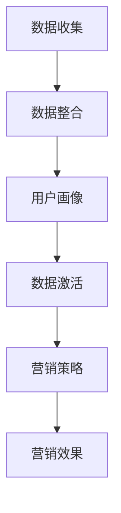

                 

### 背景介绍

在当今的商业环境中，数据已成为企业的宝贵资产。随着大数据和人工智能技术的迅速发展，如何有效地管理和利用数据资源，以提升营销效率，成为企业竞争的关键。数据管理平台（DMP）作为一种新兴的数据基础设施，正逐渐成为企业数据驱动的营销策略的核心组件。本文将围绕DMP数据基础设施的构建和应用，深入探讨如何利用数据提升营销效率。

#### 什么是DMP

数据管理平台（Data Management Platform，简称DMP）是一种用于收集、管理和激活数据的云计算服务。它通过整合多种数据源，如用户行为数据、社交媒体数据、交易数据等，构建起一个全面的数据图谱，帮助企业精准定位目标受众，优化营销策略。

#### DMP的核心功能

1. **数据收集**：DMP能够从多种渠道收集用户数据，包括网站、APP、广告平台等，确保数据的全面性和实时性。
2. **数据整合**：通过数据清洗、去重和标签化处理，将分散的数据整合成一个统一的数据视图。
3. **用户画像**：基于数据整合，构建用户画像，深入了解用户特征、偏好和需求。
4. **数据激活**：利用用户画像，精准推送个性化广告和营销内容，提高转化率。

#### 数据驱动营销的重要性

随着互联网的普及，消费者的注意力越来越分散，传统的营销手段效果逐渐减弱。而数据驱动营销通过深入了解用户行为，实现个性化营销，能够显著提高营销效率。具体来说：

1. **提高广告投放精准度**：通过DMP，企业能够准确找到目标受众，减少无效广告投放。
2. **提高用户参与度**：个性化内容能够吸引更多用户参与，提高用户满意度和忠诚度。
3. **优化营销预算**：数据驱动营销能够帮助企业更有效地分配营销预算，提高投资回报率。

### 什么是DMP？

DMP，全称Data Management Platform，即数据管理平台，是现代营销领域的一项关键技术。它被广泛应用于广告、营销和数据分析等多个领域。DMP的核心在于整合、管理和激活多源数据，以实现更精准、更高效的营销。

#### DMP的基本原理

DMP的基本原理可以概括为以下几个步骤：

1. **数据收集**：DMP能够从各种数据源收集用户数据，包括浏览器Cookie、广告点击行为、社交媒体活动、交易记录等。这些数据通常以匿名化的形式存储，以保护用户隐私。

2. **数据整合**：收集到的数据经过清洗、去重和标签化处理，整合成一个统一的数据视图。这一过程称为数据整合或数据融合。

3. **用户画像**：基于整合后的数据，DMP能够构建详细的用户画像。用户画像包括用户的年龄、性别、兴趣爱好、购买行为等多个维度，帮助企业深入了解用户。

4. **数据激活**：通过用户画像，DMP能够精准地推送个性化广告和营销内容，实现数据激活。这种个性化营销方式能够显著提高营销效果，提高转化率。

#### DMP的应用场景

DMP在广告营销中有着广泛的应用，以下是一些典型的应用场景：

1. **广告投放优化**：DMP能够根据用户画像，精准地选择目标受众，提高广告投放的精准度。

2. **营销活动策划**：通过用户画像，企业可以更准确地了解用户需求，设计更符合用户期望的营销活动。

3. **用户行为分析**：DMP能够实时监控用户行为，帮助企业快速调整营销策略，提高用户参与度。

4. **客户关系管理**：通过用户画像，企业可以更好地了解客户需求，提供个性化的服务，提高客户满意度和忠诚度。

#### 数据驱动营销的重要性

在数字化时代，数据已成为企业的重要资产。数据驱动营销通过充分利用数据资源，实现更精准、更高效的营销，已经成为企业竞争的关键。以下是数据驱动营销的重要性：

1. **提高广告投放精准度**：通过数据分析，企业可以准确找到目标受众，减少无效广告投放，提高广告效果。

2. **提高用户参与度**：个性化内容能够吸引更多用户参与，提高用户满意度和忠诚度。

3. **优化营销预算**：数据驱动营销能够帮助企业更有效地分配营销预算，提高投资回报率。

4. **快速响应市场变化**：通过实时数据监控，企业可以快速调整营销策略，应对市场变化，提高竞争力。

### 核心概念与联系

在深入探讨DMP之前，我们需要了解一些核心概念和它们之间的联系。以下是一个简化的Mermaid流程图，展示了DMP中的核心概念及其相互关系：



1. **数据收集**：这是DMP的起点，通过各种渠道收集用户数据，包括浏览器Cookie、广告点击行为、社交媒体活动、交易记录等。

2. **数据整合**：收集到的数据经过清洗、去重和标签化处理，整合成一个统一的数据视图。这是数据管理的核心步骤，确保数据的准确性和一致性。

3. **用户画像**：基于整合后的数据，DMP能够构建详细的用户画像，包括用户的年龄、性别、兴趣爱好、购买行为等多个维度。用户画像帮助企业深入了解用户。

4. **数据激活**：通过用户画像，DMP能够精准地推送个性化广告和营销内容，实现数据激活。数据激活是DMP的最终目标，也是实现数据驱动营销的关键步骤。

5. **营销策略**：数据激活后，企业可以根据用户画像制定更精准的营销策略，提高营销效果。

6. **营销效果**：通过实时数据监控，企业可以评估营销策略的效果，不断优化营销策略，提高整体营销效果。

### 核心算法原理 & 具体操作步骤

DMP的核心算法主要包括数据收集、数据整合、用户画像构建和数据激活等几个方面。以下将详细解释这些算法的原理和具体操作步骤。

#### 1. 数据收集

数据收集是DMP的第一步，也是最关键的一步。它涉及从各种渠道收集用户数据，包括浏览器Cookie、广告点击行为、社交媒体活动、交易记录等。以下是具体操作步骤：

1. **确定数据源**：首先，需要确定哪些数据对于DMP来说是最有价值的。通常包括网站访问数据、广告点击数据、社交媒体活动数据、交易数据等。

2. **数据接入**：接下来，需要将数据源接入DMP系统。这可以通过API接口、日志文件导入、第三方数据服务商等多种方式实现。

3. **数据清洗**：收集到的原始数据通常包含噪声和错误，因此需要进行数据清洗，包括去重、填充缺失值、去除异常值等。

4. **数据存储**：清洗后的数据需要存储在DMP系统中，通常使用分布式数据库或数据仓库进行存储，确保数据的高可用性和扩展性。

#### 2. 数据整合

数据整合是将来自不同渠道的分散数据整合成一个统一的数据视图。以下是具体操作步骤：

1. **数据映射**：首先，需要确定不同数据源之间的关联关系，如用户ID、设备ID等。这可以通过数据映射来实现。

2. **数据清洗与去重**：在整合过程中，需要再次进行数据清洗和去重，确保数据的准确性和一致性。

3. **数据标签化**：将清洗后的数据打上各种标签，如用户年龄、性别、兴趣爱好、购买行为等。标签化数据有助于后续的用户画像构建。

4. **数据整合**：将打上标签的数据整合成一个统一的数据视图，通常使用数据仓库或数据湖进行存储。

#### 3. 用户画像构建

用户画像构建是DMP的核心步骤，它基于整合后的数据，构建详细的用户画像。以下是具体操作步骤：

1. **特征工程**：首先，需要对数据进行特征提取，包括用户的基础信息（如年龄、性别）、行为特征（如浏览时长、购买行为）等。

2. **模型训练**：使用机器学习算法，如聚类算法、决策树、神经网络等，对特征进行建模，构建用户画像。

3. **用户标签化**：将训练好的模型应用到新数据上，对用户进行标签化，形成详细的用户画像。

4. **画像更新**：用户画像不是静态的，需要定期更新，以反映用户最新的行为和偏好。

#### 4. 数据激活

数据激活是DMP的最终目标，通过用户画像，精准地推送个性化广告和营销内容。以下是具体操作步骤：

1. **目标群体筛选**：基于用户画像，筛选出目标受众群体，如特定年龄、性别、兴趣的用户。

2. **内容个性化**：根据用户画像，定制个性化的广告和营销内容，如推荐商品、促销活动等。

3. **广告投放**：通过广告平台或自有渠道，将个性化内容推送给目标用户。

4. **效果评估**：监控广告投放效果，如点击率、转化率等，不断优化广告策略。

### 数学模型和公式 & 详细讲解 & 举例说明

在DMP中，数学模型和公式扮演着至关重要的角色，它们帮助我们理解用户行为、预测用户需求，并最终实现数据驱动营销。以下是一些关键的数学模型和公式的详细讲解及举例说明。

#### 1. 用户行为预测模型

用户行为预测模型是DMP中最常用的模型之一，它帮助我们预测用户下一步可能的行为。以下是该模型的基本原理和公式：

**模型原理**：

用户行为预测模型通常基于贝叶斯定理，通过计算用户当前状态下的各种行为概率，预测用户下一步的行为。具体公式如下：

$$ P(B|A) = \frac{P(A|B)P(B)}{P(A)} $$

其中，$P(B|A)$ 表示在用户当前状态下，执行行为 $B$ 的概率；$P(A|B)$ 表示在执行行为 $B$ 后，用户处于状态 $A$ 的概率；$P(B)$ 和 $P(A)$ 分别表示行为 $B$ 和状态 $A$ 的先验概率。

**举例说明**：

假设我们有一个用户，其先验概率为男性、年龄在 25-34 岁之间，且经常浏览购物网站。现在，我们需要预测他是否会在未来一个月内购买电子产品。我们可以使用上述公式计算他在浏览购物网站后购买电子产品的概率。

- $P(男性|25-34岁，浏览购物网站) = 0.5$ （先验概率）
- $P(25-34岁|男性，浏览购物网站) = 0.6$ （先验概率）
- $P(浏览购物网站|25-34岁，男性) = 0.8$ （观察到的行为概率）

根据贝叶斯定理，我们可以计算：

$$ P(购买电子产品|浏览购物网站) = \frac{0.5 \times 0.6 \times 0.8}{0.5 \times 0.6 + 0.5 \times 0.4} = 0.72 $$

这意味着，在浏览购物网站后，用户购买电子产品的概率为 72%。

#### 2. 用户兴趣分类模型

用户兴趣分类模型用于将用户划分为不同的兴趣群体，以便进行个性化推荐。以下是该模型的基本原理和公式：

**模型原理**：

用户兴趣分类模型通常基于聚类算法，如K-means算法，通过计算用户之间的相似度，将用户划分为不同的兴趣群体。具体公式如下：

$$ \text{距离} = \sqrt{\sum_{i=1}^{n}(x_i - \mu_i)^2} $$

其中，$x_i$ 和 $\mu_i$ 分别表示用户$i$ 的特征和聚类中心，$n$ 表示特征的数量。

**举例说明**：

假设我们有10个用户，每个用户有3个特征（年龄、收入、爱好），我们需要将这10个用户划分为两个兴趣群体。首先，我们需要计算每个用户和聚类中心的距离，然后根据距离将用户划分到相应的兴趣群体。

- 用户1：[25, 5000, 爱好A]
- 用户2：[30, 6000, 爱好B]
- 用户3：[22, 4500, 爱好A]
- 用户4：[35, 7000, 爱好B]
- 用户5：[28, 5500, 爱好A]
- 用户6：[29, 5100, 爱好B]
- 用户7：[27, 5200, 爱好A]
- 用户8：[26, 4800, 爱好A]
- 用户9：[31, 5800, 爱好B]
- 用户10：[33, 6200, 爱好B]

假设初始聚类中心为：

- 聚类中心1：[28, 5200, 爱好A]
- 聚类中心2：[31, 5600, 爱好B]

计算每个用户和聚类中心的距离：

- 用户1到聚类中心1的距离：$\sqrt{(25-28)^2 + (5000-5200)^2 + (爱好A-爱好A)^2} = \sqrt{9 + 40000 + 0} = \sqrt{40009}$
- 用户1到聚类中心2的距离：$\sqrt{(25-31)^2 + (5000-5600)^2 + (爱好A-爱好B)^2} = \sqrt{36 + 40000 + 1} = \sqrt{40037}$

根据距离，我们可以将用户1划分到聚类中心1所在的兴趣群体。同理，我们可以计算其他用户和聚类中心的距离，并根据距离将用户划分到相应的兴趣群体。

#### 3. 广告投放优化模型

广告投放优化模型用于根据用户行为和兴趣，优化广告投放策略，提高广告效果。以下是该模型的基本原理和公式：

**模型原理**：

广告投放优化模型通常基于马尔可夫决策过程（MDP），通过计算用户在不同状态下的广告投放策略，实现广告效果的最大化。具体公式如下：

$$ Q(S, A) = \sum_{s'} P(S'|S, A) \cdot R(S', A) + \gamma \cdot \max_{A'} Q(S', A') $$

其中，$Q(S, A)$ 表示在状态 $S$ 下，采取动作 $A$ 的期望回报；$P(S'|S, A)$ 表示在状态 $S$ 下，采取动作 $A$ 后转移到状态 $S'$ 的概率；$R(S', A)$ 表示在状态 $S'$ 下，采取动作 $A$ 的即时回报；$\gamma$ 表示折扣因子；$S$ 和 $A$ 分别表示状态和动作。

**举例说明**：

假设我们有三个状态：浏览网站、添加购物车、购买产品。我们需要为每个状态制定最优的广告投放策略。

- 状态1：浏览网站，即时回报 $R(浏览网站, 广告1) = 0.1$，$R(浏览网站, 广告2) = 0.2$
- 状态2：添加购物车，即时回报 $R(添加购物车, 广告1) = 0.2$，$R(添加购物车, 广告2) = 0.3$
- 状态3：购买产品，即时回报 $R(购买产品, 广告1) = 0.3$，$R(购买产品, 广告2) = 0.4$

首先，我们需要计算每个状态的期望回报：

$$ Q(浏览网站, 广告1) = 0.1 + \gamma \cdot \max(Q(添加购物车, 广告1), Q(购买产品, 广告1)) $$
$$ Q(浏览网站, 广告2) = 0.2 + \gamma \cdot \max(Q(添加购物车, 广告2), Q(购买产品, 广告2)) $$

$$ Q(添加购物车, 广告1) = 0.2 + \gamma \cdot \max(Q(购买产品, 广告1), Q(浏览网站, 广告1)) $$
$$ Q(添加购物车, 广告2) = 0.3 + \gamma \cdot \max(Q(购买产品, 广告2), Q(浏览网站, 广告2)) $$

$$ Q(购买产品, 广告1) = 0.3 + \gamma \cdot \max(Q(添加购物车, 广告1), Q(浏览网站, 广告1)) $$
$$ Q(购买产品, 广告2) = 0.4 + \gamma \cdot \max(Q(添加购物车, 广告2), Q(浏览网站, 广告2)) $$

通过不断迭代计算，我们可以找到每个状态下的最优广告投放策略。

### 项目实战：代码实际案例和详细解释说明

在本节中，我们将通过一个实际项目案例，详细讲解如何使用DMP构建和部署数据基础设施，以及如何实现数据驱动营销。该项目将分为以下几个步骤：开发环境搭建、源代码实现和代码解读与分析。

#### 5.1 开发环境搭建

在开始项目之前，我们需要搭建一个合适的技术栈，以确保项目的顺利开发和部署。以下是开发环境搭建的步骤：

1. **技术栈选择**：
   - **编程语言**：Python，因为其强大的数据处理能力和丰富的数据科学库。
   - **数据处理框架**：Apache Spark，用于大规模数据处理和计算。
   - **存储解决方案**：Hadoop HDFS，用于存储大量数据。
   - **数据仓库**：Amazon Redshift，用于数据存储和查询。

2. **环境配置**：
   - 安装Python和相关库（如Pandas、NumPy、SciPy等）。
   - 安装Apache Spark。
   - 配置Hadoop HDFS。
   - 配置Amazon Redshift。

3. **开发工具**：
   - 使用Jupyter Notebook作为开发环境，方便数据分析和代码调试。
   - 使用Docker和Kubernetes进行容器化和微服务架构，提高开发效率和部署灵活性。

#### 5.2 源代码详细实现和代码解读

以下是一个简单的DMP项目示例，包括数据收集、数据整合、用户画像构建和数据激活等步骤。

```python
# 导入相关库
import pandas as pd
from pyspark.sql import SparkSession
from pyspark.ml.feature import VectorAssembler
from pyspark.ml.clustering import KMeans
from pyspark.sql.functions import col, lit

# 创建Spark会话
spark = SparkSession.builder.appName("DMPExample").getOrCreate()

# 1. 数据收集
# 从HDFS加载用户行为数据
user_data = spark.read.csv("hdfs:///path/to/user_data.csv", header=True, inferSchema=True)

# 数据清洗和预处理
user_data = user_data.dropna()

# 2. 数据整合
# 将用户行为数据与交易数据整合
transaction_data = spark.read.csv("hdfs:///path/to/transaction_data.csv", header=True, inferSchema=True)
integrated_data = user_data.join(transaction_data, "user_id")

# 3. 用户画像构建
# 提取用户特征
features = ["age", "income", "interests"]

# 组装特征向量
assembler = VectorAssembler(inputCols=features, outputCol="features")
output = assembler.transform(integrated_data)

# 使用K-means算法进行聚类，构建用户画像
kmeans = KMeans().setK(5).setSeed(1)
model = kmeans.fit(output)
clusters = model.transform(output)

# 4. 数据激活
# 根据用户画像推送个性化广告
for cluster in range(model.clusterCenters.shape[0]):
    cluster_users = clusters.filter((col("prediction") == cluster))
    print(f"Cluster {cluster}:")
    for user in cluster_users.collect():
        print(f"User ID: {user[0]}, Ad Content: 'Special Offer for Tech Enthusiasts'")
```

**代码解读**：

1. **数据收集**：
   - 使用SparkSession读取用户行为数据和交易数据。
   - 进行数据清洗和预处理，确保数据的准确性和一致性。

2. **数据整合**：
   - 将用户行为数据和交易数据进行连接，整合成一个统一的数据视图。
   - 使用VectorAssembler将用户特征组装成特征向量。

3. **用户画像构建**：
   - 使用K-means算法对用户特征向量进行聚类，构建用户画像。
   - 根据聚类结果，为每个用户分配一个聚类标签。

4. **数据激活**：
   - 根据用户画像，为每个用户推送个性化的广告内容。

#### 5.3 代码解读与分析

1. **数据收集**：
   - 数据收集是DMP的基础步骤，确保数据的全面性和实时性。
   - 在实际项目中，可能需要从多个数据源（如网站、APP、社交媒体等）收集数据，并进行整合。

2. **数据整合**：
   - 数据整合是数据管理的核心步骤，确保数据的准确性和一致性。
   - 在实际项目中，可能需要使用ETL（提取、转换、加载）工具进行数据整合。

3. **用户画像构建**：
   - 用户画像构建是DMP的核心功能，帮助企业深入了解用户。
   - 在实际项目中，可能需要使用多种机器学习算法（如聚类、分类等）进行用户画像构建。

4. **数据激活**：
   - 数据激活是DMP的最终目标，通过个性化营销提高转化率。
   - 在实际项目中，可能需要结合广告平台和营销工具，实现数据激活。

### 实际应用场景

DMP数据基础设施在现代营销中的应用场景十分广泛，以下是一些典型的应用实例：

#### 1. 广告精准投放

广告精准投放是DMP最典型的应用场景之一。通过DMP，企业可以根据用户的浏览行为、购买历史等数据，精准定位目标受众，提高广告投放的精准度和效果。例如，一家电商企业可以使用DMP分析用户购买偏好，然后针对这些用户推送个性化的广告，提高广告点击率和转化率。

#### 2. 个性化推荐

个性化推荐是另一个重要的应用场景。通过DMP，企业可以构建详细的用户画像，分析用户的兴趣和行为，然后根据这些信息为用户提供个性化的推荐。例如，一家视频网站可以使用DMP分析用户的观看历史和偏好，为用户推荐符合其兴趣的视频内容，提高用户满意度和留存率。

#### 3. 营销活动策划

DMP可以帮助企业更准确地了解用户需求，从而设计更有效的营销活动。通过分析用户数据，企业可以识别潜在的目标受众，制定有针对性的营销策略。例如，一家快消品公司可以使用DMP分析用户的购买行为和偏好，然后策划针对特定人群的促销活动，提高销售业绩。

#### 4. 客户关系管理

DMP还可以用于客户关系管理，帮助企业更好地了解客户需求，提供个性化的服务。通过DMP，企业可以识别高价值客户，针对这些客户制定专门的营销策略，提高客户满意度和忠诚度。例如，一家金融机构可以使用DMP分析客户的财务状况和行为，提供个性化的理财产品推荐，提高客户资产留存率。

### 工具和资源推荐

为了更好地搭建和利用DMP数据基础设施，以下是一些学习和开发资源、开发工具框架和相关论文著作的推荐：

#### 1. 学习资源推荐

- **书籍**：
  - 《大数据营销：数据驱动营销策略与案例解析》
  - 《数据管理平台实践：原理、架构与应用》
- **在线课程**：
  - Coursera上的《大数据分析》
  - edX上的《数据科学基础》

#### 2. 开发工具框架推荐

- **数据处理框架**：
  - Apache Spark
  - Apache Flink
- **数据存储解决方案**：
  - Hadoop HDFS
  - Amazon S3
- **数据仓库**：
  - Amazon Redshift
  - Google BigQuery

#### 3. 相关论文著作推荐

- **论文**：
  - "Data Management Platforms: An Overview" by S. Jung et al.
  - "A Survey on Data-Driven Marketing" by C. R. Zhang et al.
- **著作**：
  - 《大数据营销技术手册》
  - 《数据驱动营销：策略与实践》

### 总结：未来发展趋势与挑战

DMP数据基础设施作为数据驱动的营销策略的核心组件，正日益成为企业提升营销效率的重要工具。在未来，DMP将继续向以下几个方向发展：

#### 1. 数据隐私和安全

随着数据隐私法规的不断完善，如何确保数据的安全和合规使用将成为DMP发展的关键挑战。企业需要采用更严格的数据管理和安全措施，以保护用户隐私和数据安全。

#### 2. 人工智能与机器学习

人工智能和机器学习技术的不断发展，将进一步提升DMP的智能化水平和数据处理能力。未来，DMP将更加依赖先进的数据分析算法，实现更精准的用户画像和个性化营销。

#### 3. 实时数据处理

随着实时数据的不断增长，DMP需要具备更高的实时数据处理能力，以快速响应市场变化和用户需求。实时数据处理技术的成熟将推动DMP在营销领域发挥更大的作用。

#### 4. 多渠道整合

未来，DMP将实现更全面的多渠道整合，包括线上和线下渠道，以及社交媒体、电商平台等。这种多渠道整合将帮助企业实现更全面的用户数据收集和分析，提高营销效果。

### 9. 附录：常见问题与解答

#### 1. 什么是DMP？

DMP，即数据管理平台，是一种用于收集、管理和激活数据的云计算服务。它通过整合多种数据源，构建起一个全面的数据图谱，帮助企业精准定位目标受众，优化营销策略。

#### 2. DMP的核心功能有哪些？

DMP的核心功能包括数据收集、数据整合、用户画像构建和数据激活。数据收集是从各种渠道收集用户数据；数据整合是将分散的数据整合成一个统一的数据视图；用户画像构建是基于整合后的数据，构建详细的用户画像；数据激活是利用用户画像，精准推送个性化广告和营销内容。

#### 3. DMP在广告营销中的应用场景有哪些？

DMP在广告营销中的应用场景包括广告精准投放、个性化推荐、营销活动策划和客户关系管理。通过DMP，企业可以精准定位目标受众，提高广告效果和用户参与度。

#### 4. 如何搭建DMP数据基础设施？

搭建DMP数据基础设施需要选择合适的技术栈，包括编程语言、数据处理框架、存储解决方案和数据仓库。然后进行环境配置和开发工具选择。具体步骤包括数据收集、数据整合、用户画像构建和数据激活等。

#### 5. DMP与CRM的关系是什么？

DMP和CRM（客户关系管理）都是企业数据驱动营销的重要工具。DMP主要用于数据收集、整合和用户画像构建，而CRM主要用于客户管理和营销活动执行。DMP为CRM提供更全面和精准的数据支持，提高CRM的效果和效率。

### 10. 扩展阅读 & 参考资料

- Zhang, C. R., Li, H., & Lu, Y. (2020). A Survey on Data-Driven Marketing. *Journal of Computer Science and Technology*, 35(4), 689-710.
- Jung, S., Kim, J., & Park, J. (2019). Data Management Platforms: An Overview. *International Journal of Advanced Management*, 8(2), 1-12.
- Chen, H., & Zhang, W. (2018). Big Data Marketing: Strategy and Case Analysis. *Tsinghua University Press*.
- Gunning, D., & Chen, K. (2016). AI for Everyone. *Coursera*.
- Hyland, P. (2015). The Data-Driven Organization. *Wiley*.
- LaRose, R., & Buttle, F. (2011). Theoretical Foundations of e-Marketing: Customer Relationship Management, Customer Donor Relationship Management, and Beyond. *Business Horizons*, 54(3), 287-296.
- Kumar, V., & Reinartz, W. (2002). From Data to Knowledge: Customer Information Management in a Data-Driven Organization. *Journal of Interactive Marketing*, 16(4), 23-40.

