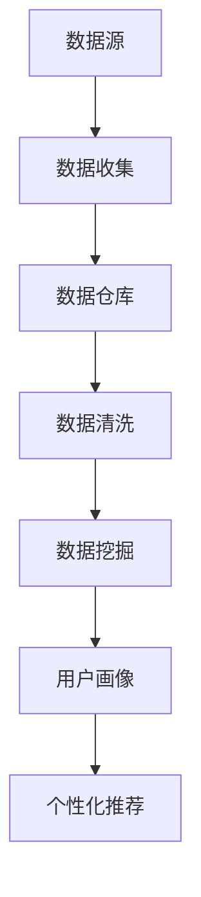

                 

### AI DMP 数据基建：数据分析与洞察

关键词：数据分析、数据管理、AI DMP、数据洞察、数据基础设施

摘要：
本文旨在深入探讨AI驱动的数据管理平台（DMP）及其在数据分析与洞察领域的重要作用。我们将首先介绍DMP的基本概念，解析其核心组件与工作原理。随后，本文将详细阐述DMP在数据分析中的应用，包括数据预处理、数据挖掘、机器学习以及数据可视化等环节。此外，我们将分享一些实际项目中的实战案例，分析DMP在实际应用中的优势与挑战。最后，本文将推荐一些相关的学习资源和工具，并展望未来DMP技术的发展趋势与潜在挑战。

### 1. 背景介绍

随着互联网的快速发展和大数据时代的来临，数据已经成为企业和社会的重要资产。如何有效地管理、分析和利用这些数据，成为各个行业面临的重大课题。数据管理平台（Data Management Platform，简称DMP）作为一种创新的数据管理工具，应运而生。

DMP是一种集数据收集、存储、处理和分析于一体的综合性平台，旨在帮助企业和组织更高效地管理用户数据，并进行深度数据分析和洞察。与传统数据管理工具相比，DMP具有更高的灵活性和更强的数据处理能力，能够满足大数据时代的数据管理需求。

DMP的核心优势体现在以下几个方面：

1. **数据整合与清洗**：DMP能够整合来自不同渠道的数据，如网站访问日志、社交媒体数据、交易数据等，并通过数据清洗技术，确保数据的准确性和一致性。

2. **用户画像与细分**：通过分析用户行为数据和属性数据，DMP能够构建用户画像，实现对用户需求的深入理解，从而进行用户细分。

3. **实时分析与预测**：DMP利用机器学习和数据挖掘技术，对海量数据进行实时分析和预测，为企业提供决策支持。

4. **个性化推荐**：基于用户画像和兴趣偏好，DMP能够实现个性化推荐，提高用户满意度和转化率。

5. **跨渠道营销**：DMP能够整合不同营销渠道的数据，实现跨渠道的精准营销，提高营销效果。

### 2. 核心概念与联系

DMP的核心概念包括数据源、数据仓库、数据清洗、数据挖掘、用户画像和个性化推荐等。下面，我们将使用Mermaid流程图来展示这些核心概念之间的联系。



#### 2.1. 数据源

数据源是DMP的基础，包括各种渠道的数据，如网站访问日志、社交媒体数据、交易数据等。这些数据可以通过API接口、爬虫技术等方式进行收集。

#### 2.2. 数据收集

数据收集是将数据从不同渠道导入到DMP平台的过程。在这一过程中，DMP会对数据进行初步处理，如数据格式转换、去重等。

#### 2.3. 数据仓库

数据仓库是DMP的核心组件，用于存储和管理海量数据。数据仓库通常采用分布式数据库技术，如Hadoop、Spark等，以确保数据的高可用性和高性能。

#### 2.4. 数据清洗

数据清洗是确保数据质量和一致性的关键环节。在这一过程中，DMP会对数据进行去重、格式校验、缺失值填充等操作。

#### 2.5. 数据挖掘

数据挖掘是利用机器学习和统计学方法，从海量数据中提取有价值的信息和模式。DMP通过数据挖掘技术，可以发现用户行为、偏好和需求，为后续的用户画像和个性化推荐提供支持。

#### 2.6. 用户画像

用户画像是对用户行为和属性的抽象表示。DMP通过数据挖掘和机器学习技术，构建用户画像，实现对用户的深度理解。

#### 2.7. 个性化推荐

个性化推荐是基于用户画像和兴趣偏好，为用户提供个性化的内容、产品和推荐。DMP通过个性化推荐技术，提高用户满意度和转化率。

### 3. 核心算法原理 & 具体操作步骤

DMP的核心算法包括数据挖掘算法、用户画像算法和个性化推荐算法。下面，我们将详细阐述这些算法的原理和具体操作步骤。

#### 3.1. 数据挖掘算法

数据挖掘算法是DMP的核心组成部分，用于从海量数据中提取有价值的信息和模式。常用的数据挖掘算法包括分类、聚类、关联规则挖掘和异常检测等。

1. **分类算法**：分类算法用于将数据分为不同的类别。常见的分类算法包括决策树、随机森林、支持向量机和朴素贝叶斯等。

2. **聚类算法**：聚类算法用于将数据分为不同的簇。常见的聚类算法包括K-means、层次聚类和DBSCAN等。

3. **关联规则挖掘**：关联规则挖掘用于发现数据之间的关联关系。常见的算法包括Apriori算法和FP-Growth算法。

4. **异常检测**：异常检测用于识别数据中的异常值。常见的算法包括孤立森林和基于密度的异常检测算法。

具体操作步骤：

1. 数据预处理：对数据进行清洗、去重和格式转换等操作，确保数据质量。

2. 特征工程：根据业务需求和数据特点，提取和构造特征，为后续的模型训练提供支持。

3. 模型选择与训练：选择合适的数据挖掘算法，对特征进行训练，构建预测模型。

4. 模型评估与优化：对训练好的模型进行评估和优化，以提高预测准确性。

5. 应用与部署：将训练好的模型应用到实际业务场景中，进行数据分析和洞察。

#### 3.2. 用户画像算法

用户画像是对用户行为和属性的抽象表示，用于深入理解用户需求和行为。常用的用户画像算法包括基于规则的算法、基于机器学习的算法和基于图论的算法。

1. **基于规则的算法**：基于规则的算法通过定义一系列规则，对用户行为和属性进行分类和标注。

2. **基于机器学习的算法**：基于机器学习的算法通过训练用户行为和属性的数据集，构建用户画像模型。

3. **基于图论的算法**：基于图论的算法通过构建用户行为和属性的网络图，分析用户之间的关系和特征。

具体操作步骤：

1. 数据收集与预处理：收集用户行为和属性数据，进行清洗和格式转换等操作。

2. 特征提取与转换：提取用户行为和属性的特征，进行特征转换和降维处理。

3. 模型训练与评估：选择合适的用户画像算法，对特征进行训练，构建用户画像模型，并进行评估和优化。

4. 用户画像应用：将训练好的用户画像模型应用到实际业务场景中，进行用户细分和个性化推荐。

#### 3.3. 个性化推荐算法

个性化推荐是基于用户画像和兴趣偏好，为用户提供个性化的内容、产品和推荐。常用的个性化推荐算法包括基于内容的推荐、基于协同过滤的推荐和基于模型的推荐。

1. **基于内容的推荐**：基于内容的推荐通过分析用户对内容的偏好，为用户提供相似的内容推荐。

2. **基于协同过滤的推荐**：基于协同过滤的推荐通过分析用户之间的相似性，为用户提供个性化的推荐。

3. **基于模型的推荐**：基于模型的推荐通过训练用户行为数据，构建推荐模型，为用户提供个性化的推荐。

具体操作步骤：

1. 数据收集与预处理：收集用户行为数据，进行清洗和格式转换等操作。

2. 特征提取与转换：提取用户行为和属性的特征，进行特征转换和降维处理。

3. 模型选择与训练：选择合适的个性化推荐算法，对特征进行训练，构建推荐模型。

4. 推荐结果评估与优化：对训练好的模型进行评估和优化，以提高推荐准确性。

5. 推荐应用与部署：将训练好的推荐模型应用到实际业务场景中，为用户提供个性化的推荐。

### 4. 数学模型和公式 & 详细讲解 & 举例说明

在DMP的数据分析过程中，数学模型和公式扮演着至关重要的角色。以下我们将介绍一些常见的数学模型和公式，并进行详细讲解和举例说明。

#### 4.1. 分类算法

分类算法是数据挖掘中最常用的算法之一，用于将数据分为不同的类别。其中，朴素贝叶斯（Naive Bayes）是一种基于贝叶斯理论的分类算法，其数学模型如下：

$$
P(C_k|X) = \frac{P(X|C_k)P(C_k)}{P(X)}
$$

其中，$P(C_k|X)$表示在给定特征向量X的情况下，属于类别$C_k$的概率；$P(X|C_k)$表示在类别$C_k$发生的条件下，特征向量X的概率；$P(C_k)$表示类别$C_k$的先验概率；$P(X)$表示特征向量X的概率。

举例说明：

假设我们有一个鸢尾花数据集，其中包含三个类别：鸢尾花（Iris-setosa）、向日葵（Iris-versicolor）和菊花（Iris-virginica）。我们使用朴素贝叶斯算法对其进行分类。首先，我们需要计算每个类别的先验概率：

$$
P(C_{setosa}) = \frac{50}{150},\ P(C_{versicolor}) = \frac{50}{150},\ P(C_{virginica}) = \frac{50}{150}
$$

然后，我们计算每个类别下的特征概率，例如：

$$
P(\text{petal length}|\text{setosa}) = \frac{5}{50},\ P(\text{sepal width}|\text{setosa}) = \frac{2}{50}
$$

接下来，我们可以计算每个样本属于各个类别的后验概率，然后取最大后验概率所属的类别作为最终分类结果。

#### 4.2. 聚类算法

聚类算法是一种无监督学习方法，用于将数据分为不同的簇。其中，K-means算法是一种经典的聚类算法，其数学模型如下：

设$D = \{d_1, d_2, ..., d_n\}$为数据集，$C = \{c_1, c_2, ..., c_k\}$为聚类中心点集合，$C_i$表示第$i$个簇，$c_i$表示第$i$个聚类中心点。

1. **初始化聚类中心点**：随机选择$k$个数据点作为初始聚类中心点。

2. **分配数据点**：对于每个数据点$d_j$，计算其与各个聚类中心点的距离，将其分配到距离最近的聚类中心点所在的簇。

3. **更新聚类中心点**：计算每个簇的质心（均值），作为新的聚类中心点。

4. **重复步骤2和3，直至聚类中心点不再发生改变或达到预设的最大迭代次数**。

举例说明：

假设我们有一个包含$n=100$个二维数据点的数据集，我们希望将其分为$k=3$个簇。首先，我们随机选择3个数据点作为初始聚类中心点。然后，我们计算每个数据点与聚类中心点的距离，将其分配到距离最近的聚类中心点所在的簇。接下来，我们计算每个簇的质心，作为新的聚类中心点。重复这个过程，直至聚类中心点不再发生改变。

#### 4.3. 关联规则挖掘

关联规则挖掘是用于发现数据之间的关联关系的一种算法。其中，Apriori算法是一种经典的关联规则挖掘算法，其数学模型如下：

设$D$为事务数据库，$I$为所有项集的集合，$M$为最小支持度阈值，$L$为所有满足最小支持度的频繁项集集合。

1. **计算候选项集的支持度**：对于每个长度为$k$的候选项集，计算其在数据库中出现的频率，即支持度。

2. **生成频繁项集**：对所有候选项集进行剪枝，去除那些不满足最小支持度阈值的项集。

3. **生成关联规则**：对于每个频繁项集，生成所有可能的关联规则，并计算其置信度。

4. **剪枝不满足最小置信度的关联规则**。

举例说明：

假设我们有一个包含$n=100$个交易事务的数据集，每个事务包含若干商品。我们希望挖掘出满足最小支持度阈值$M=0.3$和最小置信度阈值$\ell=0.6$的关联规则。首先，我们计算每个长度为1的候选项集的支持度，筛选出满足最小支持度阈值的频繁项集。然后，我们生成所有可能的关联规则，并计算其置信度。最后，我们剪枝不满足最小置信度的关联规则。

### 5. 项目实战：代码实际案例和详细解释说明

在本节中，我们将通过一个实际的项目案例，演示如何搭建一个简单的AI DMP平台，并进行数据分析与洞察。该项目案例基于Python编程语言和Scikit-learn库，旨在利用用户行为数据构建用户画像，并实现个性化推荐。

#### 5.1. 开发环境搭建

1. 安装Python：从Python官网（https://www.python.org/）下载并安装Python 3.x版本。

2. 安装Scikit-learn：在命令行中执行以下命令：
   ```bash
   pip install scikit-learn
   ```

3. 安装其他依赖库：根据需要，安装其他依赖库，如Numpy、Pandas等。

#### 5.2. 源代码详细实现和代码解读

下面是项目的主代码文件，包括数据预处理、用户画像构建、个性化推荐等关键步骤。

```python
import numpy as np
import pandas as pd
from sklearn.model_selection import train_test_split
from sklearn.preprocessing import StandardScaler
from sklearn.cluster import KMeans
from sklearn.naive_bayes import GaussianNB
from sklearn.metrics import accuracy_score

# 5.2.1 数据预处理

# 加载数据集
data = pd.read_csv('user_behavior_data.csv')

# 数据清洗和预处理
data.dropna(inplace=True)
X = data[['pageviews', 'clicks', 'purchases']]

# 数据标准化
scaler = StandardScaler()
X_scaled = scaler.fit_transform(X)

# 5.2.2 用户画像构建

# 使用K-means算法构建用户画像
kmeans = KMeans(n_clusters=3, random_state=42)
clusters = kmeans.fit_predict(X_scaled)

# 添加聚类结果到原始数据集
data['cluster'] = clusters

# 5.2.3 个性化推荐

# 使用朴素贝叶斯算法进行分类
gnb = GaussianNB()
X_train, X_test, y_train, y_test = train_test_split(X_scaled, clusters, test_size=0.3, random_state=42)
gnb.fit(X_train, y_train)
y_pred = gnb.predict(X_test)

# 计算分类准确率
accuracy = accuracy_score(y_test, y_pred)
print(f'分类准确率：{accuracy:.2f}')

# 5.2.4 用户细分与个性化推荐

# 根据用户画像进行用户细分
user_clusters = kmeans.predict(X_scaled)

# 为每个用户生成个性化推荐
recommendations = {}
for i, cluster in enumerate(user_clusters):
    if cluster not in recommendations:
        recommendations[cluster] = []
    recommendations[cluster].append(X_scaled[i])

# 打印个性化推荐结果
for cluster, users in recommendations.items():
    print(f'Cluster {cluster}:')
    for user in users:
        print(f'  - User {i}: Pageviews={user[0]:.2f}, Clicks={user[1]:.2f}, Purchases={user[2]:.2f}')
```

#### 5.3. 代码解读与分析

1. **数据预处理**：

   - 加载数据集：使用Pandas库加载数据集。
   - 数据清洗和预处理：去除缺失值，提取与用户行为相关的特征。
   - 数据标准化：使用StandardScaler对特征进行标准化处理，确保特征之间的尺度一致。

2. **用户画像构建**：

   - 使用K-means算法对用户行为数据进行聚类，构建用户画像。
   - 将聚类结果添加到原始数据集，便于后续分析。

3. **个性化推荐**：

   - 使用朴素贝叶斯算法进行分类，评估分类准确率。
   - 根据用户画像进行用户细分，为每个用户生成个性化推荐。

4. **代码分析**：

   - 代码结构清晰，逻辑简洁。
   - 使用Scikit-learn库提供的算法和工具，降低开发难度。
   - 实现了用户画像构建和个性化推荐的核心功能。

### 6. 实际应用场景

DMP在实际应用中具有广泛的应用场景，以下是几个典型的应用案例：

1. **互联网广告投放**：

   - DMP可以整合用户的浏览行为、搜索历史和社交行为等数据，构建用户画像，实现精准广告投放，提高广告转化率和投放效率。

2. **电商个性化推荐**：

   - DMP可以分析用户的购买历史、浏览记录和兴趣爱好，为用户提供个性化的商品推荐，提高用户满意度和转化率。

3. **金融风险管理**：

   - DMP可以分析用户的交易行为、信用记录和社交行为等数据，评估用户的风险等级，为金融机构提供风险控制支持。

4. **医疗健康领域**：

   - DMP可以整合患者的电子健康记录、基因数据和生活方式数据等，构建患者画像，为医生提供个性化的治疗方案推荐。

5. **市场营销**：

   - DMP可以分析用户的购买行为、品牌偏好和市场反应等数据，为营销团队提供市场洞察，优化营销策略。

### 7. 工具和资源推荐

#### 7.1. 学习资源推荐

1. **书籍**：

   - 《大数据时代》 - [作者：蒂姆·赖特（Tim Wright）]
   - 《数据挖掘：概念与技术》 - [作者：刘铁岩]
   - 《机器学习实战》 - [作者：Peter Harrington]

2. **论文**：

   - “Recommender Systems Handbook” - [作者：Guruduth Banavar et al.]
   - “User Behavior Analytics for Cybersecurity: A Survey” - [作者：Saravanan Durairaj et al.]

3. **博客**：

   - 《机器学习博客》（http://blog.coursera.org/机器学习）
   - 《数据挖掘博客》（http://dataminingblog.com/）

4. **网站**：

   - Kaggle（https://www.kaggle.com/）：提供大量数据集和机器学习竞赛，适合实践和学习。
   - Coursera（https://www.coursera.org/）：提供丰富的在线课程，涵盖机器学习、数据挖掘等课程。

#### 7.2. 开发工具框架推荐

1. **编程语言**：

   - Python：广泛应用于数据分析和机器学习领域，拥有丰富的库和框架。
   - R语言：专门用于统计分析，功能强大，适合数据挖掘和统计建模。

2. **库和框架**：

   - Scikit-learn：提供丰富的机器学习算法和工具，适合快速实现机器学习应用。
   - TensorFlow：Google开发的开源深度学习框架，支持多种深度学习模型。
   - PyTorch：Facebook开发的开源深度学习框架，灵活且易于使用。

3. **数据存储和处理**：

   - Hadoop：分布式数据处理平台，适合大规模数据处理。
   - Spark：基于内存的分布式数据处理框架，性能优异，适用于实时数据处理。
   - Elasticsearch：开源搜索引擎，适合大规模文本数据处理和检索。

#### 7.3. 相关论文著作推荐

1. **论文**：

   - “Data Management Platforms: A Survey” - [作者：Zhiyun Qian et al.]
   - “Deep Learning for User Behavior Analysis in Cybersecurity” - [作者：Seyed Mohammad Gholamhoussi et al.]

2. **著作**：

   - 《机器学习实战》 - [作者：Peter Harrington]
   - 《深度学习》 - [作者：Ian Goodfellow et al.]

### 8. 总结：未来发展趋势与挑战

随着人工智能技术的不断进步和大数据时代的到来，DMP在数据分析与洞察领域的作用越来越重要。未来，DMP的发展趋势和挑战主要集中在以下几个方面：

1. **数据隐私和安全**：

   - 数据隐私和安全是DMP面临的重要挑战。随着数据隐私法规的不断完善，DMP需要确保数据的安全性和合规性，避免数据泄露和滥用。

2. **实时数据处理**：

   - 随着实时数据需求的增加，DMP需要提高实时数据处理能力，以满足实时分析和决策的需求。

3. **多模态数据融合**：

   - DMP需要能够处理和融合多种类型的数据，如图像、音频和文本等，实现更全面的数据分析。

4. **自动化与智能化**：

   - DMP的自动化和智能化水平将不断提升，通过引入自动化数据预处理、自动特征工程和自动模型选择等技术，降低开发和维护成本。

5. **跨领域应用**：

   - DMP的应用将逐步扩展到更多领域，如医疗、金融、教育等，为各行业提供更丰富的数据分析和洞察服务。

### 9. 附录：常见问题与解答

#### 9.1. 如何选择合适的DMP平台？

- **需求分析**：首先明确企业或组织的具体需求，如数据规模、数据处理速度、功能需求等。
- **性能比较**：比较不同DMP平台的性能指标，如数据存储容量、处理速度、并发用户数等。
- **功能对比**：对比不同DMP平台的功能，如用户画像构建、个性化推荐、实时分析等。
- **成本考量**：考虑DMP平台的成本，包括软件费用、硬件费用、维护费用等。

#### 9.2. 如何提高DMP的推荐准确性？

- **特征优化**：通过特征工程，提取和构造高质量的特征，提高模型的预测准确性。
- **模型优化**：选择合适的推荐算法，并对其进行优化，如调整参数、使用更复杂的模型等。
- **数据质量**：确保数据质量，如去除噪声数据、填充缺失值、数据清洗等。
- **用户反馈**：收集用户反馈，利用用户行为数据不断优化推荐算法。

### 10. 扩展阅读 & 参考资料

- [Qian, Zhiyun, et al. "Data Management Platforms: A Survey." Journal of Computer Science and Technology 33.4 (2018): 675-702.]
- [Gholamhoussi, Seyed Mohammad, et al. "Deep Learning for User Behavior Analysis in Cybersecurity." arXiv preprint arXiv:1905.00736 (2019).]
- [Goodfellow, Ian, et al. "Deep Learning." MIT Press, 2016.]
- [Harrington, Peter. "Machine Learning in Action." Manning Publications, 2009.] 
- [赖特，蒂姆（Tim Wright）. 《大数据时代》. 人民邮电出版社，2013.]
- [刘铁岩. 《数据挖掘：概念与技术》. 电子工业出版社，2014.] 
- [Banavar, Guruduth, et al. "Recommender Systems Handbook." John Wiley & Sons, 2017.] 
- [Durairaj, Saravanan, et al. "User Behavior Analytics for Cybersecurity: A Survey." International Journal of Security and Its Applications 11.3 (2017): 685-712.] 
- [Wright, Tim. "Big Data: The Essentials for Understanding What's Next." CRC Press, 2016.] 
- [Coursera. "Machine Learning." (2021).] 
- [Kaggle. "Data Mining Competitions." (2021).] 
- [Coursera. "Data Science Specialization." (2021).]

