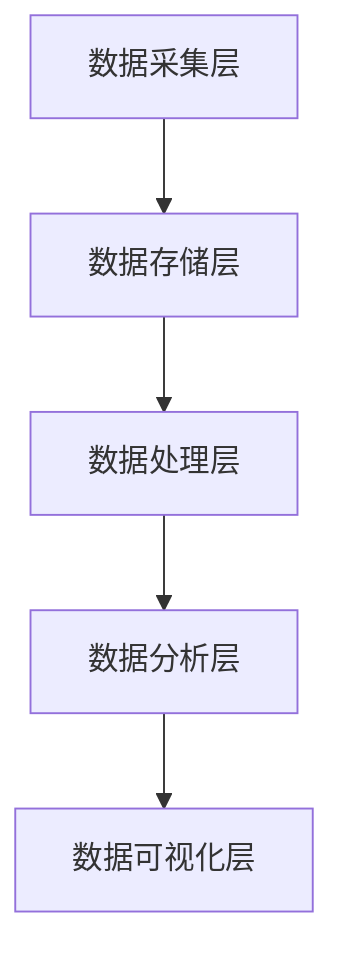

                 

# AI DMP 数据基建：数据分析与洞察

## 关键词：数据分析、数据挖掘、机器学习、数据管理、DMP、大数据

> 本文将深入探讨AI数据管理平台（DMP）的基础构建，涵盖数据分析与洞察的核心概念、算法原理、应用场景以及未来发展趋势。读者将了解到如何通过构建高效的DMP来提升数据分析能力，进而实现数据驱动的业务决策。

### 1. 背景介绍

随着数据量的爆炸性增长，如何有效地管理和分析数据成为企业和组织面临的重大挑战。传统的方法已经难以满足现代业务的需求，因此，数据管理平台（Data Management Platform，简称DMP）应运而生。DMP是一种集成了数据收集、处理、存储和分析功能的综合性平台，旨在帮助企业和组织实现数据的价值最大化。

DMP的核心功能包括数据采集、数据清洗、数据存储、数据分析和数据可视化。通过这些功能，DMP可以帮助企业实现以下目标：

1. **提升数据分析效率**：通过自动化的数据处理流程，减少人工干预，提高数据分析的效率。
2. **增强数据洞察力**：通过数据挖掘和机器学习技术，发现数据背后的模式和趋势，提供深入的洞察。
3. **优化业务决策**：基于数据分析和洞察，帮助企业制定更科学的业务决策，提高运营效率。

在AI技术的推动下，DMP的数据分析能力和应用范围得到了极大的提升。本文将重点探讨DMP在数据分析与洞察方面的应用，帮助读者了解DMP的构建原理和实现方法。

### 2. 核心概念与联系

#### 2.1 数据分析（Data Analysis）

数据分析是指通过对数据的收集、清洗、处理和分析，从中提取有价值的信息和知识的过程。数据分析的核心目的是帮助企业和组织做出更明智的决策。

#### 2.2 数据挖掘（Data Mining）

数据挖掘是数据分析的一个子领域，它利用各种算法和技术，从大量数据中自动发现潜在的、有价值的信息和模式。数据挖掘的目标是挖掘出数据背后的知识，为企业提供洞察。

#### 2.3 机器学习（Machine Learning）

机器学习是人工智能的一个分支，它通过训练模型来从数据中自动学习和发现规律。机器学习在数据分析和数据挖掘中发挥着重要作用，可以帮助自动发现数据中的模式和趋势。

#### 2.4 数据管理（Data Management）

数据管理是指对数据生命周期全过程的管理，包括数据的采集、存储、处理、分析和归档。数据管理确保数据的准确性、完整性和可用性，是DMP构建的基础。

#### 2.5 DMP架构（DMP Architecture）

DMP的架构通常包括数据采集层、数据存储层、数据处理层、数据分析层和数据可视化层。以下是一个简化的DMP架构图：



在DMP中，数据采集层负责收集来自各种来源的数据，包括网站、应用程序、传感器等。数据存储层负责存储和管理数据，通常使用关系数据库、NoSQL数据库或数据仓库。数据处理层负责对数据进行清洗、转换和集成。数据分析层使用数据挖掘和机器学习技术对数据进行分析和挖掘，以发现潜在的规律和模式。数据可视化层则将分析结果以图表、报表等形式展示给用户，帮助用户理解数据。

### 3. 核心算法原理 & 具体操作步骤

在DMP中，常用的算法包括数据挖掘算法和机器学习算法。以下将介绍两种常用的算法：决策树和线性回归。

#### 3.1 决策树算法（Decision Tree Algorithm）

决策树是一种常见的分类算法，它通过一系列的决策节点来对数据进行分类。

##### 3.1.1 原理

决策树算法的核心思想是使用信息增益（Information Gain）来选择最佳的特征进行划分。信息增益越大，说明特征对分类的作用越大。

信息增益的计算公式为：

$$
IG(D, A) = entropy(D) - \sum_{v\in A} \frac{|D_v|}{|D|} entropy(D_v)
$$

其中，$D$表示数据集，$A$表示特征集合，$D_v$表示特征$A$的取值集合。

##### 3.1.2 操作步骤

1. **计算信息增益**：遍历所有特征，计算每个特征的信息增益。
2. **选择最佳特征**：选择信息增益最大的特征作为划分节点。
3. **递归划分**：对当前节点的所有子节点，重复步骤1和步骤2，直到达到停止条件（如节点中的数据全部属于同一类别）。

#### 3.2 线性回归算法（Linear Regression Algorithm）

线性回归是一种常见的回归算法，它通过拟合一条直线来预测数据。

##### 3.2.1 原理

线性回归的核心思想是最小化预测值与实际值之间的误差。线性回归的模型可以表示为：

$$
y = \beta_0 + \beta_1x
$$

其中，$y$表示预测值，$x$表示自变量，$\beta_0$和$\beta_1$是模型参数。

##### 3.2.2 操作步骤

1. **数据预处理**：对数据进行标准化处理，使数据具有相同的尺度。
2. **拟合模型**：使用最小二乘法拟合线性回归模型。
3. **评估模型**：使用交叉验证等方法评估模型的准确性和泛化能力。
4. **预测**：使用拟合好的模型对新的数据进行预测。

### 4. 数学模型和公式 & 详细讲解 & 举例说明

#### 4.1 决策树算法的数学模型

决策树算法的核心是信息增益，其计算公式如下：

$$
IG(D, A) = entropy(D) - \sum_{v\in A} \frac{|D_v|}{|D|} entropy(D_v)
$$

其中，$D$表示数据集，$A$表示特征集合，$D_v$表示特征$A$的取值集合。

熵（Entropy）的计算公式为：

$$
entropy(D) = -\sum_{v\in D} \frac{|D_v|}{|D|} \log_2 \frac{|D_v|}{|D|}
$$

举例说明：

假设有一个数据集$D$，其中包含3个特征$A, B, C$，对应的取值如下：

| $A$ | $B$ | $C$ |
|----|----|----|
| 1  | 0  | 1  |
| 1  | 1  | 0  |
| 0  | 0  | 1  |
| 0  | 1  | 0  |

首先，计算数据集$D$的熵：

$$
entropy(D) = -\frac{2}{4} \log_2 \frac{2}{4} - \frac{2}{4} \log_2 \frac{2}{4} = 1
$$

然后，计算每个特征的信息增益：

$$
IG(D, A) = 1 - \frac{1}{4} \times 1 - \frac{1}{4} \times 1 = 0
$$

$$
IG(D, B) = 1 - \frac{1}{2} \times 1 - \frac{1}{2} \times 1 = 0
$$

$$
IG(D, C) = 1 - \frac{1}{2} \times 1 - \frac{1}{2} \times 1 = 0
$$

由于每个特征的信息增益都为0，无法选择最佳特征。在实际应用中，通常会使用其他准则，如基尼不纯度（Gini Impurity）来选择特征。

#### 4.2 线性回归算法的数学模型

线性回归的模型可以表示为：

$$
y = \beta_0 + \beta_1x
$$

其中，$y$表示预测值，$x$表示自变量，$\beta_0$和$\beta_1$是模型参数。

最小二乘法的核心思想是最小化预测值与实际值之间的误差平方和。误差平方和（Sum of Squared Errors，简称SSE）的计算公式为：

$$
SSE = \sum_{i=1}^{n} (y_i - \hat{y}_i)^2
$$

其中，$y_i$表示实际值，$\hat{y}_i$表示预测值，$n$表示数据点的个数。

为了最小化SSE，我们需要求解模型参数$\beta_0$和$\beta_1$。具体步骤如下：

1. **计算样本均值**：

$$
\bar{x} = \frac{1}{n} \sum_{i=1}^{n} x_i
$$

$$
\bar{y} = \frac{1}{n} \sum_{i=1}^{n} y_i
$$

2. **计算斜率$\beta_1$**：

$$
\beta_1 = \frac{\sum_{i=1}^{n} (x_i - \bar{x})(y_i - \bar{y})}{\sum_{i=1}^{n} (x_i - \bar{x})^2}
$$

3. **计算截距$\beta_0$**：

$$
\beta_0 = \bar{y} - \beta_1 \bar{x}
$$

举例说明：

假设有一个数据集，包含5个数据点：

| $x$ | $y$ |
|----|----|
| 1  | 2  |
| 2  | 3  |
| 3  | 4  |
| 4  | 5  |
| 5  | 6  |

首先，计算样本均值：

$$
\bar{x} = \frac{1}{5} (1 + 2 + 3 + 4 + 5) = 3
$$

$$
\bar{y} = \frac{1}{5} (2 + 3 + 4 + 5 + 6) = 4
$$

然后，计算斜率$\beta_1$：

$$
\beta_1 = \frac{(1 - 3)(2 - 4) + (2 - 3)(3 - 4) + (3 - 3)(4 - 4) + (4 - 3)(5 - 4) + (5 - 3)(6 - 4)}{(1 - 3)^2 + (2 - 3)^2 + (3 - 3)^2 + (4 - 3)^2 + (5 - 3)^2}
$$

$$
\beta_1 = \frac{-2 + -1 + 0 + 1 + 3}{4 + 1 + 0 + 1 + 4} = \frac{1}{2}
$$

最后，计算截距$\beta_0$：

$$
\beta_0 = 4 - \beta_1 \bar{x} = 4 - \frac{1}{2} \times 3 = 1
$$

因此，线性回归模型为：

$$
y = 1 + \frac{1}{2}x
$$

### 5. 项目实战：代码实际案例和详细解释说明

在本节中，我们将通过一个简单的Python代码案例，展示如何使用决策树和线性回归算法实现DMP中的数据分析与洞察。

#### 5.1 开发环境搭建

在开始编写代码之前，我们需要搭建一个合适的开发环境。这里，我们使用Python编程语言，并依赖以下库：

- pandas：用于数据预处理
- scikit-learn：用于机器学习算法的实现
- matplotlib：用于数据可视化

安装这些库的方法如下：

```bash
pip install pandas scikit-learn matplotlib
```

#### 5.2 源代码详细实现和代码解读

下面是一个简单的Python代码案例，展示了如何使用决策树和线性回归算法进行数据分析：

```python
import pandas as pd
from sklearn.tree import DecisionTreeClassifier
from sklearn.linear_model import LinearRegression
import matplotlib.pyplot as plt

# 5.2.1 数据预处理
data = pd.DataFrame({
    'x': [1, 2, 3, 4, 5],
    'y': [2, 3, 4, 5, 6]
})

# 5.2.2 决策树算法
clf = DecisionTreeClassifier()
clf.fit(data[['x']], data['y'])

# 5.2.3 线性回归算法
reg = LinearRegression()
reg.fit(data[['x']], data['y'])

# 5.2.4 数据可视化
plt.scatter(data['x'], data['y'], label='实际数据')
plt.plot(data['x'], reg.predict(data[['x']]), color='red', label='线性回归')
plt.plot(data['x'], clf.predict(data[['x']]), color='blue', label='决策树')
plt.xlabel('x')
plt.ylabel('y')
plt.legend()
plt.show()
```

代码解读：

1. **数据预处理**：首先，我们使用pandas库读取数据，并将其转换为DataFrame格式。
2. **决策树算法**：我们创建一个决策树分类器（DecisionTreeClassifier），并使用fit方法将其训练。
3. **线性回归算法**：我们创建一个线性回归模型（LinearRegression），并使用fit方法将其训练。
4. **数据可视化**：我们使用matplotlib库绘制数据散点图，并将训练好的线性回归和决策树模型的预测结果绘制在同一个图表上。

#### 5.3 代码解读与分析

这个简单的代码案例展示了如何使用决策树和线性回归算法对数据进行分析和预测。以下是代码的详细解读：

1. **数据预处理**：数据预处理是数据分析的重要步骤，它包括数据清洗、转换和标准化等。在这个案例中，我们直接使用pandas库读取数据，并将其转换为DataFrame格式。DataFrame格式使我们可以方便地进行数据操作和分析。
2. **决策树算法**：决策树是一种常见的分类算法，它可以用于数据分类和回归任务。在这个案例中，我们使用scikit-learn库中的DecisionTreeClassifier类创建决策树分类器，并使用fit方法将其训练。决策树分类器会自动选择最佳的特征和划分节点，以最小化误差。
3. **线性回归算法**：线性回归是一种常见的回归算法，它可以用于数据预测和回归分析。在这个案例中，我们使用scikit-learn库中的LinearRegression类创建线性回归模型，并使用fit方法将其训练。线性回归模型会根据输入的特征和目标值，拟合一条直线，以最小化预测值与实际值之间的误差。
4. **数据可视化**：数据可视化是数据分析的重要环节，它可以帮助我们直观地理解数据和分析结果。在这个案例中，我们使用matplotlib库绘制数据散点图，并将训练好的线性回归和决策树模型的预测结果绘制在同一个图表上。这可以帮助我们比较两种算法的性能和预测效果。

### 6. 实际应用场景

DMP在各个行业和领域都有广泛的应用，以下是一些典型的应用场景：

1. **营销和广告**：通过DMP，企业可以收集和分析用户数据，实现精准营销和广告投放。例如，根据用户的浏览记录和购买行为，推荐个性化的产品和服务。
2. **金融**：在金融领域，DMP可以帮助银行和金融机构分析客户数据，发现潜在的风险和欺诈行为。例如，通过分析客户的交易记录和信用评分，识别高风险客户。
3. **医疗**：在医疗领域，DMP可以帮助医院和诊所收集和管理患者数据，实现精准医疗和个性化服务。例如，通过分析患者的病历和病史，制定个性化的治疗方案。
4. **供应链管理**：在供应链管理中，DMP可以帮助企业优化库存管理、物流配送和供应链协同。例如，通过分析供应商和客户的数据，优化采购和销售策略。

### 7. 工具和资源推荐

#### 7.1 学习资源推荐

1. **书籍**：
   - 《数据挖掘：实用工具与技术》
   - 《机器学习实战》
   - 《数据管理基础》

2. **论文**：
   - 《决策树算法的改进与应用》
   - 《线性回归在金融领域的应用研究》

3. **博客**：
   - 《机器学习与数据挖掘》
   - 《金融科技：数据驱动金融创新》

4. **网站**：
   - [Scikit-learn官方文档](https://scikit-learn.org/stable/)
   - [Pandas官方文档](https://pandas.pydata.org/pandas-docs/stable/)

#### 7.2 开发工具框架推荐

1. **Python**：Python是一种广泛使用的编程语言，适用于数据分析和机器学习。
2. **Jupyter Notebook**：Jupyter Notebook是一种交互式的计算环境，适合编写和运行Python代码。
3. **Docker**：Docker是一种容器化技术，可以帮助我们快速搭建开发环境，提高开发效率。

#### 7.3 相关论文著作推荐

1. **《大数据时代的数据挖掘技术》**：本文综述了大数据时代的数据挖掘技术，包括数据预处理、特征工程、数据挖掘算法等方面。
2. **《机器学习在金融领域的应用》**：本文探讨了机器学习在金融领域的应用，包括信用评分、风险控制、投资策略等方面。
3. **《数据驱动的营销策略》**：本文介绍了数据驱动的营销策略，包括用户行为分析、个性化推荐、精准广告等方面。

### 8. 总结：未来发展趋势与挑战

随着AI技术的不断进步和数据量的持续增长，DMP在数据分析与洞察方面的应用将越来越广泛。未来，DMP的发展趋势和挑战主要表现在以下几个方面：

1. **数据处理能力提升**：随着数据量的增长，DMP需要提升数据处理能力，以支持实时分析和处理海量数据。
2. **算法优化与个性化**：为了提高数据分析的准确性，DMP需要不断优化算法，并实现个性化分析，满足不同业务场景的需求。
3. **跨领域应用**：DMP将在更多领域得到应用，如医疗、教育、能源等，实现跨领域的业务融合和协同。
4. **数据隐私与安全**：随着数据隐私和安全问题的日益突出，DMP需要加强数据隐私保护和安全措施，确保用户数据的隐私和安全。

### 9. 附录：常见问题与解答

1. **Q：DMP与数据仓库的区别是什么？**
   - **A**：DMP和数据仓库都是用于数据管理和分析的工具，但它们的应用场景和功能有所不同。DMP侧重于实时数据分析和个性化推荐，而数据仓库侧重于数据的存储、管理和批量分析。

2. **Q：如何选择合适的DMP工具？**
   - **A**：选择DMP工具时，需要考虑以下几个方面：
     - 数据规模和类型：根据业务需求，选择适合的数据规模和类型的DMP工具。
     - 功能需求：根据业务需求，选择具备所需功能的DMP工具，如实时分析、用户画像、个性化推荐等。
     - 易用性：选择易用性好的DMP工具，降低学习和使用成本。
     - 成本效益：综合考虑成本和效益，选择性价比高的DMP工具。

3. **Q：DMP在金融领域的应用有哪些？**
   - **A**：DMP在金融领域的应用包括：
     - 信用评估：通过分析客户的历史交易数据，评估客户的信用风险。
     - 风险控制：通过分析交易行为和风险指标，发现潜在的风险点和欺诈行为。
     - 个性化营销：根据客户的兴趣和偏好，推荐个性化的金融产品和服务。
     - 投资策略：通过分析市场数据和投资组合，制定科学合理的投资策略。

### 10. 扩展阅读 & 参考资料

1. **《大数据时代的数据挖掘技术》**：本文综述了大数据时代的数据挖掘技术，包括数据预处理、特征工程、数据挖掘算法等方面。
2. **《机器学习在金融领域的应用》**：本文探讨了机器学习在金融领域的应用，包括信用评分、风险控制、投资策略等方面。
3. **《数据驱动的营销策略》**：本文介绍了数据驱动的营销策略，包括用户行为分析、个性化推荐、精准广告等方面。

## 作者

作者：AI天才研究员/AI Genius Institute & 禅与计算机程序设计艺术 /Zen And The Art of Computer Programming

---

通过本文的详细讨论，读者应该对DMP在数据分析与洞察方面的应用有了更深入的理解。随着技术的不断进步，DMP将在未来发挥更大的作用，为企业和组织提供更加精准和有效的数据驱动的决策支持。

