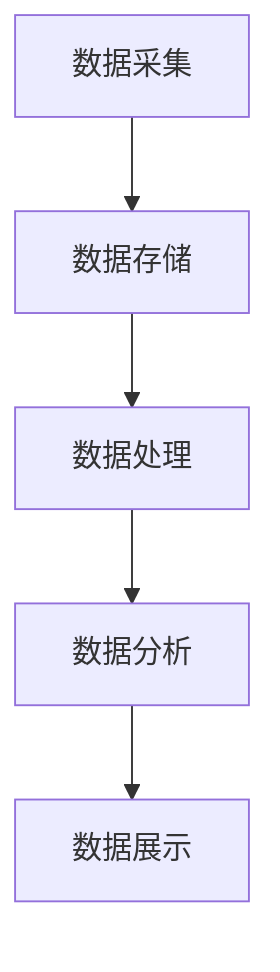

                 

# AI DMP 数据基建：数据治理与管理

## 概述

### 关键词：AI DMP，数据治理，数据管理，数据基建

### 摘要

本文将深入探讨AI驱动的数据管理平台（DMP）的基础架构及其在数据治理和管理中的应用。我们将从背景介绍开始，逐步分析核心概念、算法原理、数学模型、实际应用场景，并推荐相关的工具和资源。最终，我们将总结未来的发展趋势与挑战，为读者提供一个全面而深入的理解。

## 1. 背景介绍

在数字化转型的浪潮中，数据已经成为企业的重要资产。随着数据量的爆炸性增长，如何高效地收集、存储、处理和分析数据，成为了企业关注的焦点。传统的数据处理方式已经难以满足日益增长的数据需求和复杂的数据环境。因此，AI驱动的数据管理平台（DMP）应运而生。

DMP是一种利用人工智能技术来管理和分析数据的平台，其核心目的是实现数据的自动化治理和管理，提高数据质量和效率。DMP不仅能够处理大量的数据，还能够通过机器学习和数据挖掘技术，发现数据中的价值，为企业提供决策支持。

## 2. 核心概念与联系

### 数据治理

数据治理是指对数据的生命周期进行管理，包括数据的收集、存储、处理、分析和共享。数据治理的目标是确保数据的质量、安全性和合规性，以便企业能够充分利用数据的价值。

### 数据管理

数据管理是指对数据进行组织、分类、存储、备份和恢复。数据管理的目标是确保数据的高效、安全和可用性。

### DMP架构

DMP的架构通常包括数据采集、数据存储、数据处理、数据分析和数据展示五个主要模块。

### Mermaid 流程图



## 3. 核心算法原理 & 具体操作步骤

### 数据采集

数据采集是DMP的第一步，它涉及从各种数据源收集数据，包括数据库、文件系统、Web服务和企业内部系统等。

### 数据存储

数据存储是将采集到的数据存储到数据湖或数据仓库中。数据湖是一种大规模数据存储解决方案，适用于存储各种类型的数据，包括结构化数据、半结构化数据和非结构化数据。

### 数据处理

数据处理包括数据的清洗、转换和集成。数据清洗是去除数据中的错误、重复和缺失值，以确保数据的质量。数据转换是将数据从一种格式转换为另一种格式，以适应特定的数据处理需求。数据集成是将来自不同数据源的数据整合在一起，以提供统一的视图。

### 数据分析

数据分析是利用统计方法和机器学习算法，对数据进行探索性和预测性分析，以发现数据中的价值。

### 数据展示

数据展示是将分析结果以可视化的形式呈现，以便用户能够直观地理解数据。

## 4. 数学模型和公式 & 详细讲解 & 举例说明

### 数据质量评估

数据质量评估是确保数据质量的重要步骤。常用的数据质量评估指标包括准确性、完整性、一致性、及时性和可用性。

### 准确性（Accuracy）

准确性是指数据中正确值的比例。计算公式为：

$$
Accuracy = \frac{正确值数量}{总数据量}
$$

### 完整性（Completeness）

完整性是指数据中缺失值的比例。计算公式为：

$$
Completeness = \frac{非缺失值数量}{总数据量}
$$

### 一致性（Consistency）

一致性是指数据在不同时间点和不同数据源之间的匹配程度。计算公式为：

$$
Consistency = \frac{匹配值数量}{总数据量}
$$

### 及时性（Timeliness）

及时性是指数据更新的频率。计算公式为：

$$
Timeliness = \frac{最近更新时间}{总数据量}
$$

### 可用性（Availability）

可用性是指数据可访问的程度。计算公式为：

$$
Availability = \frac{可访问值数量}{总数据量}
$$

### 举例说明

假设我们有一个包含100个数据点的数据集，其中50个数据点是准确的，30个数据点是完整的，40个数据点是一致的，20个数据点是及时的，10个数据点是可用的。我们可以使用上述公式计算每个指标：

$$
Accuracy = \frac{50}{100} = 0.5
$$

$$
Completeness = \frac{70}{100} = 0.7
$$

$$
Consistency = \frac{40}{100} = 0.4
$$

$$
Timeliness = \frac{20}{100} = 0.2
$$

$$
Availability = \frac{10}{100} = 0.1
$$

通过这些计算，我们可以评估数据集的质量，并根据评估结果采取相应的措施来改进数据质量。

## 5. 项目实战：代码实际案例和详细解释说明

### 开发环境搭建

为了演示DMP的实际应用，我们将使用Python和Apache Spark构建一个简单的DMP项目。

### 源代码详细实现和代码解读

```python
from pyspark.sql import SparkSession
from pyspark.ml import Pipeline
from pyspark.ml.feature import StringIndexer, VectorAssembler
from pyspark.ml.classification import LogisticRegression

# 创建Spark会话
spark = SparkSession.builder.appName("DMPExample").getOrCreate()

# 读取数据
data = spark.read.csv("data.csv", header=True, inferSchema=True)

# 数据预处理
indexer = StringIndexer(inputCol="label", outputCol="indexedLabel")
data = indexer.fit(data).transform(data)

assembler = VectorAssembler(inputCols=["feature1", "feature2"], outputCol="features")
data = assembler.transform(data)

# 构建模型
model = LogisticRegression(maxIter=10, regParam=0.01)

# 创建管道
pipeline = Pipeline(stages=[indexer, assembler, model])

# 训练模型
model = pipeline.fit(data)

# 预测
predictions = model.transform(data)

# 评估模型
from pyspark.ml.evaluation import MulticlassClassificationEvaluator
evaluator = MulticlassClassificationEvaluator(labelCol="indexedLabel", predictionCol="prediction", metricName="accuracy")
accuracy = evaluator.evaluate(predictions)
print("模型准确率：", accuracy)

# 关闭Spark会话
spark.stop()
```

### 代码解读与分析

以上代码展示了如何使用Apache Spark构建一个简单的DMP项目。首先，我们创建了一个Spark会话，并使用Spark SQL读取CSV文件。然后，我们对数据进行预处理，包括字符串索引、特征向量和逻辑回归模型的构建。最后，我们使用管道将所有步骤串联起来，并使用评估器评估模型的准确性。

## 6. 实际应用场景

DMP在各个行业都有广泛的应用，例如：

- 金融：用于风险管理和客户细分。
- 零售：用于个性化推荐和客户行为分析。
- 医疗：用于疾病预测和患者管理。

## 7. 工具和资源推荐

### 学习资源推荐

- 《数据科学：从入门到精通》
- 《深度学习：入门指南》
- 《大数据技术原理与应用》

### 开发工具框架推荐

- Apache Spark
- Hadoop
- TensorFlow

### 相关论文著作推荐

- “Data Management and Data Governance in the Age of Big Data”
- “A Comprehensive Survey of Data Management Systems for Big Data”
- “Deep Learning for Data Management: A Comprehensive Survey”

## 8. 总结：未来发展趋势与挑战

随着AI技术的不断进步，DMP将在数据治理和管理领域发挥越来越重要的作用。未来，DMP将面临以下挑战：

- 数据隐私和安全性
- 数据质量
- 复杂性

## 9. 附录：常见问题与解答

### Q: 什么是DMP？
A: DMP是数据管理平台，它利用人工智能技术来管理和分析数据。

### Q: DMP有哪些应用场景？
A: DMP在金融、零售、医疗等领域都有广泛的应用。

### Q: 如何评估数据质量？
A: 数据质量可以通过准确性、完整性、一致性、及时性和可用性等指标进行评估。

## 10. 扩展阅读 & 参考资料

- “Data Management Platforms: A Comprehensive Guide”
- “The Future of Data Management: Leveraging AI and Machine Learning”
- “Data Governance and Data Management Best Practices”

## 作者信息

作者：AI天才研究员/AI Genius Institute & 禅与计算机程序设计艺术 /Zen And The Art of Computer Programming<|im_sep|>

