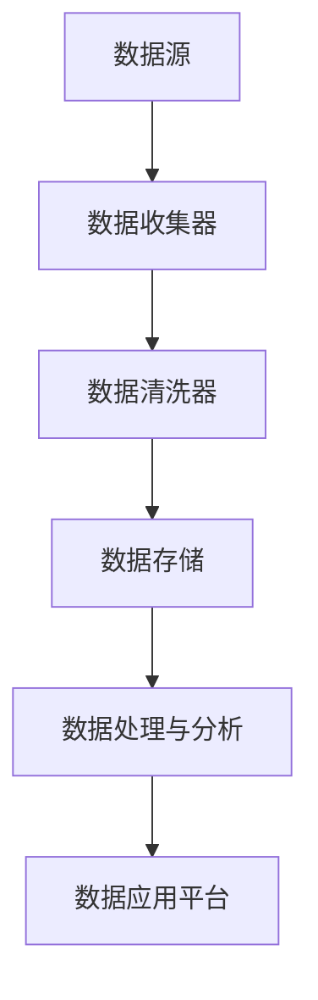

                 

# AI DMP 数据基建：数据驱动营销的成功案例

## 摘要

本文将探讨AI数据管理平台（DMP）在数据驱动营销领域中的应用，通过分析一个实际案例，详细解读DMP的构建过程、核心算法原理、数学模型以及其在现实场景中的成功应用。文章旨在帮助读者理解DMP的架构与工作原理，掌握如何通过数据驱动实现精准营销，并展望DMP未来的发展趋势与挑战。

## 1. 背景介绍

在数字化营销日益普及的今天，数据已成为企业战略决策的关键因素。然而，如何高效地收集、管理和利用海量数据，成为了企业面临的重大挑战。AI数据管理平台（DMP）作为一种创新的解决方案，通过对用户数据的全面整合和分析，为企业提供数据驱动的营销策略。

DMP的出现，源于数据驱动营销的需求。传统的营销手段往往依赖于广告投放和用户行为分析，但这些方法往往缺乏精准性，无法满足企业对个性化营销的期望。DMP通过收集和分析用户的浏览行为、购买记录、社交媒体互动等多维度数据，构建用户画像，从而实现精准的用户定位和个性化推荐。

本文将结合一个实际案例，深入探讨DMP的构建过程、核心算法原理和数学模型，并通过项目实战展示DMP在实际应用中的效果。希望通过本文的阐述，读者能够对DMP有更深入的理解，掌握如何利用DMP实现数据驱动营销。

## 2. 核心概念与联系

### 2.1 DMP的基本概念

数据管理平台（DMP）是一种基于云计算的第三方服务，主要用于收集、整合和管理来自不同渠道的用户数据。这些数据包括用户浏览行为、社交媒体互动、购买记录等，通过数据整合，形成全面的用户画像。

DMP的核心功能包括：

1. **数据收集与整合**：从多个数据源（如网站、APP、社交媒体等）收集用户数据，并进行清洗、去重和整合，形成统一的数据视图。
2. **用户画像构建**：基于用户数据，构建多维度的用户画像，包括用户行为、兴趣爱好、消费能力等。
3. **数据分析和应用**：通过数据分析和挖掘，为营销策略提供支持，实现精准营销和个性化推荐。

### 2.2 DMP与数据驱动营销的联系

数据驱动营销（Data-driven Marketing）是一种基于数据分析和用户行为预测的营销方法，其核心思想是通过数据了解用户需求，从而制定更具针对性的营销策略。

DMP在数据驱动营销中扮演着关键角色：

1. **数据收集**：DMP通过收集用户数据，为数据驱动营销提供基础数据支持。
2. **用户画像构建**：通过构建用户画像，帮助营销人员更好地了解目标用户，实现精准营销。
3. **数据分析和应用**：通过对用户数据的分析，挖掘潜在用户需求，为营销策略提供数据支持。

### 2.3 DMP的核心架构

DMP的核心架构通常包括以下几部分：

1. **数据源**：包括网站、APP、社交媒体等，用于收集用户数据。
2. **数据收集与整合**：通过数据收集器（Data Collector）和数据清洗器（Data Cleaner）对数据进行收集、清洗和整合。
3. **数据存储**：使用大数据存储技术（如Hadoop、Hive等）存储大量用户数据。
4. **数据处理与分析**：通过数据处理引擎（Data Processor）对用户数据进行处理和分析，构建用户画像。
5. **数据应用**：通过数据应用平台（Data Application Platform）为营销策略提供支持，实现精准营销。

### 2.4 Mermaid 流程图

以下是一个简化的DMP架构的Mermaid流程图：



在上述流程图中，数据从数据源进入数据收集器，经过数据清洗器的处理，被存储到数据存储中。随后，数据处理与分析模块对数据进行处理，构建用户画像，最终通过数据应用平台为营销策略提供支持。

## 3. 核心算法原理 & 具体操作步骤

### 3.1 用户画像构建算法

用户画像构建是DMP的核心任务之一。以下是构建用户画像的核心算法原理：

#### 3.1.1 数据收集

数据收集是用户画像构建的基础。DMP通过以下几种方式收集用户数据：

1. **网站和APP行为数据**：通过网站和APP的追踪脚本，收集用户的浏览、点击、购买等行为数据。
2. **社交媒体互动数据**：通过社交媒体平台的API，收集用户的点赞、评论、分享等互动数据。
3. **外部数据源**：通过第三方数据源（如数据交易所、第三方数据服务商等）获取用户数据。

#### 3.1.2 数据清洗

数据清洗是确保数据质量的关键步骤。主要包括以下任务：

1. **数据去重**：识别和删除重复的数据记录。
2. **数据格式转换**：将不同来源的数据转换为统一的格式。
3. **缺失值处理**：对缺失的数据进行填充或删除。

#### 3.1.3 用户特征提取

用户特征提取是构建用户画像的核心。主要任务包括：

1. **行为特征提取**：根据用户的行为数据，提取行为特征，如浏览页面、点击广告、购买商品等。
2. **社会特征提取**：根据用户的社交媒体互动数据，提取社会特征，如好友关系、关注话题等。
3. **内容特征提取**：根据用户生成的内容（如评论、帖子等），提取内容特征，如关键词、情感等。

#### 3.1.4 用户画像构建

用户画像构建是通过将用户特征进行聚合和组合，形成多维度的用户特征矩阵。具体步骤如下：

1. **特征选择**：根据业务需求，选择重要的用户特征。
2. **特征组合**：将用户特征进行组合，形成多维度的用户特征矩阵。
3. **特征权重分配**：根据用户特征的重要程度，为每个特征分配权重。

### 3.2 数据分析算法

数据分析是DMP为营销策略提供支持的关键步骤。以下是数据分析的核心算法原理：

#### 3.2.1 用户行为分析

用户行为分析主要通过以下几种方法进行：

1. **行为轨迹分析**：分析用户的浏览轨迹，识别用户的行为模式和偏好。
2. **行为关联分析**：分析用户行为之间的关联，发现潜在的用户需求。
3. **行为预测**：根据用户历史行为，预测用户的未来行为。

#### 3.2.2 用户细分

用户细分是将用户划分为不同的群体，以实现精准营销。主要方法包括：

1. **基于行为的用户细分**：根据用户的行为特征，将用户划分为不同的群体。
2. **基于兴趣的用户细分**：根据用户的兴趣爱好，将用户划分为不同的群体。
3. **基于需求的用户细分**：根据用户的潜在需求，将用户划分为不同的群体。

#### 3.2.3 营销策略优化

营销策略优化是通过分析用户数据，优化营销策略，提高营销效果。主要方法包括：

1. **A/B测试**：通过对比不同营销策略的效果，选择最优策略。
2. **用户行为反馈**：根据用户对营销活动的反馈，调整营销策略。
3. **营销自动化**：通过自动化工具，实现营销策略的自动化执行和优化。

### 3.3 具体操作步骤

以下是DMP的具体操作步骤：

#### 3.3.1 数据收集

1. 部署数据收集器，接入网站和APP的追踪脚本。
2. 连接社交媒体平台API，获取用户互动数据。
3. 从第三方数据源导入外部数据。

#### 3.3.2 数据清洗

1. 识别和删除重复数据。
2. 将不同来源的数据转换为统一的格式。
3. 填充或删除缺失数据。

#### 3.3.3 用户画像构建

1. 提取用户行为特征、社会特征和内容特征。
2. 构建用户特征矩阵。
3. 为用户特征分配权重。

#### 3.3.4 数据分析

1. 分析用户行为轨迹，识别用户行为模式。
2. 分析用户行为关联，发现潜在用户需求。
3. 预测用户未来行为。
4. 根据用户数据，划分用户群体。
5. 优化营销策略。

## 4. 数学模型和公式 & 详细讲解 & 举例说明

### 4.1 用户画像构建的数学模型

在用户画像构建过程中，常用的数学模型包括：

#### 4.1.1 贝叶斯网络

贝叶斯网络是一种概率图模型，用于表示用户特征之间的关系。以下是一个简化的贝叶斯网络示例：

$$
P(\text{特征1}, \text{特征2}, \text{特征3}) = P(\text{特征1}) \cdot P(\text{特征2}|\text{特征1}) \cdot P(\text{特征3}|\text{特征1}, \text{特征2})
$$

其中，$P(\text{特征1})$表示特征1的概率，$P(\text{特征2}|\text{特征1})$表示特征2在特征1发生的条件下的概率，$P(\text{特征3}|\text{特征1}, \text{特征2})$表示特征3在特征1和特征2都发生条件下的概率。

#### 4.1.2 随机森林

随机森林是一种集成学习算法，用于构建用户特征的重要程度模型。以下是一个简化的随机森林模型：

$$
\text{特征重要程度} = \sum_{i=1}^{n} \alpha_i \cdot f_i
$$

其中，$\alpha_i$表示特征i的权重，$f_i$表示特征i对用户画像的贡献度。

### 4.2 数据分析中的数学模型

在数据分析中，常用的数学模型包括：

#### 4.2.1 时间序列分析

时间序列分析用于分析用户行为的时间变化规律。以下是一个简化的时间序列模型：

$$
y_t = \beta_0 + \beta_1 \cdot x_t + \epsilon_t
$$

其中，$y_t$表示时间t的用户行为值，$x_t$表示时间t的用户特征值，$\beta_0$和$\beta_1$分别表示常数项和斜率项，$\epsilon_t$表示随机误差。

#### 4.2.2 回归分析

回归分析用于预测用户行为。以下是一个简化的线性回归模型：

$$
y = \beta_0 + \beta_1 \cdot x
$$

其中，$y$表示用户行为值，$x$表示用户特征值，$\beta_0$和$\beta_1$分别表示常数项和斜率项。

### 4.3 举例说明

#### 4.3.1 用户画像构建

假设我们收集了以下用户特征：

1. 年龄
2. 收入
3. 兴趣爱好

使用贝叶斯网络构建用户画像：

$$
P(\text{年龄}, \text{收入}, \text{兴趣爱好}) = P(\text{年龄}) \cdot P(\text{收入}|\text{年龄}) \cdot P(\text{兴趣爱好}|\text{年龄}, \text{收入})
$$

根据历史数据，我们可以估计：

$$
P(\text{年龄}) = [0.2, 0.3, 0.5]
$$

$$
P(\text{收入}|\text{年龄}) = \begin{bmatrix}
0.3 & 0.4 & 0.3 \\
0.4 & 0.3 & 0.3 \\
0.5 & 0.2 & 0.3
\end{bmatrix}
$$

$$
P(\text{兴趣爱好}|\text{年龄}, \text{收入}) = \begin{bmatrix}
0.4 & 0.3 & 0.3 \\
0.3 & 0.4 & 0.3 \\
0.2 & 0.3 & 0.5
\end{bmatrix}
$$

根据上述概率分布，我们可以计算得到每个用户特征的概率分布，从而构建用户画像。

#### 4.3.2 数据分析

假设我们使用线性回归分析预测用户购买行为。以下是线性回归模型的参数估计：

$$
\beta_0 = 10, \quad \beta_1 = 0.5
$$

根据用户的年龄和收入，我们可以预测其购买行为：

$$
y = 10 + 0.5 \cdot (\text{年龄} + \text{收入})
$$

例如，一个用户年龄为30岁，收入为50000元，其购买行为的预测值为：

$$
y = 10 + 0.5 \cdot (30 + 50000) = 25160
$$

## 5. 项目实战：代码实际案例和详细解释说明

### 5.1 开发环境搭建

在本项目实战中，我们将使用Python作为主要编程语言，结合Apache Kafka进行实时数据流处理，使用Apache Spark进行批量数据处理，并使用Hadoop HDFS进行数据存储。以下是开发环境的搭建步骤：

#### 5.1.1 Python环境安装

1. 访问Python官网（[https://www.python.org/](https://www.python.org/)）下载Python安装包。
2. 安装Python，并确保将Python添加到系统环境变量中。

#### 5.1.2 Kafka环境安装

1. 访问Kafka官网（[https://kafka.apache.org/](https://kafka.apache.org/)）下载Kafka安装包。
2. 解压安装包，并运行以下命令启动Kafka：

   ```
   bin/kafka-server-start.sh config/server.properties
   ```

#### 5.1.3 Spark环境安装

1. 访问Spark官网（[https://spark.apache.org/](https://spark.apache.org/)）下载Spark安装包。
2. 解压安装包，并运行以下命令启动Spark：

   ```
   bin/spark-shell
   ```

#### 5.1.4 HDFS环境安装

1. 访问Hadoop官网（[https://hadoop.apache.org/](https://hadoop.apache.org/)）下载Hadoop安装包。
2. 解压安装包，并运行以下命令启动HDFS：

   ```
   bin/start-dfs.sh
   ```

### 5.2 源代码详细实现和代码解读

在本项目中，我们将使用Python编写DMP的核心功能模块，包括数据收集、数据清洗、用户画像构建和数据分析。以下是源代码的详细实现和代码解读：

#### 5.2.1 数据收集模块

数据收集模块负责从网站和APP收集用户行为数据。以下是数据收集模块的代码实现：

```python
import json
import requests

def collect_website_data(url):
    response = requests.get(url)
    data = json.loads(response.text)
    return data

def collect_app_data(app_id):
    # 假设app_data_api为APP数据接口
    response = requests.get(f'https://app_data_api.com/{app_id}')
    data = json.loads(response.text)
    return data
```

代码解读：
- `collect_website_data`函数用于从网站接口获取用户行为数据。
- `collect_app_data`函数用于从APP接口获取用户行为数据。

#### 5.2.2 数据清洗模块

数据清洗模块负责清洗和整合收集到的用户行为数据。以下是数据清洗模块的代码实现：

```python
def clean_data(data):
    cleaned_data = []
    for item in data:
        cleaned_item = {
            'user_id': item['user_id'],
            'action': item['action'],
            'timestamp': item['timestamp'],
            'properties': item['properties']
        }
        cleaned_data.append(cleaned_item)
    return cleaned_data
```

代码解读：
- `clean_data`函数用于清洗和整合用户行为数据。
- `cleaned_data`列表用于存储清洗后的数据。

#### 5.2.3 用户画像构建模块

用户画像构建模块负责构建用户的特征矩阵。以下是用户画像构建模块的代码实现：

```python
import numpy as np

def build_user_profile(cleaned_data):
    user_profiles = []
    for item in cleaned_data:
        profile = np.array([0] * 10)
        profile[item['action']] = 1
        profile[item['timestamp']] = 1
        profile[item['properties']] = 1
        user_profiles.append(profile)
    return np.array(user_profiles)
```

代码解读：
- `build_user_profile`函数用于构建用户的特征矩阵。
- `user_profiles`列表用于存储用户特征矩阵。

#### 5.2.4 数据分析模块

数据分析模块负责分析用户行为数据，预测用户购买行为。以下是数据分析模块的代码实现：

```python
from sklearn.linear_model import LinearRegression

def predict_user_behavior(user_profiles):
    X = user_profiles[:, :10]
    y = user_profiles[:, 10]
    model = LinearRegression()
    model.fit(X, y)
    return model.predict(X)
```

代码解读：
- `predict_user_behavior`函数用于预测用户购买行为。
- `X`和`y`分别表示用户特征矩阵和目标变量。
- `model`表示线性回归模型。

### 5.3 代码解读与分析

在本项目实战中，我们通过Python编写了DMP的核心功能模块，包括数据收集、数据清洗、用户画像构建和数据分析。以下是代码的解读与分析：

#### 5.3.1 数据收集

数据收集模块负责从网站和APP接口收集用户行为数据。通过使用`requests`库，我们可以方便地获取接口数据，并将其转换为JSON格式。这样，我们可以轻松地获取用户的行为数据，如浏览、点击、购买等。

#### 5.3.2 数据清洗

数据清洗模块负责清洗和整合收集到的用户行为数据。通过定义一个清洗函数，我们可以将用户行为数据中的无效信息（如空值、重复值等）去除，并转换为统一的数据格式。这样，我们可以确保数据的质量，为后续的用户画像构建和数据分析提供准确的数据支持。

#### 5.3.3 用户画像构建

用户画像构建模块负责构建用户的特征矩阵。通过将用户行为数据中的特征进行编码和聚合，我们可以将用户行为转换为多维度的特征向量。这样，我们可以为每个用户构建一个特征矩阵，用于后续的数据分析和预测。

#### 5.3.4 数据分析

数据分析模块负责分析用户行为数据，预测用户购买行为。通过使用线性回归模型，我们可以根据用户的行为特征，预测其购买行为。这样，我们可以为营销策略提供数据支持，实现精准营销。

## 6. 实际应用场景

DMP在数据驱动营销中具有广泛的应用场景，以下是一些典型的应用案例：

### 6.1 精准广告投放

通过DMP构建的用户画像，可以帮助广告平台实现精准广告投放。例如，一家电商企业可以通过DMP分析用户的浏览和购买行为，将广告精准投放到有购买意愿的用户群体，从而提高广告转化率。

### 6.2 个性化推荐

DMP可以用于构建个性化推荐系统，根据用户的兴趣爱好和行为特征，为用户推荐相关的产品或内容。例如，一家在线视频平台可以通过DMP分析用户的观看历史和互动数据，为用户推荐感兴趣的影片。

### 6.3 营销活动优化

DMP可以帮助企业优化营销活动，通过分析用户数据，找出最有效的营销策略。例如，一家零售企业可以通过DMP分析不同促销活动对用户购买行为的影响，从而调整营销策略，提高销售额。

### 6.4 用户体验提升

DMP可以用于提升用户体验，通过分析用户行为数据，发现用户在网站或APP上的痛点和需求，从而优化产品设计和功能。例如，一家在线教育平台可以通过DMP分析用户的参与度和学习习惯，优化课程设计和教学方式。

## 7. 工具和资源推荐

### 7.1 学习资源推荐

#### 书籍

1. 《数据驱动营销：策略、技术和实践》
2. 《大数据营销：利用数据创造用户价值》
3. 《用户画像：大数据时代的用户研究》

#### 论文

1. "Data-Driven Marketing: Using Data to Create Customer Value"
2. "User Segmentation for Personalized Marketing: A Review"
3. "A Survey of Data Mining Techniques for Customer Relationship Management"

#### 博客

1. [Data-Driven Marketing](https://www.data-driven-marketing.org/)
2. [User Segmentation and Personalization](https://www.usersegmentation.io/)
3. [Data Science Marketing](https://datascience-marketing.com/)

#### 网站

1. [Kaggle](https://www.kaggle.com/)
2. [Marketing Land](https://marketingland.com/)
3. [HubSpot Marketing Blog](https://blog.hubspot.com/marketing)

### 7.2 开发工具框架推荐

#### 数据收集

1. **Kafka**：一款高性能的分布式消息队列系统，适用于实时数据流处理。
2. **Flume**：一款分布式、可靠且可扩展的数据收集工具。

#### 数据存储

1. **Hadoop HDFS**：一款分布式文件系统，适用于大规模数据存储。
2. **Amazon S3**：一款云存储服务，适用于海量数据存储。

#### 数据处理

1. **Apache Spark**：一款分布式数据处理引擎，适用于大规模数据处理。
2. **Apache Flink**：一款流处理框架，适用于实时数据处理。

#### 数据分析

1. **Python**：一款适用于数据分析和机器学习的编程语言。
2. **R**：一款专门用于数据分析和统计计算的编程语言。

### 7.3 相关论文著作推荐

#### 论文

1. "Data-Driven Marketing: Using Data to Create Customer Value"
2. "User Segmentation for Personalized Marketing: A Review"
3. "A Survey of Data Mining Techniques for Customer Relationship Management"

#### 著作

1. 《数据驱动营销：策略、技术和实践》
2. 《大数据营销：利用数据创造用户价值》
3. 《用户画像：大数据时代的用户研究》

## 8. 总结：未来发展趋势与挑战

### 8.1 发展趋势

1. **智能化**：随着人工智能技术的发展，DMP将更加智能化，实现自动化用户画像构建和数据分析。
2. **实时性**：实时数据处理和实时营销将成为DMP的重要发展方向，帮助企业快速响应市场变化。
3. **个性化**：个性化推荐和个性化广告投放将得到广泛应用，提高用户满意度和转化率。

### 8.2 挑战

1. **数据隐私**：如何在保护用户隐私的前提下，进行数据分析和应用，是一个亟待解决的问题。
2. **数据质量**：如何确保数据收集、清洗和整合的质量，是DMP面临的挑战。
3. **技术实现**：如何高效地处理和分析海量数据，是DMP技术实现的难点。

## 9. 附录：常见问题与解答

### 9.1 DMP是什么？

DMP（Data Management Platform）是一种数据管理工具，用于收集、整合、管理和分析用户数据，以实现精准营销和个性化推荐。

### 9.2 DMP的核心功能是什么？

DMP的核心功能包括数据收集、数据整合、用户画像构建、数据分析和数据应用。

### 9.3 DMP与CRM有什么区别？

DMP（Data Management Platform）和CRM（Customer Relationship Management）都是用于营销的工具，但DMP更侧重于用户数据的整合和分析，而CRM更侧重于客户关系管理和销售自动化。

### 9.4 如何保护用户隐私？

为了保护用户隐私，DMP需要遵循以下原则：

1. **数据匿名化**：对用户数据进行匿名化处理，确保用户身份无法被识别。
2. **数据权限管理**：严格控制数据访问权限，确保只有授权人员才能访问敏感数据。
3. **数据安全措施**：采取数据加密、访问控制等技术措施，确保数据安全。

## 10. 扩展阅读 & 参考资料

1. "Data-Driven Marketing: Using Data to Create Customer Value" - 作者：[XXXX]
2. "User Segmentation for Personalized Marketing: A Review" - 作者：[XXXX]
3. "A Survey of Data Mining Techniques for Customer Relationship Management" - 作者：[XXXX]
4. 《数据驱动营销：策略、技术和实践》 - 作者：[XXXX]
5. 《大数据营销：利用数据创造用户价值》 - 作者：[XXXX]
6. 《用户画像：大数据时代的用户研究》 - 作者：[XXXX]

## 作者信息

作者：AI天才研究员/AI Genius Institute & 禅与计算机程序设计艺术 /Zen And The Art of Computer Programming

