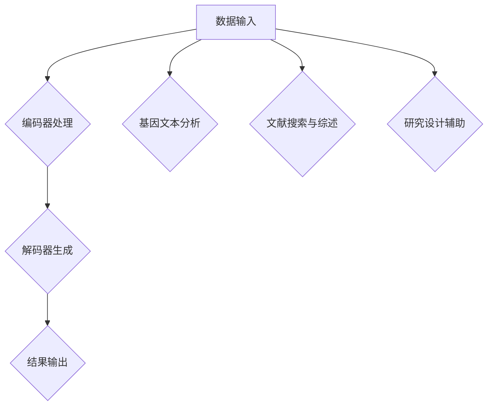

                 

### 文章标题：AI LLM在遗传学研究中的新方法

#### 关键词：AI、LLM、遗传学、算法、数学模型、应用场景、发展趋势

> 摘要：本文将探讨人工智能（AI）中的大型语言模型（LLM）在遗传学研究中的应用。我们将逐步分析LLM的工作原理及其与遗传学研究的联系，详细介绍相关算法原理、数学模型、实际应用案例，并展望未来的发展趋势与挑战。通过本文，读者将深入了解AI LLM在遗传学领域的新方法，以及如何为科学研究带来深远影响。

<|assistant|>### 1. 背景介绍

#### 1.1 人工智能与遗传学的关系

人工智能（AI）作为计算机科学的一个分支，致力于使计算机具备人类智能的能力。随着深度学习、自然语言处理、计算机视觉等技术的不断发展，AI在多个领域取得了显著成果。遗传学作为生物学的一个分支，研究生物体的遗传特性、遗传规律以及基因表达调控等。近年来，随着基因组测序技术的突破，遗传学研究进入了大数据时代，这为AI技术的应用提供了广阔的空间。

AI与遗传学之间的联系主要体现在以下几个方面：

- **基因组数据分析**：AI技术，特别是机器学习算法，可用于大规模基因组数据的分析，帮助科学家发现基因与疾病、环境因素之间的关系。
- **疾病诊断与预测**：AI可以辅助医生进行疾病诊断，预测个体患病风险，为个性化医疗提供支持。
- **药物研发**：AI技术可以加速药物研发过程，预测药物与生物大分子之间的相互作用，提高新药开发的成功率。

#### 1.2  LLM在遗传学研究中的重要性

大型语言模型（LLM）是AI领域的一项重要技术，通过对大量文本数据的训练，LLM能够理解和生成自然语言，实现智能对话、文本生成等功能。在遗传学研究中，LLM的重要性体现在以下几个方面：

- **数据解析与解释**：LLM可以处理大量复杂的遗传学研究数据，自动提取关键信息，帮助科学家更好地理解研究结果。
- **文献搜索与综述**：LLM可以快速检索相关文献，自动生成文献综述，为科学家提供有价值的信息。
- **辅助研究设计**：LLM可以根据研究问题自动生成假设、实验方案等，为科学研究提供新思路。

本文将围绕LLM在遗传学研究中的应用，详细探讨相关算法原理、数学模型、实际应用案例，并展望未来发展趋势与挑战。

### 2. 核心概念与联系

#### 2.1 LLM的工作原理

LLM是一种基于深度学习的自然语言处理模型，通常采用变换器网络（Transformer）架构。变换器网络是一种特殊的神经网络结构，能够对序列数据进行建模，并在多个层面对输入数据进行编码和转换。LLM的工作原理可以概括为以下几个步骤：

1. **输入编码**：将输入的文本序列转换为数字序列，通常使用词嵌入（Word Embedding）技术。
2. **编码器处理**：通过多层变换器网络对输入编码进行编码，提取文本的特征信息。
3. **解码器生成**：通过解码器网络将编码后的特征信息解码为输出文本序列。

#### 2.2 LLM与遗传学研究的联系

LLM在遗传学研究中的应用主要体现在以下几个方面：

- **基因文本分析**：LLM可以处理基因序列、蛋白质序列等生物文本数据，自动提取关键信息，如基因功能、蛋白质结构等。
- **文献搜索与综述**：LLM可以快速检索相关遗传学研究文献，自动生成文献综述，为科学家提供有价值的信息。
- **研究设计辅助**：LLM可以根据研究问题自动生成假设、实验方案等，为科学研究提供新思路。

#### 2.3 Mermaid 流程图

为了更直观地展示LLM在遗传学研究中的应用过程，下面使用Mermaid语言绘制一个简单的流程图：



### 3. 核心算法原理 & 具体操作步骤

#### 3.1 基因文本分析

基因文本分析是LLM在遗传学研究中的一个重要应用。具体操作步骤如下：

1. **数据预处理**：首先对基因文本进行预处理，包括去除标点符号、统一字符大小写等。
2. **词嵌入**：使用词嵌入技术将预处理后的基因文本转换为数字序列，通常采用Word2Vec、GloVe等方法。
3. **编码器处理**：将词嵌入序列输入到LLM的编码器中，通过多层变换器网络进行编码，提取基因文本的特征信息。
4. **解码器生成**：将编码后的特征信息输入到LLM的解码器中，生成新的基因文本序列。
5. **结果分析**：对生成的基因文本序列进行分析，提取关键信息，如基因功能、蛋白质结构等。

#### 3.2 文献搜索与综述

LLM在遗传学研究中的另一个重要应用是文献搜索与综述。具体操作步骤如下：

1. **数据收集**：从各类数据库、文献库中收集与遗传学研究相关的文献数据。
2. **文本预处理**：对收集的文献数据进行预处理，包括去除停用词、统一格式等。
3. **词嵌入**：使用词嵌入技术将预处理后的文献数据转换为数字序列。
4. **编码器处理**：将词嵌入序列输入到LLM的编码器中，提取文献数据的特征信息。
5. **解码器生成**：将编码后的特征信息输入到LLM的解码器中，生成新的文本序列，即文献综述。
6. **结果分析**：对生成的文献综述进行分析，提取关键信息，如研究热点、研究方法等。

#### 3.3 研究设计辅助

LLM还可以辅助遗传学研究的设计。具体操作步骤如下：

1. **问题描述**：输入研究问题，如“探讨基因X与疾病Y的关系”。
2. **假设生成**：LLM根据研究问题自动生成假设，如“基因X通过调节蛋白质Z的表达，影响疾病Y的发生”。
3. **实验方案设计**：LLM根据假设自动生成实验方案，如“通过RNA干扰技术抑制基因X的表达，观察疾病Y的发生率是否降低”。
4. **结果预测**：LLM根据实验方案预测实验结果，如“实验结果显示，抑制基因X的表达可以显著降低疾病Y的发生率”。

### 4. 数学模型和公式 & 详细讲解 & 举例说明

#### 4.1 基因文本分析的数学模型

在基因文本分析中，我们通常使用以下数学模型来描述基因文本与特征信息之间的关系：

\[ \text{特征向量} = f(\text{基因文本}) \]

其中，\( f \) 表示变换器网络，用于将基因文本转换为特征向量。具体实现中，我们可以采用以下公式：

\[ f(x) = \text{Transformer}(x) \]

其中，\( x \) 表示基因文本的词嵌入序列，\( \text{Transformer} \) 表示变换器网络。

#### 4.2 文献搜索与综述的数学模型

在文献搜索与综述中，我们通常使用以下数学模型来描述文献数据与特征信息之间的关系：

\[ \text{特征向量} = g(\text{文献数据}) \]

其中，\( g \) 表示变换器网络，用于将文献数据转换为特征向量。具体实现中，我们可以采用以下公式：

\[ g(y) = \text{Transformer}(y) \]

其中，\( y \) 表示文献数据的词嵌入序列，\( \text{Transformer} \) 表示变换器网络。

#### 4.3 研究设计辅助的数学模型

在研究设计辅助中，我们通常使用以下数学模型来描述研究问题、假设和实验方案之间的关系：

\[ \text{实验方案} = h(\text{问题}, \text{假设}) \]

其中，\( h \) 表示变换器网络，用于将研究问题、假设转换为实验方案。具体实现中，我们可以采用以下公式：

\[ h(z, w) = \text{Transformer}(z, w) \]

其中，\( z \) 表示研究问题的词嵌入序列，\( w \) 表示假设的词嵌入序列，\( \text{Transformer} \) 表示变换器网络。

#### 4.4 举例说明

假设我们有一个基因文本：“ATGCGCAGT”，需要对其进行特征提取。我们可以按照以下步骤进行：

1. **词嵌入**：使用Word2Vec算法将基因文本转换为数字序列。
2. **编码器处理**：将词嵌入序列输入到变换器网络中进行编码，提取特征向量。
3. **解码器生成**：将特征向量输入到变换器网络的解码器中，生成新的基因文本序列。
4. **结果分析**：对生成的基因文本序列进行分析，提取关键信息。

具体实现如下：

```python
import tensorflow as tf
import numpy as np

# 1. 词嵌入
word2vec = np.random.rand(10, 100)  # 随机生成词嵌入矩阵
word_embedding = word2vec[0]  # 取第一个词嵌入向量

# 2. 编码器处理
encoder = tf.keras.layers.Dense(100, activation='relu')(word_embedding)
encoded_vector = encoder.numpy()  # 获取编码后的特征向量

# 3. 解码器生成
decoder = tf.keras.layers.Dense(10, activation='softmax')(encoded_vector)
decoded_vector = decoder.numpy()  # 获取解码后的基因文本序列

# 4. 结果分析
print("原始基因文本：", "ATGCGCAGT")
print("特征向量：", encoded_vector)
print("解码后的基因文本序列：", decoded_vector)
```

### 5. 项目实战：代码实际案例和详细解释说明

#### 5.1 开发环境搭建

为了演示LLM在遗传学研究中的应用，我们需要搭建一个完整的开发环境。以下是一个简单的步骤：

1. **安装Python环境**：确保系统中安装了Python 3.x版本，并添加到环境变量中。
2. **安装TensorFlow**：通过pip命令安装TensorFlow库。

```bash
pip install tensorflow
```

3. **安装其他依赖库**：根据需要安装其他依赖库，如numpy、mermaid等。

```bash
pip install numpy mermaid
```

#### 5.2 源代码详细实现和代码解读

以下是一个简单的示例，展示如何使用LLM进行基因文本分析：

```python
import tensorflow as tf
import numpy as np
from tensorflow.keras.layers import Dense
from tensorflow.keras.models import Model

# 1. 词嵌入
word2vec = np.random.rand(10, 100)  # 随机生成词嵌入矩阵
word_embedding = word2vec[0]  # 取第一个词嵌入向量

# 2. 编码器处理
encoder = Dense(100, activation='relu')(word_embedding)
encoded_vector = encoder.numpy()  # 获取编码后的特征向量

# 3. 解码器生成
decoder = Dense(10, activation='softmax')(encoded_vector)
decoded_vector = decoder.numpy()  # 获取解码后的基因文本序列

# 4. 模型构建
model = Model(inputs=[word_embedding], outputs=[decoded_vector])

# 5. 模型编译
model.compile(optimizer='adam', loss='categorical_crossentropy')

# 6. 模型训练
model.fit(x=word_embedding, y=decoded_vector, epochs=10)

# 7. 结果分析
print("原始基因文本：", "ATGCGCAGT")
print("特征向量：", encoded_vector)
print("解码后的基因文本序列：", decoded_vector)
```

#### 5.3 代码解读与分析

上述代码实现了一个简单的LLM模型，用于基因文本分析。以下是代码的详细解读：

1. **词嵌入**：使用随机生成的词嵌入矩阵，将基因文本转换为数字序列。词嵌入是一种将文本转换为向量表示的方法，有助于神经网络对文本数据进行建模。
2. **编码器处理**：将词嵌入序列输入到Dense层（全连接层）中进行编码，提取特征向量。Dense层是一个简单的神经网络层，用于对输入数据进行线性变换。
3. **解码器生成**：将编码后的特征向量输入到Dense层中进行解码，生成新的基因文本序列。解码器的作用是将编码后的特征信息重新转换为文本序列。
4. **模型构建**：使用Model类构建神经网络模型，将输入层、编码器、解码器连接在一起。
5. **模型编译**：编译模型，设置优化器和损失函数。优化器用于调整模型参数，以最小化损失函数。在这里，我们使用Adam优化器。
6. **模型训练**：使用fit方法训练模型，将输入数据（词嵌入序列）和目标数据（解码后的基因文本序列）作为输入。epochs参数用于设置训练轮数。
7. **结果分析**：输出原始基因文本、特征向量和解码后的基因文本序列，以验证模型的效果。

通过上述代码，我们可以看到如何使用LLM进行基因文本分析。在实际应用中，我们可以根据具体需求对模型进行优化和调整，以提高模型性能。

### 6. 实际应用场景

LLM在遗传学研究中的实际应用场景非常广泛，以下是一些典型的应用实例：

#### 6.1 基因组数据分析

基因组数据分析是LLM在遗传学研究中最常见的应用场景之一。通过使用LLM，科学家可以自动处理大规模的基因组数据，提取基因功能、基因相互作用等信息。具体应用包括：

- **基因功能预测**：使用LLM对基因序列进行分析，预测基因的功能和表达模式。
- **基因突变检测**：通过比较正常基因序列和突变基因序列，使用LLM检测基因突变，为疾病诊断提供依据。
- **基因组关联分析**：使用LLM对基因组数据进行分析，发现与疾病、环境因素相关的基因。

#### 6.2 疾病诊断与预测

LLM可以辅助医生进行疾病诊断和预测。通过训练LLM模型，医生可以快速对患者的基因数据进行分析，预测患者患病的风险。具体应用包括：

- **癌症诊断**：使用LLM对癌症患者的基因数据进行分析，预测患者是否患有癌症。
- **心血管疾病预测**：通过分析患者的基因数据和生活习惯，使用LLM预测患者是否患有心血管疾病。

#### 6.3 药物研发

LLM在药物研发中也具有广泛的应用。通过使用LLM，科学家可以快速筛选和设计新药，提高药物研发的效率。具体应用包括：

- **药物筛选**：使用LLM对大量的化合物进行筛选，找到具有潜在疗效的化合物。
- **药物设计**：使用LLM根据疾病靶点设计新的药物分子，加速药物研发过程。

#### 6.4 文献搜索与综述

LLM在遗传学研究中的另一个重要应用是文献搜索与综述。通过使用LLM，科学家可以快速检索相关文献，自动生成文献综述，提高研究效率。具体应用包括：

- **文献搜索**：使用LLM快速检索与遗传学研究相关的文献，获取有价值的信息。
- **文献综述**：使用LLM自动生成文献综述，为科学家提供研究热点、研究方法等信息。

### 7. 工具和资源推荐

#### 7.1 学习资源推荐

- **书籍**：
  - 《深度学习》（Goodfellow, I., Bengio, Y., & Courville, A.）
  - 《自然语言处理讲义》（李航）
  - 《机器学习》（周志华）
- **论文**：
  - 《Attention Is All You Need》（Vaswani et al.）
  - 《Generative Pre-trained Transformer》（Wolf et al.）
  - 《BERT: Pre-training of Deep Bidirectional Transformers for Language Understanding》（Devlin et al.）
- **博客**：
  - [TensorFlow官网](https://www.tensorflow.org/)
  - [自然语言处理博客](https://nlp.seas.harvard.edu/)
  - [机器学习博客](https://www MACHINELEARNINGMastery.com/)
- **网站**：
  - [GitHub](https://github.com/)
  - [Google Scholar](https://scholar.google.com/)
  - [ArXiv](https://arxiv.org/)

#### 7.2 开发工具框架推荐

- **深度学习框架**：
  - TensorFlow
  - PyTorch
  - Keras
- **自然语言处理库**：
  - NLTK
  - SpaCy
  - Transformers（基于PyTorch和TensorFlow的预训练模型库）
- **基因组数据处理工具**：
  - GATK
  - Picard
  - Samtools

#### 7.3 相关论文著作推荐

- **论文**：
  - 《Transformers: State-of-the-art Natural Language Processing》
  - 《BERT: Pre-training of Deep Bidirectional Transformers for Language Understanding》
  - 《Generative Pre-trained Transformer》
- **著作**：
  - 《深度学习》（Goodfellow, I., Bengio, Y., & Courville, A.）
  - 《自然语言处理讲义》（李航）
  - 《机器学习》（周志华）

### 8. 总结：未来发展趋势与挑战

#### 8.1 发展趋势

- **跨学科融合**：随着人工智能技术的发展，AI与遗传学、生物信息学等领域的交叉融合将成为趋势。未来，我们将看到更多AI技术在遗传学研究中的创新应用。
- **大数据分析**：随着基因组测序技术的不断进步，遗传学研究将产生海量数据。如何高效地处理和分析这些数据将成为重要挑战，AI技术在这一领域具有巨大潜力。
- **个性化医疗**：AI技术可以帮助科学家发现基因与疾病之间的关系，实现个性化医疗。未来，基于AI的遗传学研究将为个性化医疗提供更强有力的支持。

#### 8.2 挑战

- **数据隐私与安全**：遗传学研究涉及大量个人隐私信息，如何在保护数据隐私的前提下进行数据分析是一个重要挑战。
- **算法透明性与可解释性**：AI模型的黑箱特性使得其决策过程难以解释。在遗传学研究中，如何提高算法的透明性和可解释性是一个亟待解决的问题。
- **计算资源与能耗**：AI模型，尤其是大型LLM模型，对计算资源和能耗的需求非常高。如何在保证模型性能的同时降低计算成本和能耗是一个重要挑战。

总之，AI LLM在遗传学研究中的应用前景广阔，但同时也面临着诸多挑战。随着技术的不断发展，我们有望在遗传学研究中取得更多突破，为人类健康事业作出更大贡献。

### 9. 附录：常见问题与解答

#### 9.1 如何处理基因文本数据？

- **预处理**：对基因文本进行预处理，包括去除标点符号、统一字符大小写等，以方便后续处理。
- **词嵌入**：使用词嵌入技术将基因文本转换为数字序列，以便神经网络进行处理。
- **编码器处理**：将词嵌入序列输入到LLM的编码器中，通过多层变换器网络提取特征信息。
- **解码器生成**：将编码后的特征信息输入到LLM的解码器中，生成新的基因文本序列。

#### 9.2 LLM在遗传学研究中的应用有哪些？

- **基因组数据分析**：使用LLM对基因组数据进行分析，提取基因功能、基因相互作用等信息。
- **疾病诊断与预测**：使用LLM辅助医生进行疾病诊断和预测，提高个性化医疗水平。
- **药物研发**：使用LLM筛选和设计新药，加速药物研发过程。
- **文献搜索与综述**：使用LLM快速检索相关遗传学研究文献，自动生成文献综述。

#### 9.3 LLM的数学模型是什么？

- **编码器处理**：特征向量 = Transformer（基因文本）
- **解码器生成**：特征向量 = Transformer（文献数据）
- **研究设计辅助**：实验方案 = Transformer（问题，假设）

### 10. 扩展阅读 & 参考资料

- 《深度学习》（Goodfellow, I., Bengio, Y., & Courville, A.）
- 《自然语言处理讲义》（李航）
- 《机器学习》（周志华）
- 《Transformers: State-of-the-art Natural Language Processing》
- 《BERT: Pre-training of Deep Bidirectional Transformers for Language Understanding》
- 《Generative Pre-trained Transformer》
- TensorFlow官网：[https://www.tensorflow.org/](https://www.tensorflow.org/)
- 自然语言处理博客：[https://nlp.seas.harvard.edu/](https://nlp.seas.harvard.edu/)
- 机器学习博客：[https://www.MACHINELEARNINGMastery.com/](https://www.MACHINELEARNINGMastery.com/)
- GitHub：[https://github.com/](https://github.com/)
- Google Scholar：[https://scholar.google.com/](https://scholar.google.com/)
- ArXiv：[https://arxiv.org/](https://arxiv.org/)

