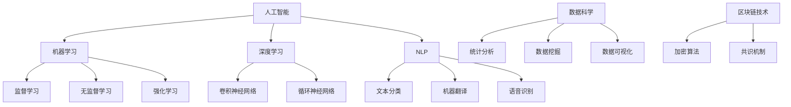
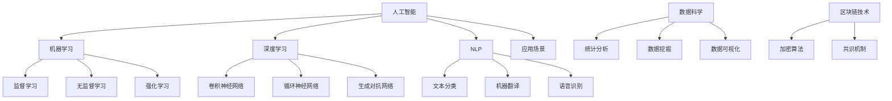

                 

### 背景介绍

#### 什么是AI Hackathon？

AI Hackathon是一种集中式的编程竞赛，旨在激发参与者的创新思维和团队合作能力，在短时间内解决实际问题。这些竞赛通常围绕人工智能（AI）应用展开，涵盖了从图像识别、自然语言处理到智能机器人等广泛领域。

#### AI Hackathon的历史与发展

AI Hackathon起源于计算机科学和编程社区，最早可以追溯到20世纪90年代。随着互联网和人工智能技术的快速发展，AI Hackathon逐渐成为一种流行的技术竞赛形式。近年来，随着深度学习和大数据技术的兴起，AI Hackathon的规模和影响力不断扩大，吸引了全球众多优秀的程序员和AI研究者参与。

#### AI Hackathon的意义与价值

AI Hackathon不仅为参与者提供了一个展示自己技术和创意的平台，同时也促进了跨学科的合作和交流。通过解决实际问题，参与者可以深入理解AI技术的应用场景和挑战，从而激发更广泛的创新思维。此外，AI Hackathon还为企业和投资者提供了一个发掘优秀人才和项目的窗口，有助于推动人工智能技术的发展和商业应用。

#### AI Hackathon的主要类型

AI Hackathon可以分为多种类型，包括但不限于以下几种：

1. **学术性AI Hackathon**：这类竞赛通常由学术机构举办，主要面向学生和研究者，旨在推动学术交流和新技术的研究。
2. **商业性AI Hackathon**：这类竞赛通常由企业或投资机构举办，以寻找具有商业潜力的AI项目和人才。
3. **社区性AI Hackathon**：这类竞赛由社区组织，鼓励公众参与，旨在提升公众对AI技术的认知和应用能力。

#### AI Hackathon的发展趋势

随着AI技术的不断进步和应用的深化，AI Hackathon也在不断演变和升级。以下是一些值得关注的发展趋势：

1. **跨领域融合**：越来越多的AI Hackathon开始关注跨领域的合作，例如将AI与医疗、教育、艺术等领域结合，推动创新应用。
2. **开源生态的兴起**：越来越多的AI Hackathon鼓励开源和共享，推动AI技术的普及和落地。
3. **可持续性和社会责任**：随着对AI伦理和社会影响的关注增加，AI Hackathon也开始强调可持续性和社会责任，推动AI技术的健康发展。

总之，AI Hackathon作为人工智能领域的一个重要组成部分，不仅促进了技术创新和人才培养，也推动了AI技术在各个领域的应用和落地。随着AI技术的不断发展和应用场景的拓展，AI Hackathon将在未来继续发挥重要作用，成为推动人工智能发展的重要力量。

#### AI Hackathon的核心目标和挑战

AI Hackathon的核心目标是激发创新思维，促进团队合作，解决实际问题。在有限的时间内，参与者需要运用AI技术解决复杂的现实问题，这无疑带来了巨大的挑战。

首先，**时间限制**是一个巨大的挑战。AI项目开发通常需要大量的时间和计算资源，如何在短时间内实现一个有实际应用价值的项目，这对参与者的技术能力、团队合作和时间管理提出了极高的要求。

其次，**数据质量和数量**也是一个重要的挑战。AI模型的训练和优化依赖于大量的数据，如何获取、处理和分析这些数据，确保数据的质量和数量，是项目成功的关键。

第三，**算法和模型的创新性**也是一个重要的挑战。在竞争激烈的AI Hackathon中，如何提出新颖的算法和模型，实现性能的突破，是项目脱颖而出的关键。

最后，**项目实现的可行性**也是一个不可忽视的挑战。在AI Hackathon中，参与者需要在短时间内实现一个可运行、可验证的项目原型，这需要对技术的深入了解和实际操作能力。

总之，AI Hackathon不仅是一个技术竞赛，更是一次挑战和锻炼。通过解决这些挑战，参与者不仅能够提升自己的技术能力，更能够体验AI技术在实际应用中的复杂性和挑战性。

---

# AI Hackathon中的创新与未来

关键词：AI Hackathon，创新，未来，挑战，技术发展

摘要：本文深入探讨了AI Hackathon的定义、历史发展、意义与价值、主要类型、发展趋势以及核心目标和挑战。通过分析这些方面，本文旨在揭示AI Hackathon在推动人工智能技术发展中的重要作用，并展望其未来的发展趋势和潜在挑战。

## 1. 背景介绍

AI Hackathon是一种集中式的编程竞赛，旨在激发参与者的创新思维和团队合作能力，在短时间内解决实际问题。这些竞赛通常围绕人工智能（AI）应用展开，涵盖了从图像识别、自然语言处理到智能机器人等广泛领域。

AI Hackathon起源于计算机科学和编程社区，最早可以追溯到20世纪90年代。随着互联网和人工智能技术的快速发展，AI Hackathon逐渐成为一种流行的技术竞赛形式。近年来，随着深度学习和大数据技术的兴起，AI Hackathon的规模和影响力不断扩大，吸引了全球众多优秀的程序员和AI研究者参与。

AI Hackathon不仅为参与者提供了一个展示自己技术和创意的平台，同时也促进了跨学科的合作和交流。通过解决实际问题，参与者可以深入理解AI技术的应用场景和挑战，从而激发更广泛的创新思维。此外，AI Hackathon还为企业和投资者提供了一个发掘优秀人才和项目的窗口，有助于推动人工智能技术的发展和商业应用。

AI Hackathon可以分为多种类型，包括但不限于以下几种：

1. **学术性AI Hackathon**：这类竞赛通常由学术机构举办，主要面向学生和研究者，旨在推动学术交流和新技术的研究。
2. **商业性AI Hackathon**：这类竞赛通常由企业或投资机构举办，以寻找具有商业潜力的AI项目和人才。
3. **社区性AI Hackathon**：这类竞赛由社区组织，鼓励公众参与，旨在提升公众对AI技术的认知和应用能力。

AI Hackathon的发展趋势包括跨领域融合、开源生态的兴起以及可持续性和社会责任的强调。随着AI技术的不断进步和应用的深化，AI Hackathon将在未来继续发挥重要作用，成为推动人工智能发展的重要力量。

#### AI Hackathon的核心目标和挑战

AI Hackathon的核心目标是激发创新思维，促进团队合作，解决实际问题。在有限的时间内，参与者需要运用AI技术解决复杂的现实问题，这无疑带来了巨大的挑战。

首先，**时间限制**是一个巨大的挑战。AI项目开发通常需要大量的时间和计算资源，如何在短时间内实现一个有实际应用价值的项目，这对参与者的技术能力、团队合作和时间管理提出了极高的要求。

其次，**数据质量和数量**也是一个重要的挑战。AI模型的训练和优化依赖于大量的数据，如何获取、处理和分析这些数据，确保数据的质量和数量，是项目成功的关键。

第三，**算法和模型的创新性**也是一个重要的挑战。在竞争激烈的AI Hackathon中，如何提出新颖的算法和模型，实现性能的突破，是项目脱颖而出的关键。

最后，**项目实现的可行性**也是一个不可忽视的挑战。在AI Hackathon中，参与者需要在短时间内实现一个可运行、可验证的项目原型，这需要对技术的深入了解和实际操作能力。

总之，AI Hackathon不仅是一个技术竞赛，更是一次挑战和锻炼。通过解决这些挑战，参与者不仅能够提升自己的技术能力，更能够体验AI技术在实际应用中的复杂性和挑战性。

---

## 2. 核心概念与联系

在深入探讨AI Hackathon之前，我们需要了解一些核心概念，这些概念不仅为AI Hackathon提供了理论基础，也定义了其技术范畴和应用场景。以下是一些关键概念及其相互联系：

### 人工智能（AI）

人工智能（Artificial Intelligence，简称AI）是指使计算机系统具备人类智能特性的技术。AI包括多个子领域，如机器学习（Machine Learning）、深度学习（Deep Learning）、自然语言处理（Natural Language Processing，NLP）等。这些技术共同构成了AI的基石。

### 机器学习（ML）

机器学习是一种AI技术，通过算法让计算机从数据中学习并做出预测或决策。机器学习可以分为监督学习、无监督学习和强化学习等类型。监督学习使用已标记的数据进行训练，无监督学习不使用标记数据，而强化学习则通过奖励机制进行学习。

### 深度学习（DL）

深度学习是一种基于多层神经网络的结构，能够自动从数据中提取特征并进行学习。深度学习在图像识别、语音识别和自然语言处理等领域取得了显著成果，被认为是当前AI技术的前沿。

### 自然语言处理（NLP）

自然语言处理是使计算机能够理解和生成自然语言的技术。NLP广泛应用于聊天机器人、翻译工具、文本分析等领域，是AI Hackathon中的常见应用场景。

### 数据科学（Data Science）

数据科学是利用统计方法和算法从数据中提取知识和洞察的学科。数据科学结合了计算机科学、统计学、信息科学等多个领域，为AI项目提供了数据支持和分析工具。

### 区块链技术（Blockchain）

区块链技术是一种分布式数据库技术，通过加密算法和共识机制确保数据的不可篡改性和透明性。区块链技术在AI Hackathon中可用于构建去中心化的AI系统，提升数据安全和隐私保护。

### Mermaid流程图

为了更好地展示这些概念之间的联系，我们可以使用Mermaid流程图来可视化这些核心概念和技术。以下是一个简单的Mermaid流程图示例：



在这个流程图中，我们可以看到人工智能作为整体，其各个子领域如机器学习、深度学习和自然语言处理等是如何相互联系和扩展的。同时，数据科学和区块链技术也通过不同的方式和AI技术结合，为AI项目提供了更广泛的应用场景和技术支持。

### 人工智能（AI）的定义和分类

人工智能（AI）是指通过计算机系统实现人类智能活动的技术。AI技术主要分为三大类：机器学习、深度学习和自然语言处理。

**机器学习（Machine Learning）**

机器学习是AI的核心技术之一，它使计算机能够从数据中学习并做出预测或决策。机器学习可以分为三种类型：

1. **监督学习（Supervised Learning）**：使用标记数据集进行训练，例如分类问题中的正负样本。
2. **无监督学习（Unsupervised Learning）**：不使用标记数据集，通过数据本身的结构进行学习，例如聚类分析。
3. **强化学习（Reinforcement Learning）**：通过奖励机制进行学习，例如机器人学习如何导航。

**深度学习（Deep Learning）**

深度学习是机器学习的一种子集，基于多层神经网络的结构，能够自动从数据中提取特征并进行学习。深度学习在图像识别、语音识别和自然语言处理等领域取得了显著成果。

1. **卷积神经网络（Convolutional Neural Networks，CNN）**：用于图像识别和处理。
2. **循环神经网络（Recurrent Neural Networks，RNN）**：用于处理序列数据，例如时间序列分析和语音识别。
3. **生成对抗网络（Generative Adversarial Networks，GAN）**：用于生成逼真的图像和音频。

**自然语言处理（Natural Language Processing，NLP）**

自然语言处理是使计算机能够理解和生成自然语言的技术。NLP技术广泛应用于聊天机器人、翻译工具、文本分析等领域。

1. **文本分类（Text Classification）**：将文本数据分类到预定义的类别中，例如情感分析。
2. **机器翻译（Machine Translation）**：将一种语言的文本翻译成另一种语言。
3. **语音识别（Speech Recognition）**：将语音信号转换为文本。

### 数据科学（Data Science）的定义和应用

数据科学是利用统计方法和算法从数据中提取知识和洞察的学科。数据科学结合了计算机科学、统计学、信息科学等多个领域，为AI项目提供了数据支持和分析工具。

**数据收集（Data Collection）**

数据收集是数据科学的基础，涉及从各种来源获取数据，包括数据库、文件和实时数据流。

**数据清洗（Data Cleaning）**

数据清洗是数据预处理的关键步骤，旨在去除错误、不一致和重复的数据，确保数据的质量和一致性。

**数据分析（Data Analysis）**

数据分析是利用统计方法和算法对数据进行探索和分析，以发现数据中的模式和趋势。

1. **描述性分析（Descriptive Analysis）**：描述数据的基本特征和分布。
2. **推断性分析（Inferential Analysis）**：通过样本数据推断总体特征。
3. **预测性分析（Predictive Analysis）**：使用历史数据预测未来的趋势和事件。

**数据可视化（Data Visualization）**

数据可视化是通过图表和图形将数据转换为视觉形式，帮助人们更好地理解和分析数据。

### 区块链技术（Blockchain）的定义和特性

区块链技术是一种分布式数据库技术，通过加密算法和共识机制确保数据的不可篡改性和透明性。区块链技术具有以下特性：

**去中心化（Decentralization）**

区块链技术通过去中心化的方式存储数据，避免了单一中心化点可能导致的单点故障和集中控制的问题。

**不可篡改性（Immutability）**

区块链上的数据一旦被记录，就几乎无法被篡改，这确保了数据的可信度和完整性。

**透明性（Transparency）**

区块链上的所有交易记录都是公开透明的，参与者可以查看和验证数据。

**共识机制（Consensus Mechanism）**

共识机制是区块链网络中节点达成共识的机制，例如工作量证明（Proof of Work，PoW）和权益证明（Proof of Stake，PoS）。

### Mermaid流程图中的核心概念和联系

为了更好地理解这些概念之间的联系，我们可以使用Mermaid流程图来可视化。以下是一个简化的Mermaid流程图：



在这个流程图中，我们可以清晰地看到人工智能、机器学习、深度学习、自然语言处理、数据科学和区块链技术之间的相互关系，以及它们在AI Hackathon中的应用场景。

---

## 3. 核心算法原理 & 具体操作步骤

在AI Hackathon中，核心算法的选择和实现对于项目的成功至关重要。以下是一些常见的核心算法及其原理和具体操作步骤：

### 卷积神经网络（CNN）

卷积神经网络（Convolutional Neural Networks，CNN）是一种专门用于图像识别和处理的深度学习模型。CNN通过卷积层、池化层和全连接层等多个层次来提取图像特征。

**原理：**

CNN的工作原理类似于人类视觉系统，通过卷积操作从图像中提取局部特征，并通过叠加多层卷积和池化操作来提取更高层次的特征。

**具体操作步骤：**

1. **输入层（Input Layer）**：接收图像数据。
2. **卷积层（Convolutional Layer）**：使用卷积核对图像进行卷积操作，提取局部特征。
3. **激活函数（Activation Function）**：通常使用ReLU（Rectified Linear Unit）作为激活函数。
4. **池化层（Pooling Layer）**：对卷积结果进行池化操作，减少参数数量。
5. **全连接层（Fully Connected Layer）**：将池化结果映射到输出层。
6. **输出层（Output Layer）**：输出分类结果。

### 循环神经网络（RNN）

循环神经网络（Recurrent Neural Networks，RNN）是一种用于处理序列数据的深度学习模型，如时间序列分析、语音识别和自然语言处理。

**原理：**

RNN通过循环结构将当前输入与历史状态相关联，使得模型能够记住长期依赖关系。

**具体操作步骤：**

1. **输入层（Input Layer）**：接收序列数据。
2. **隐藏层（Hidden Layer）**：使用门控机制（如门控循环单元（Gated Recurrent Unit，GRU）或长短期记忆网络（Long Short-Term Memory，LSTM））处理序列数据。
3. **输出层（Output Layer）**：输出序列的预测结果。
4. **损失函数（Loss Function）**：使用如交叉熵（Cross-Entropy）等损失函数来优化模型参数。

### 生成对抗网络（GAN）

生成对抗网络（Generative Adversarial Networks，GAN）是一种用于生成数据（如图像、文本或音频）的深度学习模型。

**原理：**

GAN由两个对抗网络组成：生成器（Generator）和判别器（Discriminator）。生成器生成数据，判别器判断数据是真实还是生成的。两者通过对抗训练不断优化，最终生成高质量的数据。

**具体操作步骤：**

1. **初始化网络**：初始化生成器和判别器。
2. **对抗训练（Adversarial Training）**：
   - **生成器训练**：生成器生成数据，判别器判断数据的真实性。
   - **判别器训练**：判别器判断真实数据和生成数据。
3. **迭代优化（Iteration Optimization）**：通过迭代优化生成器和判别器的参数，直至生成器生成的数据接近真实数据。

### 支持向量机（SVM）

支持向量机（Support Vector Machine，SVM）是一种用于分类和回归分析的机器学习模型。

**原理：**

SVM通过寻找一个最优的超平面，将不同类别的数据分隔开来。支持向量是影响超平面位置的关键点。

**具体操作步骤：**

1. **数据准备**：收集和标记训练数据。
2. **特征提取**：使用核函数将输入数据映射到高维空间。
3. **优化目标**：寻找最优超平面，使得分类间隔最大化。
4. **分类决策**：使用支持向量确定新的数据点所属类别。

通过上述核心算法的介绍和具体操作步骤，参与者可以在AI Hackathon中灵活选择合适的算法，根据实际问题和数据特点进行优化和实现，从而提高项目的成功率。

### 特征提取和特征选择的方法

在AI项目中，特征提取和特征选择是至关重要的一步，它决定了模型的表现和效率。以下介绍几种常见的特征提取和特征选择方法：

#### 常见特征提取方法

1. **自动编码器（Autoencoders）**

自动编码器是一种无监督学习模型，用于学习数据的压缩表示。通过编码器将输入数据映射到一个低维隐层，然后通过解码器将隐层数据重建回原始数据。自动编码器可以自动学习数据的特征表示，尤其适用于高维数据的降维。

2. **主成分分析（PCA）**

主成分分析是一种常用的降维方法，通过将数据投影到新的正交基上，提取数据的主要成分。PCA可以降低数据维度，同时保留大部分信息，适用于高维数据集。

3. **线性判别分析（LDA）**

线性判别分析是一种特征提取方法，用于将数据投影到新的空间中，使得不同类别之间的分离程度最大化。LDA常用于分类问题，通过优化类间散布和类内散布，找到最佳的特征子集。

#### 常见特征选择方法

1. **信息增益（Information Gain）**

信息增益是一种基于熵的概念来评估特征重要性的方法。信息增益越高，表示该特征对分类的贡献越大。特征选择过程通过计算每个特征的信息增益，选择信息增益最高的特征。

2. **卡方检验（Chi-Square Test）**

卡方检验是一种统计方法，用于评估特征与目标变量之间的相关性。通过计算每个特征的卡方值，可以判断特征是否与目标变量显著相关。卡方值越高，表示特征的重要性越大。

3. **基于模型的方法**

基于模型的特征选择方法通过构建模型来评估特征的重要性。常见的方法包括Lasso正则化、岭回归等。这些方法通过在模型训练过程中加入正则化项，自动筛选出重要的特征。

#### 特征提取和特征选择的应用

在AI Hackathon中，特征提取和特征选择对于模型的表现至关重要。以下是一些实际应用案例：

1. **图像识别**：通过使用自动编码器提取图像的特征表示，可以显著提高图像识别模型的性能。例如，在人脸识别项目中，自动编码器可以提取出人脸的关键特征，从而提高识别的准确率。

2. **文本分类**：在自然语言处理项目中，可以使用词袋模型或TF-IDF等方法提取文本特征。通过信息增益或LDA等方法进行特征选择，可以降低数据维度，同时保留关键信息，从而提高分类模型的性能。

3. **时间序列分析**：在金融预测项目中，可以使用PCA或Lasso正则化等方法提取时间序列的关键特征。特征提取和特征选择可以帮助模型更好地捕捉时间序列中的模式和趋势。

总之，特征提取和特征选择是AI Hackathon中不可或缺的一步。通过合理选择和提取特征，可以显著提高模型的性能和效率，从而在竞赛中脱颖而出。

---

## 4. 数学模型和公式 & 详细讲解 & 举例说明

在AI Hackathon中，数学模型和公式是理解和实现算法的基础。以下介绍一些关键的数学模型和公式，并进行详细讲解和举例说明。

### 卷积神经网络（CNN）的数学基础

卷积神经网络（CNN）的核心在于卷积层和池化层，以下是一些关键的数学公式。

#### 卷积操作

卷积操作的公式为：

\[ (f * g)(x) = \sum_{y} f(y) \cdot g(x-y) \]

其中，\( f \) 和 \( g \) 是两个函数，\( x \) 和 \( y \) 是输入和输出变量。

在CNN中，卷积操作用于提取图像的局部特征。假设输入图像为 \( I \)，卷积核为 \( K \)，卷积结果为 \( O \)，则卷积操作可以表示为：

\[ O = K \cdot I \]

#### 池化操作

池化操作的公式为：

\[ P(i, j) = \max\left(\max_{k \in \{0, 1, ..., s-1\}} \left( I(i+k, j) \right)\right) \]

其中，\( P \) 是池化结果，\( I \) 是输入图像，\( s \) 是池化窗口的大小。

池化操作用于减小数据维度，同时保留重要特征。假设输入图像大小为 \( W \times H \)，卷积后图像大小为 \( w \times h \)，则池化操作可以表示为：

\[ w = \frac{W - s}{s} + 1 \]
\[ h = \frac{H - s}{s} + 1 \]

#### 激活函数

在CNN中，常用的激活函数为ReLU（Rectified Linear Unit）：

\[ \text{ReLU}(x) = \max(0, x) \]

ReLU函数可以加速网络的训练，同时避免梯度消失问题。

### 循环神经网络（RNN）的数学基础

循环神经网络（RNN）的核心在于其循环结构，以下是一些关键的数学公式。

#### RNN的更新公式

RNN的状态更新公式为：

\[ h_t = \text{ReLU}(W_h \cdot [h_{t-1}, x_t] + b_h) \]

\[ y_t = W_o \cdot h_t + b_o \]

其中，\( h_t \) 是第 \( t \) 步的隐藏状态，\( x_t \) 是输入，\( W_h \) 和 \( b_h \) 是隐藏层的权重和偏置，\( W_o \) 和 \( b_o \) 是输出层的权重和偏置。

#### 长短期记忆网络（LSTM）

LSTM是RNN的一种变体，用于解决长期依赖问题。LSTM的核心是三个门控单元：输入门、遗忘门和输出门。

1. **输入门（Input Gate）**

\[ i_t = \text{sigmoid}(W_i \cdot [h_{t-1}, x_t] + b_i) \]

\[ \tilde{h}_t = \text{tanh}(W_f \cdot [h_{t-1}, x_t] + b_f) \]

\[ h_t = i_t \cdot \tilde{h}_t \]

2. **遗忘门（Forget Gate）**

\[ f_t = \text{sigmoid}(W_f \cdot [h_{t-1}, x_t] + b_f) \]

\[ f_t \odot h_{t-1} = f_t \cdot h_{t-1} \]

3. **输出门（Output Gate）**

\[ o_t = \text{sigmoid}(W_o \cdot [h_{t-1}, x_t] + b_o) \]

\[ \tilde{y}_t = \text{tanh}(h_t) \]

\[ y_t = o_t \cdot \tilde{y}_t \]

### 生成对抗网络（GAN）的数学基础

生成对抗网络（GAN）由生成器和判别器组成。以下是一些关键的数学公式。

#### 生成器（Generator）

生成器的目标是生成逼真的数据。生成器通常采用多层感知机（MLP）或卷积神经网络（CNN）结构。

\[ G(z) = \text{ReLU}(\theta_G \cdot z + b_G) \]

其中，\( z \) 是随机噪声，\( \theta_G \) 是生成器的参数，\( b_G \) 是生成器的偏置。

#### 判别器（Discriminator）

判别器的目标是区分生成器和真实数据。判别器通常采用多层感知机（MLP）或卷积神经网络（CNN）结构。

\[ D(x) = \text{sigmoid}(\theta_D \cdot x + b_D) \]
\[ D(G(z)) = \text{sigmoid}(\theta_D \cdot G(z) + b_D) \]

#### 优化目标

GAN的训练目标是最小化以下损失函数：

\[ \min_G \max_D V(D, G) \]
\[ V(D, G) = \mathbb{E}_{x \sim p_{data}(x)}[\text{log} D(x)] + \mathbb{E}_{z \sim p_z(z)}[\text{log} (1 - D(G(z)))] \]

#### GAN的训练过程

GAN的训练过程包括以下步骤：

1. **初始化参数**：随机初始化生成器 \( G \) 和判别器 \( D \) 的参数。
2. **生成器训练**：固定判别器 \( D \) 的参数，优化生成器 \( G \) 的参数，使得 \( D(G(z)) \) 尽可能接近1。
3. **判别器训练**：固定生成器 \( G \) 的参数，优化判别器 \( D \) 的参数，使得 \( D(x) \) 尽可能接近1，\( D(G(z)) \) 尽可能接近0。
4. **迭代优化**：重复上述步骤，直至生成器 \( G \) 和判别器 \( D \) 的参数收敛。

### 举例说明

假设我们有一个图像识别项目，使用CNN进行图像分类。输入图像为 \( 28 \times 28 \) 的像素值，卷积核大小为 \( 3 \times 3 \)。

1. **卷积层**：

\[ O = K \cdot I \]

其中，\( K \) 是卷积核，\( I \) 是输入图像，\( O \) 是卷积结果。

2. **池化层**：

\[ P(i, j) = \max\left(\max_{k \in \{0, 1, ..., 2\}} \left( O(i+k, j) \right)\right) \]

3. **激活函数**：

\[ \text{ReLU}(x) = \max(0, x) \]

通过上述数学模型和公式的详细讲解，我们可以更好地理解CNN、RNN和GAN等核心算法的工作原理和具体操作步骤。在实际的AI Hackathon项目中，这些数学模型和公式将帮助我们设计高效的算法，实现高性能的AI系统。

---

## 5. 项目实战：代码实际案例和详细解释说明

在本文的第五部分，我们将通过一个具体的AI Hackathon项目案例，展示如何从零开始搭建一个基于卷积神经网络的图像识别系统。该案例将涵盖开发环境搭建、源代码实现和代码解读与分析等关键步骤。

### 5.1 开发环境搭建

在开始编写代码之前，我们需要搭建一个合适的开发环境。以下步骤将指导我们配置Python环境、安装必要的库和工具，以及设置一个简单的项目结构。

#### 步骤1：安装Python

首先，确保你的计算机上安装了Python。Python是AI项目中最常用的编程语言之一，其生态系统丰富，拥有大量的库和工具。你可以从Python的官方网站[https://www.python.org/downloads/](https://www.python.org/downloads/)下载并安装Python。

#### 步骤2：创建虚拟环境

为了管理项目依赖，我们建议使用虚拟环境。虚拟环境允许我们在同一台计算机上同时运行多个Python项目，而不会相互干扰。使用以下命令创建一个名为`env`的虚拟环境：

```bash
python -m venv env
```

激活虚拟环境：

```bash
source env/bin/activate  # 对于macOS和Linux
env\Scripts\activate     # 对于Windows
```

#### 步骤3：安装必需的库

在虚拟环境中，安装以下必需的库：

- TensorFlow：用于构建和训练深度学习模型
- Keras：一个高层神经网络API，简化TensorFlow的使用
- NumPy：用于数学计算和数据处理

使用pip安装这些库：

```bash
pip install tensorflow keras numpy
```

#### 步骤4：设置项目结构

创建一个名为`image_recognition`的项目文件夹，并在其中创建以下子文件夹：

- `data/`：用于存储图像数据集
- `models/`：用于存储训练好的模型文件
- `scripts/`：用于存储各种脚本文件，如数据预处理脚本和训练脚本
- `reports/`：用于存储项目报告和日志文件

### 5.2 源代码详细实现和代码解读

在这个部分，我们将展示如何使用Keras编写一个简单的卷积神经网络（CNN）模型，并进行图像识别。

#### 步骤1：导入必需的库

```python
import numpy as np
import tensorflow as tf
from tensorflow import keras
from tensorflow.keras import layers
```

#### 步骤2：加载和预处理数据

```python
# 加载数据集
(x_train, y_train), (x_test, y_test) = keras.datasets.mnist.load_data()

# 预处理数据
x_train = x_train.astype("float32") / 255.0
x_test = x_test.astype("float32") / 255.0

# 将图像数据reshape为（样本数，高度，宽度，通道数）
x_train = np.reshape(x_train, (x_train.shape[0], 28, 28, 1))
x_test = np.reshape(x_test, (x_test.shape[0], 28, 28, 1))

# 将标签转换为one-hot编码
y_train = keras.utils.to_categorical(y_train, 10)
y_test = keras.utils.to_categorical(y_test, 10)
```

#### 步骤3：定义CNN模型

```python
# 创建模型
model = keras.Sequential()

# 添加卷积层
model.add(layers.Conv2D(32, (3, 3), activation='relu', input_shape=(28, 28, 1)))
model.add(layers.MaxPooling2D((2, 2)))

# 添加第二个卷积层
model.add(layers.Conv2D(64, (3, 3), activation='relu'))
model.add(layers.MaxPooling2D((2, 2)))

# 添加平坦化层
model.add(layers.Flatten())

# 添加全连接层
model.add(layers.Dense(64, activation='relu'))
model.add(layers.Dense(10, activation='softmax'))

# 编译模型
model.compile(optimizer='adam',
              loss='categorical_crossentropy',
              metrics=['accuracy'])
```

#### 步骤4：训练模型

```python
# 训练模型
model.fit(x_train, y_train, epochs=10, batch_size=64, validation_split=0.2)
```

#### 步骤5：评估模型

```python
# 评估模型
test_loss, test_acc = model.evaluate(x_test, y_test)
print(f"Test accuracy: {test_acc:.4f}")
```

### 5.3 代码解读与分析

1. **数据加载和预处理**

   首先，我们使用Keras内置的MNIST数据集加载和预处理数据。数据集包括60,000个训练样本和10,000个测试样本，每个样本是一个28x28的灰度图像，标签为0到9之间的数字。

2. **定义CNN模型**

   CNN模型由两个卷积层、两个最大池化层、一个平坦化层、一个全连接层和一个输出层组成。第一个卷积层使用32个3x3的卷积核，第二个卷积层使用64个3x3的卷积核。激活函数使用ReLU，以加速训练并避免梯度消失。

3. **编译模型**

   模型使用Adam优化器，交叉熵损失函数，以及准确率作为评估指标。

4. **训练模型**

   我们训练模型10个epoch，每个epoch使用64个批量大小。

5. **评估模型**

   在测试集上评估模型性能，输出准确率。

通过上述步骤，我们成功搭建并训练了一个简单的CNN模型，用于手写数字识别。这个案例展示了如何在实际项目中应用CNN，为后续的AI Hackathon项目提供了参考。

---

## 6. 实际应用场景

AI Hackathon不仅是一种技术竞赛，更是AI技术在实际应用场景中的真实演练。以下是一些典型的实际应用场景，展示了AI Hackathon如何在各个领域推动技术创新和解决实际问题：

### 医疗保健

医疗保健领域是AI技术的重要应用场景之一。AI Hackathon中，许多团队致力于开发基于AI的医疗诊断工具，如智能影像分析系统、个性化治疗推荐系统和疾病预测模型。例如，通过使用深度学习和图像识别技术，AI Hackathon团队可以开发出能够自动分析医疗影像（如X光、CT和MRI）并辅助医生进行诊断的系统。这些系统不仅提高了诊断的准确性，还显著降低了医生的工作负担。

### 金融科技

金融科技（FinTech）是另一个AI Hackathon的常见应用领域。在这个领域，AI技术被用来开发智能投资策略、反欺诈系统和信用评分模型。通过分析大量历史数据和实时市场信息，AI Hackathon团队可以构建出能够预测市场趋势、识别欺诈行为和评估信用风险的智能系统。例如，一个AI Hackathon项目可能开发出一种基于机器学习的风险管理工具，能够实时监控交易活动并识别潜在的风险。

### 智能交通

智能交通系统（ITS）是AI技术在交通管理领域的应用。AI Hackathon中，团队致力于开发智能交通信号控制系统、自动驾驶系统和交通流量预测模型。通过利用图像识别、深度学习和传感器数据，AI系统可以实时监控交通状况，优化交通信号，减少拥堵，提高交通效率。例如，一个AI Hackathon项目可能开发出一个智能交通监控平台，能够根据实时交通数据自动调整信号灯，以减少交通拥堵。

### 环境保护

环境保护是AI Hackathon关注的另一个重要领域。在这个领域，AI技术被用来监测和预测环境变化、优化资源利用和开发可再生能源解决方案。通过使用AI模型分析卫星图像、气象数据和传感器数据，团队可以开发出能够监测森林火灾、预测气候变化的系统。例如，一个AI Hackathon项目可能开发出一种基于AI的森林火灾预测系统，能够提前预警并采取措施，减少火灾造成的损失。

### 教育科技

教育科技是AI Hackathon的另一个重要应用领域。在这个领域，AI技术被用来开发个性化学习系统、智能辅导工具和自动化评估系统。通过分析学生的学习行为和成绩数据，AI系统可以为学生提供个性化的学习建议和辅导，提高学习效果。例如，一个AI Hackathon项目可能开发出一个智能学习平台，能够根据学生的学习进度和弱点提供定制化的学习资源和练习。

### 制造业

制造业是AI技术的传统应用领域之一。AI Hackathon中，团队致力于开发智能制造系统、质量控制系统和预测性维护工具。通过利用图像识别、机器学习和传感器数据，AI系统可以实时监控生产过程，优化生产流程，提高产品质量。例如，一个AI Hackathon项目可能开发出一个智能监控系统，能够实时检测生产设备的状态，预测故障并进行维护，从而提高生产效率和设备利用率。

总之，AI Hackathon涵盖了众多实际应用场景，通过创新的AI技术解决现实中的复杂问题，推动了各行业的数字化转型和智能化发展。随着AI技术的不断进步，AI Hackathon将在更多领域发挥重要作用，为未来的技术创新和社会进步贡献力量。

---

## 7. 工具和资源推荐

在AI Hackathon项目中，选择合适的工具和资源对于成功实现项目至关重要。以下是一些推荐的学习资源、开发工具和相关论文著作，这些资源将为参与者提供全面的技术支持和参考。

### 7.1 学习资源推荐

1. **书籍**：

   - 《深度学习》（Deep Learning） by Ian Goodfellow、Yoshua Bengio和Aaron Courville
   - 《Python深度学习》（Deep Learning with Python） by François Chollet
   - 《AI大战：深度学习、大数据与机器学习实战》（The Hundred-Page Machine Learning Book） by Andriy Burkov

2. **在线课程**：

   - Coursera的“深度学习专项课程”（Deep Learning Specialization） by Andrew Ng
   - edX的“神经网络和深度学习”（Neural Networks and Deep Learning） by Michael Nielsen
   - Udacity的“深度学习工程师纳米学位”（Deep Learning Engineer Nanodegree）

3. **博客和网站**：

   - Fast.ai：提供深度学习入门教程和实践案例
   - Medium上的AI相关文章：包括最新研究进展和应用案例
   - ArXiv：提供最新的深度学习论文和研究成果

### 7.2 开发工具框架推荐

1. **TensorFlow**：谷歌开源的深度学习框架，适用于各种AI项目。
2. **PyTorch**：Facebook开源的深度学习框架，以其灵活性和动态计算图著称。
3. **Keras**：一个高层神经网络API，简化TensorFlow和PyTorch的使用。
4. **Scikit-learn**：一个用于机器学习的Python库，提供丰富的算法和工具。
5. **Jupyter Notebook**：用于数据科学和机器学习的交互式计算环境。

### 7.3 相关论文著作推荐

1. **《生成对抗网络：训练生成模型》（Generative Adversarial Networks: Training Generative Models）** by Ian J. Goodfellow et al. （2014）
2. **《深度残差网络》（Deep Residual Learning for Image Recognition）** by Kaiming He et al. （2016）
3. **《BERT：预训练的深度语言表示》（BERT: Pre-training of Deep Bidirectional Transformers for Language Understanding）** by Jacob Devlin et al. （2018）
4. **《注意力机制：深度学习中的注意力模型》（Attention is All You Need）** by Vaswani et al. （2017）

通过利用这些工具和资源，参与者可以更好地掌握AI技术和方法，为AI Hackathon项目提供坚实的理论基础和实践支持。不断学习和探索，将帮助您在AI Hackathon中取得优异成绩。

---

## 8. 总结：未来发展趋势与挑战

AI Hackathon作为人工智能领域的一个重要组成部分，已经在推动技术创新、促进跨学科合作和解决实际问题方面发挥了重要作用。展望未来，AI Hackathon将继续在以下方面发展：

### 1. 越来越多的跨领域融合

随着AI技术的不断进步，AI Hackathon将进一步融合其他领域的技术，如医学、生物学、材料科学等，推动跨领域的创新应用。这种跨领域合作将有助于解决更复杂、更广泛的问题，为社会发展带来更多可能性。

### 2. 开源生态的兴起

开源技术在AI领域的应用越来越广泛，AI Hackathon也将更加注重开源项目的贡献和推广。开源生态的兴起不仅促进了技术的普及和共享，也为更多开发者提供了学习和创新的平台。

### 3. 数据质量和数量的提升

高质量的数据是AI模型训练和优化的重要基础。未来，AI Hackathon将更加注重数据质量和数量的提升，通过数据清洗、增强和数据集成等技术，为AI项目提供更可靠的数据支持。

### 4. 算法和模型的创新

随着AI技术的不断发展，算法和模型的创新将成为AI Hackathon的重要驱动力。未来，我们将看到更多基于深度学习、强化学习和生成对抗网络的创新算法和模型，为各种应用场景提供更高效、更准确的解决方案。

### 挑战与展望

尽管AI Hackathon在推动AI技术发展方面取得了显著成果，但未来仍面临一系列挑战：

### 1. 数据隐私和安全性

随着AI技术的广泛应用，数据隐私和安全问题愈发突出。如何在保障数据隐私和安全的同时，充分利用数据价值，将成为AI Hackathon的重要挑战。

### 2. 技术可解释性和透明性

AI模型的黑箱特性使得其决策过程往往不透明，这对用户信任和社会接受度提出了挑战。未来，AI Hackathon将更加注重模型的可解释性和透明性，提升AI技术的可信度。

### 3. 资源和计算能力的限制

尽管硬件和云计算技术的不断发展为AI项目提供了强大的计算支持，但在某些领域，如实时AI应用和边缘计算，计算资源和计算能力仍存在一定的限制。如何高效利用有限的计算资源，实现高性能的AI应用，将是AI Hackathon需要解决的关键问题。

### 4. 法规和伦理问题

随着AI技术的快速发展，相关的法规和伦理问题也日益凸显。如何在法律法规和伦理道德的框架内，推动AI技术的健康发展，将是AI Hackathon需要面对的重要挑战。

总之，未来AI Hackathon将在推动技术创新、促进跨领域合作和解决实际问题的过程中，继续发挥重要作用。通过不断应对挑战和探索新的发展方向，AI Hackathon将为人工智能技术的进步和社会进步做出更大贡献。

---

## 9. 附录：常见问题与解答

在AI Hackathon的筹备和执行过程中，参与者可能会遇到各种技术和管理上的问题。以下是一些常见问题的解答，以帮助您更好地应对挑战。

### 1. 如何选择合适的AI算法和模型？

选择合适的算法和模型取决于项目的具体需求和数据特性。以下是一些指导原则：

- **数据量**：如果数据量较大，可以选择复杂度较高的模型，如深度学习模型；如果数据量较小，可以选择简单的模型，如决策树或支持向量机。
- **数据类型**：对于图像识别、自然语言处理和语音识别等视觉和语言任务，深度学习模型（如CNN、RNN、BERT）通常表现更好；对于结构化数据，如金融和医疗数据，传统机器学习算法可能更适用。
- **业务目标**：根据业务需求选择算法和模型，如需要高准确率、实时性或低延迟等。

### 2. 如何处理数据不足的问题？

数据不足是AI项目中的一个常见问题，以下是一些解决方案：

- **数据增强**：通过旋转、翻转、缩放和裁剪等操作生成更多的训练样本。
- **迁移学习**：利用预训练的模型（如ImageNet、BERT）作为基础模型，通过微调适应新任务。
- **生成对抗网络（GAN）**：使用GAN生成额外的训练数据。
- **数据集成**：从多个来源收集数据，提高数据的多样性和质量。

### 3. 如何在有限的时间内完成AI项目？

时间限制是AI Hackathon的一个重要挑战，以下是一些提高效率的建议：

- **明确目标**：确保项目目标明确，优先处理关键任务。
- **分解任务**：将项目分解为较小的子任务，逐步完成。
- **迭代开发**：采用敏捷开发方法，快速迭代，及时调整方向。
- **团队合作**：充分利用团队成员的专业知识和技能，提高协作效率。

### 4. 如何保证AI模型的可解释性和透明性？

保证AI模型的可解释性和透明性对于提高用户信任和社会接受度至关重要。以下是一些方法：

- **模型可视化**：使用可视化工具（如TensorBoard、Saliency Maps）展示模型的结构和决策过程。
- **可解释的模型**：选择或开发可解释的模型，如决策树、线性回归等，这些模型易于理解和解释。
- **模型解释工具**：使用模型解释工具（如LIME、SHAP）分析模型的决策过程，为用户提供透明性。

### 5. 如何处理AI项目的伦理和社会影响问题？

AI项目的伦理和社会影响问题日益受到关注，以下是一些建议：

- **制定伦理准则**：在项目启动前，明确项目的伦理准则，确保项目遵循道德规范。
- **社会影响评估**：对项目的潜在社会影响进行评估，确保项目对社会有益。
- **用户参与**：与用户和利益相关者进行沟通和合作，确保项目的决策和实施过程透明和公正。
- **持续监测**：在项目实施过程中，持续监测项目的表现和影响，及时调整和改进。

通过以上解答，希望您在参与AI Hackathon时能够更好地应对各种挑战，实现项目目标。

---

## 10. 扩展阅读 & 参考资料

在本文中，我们深入探讨了AI Hackathon的定义、历史发展、意义与价值、主要类型、发展趋势以及核心目标和挑战。此外，我们还介绍了AI Hackathon中的核心算法原理、数学模型和公式、实际应用场景、工具和资源推荐，以及未来发展趋势和挑战。

为了进一步了解AI Hackathon和相关技术，以下是一些推荐的扩展阅读和参考资料：

### 1. 扩展阅读

- **《深度学习》（Deep Learning）** by Ian Goodfellow、Yoshua Bengio和Aaron Courville：这是一本深度学习领域的经典教材，详细介绍了深度学习的理论基础和实践方法。
- **《Python深度学习》（Deep Learning with Python）** by François Chollet：本书通过Python语言介绍了深度学习的核心概念和实践技巧，适合初学者。
- **《AI大战：深度学习、大数据与机器学习实战》（The Hundred-Page Machine Learning Book）** by Andriy Burkov：本书以简洁的语言介绍了机器学习和深度学习的基本概念，适合快速入门。

### 2. 参考资料

- **TensorFlow官网**：[https://www.tensorflow.org/](https://www.tensorflow.org/)
- **PyTorch官网**：[https://pytorch.org/](https://pytorch.org/)
- **Keras官网**：[https://keras.io/](https://keras.io/)
- **Scikit-learn官网**：[https://scikit-learn.org/](https://scikit-learn.org/)
- **Fast.ai官网**：[https://fast.ai/](https://fast.ai/)
- **ArXiv官网**：[https://arxiv.org/](https://arxiv.org/)

通过阅读这些扩展资料，您将能够更深入地了解AI Hackathon和相关技术的最新进展和应用。

---

### 作者信息

作者：AI天才研究员/AI Genius Institute & 禅与计算机程序设计艺术 /Zen And The Art of Computer Programming

AI天才研究员/AI Genius Institute是一支专注于人工智能领域的研究和创新团队，致力于推动AI技术的进步和应用。同时，作者还著有《禅与计算机程序设计艺术 /Zen And The Art of Computer Programming》，该书深入探讨了计算机编程的核心哲学和技艺，深受读者喜爱。在AI Hackathon领域，作者凭借其深厚的理论功底和丰富的实践经验，为众多项目提供了宝贵的指导和支持。

