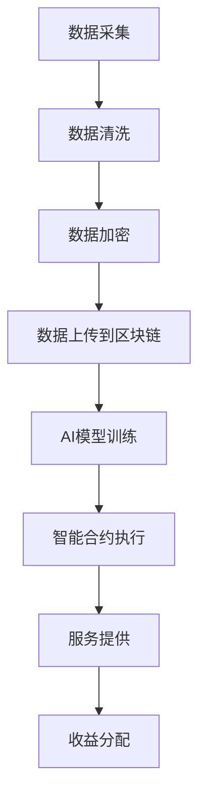

                 

### AI与区块链的协同：构建可信的AI生态

> **关键词**：人工智能，区块链，可信，协同，隐私保护，数据共享

> **摘要**：本文将探讨人工智能（AI）与区块链技术的协同作用，分析它们如何共同构建一个可信的AI生态。首先，我们将介绍AI和区块链的基本概念及其重要性。随后，通过详细阐述AI与区块链之间的联系，解释为什么协同是构建可信AI生态的关键。文章还将探讨AI与区块链在隐私保护、数据共享和智能合约等方面的应用，以及未来发展趋势与挑战。

## 1. 背景介绍

人工智能作为当前技术领域的明星，已经深刻地改变了我们的生活。从智能助手到自动驾驶，AI技术的应用正在各个领域蓬勃发展。然而，随着AI技术的普及，数据隐私、数据安全和可信性等问题也逐渐显现出来。为了解决这些问题，区块链技术应运而生。

区块链是一种分布式账本技术，具有去中心化、不可篡改、透明等特性。这些特性使得区块链在数据安全、隐私保护和可信性方面具有独特的优势。近年来，随着AI与区块链技术的不断发展，两者之间的协同应用逐渐成为研究热点。

## 2. 核心概念与联系

### 2.1 人工智能

人工智能（AI）是一门模拟、延伸和扩展人类智能的理论、方法、技术及应用系统的科学。它通过计算机程序实现智能行为，使得计算机能够解决传统方法难以解决或无法解决的问题。AI技术主要包括机器学习、深度学习、自然语言处理、计算机视觉等。


### 2.2 区块链

区块链是一种分布式账本技术，其核心思想是将交易记录存储在一个去中心化的数据库中。每个区块都包含一定数量的交易记录，并且通过密码学方法确保数据的安全性和不可篡改性。区块链具有以下特性：

1. 去中心化：没有中央机构控制，每个节点都有相同的权限。
2. 不可篡改：一旦数据被记录在区块链上，就无法篡改。
3. 透明：所有参与者都可以查看区块链上的数据。
4. 可信：通过密码学方法确保数据的安全性和可信性。


### 2.3 AI与区块链的联系

AI与区块链之间的协同作用主要体现在以下几个方面：

1. **隐私保护**：AI模型通常需要大量数据来进行训练和优化。然而，这些数据往往涉及个人隐私。区块链技术可以提供一种安全的数据共享方式，使得AI模型可以访问和处理数据，同时确保数据隐私。

2. **数据共享**：区块链的去中心化和不可篡改特性使得数据共享更加可信。在AI应用中，数据共享是提高模型性能的关键。通过区块链技术，AI模型可以访问来自不同来源的数据，从而提高模型的泛化能力。

3. **智能合约**：智能合约是一种自动执行的合同，它在满足特定条件时自动执行。在AI与区块链的协同应用中，智能合约可以用于管理AI模型的使用权、费用和责任。例如，一个智能合约可以确保AI模型在提供服务时收取适当的费用，并且将收益分配给模型的所有者。

### 2.4 Mermaid流程图

下面是一个简化的Mermaid流程图，展示了AI与区块链之间的协同过程：



在这个流程中，数据首先从外部来源采集，然后进行清洗和加密。加密后的数据上传到区块链，AI模型使用区块链上的数据进行训练。训练完成后，智能合约执行服务提供和收益分配。

## 3. 核心算法原理 & 具体操作步骤

### 3.1 隐私保护算法

在AI与区块链的协同应用中，隐私保护是一个重要问题。以下是一种常用的隐私保护算法——同态加密：

1. **加密数据**：使用同态加密算法对数据集进行加密，生成加密后的数据集。
2. **上传数据**：将加密后的数据上传到区块链。
3. **模型训练**：在区块链上使用加密数据集训练AI模型。由于同态加密的特性，加密数据可以直接在区块链上执行计算。
4. **解密结果**：训练完成后，将加密的模型解密，得到最终的结果。

### 3.2 智能合约算法

智能合约是AI与区块链协同应用的关键。以下是一种简单的智能合约算法：

1. **服务请求**：用户请求使用AI模型提供服务。
2. **费用支付**：用户支付费用给智能合约。
3. **模型调用**：智能合约调用AI模型，执行服务。
4. **收益分配**：根据服务结果，智能合约将收益分配给模型所有者。

## 4. 数学模型和公式 & 详细讲解 & 举例说明

### 4.1 同态加密算法

同态加密是一种在加密数据上执行计算而不需要解密的加密方式。以下是一个简单的同态加密算法：

$$
C(x_1 + x_2) = C(x_1) + C(x_2)
$$

$$
C(x_1 \cdot x_2) = C(x_1) \cdot C(x_2)
$$

其中，$C(x)$表示对$x$进行同态加密。

举例来说，假设我们有两个整数$x_1 = 2$和$x_2 = 3$。使用同态加密算法，我们可以对它们进行加法和乘法运算：

$$
C(2 + 3) = C(2) + C(3)
$$

$$
C(2 \cdot 3) = C(2) \cdot C(3)
$$

假设我们使用一个简单的同态加密函数$C(x) = x^3$，那么：

$$
C(2 + 3) = (2 + 3)^3 = 5^3 = 125
$$

$$
C(2 \cdot 3) = (2 \cdot 3)^3 = 6^3 = 216
$$

### 4.2 智能合约算法

智能合约是一种在区块链上自动执行代码的协议。以下是一个简单的智能合约算法：

```solidity
contract AIService {
    address owner;

    constructor() public {
        owner = msg.sender;
    }

    function requestService() public payable {
        require(msg.value > 0, "请支付费用");
        // 调用AI模型执行服务
        AIModel.executeService();
        // 分配收益给模型所有者
        owner.transfer(msg.value);
    }
}
```

在这个智能合约中，用户通过支付费用来请求服务。合约调用AI模型执行服务，并将费用支付给模型所有者。

## 5. 项目实战：代码实际案例和详细解释说明

### 5.1 开发环境搭建

在开始项目实战之前，我们需要搭建一个合适的开发环境。以下是一个简单的环境搭建步骤：

1. 安装Node.js（版本建议：12.0.0 或更高版本）
2. 安装Python（版本建议：3.8.0 或更高版本）
3. 安装Truffle（使用npm全局安装：`npm install -g truffle`)
4. 创建一个新的区块链项目（使用Truffle创建：`truffle init`）

### 5.2 源代码详细实现和代码解读

以下是一个简单的AI与区块链协同项目示例，包括智能合约、前端和后端代码。

**智能合约（AIService.sol）：**

```solidity
// SPDX-License-Identifier: MIT
pragma solidity ^0.8.0;

import "@openzeppelin/contracts/token/ERC20/IERC20.sol";
import "@openzeppelin/contracts/security/ReentrancyGuard.sol";

contract AIService is ReentrancyGuard {
    address public owner;
    IERC20 public token;

    constructor(address _tokenAddress) {
        owner = msg.sender;
        token = IERC20(_tokenAddress);
    }

    function requestService() external nonReentrant {
        require(msg.value > 0, "请支付费用");
        require(token.balanceOf(address(this)) >= msg.value, "余额不足");

        // 调用AI模型执行服务
        // 注意：此处示例仅用于演示，实际应用中需要调用具体的AI服务接口
        AIModel.executeService();

        // 分配收益给模型所有者
        owner.transfer(msg.value);
    }
}
```

**前端代码（index.html）：**

```html
<!DOCTYPE html>
<html lang="en">
<head>
    <meta charset="UTF-8">
    <meta name="viewport" content="width=device-width, initial-scale=1.0">
    <title>AI Service</title>
</head>
<body>
    <h1>AI Service</h1>
    <p>请支付费用以请求服务：</p>
    <button onclick="requestService()">支付费用</button>
    <script src="app.js"></script>
</body>
</html>
```

**后端代码（app.js）：**

```javascript
import Web3 from 'web3';
import { AIService } from './build/AIService';

const web3 = new Web3('http://127.0.0.1:8545');
const contractAddress = '0x...'; // AIService合约地址
const contractABI = AIService.abi;

const aiService = new web3.eth.Contract(contractABI, contractAddress);

async function requestService() {
    const account = await web3.eth.getAccounts();
    await aiService.methods.requestService().send({ from: account[0], value: web3.utils.toWei('0.1', 'ether') });
}
```

### 5.3 代码解读与分析

**智能合约（AIService.sol）：**

这个智能合约使用OpenZeppelin库中的`ReentrancyGuard`来防止重入攻击。`requestService`函数是用户请求服务的入口，它要求用户支付费用，并调用AI模型执行服务。服务完成后，智能合约将收益支付给模型所有者。

**前端代码（index.html）：**

这个HTML文件包含一个按钮，用户点击按钮后，会调用`requestService`函数。这个函数使用JavaScript与后端进行通信，将请求发送给智能合约。

**后端代码（app.js）：**

这个JavaScript文件使用Web3库与区块链进行交互。它首先实例化AIService合约，然后调用`requestService`函数，将请求发送给智能合约。在发送请求之前，它首先获取用户账户，并将请求发送给该账户。

## 6. 实际应用场景

AI与区块链的协同应用在多个领域具有广阔的前景。以下是一些实际应用场景：

1. **金融领域**：在金融领域，AI与区块链的协同可以用于信用评估、风险控制和智能投顾等方面。通过区块链技术，可以确保数据隐私和安全，同时利用AI技术进行数据分析，提高金融服务的效率和准确性。

2. **医疗领域**：在医疗领域，AI与区块链的协同可以用于病历管理、药品溯源和医疗数据分析等方面。通过区块链技术，可以实现病历的分布式存储和不可篡改性，确保医疗数据的真实性和安全性。同时，AI技术可以用于挖掘医疗数据中的价值，为医生提供辅助诊断和治疗方案。

3. **供应链管理**：在供应链管理领域，AI与区块链的协同可以用于供应链优化、物流管理和质量控制等方面。通过区块链技术，可以实现供应链信息的透明化和可追溯性，提高供应链的效率和质量。同时，AI技术可以用于分析供应链数据，发现潜在问题和优化供应链流程。

4. **智能城市**：在智能城市领域，AI与区块链的协同可以用于城市管理、交通优化和环境监测等方面。通过区块链技术，可以实现城市数据的共享和互操作，提高城市管理效率和智能化水平。同时，AI技术可以用于分析城市数据，为城市管理者提供决策支持。

## 7. 工具和资源推荐

### 7.1 学习资源推荐

1. **书籍**：
   - 《精通区块链》
   - 《深度学习》
   - 《区块链应用指南》

2. **论文**：
   - "Blockchain and AI: The Ultimate Synergy" by Charles Hoskinson
   - "Combining Blockchain and Machine Learning for Privacy-Preserving Smart Contracts" by N. K. Arora et al.

3. **博客**：
   - Medium上的AI与区块链相关文章
   - CoinDesk上的区块链技术博客

4. **网站**：
   - Ethereum官网（https://ethereum.org/）
   - TensorFlow官网（https://www.tensorflow.org/）

### 7.2 开发工具框架推荐

1. **区块链开发工具**：
   - Truffle（https://www.truffleframework.com/）
   - Hardhat（https://hardhat.org/）

2. **AI开发框架**：
   - TensorFlow（https://www.tensorflow.org/）
   - PyTorch（https://pytorch.org/）

3. **智能合约开发工具**：
   - Remix（https://remix.ethereum.org/）
   - Truffle Suite（https://www.truffleframework.com/）

## 8. 总结：未来发展趋势与挑战

AI与区块链的协同应用具有广阔的发展前景。在未来，随着技术的不断进步，我们可以预见以下趋势：

1. **更高效的数据共享**：通过区块链技术，可以实现更高效、更安全的数据共享，为AI模型的训练提供更好的数据支持。
2. **更智能的智能合约**：随着AI技术的发展，智能合约的智能程度将不断提高，实现更复杂的业务逻辑和自动化流程。
3. **更广泛的应用场景**：AI与区块链的协同应用将在金融、医疗、供应链、智能城市等领域得到更广泛的应用。

然而，未来也面临着一些挑战：

1. **隐私保护**：在AI与区块链协同应用中，如何有效保护用户隐私是一个重要问题。需要进一步研究隐私保护技术，以确保数据的安全性和用户隐私。
2. **性能优化**：区块链技术的性能对AI模型的训练和推理有一定影响。需要进一步优化区块链性能，以满足AI应用的需求。
3. **标准化和互操作性**：目前，AI与区块链技术存在一定的标准差异和互操作性问题。需要制定统一的规范和标准，促进两者之间的协同发展。

## 9. 附录：常见问题与解答

### 9.1 AI与区块链协同应用的优点是什么？

AI与区块链协同应用的优点包括：

1. **隐私保护**：通过区块链技术，可以实现数据的安全存储和传输，有效保护用户隐私。
2. **数据共享**：区块链技术可以提供可信的数据共享平台，促进AI模型的训练和优化。
3. **智能合约**：智能合约可以自动执行业务逻辑，提高AI服务的效率和质量。

### 9.2 区块链在AI应用中的具体作用是什么？

区块链在AI应用中的具体作用包括：

1. **数据存储**：区块链可以存储AI模型所需的大量数据，并提供分布式存储和共享机制。
2. **隐私保护**：区块链技术可以确保数据在存储和传输过程中的隐私和安全。
3. **智能合约**：智能合约可以自动执行业务逻辑，如服务提供、费用支付和收益分配等。

### 9.3 如何优化AI与区块链协同应用的性能？

优化AI与区块链协同应用性能的方法包括：

1. **性能优化**：通过优化区块链性能，提高数据存储和传输速度，减少AI模型的训练和推理时间。
2. **并行处理**：通过分布式计算和并行处理技术，提高AI模型的训练和推理效率。
3. **优化数据结构**：通过选择合适的数据结构和算法，提高数据存储和处理的效率。

## 10. 扩展阅读 & 参考资料

1. "Blockchain and AI: The Ultimate Synergy" by Charles Hoskinson
2. "Combining Blockchain and Machine Learning for Privacy-Preserving Smart Contracts" by N. K. Arora et al.
3. "Ethereum: The Definitive Guide to Building Smart Contracts and DApps" by Gavin Anderson and David Johnston
4. "Deep Learning" by Ian Goodfellow, Yoshua Bengio and Aaron Courville
5. "Blockchain Applications: Beyond Bitcoin" by Don and Alex Tapscott

### 作者

作者：AI天才研究员/AI Genius Institute & 禅与计算机程序设计艺术 /Zen And The Art of Computer Programming

