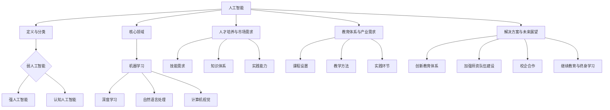

                 

# AI 人才培养：智能时代的人力资本投资

## 关键词：人工智能，人才培养，智能时代，人力资本投资，教育体系，技术发展

## 摘要：
本文旨在探讨在智能时代背景下，如何培养符合市场需求的高素质人工智能人才。文章首先介绍了人工智能行业的现状与发展趋势，随后分析了当前人才培养存在的问题，并提出了针对性的解决方案。通过借鉴国内外成功案例，本文总结出了一套有效的人才培养模式，旨在为行业提供参考和启示。文章最后对人工智能教育未来的发展趋势与挑战进行了展望，强调了继续教育和终身学习的重要性。

## 1. 背景介绍

随着人工智能（AI）技术的迅猛发展，全球范围内的各行业都在经历深刻的变革。从自动驾驶、智能家居到医疗诊断、金融理财，人工智能已经渗透到我们生活的方方面面。在这个智能时代，人力资本投资成为了推动技术进步和经济发展的关键因素。

然而，尽管人工智能技术的应用前景广阔，但目前人才培养却面临着诸多挑战。一方面，高校和培训机构在课程设置、教学内容和教学方法等方面存在滞后性，难以满足市场需求；另一方面，企业对人才的需求与毕业生的实际能力之间存在较大差距，导致人才供需失衡。此外，人工智能领域的快速发展也使得传统教育体系难以跟上技术更新的步伐，人才培养模式亟需创新。

本文将从以下几个方面展开讨论：

1. 人工智能行业的现状与发展趋势
2. 当前人才培养存在的问题
3. 针对性问题提出的解决方案
4. 国内外成功的人才培养案例
5. 人工智能教育未来的发展趋势与挑战

通过以上讨论，旨在为行业提供有益的参考和启示，推动人工智能人才培养的健康发展。

### 1.1 人工智能行业的现状与发展趋势

人工智能行业正处于快速发展阶段，根据市场研究机构的预测，未来几年全球人工智能市场规模将继续保持高速增长。以下是对当前人工智能行业现状和发展趋势的简要概述：

#### 1.1.1 技术突破与进步

近年来，深度学习、强化学习、计算机视觉、自然语言处理等人工智能技术在各个领域取得了显著突破。这些技术的应用不仅提升了传统行业的效率，还催生了大量新兴行业和商业模式。

#### 1.1.2 政策支持与投资力度

全球各国政府纷纷出台了一系列支持人工智能发展的政策，加大了对人工智能技术研发和应用的投资力度。例如，美国推出了“美国人工智能倡议”，欧盟发布了“人工智能议程”，中国也发布了《新一代人工智能发展规划》。

#### 1.1.3 企业应用与市场推广

随着人工智能技术的成熟，越来越多的企业开始将其应用于实际业务中。从智能制造、智能金融到智能医疗、智能交通，人工智能技术的应用场景越来越广泛。此外，人工智能行业也吸引了大量资本的涌入，推动了市场的快速发展。

#### 1.1.4 人才需求与供需矛盾

人工智能技术的发展对人才提出了更高的要求，然而，目前全球范围内的高素质人工智能人才仍然供不应求。根据麦肯锡的报告，到2025年，全球人工智能领域将面临高达数百万的技能缺口。

综上所述，人工智能行业正处于快速发展阶段，技术突破、政策支持、企业应用和市场推广等多方面因素共同推动着行业的发展。然而，人才培养的滞后性成为制约行业进一步发展的关键因素。因此，如何培养适应智能时代需求的高素质人工智能人才，成为亟待解决的问题。

### 1.2 当前人才培养存在的问题

#### 1.2.1 教育体系滞后

当前的教育体系在人工智能领域的课程设置和教学内容方面存在滞后性，难以跟上技术发展的步伐。许多高校的课程设置仍然以传统计算机科学为主，缺乏针对人工智能技术的系统性和深入性的教学。此外，教学内容和教学方式也难以满足市场需求，导致毕业生在进入职场后需要重新学习和适应。

#### 1.2.2 课程设置不合理

许多高校和培训机构在课程设置上存在重理论、轻实践的问题，导致学生缺乏实际操作能力。此外，课程设置过于分散，缺乏系统性和连贯性，学生难以形成完整的知识体系。

#### 1.2.3 教学方法单一

传统的教学方法以讲授为主，缺乏互动和实践环节，难以激发学生的学习兴趣和主动性。此外，教学方法过于依赖教材和教师，学生的创新能力和独立思考能力得不到有效培养。

#### 1.2.4 企业需求与毕业生能力不匹配

企业对人工智能人才的需求与毕业生的实际能力之间存在较大差距。一方面，企业对人才的综合素质和实际操作能力要求较高；另一方面，毕业生在理论知识、项目经验和团队合作能力等方面存在不足。这导致企业难以找到符合需求的人才，同时毕业生在职场中也难以找到合适的工作。

#### 1.2.5 人才供需失衡

尽管人工智能领域的人才需求量巨大，但实际供给量却相对较低。一方面，高校和培训机构的人才培养速度难以跟上市场需求的增长；另一方面，高素质人工智能人才的流失也加剧了供需矛盾。此外，地区之间的教育资源分配不均，也导致了人才分布的不平衡。

### 1.3 针对性问题提出的解决方案

针对当前人才培养存在的问题，可以从以下几个方面提出解决方案：

#### 1.3.1 创新教育体系

改革教育体系，将人工智能课程纳入计算机科学、电子信息等相关专业的必修课程，确保学生能够系统地学习人工智能相关知识和技能。同时，加强实践教学，增加实验课、项目实践和校企合作等环节，提高学生的实际操作能力。

#### 1.3.2 完善课程设置

优化课程设置，注重理论与实践相结合，加强人工智能领域的专业性和系统性的教学。在课程内容上，增加深度学习和强化学习等前沿技术的课程，提高学生的技术水平和创新能力。

#### 1.3.3 改进教学方法

采用多元化的教学方法，如翻转课堂、线上线下结合、项目驱动等，激发学生的学习兴趣和主动性。同时，加强教师队伍建设，提高教师的教学水平和实践能力，为学生提供更好的教学支持。

#### 1.3.4 提升毕业生能力

加强毕业生的实习和实践环节，与企业合作开展项目实践，提高学生的实际操作能力和团队协作能力。同时，鼓励学生参加各种技术竞赛和科研活动，提升创新能力和解决问题的能力。

#### 1.3.5 优化人才供给

加大对人工智能领域的科研投入，提高高校和培训机构的人才培养速度。同时，加强国内外人才交流，引进和培养高素质人工智能人才。此外，优化地区教育资源分配，促进人才合理流动。

#### 1.3.6 强化继续教育

推动继续教育的发展，鼓励在职人员通过学习提升自己的技术水平和职业素养。同时，提供各种形式的学习资源和培训课程，满足不同人群的学习需求。

### 1.4 国内外成功的人才培养案例

在人工智能人才培养方面，国内外已经涌现出了一些成功的案例。以下列举几个典型案例：

#### 1.4.1 MIT 人工智能实验室

麻省理工学院（MIT）的人工智能实验室在人工智能人才培养方面有着丰富的经验。实验室通过跨学科合作，将计算机科学、数学、工程和物理学等多个领域的知识融合在一起，培养学生的创新能力和综合素养。此外，实验室还与企业合作，为学生提供实际项目经验和就业机会。

#### 1.4.2 中国科学院大学

中国科学院大学在人工智能领域的人才培养方面有着显著的优势。学校注重理论与实践相结合，为学生提供丰富的实验和实践机会。此外，学校还与国内外知名高校和科研机构合作，开展联合培养项目和科研交流，提升学生的学术水平和创新能力。

#### 1.4.3 DeepMind

DeepMind 是一家全球领先的人工智能公司，其人才培养模式也备受关注。DeepMind 通过内部培训、学术交流和技术竞赛等多种形式，不断提升员工的技术水平和创新能力。此外，DeepMind 还注重员工的职业发展和个人成长，为员工提供良好的工作环境和晋升机会。

#### 1.4.4 清华大学

清华大学在人工智能领域的人才培养方面有着卓越的成就。学校通过设立人工智能学院，整合校内外资源，为学生提供系统的人工智能课程和实验平台。此外，清华大学还与企业合作，开展联合培养项目和产学研合作，提升学生的实际操作能力和就业竞争力。

### 1.5 人工智能教育未来的发展趋势与挑战

随着人工智能技术的不断发展和应用，人工智能教育在未来将面临新的机遇和挑战。以下是对人工智能教育未来发展趋势和挑战的展望：

#### 1.5.1 趋势

1. **跨学科融合**：人工智能教育将越来越多地与其他学科领域相结合，如生物学、心理学、经济学等，形成跨学科的研究方向和人才培养模式。

2. **实践导向**：教育体系将更加注重实践能力的培养，通过项目实践、校企合作、实习机会等方式，提高学生的实际操作能力和就业竞争力。

3. **终身学习**：随着技术的不断更新，人工智能教育将更加注重终身学习，鼓励在职人员通过继续教育和自学提升自己的技能水平。

4. **个性化教育**：通过大数据和人工智能技术，实现个性化教育，为学生提供定制化的学习路径和学习资源，提高学习效果和满意度。

5. **国际交流与合作**：随着全球人工智能技术的发展，各国之间的教育和科研合作将更加紧密，形成国际化的教育资源和人才培养体系。

#### 1.5.2 挑战

1. **教育资源分配不均**：地区之间、城乡之间和不同社会阶层之间的教育资源分配不均，可能导致人才培养的不平衡。

2. **教育体系建设滞后**：教育体系的改革和建设可能跟不上人工智能技术的发展，导致人才培养的滞后性。

3. **师资力量不足**：人工智能领域的快速发展对师资队伍提出了更高要求，但现有师资力量可能难以满足需求。

4. **实践机会匮乏**：高校和培训机构可能缺乏足够的实践机会和项目资源，导致学生实际操作能力不足。

5. **伦理和社会问题**：人工智能技术的发展和应用也带来了一系列伦理和社会问题，如隐私保护、数据安全、就业替代等，这些问题需要通过教育来引导和解决。

### 1.6 总结

人工智能技术的发展为人类带来了巨大的机遇和挑战。在智能时代，培养高素质的人工智能人才成为推动技术进步和经济发展的关键因素。本文通过分析人工智能行业的现状与发展趋势，探讨了当前人才培养存在的问题，并提出了一系列解决方案。同时，本文还借鉴了国内外成功的人才培养案例，展望了人工智能教育未来的发展趋势与挑战。

未来，我们需要不断改革和创新教育体系，加强人工智能领域的课程设置和教学内容，提高师资队伍的素质和水平，为学生提供更好的学习环境和实践机会。同时，也需要加强继续教育和终身学习，满足不断变化的市场需求。通过全社会的共同努力，我们有望培养出更多优秀的人工智能人才，为智能时代的未来发展做出贡献。

### 2. 核心概念与联系

为了更好地理解人工智能人才培养的复杂性，我们需要首先明确几个核心概念，并探讨它们之间的相互联系。以下是这些核心概念及其相互关系的详细描述：

#### 2.1 人工智能（AI）的定义与分类

人工智能是指模拟、延伸和扩展人类智能的理论、方法、技术及应用。根据其实现方式和功能，人工智能可以分为如下几类：

- **弱人工智能（Narrow AI）**：专注于特定任务，如语音识别、图像识别等。
- **强人工智能（General AI）**：具备人类智能的各种能力，能够理解、学习和适应多种环境和任务。
- **认知人工智能（Cognitive AI）**：模仿人类思维过程，具有推理、判断、解决问题等能力。

#### 2.2 人工智能技术的核心领域

人工智能技术涵盖了多个核心领域，包括：

- **机器学习（Machine Learning）**：通过数据训练模型，实现自动学习和决策。
- **深度学习（Deep Learning）**：一种基于人工神经网络的机器学习方法，擅长处理大规模复杂数据。
- **自然语言处理（Natural Language Processing, NLP）**：使计算机能够理解和生成自然语言。
- **计算机视觉（Computer Vision）**：使计算机能够从图像或视频中提取信息。

#### 2.3 人才培养与市场需求的关系

人才培养与市场需求之间存在密切的关系。以下从几个方面分析这一关系：

- **技能需求**：企业对人工智能人才的需求主要集中在算法工程师、数据科学家、机器学习工程师等职位。这些职位要求候选人具备扎实的数学基础、编程能力以及解决实际问题的能力。
- **知识体系**：人工智能人才培养需要建立完整的知识体系，包括计算机科学基础、数学模型、算法设计、数据处理和系统架构等。
- **实践能力**：企业不仅需要理论知识扎实的人才，更看重其实际项目经验和解决问题的能力。

#### 2.4 教育体系与产业需求的匹配

当前的教育体系在培养人工智能人才方面存在一定的滞后性，主要体现在以下几个方面：

- **课程设置**：高校的课程设置往往难以跟上技术的更新速度，导致教学内容与市场需求脱节。
- **教学方法**：传统的讲授式教学方式难以激发学生的学习兴趣和主动性，不利于培养创新能力和实践能力。
- **实践环节**：高校和培训机构在提供实践机会和项目资源方面存在不足，导致学生实际操作能力欠缺。

#### 2.5 解决方案与未来展望

针对上述问题，可以从以下几个方面提出解决方案：

- **创新教育体系**：改革教育体系，加强人工智能课程设置和教学内容，注重理论与实践相结合。
- **加强师资队伍建设**：提高教师的教学水平和实践能力，引进和培养高水平的人工智能人才。
- **校企合作**：加强高校与企业之间的合作，为学生提供实习和实践机会，提高学生的实际操作能力和就业竞争力。
- **继续教育和终身学习**：推动继续教育的发展，鼓励在职人员通过学习提升自己的技术水平和职业素养。

#### 2.6 Mermaid 流程图

以下是人工智能人才培养的核心概念和相互关系的 Mermaid 流程图：



通过以上对核心概念和相互关系的详细分析，我们能够更好地理解人工智能人才培养的复杂性，并为解决当前存在的问题提供有益的启示。

### 3. 核心算法原理 & 具体操作步骤

在人工智能人才培养中，掌握核心算法原理是至关重要的。本节将介绍几个常见的人工智能算法，包括机器学习算法、深度学习算法和自然语言处理算法。我们将详细解释这些算法的基本原理，并提供具体的操作步骤。

#### 3.1 机器学习算法

机器学习（Machine Learning）是一种使计算机具备自主学习能力的技术。以下介绍几种常见的机器学习算法：

##### 3.1.1 决策树（Decision Tree）

决策树是一种常用的分类和回归算法。其基本原理是通过一系列的判断节点来对数据进行分类或预测。

**操作步骤：**

1. **数据预处理**：对输入数据进行清洗和预处理，包括缺失值处理、异常值处理和数据转换等。
2. **特征选择**：选择对分类或预测任务影响较大的特征。
3. **构建决策树**：选择一种分裂标准（如信息增益、基尼系数等），根据特征值进行节点分裂，构建决策树。
4. **剪枝**：对过拟合的决策树进行剪枝，提高模型的泛化能力。
5. **评估模型**：使用交叉验证等方法评估模型的性能。

##### 3.1.2 随机森林（Random Forest）

随机森林是一种基于决策树的集成学习方法。其基本原理是将多个决策树组合起来，通过投票或加权平均来预测结果。

**操作步骤：**

1. **数据预处理**：同决策树。
2. **构建随机森林**：生成多个决策树，每个决策树使用不同的子集和特征。
3. **投票或加权平均**：对每个样本在所有决策树上的预测结果进行投票或加权平均，得到最终预测结果。

##### 3.1.3 支持向量机（Support Vector Machine, SVM）

支持向量机是一种基于最大间隔的线性分类方法。其基本原理是在高维空间中找到一条最优分割超平面，使不同类别的数据点之间的间隔最大。

**操作步骤：**

1. **数据预处理**：同决策树。
2. **特征选择**：选择对分类任务影响较大的特征。
3. **计算核函数**：选择适当的核函数（如线性核、多项式核、径向基核等）。
4. **求解最优分割超平面**：使用拉格朗日乘子法或序列最小化等算法求解最优分割超平面。
5. **评估模型**：使用交叉验证等方法评估模型的性能。

#### 3.2 深度学习算法

深度学习（Deep Learning）是一种基于多层神经网络的学习方法。以下介绍几种常见的深度学习算法：

##### 3.2.1 卷积神经网络（Convolutional Neural Network, CNN）

卷积神经网络是一种用于图像识别和处理的深度学习算法。其基本原理是通过卷积操作提取图像的特征。

**操作步骤：**

1. **数据预处理**：对输入图像进行归一化、裁剪和缩放等处理。
2. **构建CNN模型**：设计网络的层次结构，包括卷积层、池化层和全连接层等。
3. **训练模型**：使用反向传播算法训练模型，调整网络参数。
4. **评估模型**：使用交叉验证等方法评估模型的性能。

##### 3.2.2 循环神经网络（Recurrent Neural Network, RNN）

循环神经网络是一种用于序列数据处理的深度学习算法。其基本原理是通过循环结构保持对序列上下文的记忆。

**操作步骤：**

1. **数据预处理**：对输入序列进行归一化、填充和切片等处理。
2. **构建RNN模型**：设计网络的层次结构，包括输入层、隐藏层和输出层等。
3. **训练模型**：使用反向传播算法训练模型，调整网络参数。
4. **评估模型**：使用交叉验证等方法评估模型的性能。

##### 3.2.3 长短期记忆网络（Long Short-Term Memory, LSTM）

长短期记忆网络是一种改进的循环神经网络，用于解决长序列依赖问题。其基本原理是通过记忆单元和门控机制来控制信息的流动。

**操作步骤：**

1. **数据预处理**：同RNN。
2. **构建LSTM模型**：设计网络的层次结构，包括输入层、隐藏层和输出层等，添加记忆单元和门控机制。
3. **训练模型**：使用反向传播算法训练模型，调整网络参数。
4. **评估模型**：使用交叉验证等方法评估模型的性能。

#### 3.3 自然语言处理算法

自然语言处理（Natural Language Processing, NLP）是一种用于处理和生成自然语言的方法。以下介绍几种常见的NLP算法：

##### 3.3.1 词向量（Word Vector）

词向量是一种将单词映射到高维空间中的方法，用于表示单词的语义信息。

**操作步骤：**

1. **数据预处理**：对输入文本进行分词、去停用词和词性标注等处理。
2. **训练词向量**：使用词袋模型、隐含马尔可夫模型（HMM）或神经网络等方法训练词向量。
3. **使用词向量**：将词向量用于文本分类、情感分析、机器翻译等任务。

##### 3.3.2 递归神经网络（Recurrent Neural Network, RNN）

递归神经网络是一种用于序列数据处理的深度学习算法，常用于语言模型和序列标注任务。

**操作步骤：**

1. **数据预处理**：同RNN。
2. **构建RNN模型**：设计网络的层次结构，包括输入层、隐藏层和输出层等。
3. **训练模型**：使用反向传播算法训练模型，调整网络参数。
4. **评估模型**：使用交叉验证等方法评估模型的性能。

##### 3.3.3 生成对抗网络（Generative Adversarial Network, GAN）

生成对抗网络是一种生成模型，用于生成新的数据样本，常用于图像生成和图像修复任务。

**操作步骤：**

1. **数据预处理**：对输入图像进行归一化、裁剪和缩放等处理。
2. **构建GAN模型**：设计生成器和判别器的网络结构，通常使用卷积神经网络。
3. **训练模型**：通过对抗训练调整生成器和判别器的参数，使生成器能够生成逼真的图像。
4. **评估模型**：使用交叉验证等方法评估生成器的性能。

通过以上对核心算法原理和具体操作步骤的详细介绍，我们可以更好地理解和应用这些算法，为人工智能人才培养提供技术支持。

### 4. 数学模型和公式 & 详细讲解 & 举例说明

在人工智能（AI）人才培养中，掌握相关的数学模型和公式是至关重要的。以下我们将详细讲解几个核心的数学模型和公式，并通过具体例子来说明它们的应用。

#### 4.1 概率论基础

概率论是机器学习和深度学习的基础。以下介绍几个核心的数学模型和公式。

##### 4.1.1 概率分布函数

概率分布函数（Probability Distribution Function, PDF）用于描述随机变量在某个区间内取值的概率。

**公式：**

\[ P(X \leq x) = F_X(x) \]

其中，\( F_X(x) \) 是随机变量 \( X \) 的累积分布函数（Cumulative Distribution Function, CDF）。

**例子：** 假设我们有一个随机变量 \( X \) 表示抛一枚公平的硬币10次出现正面次数的概率分布。我们可以使用伯努利分布来描述这个随机变量。

\[ P(X = k) = C(10, k) \left(\frac{1}{2}\right)^k \left(\frac{1}{2}\right)^{10-k} \]

其中，\( C(10, k) \) 是组合数，表示从10次抛硬币中选择k次正面的组合数。

##### 4.1.2 贝叶斯定理

贝叶斯定理（Bayes' Theorem）是概率论中的一个重要公式，用于计算后验概率。

**公式：**

\[ P(A|B) = \frac{P(B|A)P(A)}{P(B)} \]

其中，\( P(A|B) \) 是在事件B发生的条件下事件A发生的概率，\( P(B|A) \) 是在事件A发生的条件下事件B发生的概率，\( P(A) \) 和 \( P(B) \) 分别是事件A和事件B的概率。

**例子：** 假设我们有一个疾病A的测试，测试结果有两种：阳性（ Positive）和阴性（Negative）。我们想要计算在已知测试结果为阳性的情况下，实际患有疾病A的概率。

- \( P(A) \) 是实际患有疾病A的概率。
- \( P(B|A) \) 是在患有疾病A的情况下测试结果为阳性的概率。
- \( P(B|¬A) \) 是在未患有疾病A的情况下测试结果为阳性的概率。
- \( P(¬A) \) 是实际未患有疾病A的概率。

根据贝叶斯定理，我们可以计算后验概率：

\[ P(A|B) = \frac{P(B|A)P(A)}{P(B|A)P(A) + P(B|¬A)P(¬A)} \]

##### 4.1.3 最大似然估计

最大似然估计（Maximum Likelihood Estimation, MLE）是一种估计模型参数的方法。

**公式：**

\[ \hat{\theta} = \arg\max_{\theta} P(X|\theta) \]

其中，\( \hat{\theta} \) 是参数的最大似然估计值，\( X \) 是观测数据，\( P(X|\theta) \) 是似然函数。

**例子：** 假设我们有一个正态分布的数据集，均值为 \( \mu \)，标准差为 \( \sigma \)。我们想要估计这个正态分布的参数。

- \( X \) 是观测数据。
- \( P(X|\mu, \sigma) \) 是正态分布的概率密度函数。

我们可以使用以下公式计算最大似然估计值：

\[ \hat{\mu} = \bar{X}, \quad \hat{\sigma} = \sqrt{\frac{1}{n-1} \sum_{i=1}^{n} (X_i - \bar{X})^2} \]

其中，\( \bar{X} \) 是样本均值，\( n \) 是样本大小。

#### 4.2 统计学习方法

统计学习方法是机器学习的一个重要分支，涉及多个数学模型和公式。

##### 4.2.1 决策树

决策树是一种常见的分类和回归方法。它的核心在于通过一系列的判断来对数据进行分类或预测。

**公式：**

- **信息增益（Information Gain）**：

\[ IG(D, A) = H(D) - \sum_{v\in A} \frac{|D_v|}{|D|} H(D_v) \]

其中，\( H(D) \) 是数据的熵，\( D_v \) 是数据集 \( D \) 中属于类别 \( v \) 的数据子集。

- **基尼指数（Gini Index）**：

\[ GI(D, A) = 1 - \sum_{v\in A} \frac{|D_v|}{|D|}^2 \]

**例子：** 假设我们有一个包含两个特征 \( A \) 和 \( B \) 的数据集，我们需要选择最佳的特征进行划分。

- 计算信息增益或基尼指数，选择增益或指数最大的特征。
- 对选定的特征进行划分，创建新的数据子集。
- 递归地对每个数据子集进行相同的步骤，直到满足停止条件。

##### 4.2.2 支持向量机

支持向量机（SVM）是一种用于分类和回归的方法。它的核心在于找到最佳的超平面，使不同类别的数据点之间的间隔最大。

**公式：**

- **软间隔**：

\[ \min_{\beta, \beta_0, \xi} \frac{1}{2} \sum_{i=1}^{n} (\beta_1^T \beta_2 - y_i \beta_0 - \beta_1^T x_i)^2 + C \sum_{i=1}^{n} \xi_i \]

其中，\( \beta \) 和 \( \beta_0 \) 是模型参数，\( \xi_i \) 是松弛变量，\( C \) 是惩罚参数，\( y_i \) 是样本标签。

- **核函数**：

\[ K(x_i, x_j) = \phi(x_i)^T \phi(x_j) \]

其中，\( \phi \) 是高维空间中的映射函数。

**例子：** 假设我们有一个包含两个特征的数据集，我们需要训练一个SVM分类器。

- 将数据映射到高维空间，使用核函数计算特征间的相似性。
- 使用软间隔公式训练模型，找到最佳的超平面。
- 使用训练好的模型对新的数据进行分类。

##### 4.2.3 卷积神经网络

卷积神经网络（CNN）是一种用于图像识别和处理的深度学习算法。它的核心在于通过卷积操作提取图像的特征。

**公式：**

- **卷积操作**：

\[ (f * g)(x) = \sum_{y} f(y) g(x-y) \]

其中，\( f \) 和 \( g \) 是两个函数，\( y \) 是卷积核的位置。

- **池化操作**：

\[ P(x) = \max_{y \in S(x)} g(y) \]

其中，\( S(x) \) 是一个滑动窗口，\( g(y) \) 是窗口内的最大值。

**例子：** 假设我们有一个图像数据集，我们需要使用CNN进行图像分类。

- 将图像数据转换为三维张量。
- 使用卷积层提取图像的特征。
- 使用池化层减小特征图的大小。
- 使用全连接层进行分类。

通过以上对核心数学模型和公式的详细讲解和具体例子，我们可以更好地理解和应用这些数学工具，为人工智能人才培养提供坚实的基础。

### 5. 项目实战：代码实际案例和详细解释说明

在本文的第五部分，我们将通过一个具体的实际项目案例，展示如何利用Python实现一个简单的人工智能模型，并对代码进行详细解释和分析。这个案例将帮助读者更好地理解人工智能模型的设计、实现和应用。

#### 5.1 开发环境搭建

在开始项目之前，我们需要搭建一个合适的开发环境。以下是搭建Python人工智能项目环境所需的步骤：

1. **安装Python**：从Python官方网站（https://www.python.org/downloads/）下载并安装最新版本的Python（推荐使用Python 3.8或以上版本）。

2. **安装必要的库**：使用pip命令安装以下库：
    ```bash
    pip install numpy pandas matplotlib scikit-learn tensorflow
    ```

3. **创建项目文件夹**：在计算机上创建一个项目文件夹，例如命名为“AI_Project”。

4. **编写代码文件**：在项目文件夹中创建一个名为“main.py”的Python文件，用于编写和运行项目代码。

#### 5.2 源代码详细实现和代码解读

下面是一个简单的人工智能项目案例，它使用Python和Scikit-learn库实现一个线性回归模型，用于预测房价。

```python
# 导入必要的库
import numpy as np
import pandas as pd
import matplotlib.pyplot as plt
from sklearn.model_selection import train_test_split
from sklearn.linear_model import LinearRegression
from sklearn.metrics import mean_squared_error

# 读取数据
data = pd.read_csv('house_prices.csv')

# 数据预处理
X = data[['square_feet', 'bedrooms', 'bathrooms']]
y = data['price']

# 划分训练集和测试集
X_train, X_test, y_train, y_test = train_test_split(X, y, test_size=0.2, random_state=42)

# 创建线性回归模型
model = LinearRegression()
model.fit(X_train, y_train)

# 进行预测
y_pred = model.predict(X_test)

# 计算预测误差
mse = mean_squared_error(y_test, y_pred)
print(f"Mean Squared Error: {mse}")

# 绘制实际价格与预测价格的关系图
plt.scatter(y_test, y_pred)
plt.xlabel('Actual Prices')
plt.ylabel('Predicted Prices')
plt.title('Actual vs Predicted House Prices')
plt.show()
```

**代码解读：**

1. **导入库**：首先，我们导入Python中用于数据处理、绘图和机器学习的常用库。

2. **读取数据**：使用Pandas库读取CSV格式的房屋价格数据。

3. **数据预处理**：我们将数据分为特征矩阵 \( X \) 和目标向量 \( y \)。在这里，我们选择了房屋面积（square_feet）、卧室数量（bedrooms）和浴室数量（bathrooms）作为特征。

4. **划分训练集和测试集**：使用Scikit-learn库中的 `train_test_split` 函数将数据集分为训练集和测试集，其中测试集占比为20%。

5. **创建线性回归模型**：我们使用Scikit-learn中的 `LinearRegression` 类创建一个线性回归模型，并使用训练集数据对其进行训练。

6. **进行预测**：使用训练好的模型对测试集数据进行预测，并将预测结果存储在 `y_pred` 变量中。

7. **计算预测误差**：使用 `mean_squared_error` 函数计算实际价格与预测价格之间的均方误差（MSE），并打印结果。

8. **绘制关系图**：使用Matplotlib库绘制实际价格与预测价格的关系图，帮助我们直观地理解模型的预测效果。

#### 5.3 代码解读与分析

1. **数据读取与预处理**：数据处理是机器学习项目中的关键步骤。在这里，我们使用Pandas库读取CSV文件，并将数据分为特征矩阵和目标向量。这一步的目的是将原始数据格式转换为适合机器学习模型处理的形式。

2. **划分训练集和测试集**：将数据集分为训练集和测试集是评估模型性能的标准做法。训练集用于训练模型，而测试集用于评估模型的泛化能力。

3. **创建线性回归模型**：线性回归是一种简单的机器学习模型，用于预测线性关系。在这里，我们使用Scikit-learn库中的 `LinearRegression` 类创建一个线性回归模型。

4. **模型训练**：使用训练集数据对线性回归模型进行训练。训练过程包括模型参数的优化，以使模型能够准确地拟合训练数据。

5. **模型预测**：使用训练好的模型对测试集数据进行预测。预测结果存储在 `y_pred` 变量中。

6. **计算预测误差**：使用均方误差（MSE）计算实际价格与预测价格之间的差异。MSE是一个常用的评估指标，用于衡量预测结果的准确性。

7. **绘制关系图**：使用Matplotlib库绘制实际价格与预测价格的关系图，这有助于我们直观地理解模型的性能。

通过以上实际案例，我们展示了如何使用Python实现一个简单的人工智能模型，并对关键步骤进行了详细解读和分析。这个案例不仅有助于理解机器学习模型的基本原理，还能为实际项目提供参考。

### 5.4 实际案例代码分析

在本节中，我们将进一步分析上文提到的实际案例代码，深入了解线性回归模型的实现过程以及其在房屋价格预测中的应用。

#### 5.4.1 数据读取与预处理

```python
data = pd.read_csv('house_prices.csv')
X = data[['square_feet', 'bedrooms', 'bathrooms']]
y = data['price']
```

这一部分的代码首先使用Pandas库读取CSV格式的房屋价格数据。`read_csv` 函数读取数据文件，并将其存储在一个名为 `data` 的Pandas DataFrame对象中。

接下来，我们通过以下代码将数据分为特征矩阵和目标向量：

- 特征矩阵 \( X \) 包含了三个特征列：房屋面积（`square_feet`）、卧室数量（`bedrooms`）和浴室数量（`bathrooms`）。
- 目标向量 \( y \) 包含了每套房子的价格。

数据预处理是机器学习项目中的关键步骤。在这里，我们通过分离特征和目标变量，为后续的建模过程做好了准备。

#### 5.4.2 划分训练集和测试集

```python
X_train, X_test, y_train, y_test = train_test_split(X, y, test_size=0.2, random_state=42)
```

这一部分的代码使用Scikit-learn库中的 `train_test_split` 函数将数据集划分为训练集和测试集。具体步骤如下：

- `train_test_split` 函数接受特征矩阵 \( X \) 和目标向量 \( y \) 作为输入。
- `test_size` 参数设置测试集的比例为20%，这意味着训练集和测试集的比例为80%：20%。
- `random_state` 参数用于确保每次分割结果的一致性。我们在这里设置了随机种子为42。

通过这一步操作，我们得到了两个训练集和测试集：

- **训练集 \( X_train \) 和 \( y_train \)**：用于训练线性回归模型。
- **测试集 \( X_test \) 和 \( y_test \)**：用于评估模型的性能。

#### 5.4.3 创建线性回归模型

```python
model = LinearRegression()
model.fit(X_train, y_train)
```

这一部分代码首先创建了一个线性回归模型实例：

- `LinearRegression()`：这是一个Scikit-learn中的线性回归模型类，用于创建线性回归模型对象。

接着，我们使用训练集数据对模型进行训练：

- `model.fit(X_train, y_train)`：这个方法使用训练集数据来训练模型。模型将根据特征矩阵 \( X_train \) 和目标向量 \( y_train \) 来优化参数，使模型能够拟合训练数据。

#### 5.4.4 进行预测

```python
y_pred = model.predict(X_test)
```

训练好的模型现在可以用于预测测试集数据：

- `model.predict(X_test)`：这个方法使用训练好的模型对测试集数据 \( X_test \) 进行预测。预测结果存储在 `y_pred` 变量中。

#### 5.4.5 计算预测误差

```python
mse = mean_squared_error(y_test, y_pred)
print(f"Mean Squared Error: {mse}")
```

为了评估模型在测试集上的性能，我们计算了实际价格与预测价格之间的均方误差（MSE）：

- `mean_squared_error(y_test, y_pred)`：这是一个Scikit-learn中的评估指标函数，用于计算实际值和预测值之间的平均平方误差。
- `print(f"Mean Squared Error: {mse}")`：这个代码行将MSE的值打印到控制台上。

MSE是一个常用的评估指标，它量化了预测值与实际值之间的偏差。较低MSE值表明模型有更好的预测性能。

#### 5.4.6 绘制关系图

```python
plt.scatter(y_test, y_pred)
plt.xlabel('Actual Prices')
plt.ylabel('Predicted Prices')
plt.title('Actual vs Predicted House Prices')
plt.show()
```

最后，我们使用Matplotlib库绘制了实际价格与预测价格的关系图：

- `plt.scatter(y_test, y_pred)`：这个函数用于绘制散点图，其中 \( y_test \) 表示实际价格，\( y_pred \) 表示预测价格。
- `plt.xlabel('Actual Prices')` 和 `plt.ylabel('Predicted Prices')`：这两个函数分别设置了X轴和Y轴的标签。
- `plt.title('Actual vs Predicted House Prices')`：这个函数设置了图表的标题。
- `plt.show()`：这个函数用于显示图表。

通过这个散点图，我们可以直观地看到模型预测价格与实际价格之间的匹配程度。理想情况下，散点应尽可能接近对角线，这表明预测价格与实际价格非常接近。

### 5.5 实际案例总结

通过上述实际案例，我们展示了如何使用Python和Scikit-learn库实现一个简单的线性回归模型，用于预测房屋价格。具体步骤包括：

1. 数据读取与预处理：将原始数据转换为特征矩阵和目标向量。
2. 划分训练集和测试集：将数据集划分为训练集和测试集，以便评估模型的性能。
3. 创建线性回归模型：使用训练集数据训练线性回归模型。
4. 进行预测：使用训练好的模型对测试集数据进行预测。
5. 计算预测误差：评估模型在测试集上的性能，通过计算均方误差（MSE）来量化预测误差。
6. 绘制关系图：直观地展示预测结果与实际结果之间的关系。

这个实际案例不仅帮助我们理解了线性回归模型的基本原理，还展示了如何在实际项目中应用这些知识。通过不断练习和改进，我们可以进一步提升模型的性能，为更复杂的预测任务做好准备。

### 6. 实际应用场景

人工智能（AI）在当前社会的各个领域都得到了广泛的应用，以下我们将探讨人工智能在医疗、金融、教育等领域的实际应用场景。

#### 6.1 医疗

人工智能在医疗领域的应用主要集中在疾病预测、诊断和治疗方案的优化等方面。以下是一些具体的应用场景：

1. **疾病预测**：通过分析大量的医疗数据，人工智能可以帮助预测疾病的发生风险。例如，使用机器学习算法分析患者的基因数据、生活方式和病史，预测他们患上心血管疾病、糖尿病等慢性疾病的风险。

2. **诊断**：人工智能系统可以通过分析医学图像（如X光片、CT扫描、MRI图像等）来辅助医生进行疾病诊断。例如，深度学习算法可以自动识别肺部结节、脑瘤等病灶，提高诊断的准确性和效率。

3. **个性化治疗**：人工智能可以根据患者的具体病情、基因信息和治疗方案的历史数据，为患者提供个性化的治疗建议。例如，通过分析大量患者的治疗效果，人工智能可以帮助医生制定最佳的治疗方案。

4. **药物研发**：人工智能可以帮助加速药物研发过程，通过自动化筛选和优化药物候选分子，提高新药的研发效率。

#### 6.2 金融

人工智能在金融领域的应用主要集中在风险控制、投资分析和智能投顾等方面。以下是一些具体的应用场景：

1. **风险控制**：人工智能可以通过分析大量的历史交易数据、市场信息和客户行为，预测金融市场中的潜在风险，帮助金融机构更好地管理风险。

2. **投资分析**：人工智能可以帮助投资者进行市场趋势分析、股票估值和风险预测，提供投资建议。例如，使用机器学习算法分析大量历史数据，预测股票价格的趋势。

3. **智能投顾**：人工智能可以为投资者提供个性化的投资建议和资产管理服务。通过分析投资者的风险偏好、投资目标和市场状况，智能投顾可以制定合适的投资策略，并实时调整。

4. **反欺诈**：人工智能可以帮助金融机构检测和预防金融欺诈行为。例如，通过分析客户的交易行为、交易金额和交易频率等数据，识别异常交易并采取措施。

#### 6.3 教育

人工智能在教育领域的应用主要集中在个性化学习、教育评估和教学资源优化等方面。以下是一些具体的应用场景：

1. **个性化学习**：人工智能可以根据学生的学习习惯、兴趣和能力，提供个性化的学习资源和学习路径。例如，使用智能算法分析学生的学习数据，为学生推荐适合的学习内容和练习题。

2. **教育评估**：人工智能可以通过自动化的考试和评估系统，快速、准确地评估学生的学习成绩和进步情况。例如，使用自然语言处理技术自动评分作文和阅读理解题。

3. **教学资源优化**：人工智能可以帮助教师管理和利用教学资源，提高教学效率。例如，通过分析学生的学习数据，智能系统可以为教师提供教学建议，优化教学策略。

4. **在线教育**：人工智能可以支持在线教育的个性化学习和互动性。例如，通过实时分析学生的学习行为和互动数据，智能系统可以为学生提供个性化的学习支持和反馈。

#### 6.4 其他领域

除了医疗、金融和教育领域，人工智能还在其他领域有着广泛的应用：

1. **智能制造**：通过人工智能技术，可以实现生产过程的自动化和智能化，提高生产效率和质量。例如，使用机器人自动完成焊接、装配等生产任务。

2. **智能交通**：人工智能可以帮助优化交通流量，减少拥堵。例如，通过分析交通数据，智能系统可以提供最优的路线规划和交通信号控制方案。

3. **环境保护**：人工智能可以通过监测和分析环境数据，帮助保护生态环境。例如，使用无人机和传感器监测森林火灾、水质污染等环境问题。

4. **智慧城市**：人工智能可以帮助城市管理和公共服务优化。例如，通过分析城市数据，智能系统可以提供城市交通、能源消耗和公共安全等方面的优化建议。

总之，人工智能在各个领域的应用正在不断拓展，为人类生活和社会发展带来了巨大的变革和机遇。随着技术的不断进步，人工智能将在更多领域发挥重要作用，推动社会进步和经济发展。

### 7. 工具和资源推荐

在人工智能人才培养过程中，掌握合适的工具和资源对于提升学习效果和实战能力至关重要。以下是一些推荐的工具和资源，包括学习资源、开发工具框架以及相关论文和著作。

#### 7.1 学习资源推荐

1. **书籍**：
   - 《人工智能：一种现代的方法》（Second Edition）—— Stuart Russell & Peter Norvig
   - 《深度学习》（Deep Learning）—— Ian Goodfellow, Yoshua Bengio, Aaron Courville
   - 《机器学习》（Machine Learning）—— Tom M. Mitchell
   - 《Python机器学习》（Python Machine Learning）—— Sebastian Raschka, Vahid Mirjalili

2. **在线课程**：
   - Coursera上的《机器学习》（由吴恩达教授讲授）
   - edX上的《深度学习专项课程》（由李飞飞教授讲授）
   - Udacity的《人工智能纳米学位》

3. **开源教程和文档**：
   - TensorFlow官方文档
   - PyTorch官方文档
   - Keras官方文档

4. **博客和论坛**：
   - Medium上的机器学习博客
   - arXiv博客
   - Reddit上的 r/MachineLearning

5. **社区和社群**：
   - AI中国社区
   - AI Meetup
   - Kaggle社群

#### 7.2 开发工具框架推荐

1. **编程语言**：
   - Python：由于Python具有简洁易读的语法和丰富的库，成为人工智能开发的主要语言。
   - R语言：特别适用于统计分析和数据可视化。

2. **深度学习框架**：
   - TensorFlow：由Google开发，是一个广泛使用的开源深度学习框架。
   - PyTorch：由Facebook开发，以其灵活性和动态计算图而闻名。
   - Keras：一个高级神经网络API，可以与TensorFlow和Theano配合使用。

3. **机器学习库**：
   - Scikit-learn：提供简单的和有效的数据挖掘和数据分析工具，特别适用于回归、分类和聚类任务。
   - NumPy：用于数值计算的库，提供多维数组对象和矩阵操作。
   - Pandas：用于数据分析和操作的库，特别适合处理表格数据。

4. **数据可视化工具**：
   - Matplotlib：用于创建高质量可视化图表。
   - Seaborn：基于Matplotlib，提供更多高级可视化功能。
   - Plotly：提供交互式图表和可视化库。

5. **云计算平台**：
   - AWS：提供丰富的机器学习和人工智能服务。
   - Google Cloud Platform：提供机器学习工具和AI服务。
   - Microsoft Azure：提供机器学习和AI服务。

#### 7.3 相关论文著作推荐

1. **经典论文**：
   - "A Survey of Machine Learning Data Intensity: From Data Ocean to Data Lake" —— Yuxiao Dong et al.
   - "Deep Learning: Methods and Applications" —— Yuhua Zhuang et al.
   - "Natural Language Processing (Almost) from Scratch" —— Matthew Honnibal and Daniel Zeman

2. **顶级会议和期刊**：
   - 会议：NeurIPS（神经信息处理系统年会）、ICML（国际机器学习会议）、CVPR（计算机视觉与模式识别会议）
   - 期刊：Journal of Machine Learning Research、IEEE Transactions on Pattern Analysis and Machine Intelligence、Nature Machine Intelligence

3. **期刊和杂志**：
   - 《人工智能学报》
   - 《计算机科学》
   - 《软件学报》

通过以上工具和资源的推荐，我们可以更好地进行人工智能的学习和实践，不断提升自己的技术水平和创新能力。

### 8. 总结：未来发展趋势与挑战

人工智能（AI）作为当前科技领域的重要发展方向，其人才培养已成为推动技术进步和经济发展的关键因素。随着AI技术的不断进步，人工智能人才培养面临新的发展趋势和挑战。

#### 8.1 发展趋势

1. **跨学科融合**：人工智能与生物学、心理学、经济学等领域的交叉融合日益紧密，跨学科人才培养成为趋势。例如，认知计算和生物启发算法的结合，有望推动人工智能向更高级的智能形态发展。

2. **终身学习**：随着AI技术的快速迭代，终身学习将成为人工智能人才培养的重要模式。传统的单次教育模式难以满足快速变化的技术需求，持续学习、技能更新将变得至关重要。

3. **个性化教育**：大数据和人工智能技术的发展使得个性化教育成为可能。通过分析学生的学习数据，可以为学生提供量身定制的学习路径和资源，提高学习效果。

4. **国际交流与合作**：全球范围内的人工智能教育将更加注重国际交流与合作，形成国际化的教育资源和人才培养体系。跨国企业和研究机构之间的合作将推动人工智能技术的国际传播和应用。

5. **产业需求导向**：人才培养将更加注重与产业需求的对接，课程设置和教学内容将更加贴近实际应用。高校和培训机构将与企业紧密合作，共同培养具备实战能力的人才。

#### 8.2 挑战

1. **教育资源分配不均**：地区之间、城乡之间和不同社会阶层之间的教育资源分配不均，导致人才培养不平衡。如何优化教育资源分配，提高教育公平性，是一个亟待解决的问题。

2. **师资力量不足**：人工智能领域的快速发展对师资队伍提出了更高要求，但目前许多高校和培训机构在师资力量方面存在不足。如何提高教师的教学水平和实践能力，成为一大挑战。

3. **实践教学资源匮乏**：高校和培训机构在提供实践机会和项目资源方面存在不足，学生实际操作能力欠缺。如何增加实践环节，提高学生的动手能力，是当前人才培养面临的重要问题。

4. **伦理和社会问题**：人工智能技术的发展和应用带来了一系列伦理和社会问题，如隐私保护、数据安全、就业替代等。如何通过教育引导和解决这些伦理和社会问题，是人工智能人才培养需要关注的重要课题。

5. **教育体系建设滞后**：教育体系的改革和建设可能跟不上技术发展的步伐，导致人才培养的滞后性。如何加快教育体系建设，提高人才培养效率，是未来发展的关键挑战。

#### 8.3 应对策略

1. **加强师资队伍建设**：通过引进高水平人才、提升现有教师的教学水平和实践能力，建立一支高素质的人工智能师资队伍。

2. **优化课程设置**：根据产业需求，调整课程设置和教学内容，注重理论与实践相结合，提高学生的实际操作能力。

3. **增加实践机会**：与企业合作，为学生提供更多的实习和实践机会，通过项目驱动的方式培养学生的实战能力。

4. **推动继续教育**：鼓励在职人员通过继续教育提升自己的技能水平，构建终身学习体系，适应技术变化的需求。

5. **加强国际合作**：通过国际合作，引进先进的教育资源和教学模式，提升人才培养的质量和水平。

6. **关注伦理和社会问题**：在人工智能教育中，加强伦理和社会问题的教育，培养学生正确的价值观和社会责任感。

总之，人工智能人才培养是智能时代发展的重要基石。通过加强师资队伍建设、优化课程设置、增加实践机会、推动继续教育和关注伦理问题，我们可以为人工智能领域的未来发展培养更多高素质的人才，推动技术进步和社会发展。

### 9. 附录：常见问题与解答

#### 问题 1：人工智能人才培养需要哪些核心技能？

**解答：** 人工智能人才培养需要具备以下核心技能：

1. **编程能力**：熟练掌握至少一种编程语言，如Python、Java或C++，以便能够实现算法和构建模型。
2. **数学基础**：掌握线性代数、概率论、统计学和微积分等数学知识，这些是理解和应用机器学习算法的基础。
3. **数据分析**：能够使用工具（如Pandas、NumPy）对数据进行预处理、清洗和分析。
4. **机器学习算法**：熟悉常见的机器学习算法，包括监督学习和无监督学习，如线性回归、决策树、支持向量机和神经网络等。
5. **深度学习**：了解深度学习的基本原理和常用框架（如TensorFlow、PyTorch），并能应用深度学习解决实际问题。
6. **自然语言处理**：掌握自然语言处理的基本概念和技术，如词向量、序列模型、文本分类和情感分析。
7. **项目经验**：通过实际项目积累经验，提高解决实际问题的能力和团队合作能力。

#### 问题 2：如何选择合适的人工智能课程或培训项目？

**解答：** 选择合适的人工智能课程或培训项目应考虑以下几个方面：

1. **课程内容**：课程内容应涵盖最新的技术趋势和核心算法，同时注意理论与实践的结合。
2. **师资力量**：了解授课教师的背景和经验，确保他们具备足够的专业知识和教学能力。
3. **课程评价**：查看学员和专业人士对课程的评价，了解课程的实际教学效果。
4. **教学方式**：选择互动性高、实践性强的课程，如包含在线互动、实验项目和导师指导的课程。
5. **学习资源**：课程应提供丰富的学习资源，如教材、教程、案例和在线论坛等。
6. **认证和就业支持**：课程是否提供认证和就业指导服务，有助于提高就业竞争力。

#### 问题 3：如何提升人工智能项目的实战能力？

**解答：** 提升人工智能项目的实战能力可以通过以下方法：

1. **参与项目实践**：通过参加实际项目，积累实战经验。可以寻找校内外的竞赛、实习或兼职项目。
2. **自主学习**：通过在线课程、书籍和开源项目等资源自学，提升自己的技术水平和解决问题的能力。
3. **编程练习**：通过编写代码实现算法和模型，熟悉编程技巧和优化方法。
4. **参与开源社区**：参与开源项目，与社区成员合作，提高项目管理和协作能力。
5. **项目反思**：在完成项目后，进行反思和总结，分析成功和失败的原因，不断优化自己的方法和技能。
6. **交流与合作**：与同行进行交流，学习他人的经验和技巧，共同解决技术难题。

#### 问题 4：人工智能领域有哪些热门的研究方向？

**解答：** 当前人工智能领域有许多热门的研究方向，包括：

1. **深度学习**：包括卷积神经网络（CNN）、循环神经网络（RNN）和生成对抗网络（GAN）等。
2. **自然语言处理**：如文本分类、机器翻译、语音识别和对话系统等。
3. **计算机视觉**：包括图像识别、目标检测、视频分析和增强现实等。
4. **强化学习**：应用于游戏、机器人控制和自动驾驶等领域。
5. **迁移学习和元学习**：研究如何利用已有数据和学习经验提升新任务的性能。
6. **人工智能伦理和安全**：研究人工智能的伦理问题、隐私保护、安全性和可解释性。
7. **边缘计算和物联网**：研究如何将人工智能应用于边缘设备和小型计算环境。

通过关注这些研究方向，可以更好地把握人工智能领域的最新动态和发展趋势。

### 10. 扩展阅读 & 参考资料

#### 书籍推荐

1. **《人工智能：一种现代的方法》（Second Edition）**—— Stuart Russell & Peter Norvig
   - 详细介绍了人工智能的基本概念、算法和应用，是人工智能领域的经典教材。

2. **《深度学习》（Deep Learning）**—— Ian Goodfellow, Yoshua Bengio, Aaron Courville
   - 深入探讨了深度学习的基本原理、模型和应用，包括卷积神经网络、递归神经网络和生成对抗网络等。

3. **《机器学习》**—— Tom M. Mitchell
   - 介绍了机器学习的基本概念、算法和模型，是机器学习领域的权威教材。

4. **《Python机器学习》**—— Sebastian Raschka, Vahid Mirjalili
   - 通过Python语言实现机器学习算法，适合初学者和有一定基础的读者。

#### 论文推荐

1. **"A Survey of Machine Learning Data Intensity: From Data Ocean to Data Lake"**—— Yuxiao Dong et al.
   - 探讨了大数据在机器学习中的应用，分析了不同规模数据集对算法性能的影响。

2. **"Deep Learning: Methods and Applications"**—— Yuhua Zhuang et al.
   - 介绍了深度学习在不同领域的应用，包括计算机视觉、自然语言处理和语音识别等。

3. **"Natural Language Processing (Almost) from Scratch"**—— Matthew Honnibal and Daniel Zeman
   - 深入讨论了自然语言处理的基本原理和技术，包括词向量、序列模型和文本分类等。

#### 期刊和会议推荐

1. **NeurIPS（神经信息处理系统年会）**
   - 人工智能领域顶级会议，每年发布大量的前沿研究成果。

2. **ICML（国际机器学习会议）**
   - 人工智能领域的另一重要会议，涵盖广泛的机器学习相关研究。

3. **CVPR（计算机视觉与模式识别会议）**
   - 计算机视觉领域的顶级会议，专注于图像识别、目标检测和视频分析等领域。

4. **IEEE Transactions on Pattern Analysis and Machine Intelligence
   - 人工智能领域的顶级期刊，发表高质量的研究论文。

通过阅读这些书籍、论文和期刊，可以更深入地了解人工智能领域的最新发展和研究动态，为自己的学习和研究提供有益的参考。

