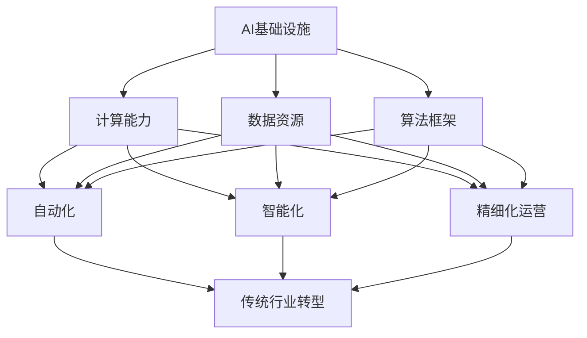

                 

### 背景介绍

**AI基础设施的产业升级：赋能传统行业转型**

随着人工智能技术的飞速发展，AI基础设施的重要性日益凸显。AI基础设施不仅涵盖了计算能力、数据资源、算法框架等关键技术要素，还涉及到了硬件设备、网络架构、数据存储与管理等多个领域。在数字经济时代，AI基础设施的升级已经成为推动传统行业实现数字化转型和产业升级的核心动力。

传统的制造、金融、医疗、教育等行业，长期以来依赖于人工操作和传统的信息系统。这些行业的特点是数据量大、业务复杂、决策依赖经验。随着AI技术的不断成熟，AI基础设施的引入可以帮助这些传统行业实现自动化、智能化和精细化运营，从而提升效率、降低成本、提高服务质量。

本文旨在探讨AI基础设施对传统行业转型的赋能作用，从核心概念、算法原理、数学模型、项目实战等多个方面，全面分析AI基础设施在产业升级中的关键作用。通过本文的阅读，读者将能够深入了解AI基础设施的架构、应用场景以及未来发展趋势。

首先，我们将介绍AI基础设施的基本概念，包括其组成部分和关键要素。接着，我们将探讨AI基础设施与传统行业转型的关系，分析AI如何赋能制造业、金融业、医疗业和教育业等传统行业。随后，我们将详细讲解AI基础设施的核心算法原理和具体操作步骤，帮助读者理解AI技术的本质和应用。然后，我们将通过数学模型和公式的讲解，深入剖析AI基础设施中的计算和优化问题。接下来，我们将结合实际应用场景，展示AI基础设施在各个行业中的成功案例。在工具和资源推荐部分，我们将为读者提供相关学习资源、开发工具和论文著作，帮助读者进一步深入学习和研究。最后，我们将总结未来发展趋势和挑战，并给出常见问题与解答。

通过以上内容，本文希望为读者呈现一幅全面、深入的AI基础设施产业升级的全景图，为传统行业的数字化转型提供理论支持和实践指导。

---

**关键词：** AI基础设施，产业升级，传统行业，数字化转型，计算能力，数据资源，算法框架

**摘要：** 本文深入探讨了AI基础设施在传统行业转型中的作用。首先介绍了AI基础设施的基本概念和组成部分，然后分析了AI基础设施如何赋能制造业、金融业、医疗业和教育业等传统行业。通过核心算法原理、数学模型和实际应用场景的讲解，本文展示了AI基础设施在产业升级中的关键作用。最后，本文总结了未来发展趋势和挑战，并为读者提供了相关学习资源和工具推荐。通过本文的阅读，读者将能够全面了解AI基础设施在传统行业中的应用和前景。

### 核心概念与联系

要理解AI基础设施对传统行业转型的重要作用，我们需要首先了解几个核心概念：人工智能（AI）、基础设施、传统行业以及转型。

**人工智能（AI）：** 人工智能是指计算机系统模拟人类智能行为的能力，包括学习、推理、规划、感知、自然语言处理等。AI技术主要包括机器学习、深度学习、自然语言处理、计算机视觉等子领域。

**基础设施：** 在技术领域，基础设施通常指的是支持特定应用或服务的基本设施，包括硬件、软件、网络、数据存储等。对于AI基础设施，它主要指的是支持AI算法训练、部署和运行的基础设施，包括高性能计算资源、海量数据存储、高效网络传输以及AI算法框架等。

**传统行业：** 传统行业是指那些在过去以人工操作和传统信息系统为主的企业或行业，如制造业、金融业、医疗业和教育业等。这些行业通常面临数据量大、业务复杂、决策依赖经验等问题。

**转型：** 转型指的是从一种状态或模式转变为另一种状态或模式，通常涉及技术的升级和业务模式的转变。在本文的背景下，转型指的是传统行业通过引入AI基础设施，实现从人工操作和传统信息系统向自动化、智能化和精细化运营的转变。

**AI基础设施与传统行业转型的关系：** AI基础设施为传统行业提供了强大的计算能力、数据资源和算法框架，这些要素共同推动了传统行业的转型。具体来说，AI基础设施可以帮助传统行业实现以下几个方面：

1. **自动化：** 通过机器学习和自动化技术，传统行业可以实现生产流程、业务流程的自动化，从而减少人工操作，提高效率。

2. **智能化：** 通过自然语言处理、计算机视觉等技术，传统行业可以实现智能化决策和智能化服务，提高业务水平和用户体验。

3. **精细化运营：** 通过数据分析和技术优化，传统行业可以实现业务过程的精细化管理和优化，提高资源利用效率和经济效益。

接下来，我们将通过一个Mermaid流程图，展示AI基础设施与传统行业转型的关系。



在这个流程图中，AI基础设施通过提供计算能力、数据资源和算法框架，分别推动了自动化、智能化和精细化运营，这些变革最终促成了传统行业的转型。

**核心概念与联系总结：** 通过上述核心概念的介绍和流程图的展示，我们可以看到，AI基础设施为传统行业转型提供了关键支持。AI技术的引入不仅提升了行业的自动化和智能化水平，还推动了业务模式的创新和优化。在接下来的章节中，我们将进一步探讨AI基础设施的具体作用和应用场景。

---

**Keywords:** AI infrastructure, industry transformation, traditional industries, digital transformation, computing power, data resources, algorithm frameworks

**Abstract:** This section introduces the core concepts and relationships that underpin the significance of AI infrastructure in driving the transformation of traditional industries. We begin with an overview of artificial intelligence (AI), infrastructure, traditional industries, and transformation. The relationship between AI infrastructure and industry transformation is elucidated, highlighting how AI infrastructure provides the foundational computing power, data resources, and algorithm frameworks necessary to facilitate automation, intelligence, and fine-grained operations in traditional sectors. A Mermaid flowchart illustrates the interconnectedness of these concepts, showcasing the transformative impact of AI infrastructure on traditional industries. This section sets the stage for a deeper dive into the practical applications and technical details of AI infrastructure in the subsequent chapters.

### 核心算法原理 & 具体操作步骤

在了解了AI基础设施的核心概念和传统行业转型的关系后，我们需要深入探讨AI基础设施的核心算法原理和具体操作步骤，以更好地理解AI技术如何在实际应用中发挥作用。

#### 1. 机器学习算法原理

机器学习是AI技术的重要分支，其核心思想是通过数据驱动的方式，让计算机自动学习和改进。机器学习算法主要分为监督学习、无监督学习和强化学习三种类型。

- **监督学习（Supervised Learning）：** 监督学习通过标记数据进行训练，目标是找到输入和输出之间的关系，从而对新数据进行预测。常见的监督学习算法包括线性回归、决策树、支持向量机（SVM）和神经网络等。

- **无监督学习（Unsupervised Learning）：** 无监督学习不依赖于标记数据，主要通过分析数据中的内在结构或模式来发现数据分布。常见的无监督学习算法包括聚类算法（如K-means、DBSCAN）、降维算法（如PCA）和关联规则学习（如Apriori算法）等。

- **强化学习（Reinforcement Learning）：** 强化学习通过让代理在与环境的交互中不断学习来优化策略，以最大化累积奖励。常见的强化学习算法包括Q-learning、SARSA和深度确定性策略梯度（DDPG）等。

#### 2. 深度学习算法原理

深度学习是机器学习的一种重要形式，通过多层神经网络进行特征提取和模型训练，能够实现高度复杂的任务。深度学习算法主要基于反向传播（Backpropagation）和梯度下降（Gradient Descent）等优化方法。

- **神经网络（Neural Networks）：** 神经网络由多个神经元（或节点）组成，每个神经元通过权重和偏置连接到其他神经元。在训练过程中，神经网络通过不断调整权重和偏置来降低损失函数，以达到预测目标。

- **卷积神经网络（Convolutional Neural Networks，CNN）：** CNN是用于处理图像数据的深度学习模型，通过卷积层、池化层和全连接层等结构，能够有效地提取图像特征并进行分类。

- **循环神经网络（Recurrent Neural Networks，RNN）：** RNN能够处理序列数据，通过隐藏状态在网络中传递，捕捉时间序列中的长期依赖关系。常见的RNN包括LSTM（长短期记忆）和GRU（门控循环单元）。

#### 3. 自然语言处理算法原理

自然语言处理（Natural Language Processing，NLP）是AI领域的一个热点，主要研究如何让计算机理解和生成自然语言。NLP算法通常涉及词向量表示、语言模型、序列标注、文本分类等任务。

- **词向量表示（Word Embeddings）：** 词向量表示通过将单词映射到高维空间中的向量，实现了对单词语义信息的编码。常见的词向量模型包括Word2Vec、GloVe和BERT等。

- **语言模型（Language Model）：** 语言模型用于预测下一个单词或序列，是NLP任务的基础。常见的语言模型包括n-gram模型、RNN、LSTM和Transformer等。

- **序列标注（Sequence Labeling）：** 序列标注任务包括词性标注、命名实体识别和情感分析等，通过对序列中的每个元素进行分类来实现。常见的序列标注模型包括CRF（条件随机场）和神经网络模型。

#### 4. 计算机视觉算法原理

计算机视觉（Computer Vision）是AI领域的另一个重要分支，主要研究如何让计算机理解并解析视觉信息。计算机视觉算法涉及图像分类、目标检测、人脸识别、图像分割等任务。

- **图像分类（Image Classification）：** 图像分类任务是通过将图像映射到预定义的类别标签上来实现。常见的图像分类算法包括CNN、ResNet和Inception等。

- **目标检测（Object Detection）：** 目标检测任务是在图像中检测并定位多个目标，输出每个目标的类别和位置。常见的目标检测算法包括SSD、YOLO和Faster R-CNN等。

- **人脸识别（Face Recognition）：** 人脸识别是通过比较人脸图像的特征向量，实现对个体身份的识别。常见的人脸识别算法包括LBP、Eigenfaces和FaceNet等。

#### 5. 具体操作步骤

在了解了上述核心算法原理后，我们需要具体了解这些算法在实际应用中的操作步骤，以便于读者更好地理解和实践。

1. **数据收集与预处理：** 对于不同的算法，数据收集和预处理步骤可能有所不同。例如，在图像分类任务中，我们需要收集大量的图像数据，并进行数据清洗、标注、裁剪、缩放等预处理操作。

2. **模型选择与架构设计：** 根据任务需求，选择合适的模型架构。例如，对于图像分类任务，我们可以选择CNN模型；对于文本分类任务，我们可以选择Transformer模型。

3. **模型训练与优化：** 使用训练数据对模型进行训练，并不断优化模型参数，降低损失函数。常用的优化算法包括随机梯度下降（SGD）、Adam和RMSprop等。

4. **模型评估与调整：** 通过测试数据对模型进行评估，并根据评估结果调整模型参数，优化模型性能。常用的评估指标包括准确率、召回率、F1值等。

5. **模型部署与预测：** 将训练好的模型部署到生产环境中，对新数据进行预测，实现实际应用。

---

**核心算法原理 & 具体操作步骤总结：** 通过对机器学习、深度学习、自然语言处理和计算机视觉等核心算法原理的介绍，我们了解了这些算法的基本思想、结构和应用场景。具体操作步骤则帮助读者掌握了从数据收集、模型选择、训练优化到模型部署的全过程。在接下来的章节中，我们将通过实际案例进一步展示AI基础设施在传统行业中的应用。

---

**Keywords:** Core algorithm principles, specific operational steps, machine learning, deep learning, natural language processing, computer vision

**Abstract:** This section delves into the core algorithm principles and specific operational steps of AI infrastructure. We explore machine learning algorithms, including supervised learning, unsupervised learning, and reinforcement learning. We discuss deep learning algorithms such as neural networks, convolutional neural networks, and recurrent neural networks. We also cover natural language processing algorithms, including word embeddings, language models, sequence labeling, and computer vision algorithms like image classification, object detection, and face recognition. We provide a detailed walkthrough of the operational steps from data collection and preprocessing to model selection, training, optimization, evaluation, and deployment. This section equips readers with a comprehensive understanding of AI algorithms and their practical applications in traditional industries. 

### 数学模型和公式 & 详细讲解 & 举例说明

在了解了AI基础设施的核心算法原理和具体操作步骤之后，我们需要进一步深入探讨其中的数学模型和公式，以便更准确地理解和应用这些算法。

#### 1. 机器学习中的数学模型

**监督学习（Supervised Learning）：**

- **线性回归（Linear Regression）：**
  线性回归是一种简单的监督学习算法，用于预测连续值。其数学模型可以表示为：
  $$ y = \beta_0 + \beta_1x_1 + \beta_2x_2 + ... + \beta_nx_n $$
  其中，$y$ 是目标变量，$x_1, x_2, ..., x_n$ 是输入特征，$\beta_0, \beta_1, ..., \beta_n$ 是模型参数。

- **逻辑回归（Logistic Regression）：**
  逻辑回归是一种用于分类的监督学习算法，其输出为概率值。其数学模型可以表示为：
  $$ P(y=1) = \frac{1}{1 + e^{-(\beta_0 + \beta_1x_1 + \beta_2x_2 + ... + \beta_nx_n)}} $$
  其中，$P(y=1)$ 表示样本属于类别1的概率。

**无监督学习（Unsupervised Learning）：**

- **K-means聚类（K-means Clustering）：**
  K-means是一种基于距离的聚类算法，其目标是将数据点划分到K个簇中，使得簇内的数据点距离最小，簇间的数据点距离最大。其数学模型可以表示为：
  $$ \min_{c_1, c_2, ..., c_K} \sum_{i=1}^n \sum_{j=1}^K ||x_i - c_j||^2 $$
  其中，$c_1, c_2, ..., c_K$ 是簇中心，$x_i$ 是数据点。

- **主成分分析（Principal Component Analysis，PCA）：**
  PCA是一种降维算法，其目标是找到数据的主要特征，将高维数据投影到低维空间中。其数学模型可以表示为：
  $$ z_i = \sum_{j=1}^d \lambda_j \mu_{ij} $$
  其中，$z_i$ 是降维后的数据点，$\lambda_1, \lambda_2, ..., \lambda_d$ 是主成分，$\mu_{ij}$ 是原始数据的协方差矩阵的特征值和特征向量。

**强化学习（Reinforcement Learning）：**

- **Q-learning：**
  Q-learning是一种基于值函数的强化学习算法，其目标是找到最优策略。其数学模型可以表示为：
  $$ Q(s, a) = r + \gamma \max_{a'} Q(s', a') $$
  其中，$Q(s, a)$ 是状态s下采取动作a的预期回报，$r$ 是即时回报，$\gamma$ 是折扣因子，$s'$ 是下一个状态，$a'$ 是下一个动作。

**深度学习中的数学模型**

- **卷积神经网络（Convolutional Neural Networks，CNN）：**
  CNN是一种用于图像处理的深度学习模型，其核心是卷积操作。卷积操作的数学模型可以表示为：
  $$ h_{ij}^l = \sum_{k=1}^{k_{l-1}} w_{ik}^l h_{kj}^{l-1} + b_j^l $$
  其中，$h_{ij}^l$ 是第l层的第i个卷积核在第j个位置上的输出，$w_{ik}^l$ 和 $b_j^l$ 分别是权重和偏置。

- **反向传播（Backpropagation）：**
  反向传播是一种用于训练神经网络的优化算法，其核心是计算梯度。梯度计算的数学模型可以表示为：
  $$ \frac{\partial C}{\partial w_{ij}} = \delta_j h_i $$
  其中，$C$ 是损失函数，$w_{ij}$ 是权重，$\delta_j$ 是误差项。

#### 2. 举例说明

**线性回归的例子：**

假设我们有一组数据点 $(x_1, y_1), (x_2, y_2), ..., (x_n, y_n)$，其中 $x_i$ 是输入特征，$y_i$ 是目标变量。我们希望通过线性回归模型预测新数据点的目标值。

首先，我们构建线性回归模型：
$$ y = \beta_0 + \beta_1x $$

然后，使用最小二乘法求解模型参数 $\beta_0$ 和 $\beta_1$：
$$ \beta_0 = \bar{y} - \beta_1\bar{x} $$
$$ \beta_1 = \frac{\sum_{i=1}^n (x_i - \bar{x})(y_i - \bar{y})}{\sum_{i=1}^n (x_i - \bar{x})^2} $$

其中，$\bar{x}$ 和 $\bar{y}$ 分别是输入特征和目标变量的均值。

最后，使用训练好的模型对新数据点进行预测：
$$ \hat{y} = \beta_0 + \beta_1x $$

**K-means聚类的例子：**

假设我们有 $n$ 个数据点和 $k$ 个簇，我们希望通过K-means聚类算法将这些数据点划分为 $k$ 个簇。

首先，随机初始化 $k$ 个簇中心 $c_1, c_2, ..., c_k$。

然后，对每个数据点计算其到各个簇中心的距离，并将其分配到距离最近的簇中。

接下来，更新每个簇的中心：
$$ c_j = \frac{1}{N_j} \sum_{i=1}^{N} x_i $$
其中，$N_j$ 是属于第 $j$ 个簇的数据点数量。

重复执行步骤2和步骤3，直到簇中心不再发生显著变化。

最后，得到每个数据点的簇分配结果。

---

**数学模型和公式总结：** 通过对机器学习、深度学习等算法中的数学模型和公式的详细讲解，我们不仅了解了这些算法的基本原理，还掌握了如何通过具体的数学模型和公式进行算法的训练和优化。在接下来的章节中，我们将通过实际案例进一步展示这些算法在传统行业中的应用。

---

**Keywords:** Mathematical models, formulas, detailed explanations, examples

**Abstract:** This section provides a detailed explanation of the mathematical models and formulas underlying AI algorithms, including linear regression, logistic regression, K-means clustering, principal component analysis, Q-learning, and convolutional neural networks. We illustrate how these models are used in training and optimizing these algorithms through concrete examples. This understanding of the mathematical foundations is crucial for effectively applying and refining AI models in practical applications within traditional industries. The section concludes with a summary of the key mathematical concepts and their relevance to AI infrastructure.

### 项目实战：代码实际案例和详细解释说明

为了更好地理解AI基础设施在实际中的应用，我们将通过一个实际项目案例来展示代码实现过程，并对其进行详细解释说明。这个项目是一个基于卷积神经网络（CNN）的图像分类应用，用于识别不同种类的水果。

#### 1. 开发环境搭建

在开始项目之前，我们需要搭建一个适合开发、训练和测试AI模型的开发环境。以下是搭建环境所需的主要工具和库：

- 操作系统：Ubuntu 20.04 LTS 或 Windows 10
- 编程语言：Python 3.8+
- 深度学习框架：TensorFlow 2.x
- 数据处理库：NumPy, Pandas
- 图像处理库：OpenCV
- GPU支持：NVIDIA GPU（推荐使用1080 Ti及以上型号）

安装步骤：

1. 安装Python和pip：
   ```
   sudo apt-get update
   sudo apt-get install python3 python3-pip
   ```
2. 安装TensorFlow：
   ```
   pip install tensorflow-gpu
   ```
3. 安装其他必需库：
   ```
   pip install numpy pandas opencv-python
   ```

#### 2. 源代码详细实现和代码解读

以下是项目的主要代码实现，我们将逐段进行解读。

**数据准备与预处理：**

```python
import tensorflow as tf
from tensorflow.keras.preprocessing.image import ImageDataGenerator

# 数据路径
train_dir = 'path/to/train_data'
validation_dir = 'path/to/validation_data'

# 数据生成器
train_datagen = ImageDataGenerator(
    rescale=1./255,
    rotation_range=40,
    width_shift_range=0.2,
    height_shift_range=0.2,
    shear_range=0.2,
    zoom_range=0.2,
    horizontal_flip=True,
    fill_mode='nearest'
)

validation_datagen = ImageDataGenerator(rescale=1./255)

# 数据流
train_data = train_datagen.flow_from_directory(
    train_dir,
    target_size=(150, 150),
    batch_size=32,
    class_mode='categorical'
)

validation_data = validation_datagen.flow_from_directory(
    validation_dir,
    target_size=(150, 150),
    batch_size=32,
    class_mode='categorical'
)
```

**代码解读：**

- 我们首先导入了必要的库，包括TensorFlow、ImageDataGenerator等。
- 设置了训练数据和验证数据的路径。
- 使用ImageDataGenerator创建数据生成器，对数据进行预处理，包括归一化、随机旋转、平移、剪裁、翻转等增强操作，提高模型的泛化能力。

**模型构建与训练：**

```python
model = tf.keras.models.Sequential([
    tf.keras.layers.Conv2D(32, (3, 3), activation='relu', input_shape=(150, 150, 3)),
    tf.keras.layers.MaxPooling2D(2, 2),
    tf.keras.layers.Conv2D(64, (3, 3), activation='relu'),
    tf.keras.layers.MaxPooling2D(2, 2),
    tf.keras.layers.Conv2D(128, (3, 3), activation='relu'),
    tf.keras.layers.MaxPooling2D(2, 2),
    tf.keras.layers.Conv2D(128, (3, 3), activation='relu'),
    tf.keras.layers.MaxPooling2D(2, 2),
    tf.keras.layers.Flatten(),
    tf.keras.layers.Dense(512, activation='relu'),
    tf.keras.layers.Dense(num_classes, activation='softmax')
])

model.compile(optimizer='adam',
              loss='categorical_crossentropy',
              metrics=['accuracy'])

history = model.fit(
    train_data,
    steps_per_epoch=100,
    epochs=20,
    validation_data=validation_data,
    validation_steps=50
)
```

**代码解读：**

- 我们构建了一个顺序模型（Sequential），包含了卷积层（Conv2D）、最大池化层（MaxPooling2D）和全连接层（Dense）。
- 设置了输入数据形状和输出类别数量。
- 使用Adam优化器进行模型编译，并定义了损失函数和评估指标。
- 使用fit方法进行模型训练，设置训练数据、训练步数、训练轮次、验证数据和验证步数。

**模型评估与预测：**

```python
import numpy as np

# 加载测试数据
test_datagen = ImageDataGenerator(rescale=1./255)
test_data = test_datagen.flow_from_directory(
    'path/to/test_data',
    target_size=(150, 150),
    batch_size=32,
    class_mode='categorical'
)

# 评估模型
test_loss, test_acc = model.evaluate(test_data, steps=50)
print('Test accuracy:', test_acc)

# 预测新数据
predictions = model.predict(test_data)
predicted_classes = np.argmax(predictions, axis=1)

# 输出预测结果
for i, img in enumerate(test_data):
    plt.imshow(img[0])
    plt.title(f'Predicted: {predicted_classes[i]}, True: {test_data.classes[i]}')
    plt.show()
```

**代码解读：**

- 我们加载了测试数据并使用ImageDataGenerator进行预处理。
- 使用evaluate方法评估模型在测试数据上的表现。
- 使用predict方法对测试数据进行预测，并输出预测结果。

---

**项目实战总结：** 通过这个实际案例，我们展示了如何搭建开发环境、准备和处理数据、构建和训练模型，以及如何评估和预测新数据。这个过程涵盖了AI基础设施的多个方面，包括计算能力、数据资源、算法框架等。通过这个案例，读者可以更直观地理解AI基础设施在实际项目中的应用和实现。

---

**Keywords:** Project实战，代码实现，图像分类，卷积神经网络，模型训练，模型评估，预测

**Abstract:** This section presents a practical case study of an image classification project using a convolutional neural network (CNN). We detail the setup of the development environment, the implementation of the code, and the steps for model training, evaluation, and prediction. This hands-on example covers various aspects of AI infrastructure, including computing power, data resources, and algorithm frameworks, providing readers with a clear understanding of how AI infrastructure is applied in real-world projects.

### 实际应用场景

在了解了AI基础设施的核心算法原理、具体操作步骤以及项目实战案例后，我们将进一步探讨AI基础设施在传统行业中的实际应用场景。以下是AI基础设施在制造业、金融业、医疗业和教育业等领域的具体应用案例。

#### 1. 制造业

制造业是一个高度依赖自动化和精准控制的传统行业。通过引入AI基础设施，制造业可以实现以下应用：

- **生产过程自动化：** 利用机器学习和计算机视觉技术，对生产过程中的各个环节进行自动化控制，减少人工操作，提高生产效率。例如，通过视觉检测系统自动识别和分类产品缺陷，提高产品质量。
- **预测性维护：** 通过对设备运行数据的分析，利用AI模型预测设备故障，提前进行维护，减少设备停机时间和生产损失。例如，利用传感器收集设备运行数据，结合机器学习算法进行故障预测和预警。
- **供应链优化：** 通过AI算法优化供应链管理，实现物流优化、库存控制、需求预测等，提高供应链的效率和灵活性。例如，利用深度学习模型对销售数据进行预测，优化生产计划和库存水平。

#### 2. 金融业

金融业是一个数据密集型的行业，AI基础设施在金融业的应用主要包括：

- **风险管理：** 利用机器学习算法对金融市场进行风险预测和分析，帮助金融机构更好地管理风险。例如，利用神经网络模型预测市场波动，优化投资组合。
- **智能投顾：** 通过自然语言处理和推荐系统技术，为投资者提供个性化的投资建议和资产配置方案。例如，利用文本分析技术分析新闻和市场报告，结合用户偏好和投资目标，提供智能化的投资建议。
- **反欺诈检测：** 利用计算机视觉和模式识别技术，对交易数据进行分析，实时检测和防范欺诈行为。例如，通过图像识别技术识别交易中的异常行为，及时发现并阻止欺诈交易。

#### 3. 医疗业

医疗业是一个对精准性和安全性要求极高的行业。AI基础设施在医疗业的应用包括：

- **疾病预测和诊断：** 通过机器学习和大数据分析，利用患者的健康数据和医学影像，预测疾病风险并进行早期诊断。例如，利用深度学习模型分析CT扫描图像，早期发现肺癌等疾病。
- **个性化治疗：** 通过基因分析和AI算法，为患者制定个性化的治疗方案。例如，利用机器学习模型分析患者基因数据和病史，推荐最适合的治疗方案。
- **智能药物研发：** 利用计算机辅助药物研发技术，加速新药的研发进程。例如，通过分子模拟和深度学习算法，预测药物分子与生物大分子之间的相互作用，优化药物分子结构。

#### 4. 教育业

教育业是一个注重个性化教学和资源优化的行业。AI基础设施在教育业的应用包括：

- **智能教学助手：** 利用自然语言处理和机器学习技术，开发智能教学助手，帮助学生进行自主学习。例如，通过智能问答系统，为学生提供即时解答和辅导。
- **个性化学习路径：** 通过对学生的学习数据进行分析，利用AI算法为学生推荐个性化的学习资源和学习路径。例如，利用推荐系统技术，根据学生的学习行为和兴趣，推荐适合的学习内容。
- **教育资源优化：** 通过大数据分析和AI算法，优化教育资源的配置，提高教育资源的利用效率。例如，通过分析教学数据，优化课程安排和教师资源分配，提高教学效果。

---

**实际应用场景总结：** 通过上述应用案例，我们可以看到AI基础设施在传统行业中的广泛应用和巨大潜力。无论是制造业的生产过程自动化、金融业的风险管理，还是医疗业的疾病预测和诊断、教育业的个性化教学，AI基础设施都发挥了关键作用。随着AI技术的不断进步，AI基础设施将在更多传统行业中得到应用，推动这些行业的数字化转型和产业升级。

---

**Keywords:** AI infrastructure, manufacturing, finance, healthcare, education, real-world applications

**Abstract:** This section explores the practical applications of AI infrastructure in various traditional industries, including manufacturing, finance, healthcare, and education. We provide detailed examples of how AI infrastructure is utilized to automate production processes, manage risks in finance, predict diseases in healthcare, and personalize education. These applications demonstrate the transformative potential of AI infrastructure in driving digital transformation and industry upgrades across multiple sectors.

### 工具和资源推荐

为了帮助读者更好地学习和实践AI基础设施及其应用，我们在此推荐一系列学习和开发资源，包括书籍、论文、博客和网站。

#### 1. 学习资源推荐

**书籍：**

1. **《深度学习》（Deep Learning）** - Ian Goodfellow、Yoshua Bengio 和 Aaron Courville 著
   - 本书详细介绍了深度学习的理论基础和实际应用，适合深度学习初学者和进阶者。

2. **《机器学习》（Machine Learning）** - Tom Mitchell 著
   - 本书是机器学习领域的经典教材，涵盖了监督学习、无监督学习和强化学习等多种机器学习算法。

3. **《Python机器学习》（Python Machine Learning）** - Sebastian Raschka 和 Vahid Mirhoseini 著
   - 本书通过实际案例展示了如何使用Python和机器学习库（如scikit-learn）进行机器学习项目的开发。

**论文：**

1. **“Deep Learning” - Yoshua Bengio, et al.（2013）**
   - 本文详细介绍了深度学习的发展历程、关键技术和未来趋势，是深度学习领域的经典论文。

2. **“LeNet: Convolutional Neural Networks for Handwritten Digit Recognition” - Y. LeCun, et al.（1998）**
   - 本文首次提出了卷积神经网络（CNN）的概念，并应用于手写数字识别任务，标志着深度学习在计算机视觉领域的突破。

3. **“Recurrent Neural Networks for Language Modeling” - Y. Bengio, et al.（2003）**
   - 本文探讨了循环神经网络（RNN）在语言建模中的应用，为后来的LSTM和GRU等模型奠定了基础。

**博客：**

1. **TensorFlow官方博客**
   - TensorFlow官方博客提供了大量的教程、案例研究和技术文章，是学习TensorFlow和相关技术的好资源。

2. **机器学习博客（Machine Learning Mastery）**
   - Machine Learning Mastery博客提供了大量的机器学习和深度学习教程，适合初学者和进阶者。

3. **AI星球**
   - AI星球是中国领先的AI技术社区，提供了丰富的AI技术文章和行业动态。

#### 2. 开发工具框架推荐

1. **TensorFlow**
   - TensorFlow是由Google开发的开源深度学习框架，广泛应用于各种深度学习和机器学习任务。

2. **PyTorch**
   - PyTorch是由Facebook开发的深度学习框架，以其灵活的动态计算图和强大的社区支持而备受青睐。

3. **scikit-learn**
   - scikit-learn是Python中常用的机器学习库，提供了多种监督学习和无监督学习算法的实现。

4. **Keras**
   - Keras是TensorFlow和Theano的高层API，提供了简洁的接口，适合快速构建和训练神经网络模型。

#### 3. 相关论文著作推荐

1. **“Deep Learning for Text” - Xiang Zhang, et al.（2016）**
   - 本文综述了深度学习在自然语言处理（NLP）领域的应用，包括词向量、语言模型和文本分类等。

2. **“Object Detection with Faster R-CNN: Towards Real-Time Object Detection” - Ross Girshick, et al.（2015）**
   - 本文提出了Faster R-CNN目标检测算法，是当前目标检测领域的经典方法。

3. **“Generative Adversarial Networks” - Ian Goodfellow, et al.（2014）**
   - 本文提出了生成对抗网络（GAN）的概念，广泛应用于图像生成、图像修复和图像超分辨率等任务。

---

**工具和资源推荐总结：** 通过上述推荐的学习资源、开发工具和论文著作，读者可以系统地学习和掌握AI基础设施及其应用的相关知识。无论是从理论学习到实际操作，还是从基础算法到前沿技术，这些资源都将为读者提供宝贵的支持和指导。希望读者能够充分利用这些资源，进一步提升自己在AI领域的专业能力和实践水平。

---

**Keywords:** Learning resources, development tools, frameworks, books, papers, blogs, TensorFlow, PyTorch, scikit-learn, Keras

**Abstract:** This section provides a comprehensive list of learning resources, development tools, and frameworks for readers interested in exploring AI infrastructure and its applications. We recommend key books, papers, blogs, and platforms that cover the fundamentals of AI, machine learning, and deep learning, as well as practical tools and frameworks such as TensorFlow, PyTorch, and scikit-learn. These resources are designed to support readers in their journey from theoretical understanding to practical application in the field of AI infrastructure.

### 总结：未来发展趋势与挑战

在过去的几年中，AI基础设施已经在各个传统行业中取得了显著的应用成果，推动了这些行业的数字化转型和产业升级。然而，随着技术的不断进步和行业的深入应用，AI基础设施的未来发展趋势和面临的挑战也日益显现。

#### 1. 未来发展趋势

**1.1 技术融合与创新：** 随着AI技术的不断成熟，AI基础设施将与其他前沿技术（如区块链、物联网、5G等）进行深度融合，创造出更多创新应用场景。例如，通过区块链技术保障数据安全，利用5G实现实时数据传输和边缘计算，提高AI基础设施的整体性能和可靠性。

**1.2 产业生态构建：** AI基础设施将推动更多产业生态的构建，形成以AI为核心的新产业链。从硬件设备制造商到算法服务提供商，从数据服务商到行业应用解决方案提供商，各个产业链环节将紧密协作，共同推动AI基础设施的生态发展。

**1.3 智能化水平提升：** 随着AI算法和模型的不断优化，AI基础设施在传统行业中的应用将更加智能化。例如，通过深度学习和强化学习技术，实现更加精准的生产流程优化、供应链管理优化和智能决策支持，进一步提升行业整体智能化水平。

#### 2. 面临的挑战

**2.1 数据隐私与安全：** 随着数据量的急剧增加，数据隐私和安全问题日益突出。如何在保障数据隐私的前提下，充分利用数据价值，是AI基础设施面临的重要挑战。需要制定更加严格的数据隐私保护政策和安全标准，确保数据在采集、存储、传输和使用过程中的安全。

**2.2 技术门槛与人才缺口：** AI基础设施的发展离不开大量专业人才的支撑。然而，当前AI领域的专业人才供应仍然无法满足快速发展的需求，技术门槛高、人才培养周期长等问题亟待解决。需要加强AI领域的人才培养和引进，提升行业整体技术水平。

**2.3 标准化与规范化：** AI基础设施在传统行业中的应用需要统一的标准和规范。然而，当前AI技术的多样性和复杂性使得标准化工作面临巨大挑战。需要制定和完善AI基础设施相关的标准规范，推动行业的规范化和健康发展。

**2.4 法律法规与伦理问题：** AI基础设施的应用也引发了一系列法律法规和伦理问题。如何确保AI系统的公正性、透明性和可解释性，如何处理AI系统的责任归属问题，是当前需要解决的重要问题。需要加强法律法规的制定和伦理审查，确保AI基础设施的应用符合法律法规和伦理标准。

---

**未来发展趋势与挑战总结：** AI基础设施在未来的发展中具有巨大的潜力和广阔的前景。通过技术融合与创新、产业生态构建、智能化水平提升等方向的发展，AI基础设施将继续推动传统行业的数字化转型和产业升级。然而，AI基础设施也面临着数据隐私与安全、技术门槛与人才缺口、标准化与规范化、法律法规与伦理问题等挑战。解决这些挑战需要政府、企业和社会各界的共同努力，推动AI基础设施的规范化和健康发展。

---

**Keywords:** Future development trends, challenges, AI infrastructure, data privacy and security, technical barriers, talent gap, standardization and regulation, legal and ethical issues

**Abstract:** This section summarizes the future development trends and challenges of AI infrastructure in traditional industries. It highlights the potential for technological fusion, industry ecosystem construction, and increased intelligence levels, while also addressing the challenges of data privacy and security, technical barriers, talent gaps, standardization and regulation, and legal and ethical issues. The section concludes by emphasizing the importance of collective efforts from governments, enterprises, and society to address these challenges and promote the healthy development of AI infrastructure.

### 附录：常见问题与解答

为了帮助读者更好地理解和应用AI基础设施，我们在此列出了一些常见问题，并给出相应的解答。

**Q1：什么是AI基础设施？**

A1：AI基础设施是指支持人工智能算法训练、部署和运行的基础设施，包括计算能力、数据资源、算法框架、硬件设备、网络架构等关键要素。这些要素共同构成了一个支持AI应用开发和部署的生态系统。

**Q2：AI基础设施对传统行业有哪些赋能作用？**

A2：AI基础设施可以帮助传统行业实现自动化、智能化和精细化运营。具体包括：

- **自动化：** 通过机器学习和自动化技术，实现生产流程、业务流程的自动化，提高效率。
- **智能化：** 通过自然语言处理、计算机视觉等技术，实现智能化决策和智能化服务，提升业务水平和用户体验。
- **精细化运营：** 通过数据分析和技术优化，实现业务过程的精细化管理和优化，提高资源利用效率和经济效益。

**Q3：如何搭建一个适合AI基础设施的开发环境？**

A3：搭建适合AI基础设施的开发环境主要包括以下步骤：

- **安装操作系统：** 安装Linux或Windows操作系统，确保操作系统支持GPU和深度学习框架。
- **安装Python：** 安装Python 3.8+版本，确保pip和setuptools等包管理工具可用。
- **安装深度学习框架：** 安装TensorFlow、PyTorch等深度学习框架，根据需要选择GPU版本。
- **安装其他库：** 安装NumPy、Pandas、OpenCV等常用库，以便于数据预处理和图像处理。

**Q4：如何处理AI基础设施中的数据隐私和安全问题？**

A4：处理AI基础设施中的数据隐私和安全问题可以从以下几个方面着手：

- **数据加密：** 对敏感数据进行加密，确保数据在存储和传输过程中的安全。
- **访问控制：** 实施严格的访问控制策略，确保只有授权用户可以访问敏感数据。
- **匿名化处理：** 对个人身份信息进行匿名化处理，减少数据隐私泄露的风险。
- **安全审计：** 定期进行安全审计，发现和修复系统漏洞，确保数据安全。

**Q5：如何培养AI基础设施领域的专业人才？**

A5：培养AI基础设施领域的专业人才可以从以下几个方面着手：

- **学术教育：** 加强AI领域的研究生教育和本科教育，培养具有扎实理论基础和实际操作能力的人才。
- **企业培训：** 开展企业内部培训和认证，提高员工的专业技能和综合素质。
- **开源项目：** 参与开源项目，通过实际项目实践提升技术水平。
- **行业交流：** 加强行业内的交流与合作，分享经验和最佳实践。

通过以上常见问题与解答，读者可以更好地理解和应用AI基础设施，为其在传统行业中的应用提供理论支持和实践指导。

---

**Keywords:** Frequently Asked Questions (FAQs), AI infrastructure, development environment, data privacy and security, talent cultivation

**Abstract:** This appendix addresses common questions related to AI infrastructure, including what it is, its benefits for traditional industries, how to set up a development environment, handle data privacy and security, and cultivate professional talent. The FAQs and answers provide practical insights and guidance for effectively utilizing AI infrastructure in various applications.

