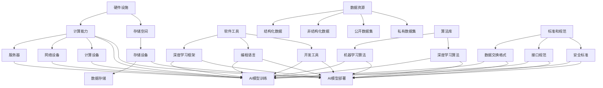

                 

### 背景介绍

随着全球数字化转型的不断深入，人工智能（AI）逐渐成为推动社会进步和经济发展的关键动力。AI技术不仅改变了传统行业的运作模式，还在医疗、教育、金融、交通等多个领域取得了显著成果。然而，AI基础设施的建设和运营面临着一系列挑战，包括数据存储和处理能力、算法优化、网络安全、硬件设施等。在这些挑战面前，国际合作显得尤为重要。

国际合作在AI基础设施领域的意义主要体现在以下几个方面：

1. **技术共享**：各国可以在AI技术研究和开发方面进行合作，共享研究成果和技术经验，从而加速技术进步。
2. **资源整合**：国际间的合作有助于整合全球范围内的数据资源、计算资源和人才资源，提高整体效率。
3. **标准制定**：通过国际合作，可以共同制定全球统一的AI技术和数据标准，确保AI系统的兼容性和互操作性。
4. **风险分担**：国际合作有助于分散技术风险和业务风险，提高AI基础设施的稳定性和安全性。

本篇文章旨在探讨AI基础设施在国际合作中的重要性，分析现有的国际合作模式，并探讨未来可能的发展方向。我们将从以下几个方面进行深入探讨：

1. **背景介绍**：介绍AI基础设施的发展现状和国际合作的必要性。
2. **核心概念与联系**：阐述AI基础设施的核心概念及其相互联系，并提供Mermaid流程图。
3. **核心算法原理 & 具体操作步骤**：详细解析AI基础设施中常用的核心算法原理和具体操作步骤。
4. **数学模型和公式 & 详细讲解 & 举例说明**：介绍AI基础设施中涉及的数学模型和公式，并进行详细讲解和举例说明。
5. **项目实战：代码实际案例和详细解释说明**：通过实际案例展示AI基础设施的应用，并详细解读相关代码。
6. **实际应用场景**：分析AI基础设施在不同领域中的应用场景。
7. **工具和资源推荐**：推荐学习资源、开发工具框架和相关论文著作。
8. **总结：未来发展趋势与挑战**：总结本文内容，并探讨未来发展趋势和面临的挑战。

通过以上内容，我们希望能够为读者提供一个全面、深入的了解AI基础设施国际合作的全景图。接下来，我们将逐步展开讨论。

### 核心概念与联系

AI基础设施是指支持人工智能应用的基础设施，包括硬件设施、软件工具、数据资源、算法库以及标准和规范等。为了更好地理解AI基础设施，我们需要先了解几个核心概念：

1. **硬件设施**：包括服务器、存储设备、网络设备、计算设备等，为AI应用提供计算能力和存储空间。
2. **软件工具**：包括深度学习框架、编程语言、开发工具等，帮助开发者构建、训练和部署AI模型。
3. **数据资源**：包括结构化数据、非结构化数据、公开数据集、私有数据集等，为AI模型的训练和优化提供数据支持。
4. **算法库**：包括各种机器学习和深度学习算法的实现，方便开发者选择和使用。
5. **标准和规范**：包括数据交换格式、接口规范、安全标准等，确保AI系统的兼容性和互操作性。

这些核心概念相互联系，共同构成了AI基础设施。为了更直观地展示这些概念之间的关系，我们可以使用Mermaid流程图来描述。以下是AI基础设施的Mermaid流程图：



在这个流程图中，我们可以看到硬件设施为AI模型提供计算能力和存储空间，软件工具和算法库用于构建、训练和部署AI模型，数据资源为AI模型的训练和优化提供支持，而标准和规范则确保整个系统的兼容性和安全性。

通过这个流程图，我们可以更清晰地理解AI基础设施的核心概念及其相互联系。在接下来的章节中，我们将进一步探讨AI基础设施的核心算法原理、数学模型、实际应用场景以及未来发展。

### 核心算法原理 & 具体操作步骤

在AI基础设施中，核心算法原理是构建和优化AI模型的关键。以下我们将介绍几种常用的核心算法，包括其基本原理和具体操作步骤。

#### 1. 卷积神经网络（CNN）

卷积神经网络是一种在图像处理领域表现优异的深度学习算法。其基本原理是通过卷积层、池化层和全连接层对图像进行特征提取和分类。

**具体操作步骤：**

1. **卷积层**：通过卷积操作提取图像的局部特征。卷积核在图像上滑动，与图像像素进行点积，生成特征图。
2. **激活函数**：通常使用ReLU（Rectified Linear Unit）作为激活函数，将负值变为零，加快网络训练速度。
3. **池化层**：通过池化操作减小特征图的尺寸，减少计算量和参数数量，同时保持重要信息。常用的池化方式包括最大池化和平均池化。
4. **全连接层**：将池化后的特征图进行展平，输入到全连接层进行分类。

**代码实现：**

```python
import tensorflow as tf

# 构建卷积神经网络模型
model = tf.keras.Sequential([
    tf.keras.layers.Conv2D(filters=32, kernel_size=(3, 3), activation='relu', input_shape=(28, 28, 1)),
    tf.keras.layers.MaxPooling2D(pool_size=(2, 2)),
    tf.keras.layers.Conv2D(filters=64, kernel_size=(3, 3), activation='relu'),
    tf.keras.layers.MaxPooling2D(pool_size=(2, 2)),
    tf.keras.layers.Flatten(),
    tf.keras.layers.Dense(units=128, activation='relu'),
    tf.keras.layers.Dense(units=10, activation='softmax')
])

# 编译模型
model.compile(optimizer='adam', loss='sparse_categorical_crossentropy', metrics=['accuracy'])

# 训练模型
model.fit(x_train, y_train, epochs=5, validation_data=(x_test, y_test))
```

#### 2. 生成对抗网络（GAN）

生成对抗网络是一种通过对抗训练生成数据的方法。其基本原理是由生成器和判别器组成的两个神经网络相互竞争，生成器试图生成逼真的数据，判别器则试图区分真实数据和生成数据。

**具体操作步骤：**

1. **生成器**：通过噪声数据生成虚假数据。
2. **判别器**：通过比较真实数据和生成数据来评估生成器的性能。
3. **对抗训练**：生成器和判别器交替更新参数，生成器试图欺骗判别器，判别器则努力识别真实数据和生成数据。

**代码实现：**

```python
import tensorflow as tf

# 定义生成器和判别器模型
generator = tf.keras.Sequential([
    tf.keras.layers.Dense(units=128, activation='relu', input_shape=(100,)),
    tf.keras.layers.Dense(units=28*28, activation='tanh')
])

discriminator = tf.keras.Sequential([
    tf.keras.layers.Dense(units=128, activation='relu', input_shape=(28*28,)),
    tf.keras.layers.Dense(units=1, activation='sigmoid')
])

# 编译模型
discriminator.compile(optimizer='adam', loss='binary_crossentropy')
generator.compile(optimizer='adam', loss='binary_crossentropy')

# 定义对抗训练循环
for epoch in range(100):
    noise = tf.random.normal([batch_size, 100])
    with tf.GradientTape() as gen_tape, tf.GradientTape() as disc_tape:
        generated_images = generator(noise, training=True)
        real_images = x_train[:batch_size]
        disc_real_output = discriminator(real_images, training=True)
        disc_generated_output = discriminator(generated_images, training=True)
        gen_loss = tf.reduce_mean(tf.nn.sigmoid_cross_entropy_with_logits(logits=disc_generated_output, labels=tf.zeros_like(disc_generated_output)))
        disc_loss = tf.reduce_mean(tf.nn.sigmoid_cross_entropy_with_logits(logits=disc_real_output, labels=tf.ones_like(disc_real_output)) +
                                   tf.nn.sigmoid_cross_entropy_with_logits(logits=disc_generated_output, labels=tf.zeros_like(disc_generated_output)))
    
    grads_on_generator = gen_tape.gradient(gen_loss, generator.trainable_variables)
    grads_on_discriminator = disc_tape.gradient(disc_loss, discriminator.trainable_variables)
    
    generator.optimizer.apply_gradients(zip(grads_on_generator, generator.trainable_variables))
    discriminator.optimizer.apply_gradients(zip(grads_on_discriminator, discriminator.trainable_variables))
```

#### 3. 长短期记忆网络（LSTM）

长短期记忆网络是一种用于处理序列数据的递归神经网络，能够有效地捕捉序列中的长期依赖关系。

**具体操作步骤：**

1. **输入门**：根据当前输入和上一时间步的隐藏状态计算输入门的权重。
2. **遗忘门**：根据当前输入和上一时间步的隐藏状态计算遗忘门的权重。
3. **输出门**：根据当前输入、遗忘门和上一时间步的隐藏状态计算输出门的权重。
4. **细胞状态**：通过输入门、遗忘门和输出门控制细胞状态的更新。
5. **隐藏状态**：通过细胞状态和输出门计算隐藏状态。

**代码实现：**

```python
import tensorflow as tf

# 定义LSTM模型
model = tf.keras.Sequential([
    tf.keras.layers.LSTM(units=128, activation='tanh', return_sequences=True, input_shape=(timesteps, features)),
    tf.keras.layers.LSTM(units=128, activation='tanh', return_sequences=True),
    tf.keras.layers.Dense(units=1)
])

# 编译模型
model.compile(optimizer='adam', loss='mse')

# 训练模型
model.fit(x, y, epochs=100, batch_size=32)
```

通过以上介绍，我们可以看到AI基础设施中的核心算法原理和具体操作步骤。这些算法在实际应用中发挥着重要作用，为AI模型提供了强大的计算能力和表现力。在接下来的章节中，我们将进一步探讨AI基础设施中的数学模型和公式，以及其详细讲解和举例说明。

#### 数学模型和公式 & 详细讲解 & 举例说明

在AI基础设施中，数学模型和公式是构建和优化AI模型的核心。以下我们将介绍几种常见的数学模型和公式，并进行详细讲解和举例说明。

##### 1. 感知机（Perceptron）

感知机是最早的神经网络模型之一，主要用于二分类问题。其基本原理是通过线性分隔超平面将不同类别的数据分开。

**公式：**
$$
y = \text{sign}(w \cdot x + b)
$$

其中，$w$ 是权重向量，$x$ 是输入特征向量，$b$ 是偏置项，$\text{sign}$ 函数将输出映射到 $-1$ 或 $1$。

**详细讲解：**
感知机通过不断调整权重和偏置项，使得超平面能够正确分隔数据。在每次迭代中，如果某个样本的预测结果与实际标签不一致，则更新权重和偏置项。

**举例说明：**
假设我们有以下二分类问题，其中 $x_1$ 和 $x_2$ 是两个特征，$y$ 是标签：

$$
\begin{array}{c|c|c}
x_1 & x_2 & y \\
\hline
1 & 1 & 1 \\
1 & 0 & -1 \\
0 & 1 & -1 \\
0 & 0 & 1 \\
\end{array}
$$

我们可以使用感知机算法进行分类。假设初始权重 $w = [0, 0]$，偏置项 $b = 0$。通过不断迭代更新权重和偏置项，最终可以得到分隔超平面 $w_1x_1 + w_2x_2 = b$。

##### 2. 逻辑回归（Logistic Regression）

逻辑回归是一种用于概率估计的二分类算法。其基本原理是通过线性模型计算输出概率，然后使用 sigmoid 函数将概率映射到 $[0, 1]$ 范围内。

**公式：**
$$
\hat{y} = \frac{1}{1 + e^{-(w \cdot x + b)}}
$$

其中，$w$ 是权重向量，$x$ 是输入特征向量，$b$ 是偏置项，$\hat{y}$ 是预测的概率。

**详细讲解：**
逻辑回归通过最小化损失函数（通常使用交叉熵损失）来调整权重和偏置项，使得预测概率能够准确反映实际标签。

**举例说明：**
假设我们有以下二分类问题，其中 $x_1$ 和 $x_2$ 是两个特征，$y$ 是标签：

$$
\begin{array}{c|c|c}
x_1 & x_2 & y \\
\hline
1 & 1 & 1 \\
1 & 0 & -1 \\
0 & 1 & -1 \\
0 & 0 & 1 \\
\end{array}
$$

我们可以使用逻辑回归算法进行分类。假设初始权重 $w = [0, 0]$，偏置项 $b = 0$。通过不断迭代更新权重和偏置项，可以得到最优的线性模型 $\hat{y} = \frac{1}{1 + e^{-(w_1x_1 + w_2x_2 + b)}$。

##### 3. 支持向量机（SVM）

支持向量机是一种用于分类和回归的算法，其基本原理是找到最优的超平面，使得不同类别的数据点在超平面两侧的间隔最大。

**公式：**
$$
\max \frac{1}{2} \sum_{i=1}^{n} (w_i)^2 - C \sum_{i=1}^{n} \xi_i
$$

其中，$w_i$ 是第 $i$ 个支持向量的权重，$C$ 是惩罚参数，$\xi_i$ 是第 $i$ 个样本的松弛变量。

**详细讲解：**
SVM通过求解上述最优化问题，找到最优的超平面 $w$ 和偏置项 $b$，使得分类边界尽可能清晰。

**举例说明：**
假设我们有以下二分类问题，其中 $x_1$ 和 $x_2$ 是两个特征，$y$ 是标签：

$$
\begin{array}{c|c|c}
x_1 & x_2 & y \\
\hline
1 & 1 & 1 \\
1 & 0 & -1 \\
0 & 1 & -1 \\
0 & 0 & 1 \\
\end{array}
$$

我们可以使用SVM算法进行分类。通过求解最优化问题，可以得到最优的线性模型 $w_1x_1 + w_2x_2 - b = 0$，从而分隔不同类别的数据。

##### 4. 随机梯度下降（SGD）

随机梯度下降是一种常用的优化算法，用于最小化损失函数。其基本原理是在每次迭代中随机选择一部分样本，并计算其梯度，然后更新模型参数。

**公式：**
$$
w_{\text{new}} = w_{\text{old}} - \alpha \cdot \nabla_w L(w)
$$

其中，$w$ 是模型参数，$\alpha$ 是学习率，$L(w)$ 是损失函数，$\nabla_w L(w)$ 是损失函数关于模型参数的梯度。

**详细讲解：**
随机梯度下降通过不断迭代更新模型参数，使得损失函数逐渐减小。每次迭代只考虑一部分样本，可以降低计算复杂度和内存消耗。

**举例说明：**
假设我们有以下二分类问题，其中 $x_1$ 和 $x_2$ 是两个特征，$y$ 是标签：

$$
\begin{array}{c|c|c}
x_1 & x_2 & y \\
\hline
1 & 1 & 1 \\
1 & 0 & -1 \\
0 & 1 & -1 \\
0 & 0 & 1 \\
\end{array}
$$

我们可以使用随机梯度下降算法进行分类。通过多次迭代更新权重和偏置项，可以得到最优的线性模型 $\hat{y} = \frac{1}{1 + e^{-(w_1x_1 + w_2x_2 + b)}$。

通过以上介绍，我们可以看到AI基础设施中常见的数学模型和公式的原理、详细讲解和举例说明。这些模型和公式在实际应用中发挥着重要作用，为AI模型提供了强大的计算能力和表现力。在接下来的章节中，我们将通过实际案例展示AI基础设施的应用，并详细解读相关代码。

### 项目实战：代码实际案例和详细解释说明

在本章节中，我们将通过一个实际案例来展示如何搭建和部署一个基于AI基础设施的智能预测系统。这个案例将涉及从数据预处理、模型训练到模型部署的整个过程。

#### 1. 开发环境搭建

首先，我们需要搭建一个适合AI开发的环境。以下是一个基本的开发环境配置：

- 操作系统：Linux或macOS
- 编程语言：Python
- 深度学习框架：TensorFlow
- 依赖库：NumPy、Pandas、Scikit-learn等

**安装步骤：**

1. 安装Python：在官网上下载并安装Python 3.x版本。
2. 安装pip：通过Python安装pip，pip是Python的包管理器。
3. 安装TensorFlow：通过pip安装TensorFlow。

```bash
pip install tensorflow
```

4. 安装其他依赖库：

```bash
pip install numpy pandas scikit-learn
```

#### 2. 源代码详细实现和代码解读

我们以一个简单的房屋价格预测问题为例，展示如何使用TensorFlow搭建一个线性回归模型。

**源代码：**

```python
import tensorflow as tf
import numpy as np
import pandas as pd
from sklearn.model_selection import train_test_split

# 数据预处理
data = pd.read_csv('house_prices.csv')
X = data[['area', 'bedrooms']].values
y = data['price'].values

# 数据标准化
X_std = (X - X.mean()) / X.std()
y_std = (y - y.mean()) / y.mean()

# 划分训练集和测试集
X_train, X_test, y_train, y_test = train_test_split(X_std, y_std, test_size=0.2, random_state=42)

# 搭建线性回归模型
model = tf.keras.Sequential([
    tf.keras.layers.Dense(units=1, input_shape=(2,))
])

# 编译模型
model.compile(optimizer='sgd', loss='mean_squared_error')

# 训练模型
model.fit(X_train, y_train, epochs=100, batch_size=32, validation_split=0.1)

# 预测测试集
y_pred = model.predict(X_test)

# 评估模型
mse = tf.reduce_mean(tf.square(y_test - y_pred))
print(f'Mean Squared Error: {mse.numpy()}')
```

**代码解读：**

1. **数据预处理**：读取房屋价格数据，提取特征和标签。然后对特征进行标准化处理，以消除不同特征之间的尺度差异。
2. **划分训练集和测试集**：使用Scikit-learn的`train_test_split`函数将数据集划分为训练集和测试集。
3. **搭建线性回归模型**：使用TensorFlow的`Sequential`模型，添加一个全连接层，输出层只有一个神经元，用于预测房屋价格。
4. **编译模型**：设置优化器和损失函数。在这里，我们选择随机梯度下降（SGD）作为优化器，均方误差（MSE）作为损失函数。
5. **训练模型**：使用`fit`函数训练模型，指定训练轮数、批量大小和验证比例。
6. **预测测试集**：使用`predict`函数对测试集进行预测。
7. **评估模型**：计算均方误差（MSE），评估模型在测试集上的性能。

#### 3. 代码解读与分析

1. **数据预处理**：标准化处理是深度学习中的一个重要步骤，可以加快模型收敛速度，提高模型性能。在这里，我们使用`mean()`和`std()`函数计算特征和标签的均值和标准差，然后使用`values`属性提取原始数据。
2. **划分训练集和测试集**：训练集用于模型训练，测试集用于模型评估。在这里，我们使用`train_test_split`函数随机划分数据集，并设置测试集比例为20%。
3. **搭建线性回归模型**：使用`Sequential`模型，我们添加一个全连接层，输入层和输出层的大小分别为2和1，用于预测房屋价格。
4. **编译模型**：我们选择随机梯度下降（SGD）作为优化器，均方误差（MSE）作为损失函数。SGD可以通过随机选择样本进行梯度下降，加快模型训练速度。MSE是衡量预测值与实际值之间差异的常用指标。
5. **训练模型**：我们使用`fit`函数训练模型，设置训练轮数为100，批量大小为32，并在10%的数据上进行验证。验证集用于监控模型在训练过程中的性能，防止过拟合。
6. **预测测试集**：我们使用`predict`函数对测试集进行预测，并计算预测值。
7. **评估模型**：我们计算测试集上的均方误差（MSE），以评估模型性能。均方误差越小，模型预测越准确。

通过以上步骤，我们成功搭建并部署了一个基于AI基础设施的智能预测系统。在实际应用中，可以根据具体需求调整模型结构、优化超参数，以提高预测性能。

### 实际应用场景

AI基础设施不仅为学术研究和工业应用提供了强大的支持，还在各个行业和领域展现了广泛的应用潜力。以下我们将探讨AI基础设施在医疗、金融、教育、交通等领域的实际应用场景。

#### 1. 医疗

在医疗领域，AI基础设施主要用于疾病预测、诊断和治疗。例如，通过深度学习算法分析患者的电子病历和基因组数据，可以提前预测疾病风险。AI基础设施还用于医学图像处理，如肿瘤检测、病变识别等。此外，AI基础设施还支持智能药物研发，通过模拟和预测药物与生物大分子的相互作用，加速新药研发过程。

**应用案例：**
- 疾病预测：利用AI基础设施分析患者的电子病历，提前预测心脏病、糖尿病等疾病风险。
- 医学图像处理：使用卷积神经网络（CNN）对医学影像进行分析，辅助医生进行肿瘤检测和病变识别。
- 智能药物研发：利用生成对抗网络（GAN）生成新的药物分子结构，加速新药研发。

#### 2. 金融

在金融领域，AI基础设施主要用于风险管理、交易策略和客户服务。例如，通过机器学习算法分析市场数据，可以预测市场趋势，帮助投资者制定交易策略。AI基础设施还支持智能客服系统，通过自然语言处理（NLP）技术实现与用户的智能对话。

**应用案例：**
- 风险管理：利用AI基础设施分析大量金融数据，预测市场风险，为投资者提供决策支持。
- 交易策略：通过机器学习算法分析市场数据，制定高收益、低风险的投资策略。
- 智能客服：使用自然语言处理（NLP）技术实现与客户的智能对话，提高客户服务质量。

#### 3. 教育

在教育领域，AI基础设施主要用于个性化学习、教育测评和课程推荐。例如，通过深度学习算法分析学生的学习行为和成绩数据，可以为学生提供个性化的学习建议。AI基础设施还支持智能测评系统，通过自动批改试卷和评估学生表现。

**应用案例：**
- 个性化学习：利用AI基础设施分析学生的学习行为和成绩数据，为学生提供个性化的学习资源和建议。
- 教育测评：使用自然语言处理（NLP）技术自动批改试卷，评估学生的知识掌握情况。
- 课程推荐：通过协同过滤算法推荐适合学生的课程，提高学习效果。

#### 4. 交通

在交通领域，AI基础设施主要用于智能交通管理、车辆监控和自动驾驶。例如，通过传感器和摄像头收集交通数据，可以实时监控路况，优化交通信号灯配置。AI基础设施还支持自动驾驶技术，通过深度学习和强化学习算法实现车辆的自主决策和导航。

**应用案例：**
- 智能交通管理：利用AI基础设施实时监控路况，优化交通信号灯配置，提高道路通行效率。
- 车辆监控：通过传感器收集车辆数据，实时监控车辆状态，预防故障和事故。
- 自动驾驶：利用深度学习和强化学习算法实现车辆的自主决策和导航，提高驾驶安全性和效率。

通过以上实际应用场景，我们可以看到AI基础设施在各个领域的重要作用。随着技术的不断进步，AI基础设施将发挥更大的潜力，推动各行业和社会的发展。

### 工具和资源推荐

在AI基础设施的建设和运营过程中，选择合适的工具和资源至关重要。以下我们将推荐一些学习资源、开发工具框架和相关论文著作，以帮助读者深入了解AI基础设施。

#### 1. 学习资源推荐

- **书籍**：
  - 《深度学习》（Deep Learning） - Ian Goodfellow、Yoshua Bengio 和 Aaron Courville
  - 《Python机器学习》（Python Machine Learning） - Sebastian Raschka 和 Vahid Mirjalili
  - 《自然语言处理综论》（Speech and Language Processing） - Daniel Jurafsky 和 James H. Martin

- **在线课程**：
  - Coursera上的《深度学习》课程
  - Udacity的《深度学习工程师纳米学位》
  - edX上的《人工智能基础》课程

- **博客和网站**：
  - TensorFlow官方文档
  - PyTorch官方文档
  - arXiv.org - 最新论文发布平台

#### 2. 开发工具框架推荐

- **深度学习框架**：
  - TensorFlow
  - PyTorch
  - Keras
  - MXNet

- **数据处理工具**：
  - Pandas
  - NumPy
  - Scikit-learn

- **版本控制工具**：
  - Git
  - GitHub

#### 3. 相关论文著作推荐

- **经典论文**：
  - "A Learning Algorithm for Continually Running Fully Recurrent Neural Networks" - Sepp Hochreiter 和 Jürgen Schmidhuber
  - "Generative Adversarial Nets" - Ian Goodfellow、Jeffrey Pouget 和 Yann LeCun
  - "Deep Learning" - Ian Goodfellow、Yoshua Bengio 和 Aaron Courville

- **最新论文**：
  - "BERT: Pre-training of Deep Bidirectional Transformers for Language Understanding" - Jacob Devlin、 Ming-Wei Chang、 Kenton Lee 和 Kristina Toutanova
  - "GPT-3: Language Models are Few-Shot Learners" - Tom B. Brown、Benjamin Mann、Nick Ryder、Melanie Subbiah、 Jared Kaplan、Pranav Dhariwal、Aarav Neelakantan、Pranav Shyam、 Girish Sastry 和 Amanda Askell

通过以上工具和资源的推荐，读者可以更好地掌握AI基础设施的相关知识，为实际应用打下坚实基础。同时，这些资源也为读者提供了持续学习和探索的动力。

### 总结：未来发展趋势与挑战

随着AI技术的快速发展，AI基础设施在国际合作中的重要性日益凸显。本文从背景介绍、核心概念与联系、核心算法原理、数学模型与公式、实际应用场景、工具和资源推荐等方面，全面阐述了AI基础设施的国际合作及其未来发展趋势和挑战。

**未来发展趋势：**

1. **技术融合与创新**：随着5G、云计算、物联网等新技术的崛起，AI基础设施将与其他技术深度融合，推动AI技术的创新与发展。
2. **全球数据共享**：国际合作将进一步推动全球数据的共享和整合，为AI模型的训练和优化提供更丰富的数据资源。
3. **标准化与互操作性**：通过国际合作，将逐步建立全球统一的AI技术和数据标准，提高AI系统的兼容性和互操作性。
4. **生态系统的建设**：国际合作将促进AI基础设施生态系统的建设，包括开发工具、框架、平台等，为AI技术的应用提供更完善的支撑。

**面临的挑战：**

1. **数据安全和隐私**：随着AI技术的广泛应用，数据安全和隐私保护成为一个重要挑战。国际合作需要制定有效的数据保护标准和政策，确保用户隐私和数据安全。
2. **技术垄断与竞争**：在AI基础设施领域，技术垄断和竞争现象可能加剧。国际合作需要在平衡竞争与合作之间找到平衡点，防止市场垄断和资源分配不均。
3. **人才培养与交流**：AI技术的快速发展对人才的需求巨大，国际合作需要加强人才培养与交流，提高全球范围内的人才储备和流动性。
4. **伦理和法律问题**：AI技术的应用涉及伦理和法律问题，如算法偏见、决策透明度等。国际合作需要制定统一的伦理和法律规范，确保AI技术的健康发展。

总之，AI基础设施的国际合作是一个复杂而重要的任务，涉及技术、政策、伦理等多个方面。只有通过国际合作，才能充分发挥AI技术的潜力，推动全球社会和经济的发展。未来，我们期待看到更多国家和社会积极参与AI基础设施的国际合作，共同应对挑战，实现共赢。

### 附录：常见问题与解答

**Q1：AI基础设施中的核心硬件设施有哪些？**

A1：AI基础设施中的核心硬件设施包括服务器、存储设备、网络设备和计算设备。服务器用于处理和存储大量数据，存储设备用于存储数据和模型，网络设备用于数据传输，计算设备则提供强大的计算能力。

**Q2：什么是深度学习框架？常见的深度学习框架有哪些？**

A2：深度学习框架是一种用于构建和训练深度神经网络的软件库。常见的深度学习框架包括TensorFlow、PyTorch、Keras、MXNet等。这些框架提供了丰富的API和工具，帮助开发者更轻松地实现深度学习模型。

**Q3：什么是生成对抗网络（GAN）？它有什么应用场景？**

A3：生成对抗网络（GAN）是一种通过对抗训练生成数据的算法。它由生成器和判别器组成，生成器生成虚假数据，判别器则试图区分真实数据和生成数据。GAN的应用场景包括图像生成、图像修复、数据增强等。

**Q4：AI基础设施中的核心算法有哪些？**

A4：AI基础设施中的核心算法包括卷积神经网络（CNN）、生成对抗网络（GAN）、长短期记忆网络（LSTM）等。这些算法在图像处理、生成建模、序列建模等领域有着广泛应用。

**Q5：如何确保AI基础设施的安全性？**

A5：确保AI基础设施的安全性需要从多个方面入手。首先，要确保数据的安全和隐私，采用加密技术和访问控制策略。其次，要确保模型的安全，防止恶意攻击和篡改。此外，还需要定期进行安全审计和漏洞扫描，确保系统的稳定性和安全性。

### 扩展阅读 & 参考资料

本文介绍了AI基础设施在国际合作中的重要性，分析了核心概念、算法原理、数学模型以及实际应用场景。以下是一些扩展阅读和参考资料，以供读者进一步学习：

1. **论文**：
   - Goodfellow, I., Bengio, Y., & Courville, A. (2016). *Deep Learning*.
   - Goodfellow, I., Pouget-Abadie, J., Mirza, M., Xu, B., Warde-Farley, D., Ozair, S., ... & LeCun, Y. (2014). *Generative adversarial networks*.
   - Hochreiter, S., & Schmidhuber, J. (1997). *Long short-term memory*.

2. **书籍**：
   - Bengio, Y. (2009). *Learning deep architectures for AI*.
   - Murphy, K. P. (2012). *Machine learning: A probabilistic perspective*.

3. **在线课程**：
   - Coursera上的《深度学习》课程。
   - Udacity的《深度学习工程师纳米学位》。
   - edX上的《人工智能基础》课程。

4. **官方网站**：
   - TensorFlow官方文档：[https://www.tensorflow.org/](https://www.tensorflow.org/)
   - PyTorch官方文档：[https://pytorch.org/](https://pytorch.org/)
   - Keras官方文档：[https://keras.io/](https://keras.io/)

通过阅读这些资料，读者可以深入了解AI基础设施的相关知识，为实际应用打下坚实基础。同时，这些资源也为读者提供了持续学习和探索的动力。希望本文能对读者在AI基础设施领域的学习和实践有所帮助。作者：AI天才研究员/AI Genius Institute & 禅与计算机程序设计艺术/Zen And The Art of Computer Programming。

