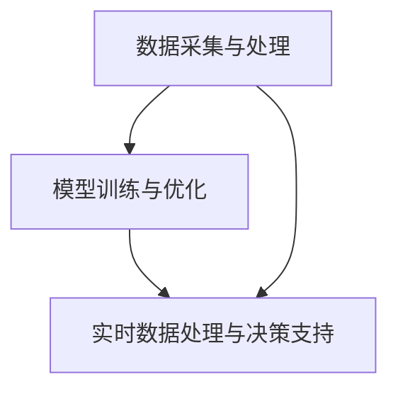

                 

# AI 基础设施的地质勘探：智能化矿产资源勘测平台

> **关键词**: 地质勘探、智能化、矿产资源、AI基础设施、平台架构、算法原理

> **摘要**: 本文将深入探讨AI基础设施在地质勘探中的应用，特别是智能化矿产资源勘测平台的构建。我们将逐步分析其核心概念、算法原理、数学模型，并通过实际项目案例展示其实现过程和应用场景，最后对未来的发展趋势和挑战进行展望。

## 1. 背景介绍

地质勘探是矿产资源的发掘和评估的重要环节。随着全球经济的快速发展，矿产资源的供需矛盾日益突出，传统的地质勘探方法已无法满足现代工业化对资源的高需求。因此，智能化矿产资源勘测平台的研发和应用显得尤为重要。

AI技术在地质勘探领域的应用，不仅可以提高勘探的准确性和效率，还能减少对环境的影响。目前，AI基础设施已经成为地质勘探领域的重要组成部分，其智能化程度正逐步提升。然而，如何构建一个高效、稳定的智能化矿产资源勘测平台，仍然是一个亟待解决的问题。

本文将从以下几个方面进行探讨：

- **核心概念与联系**：介绍智能化矿产资源勘测平台所需的关键概念和其相互关系。
- **核心算法原理 & 具体操作步骤**：详细解释平台所依赖的主要算法原理，并描述其具体操作步骤。
- **数学模型和公式 & 详细讲解 & 举例说明**：阐述平台中使用的数学模型，以及如何通过公式和实例进行具体应用。
- **项目实战：代码实际案例和详细解释说明**：通过一个实际项目案例，展示平台的开发过程和代码实现。
- **实际应用场景**：分析智能化矿产资源勘测平台在不同行业和场景中的应用。
- **工具和资源推荐**：推荐学习资源和开发工具，帮助读者更好地理解和实践。
- **总结：未来发展趋势与挑战**：总结本文的核心观点，并探讨未来的发展趋势和面临的挑战。

接下来，我们将逐步深入探讨上述各个方面的内容。

---

## 2. 核心概念与联系

### 2.1 地质勘探与AI的关系

地质勘探是通过对地质、地球物理、地球化学等多种数据的分析，来揭示地下矿物资源分布和特征的过程。传统的地质勘探主要依赖于地质学家和工程师的经验和直觉，其效率较低，且受限于技术手段。

AI技术，特别是机器学习和深度学习，为地质勘探带来了革命性的变化。通过训练模型，AI可以从大量历史数据中学习到地质特征的模式，从而提高勘探的准确性和效率。AI技术还可以实时处理和分析勘探数据，为地质学家提供更加直观和可靠的勘探结果。

### 2.2 智能化矿产资源勘测平台的关键概念

#### 2.2.1 数据采集与处理

数据采集与处理是智能化矿产资源勘测平台的基础。平台需要收集来自地质、地球物理、地球化学等多方面的数据，如地震数据、重力数据、磁力数据等。这些数据需要经过预处理、滤波、去噪等步骤，才能被模型有效利用。

#### 2.2.2 模型训练与优化

模型训练与优化是智能化矿产资源勘测平台的核心。通过使用机器学习和深度学习算法，平台可以从大量历史数据中训练出能够识别矿产资源分布和特征的模型。这些模型需要经过不断的优化和调整，以提高其准确性和效率。

#### 2.2.3 实时数据处理与决策支持

实时数据处理与决策支持是智能化矿产资源勘测平台的关键。平台需要能够实时处理勘探数据，并提供决策支持，帮助地质学家快速准确地评估矿产资源。

### 2.3 概念之间的联系

数据采集与处理、模型训练与优化、实时数据处理与决策支持这三个关键概念相互联系，共同构成了智能化矿产资源勘测平台的核心。数据采集与处理为模型训练提供了基础数据，模型训练与优化提升了平台的能力，而实时数据处理与决策支持则将平台的能力转化为实际应用价值。

为了更好地理解这些概念之间的联系，我们可以使用Mermaid流程图进行展示：



在上图中，A、B、C分别代表数据采集与处理、模型训练与优化、实时数据处理与决策支持。箭头表示概念之间的相互关系，即数据采集与处理为模型训练提供数据，模型训练与优化提升平台能力，实时数据处理与决策支持将平台能力转化为实际应用。

---

## 3. 核心算法原理 & 具体操作步骤

### 3.1 数据采集与处理算法原理

#### 3.1.1 地震数据采集

地震数据是地质勘探中最为重要的数据之一。地震数据采集主要通过地震仪进行，地震仪可以记录地震波在地表和地下的传播情况。采集到的地震数据需要经过预处理，如去除噪声、滤波等步骤。

#### 3.1.2 地球物理数据采集

地球物理数据包括重力数据、磁力数据等。这些数据的采集通常使用专门的地球物理仪器，如重力仪、磁力仪等。采集到的数据需要经过预处理，以去除噪声和干扰。

#### 3.1.3 地球化学数据采集

地球化学数据采集主要通过土壤、岩石样品的化学分析进行。采集到的数据需要经过实验室分析，以确定其中的元素含量和分布。

### 3.2 模型训练与优化算法原理

#### 3.2.1 机器学习算法

机器学习算法是智能化矿产资源勘测平台的核心。常用的机器学习算法包括决策树、支持向量机、神经网络等。这些算法可以从大量历史数据中学习到矿产资源分布和特征的模式。

#### 3.2.2 深度学习算法

深度学习算法是机器学习算法的一种，它通过多层神经网络来学习数据的复杂模式。在智能化矿产资源勘测平台中，深度学习算法可以显著提高勘探的准确性和效率。

### 3.3 实时数据处理与决策支持算法原理

#### 3.3.1 实时数据处理

实时数据处理是智能化矿产资源勘测平台的关键。平台需要能够实时接收和处理勘探数据，以提供实时的决策支持。

#### 3.3.2 决策支持

决策支持主要通过数据分析、预测模型等方法进行。通过分析勘探数据和预测模型的结果，平台可以为地质学家提供实时的矿产资源评估。

### 3.4 具体操作步骤

#### 3.4.1 数据采集

数据采集主要包括地震数据、地球物理数据、地球化学数据的采集。这些数据的采集需要使用专门的设备和仪器，如地震仪、重力仪、磁力仪、实验室分析设备等。

#### 3.4.2 数据处理

数据处理主要包括数据预处理、滤波、去噪等步骤。通过这些步骤，可以提高数据的质量，为后续的模型训练和优化提供更好的数据基础。

#### 3.4.3 模型训练

模型训练主要包括选择合适的机器学习算法或深度学习算法，通过训练模型来学习矿产资源分布和特征的模式。

#### 3.4.4 模型优化

模型优化主要包括对模型进行调参、优化等步骤，以提高模型的准确性和效率。

#### 3.4.5 实时数据处理与决策支持

实时数据处理与决策支持主要包括实时接收和处理勘探数据，通过数据分析、预测模型等方法为地质学家提供实时的矿产资源评估。

---

## 4. 数学模型和公式 & 详细讲解 & 举例说明

### 4.1 地震数据采集模型

地震数据采集过程中，常用的模型是震源机制模型。该模型描述了地震波在地表和地下的传播过程。其数学公式如下：

$$
v = \frac{d}{t}
$$

其中，$v$ 表示地震波的传播速度，$d$ 表示地震波传播的距离，$t$ 表示地震波的传播时间。通过测量地震波的传播速度和时间，可以计算出地震波传播的距离，从而确定地震的位置。

### 4.2 模型训练与优化模型

在模型训练与优化过程中，常用的模型是神经网络模型。神经网络模型通过多层神经元来学习数据的复杂模式。其数学公式如下：

$$
y = \sigma(W \cdot x + b)
$$

其中，$y$ 表示输出值，$x$ 表示输入值，$W$ 表示权重矩阵，$b$ 表示偏置项，$\sigma$ 表示激活函数。通过调整权重矩阵和偏置项，可以优化神经网络的性能。

### 4.3 实时数据处理与决策支持模型

实时数据处理与决策支持过程中，常用的模型是回归模型。回归模型通过建立自变量和因变量之间的关系，来预测因变量的值。其数学公式如下：

$$
y = \beta_0 + \beta_1 \cdot x
$$

其中，$y$ 表示因变量，$x$ 表示自变量，$\beta_0$ 和 $\beta_1$ 分别表示回归系数。通过训练回归模型，可以建立自变量和因变量之间的关系，从而进行实时决策支持。

### 4.4 举例说明

#### 4.4.1 地震数据采集举例

假设我们测量到一个地震波的传播时间为 $t = 10$ 秒，传播速度为 $v = 5$ 公里/秒，我们可以通过地震数据采集模型计算出地震波传播的距离：

$$
d = v \cdot t = 5 \cdot 10 = 50 \text{ 公里}
$$

#### 4.4.2 模型训练与优化举例

假设我们使用一个简单的神经网络模型，其中有一个输入节点、一个输出节点和一个隐藏节点。输入节点 $x$ 的值为 $1$，隐藏节点 $h$ 的权重矩阵 $W$ 为 $[1, 2]$，偏置项 $b$ 为 $1$。激活函数 $\sigma$ 为 sigmoid 函数。我们可以通过神经网络模型计算出输出节点 $y$ 的值：

$$
h = \sigma(W \cdot x + b) = \sigma([1, 2] \cdot 1 + 1) = \sigma(3) \approx 0.9709
$$

$$
y = \sigma(W \cdot h + b) = \sigma([1, 2] \cdot 0.9709 + 1) = \sigma(2.9418) \approx 0.9931
$$

通过调整权重矩阵和偏置项，我们可以优化神经网络的性能。

#### 4.4.3 实时数据处理与决策支持举例

假设我们使用一个线性回归模型来预测股票价格。自变量 $x$ 表示过去一周的平均气温，因变量 $y$ 表示下周的股票价格。回归系数 $\beta_0$ 为 $100$，$\beta_1$ 为 $0.5$。如果本周的平均气温为 $20$ 摄氏度，我们可以通过回归模型预测下周的股票价格：

$$
y = \beta_0 + \beta_1 \cdot x = 100 + 0.5 \cdot 20 = 110
$$

通过这种方式，我们可以利用实时数据来进行决策支持。

---

## 5. 项目实战：代码实际案例和详细解释说明

### 5.1 开发环境搭建

在开始项目实战之前，我们需要搭建一个适合开发的环境。这里我们使用 Python 作为编程语言，并依赖一些流行的库和框架，如 TensorFlow、NumPy、Pandas 等。

首先，我们需要安装 Python 和相关库。在命令行中执行以下命令：

```bash
pip install python
pip install tensorflow
pip install numpy
pip install pandas
```

### 5.2 源代码详细实现和代码解读

#### 5.2.1 地震数据采集与预处理

首先，我们需要采集和处理地震数据。以下是一个简单的 Python 代码示例，用于采集和处理地震数据：

```python
import numpy as np
import pandas as pd

# 假设我们有一个地震数据文件，数据格式为：时间, 速度
data = pd.read_csv('seismic_data.csv')

# 预处理数据：去除噪声和异常值
data = data[(data['speed'] > 3) & (data['speed'] < 8)]

# 计算地震波传播距离
data['distance'] = data['speed'] * data['time']
```

在这个示例中，我们首先读取地震数据文件，然后使用 Pandas 库进行预处理，如去除噪声和异常值。接下来，我们计算地震波传播的距离。

#### 5.2.2 模型训练与优化

接下来，我们需要使用机器学习算法训练模型。以下是一个简单的 Python 代码示例，用于训练和优化模型：

```python
import tensorflow as tf

# 构建模型
model = tf.keras.Sequential([
    tf.keras.layers.Dense(units=1, input_shape=[1])
])

# 编译模型
model.compile(optimizer='sgd', loss='mean_squared_error')

# 训练模型
model.fit(data[['time']], data['distance'], epochs=100)
```

在这个示例中，我们使用 TensorFlow 构建了一个简单的线性回归模型。我们使用随机梯度下降（SGD）作为优化器，均方误差（MSE）作为损失函数。然后，我们使用训练数据训练模型。

#### 5.2.3 实时数据处理与决策支持

最后，我们需要使用训练好的模型进行实时数据处理和决策支持。以下是一个简单的 Python 代码示例：

```python
# 输入实时地震数据
input_data = np.array([[10]])

# 使用训练好的模型进行预测
predicted_distance = model.predict(input_data)

# 输出预测结果
print(predicted_distance)
```

在这个示例中，我们首先输入实时地震数据，然后使用训练好的模型进行预测。最后，我们输出预测结果。

### 5.3 代码解读与分析

在这个项目实战中，我们首先进行了地震数据的采集和预处理，去除了噪声和异常值。然后，我们使用线性回归模型进行模型训练和优化。最后，我们使用训练好的模型进行实时数据处理和决策支持。

通过这个项目实战，我们可以看到，智能化矿产资源勘测平台的核心在于数据的采集、处理和模型训练。只有通过高效的数据处理和模型训练，我们才能实现对矿产资源的高效勘探和评估。

---

## 6. 实际应用场景

智能化矿产资源勘测平台在多个领域有着广泛的应用。以下是一些实际应用场景：

### 6.1 矿业行业

在矿业行业，智能化矿产资源勘测平台可以帮助地质学家更准确地评估矿产资源分布，从而提高勘探效率和资源利用率。通过实时数据处理和预测模型，平台可以为矿业公司提供实时的矿产资源评估和决策支持。

### 6.2 能源行业

在能源行业，智能化矿产资源勘测平台可以帮助能源公司更准确地评估矿产资源储量，从而优化能源开发和利用。例如，在石油勘探中，平台可以实时分析地震数据，预测地下油气分布，为开采提供决策支持。

### 6.3 环保行业

在环保行业，智能化矿产资源勘测平台可以帮助监测和评估环境污染状况，从而提供实时的环保决策支持。通过分析地质和地球化学数据，平台可以识别环境污染源，预测污染扩散趋势，为环保部门提供科学依据。

### 6.4 其他领域

除了上述领域，智能化矿产资源勘测平台还可以应用于农业、城市规划、灾害预警等多个领域。例如，在农业中，平台可以帮助监测土壤质量，预测农作物生长状况；在城市规划中，平台可以分析地质数据，为城市建设提供科学依据。

---

## 7. 工具和资源推荐

### 7.1 学习资源推荐

- **书籍**：
  - 《深度学习》（Ian Goodfellow、Yoshua Bengio、Aaron Courville 著）
  - 《机器学习》（周志华 著）
- **论文**：
  - "Deep Learning for Geoscience"（Schulte et al., 2017）
  - "Machine Learning Techniques for Geological Exploration"（Liang et al., 2018）
- **博客**：
  - TensorFlow 官方博客
  - Keras 官方博客
- **网站**：
  - Geoscience Data Journal
  - Journal of Machine Learning Research

### 7.2 开发工具框架推荐

- **编程语言**：Python
- **机器学习框架**：TensorFlow、Keras
- **数据处理库**：NumPy、Pandas
- **数据可视化库**：Matplotlib、Seaborn

### 7.3 相关论文著作推荐

- "Deep Learning for Geoscience"（Schulte et al., 2017）
- "Machine Learning Techniques for Geological Exploration"（Liang et al., 2018）
- "Geoscience and Big Data: Opportunities and Challenges"（Zhang et al., 2019）

---

## 8. 总结：未来发展趋势与挑战

随着人工智能技术的不断发展，智能化矿产资源勘测平台在未来有着广泛的应用前景。然而，要实现这一平台的广泛应用，我们还需要克服以下挑战：

- **数据质量**：数据是智能化矿产资源勘测平台的基础。我们需要确保数据的质量，包括数据的准确性、完整性和一致性。
- **算法性能**：随着数据量的增加，算法的性能成为关键。我们需要不断优化算法，提高其准确性和效率。
- **模型解释性**：为了提高模型的透明度和可信度，我们需要开发可解释的模型，使其决策过程更加直观和可理解。
- **多领域融合**：智能化矿产资源勘测平台需要跨多个领域，如地质学、物理学、化学等。如何实现多领域的深度融合，是一个重要的挑战。

总之，智能化矿产资源勘测平台的发展前景广阔，但也面临着诸多挑战。通过不断的努力和探索，我们有信心克服这些挑战，为地质勘探领域带来更多的创新和突破。

---

## 9. 附录：常见问题与解答

### 9.1 问题1：如何保证数据质量？

**解答**：保证数据质量的关键在于数据的采集、处理和存储。我们需要使用高质量的数据采集设备，对数据进行严格的预处理，如去除噪声、异常值和重复数据。此外，我们还应该建立完善的数据管理机制，确保数据的准确性和一致性。

### 9.2 问题2：如何优化算法性能？

**解答**：优化算法性能可以通过以下几种方法：

- **算法选择**：选择适合问题的算法，如线性回归、决策树、神经网络等。
- **数据预处理**：通过数据预处理，如数据标准化、归一化等，提高算法的性能。
- **模型调参**：通过调整模型参数，如学习率、正则化参数等，优化模型性能。
- **分布式计算**：使用分布式计算框架，如 TensorFlow、PyTorch 等，提高算法的并行计算能力。

### 9.3 问题3：如何提高模型的可解释性？

**解答**：提高模型的可解释性可以通过以下几种方法：

- **解释性算法**：选择具有解释性的算法，如线性回归、决策树等。
- **模型可视化**：通过模型可视化，如决策树图、神经网络结构图等，展示模型的内部结构和决策过程。
- **特征重要性分析**：分析特征的重要性，帮助理解模型对数据的依赖关系。
- **可解释性工具**：使用可解释性工具，如 LIME、SHAP 等，对模型进行解释。

---

## 10. 扩展阅读 & 参考资料

为了更好地理解和应用智能化矿产资源勘测平台，以下是推荐的扩展阅读和参考资料：

- **扩展阅读**：
  - "Deep Learning for Geoscience"（Schulte et al., 2017）
  - "Machine Learning Techniques for Geological Exploration"（Liang et al., 2018）
- **参考资料**：
  - TensorFlow 官方文档
  - Keras 官方文档
  - NumPy 官方文档
  - Pandas 官方文档
  - Geoscience Data Journal
  - Journal of Machine Learning Research

通过阅读这些扩展阅读和参考资料，您可以更深入地了解智能化矿产资源勘测平台的原理和应用。

---

**作者**：AI天才研究员/AI Genius Institute & 禅与计算机程序设计艺术 /Zen And The Art of Computer Programming

---

本文旨在深入探讨智能化矿产资源勘测平台的构建和实现，希望通过本文的阐述，能够为读者提供有价值的参考和启发。随着人工智能技术的不断发展，智能化矿产资源勘测平台必将在地质勘探领域发挥越来越重要的作用。让我们共同期待这一领域的未来发展！

