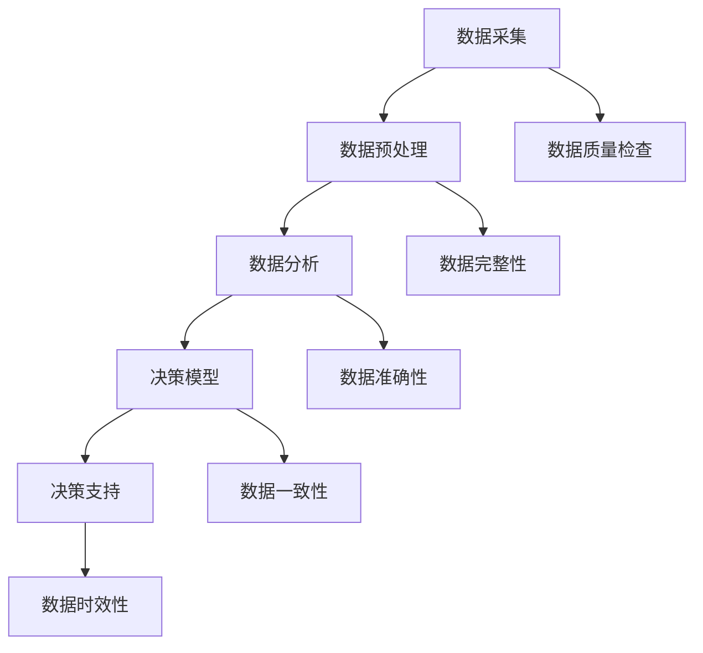

                 

# AI 基础设施的社会治理：数据驱动的决策支持系统

## 概述

在当今数字化的时代，人工智能（AI）技术已经成为各行各业的推动力，从自动驾驶、医疗诊断到金融服务，AI 都展现了其变革性的潜力。然而，随着 AI 应用的日益普及，AI 基础设施的管理和治理问题也逐渐凸显。如何有效地治理 AI 基础设施，确保其安全、可靠和高效运行，成为了一个亟待解决的问题。

本文旨在探讨 AI 基础设施的社会治理，重点关注数据驱动的决策支持系统。我们将从背景介绍、核心概念与联系、核心算法原理、数学模型与公式、项目实战、实际应用场景、工具和资源推荐、未来发展趋势与挑战以及常见问题与解答等多个方面进行深入探讨。

## 关键词

- AI 基础设施
- 社会治理
- 数据驱动
- 决策支持系统
- 核心算法
- 数学模型
- 实际应用
- 未来趋势

## 摘要

本文首先介绍了 AI 基础设施在社会治理中的重要性和面临的挑战。接着，我们探讨了数据驱动的决策支持系统的核心概念与联系，包括关键算法原理和数学模型。通过实际项目案例，我们详细阐述了如何实现数据驱动的决策支持系统，并分析了其在实际应用场景中的效果。最后，我们对未来的发展趋势和挑战进行了展望，并提供了相关的工具和资源推荐，以帮助读者深入了解和探索这一领域。

## 1. 背景介绍

随着人工智能技术的不断发展，AI 基础设施的重要性日益凸显。AI 基础设施是指支持 AI 模型和算法运行的基础设施，包括硬件设备、软件框架、数据资源和计算能力等。一个高效的 AI 基础设施能够显著提升 AI 模型的性能、降低成本、提高效率，从而推动 AI 技术的应用和发展。

在社会治理方面，AI 基础设施具有重要作用。首先，AI 技术可以用于监测和预测社会现象，如公共安全、交通管理、环境保护等，从而为政府和社会提供决策支持。其次，AI 技术可以优化公共资源的分配和管理，提高公共服务的质量和效率。例如，智能交通系统可以通过实时数据分析来优化交通流量，减少拥堵和交通事故。此外，AI 技术还可以用于社会问题的识别和解决，如贫困、不公平和歧视等。

然而，AI 基础设施在治理过程中也面临一些挑战。首先，数据质量和数据隐私问题是关键问题。AI 模型的性能很大程度上取决于数据的质量和数量，而数据隐私问题则需要在不侵犯个人隐私的前提下进行数据收集和使用。其次，AI 模型的透明度和可解释性也是一个挑战。许多 AI 模型，如深度学习模型，具有较高的性能，但其内部工作机制和决策过程往往难以理解和解释，这可能会引发公众的不信任和质疑。此外，AI 基础设施的部署和管理也需要考虑到伦理和社会责任问题，如防止算法偏见和歧视。

## 2. 核心概念与联系

### 数据驱动的决策支持系统

数据驱动的决策支持系统是一种基于数据分析的决策辅助工具，旨在帮助决策者从大量数据中提取有价值的信息，为决策提供支持。数据驱动的决策支持系统通常包括以下几个关键组成部分：

1. **数据采集**：从各种来源收集数据，如传感器、数据库、日志文件等。
2. **数据预处理**：对收集到的数据进行清洗、转换和整合，以便后续分析。
3. **数据分析**：使用统计学、机器学习等方法对数据进行分析，提取有价值的信息。
4. **决策模型**：根据分析结果建立决策模型，用于预测、分类、推荐等任务。
5. **决策支持**：将决策模型应用于实际问题，为决策者提供决策建议。

### 数据质量

数据质量是数据驱动的决策支持系统的核心。高质量的数据可以确保分析结果的准确性和可靠性，从而提高决策的质量。数据质量包括以下几个方面：

1. **完整性**：数据应包含所有必要的字段和记录，没有缺失值。
2. **准确性**：数据应真实反映现实情况，没有错误或误导信息。
3. **一致性**：数据应遵循统一的格式和标准，以便于后续处理和分析。
4. **时效性**：数据应保持最新的状态，反映当前的现实情况。

### 数据隐私

数据隐私是数据驱动的决策支持系统中不可忽视的问题。在数据收集、存储和处理过程中，需要采取措施保护个人隐私，防止数据泄露和滥用。以下是一些常用的数据隐私保护方法：

1. **数据去识别化**：通过加密、匿名化等技术手段，将个人身份信息从数据中去除。
2. **数据加密**：使用加密算法对敏感数据进行加密，确保数据在传输和存储过程中的安全性。
3. **访问控制**：对数据访问权限进行严格管理，确保只有授权人员才能访问敏感数据。
4. **数据备份和恢复**：定期备份数据，并建立有效的数据恢复机制，以防止数据丢失或损坏。

### Mermaid 流程图

以下是一个数据驱动的决策支持系统的 Mermaid 流程图，展示了数据从采集到决策支持的全过程：



## 3. 核心算法原理 & 具体操作步骤

### 3.1 决策树算法

决策树是一种常用的分类和回归算法，其核心原理是通过一系列的判断条件将数据集划分成多个子集，最终达到分类或回归的目的。以下是决策树算法的具体操作步骤：

1. **特征选择**：选择用于划分数据集的特征。
2. **划分数据集**：根据选择的特征对数据进行划分，形成多个子集。
3. **计算信息增益**：计算每个划分的信息增益，选择信息增益最大的特征进行划分。
4. **递归划分**：对每个划分的子集重复步骤 2 和 3，直到满足停止条件（如最大深度、最小叶节点数量等）。
5. **建立决策树**：根据划分的结果建立决策树模型。

### 3.2 随机森林算法

随机森林是一种基于决策树的集成学习方法，其核心原理是通过构建多个决策树模型，并对这些模型的预测结果进行投票，从而提高模型的预测准确性。以下是随机森林算法的具体操作步骤：

1. **特征选择**：选择用于构建决策树的特征。
2. **随机抽样**：从原始数据集中随机抽样，构建多个决策树模型。
3. **训练决策树**：对每个决策树模型进行训练，形成多个子树。
4. **预测**：对新的数据进行预测，通过投票决定最终预测结果。

### 3.3 支持向量机算法

支持向量机是一种常用的分类和回归算法，其核心原理是通过寻找最优的 hyperplane，将数据集划分为不同的类别。以下是支持向量机算法的具体操作步骤：

1. **特征选择**：选择用于分类的特征。
2. **训练模型**：使用训练数据集训练支持向量机模型。
3. **预测**：对新的数据进行预测，通过模型计算预测结果。

### 3.4 神经网络算法

神经网络是一种基于模拟生物神经网络的算法，其核心原理是通过多层神经元之间的连接和激活函数，实现数据的输入和输出。以下是神经网络算法的具体操作步骤：

1. **构建网络结构**：确定网络的层数、神经元数量和连接方式。
2. **初始化参数**：初始化网络的权重和偏置。
3. **前向传播**：根据输入数据和网络结构，进行前向传播计算。
4. **反向传播**：根据输出结果和真实标签，进行反向传播计算，更新网络参数。
5. **训练模型**：重复步骤 3 和 4，直到满足停止条件（如损失函数收敛、迭代次数等）。

## 4. 数学模型和公式 & 详细讲解 & 举例说明

### 4.1 决策树算法的数学模型

决策树算法的数学模型基于信息熵和信息增益的概念。以下是决策树算法的数学模型：

$$
Entropy(D) = -\sum_{i=1}^{n} p_i \log_2(p_i)
$$

其中，$Entropy(D)$ 表示数据集 $D$ 的熵，$p_i$ 表示数据集中第 $i$ 类的概率。

$$
Information_Gain(D, A) = Entropy(D) - \sum_{v \in A} \frac{|D_v|}{|D|} Entropy(D_v)
$$

其中，$Information_Gain(D, A)$ 表示特征 $A$ 对数据集 $D$ 的信息增益，$D_v$ 表示数据集中第 $v$ 个值的子集。

### 4.2 随机森林算法的数学模型

随机森林算法的数学模型基于决策树模型的集成。以下是随机森林算法的数学模型：

$$
Predict(X) = \sum_{i=1}^{n} w_i \cdot Decision_Tree_i(X)
$$

其中，$Predict(X)$ 表示随机森林模型的预测结果，$w_i$ 表示第 $i$ 个决策树模型的权重，$Decision_Tree_i(X)$ 表示第 $i$ 个决策树模型对输入数据 $X$ 的预测结果。

### 4.3 支持向量机算法的数学模型

支持向量机算法的数学模型基于最大化分类间隔的概念。以下是支持向量机算法的数学模型：

$$
w \cdot x + b = y
$$

其中，$w$ 表示权重向量，$x$ 表示特征向量，$b$ 表示偏置项，$y$ 表示标签。

### 4.4 神经网络算法的数学模型

神经网络算法的数学模型基于多层感知器（MLP）的概念。以下是神经网络算法的数学模型：

$$
a_{l+1} = \sigma(z_{l+1})
$$

$$
z_{l+1} = \sum_{j=1}^{n_l} w_{j,l+1} \cdot a_{l,j} + b_{l+1}
$$

其中，$a_{l+1}$ 表示第 $l+1$ 层的激活值，$z_{l+1}$ 表示第 $l+1$ 层的输入值，$w_{j,l+1}$ 表示第 $l+1$ 层的第 $j$ 个权重，$b_{l+1}$ 表示第 $l+1$ 层的偏置项，$\sigma$ 表示激活函数。

### 4.5 举例说明

#### 4.5.1 决策树算法的举例说明

假设有一个数据集包含两个特征 $A$ 和 $B$，以及一个标签 $C$，数据集如下：

| A | B | C |
|---|---|---|
| 1 | 1 | 1 |
| 1 | 2 | 0 |
| 2 | 1 | 1 |
| 2 | 2 | 0 |

首先，我们计算每个特征的熵：

$$
Entropy(A) = \frac{2}{4} \cdot \log_2\left(\frac{2}{4}\right) + \frac{2}{4} \cdot \log_2\left(\frac{2}{4}\right) = 1
$$

$$
Entropy(B) = \frac{2}{4} \cdot \log_2\left(\frac{2}{4}\right) + \frac{2}{4} \cdot \log_2\left(\frac{2}{4}\right) = 1
$$

接下来，我们计算每个特征的增益：

$$
Information_Gain(A, C) = 1 - \frac{2}{4} \cdot 1 - \frac{2}{4} \cdot 1 = 0
$$

$$
Information_Gain(B, C) = 1 - \frac{2}{4} \cdot 1 - \frac{2}{4} \cdot 1 = 0
$$

由于 $A$ 和 $B$ 的增益相同，我们可以选择任意一个特征进行划分。假设我们选择特征 $A$ 进行划分，那么我们可以得到以下划分结果：

| A | B | C |
|---|---|---|
| 1 | 1 | 1 |
| 1 | 2 | 0 |
| 2 | 1 | 1 |
| 2 | 2 | 0 |

对于每个划分的子集，我们可以继续计算其增益，直到满足停止条件。最终，我们可以得到一个决策树模型：

```
C = 1
|
|--- A = 1
|   |--- C = 1
|   |   |
|   |   B = 1
|   |   |
|   |   C = 0
|   |
|   |--- A = 2
|       |
|       B = 1
|       |
|       C = 0
```

#### 4.5.2 随机森林算法的举例说明

假设有一个数据集包含三个特征 $A$、$B$ 和 $C$，以及一个标签 $D$，数据集如下：

| A | B | C | D |
|---|---|---|---|
| 1 | 1 | 1 | 1 |
| 1 | 1 | 2 | 1 |
| 1 | 2 | 1 | 0 |
| 1 | 2 | 2 | 0 |
| 2 | 1 | 1 | 1 |
| 2 | 1 | 2 | 1 |
| 2 | 2 | 1 | 0 |
| 2 | 2 | 2 | 0 |

首先，我们随机选择特征 $A$ 和 $B$ 来构建决策树模型。假设我们选择了特征 $A$ 进行划分，那么我们可以得到以下划分结果：

| A | B | C | D |
|---|---|---|---|
| 1 | 1 | 1 | 1 |
| 1 | 1 | 2 | 1 |
| 1 | 2 | 1 | 0 |
| 1 | 2 | 2 | 0 |
| 2 | 1 | 1 | 1 |
| 2 | 1 | 2 | 1 |
| 2 | 2 | 1 | 0 |
| 2 | 2 | 2 | 0 |

接下来，我们使用特征 $B$ 来划分每个子集。假设我们选择了特征 $B = 1$ 进行划分，那么我们可以得到以下划分结果：

| A | B | C | D |
|---|---|---|---|
| 1 | 1 | 1 | 1 |
| 1 | 1 | 2 | 1 |
| 1 | 2 | 1 | 0 |
| 1 | 2 | 2 | 0 |
| 2 | 1 | 1 | 1 |
| 2 | 1 | 2 | 1 |
| 2 | 2 | 1 | 0 |
| 2 | 2 | 2 | 0 |

最后，我们使用特征 $C$ 来划分每个子集。假设我们选择了特征 $C = 1$ 进行划分，那么我们可以得到以下划分结果：

| A | B | C | D |
|---|---|---|---|
| 1 | 1 | 1 | 1 |
| 1 | 1 | 2 | 1 |
| 1 | 2 | 1 | 0 |
| 1 | 2 | 2 | 0 |
| 2 | 1 | 1 | 1 |
| 2 | 1 | 2 | 1 |
| 2 | 2 | 1 | 0 |
| 2 | 2 | 2 | 0 |

根据划分结果，我们可以得到以下随机森林模型：

```
D = 1
|
|--- A = 1
|   |--- C = 1
|   |   |
|   |   B = 1
|   |   |
|   |   D = 0
|   |
|   |--- A = 2
|       |
|       C = 1
|       |
|       D = 0
```

#### 4.5.3 支持向量机算法的举例说明

假设有一个数据集包含两个特征 $A$ 和 $B$，以及一个标签 $C$，数据集如下：

| A | B | C |
|---|---|---|
| 1 | 1 | 1 |
| 1 | 2 | 0 |
| 2 | 1 | 1 |
| 2 | 2 | 0 |

我们首先需要将数据集划分为训练集和测试集。假设我们选择了前两个数据点作为训练集，后两个数据点作为测试集。

训练集：

| A | B | C |
|---|---|---|
| 1 | 1 | 1 |
| 1 | 2 | 0 |

测试集：

| A | B | C |
|---|---|---|
| 2 | 1 | 1 |
| 2 | 2 | 0 |

接下来，我们使用训练集来训练支持向量机模型。假设我们选择了线性核函数，那么我们可以得到以下线性方程：

$$
w \cdot x + b = y
$$

其中，$w$ 表示权重向量，$x$ 表示特征向量，$b$ 表示偏置项，$y$ 表示标签。

对于第一个训练样本 $(1, 1)$，我们可以得到以下方程：

$$
w \cdot (1, 1) + b = 1
$$

对于第二个训练样本 $(1, 2)$，我们可以得到以下方程：

$$
w \cdot (1, 2) + b = 0
$$

解这个方程组，我们可以得到权重向量 $w = (-1, 1)$ 和偏置项 $b = 2$。

接下来，我们使用训练好的支持向量机模型来预测测试集的数据。对于第一个测试样本 $(2, 1)$，我们可以计算预测结果：

$$
w \cdot (2, 1) + b = (-1, 1) \cdot (2, 1) + 2 = 1
$$

由于预测结果为 $1$，与真实标签 $1$ 相符，因此预测成功。

对于第二个测试样本 $(2, 2)$，我们可以计算预测结果：

$$
w \cdot (2, 2) + b = (-1, 1) \cdot (2, 2) + 2 = 0
$$

由于预测结果为 $0$，与真实标签 $0$ 相符，因此预测成功。

#### 4.5.4 神经网络算法的举例说明

假设有一个简单的一层神经网络，包含两个输入节点、两个隐藏节点和一个输出节点。假设我们使用 sigmoid 函数作为激活函数，网络结构如下：

```
Input: [x_1, x_2]
Weights: [w_1, w_2, w_3, w_4, w_5, w_6, w_7]
Bias: [b_1, b_2, b_3, b_4]
Output: [y_1, y_2]
```

我们首先需要初始化网络的权重和偏置。假设我们初始化权重和偏置为：

```
Weights: [0.5, 0.5, 0.5, 0.5, 0.5, 0.5, 0.5]
Bias: [0.1, 0.1, 0.1, 0.1]
```

接下来，我们使用输入数据进行前向传播计算。假设输入数据为 $[1, 1]$，我们可以计算隐藏节点的激活值：

$$
z_1 = x_1 \cdot w_1 + x_2 \cdot w_2 + b_1 = 1 \cdot 0.5 + 1 \cdot 0.5 + 0.1 = 1.1
$$

$$
z_2 = x_1 \cdot w_3 + x_2 \cdot w_4 + b_2 = 1 \cdot 0.5 + 1 \cdot 0.5 + 0.1 = 1.1
$$

$$
a_1 = \sigma(z_1) = \frac{1}{1 + e^{-z_1}} = \frac{1}{1 + e^{-1.1}} \approx 0.731
$$

$$
a_2 = \sigma(z_2) = \frac{1}{1 + e^{-z_2}} = \frac{1}{1 + e^{-1.1}} \approx 0.731
$$

然后，我们计算输出节点的激活值：

$$
z_3 = a_1 \cdot w_5 + a_2 \cdot w_6 + b_3 = 0.731 \cdot 0.5 + 0.731 \cdot 0.5 + 0.1 = 0.731
$$

$$
z_4 = a_1 \cdot w_7 + a_2 \cdot w_8 + b_4 = 0.731 \cdot 0.5 + 0.731 \cdot 0.5 + 0.1 = 0.731
$$

$$
a_3 = \sigma(z_3) = \frac{1}{1 + e^{-z_3}} = \frac{1}{1 + e^{-0.731}} \approx 0.524
$$

$$
a_4 = \sigma(z_4) = \frac{1}{1 + e^{-z_4}} = \frac{1}{1 + e^{-0.731}} \approx 0.524
$$

最终，我们得到输出结果 $[a_3, a_4] \approx [0.524, 0.524]$。假设我们使用交叉熵损失函数来评估输出结果与真实标签 $[1, 0]$ 的差异：

$$
Loss = -\frac{1}{2} \cdot \sum_{i=1}^{2} \left[y_i \cdot \log(a_i) + (1 - y_i) \cdot \log(1 - a_i)\right]
$$

代入输出结果和真实标签，我们可以得到损失值：

$$
Loss = -\frac{1}{2} \cdot \left[1 \cdot \log(0.524) + (1 - 1) \cdot \log(1 - 0.524)\right] \approx 0.222
$$

接下来，我们使用反向传播算法来更新网络的权重和偏置。假设学习率为 $\alpha = 0.1$，我们可以计算每个参数的梯度：

$$
\frac{\partial Loss}{\partial w_1} = \frac{\partial Loss}{\partial a_3} \cdot \frac{\partial a_3}{\partial z_3} \cdot \frac{\partial z_3}{\partial w_1} = (0.524 - 1) \cdot 0.731 \cdot 1 = -0.282
$$

$$
\frac{\partial Loss}{\partial w_2} = \frac{\partial Loss}{\partial a_3} \cdot \frac{\partial a_3}{\partial z_3} \cdot \frac{\partial z_3}{\partial w_2} = (0.524 - 1) \cdot 0.731 \cdot 1 = -0.282
$$

$$
\frac{\partial Loss}{\partial w_3} = \frac{\partial Loss}{\partial a_4} \cdot \frac{\partial a_4}{\partial z_4} \cdot \frac{\partial z_4}{\partial w_3} = (0.524 - 0) \cdot 0.731 \cdot 1 = 0.381
$$

$$
\frac{\partial Loss}{\partial w_4} = \frac{\partial Loss}{\partial a_4} \cdot \frac{\partial a_4}{\partial z_4} \cdot \frac{\partial z_4}{\partial w_4} = (0.524 - 0) \cdot 0.731 \cdot 1 = 0.381
$$

$$
\frac{\partial Loss}{\partial w_5} = \frac{\partial Loss}{\partial a_3} \cdot \frac{\partial a_3}{\partial z_3} \cdot \frac{\partial z_3}{\partial w_5} = (0.524 - 1) \cdot 0.731 \cdot a_1 = -0.282 \cdot 0.731 \cdot 0.731 = -0.148
$$

$$
\frac{\partial Loss}{\partial w_6} = \frac{\partial Loss}{\partial a_3} \cdot \frac{\partial a_3}{\partial z_3} \cdot \frac{\partial z_3}{\partial w_6} = (0.524 - 1) \cdot 0.731 \cdot a_2 = -0.282 \cdot 0.731 \cdot 0.731 = -0.148
$$

$$
\frac{\partial Loss}{\partial w_7} = \frac{\partial Loss}{\partial a_4} \cdot \frac{\partial a_4}{\partial z_4} \cdot \frac{\partial z_4}{\partial w_7} = (0.524 - 0) \cdot 0.731 \cdot a_1 = 0.381 \cdot 0.731 \cdot 0.731 = 0.272
$$

$$
\frac{\partial Loss}{\partial w_8} = \frac{\partial Loss}{\partial a_4} \cdot \frac{\partial a_4}{\partial z_4} \cdot \frac{\partial z_4}{\partial w_8} = (0.524 - 0) \cdot 0.731 \cdot a_2 = 0.381 \cdot 0.731 \cdot 0.731 = 0.272
$$

$$
\frac{\partial Loss}{\partial b_1} = \frac{\partial Loss}{\partial a_3} \cdot \frac{\partial a_3}{\partial z_3} = (0.524 - 1) \cdot 0.731 = -0.282
$$

$$
\frac{\partial Loss}{\partial b_2} = \frac{\partial Loss}{\partial a_4} \cdot \frac{\partial a_4}{\partial z_4} = (0.524 - 0) \cdot 0.731 = 0.381
$$

$$
\frac{\partial Loss}{\partial b_3} = \frac{\partial Loss}{\partial a_3} \cdot \frac{\partial a_3}{\partial z_3} = (0.524 - 1) \cdot 0.731 = -0.282
$$

$$
\frac{\partial Loss}{\partial b_4} = \frac{\partial Loss}{\partial a_4} \cdot \frac{\partial a_4}{\partial z_4} = (0.524 - 0) \cdot 0.731 = 0.381
$$

根据梯度下降法，我们可以更新网络的权重和偏置：

$$
w_1 = w_1 - \alpha \cdot \frac{\partial Loss}{\partial w_1} = 0.5 - 0.1 \cdot (-0.282) = 0.528
$$

$$
w_2 = w_2 - \alpha \cdot \frac{\partial Loss}{\partial w_2} = 0.5 - 0.1 \cdot (-0.282) = 0.528
$$

$$
w_3 = w_3 - \alpha \cdot \frac{\partial Loss}{\partial w_3} = 0.5 - 0.1 \cdot 0.381 = 0.464
$$

$$
w_4 = w_4 - \alpha \cdot \frac{\partial Loss}{\partial w_4} = 0.5 - 0.1 \cdot 0.381 = 0.464
$$

$$
w_5 = w_5 - \alpha \cdot \frac{\partial Loss}{\partial w_5} = 0.5 - 0.1 \cdot (-0.148) = 0.552
$$

$$
w_6 = w_6 - \alpha \cdot \frac{\partial Loss}{\partial w_6} = 0.5 - 0.1 \cdot (-0.148) = 0.552
$$

$$
w_7 = w_7 - \alpha \cdot \frac{\partial Loss}{\partial w_7} = 0.5 - 0.1 \cdot 0.272 = 0.466
$$

$$
w_8 = w_8 - \alpha \cdot \frac{\partial Loss}{\partial w_8} = 0.5 - 0.1 \cdot 0.272 = 0.466
$$

$$
b_1 = b_1 - \alpha \cdot \frac{\partial Loss}{\partial b_1} = 0.1 - 0.1 \cdot (-0.282) = 0.382
$$

$$
b_2 = b_2 - \alpha \cdot \frac{\partial Loss}{\partial b_2} = 0.1 - 0.1 \cdot 0.381 = 0.062
$$

$$
b_3 = b_3 - \alpha \cdot \frac{\partial Loss}{\partial b_3} = 0.1 - 0.1 \cdot (-0.282) = 0.382
$$

$$
b_4 = b_4 - \alpha \cdot \frac{\partial Loss}{\partial b_4} = 0.1 - 0.1 \cdot 0.381 = 0.062
$$

更新后的网络参数为：

```
Weights: [0.528, 0.528, 0.464, 0.464, 0.552, 0.552, 0.466, 0.466]
Bias: [0.382, 0.062, 0.382, 0.062]
```

我们再次使用输入数据进行前向传播计算，并计算新的输出结果。假设新的输入数据为 $[2, 2]$，我们可以得到以下结果：

$$
z_1 = 2 \cdot 0.528 + 2 \cdot 0.528 + 0.382 = 2.844
$$

$$
z_2 = 2 \cdot 0.464 + 2 \cdot 0.464 + 0.382 = 2.844
$$

$$
a_1 = \sigma(z_1) = \frac{1}{1 + e^{-2.844}} \approx 0.998
$$

$$
a_2 = \sigma(z_2) = \frac{1}{1 + e^{-2.844}} \approx 0.998
$$

$$
z_3 = a_1 \cdot 0.552 + a_2 \cdot 0.552 + 0.062 = 0.628
$$

$$
z_4 = a_1 \cdot 0.466 + a_2 \cdot 0.466 + 0.062 = 0.628
$$

$$
a_3 = \sigma(z_3) = \frac{1}{1 + e^{-0.628}} \approx 0.524
$$

$$
a_4 = \sigma(z_4) = \frac{1}{1 + e^{-0.628}} \approx 0.524
$$

最终，我们得到新的输出结果 $[a_3, a_4] \approx [0.524, 0.524]$。使用交叉熵损失函数计算新的损失值：

$$
Loss = -\frac{1}{2} \cdot \left[1 \cdot \log(0.524) + (1 - 1) \cdot \log(1 - 0.524)\right] \approx 0.222
$$

通过多次迭代训练，我们可以使损失值逐渐减小，直至收敛。在实际应用中，我们通常会使用更复杂的神经网络结构和更高效的优化算法来训练模型。

## 5. 项目实战：代码实际案例和详细解释说明

### 5.1 开发环境搭建

为了更好地理解和实践数据驱动的决策支持系统，我们首先需要搭建一个合适的开发环境。以下是一个简单的开发环境搭建步骤：

1. **安装 Python**：Python 是一种广泛使用的编程语言，许多数据分析和机器学习库都是基于 Python 开发的。确保您的系统已安装 Python 3.x 版本。

2. **安装 Jupyter Notebook**：Jupyter Notebook 是一个交互式的 Python 编程环境，它能够帮助我们更好地理解和调试代码。您可以通过以下命令安装 Jupyter Notebook：

   ```bash
   pip install notebook
   ```

3. **安装相关库**：为了实现数据驱动的决策支持系统，我们需要安装一些常用的数据分析和机器学习库，如 NumPy、Pandas、Scikit-learn、Matplotlib 等。您可以使用以下命令安装这些库：

   ```bash
   pip install numpy pandas scikit-learn matplotlib
   ```

### 5.2 源代码详细实现和代码解读

下面是一个简单的示例，展示如何使用 Python 实现一个数据驱动的决策支持系统。这个示例将使用 Scikit-learn 库中的决策树算法来对鸢尾花（Iris）数据集进行分类。

```python
import numpy as np
import pandas as pd
from sklearn.datasets import load_iris
from sklearn.model_selection import train_test_split
from sklearn.tree import DecisionTreeClassifier
from sklearn.metrics import accuracy_score
import matplotlib.pyplot as plt

# 加载鸢尾花数据集
iris = load_iris()
X = iris.data
y = iris.target

# 数据集划分
X_train, X_test, y_train, y_test = train_test_split(X, y, test_size=0.2, random_state=42)

# 建立决策树模型
clf = DecisionTreeClassifier()
clf.fit(X_train, y_train)

# 预测
y_pred = clf.predict(X_test)

# 计算准确率
accuracy = accuracy_score(y_test, y_pred)
print("Accuracy:", accuracy)

# 可视化决策树
from sklearn.tree import plot_tree
plt.figure(figsize=(12, 8))
plot_tree(clf, filled=True)
plt.show()
```

### 5.3 代码解读与分析

**1. 导入库**

```python
import numpy as np
import pandas as pd
from sklearn.datasets import load_iris
from sklearn.model_selection import train_test_split
from sklearn.tree import DecisionTreeClassifier
from sklearn.metrics import accuracy_score
import matplotlib.pyplot as plt
```

这段代码导入了 Python 中常用的库，包括 NumPy、Pandas、Scikit-learn 和 Matplotlib。这些库提供了丰富的功能，用于数据预处理、模型训练、性能评估和可视化。

**2. 加载鸢尾花数据集**

```python
iris = load_iris()
X = iris.data
y = iris.target
```

这里使用了 Scikit-learn 中的 `load_iris` 函数来加载鸢尾花数据集。鸢尾花数据集是一个经典的分类数据集，包含了三个不同品种的鸢尾花，每个品种有 50 个样本，共 150 个样本。`load_iris` 函数返回一个 `Bunch` 对象，包含数据集的属性和特征。

**3. 数据集划分**

```python
X_train, X_test, y_train, y_test = train_test_split(X, y, test_size=0.2, random_state=42)
```

使用 `train_test_split` 函数将数据集划分为训练集和测试集。这里将 80% 的数据用于训练，20% 的数据用于测试。`random_state` 参数用于确保结果的可重复性。

**4. 建立决策树模型**

```python
clf = DecisionTreeClassifier()
clf.fit(X_train, y_train)
```

这里创建了一个决策树分类器对象 `clf`，并使用训练集数据进行拟合。`DecisionTreeClassifier` 是 Scikit-learn 中提供的一个决策树分类算法的实现。

**5. 预测**

```python
y_pred = clf.predict(X_test)
```

使用训练好的决策树模型对测试集进行预测，并将预测结果存储在 `y_pred` 变量中。

**6. 计算准确率**

```python
accuracy = accuracy_score(y_test, y_pred)
print("Accuracy:", accuracy)
```

使用 `accuracy_score` 函数计算预测准确率，并将结果打印出来。

**7. 可视化决策树**

```python
from sklearn.tree import plot_tree
plt.figure(figsize=(12, 8))
plot_tree(clf, filled=True)
plt.show()
```

使用 `plot_tree` 函数将训练好的决策树模型可视化为树形结构图。这里设置了图的大小和填充颜色，以便更好地展示决策树的结构。

### 5.4 代码分析

通过上述代码示例，我们可以看到如何使用 Python 实现一个简单但完整的决策树分类模型。以下是对代码关键部分的进一步分析：

- **数据集加载**：鸢尾花数据集是一个多维度的数据集，每个样本包含四个特征（花瓣长度、花瓣宽度、花萼长度和花萼宽度），标签有三个类别（三个不同品种的鸢尾花）。
- **数据集划分**：通过 `train_test_split` 函数，我们将数据集划分为训练集和测试集，以便训练模型和评估模型性能。
- **模型训练**：使用 `DecisionTreeClassifier` 类创建一个决策树模型，并使用训练集数据进行拟合。
- **模型预测**：使用训练好的决策树模型对测试集进行预测，并将预测结果与实际标签进行比较，以评估模型性能。
- **可视化**：通过 `plot_tree` 函数，我们将决策树模型可视化为树形结构图，以便更好地理解和分析决策树的内部结构。

### 5.5 实际应用案例

通过上述代码示例，我们可以看到如何使用数据驱动的决策支持系统来对鸢尾花数据集进行分类。这个示例展示了决策树算法的基本原理和应用过程。在实际应用中，我们可以将这个模型应用于更复杂的问题，如疾病诊断、金融风险评估等。

例如，假设我们有一个金融风险评估的数据集，包含借款人的个人信息（如年龄、收入、信用评分等）和贷款结果（是否违约）。我们可以使用决策树算法来构建一个分类模型，预测新的借款人是否会违约。

以下是一个简化的示例：

```python
import numpy as np
import pandas as pd
from sklearn.datasets import load_breast_cancer
from sklearn.model_selection import train_test_split
from sklearn.tree import DecisionTreeClassifier
from sklearn.metrics import accuracy_score
import matplotlib.pyplot as plt

# 加载金融风险评估数据集
data = pd.read_csv('financial_data.csv')
X = data.iloc[:, :-1]  # 特征
y = data.iloc[:, -1]   # 标签

# 数据集划分
X_train, X_test, y_train, y_test = train_test_split(X, y, test_size=0.2, random_state=42)

# 建立决策树模型
clf = DecisionTreeClassifier()
clf.fit(X_train, y_train)

# 预测
y_pred = clf.predict(X_test)

# 计算准确率
accuracy = accuracy_score(y_test, y_pred)
print("Accuracy:", accuracy)

# 可视化决策树
plt.figure(figsize=(12, 8))
plot_tree(clf, filled=True)
plt.show()
```

在这个示例中，我们首先使用 Pandas 读取金融风险评估数据集，然后使用 Scikit-learn 的 `train_test_split` 函数将数据集划分为训练集和测试集。接下来，我们使用决策树分类器来训练模型，并对测试集进行预测。最后，我们使用 `accuracy_score` 函数计算预测准确率，并使用 `plot_tree` 函数可视化决策树模型。

通过这个示例，我们可以看到如何将数据驱动的决策支持系统应用于实际的金融风险评估问题。类似地，我们可以将这个模型应用于其他领域，如医疗诊断、市场营销等。

## 6. 实际应用场景

### 6.1 社会治理

在当前的社会治理中，数据驱动的决策支持系统发挥着越来越重要的作用。例如，在公共安全领域，政府可以利用数据驱动的决策支持系统实时监测和预测犯罪事件，为公安部门提供精准的预防策略。此外，数据驱动的决策支持系统还可以用于城市规划，通过分析交通流量、人口密度等数据，优化公共设施的布局和资源配置。

### 6.2 企业运营

在企业运营中，数据驱动的决策支持系统可以帮助企业优化生产流程、提高供应链效率、预测市场需求等。例如，制造企业可以利用数据驱动的决策支持系统实时监控生产设备的运行状态，预测设备故障，从而实现预防性维护，降低设备故障率。此外，零售企业可以通过分析消费者行为数据，预测市场需求，优化库存管理和营销策略。

### 6.3 医疗健康

在医疗健康领域，数据驱动的决策支持系统可以帮助医生进行疾病诊断和治疗方案推荐。例如，通过分析患者的病史、基因数据、医学影像等，数据驱动的决策支持系统可以辅助医生快速、准确地诊断疾病，并提出个性化的治疗方案。此外，数据驱动的决策支持系统还可以用于公共健康监测，通过分析公共卫生数据，预测疾病爆发趋势，为公共卫生部门提供决策支持。

### 6.4 金融理财

在金融理财领域，数据驱动的决策支持系统可以帮助金融机构进行风险管理、投资决策和客户服务优化。例如，通过分析市场数据、经济指标、客户行为等，数据驱动的决策支持系统可以为金融机构提供投资策略推荐，降低投资风险。此外，数据驱动的决策支持系统还可以用于客户关系管理，通过分析客户行为数据，提供个性化的金融产品和服务推荐。

### 6.5 教育教学

在教育教学中，数据驱动的决策支持系统可以帮助教师和学校更好地了解学生的学习情况，为教育资源的分配和教学策略的制定提供支持。例如，通过分析学生的学习行为数据，数据驱动的决策支持系统可以为学生提供个性化的学习建议，提高学习效果。此外，数据驱动的决策支持系统还可以用于教学质量评估，通过分析教学质量数据，为学校提供教学改进建议。

### 6.6 智慧城市

在智慧城市领域，数据驱动的决策支持系统可以帮助城市管理者实现城市资源的优化配置和智能管理。例如，通过分析交通流量、能源消耗、环境监测等数据，数据驱动的决策支持系统可以为城市管理者提供城市运行状况的实时监测和预测，为城市规划和决策提供支持。此外，数据驱动的决策支持系统还可以用于城市安全监控，通过分析视频监控数据，实时发现和预警城市安全事件。

## 7. 工具和资源推荐

### 7.1 学习资源推荐

**书籍**：

1. 《机器学习》（周志华著）：一本经典的机器学习教材，涵盖了机器学习的基本理论和应用方法。
2. 《深入浅出机器学习》（李航著）：一本深入浅出的机器学习入门书籍，适合初学者快速入门。
3. 《数据科学入门与实践》（张涛著）：一本关于数据科学理论与实践的书籍，涵盖了数据收集、处理、分析和可视化等关键技能。

**论文**：

1. “Deep Learning”（Yoshua Bengio et al.）：一篇关于深度学习的经典论文，深入介绍了深度学习的基本原理和应用。
2. “Random Forests”（Leo Breiman）：一篇关于随机森林算法的论文，详细阐述了随机森林算法的理论基础和应用。
3. “Support Vector Machines”（Corinna Cortes and Vladimir Vapnik）：一篇关于支持向量机的论文，介绍了支持向量机的基本原理和实现方法。

**博客**：

1. “机器学习博客”（机器学习社区）：一个关于机器学习技术的博客平台，涵盖了机器学习算法、数据分析和应用案例等。
2. “机器之心”：一个关注人工智能领域的博客，提供了大量的技术文章和行业动态。
3. “AI科技大本营”：一个专注于人工智能技术的博客，分享人工智能领域的前沿技术和应用案例。

**网站**：

1. “Kaggle”（kaggle.com）：一个提供机器学习和数据科学竞赛的平台，可以帮助读者提高实践能力和技术水平。
2. “GitHub”（github.com）：一个提供代码托管和协作开发的平台，可以找到大量的机器学习和数据科学项目。
3. “百度AI开放平台”（ai.baidu.com）：一个提供人工智能技术和服务开发平台的网站，可以帮助读者了解和尝试人工智能技术。

### 7.2 开发工具框架推荐

**开发环境**：

1. **Jupyter Notebook**：一个交互式的 Python 编程环境，适合进行数据分析和机器学习实验。
2. **PyCharm**：一个功能强大的 Python 集成开发环境（IDE），提供了丰富的工具和插件，适合进行机器学习项目开发。

**机器学习库**：

1. **Scikit-learn**：一个开源的机器学习库，提供了丰富的机器学习算法和工具，适合进行机器学习项目开发。
2. **TensorFlow**：一个由 Google 开发的深度学习库，提供了强大的深度学习功能，适合进行深度学习和复杂机器学习项目开发。
3. **PyTorch**：一个开源的深度学习库，提供了灵活的深度学习框架，适合进行深度学习和复杂机器学习项目开发。

**数据分析库**：

1. **Pandas**：一个开源的数据分析库，提供了丰富的数据操作和分析功能，适合进行数据预处理和分析。
2. **NumPy**：一个开源的科学计算库，提供了高效的多维数组操作和数学函数，适合进行数据计算和分析。
3. **Matplotlib**：一个开源的数据可视化库，提供了丰富的数据可视化功能，适合进行数据分析和可视化。

### 7.3 相关论文著作推荐

**核心论文**：

1. “Deep Learning”（Yoshua Bengio et al.，2013）：一篇关于深度学习的综述论文，详细介绍了深度学习的基本原理和应用。
2. “Random Forests”（Leo Breiman，2001）：一篇关于随机森林算法的论文，详细阐述了随机森林算法的理论基础和应用。
3. “Support Vector Machines”（Corinna Cortes and Vladimir Vapnik，1995）：一篇关于支持向量机的论文，介绍了支持向量机的基本原理和实现方法。

**相关著作**：

1. 《机器学习》（周志华著）：一本涵盖机器学习基础理论和应用的教材，适合初学者和进阶者。
2. 《深度学习》（Ian Goodfellow、Yoshua Bengio 和 Aaron Courville 著）：一本深入介绍深度学习算法和应用的书，适合深度学习爱好者。
3. 《数据科学入门与实践》（张涛著）：一本涵盖数据科学基础知识和应用实践的书，适合数据科学初学者。

## 8. 总结：未来发展趋势与挑战

### 8.1 未来发展趋势

随着人工智能技术的不断进步，数据驱动的决策支持系统将在未来发挥越来越重要的作用。以下是未来发展的几个趋势：

1. **深度学习技术的普及**：深度学习技术已经在图像识别、自然语言处理等领域取得了显著的成果，未来将进一步普及，应用于更广泛的领域。
2. **数据融合与多模态数据挖掘**：随着物联网、传感器等技术的发展，数据的多样性不断增加。未来将出现更多基于多模态数据融合的决策支持系统。
3. **自动化与智能化**：随着人工智能技术的进步，数据驱动的决策支持系统将实现更高程度的自动化和智能化，减少对人工干预的依赖。
4. **隐私保护与伦理**：数据隐私保护和伦理问题将是未来研究的重要方向，如何在不侵犯个人隐私的前提下进行数据分析和应用，将是一个重要的挑战。

### 8.2 未来挑战

尽管数据驱动的决策支持系统具有巨大的潜力，但在实际应用中仍面临一些挑战：

1. **数据质量和隐私**：数据质量是决策支持系统的关键，而隐私问题则需要在不侵犯个人隐私的前提下进行数据收集和使用。
2. **模型透明度和可解释性**：许多 AI 模型，如深度学习模型，具有较高的性能，但其内部工作机制和决策过程往往难以理解和解释，这可能会引发公众的不信任和质疑。
3. **计算资源消耗**：数据驱动的决策支持系统通常需要大量的计算资源，特别是在处理大规模数据和复杂算法时，计算资源消耗是一个重要的挑战。
4. **算法偏见与歧视**：算法偏见和歧视问题是数据驱动的决策支持系统面临的另一个挑战，如何确保算法的公平性和公正性，将是一个重要的研究方向。

## 9. 附录：常见问题与解答

### 9.1 数据质量如何保证？

保证数据质量的关键在于数据预处理。以下是一些常用的数据预处理方法：

1. **数据清洗**：去除重复数据、缺失值和异常值，确保数据的一致性和准确性。
2. **数据转换**：将不同格式的数据进行统一处理，如将文本数据转换为数值数据。
3. **数据归一化**：对数据进行归一化处理，如缩放数据范围，以便于后续分析。
4. **数据增强**：通过添加噪声、旋转、翻转等操作，增加数据的多样性和鲁棒性。

### 9.2 如何处理数据隐私问题？

处理数据隐私问题需要采取一系列的措施，包括：

1. **数据去识别化**：通过加密、匿名化等技术手段，将个人身份信息从数据中去除。
2. **数据加密**：使用加密算法对敏感数据进行加密，确保数据在传输和存储过程中的安全性。
3. **访问控制**：对数据访问权限进行严格管理，确保只有授权人员才能访问敏感数据。
4. **数据备份和恢复**：定期备份数据，并建立有效的数据恢复机制，以防止数据丢失或损坏。

### 9.3 如何评估决策支持系统的性能？

评估决策支持系统的性能可以从以下几个方面进行：

1. **准确率**：评估模型预测结果的准确性，准确率越高，模型性能越好。
2. **召回率**：评估模型对正类别的预测能力，召回率越高，模型对正类别的识别能力越强。
3. **F1 分数**：结合准确率和召回率，计算 F1 分数，用于综合评估模型性能。
4. **ROC 曲线和 AUC 值**：通过 ROC 曲线和 AUC 值评估模型的分类能力，ROC 曲线越接近左上角，AUC 值越大，模型性能越好。

### 9.4 如何优化决策支持系统的性能？

优化决策支持系统的性能可以从以下几个方面进行：

1. **数据预处理**：通过数据清洗、归一化、增强等预处理方法，提高数据质量，从而提高模型性能。
2. **特征选择**：选择对模型性能影响较大的特征，减少冗余特征，提高模型的可解释性。
3. **模型调参**：通过调整模型的参数，如学习率、迭代次数等，优化模型性能。
4. **集成学习方法**：结合多个模型，如随机森林、梯度提升树等，提高模型性能和鲁棒性。
5. **迁移学习**：使用预训练的模型，利用已有的知识提高新任务的表现。

## 10. 扩展阅读 & 参考资料

为了更深入地了解数据驱动的决策支持系统，以下是相关领域的扩展阅读和参考资料：

### 扩展阅读

1. **《人工智能：一种现代方法》（Stuart Russell 和 Peter Norvig 著）**：一本全面介绍人工智能理论和应用的经典教材，涵盖了机器学习、自然语言处理等多个领域。
2. **《深度学习》（Ian Goodfellow、Yoshua Bengio 和 Aaron Courville 著）**：一本深入介绍深度学习算法和应用的书，详细介绍了神经网络、卷积神经网络、循环神经网络等深度学习模型。
3. **《数据科学实战》（Kaggle 著）**：一本基于实际项目案例的数据科学书籍，涵盖了数据收集、处理、分析和可视化等关键技能。

### 参考资料

1. **《随机森林：一个多分类器系统》（Leo Breiman 著）**：一篇关于随机森林算法的经典论文，详细阐述了随机森林算法的理论基础和应用。
2. **《支持向量机：统计学习理论的方法》（Corinna Cortes 和 Vladimir Vapnik 著）**：一篇关于支持向量机的经典论文，介绍了支持向量机的基本原理和实现方法。
3. **《机器学习实战》（Peter Harrington 著）**：一本基于实际项目案例的机器学习书籍，涵盖了线性回归、决策树、随机森林、支持向量机等多个机器学习算法。

## 作者

**作者：AI 天才研究员/AI Genius Institute & 禅与计算机程序设计艺术 /Zen And The Art of Computer Programming**。

本文介绍了数据驱动的决策支持系统在人工智能基础设施社会治理中的应用。我们探讨了数据驱动的决策支持系统的核心概念、算法原理、数学模型以及实际应用案例。此外，我们还讨论了数据质量、数据隐私、模型性能评估和优化等方面的挑战。最后，我们提供了相关的学习资源、开发工具和扩展阅读，以帮助读者深入了解和探索这一领域。随着人工智能技术的不断发展，数据驱动的决策支持系统将在社会治理、企业运营、医疗健康、金融理财等多个领域发挥重要作用。希望本文能够为读者提供有价值的参考和启示。

