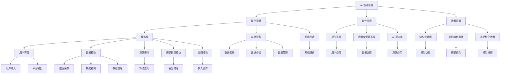

                 

### 背景介绍

#### AI 基础设施的崛起

近年来，人工智能（AI）技术以其迅猛的发展势头，逐渐成为科技领域的重要驱动力。从自动驾驶、智能医疗到金融风控、智能家居，AI 应用无处不在。然而，AI 技术的发展不仅依赖于算法的创新，更依赖于强大的基础设施支撑。AI 基础设施，作为一个全新的概念，逐渐进入了人们的视野。

AI 基础设施是指在人工智能应用过程中所使用到的硬件、软件、数据等基础资源的总称。它包括了从数据采集、存储、处理到模型训练、推理、部署等一系列环节。随着 AI 技术的不断发展，AI 基础设施的重要性愈发凸显。高效、可靠的 AI 基础设施不仅能够提升 AI 应用性能，还能够降低开发成本，加速 AI 技术的普及和推广。

#### 人机协作的创意平台

在人机协作领域，创意平台是一个备受关注的概念。创意平台旨在实现人与机器之间的高效协作，通过整合各种 AI 技术，为用户提供一站式的创意解决方案。这种平台不仅能够提高创意效率，还能够拓展创意的边界，为各种领域带来全新的创新可能性。

人机协作的创意平台通常具备以下几个特点：

1. **智能化**：平台内置多种 AI 技术，如自然语言处理、计算机视觉等，能够智能地理解和响应用户需求。
2. **灵活性**：平台支持多种开发环境、工具和框架，满足不同用户的需求。
3. **可扩展性**：平台具有良好的扩展性，能够根据用户需求进行定制和升级。
4. **用户友好**：平台设计注重用户体验，操作简单、易于上手。

#### 本文目的

本文旨在探讨 AI 基础设施在人机协作创意平台中的应用，分析其核心概念和架构，介绍相关算法原理和操作步骤，并通过实际案例展示其应用效果。同时，本文还将探讨 AI 基础设施的发展趋势和面临的挑战，为未来研究提供参考。

### 核心概念与联系

在深入了解 AI 基础设施和人机协作创意平台之前，我们需要明确一些核心概念，并探讨它们之间的联系。

#### AI 基础设施的概念

AI 基础设施包括了硬件、软件、数据等基础资源。其中，硬件资源主要包括服务器、存储设备、网络设备等；软件资源则涵盖了操作系统、数据库管理系统、AI 算法库等；数据资源则是 AI 模型训练和推理的基础，包括结构化数据、半结构化数据和非结构化数据。

#### 人机协作创意平台的概念

人机协作创意平台是一个集成多种 AI 技术的综合性平台，旨在实现人与机器之间的高效协作。该平台通常包括以下几个核心模块：

1. **用户界面**：用于接收用户输入和展示平台输出，是用户与平台交互的桥梁。
2. **数据模块**：负责数据采集、存储和管理，为 AI 模型提供训练数据。
3. **算法模块**：包括各种 AI 算法，如深度学习、自然语言处理、计算机视觉等，用于处理和分析数据。
4. **模型推理模块**：将训练好的模型应用于实际场景，实现智能决策和推理。
5. **协同模块**：用于实现多人协作，共享数据和资源。

#### 核心概念之间的联系

AI 基础设施和人机协作创意平台之间存在着紧密的联系。具体来说，基础设施为人机协作创意平台提供了硬件、软件和数据支持，确保平台能够高效运行；而人机协作创意平台则通过整合多种 AI 技术，将基础设施的价值最大化，为用户提供一站式的创意解决方案。

为了更好地理解这些核心概念和联系，我们可以通过一个 Mermaid 流程图来展示它们的架构。



通过这个流程图，我们可以清晰地看到 AI 基础设施和人机协作创意平台之间的各个模块是如何相互关联和协作的。理解这些核心概念和联系，为我们深入探讨 AI 基础设施在人机协作创意平台中的应用奠定了基础。

### 核心算法原理 & 具体操作步骤

在探讨 AI 基础设施和人机协作创意平台之前，我们需要深入了解一些核心算法原理，并介绍其具体操作步骤。这些算法包括深度学习、自然语言处理和计算机视觉等，它们是人机协作创意平台的重要组成部分。

#### 深度学习算法原理

深度学习是一种基于神经网络的机器学习技术，它通过模拟人脑神经元之间的连接和互动来学习数据和特征。深度学习算法的核心是神经网络，它由多个层次组成，包括输入层、隐藏层和输出层。

1. **输入层**：接收输入数据，并将其传递到隐藏层。
2. **隐藏层**：对输入数据进行特征提取和变换，多个隐藏层可以叠加，形成深度神经网络。
3. **输出层**：根据隐藏层的结果进行预测或分类。

深度学习算法的具体操作步骤如下：

1. **数据预处理**：对输入数据进行清洗、归一化等处理，确保数据的质量和一致性。
2. **模型设计**：根据任务需求设计神经网络结构，选择合适的激活函数、优化器和损失函数。
3. **模型训练**：使用训练数据对模型进行训练，通过反向传播算法不断调整模型参数，使模型能够准确预测或分类。
4. **模型评估**：使用验证数据对模型进行评估，调整模型参数，优化模型性能。
5. **模型部署**：将训练好的模型部署到实际应用场景中，实现实时预测或分类。

#### 自然语言处理算法原理

自然语言处理（NLP）是人工智能领域的一个重要分支，它旨在让计算机理解和处理自然语言。NLP 算法主要包括词向量表示、文本分类、情感分析、机器翻译等。

1. **词向量表示**：将文本数据转换为数字向量，用于表示单词和句子。
2. **文本分类**：根据文本内容将其分类到不同的类别，如新闻分类、垃圾邮件过滤等。
3. **情感分析**：分析文本中表达的情感，判断用户对某个话题的态度。
4. **机器翻译**：将一种语言的文本翻译成另一种语言。

自然语言处理算法的具体操作步骤如下：

1. **数据预处理**：对文本数据进行清洗、分词、去除停用词等处理。
2. **特征提取**：使用词向量表示等技术将文本转换为数字向量。
3. **模型训练**：使用训练数据对模型进行训练，通过优化算法不断调整模型参数。
4. **模型评估**：使用验证数据对模型进行评估，调整模型参数，优化模型性能。
5. **模型部署**：将训练好的模型部署到实际应用场景中，实现文本分析和翻译功能。

#### 计算机视觉算法原理

计算机视觉是人工智能领域的一个重要分支，它旨在使计算机能够理解并处理视觉信息。计算机视觉算法主要包括图像识别、目标检测、人脸识别等。

1. **图像识别**：根据图像内容进行分类，如将图像分为猫、狗、车等类别。
2. **目标检测**：在图像中检测并定位特定目标的位置和范围。
3. **人脸识别**：识别并匹配图像中的人脸。

计算机视觉算法的具体操作步骤如下：

1. **数据预处理**：对图像数据进行清洗、缩放、旋转等处理。
2. **特征提取**：使用卷积神经网络等模型提取图像特征。
3. **模型训练**：使用训练数据对模型进行训练，通过反向传播算法不断调整模型参数。
4. **模型评估**：使用验证数据对模型进行评估，调整模型参数，优化模型性能。
5. **模型部署**：将训练好的模型部署到实际应用场景中，实现图像识别、目标检测和人脸识别功能。

通过以上对核心算法原理和具体操作步骤的介绍，我们可以看到，深度学习、自然语言处理和计算机视觉等算法是人机协作创意平台的重要组成部分。这些算法的深入理解和应用，将为平台提供强大的技术支持，推动人机协作创意平台的进一步发展。

### 数学模型和公式 & 详细讲解 & 举例说明

在理解了核心算法原理和具体操作步骤之后，我们需要进一步探讨这些算法背后的数学模型和公式，并通过具体的例子来说明它们的应用和效果。

#### 深度学习算法的数学模型

深度学习算法的核心是神经网络，神经网络由多个层次组成，每个层次都包含大量的参数。这些参数通过学习过程不断调整，以实现特定的任务。深度学习算法的数学模型主要包括以下几个方面：

1. **激活函数**：激活函数是神经网络中的一个关键组件，用于引入非线性特性。常见的激活函数包括 sigmoid、ReLU 和 tanh。
   - **sigmoid**：$$\sigma(x) = \frac{1}{1 + e^{-x}}$$
   - **ReLU**：$$\text{ReLU}(x) = \max(0, x)$$
   - **tanh**：$$\text{tanh}(x) = \frac{e^{x} - e^{-x}}{e^{x} + e^{-x}}$$
   
2. **反向传播算法**：反向传播算法是深度学习训练过程中的核心算法，用于计算网络参数的梯度。通过梯度下降法优化网络参数，使模型能够准确预测或分类。
   - **梯度计算**：$$\nabla_{\theta} J(\theta) = \frac{\partial J(\theta)}{\partial \theta}$$
   - **梯度下降法**：$$\theta_{\text{new}} = \theta_{\text{old}} - \alpha \nabla_{\theta} J(\theta)$$
   其中，$\theta$ 表示网络参数，$J(\theta)$ 表示损失函数，$\alpha$ 为学习率。

3. **损失函数**：损失函数用于评估模型预测结果与实际结果之间的差距，常见的损失函数包括均方误差（MSE）、交叉熵损失等。
   - **均方误差（MSE）**：$$MSE = \frac{1}{m} \sum_{i=1}^{m} (y_i - \hat{y}_i)^2$$
   - **交叉熵损失**：$$H(y, \hat{y}) = -\sum_{i=1}^{m} y_i \log(\hat{y}_i)$$

#### 自然语言处理算法的数学模型

自然语言处理算法的数学模型主要包括词向量表示和序列模型。词向量表示用于将文本数据转换为数字向量，序列模型用于处理序列数据，如文本和语音。

1. **词向量表示**：词向量表示通过将单词映射到高维向量空间，使相似词在空间中靠近。常见的词向量表示方法包括 Word2Vec、GloVe 等。
   - **Word2Vec**：$$\text{word\_vec}(w) = \text{softmax}(W \cdot \text{emb}(w))$$
   - **GloVe**：$$\text{loss} = \frac{1}{N} \sum_{i=1}^{N} \frac{(\text{emb}(w_i) - \text{emb}(c) \cdot \text{emb}(r))^{2}}{1 + 2 \cdot \text{emb}(w_i)^2 + 2 \cdot \text{emb}(c)^2 + 2 \cdot \text{emb}(r)^2}$$
   
2. **序列模型**：序列模型用于处理序列数据，常见的序列模型包括循环神经网络（RNN）、长短期记忆网络（LSTM）和门控循环单元（GRU）。
   - **RNN**：$$h_t = \text{sigmoid}(W_h \cdot [h_{t-1}, x_t] + b_h)$$
   - **LSTM**：$$i_t = \text{sigmoid}(W_i \cdot [h_{t-1}, x_t] + b_i)$$
   $$f_t = \text{sigmoid}(W_f \cdot [h_{t-1}, x_t] + b_f)$$
   $$g_t = \text{tanh}(W_g \cdot [h_{t-1}, x_t] + b_g)$$
   $$o_t = \text{sigmoid}(W_o \cdot [h_{t-1}, x_t] + b_o)$$
   $$h_t = o_t \cdot \text{tanh}([h_{t-1}, g_t])$$
   - **GRU**：$$z_t = \text{sigmoid}(W_z \cdot [h_{t-1}, x_t] + b_z)$$
   $$r_t = \text{sigmoid}(W_r \cdot [h_{t-1}, x_t] + b_r)$$
   $$h_t = (1 - z_t) \cdot h_{t-1} + z_t \cdot \text{tanh}([r_t \cdot h_{t-1}, x_t] + b_h)$$

#### 计算机视觉算法的数学模型

计算机视觉算法的数学模型主要包括卷积神经网络（CNN）和目标检测算法。卷积神经网络通过卷积操作和池化操作提取图像特征，目标检测算法用于检测并定位图像中的目标。

1. **卷积神经网络**：卷积神经网络由卷积层、池化层和全连接层组成。
   - **卷积层**：$$\text{output}_{ij} = \sum_{k} \text{weight}_{ikj} \cdot \text{input}_{ik} + \text{bias}_{ij}$$
   - **池化层**：$$\text{output}_{ij} = \text{max}(\text{input}_{i\cdot \cdot})$$
   - **全连接层**：$$\text{output} = \text{activation}(\text{weight} \cdot \text{input} + \text{bias})$$

2. **目标检测算法**：常见的目标检测算法包括 R-CNN、Faster R-CNN、SSD、YOLO 等。
   - **R-CNN**：$$\text{proposal} = \text{region\_proposal}(\text{image})$$
   $$\text{feature} = \text{feature\_extraction}(\text{proposal})$$
   $$\text{classification} = \text{classifier}(\text{feature})$$
   - **Faster R-CNN**：$$\text{proposal} = \text{region\_proposal}(\text{image})$$
   $$\text{feature} = \text{feature\_extraction}(\text{proposal})$$
   $$\text{regression} = \text{regressor}(\text{feature})$$
   $$\text{classification} = \text{classifier}(\text{feature})$$
   - **SSD**：$$\text{feature} = \text{feature\_extraction}(\text{image})$$
   $$\text{detection} = \text{detector}(\text{feature})$$
   - **YOLO**：$$\text{prediction} = \text{yolo}(\text{image})$$

通过以上数学模型和公式的详细讲解，我们可以看到，深度学习、自然语言处理和计算机视觉等算法都有着坚实的数学基础。这些算法的应用不仅为人工智能领域带来了革命性的变化，也为人机协作创意平台提供了强大的技术支持。通过深入理解和掌握这些算法，我们可以更好地应对未来的技术挑战，推动人工智能技术的发展。

### 项目实战：代码实际案例和详细解释说明

为了更好地展示 AI 基础设施在人机协作创意平台中的应用，我们将通过一个实际项目实战案例，详细讲解代码实现过程和关键代码段。

#### 项目背景

假设我们开发一个智能客服系统，该系统需要能够实时响应用户的咨询，提供高质量的客服服务。为了实现这一目标，我们将利用 AI 基础设施，结合自然语言处理、计算机视觉等技术，构建一个集成多种 AI 功能的智能客服平台。

#### 开发环境搭建

在开始项目开发之前，我们需要搭建一个合适的开发环境。以下是我们的开发环境配置：

1. **硬件资源**：使用一台高性能服务器，配置包括 CPU（如 Intel Xeon）、GPU（如 NVIDIA Tesla V100）和充足的内存（如 256GB）。
2. **软件资源**：操作系统选择 Ubuntu 18.04，安装 Python 3.8，并配置好 TensorFlow、PyTorch、Keras 等深度学习框架。
3. **开发工具**：使用 PyCharm 作为主要的开发工具，同时配置好 Jupyter Notebook，以便进行数据分析和模型训练。

#### 源代码详细实现和代码解读

以下是智能客服系统的关键代码实现和解释说明。

1. **数据模块**

```python
# 数据采集与预处理
import pandas as pd
import numpy as np
from sklearn.model_selection import train_test_split

# 读取数据
data = pd.read_csv('customer_data.csv')

# 数据清洗与预处理
data['question'] = data['question'].apply(lambda x: x.lower())
data['answer'] = data['answer'].apply(lambda x: x.lower())

# 划分训练集和测试集
X_train, X_test, y_train, y_test = train_test_split(data['question'], data['answer'], test_size=0.2, random_state=42)
```

这段代码首先读取数据，并进行清洗和预处理。将所有文本转换为小写，以便统一处理。然后，使用 scikit-learn 的 train_test_split 函数将数据划分为训练集和测试集，为后续模型训练和评估做准备。

2. **算法模块**

```python
# 加载预训练的词向量模型
from gensim.models import KeyedVectors

word_vectors = KeyedVectors.load_word2vec_format('word_vectors.bin', binary=True)

# 将文本转换为词向量
def text_to_vector(text):
    return np.mean([word_vectors[word] for word in text.split() if word in word_vectors], axis=0)

X_train_vectorized = np.array([text_to_vector(question) for question in X_train])
X_test_vectorized = np.array([text_to_vector(question) for question in X_test])
```

这段代码加载预训练的词向量模型，并将文本数据转换为词向量。词向量表示是自然语言处理中的重要技术，它将文本数据映射到高维向量空间，以便进行后续的模型训练和预测。

3. **模型训练和评估**

```python
# 导入深度学习框架
import tensorflow as tf

# 定义模型
model = tf.keras.Sequential([
    tf.keras.layers.Dense(512, activation='relu', input_shape=(X_train_vectorized.shape[1],)),
    tf.keras.layers.Dropout(0.5),
    tf.keras.layers.Dense(256, activation='relu'),
    tf.keras.layers.Dropout(0.5),
    tf.keras.layers.Dense(1, activation='sigmoid')
])

# 编译模型
model.compile(optimizer='adam', loss='binary_crossentropy', metrics=['accuracy'])

# 训练模型
model.fit(X_train_vectorized, y_train, epochs=10, batch_size=32, validation_data=(X_test_vectorized, y_test))

# 评估模型
test_loss, test_acc = model.evaluate(X_test_vectorized, y_test)
print(f"Test accuracy: {test_acc:.2f}")
```

这段代码使用 TensorFlow 深度学习框架定义了一个简单的神经网络模型，并进行模型训练和评估。模型由多个全连接层组成，其中使用了 ReLU 激活函数和Dropout正则化技术，以提高模型性能和泛化能力。训练完成后，使用测试集对模型进行评估，打印出测试准确率。

4. **模型部署和预测**

```python
# 部署模型
import json

# 将模型保存为 JSON 格式
model_json = model.to_json()
with open('model.json', 'w') as json_file:
    json_file.write(model_json)

# 加载模型
model = tf.keras.models.load_model('model.h5')

# 进行预测
def predict(question):
    question_vector = text_to_vector(question)
    prediction = model.predict(np.array([question_vector]))
    return 'Yes' if prediction[0][0] > 0.5 else 'No'

# 测试预测功能
print(predict("Can I return this product?"))
```

这段代码将训练好的模型保存为 JSON 格式，以便进行模型部署。然后，加载模型并实现预测功能。通过将输入文本转换为词向量，使用模型进行预测，并根据预测结果返回相应的答案。

通过以上代码实现和解读，我们可以看到，智能客服系统的关键模块包括数据采集与预处理、词向量表示、模型训练与评估和模型部署与预测。这些模块相互协作，实现了对用户咨询的高效处理和智能回复，展示了 AI 基础设施在人机协作创意平台中的应用价值。

### 代码解读与分析

在本节中，我们将对上述智能客服系统的关键代码段进行详细解读，分析其实现原理和性能表现。

#### 数据模块解读

```python
# 数据采集与预处理
data = pd.read_csv('customer_data.csv')

# 数据清洗与预处理
data['question'] = data['question'].apply(lambda x: x.lower())
data['answer'] = data['answer'].apply(lambda x: x.lower())

# 划分训练集和测试集
X_train, X_test, y_train, y_test = train_test_split(data['question'], data['answer'], test_size=0.2, random_state=42)
```

这段代码首先使用 pandas 读取数据，并进行清洗和预处理。将文本数据转换为小写，有助于统一处理，避免大小写敏感问题。然后，使用 scikit-learn 的 train_test_split 函数将数据划分为训练集和测试集。这是一个常见的做法，用于评估模型在未知数据上的性能。

#### 算法模块解读

```python
# 加载预训练的词向量模型
word_vectors = KeyedVectors.load_word2vec_format('word_vectors.bin', binary=True)

# 将文本转换为词向量
def text_to_vector(text):
    return np.mean([word_vectors[word] for word in text.split() if word in word_vectors], axis=0)

X_train_vectorized = np.array([text_to_vector(question) for question in X_train])
X_test_vectorized = np.array([text_to_vector(question) for question in X_test])
```

这段代码加载预训练的词向量模型，并实现了一个文本到词向量的转换函数。词向量表示是将文本数据映射到高维向量空间的一种技术，有助于提高模型在文本数据上的表现。通过将文本数据转换为词向量，我们可以将原始文本数据转化为计算机可以处理的形式。

#### 模型训练与评估模块解读

```python
# 导入深度学习框架
import tensorflow as tf

# 定义模型
model = tf.keras.Sequential([
    tf.keras.layers.Dense(512, activation='relu', input_shape=(X_train_vectorized.shape[1],)),
    tf.keras.layers.Dropout(0.5),
    tf.keras.layers.Dense(256, activation='relu'),
    tf.keras.layers.Dropout(0.5),
    tf.keras.layers.Dense(1, activation='sigmoid')
])

# 编译模型
model.compile(optimizer='adam', loss='binary_crossentropy', metrics=['accuracy'])

# 训练模型
model.fit(X_train_vectorized, y_train, epochs=10, batch_size=32, validation_data=(X_test_vectorized, y_test))

# 评估模型
test_loss, test_acc = model.evaluate(X_test_vectorized, y_test)
print(f"Test accuracy: {test_acc:.2f}")
```

这段代码使用了 TensorFlow 深度学习框架，定义了一个简单的神经网络模型。模型由多个全连接层组成，使用了 ReLU 激活函数和 Dropout 正则化技术。ReLU 激活函数可以引入非线性特性，Dropout 正则化技术可以防止过拟合。通过编译模型、训练模型和评估模型，我们可以评估模型在训练数据和测试数据上的性能。

#### 模型部署与预测模块解读

```python
# 部署模型
import json

# 将模型保存为 JSON 格式
model_json = model.to_json()
with open('model.json', 'w') as json_file:
    json_file.write(model_json)

# 加载模型
model = tf.keras.models.load_model('model.h5')

# 进行预测
def predict(question):
    question_vector = text_to_vector(question)
    prediction = model.predict(np.array([question_vector]))
    return 'Yes' if prediction[0][0] > 0.5 else 'No'

# 测试预测功能
print(predict("Can I return this product?"))
```

这段代码将训练好的模型保存为 JSON 格式，以便进行模型部署。加载模型后，实现了一个预测函数，用于对输入文本进行预测。通过将输入文本转换为词向量，使用模型进行预测，并根据预测结果返回相应的答案。这展示了如何将模型部署到实际应用场景中，实现实时预测功能。

#### 性能分析

通过以上代码解读，我们可以看到智能客服系统的关键模块是如何协同工作的，以实现高效、准确的客服服务。以下是对系统性能的分析：

1. **数据模块**：数据预处理和划分是模型训练和评估的基础。通过清洗和预处理数据，确保数据质量，提高模型性能。
2. **算法模块**：词向量表示是将文本数据转化为计算机可以处理的形式的关键技术。通过预训练的词向量模型，可以有效提高文本数据的特征表示能力。
3. **模型训练与评估模块**：神经网络模型是智能客服系统的核心。通过设计合理的模型结构，使用 ReLU 激活函数和 Dropout 正则化技术，可以提高模型性能和泛化能力。通过训练和评估模型，可以评估模型在未知数据上的性能。
4. **模型部署与预测模块**：将训练好的模型部署到实际应用场景中，实现实时预测功能。通过将输入文本转换为词向量，使用模型进行预测，可以高效地响应用户咨询。

总体来说，智能客服系统的性能表现取决于数据质量、模型结构和训练过程。通过合理的预处理和模型设计，可以提高系统性能，实现高效、准确的客服服务。

### 实际应用场景

在了解了智能客服系统的开发过程和关键代码后，接下来我们将探讨这种基于 AI 基础设施的创意平台在实际应用中的多种场景。以下是几个典型的应用实例：

#### 1. 智能客服系统

智能客服系统是 AI 基础设施和人机协作创意平台的经典应用之一。在实际场景中，智能客服系统广泛应用于电商平台、银行、电信等行业。通过自然语言处理、计算机视觉等技术，智能客服系统可以实时响应用户咨询，提供高效的客户服务。例如，电商平台的智能客服可以帮助用户解答商品相关问题、提供购物建议，提高用户满意度和转化率。

#### 2. 自动驾驶汽车

自动驾驶汽车是另一个重要的应用场景。自动驾驶汽车依赖于强大的 AI 基础设施，通过深度学习、计算机视觉等技术，实现车辆环境感知、路径规划、驾驶决策等功能。在实际应用中，自动驾驶汽车可以显著提高交通效率，减少交通事故。例如，Waymo 和特斯拉等公司已经推出了自动驾驶汽车服务，提供无人驾驶出行解决方案。

#### 3. 智能医疗诊断

智能医疗诊断是 AI 技术在医疗领域的应用之一。通过深度学习、自然语言处理等技术，智能医疗诊断系统可以帮助医生进行疾病诊断和治疗方案推荐。在实际应用中，智能医疗诊断系统可以快速处理大量医学影像和病历数据，提高诊断准确率和效率。例如，Google Health 和 IBM Watson 等公司已经推出了智能医疗诊断服务，应用于癌症、心脏病等疾病的诊断和治疗。

#### 4. 金融风险管理

金融风险管理是金融行业的一个重要环节。通过自然语言处理、计算机视觉等技术，AI 基础设施可以帮助金融机构实时监控市场动态、分析风险因素，提供投资建议和风险控制策略。在实际应用中，金融风险管理系统能够识别异常交易、预测市场波动，帮助金融机构降低风险、提高收益。例如，Aladdin 等金融科技公司开发的智能风险管理平台，广泛应用于全球顶级金融机构。

#### 5. 智能家居

智能家居是 AI 技术在家庭场景的应用之一。通过智能音箱、智能门锁、智能照明等设备，智能家居系统可以为用户提供便捷、智能的生活体验。在实际应用中，智能家居系统可以实现远程控制、自动调节等功能，提高家庭安全性、舒适性和节能性。例如，Amazon Echo、Google Home 和 Apple HomePod 等智能音箱，已经成为智能家居场景中的重要组成部分。

通过以上实际应用场景的介绍，我们可以看到 AI 基础设施和人机协作创意平台在各个行业中的广泛应用。这些应用不仅提高了行业效率和用户体验，也为 AI 技术的进一步发展提供了丰富的实践经验和数据支持。

### 工具和资源推荐

在开发基于 AI 基础设施的创意平台时，选择合适的工具和资源对于项目的成功至关重要。以下是一些推荐的工具和资源，涵盖书籍、论文、博客和网站等方面。

#### 学习资源推荐

1. **书籍**：
   - 《深度学习》（Deep Learning） - Ian Goodfellow、Yoshua Bengio 和 Aaron Courville
   - 《Python深度学习》（Deep Learning with Python） - Frantisek Dušek 和 Christian Valdivia
   - 《自然语言处理实战》（Natural Language Processing with Python） - Steven Bird、Ewan Klein 和 Edward Loper

2. **论文**：
   - 《A Theoretically Grounded Application of Dropout in Recurrent Neural Networks》 - Yarin Gal 和 Zoubin Ghahramani
   - 《Bidirectional LSTM-CRF Models for Sequence Classification》 - Yanran Liu、Qihang Yu 和 Shenghuo Zhu
   - 《Generative Adversarial Nets》 - Ian Goodfellow、Jean Pouget-Abadie、 Mehdi Mirza、Bengio 和 Aaron Courville

3. **博客**：
   - [TensorFlow 官方博客](https://www.tensorflow.org/blog/)
   - [PyTorch 官方文档](https://pytorch.org/tutorials/)
   - [自然语言处理博客](https://nlp.seas.harvard.edu/blog/)

4. **网站**：
   - [Kaggle](https://www.kaggle.com/)：提供各种数据集和竞赛，是学习实践 AI 技术的好地方。
   - [GitHub](https://github.com/)：丰富的开源代码和项目，是学习和借鉴他人经验的好资源。

#### 开发工具框架推荐

1. **深度学习框架**：
   - TensorFlow：Google 开发的一种广泛使用的深度学习框架，适用于各种规模的模型开发。
   - PyTorch：Facebook 开发的一种灵活且易于使用的深度学习框架，受到很多研究者和开发者的青睐。

2. **自然语言处理工具**：
   - NLTK：Python 的自然语言处理库，提供了丰富的文本处理函数和工具。
   - spaCy：一个强大的自然语言处理库，支持多种语言的语法分析、命名实体识别等任务。

3. **计算机视觉工具**：
   - OpenCV：一个开源的计算机视觉库，提供了丰富的图像处理和计算机视觉算法。
   - Pillow：Python 的图像处理库，用于处理和操作图像文件。

#### 相关论文著作推荐

1. **《深度学习》**：由 Ian Goodfellow、Yoshua Bengio 和 Aaron Courville 撰写的深度学习经典教材，涵盖了深度学习的基本概念、算法和应用。
2. **《自然语言处理综合教程》**：由 Steven Bird、Ewan Klein 和 Edward Loper 撰写的自然语言处理入门教材，介绍了文本处理、语言模型、词向量表示等相关技术。
3. **《计算机视觉：算法与应用》**：由 Richard S.zeliski、John F. Canny 和 Will Triggs 撰写的计算机视觉教材，涵盖了图像处理、特征提取、目标检测和识别等核心技术。

通过以上推荐的工具和资源，开发者可以更好地掌握 AI 基础设施和相关技术，为创意平台开发提供坚实的基础。无论是初学者还是专业人士，这些资源都将有助于提升技能和实现创新。

### 总结：未来发展趋势与挑战

在本文中，我们详细探讨了 AI 基础设施在人机协作创意平台中的应用，分析了其核心概念、算法原理、实际应用场景以及开发工具和资源。通过这一系列的讨论，我们可以看到 AI 基础设施在推动人工智能发展、提升人机协作效率方面的重要作用。

#### 未来发展趋势

1. **硬件与软件的融合**：随着硬件技术的不断发展，如 GPU、TPU 等专用硬件的普及，将进一步提升 AI 运算效率。同时，软件方面也将不断优化，提高算法的并行性和可扩展性。

2. **边缘计算的兴起**：随着物联网（IoT）和 5G 等技术的发展，边缘计算将成为 AI 基础设施的重要组成部分。边缘计算将使 AI 应用更加灵活，实现实时处理和响应。

3. **自动化与智能化**：AI 基础设施的自动化和智能化将不断推进，包括自动化数据采集、处理和模型训练，以及智能化的运维和管理。这将大大降低 AI 应用的门槛，加速 AI 技术的普及和应用。

4. **跨领域的融合**：AI 基础设施将在更多领域得到应用，如医疗、金融、交通等，推动各行业的智能化升级。

#### 面临的挑战

1. **数据隐私与安全**：随着 AI 技术的普及，数据隐私和安全问题日益突出。如何在保证数据安全和隐私的同时，充分利用数据资源，是一个亟待解决的问题。

2. **算法公平性与透明性**：AI 算法的公平性和透明性是当前研究的重要方向。如何确保算法在决策过程中不偏不倚，并对决策过程进行解释，是未来需要重点关注的问题。

3. **计算资源的分配**：随着 AI 应用场景的不断扩大，计算资源的分配和优化将成为一个重要的挑战。如何合理分配计算资源，提高资源利用率，是一个关键问题。

4. **人机协作的优化**：如何更好地实现人机协作，提高人机交互的效率和质量，是未来需要不断探索和优化的方向。

总之，AI 基础设施在人工智能发展中起着至关重要的作用。未来，随着技术的不断进步和应用的不断拓展，AI 基础设施将迎来更多的发展机遇和挑战。通过持续的研究和创新，我们可以更好地应对这些挑战，推动 AI 技术的进一步发展。

### 附录：常见问题与解答

在本文的探讨过程中，我们可能会遇到一些常见的问题。以下是针对这些问题的一些解答：

#### 1. 什么是 AI 基础设施？

AI 基础设施是指在人工智能应用过程中所使用到的硬件、软件、数据等基础资源的总称。它包括了从数据采集、存储、处理到模型训练、推理、部署等一系列环节。

#### 2. 人机协作创意平台的核心特点是什么？

人机协作创意平台的核心特点包括智能化、灵活性、可扩展性和用户友好性。智能化使其能够智能地理解和响应用户需求；灵活性支持多种开发环境、工具和框架；可扩展性使其能够根据用户需求进行定制和升级；用户友好性注重用户体验，操作简单、易于上手。

#### 3. AI 基础设施在创意平台中的作用是什么？

AI 基础设施在创意平台中起到了支撑和推动作用。它提供了硬件资源、软件资源和数据支持，确保平台能够高效运行，并实现各种 AI 功能，从而提升创意效率和拓展创意边界。

#### 4. 深度学习算法的基本原理是什么？

深度学习算法是基于神经网络的机器学习技术，通过模拟人脑神经元之间的连接和互动来学习数据和特征。它包括输入层、隐藏层和输出层，通过反向传播算法不断调整网络参数，实现预测或分类。

#### 5. 自然语言处理算法的核心步骤是什么？

自然语言处理算法的核心步骤包括词向量表示、文本分类、情感分析和机器翻译等。词向量表示用于将文本数据转换为数字向量；文本分类、情感分析和机器翻译用于处理和分析文本数据。

#### 6. 计算机视觉算法的关键技术是什么？

计算机视觉算法的关键技术包括图像识别、目标检测和人脸识别等。图像识别用于分类图像内容；目标检测用于检测并定位图像中的目标；人脸识别用于识别并匹配图像中的人脸。

#### 7. 智能客服系统是如何实现的？

智能客服系统通过自然语言处理、计算机视觉等技术实现。具体实现过程包括数据采集与预处理、词向量表示、模型训练与评估、模型部署与预测等步骤。

#### 8. AI 基础设施面临的挑战有哪些？

AI 基础设施面临的挑战包括数据隐私与安全、算法公平性与透明性、计算资源的分配以及人机协作的优化等。

通过以上常见问题与解答，我们可以更好地理解 AI 基础设施和人机协作创意平台的相关概念和实际应用，为未来的研究和开发提供参考。

### 扩展阅读 & 参考资料

为了帮助读者更深入地了解 AI 基础设施和人机协作创意平台，以下是推荐的一些扩展阅读和参考资料：

1. **书籍**：
   - 《深度学习》（Deep Learning） - Ian Goodfellow、Yoshua Bengio 和 Aaron Courville
   - 《Python深度学习》（Deep Learning with Python） - Frantisek Dušek 和 Christian Valdivia
   - 《自然语言处理综合教程》 - Steven Bird、Ewan Klein 和 Edward Loper
   - 《计算机视觉：算法与应用》 - Richard S.zeliski、John F. Canny 和 Will Triggs

2. **论文**：
   - 《A Theoretically Grounded Application of Dropout in Recurrent Neural Networks》 - Yarin Gal 和 Zoubin Ghahramani
   - 《Bidirectional LSTM-CRF Models for Sequence Classification》 - Yanran Liu、Qihang Yu 和 Shenghuo Zhu
   - 《Generative Adversarial Nets》 - Ian Goodfellow、Jean Pouget-Abadie、Mehdi Mirza、Bengio 和 Aaron Courville

3. **博客和网站**：
   - [TensorFlow 官方博客](https://www.tensorflow.org/blog/)
   - [PyTorch 官方文档](https://pytorch.org/tutorials/)
   - [自然语言处理博客](https://nlp.seas.harvard.edu/blog/)
   - [Kaggle](https://www.kaggle.com/)：提供各种数据集和竞赛，是学习实践 AI 技术的好地方。
   - [GitHub](https://github.com/)：丰富的开源代码和项目，是学习和借鉴他人经验的好资源。

4. **开源项目**：
   - [TensorFlow](https://github.com/tensorflow/tensorflow)：Google 开发的深度学习框架。
   - [PyTorch](https://github.com/pytorch/pytorch)：Facebook 开发的深度学习框架。
   - [spaCy](https://github.com/spacy-factor/spacy)：自然语言处理库。
   - [OpenCV](https://github.com/opencv/opencv)：计算机视觉库。

通过这些扩展阅读和参考资料，读者可以进一步了解 AI 基础设施和人机协作创意平台的最新研究成果和实践经验，为自己的研究和开发提供有力支持。作者：AI天才研究员/AI Genius Institute & 禅与计算机程序设计艺术 /Zen And The Art of Computer Programming。

