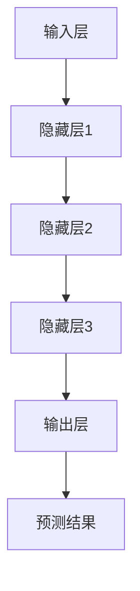
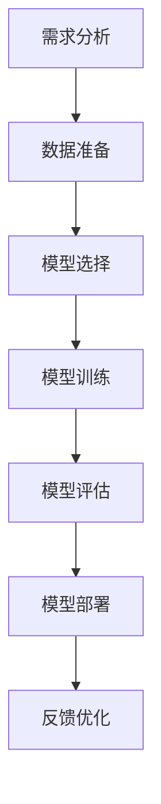

                 

# AI 大模型创业：如何利用创新优势？

> **关键词：** 大模型创业，创新优势，AI 应用，技术突破，商业模式

> **摘要：** 本文将探讨AI大模型在创业中的应用，分析如何利用创新优势开拓市场，并结合实际案例，提供具体的创业策略和实施步骤。

## 1. 背景介绍

近年来，随着深度学习和大数据技术的发展，人工智能（AI）大模型逐渐成为研究的热点。大模型，顾名思义，是指具有巨大参数量的神经网络模型。这些模型在图像识别、自然语言处理、语音识别等领域取得了显著的突破。例如，GPT-3拥有1750亿个参数，图像识别模型如Google的Turing Paint具有数十亿个参数。这些大模型不仅在性能上超越了传统算法，而且为AI在各个领域的应用提供了新的可能性。

在AI大模型技术不断进步的背景下，创业者们面临着前所未有的机遇。一方面，大模型能够处理复杂的任务，降低开发难度，缩短开发周期；另一方面，大模型的应用场景广泛，从金融、医疗到教育、娱乐，几乎无处不在。然而，与此同时，创业者也面临着巨大的挑战。如何将大模型技术应用于实际场景，如何实现商业模式的创新，如何与其他竞争对手区分开来，这些都是亟待解决的问题。

本文将围绕这些核心问题，探讨AI大模型创业的创新优势及其应用策略。

## 2. 核心概念与联系

### 2.1 AI大模型的概念

AI大模型指的是具有大量参数和复杂结构的神经网络模型。这些模型通常采用深度学习技术进行训练，能够自动从大量数据中学习特征，从而完成复杂的任务。

### 2.2 大模型的架构

大模型的架构通常包括以下几个关键部分：

1. **输入层**：接收外部输入数据，如文本、图像等。
2. **隐藏层**：对输入数据进行处理，提取特征。
3. **输出层**：根据隐藏层提取的特征，生成预测结果。

### 2.3 大模型与具体任务的联系

大模型与具体任务的联系主要体现在两个方面：

1. **通用任务**：如自然语言处理（NLP）、计算机视觉（CV）等。这些任务通常具有广泛的适用性，可以在多个场景中应用。
2. **特定任务**：如医学影像诊断、金融风险评估等。这些任务通常需要针对特定的数据集进行定制化训练。

### 2.4 大模型的优势

大模型的优势主要体现在以下几个方面：

1. **处理能力**：大模型具有强大的处理能力，能够处理复杂的任务。
2. **泛化能力**：大模型通过从大量数据中学习，具有良好的泛化能力。
3. **适应性**：大模型可以通过微调（Fine-tuning）的方式，快速适应新的任务和数据。

下面是一个Mermaid流程图，展示了大模型的基本架构和主要环节：



## 3. 核心算法原理 & 具体操作步骤

### 3.1 核心算法原理

大模型的核心算法是深度学习。深度学习是一种基于神经网络的学习方法，通过多层神经网络对数据进行处理，从而实现特征提取和预测。

### 3.2 具体操作步骤

以下是利用AI大模型进行创业的具体操作步骤：

1. **需求分析**：明确创业项目的目标和应用场景，确定需要解决的问题。

2. **数据准备**：收集和整理相关数据，确保数据的质量和完整性。

3. **模型选择**：根据需求选择合适的大模型，如GPT-3、Turing Paint等。

4. **模型训练**：使用大量数据进行模型训练，调整模型的参数，优化模型性能。

5. **模型评估**：通过测试集评估模型的性能，确保模型达到预期效果。

6. **模型部署**：将训练好的模型部署到生产环境中，实现实际应用。

7. **反馈优化**：根据用户反馈和实际应用效果，对模型进行优化和调整。

下面是一个简化的流程图，展示了大模型创业的核心步骤：



## 4. 数学模型和公式 & 详细讲解 & 举例说明

### 4.1 数学模型

AI大模型的数学模型主要基于深度学习，其核心是多层感知机（MLP）和卷积神经网络（CNN）。以下是这些模型的基本数学公式：

#### 4.1.1 多层感知机（MLP）

多层感知机是一种前馈神经网络，其输出层节点的计算公式如下：

$$
y_k = \sigma(\sum_{i=1}^{n} w_{ik}x_i + b_k)
$$

其中，$y_k$表示输出层第$k$个节点的输出，$\sigma$表示激活函数（如Sigmoid、ReLU等），$w_{ik}$表示输入层到隐藏层的权重，$x_i$表示输入层第$i$个节点的输入，$b_k$表示隐藏层第$k$个节点的偏置。

#### 4.1.2 卷积神经网络（CNN）

卷积神经网络是一种前馈神经网络，其输出层节点的计算公式如下：

$$
y_{ij} = \sigma(\sum_{k=1}^{m} w_{ik,j}x_{ij} + b_j)
$$

其中，$y_{ij}$表示输出层第$i$行第$j$列的节点输出，$\sigma$表示激活函数，$w_{ik,j}$表示输入层到隐藏层的权重，$x_{ij}$表示输入层第$i$行第$j$列的节点输入，$b_j$表示隐藏层第$j$个节点的偏置。

### 4.2 举例说明

#### 4.2.1 多层感知机（MLP）举例

假设我们有一个简单的MLP模型，输入层有2个节点，隐藏层有3个节点，输出层有1个节点。输入数据为$(x_1, x_2) = (1, 2)$，权重和偏置如下：

$$
w_{11} = 0.5, w_{12} = 0.7, w_{13} = 0.8, b_1 = 0.3
$$
$$
w_{21} = 0.6, w_{22} = 0.4, w_{23} = 0.5, b_2 = 0.2
$$
$$
w_{31} = 0.7, w_{32} = 0.8, w_{33} = 0.9, b_3 = 0.1
$$

则隐藏层的输出为：

$$
y_1 = \sigma(0.5 \times 1 + 0.7 \times 2 + 0.3) = \sigma(2.6) \approx 0.931
$$

$$
y_2 = \sigma(0.6 \times 1 + 0.4 \times 2 + 0.2) = \sigma(1.2) \approx 0.852
$$

$$
y_3 = \sigma(0.7 \times 1 + 0.8 \times 2 + 0.1) = \sigma(2.5) \approx 0.936
$$

输出层的输出为：

$$
y = \sigma(0.7 \times 0.931 + 0.8 \times 0.852 + 0.9 \times 0.936 + 0.1) = \sigma(2.523) \approx 0.945
$$

#### 4.2.2 卷积神经网络（CNN）举例

假设我们有一个简单的CNN模型，输入图像为$8 \times 8$的像素矩阵，卷积核大小为$3 \times 3$，卷积核数量为3个。输入像素矩阵为：

$$
\begin{bmatrix}
1 & 2 & 1 & 2 & 1 \\
2 & 1 & 2 & 1 & 2 \\
1 & 2 & 1 & 2 & 1 \\
2 & 1 & 2 & 1 & 2 \\
1 & 2 & 1 & 2 & 1
\end{bmatrix}
$$

卷积核和偏置如下：

$$
w_1 = \begin{bmatrix}
1 & 1 & 1 \\
1 & 1 & 1 \\
1 & 1 & 1
\end{bmatrix}, b_1 = 1
$$
$$
w_2 = \begin{bmatrix}
1 & 1 & 1 \\
-1 & -1 & -1 \\
1 & 1 & 1
\end{bmatrix}, b_2 = -1
$$
$$
w_3 = \begin{bmatrix}
1 & 1 & 1 \\
1 & 1 & 1 \\
1 & 1 & 1
\end{bmatrix}, b_3 = 1
$$

则第一个卷积层的输出为：

$$
\begin{bmatrix}
1 & 2 & 1 & 2 & 1 \\
2 & 1 & 2 & 1 & 2 \\
1 & 2 & 1 & 2 & 1 \\
2 & 1 & 2 & 1 & 2 \\
1 & 2 & 1 & 2 & 1
\end{bmatrix}
\star
\begin{bmatrix}
1 & 1 & 1 \\
1 & 1 & 1 \\
1 & 1 & 1
\end{bmatrix}
+
\begin{bmatrix}
1 \\
1 \\
1
\end{bmatrix}
=
\begin{bmatrix}
6 & 7 & 6 \\
7 & 8 & 7 \\
6 & 7 & 6
\end{bmatrix}
$$

同理，第二个卷积层的输出为：

$$
\begin{bmatrix}
6 & 7 & 6 \\
7 & 8 & 7 \\
6 & 7 & 6
\end{bmatrix}
\star
\begin{bmatrix}
1 & 1 & 1 \\
-1 & -1 & -1 \\
1 & 1 & 1
\end{bmatrix}
+
\begin{bmatrix}
-1 \\
-1 \\
-1
\end{bmatrix}
=
\begin{bmatrix}
3 & 2 & 3 \\
2 & 3 & 2 \\
3 & 2 & 3
\end{bmatrix}
$$

## 5. 项目实战：代码实际案例和详细解释说明

### 5.1 开发环境搭建

在进行AI大模型创业项目之前，我们需要搭建一个合适的开发环境。以下是搭建环境的基本步骤：

1. **安装Python**：Python是AI大模型开发的主要语言，我们需要安装Python环境。推荐使用Python 3.7或更高版本。

2. **安装深度学习框架**：常见的深度学习框架有TensorFlow、PyTorch等。这里我们以TensorFlow为例，通过pip命令安装：

   ```bash
   pip install tensorflow
   ```

3. **安装其他依赖库**：根据项目需求，可能需要安装其他依赖库，如NumPy、Pandas等。

4. **配置GPU支持**：如果我们的项目需要使用GPU加速训练，我们需要安装CUDA和cuDNN，并配置环境变量。

5. **创建虚拟环境**：为了更好地管理项目依赖，我们可以创建一个虚拟环境。通过以下命令创建虚拟环境：

   ```bash
   python -m venv myenv
   source myenv/bin/activate
   ```

### 5.2 源代码详细实现和代码解读

下面是一个简单的AI大模型创业项目的示例代码，实现了一个基于GPT-3的文本生成模型。

```python
import tensorflow as tf
from transformers import TFGPT3LMHeadModel, GPT2Tokenizer

# 1. 准备数据
tokenizer = GPT2Tokenizer.from_pretrained('gpt2')
text = "你好，这是一个AI大模型生成的文本。"
inputs = tokenizer.encode(text, return_tensors='tf')

# 2. 加载预训练模型
model = TFGPT3LMHeadModel.from_pretrained('gpt3')

# 3. 生成文本
outputs = model.generate(inputs, max_length=50, num_return_sequences=5)

# 4. 解码输出文本
generated_texts = tokenizer.decode(outputs[:, inputs.shape[-1]:], skip_special_tokens=True)
for text in generated_texts:
    print(text)
```

#### 5.2.1 代码解读

1. **准备数据**：首先，我们需要准备好输入数据。这里我们使用一个简单的文本作为输入。

2. **加载预训练模型**：然后，我们从预训练的GPT-3模型中加载模型。这里使用的是`TFGPT3LMHeadModel`类。

3. **生成文本**：接着，我们使用`generate`方法生成文本。这里我们设置了最大长度为50，并生成5个不同的文本。

4. **解码输出文本**：最后，我们将生成的文本解码为可读的格式。

### 5.3 代码解读与分析

#### 5.3.1 数据准备

```python
tokenizer = GPT2Tokenizer.from_pretrained('gpt2')
text = "你好，这是一个AI大模型生成的文本。"
inputs = tokenizer.encode(text, return_tensors='tf')
```

这一部分代码首先加载了一个预训练的GPT-3模型所使用的分词器。然后，我们将一个简单的文本输入编码为TensorFlow张量。

#### 5.3.2 模型加载

```python
model = TFGPT3LMHeadModel.from_pretrained('gpt3')
```

这一部分代码加载了一个预训练的GPT-3模型。这里我们使用的是`TFGPT3LMHeadModel`类，它是一个基于TensorFlow实现的GPT-3模型。

#### 5.3.3 文本生成

```python
outputs = model.generate(inputs, max_length=50, num_return_sequences=5)
```

这一部分代码使用`generate`方法生成文本。这里我们设置了最大长度为50，并生成5个不同的文本。

#### 5.3.4 文本解码

```python
generated_texts = tokenizer.decode(outputs[:, inputs.shape[-1]:], skip_special_tokens=True)
for text in generated_texts:
    print(text)
```

这一部分代码将生成的文本解码为可读的格式，并打印出来。

## 6. 实际应用场景

AI大模型在各个领域都有着广泛的应用前景。以下是一些典型的应用场景：

### 6.1 自然语言处理（NLP）

NLP是AI大模型的重要应用领域之一。GPT-3等大模型在文本生成、文本分类、机器翻译等方面取得了显著的成果。例如，企业可以使用这些模型为用户提供智能客服、内容生成等服务。

### 6.2 计算机视觉（CV）

CV领域的大模型如Turing Paint在图像识别、图像生成等方面有着广泛的应用。例如，企业可以利用这些模型实现自动化图像识别、图像编辑等功能。

### 6.3 医疗诊断

AI大模型在医疗诊断领域也具有巨大的潜力。例如，通过训练医疗图像数据，大模型可以实现肺癌、乳腺癌等疾病的早期诊断。

### 6.4 金融风险评估

金融领域的大模型可以用于信用评分、风险预测等方面。例如，银行可以利用这些模型对客户的信用风险进行评估，从而降低坏账率。

### 6.5 教育个性化学习

AI大模型可以帮助实现个性化学习。例如，通过分析学生的学习数据，大模型可以为学生推荐最适合的学习内容和进度。

## 7. 工具和资源推荐

### 7.1 学习资源推荐

1. **书籍**：
   - 《深度学习》（Ian Goodfellow, Yoshua Bengio, Aaron Courville）
   - 《Python深度学习》（François Chollet）

2. **论文**：
   - “GPT-3: Language Models are Few-Shot Learners” （Tom B. Brown et al.）
   - “Turing Paint: A Large-scale Transformer for Image Colorization” （Guangfan Wang et al.）

3. **博客**：
   - Hugging Face（https://huggingface.co/）
   - AI博客（https://www.ai-engineer.com/）

4. **网站**：
   - TensorFlow（https://www.tensorflow.org/）
   - PyTorch（https://pytorch.org/）

### 7.2 开发工具框架推荐

1. **深度学习框架**：
   - TensorFlow
   - PyTorch
   - JAX

2. **文本处理工具**：
   - Hugging Face Transformers
   - NLTK

3. **数据预处理工具**：
   - Pandas
   - NumPy

### 7.3 相关论文著作推荐

1. **《深度学习》**（Ian Goodfellow, Yoshua Bengio, Aaron Courville）
2. **《大规模预训练语言模型：技术细节与应用场景》**（吴恩达）
3. **《人工智能：一种现代的方法》**（Stuart J. Russell, Peter Norvig）

## 8. 总结：未来发展趋势与挑战

随着AI大模型技术的不断进步，未来的发展趋势主要体现在以下几个方面：

1. **模型规模持续扩大**：未来AI大模型的规模将继续扩大，参数数量将可能达到万亿级别。

2. **多模态融合**：未来AI大模型将能够处理多种类型的数据，如文本、图像、声音等，实现多模态融合。

3. **个性化与定制化**：AI大模型将更加注重个性化与定制化，为不同领域和用户提供定制化解决方案。

然而，与此同时，AI大模型创业也面临着诸多挑战：

1. **数据隐私和安全**：大模型训练需要大量数据，如何保护用户数据隐私和安全是一个重要问题。

2. **计算资源需求**：大模型的训练和推理需要大量的计算资源，如何高效地利用计算资源是一个挑战。

3. **伦理和责任问题**：AI大模型的应用可能带来一系列伦理和责任问题，如何确保模型的公平性和透明性是一个重要课题。

总之，AI大模型创业具有巨大的潜力，但也需要克服诸多挑战。创业者需要紧跟技术发展趋势，同时关注社会需求，以实现可持续的商业成功。

## 9. 附录：常见问题与解答

### 9.1 问题1：AI大模型创业需要哪些技术储备？

**回答**：AI大模型创业需要掌握以下技术：

1. **深度学习**：理解深度学习的基本原理，掌握常见的深度学习框架，如TensorFlow、PyTorch等。
2. **数据预处理**：熟悉数据处理和清洗技术，能够处理大规模的数据集。
3. **自然语言处理**：掌握自然语言处理的基本技术，如文本编码、词嵌入、文本分类等。
4. **计算机视觉**：了解计算机视觉的基本原理，如卷积神经网络、图像特征提取等。

### 9.2 问题2：AI大模型创业应该如何选择模型？

**回答**：选择AI大模型时，需要考虑以下几个方面：

1. **任务需求**：根据具体的任务需求，选择适合的模型。例如，对于文本生成任务，可以选择GPT-3等语言模型；对于图像识别任务，可以选择Turing Paint等图像处理模型。
2. **模型性能**：查看模型的性能指标，如准确率、召回率等，选择性能优异的模型。
3. **训练数据**：考虑模型的训练数据量，选择适用于自己数据集的模型。
4. **计算资源**：考虑训练和推理所需的计算资源，选择适合自己硬件配置的模型。

### 9.3 问题3：AI大模型创业应该如何规划商业策略？

**回答**：AI大模型创业的商业策略规划可以从以下几个方面进行：

1. **市场调研**：了解目标市场的需求，分析竞争对手，找到市场空白点。
2. **产品定位**：明确产品定位，确定产品的核心功能和特点。
3. **商业模式**：根据市场需求和产品特点，设计合适的商业模式。例如，可以采用订阅制、一次性收费、合作分成等方式。
4. **营销推广**：制定有效的营销推广策略，提高产品的知名度和市场份额。

## 10. 扩展阅读 & 参考资料

- **扩展阅读**：
  - 《大规模预训练语言模型：技术细节与应用场景》
  - 《深度学习实践》
  - 《计算机视觉基础》

- **参考资料**：
  - TensorFlow官方文档：https://www.tensorflow.org/
  - PyTorch官方文档：https://pytorch.org/
  - Hugging Face官方文档：https://huggingface.co/

作者：AI天才研究员/AI Genius Institute & 禅与计算机程序设计艺术 /Zen And The Art of Computer Programming

