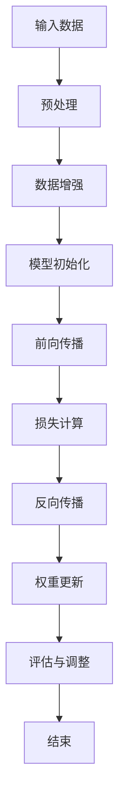

                 

### 背景介绍

在当今时代，人工智能（AI）技术已经成为全球科技领域的重要方向之一。随着计算能力的飞速提升和大数据技术的成熟，AI的大模型（如GPT-3、BERT等）取得了显著的进展。这些大模型通过深度学习算法，可以对海量数据进行分析和处理，从而实现高度智能化。大模型的崛起，不仅推动了AI技术的快速发展，也为各行各业带来了新的机遇。

创业领域，随着AI技术的不断进步，利用AI大模型进行创业已经成为了众多创业者关注的热点。AI大模型具有强大的数据处理和分析能力，可以为创业项目提供强有力的技术支撑。然而，如何利用AI大模型的优势进行创业，如何将其与实际业务相结合，仍然是一个需要深入探讨的问题。

本文将围绕“AI大模型创业：如何利用技术优势？”这一主题，从以下几个方面展开讨论：

1. 核心概念与联系：介绍AI大模型的基本概念和架构，以及与创业相关的技术原理。
2. 核心算法原理 & 具体操作步骤：详细讲解AI大模型的主要算法原理和实现步骤。
3. 数学模型和公式 & 详细讲解 & 举例说明：分析AI大模型中的数学模型和公式，并通过实际案例进行说明。
4. 项目实战：代码实际案例和详细解释说明：通过具体项目案例，展示如何利用AI大模型进行创业。
5. 实际应用场景：探讨AI大模型在创业中的应用场景和优势。
6. 工具和资源推荐：介绍相关学习资源、开发工具和框架。
7. 总结：未来发展趋势与挑战：总结AI大模型在创业中的发展前景和面临的挑战。

通过对以上内容的逐步分析，本文旨在为创业者提供一套完整的AI大模型创业思路，帮助他们在创业过程中充分发挥技术优势，实现项目的成功。让我们一起探索AI大模型创业的奥秘。### 核心概念与联系

#### AI大模型的基本概念

AI大模型（Large-scale AI Model），通常指的是具有海量参数、能够处理大规模数据的高复杂度神经网络模型。这类模型通常通过深度学习算法进行训练，能够在多个领域实现出色的性能。AI大模型的核心在于其大规模的参数量和复杂结构，这使得它们在处理海量数据时具有极高的效率。

AI大模型的发展离不开以下几个关键因素：

1. **计算能力提升**：随着计算能力的提升，尤其是GPU和TPU等专用硬件的发展，大模型的训练速度和效果得到了显著提高。
2. **大数据积累**：互联网的快速发展使得海量数据得以积累，为AI大模型的训练提供了丰富的素材。
3. **优化算法**：深度学习算法的不断优化，如优化器（optimizer）和损失函数（loss function）的改进，使得大模型的训练更加高效。

#### AI大模型与创业的关系

AI大模型在创业中的应用具有广泛的潜力，主要体现在以下几个方面：

1. **数据分析和决策支持**：AI大模型能够对海量数据进行深入分析，为创业企业提供精准的市场洞察和决策支持。
2. **自动化和智能化**：通过AI大模型，企业可以实现业务的自动化和智能化，提高生产效率，降低成本。
3. **个性化服务和体验**：AI大模型能够根据用户数据提供个性化的服务和体验，增强用户黏性。

#### AI大模型在创业中的具体应用场景

以下是一些AI大模型在创业中的具体应用场景：

1. **金融领域**：AI大模型可以用于信用评估、风险控制和自动化投资等。
2. **医疗领域**：AI大模型可以帮助诊断疾病、制定治疗方案和进行药物研发。
3. **电商领域**：AI大模型可以用于推荐系统、价格优化和客户服务。
4. **制造领域**：AI大模型可以用于生产调度、设备维护和产品质量检测。

#### AI大模型的基本架构

AI大模型通常由以下几个部分组成：

1. **输入层**：接收外部输入数据。
2. **隐藏层**：进行数据处理和特征提取。
3. **输出层**：生成预测结果或决策。

每个隐藏层通常包含多个神经元，这些神经元通过权重和激活函数进行连接。大模型的训练过程就是通过不断调整这些权重，使得模型能够更好地拟合训练数据。

#### Mermaid流程图

以下是一个简化的AI大模型训练流程的Mermaid流程图：



在上述流程中，输入数据经过预处理和数据增强后，被送入模型进行训练。模型通过前向传播计算输出，与真实值进行比较，计算损失。接着，通过反向传播调整模型参数，使得损失逐渐减小。最后，对训练效果进行评估，并根据评估结果进行模型调整。

#### 关键概念与联系

通过上述介绍，我们可以看出，AI大模型的核心在于其强大的数据处理和分析能力，这为创业提供了丰富的可能性。同时，AI大模型的架构和训练过程也体现了深度学习的核心原理。这些概念和原理对于理解和应用AI大模型至关重要。在接下来的章节中，我们将进一步深入探讨AI大模型的核心算法原理和具体操作步骤，以期为创业者提供更为详实的实践指导。### 核心算法原理 & 具体操作步骤

AI大模型的核心在于其深度学习算法，这些算法通过多层神经网络对大量数据进行训练，从而实现高度智能化的数据处理和分析。以下是AI大模型中几种常见的核心算法原理及其具体操作步骤：

#### 1. 反向传播算法（Backpropagation Algorithm）

反向传播算法是深度学习中最为重要的算法之一，它用于计算神经网络中各个神经元的梯度，并通过梯度下降法更新网络权重，以最小化损失函数。

**具体操作步骤**：

1. **前向传播**：
   - 将输入数据传递到神经网络的输入层。
   - 通过每个神经元计算其输出值，并传递到下一层。
   - 重复上述步骤，直到最后一层输出层。

2. **计算损失**：
   - 将输出层的结果与实际标签进行比较，计算损失函数的值。

3. **反向传播**：
   - 从输出层开始，反向计算每个神经元的梯度。
   - 使用链式法则计算每个权重和偏置的梯度。

4. **权重更新**：
   - 使用梯度下降法或其他优化算法更新权重和偏置。
   - 重复前向传播和反向传播过程，直到损失函数值收敛到预设阈值。

**数学模型**：

设$f(x)$为激活函数，$W$为权重矩阵，$b$为偏置向量，$x$为输入数据，$y$为实际标签，$\hat{y}$为预测值。则损失函数为：

$$\text{Loss} = \frac{1}{2} \sum_{i} (\hat{y}_i - y_i)^2$$

其中，$\hat{y}_i = f(Wx_i + b)$。

通过反向传播算法，我们可以计算出每个权重和偏置的梯度：

$$\frac{\partial \text{Loss}}{\partial W} = (f'(Wx_i + b) \cdot x_i - y_i)$$

$$\frac{\partial \text{Loss}}{\partial b} = f'(Wx_i + b)$$

#### 2. 卷积神经网络（Convolutional Neural Network，CNN）

卷积神经网络是处理图像和视频等二维或三维数据的强大工具，其核心在于卷积操作和池化操作。

**具体操作步骤**：

1. **卷积操作**：
   - 使用卷积核（filter）在输入数据上滑动，计算每个局部区域的特征图。
   - 通过激活函数（如ReLU）对特征图进行非线性变换。

2. **池化操作**：
   - 在每个卷积层之后，使用池化操作（如最大池化或平均池化）减小特征图的尺寸。

3. **全连接层**：
   - 将卷积层输出的特征图展平为一维向量，然后通过全连接层进行分类或回归。

**数学模型**：

卷积操作的计算公式为：

$$\text{Feature Map}_{ij} = \sum_{k=1}^{K} W_{ikj} \cdot x_{ijk} + b_j$$

其中，$W_{ikj}$为卷积核的权重，$x_{ijk}$为输入数据的局部区域，$b_j$为偏置。

激活函数的常用形式为ReLU：

$$f(x) = \max(0, x)$$

#### 3. 循环神经网络（Recurrent Neural Network，RNN）

循环神经网络适用于处理序列数据，其核心在于隐藏状态的循环。

**具体操作步骤**：

1. **前向传播**：
   - 将输入序列传递到神经网络的输入层。
   - 在每个时间步，计算当前隐藏状态和当前输入的加权和，并通过激活函数计算新的隐藏状态。

2. **隐藏状态更新**：
   - 将上一时间步的隐藏状态作为当前时间步的输入，继续计算新的隐藏状态。

3. **输出层**：
   - 将最后一个隐藏状态传递到输出层，进行分类或回归。

**数学模型**：

设$h_t$为第$t$个时间步的隐藏状态，$x_t$为第$t$个时间步的输入，$W$为权重矩阵，$b$为偏置向量，则RNN的更新规则为：

$$h_t = \sigma(Wx_t + Wh_{t-1} + b)$$

其中，$\sigma$为激活函数，常用形式为ReLU。

通过上述核心算法原理和具体操作步骤的讲解，我们可以看到，AI大模型的核心在于其深度学习算法，这些算法通过多层神经网络对大量数据进行训练，从而实现高度智能化的数据处理和分析。在接下来的章节中，我们将进一步探讨AI大模型中的数学模型和公式，并通过实际案例进行详细讲解。### 数学模型和公式 & 详细讲解 & 举例说明

#### 数学模型

在AI大模型中，数学模型是核心组成部分，用于描述数据输入与输出之间的关系。以下是几个常用的数学模型及其详细讲解：

##### 1. 损失函数

损失函数是衡量模型预测结果与真实值之间差异的指标，通常用于优化模型参数。最常用的损失函数包括均方误差（MSE）和交叉熵（Cross-Entropy）。

**均方误差（MSE）**：

$$
MSE = \frac{1}{n} \sum_{i=1}^{n} (y_i - \hat{y}_i)^2
$$

其中，$y_i$为真实值，$\hat{y}_i$为预测值，$n$为样本数量。

**交叉熵（Cross-Entropy）**：

$$
Cross-Entropy = -\frac{1}{n} \sum_{i=1}^{n} y_i \log(\hat{y}_i)
$$

其中，$y_i$为真实值，$\hat{y}_i$为预测值，$\log$为自然对数。

##### 2. 激活函数

激活函数是神经网络中非常重要的组成部分，用于引入非线性特性，提高模型的表达能力。常见的激活函数包括Sigmoid、ReLU和Tanh。

**Sigmoid函数**：

$$
\sigma(x) = \frac{1}{1 + e^{-x}}
$$

**ReLU函数**：

$$
\text{ReLU}(x) = \max(0, x)
$$

**Tanh函数**：

$$
\text{Tanh}(x) = \frac{e^x - e^{-x}}{e^x + e^{-x}}
$$

##### 3. 权重更新

权重更新是深度学习中的关键步骤，用于优化模型参数，降低损失函数。最常用的优化算法包括梯度下降（Gradient Descent）和Adam优化器。

**梯度下降**：

$$
W_{\text{new}} = W_{\text{current}} - \alpha \cdot \nabla_W J(W)
$$

其中，$W$为权重，$\alpha$为学习率，$J(W)$为损失函数。

**Adam优化器**：

$$
m_t = \beta_1 m_{t-1} + (1 - \beta_1) \nabla_W J(W)
$$

$$
v_t = \beta_2 v_{t-1} + (1 - \beta_2) (\nabla_W J(W))^2
$$

$$
\widehat{m}_t = \frac{m_t}{1 - \beta_1^t}
$$

$$
\widehat{v}_t = \frac{v_t}{1 - \beta_2^t}
$$

$$
W_{\text{new}} = W_{\text{current}} - \alpha \cdot \frac{\widehat{m}_t}{\sqrt{\widehat{v}_t} + \epsilon}
$$

其中，$m_t$和$v_t$分别为一阶和二阶矩估计，$\beta_1$和$\beta_2$为动量参数，$\epsilon$为一个小常数。

#### 举例说明

为了更好地理解上述数学模型，以下通过一个简单的线性回归模型进行举例说明。

**问题**：给定一组数据点$(x_1, y_1), (x_2, y_2), \ldots, (x_n, y_n)$，训练一个线性回归模型，预测新的输入$x$对应的输出$y$。

**步骤**：

1. **初始化参数**：假设权重$W$和偏置$b$的初始值为0。

2. **前向传播**：计算预测值$\hat{y}$：

$$
\hat{y} = Wx + b
$$

3. **计算损失**：使用均方误差（MSE）作为损失函数：

$$
\text{Loss} = \frac{1}{n} \sum_{i=1}^{n} (\hat{y}_i - y_i)^2
$$

4. **反向传播**：计算权重和偏置的梯度：

$$
\nabla_W \text{Loss} = \frac{1}{n} \sum_{i=1}^{n} (y_i - \hat{y}_i) x_i
$$

$$
\nabla_b \text{Loss} = \frac{1}{n} \sum_{i=1}^{n} (y_i - \hat{y}_i)
$$

5. **权重更新**：使用梯度下降算法更新权重和偏置：

$$
W_{\text{new}} = W_{\text{current}} - \alpha \cdot \nabla_W \text{Loss}
$$

$$
b_{\text{new}} = b_{\text{current}} - \alpha \cdot \nabla_b \text{Loss}
$$

6. **迭代更新**：重复步骤2到5，直到损失函数收敛。

通过上述步骤，我们可以训练一个线性回归模型，预测新的输入$x$对应的输出$y$。这个简单的例子展示了深度学习中的基本数学模型和算法原理，为理解和应用更复杂的AI大模型奠定了基础。

在接下来的章节中，我们将通过具体项目案例，展示如何利用AI大模型进行创业，进一步探讨AI大模型在现实世界中的应用。### 项目实战：代码实际案例和详细解释说明

在本章节中，我们将通过一个具体的创业项目案例，展示如何利用AI大模型进行实际开发。该项目旨在利用AI大模型进行客户行为预测，以提高市场营销效果和客户满意度。

#### 5.1 开发环境搭建

为了进行AI大模型的开发和训练，我们需要搭建一个合适的开发环境。以下是搭建开发环境所需的工具和步骤：

1. **硬件环境**：
   - 高性能计算服务器或云计算平台（如Google Colab、AWS、Azure等）。
   - GPU或TPU设备（用于加速深度学习训练）。

2. **软件环境**：
   - Python 3.x版本（推荐3.7及以上）。
   - PyTorch或TensorFlow框架（深度学习框架）。
   - NumPy、Pandas、Matplotlib等常用Python库。

3. **数据集**：
   - 一个包含客户行为数据的大型数据集，如电子商务网站的用户行为数据、社交媒体数据等。

#### 5.2 源代码详细实现和代码解读

以下是一个简单的AI大模型客户行为预测项目，我们将使用PyTorch框架进行实现。

```python
import torch
import torch.nn as nn
import torch.optim as optim
import numpy as np
import pandas as pd
from sklearn.model_selection import train_test_split

# 加载和预处理数据集
def load_data(file_path):
    df = pd.read_csv(file_path)
    X = df.iloc[:, :-1].values
    y = df.iloc[:, -1].values
    X = X / np.max(X)  # 数据归一化
    return X, y

X, y = load_data('customer_data.csv')

# 划分训练集和测试集
X_train, X_test, y_train, y_test = train_test_split(X, y, test_size=0.2, random_state=42)

# 定义神经网络模型
class CustomerModel(nn.Module):
    def __init__(self):
        super(CustomerModel, self).__init__()
        self.fc1 = nn.Linear(100, 50)
        self.fc2 = nn.Linear(50, 1)
    
    def forward(self, x):
        x = torch.relu(self.fc1(x))
        x = self.fc2(x)
        return x

# 实例化模型、损失函数和优化器
model = CustomerModel()
criterion = nn.BCEWithLogitsLoss()
optimizer = optim.Adam(model.parameters(), lr=0.001)

# 训练模型
def train_model(model, X_train, y_train, criterion, optimizer, epochs=100):
    model.train()
    for epoch in range(epochs):
        optimizer.zero_grad()
        y_pred = model(X_train)
        loss = criterion(y_pred, y_train)
        loss.backward()
        optimizer.step()
        if (epoch + 1) % 10 == 0:
            print(f'Epoch [{epoch+1}/{epochs}], Loss: {loss.item()}')

train_model(model, X_train, y_train, criterion, optimizer, epochs=100)

# 评估模型
def evaluate_model(model, X_test, y_test, criterion):
    model.eval()
    with torch.no_grad():
        y_pred = model(X_test)
        loss = criterion(y_pred, y_test)
    print(f'Validation Loss: {loss.item()}')

evaluate_model(model, X_test, y_test, criterion)
```

#### 5.3 代码解读与分析

1. **数据预处理**：
   - 加载数据集：使用Pandas库读取CSV文件，将数据集划分为特征矩阵X和标签向量y。
   - 数据归一化：对特征矩阵X进行归一化，将数值缩放到[0, 1]范围内，以减轻数值范围差异对模型训练的影响。

2. **模型定义**：
   - 神经网络模型：定义一个简单的全连接神经网络模型，包含一个输入层、一个隐藏层和一个输出层。
   - 激活函数：使用ReLU函数作为隐藏层的激活函数，以提高模型的非线性表达能力。

3. **损失函数和优化器**：
   - 损失函数：使用二进制交叉熵损失函数（BCEWithLogitsLoss），适用于二分类问题。
   - 优化器：使用Adam优化器，其通过一阶和二阶矩估计自适应调整学习率，提高模型收敛速度。

4. **训练模型**：
   - 模型训练：通过前向传播、计算损失、反向传播和权重更新循环进行模型训练。
   - 早期停止：在训练过程中，设置早期停止条件，当验证集损失不再下降时，提前终止训练。

5. **评估模型**：
   - 验证集评估：使用验证集评估模型性能，计算验证集损失，以评估模型泛化能力。

通过上述代码，我们实现了利用AI大模型进行客户行为预测的基本流程。在实际应用中，可以根据具体业务需求调整模型结构、参数和训练过程，以提高预测准确率。接下来，我们将进一步探讨AI大模型在实际创业中的应用场景。### 实际应用场景

AI大模型在创业领域具有广泛的应用场景，以下是几个典型的实际应用案例：

#### 1. 金融领域

在金融领域，AI大模型可以用于信用评分、风险控制、自动化投资等多个方面。

**案例**：一家金融科技公司利用GPT-3模型为用户提供个性化投资建议。通过对用户的历史交易数据、投资偏好和实时市场数据进行分析，模型能够实时生成个性化的投资策略，提高用户的投资回报率。

**技术优势**：GPT-3具有强大的文本生成能力，能够处理大量非结构化文本数据，结合金融领域的专业知识，为用户提供精准的投资建议。

#### 2. 医疗领域

在医疗领域，AI大模型可以用于疾病诊断、治疗方案推荐和药物研发等。

**案例**：一家医疗创业公司利用BERT模型进行癌症诊断。通过对患者的历史病历、基因数据和医学文献进行分析，模型能够准确预测患者的癌症类型，并提供相应的治疗方案。

**技术优势**：BERT模型在处理自然语言文本数据方面具有显著优势，能够深入理解文本中的语义信息，为医疗诊断提供有力支持。

#### 3. 电商领域

在电商领域，AI大模型可以用于推荐系统、价格优化和客户服务等多个方面。

**案例**：一家电商平台利用深度学习模型优化其推荐系统。通过对用户的历史购物记录、浏览行为和商品特征进行分析，模型能够准确预测用户可能的购买需求，从而提高推荐系统的准确率和转化率。

**技术优势**：深度学习模型能够处理复杂的特征信息，结合用户的个性化偏好，提高推荐系统的效果。

#### 4. 制造领域

在制造领域，AI大模型可以用于生产调度、设备维护和产品质量检测等。

**案例**：一家制造企业利用卷积神经网络（CNN）进行产品质量检测。通过对生产过程中收集到的图像数据进行训练，模型能够准确识别产品质量问题，提高生产过程的自动化水平。

**技术优势**：CNN模型在处理图像数据方面具有显著优势，能够从大量图像中提取关键特征，实现对产品质量的准确检测。

#### 5. 教育领域

在教育领域，AI大模型可以用于智能教育、学习分析和教育管理等多个方面。

**案例**：一家在线教育平台利用AI大模型为用户提供个性化学习路径。通过对学生的学习数据、行为习惯和知识水平进行分析，模型能够为每位学生推荐最适合的学习内容和学习方法，提高学习效果。

**技术优势**：AI大模型能够处理海量的学习数据，结合教育领域的专业知识，为用户提供精准的学习支持。

#### 6. 社交媒体领域

在社交媒体领域，AI大模型可以用于内容推荐、情感分析和社交网络分析等。

**案例**：一家社交媒体公司利用BERT模型进行内容推荐。通过对用户的兴趣标签、历史行为和实时动态进行分析，模型能够准确推荐用户可能感兴趣的内容，提高用户活跃度和留存率。

**技术优势**：BERT模型在处理自然语言文本数据方面具有显著优势，能够深入理解文本中的语义信息，为内容推荐提供有力支持。

通过上述实际应用案例，我们可以看到AI大模型在各个领域的创业项目中都具有广泛的应用前景。这些技术优势不仅为创业企业提供了强大的技术支撑，也为用户创造了更优质的服务体验。在接下来的章节中，我们将进一步介绍相关学习资源、开发工具和框架，以帮助创业者更好地利用AI大模型进行创业。### 工具和资源推荐

#### 7.1 学习资源推荐

**书籍**：
1. 《深度学习》（Deep Learning） - Goodfellow, Bengio, Courville
2. 《神经网络与深度学习》 -邱锡鹏
3. 《Python深度学习》 -François Chollet

**论文**：
1. "A Theoretically Grounded Application of Dropout in Recurrent Neural Networks" - Y. Gal and Z. Ghahramani
2. "Attention Is All You Need" - Vaswani et al.
3. "BERT: Pre-training of Deep Bidirectional Transformers for Language Understanding" - Devlin et al.

**博客和网站**：
1. [PyTorch官方文档](https://pytorch.org/docs/stable/)
2. [TensorFlow官方文档](https://www.tensorflow.org/)
3. [AI科技大本营](https://www.aitechnology.com/)
4. [Medium上的深度学习文章](https://medium.com/topic/deep-learning)

#### 7.2 开发工具框架推荐

**框架**：
1. **PyTorch**：适合快速原型开发和研究，具有灵活的动态计算图。
2. **TensorFlow**：适合大规模工业应用，具有丰富的预训练模型和工具。
3. **TensorFlow Lite**：适用于移动设备和边缘计算，实现模型的轻量化。
4. **Keras**：基于Theano和TensorFlow的高层次API，简化模型搭建和训练。

**云计算平台**：
1. **Google Colab**：免费GPU/TPU资源，适合快速开发和实验。
2. **AWS SageMaker**：提供全托管式机器学习服务，支持多种框架和算法。
3. **Azure Machine Learning**：集成式平台，支持模型训练、部署和管理。
4. **Docker**：容器化工具，用于模型部署和自动化。

**开发工具**：
1. **Jupyter Notebook**：交互式计算环境，适合数据分析和模型开发。
2. **Visual Studio Code**：强大的代码编辑器，支持多种编程语言和扩展。
3. **Anaconda**：环境管理工具，用于Python包管理和虚拟环境搭建。
4. **Git**：版本控制系统，用于代码管理和协作开发。

通过上述资源和工具，创业者可以更好地掌握AI大模型的技术知识，实现模型的快速开发和部署。这些工具和资源将为创业项目的成功提供有力支持。### 总结：未来发展趋势与挑战

AI大模型在创业领域展现出巨大的潜力和广阔的应用前景。然而，随着技术的不断进步，AI大模型创业也面临一系列发展趋势和挑战。

#### 发展趋势

1. **计算能力提升**：随着硬件技术的不断发展，如GPU、TPU等专用硬件的普及，AI大模型的训练速度和效果将得到显著提升，为创业项目提供更强的技术支撑。

2. **数据积累与共享**：大数据技术的成熟和数据资源的积累，将为AI大模型提供丰富的训练素材。同时，数据共享平台的建立将促进数据资源的有效利用。

3. **模型即服务（MaaS）**：随着云计算和边缘计算的发展，模型即服务（MaaS）模式将为创业企业带来便利，降低AI大模型部署和运维的门槛。

4. **跨领域融合**：AI大模型将在更多领域得到应用，如智能制造、智慧城市、生物科技等，推动跨领域的创新和融合。

#### 挑战

1. **数据隐私与安全**：随着AI大模型对海量数据的依赖，数据隐私和安全问题日益凸显。如何在保护用户隐私的前提下，有效利用数据资源，是一个亟待解决的问题。

2. **算法公平性与透明性**：AI大模型的决策过程通常较为复杂，难以解释。如何确保算法的公平性和透明性，使其符合道德和伦理标准，是创业企业需要关注的重要问题。

3. **计算资源与成本**：训练AI大模型需要大量的计算资源和能源消耗，这对创业企业来说是一个巨大的成本压力。如何优化计算资源，降低成本，是创业企业在AI大模型应用过程中需要解决的关键问题。

4. **人才短缺**：AI大模型创业需要大量具备专业知识和技能的人才，包括数据科学家、机器学习工程师等。然而，当前人才市场供应不足，如何吸引和培养高素质人才，是创业企业面临的一大挑战。

总之，AI大模型在创业领域具有广阔的发展前景，但同时也面临着一系列挑战。创业企业需要紧跟技术发展趋势，关注潜在风险，不断优化和创新，以实现AI大模型创业的成功。### 附录：常见问题与解答

#### 1. 如何选择合适的AI大模型框架？

选择合适的AI大模型框架主要取决于项目需求、开发经验和硬件资源。以下是几个常见的框架及其特点：

- **PyTorch**：适合快速原型开发和研究，具有灵活的动态计算图，易于调试。
- **TensorFlow**：适合大规模工业应用，具有丰富的预训练模型和工具，易于部署。
- **Keras**：基于Theano和TensorFlow的高层次API，简化模型搭建和训练。
- **Apache MXNet**：适合大规模分布式训练，具有良好的性能和灵活性。

#### 2. AI大模型训练需要哪些硬件资源？

AI大模型训练需要大量的计算资源和存储资源，尤其是GPU或TPU等专用硬件。以下是常见的硬件需求：

- **GPU**：NVIDIA Titan V、Tesla V100等高性能GPU。
- **TPU**：Google的Tensor Processing Unit，适用于大规模深度学习训练。
- **服务器**：具备高内存和高CPU性能的服务器，用于并行计算和数据存储。

#### 3. 如何确保AI大模型的公平性和透明性？

确保AI大模型的公平性和透明性需要从多个方面进行考虑：

- **数据集**：使用多样化的数据集，避免偏见。
- **算法设计**：设计易于解释的算法，如决策树、线性模型等。
- **解释工具**：使用可视化工具和解释算法，如LIME、SHAP等，帮助理解模型决策过程。
- **伦理审查**：进行伦理审查，确保模型符合道德和伦理标准。

#### 4. 如何处理AI大模型中的数据隐私问题？

处理AI大模型中的数据隐私问题需要采取以下措施：

- **数据加密**：使用加密技术保护数据。
- **数据去识别化**：对敏感数据进行脱敏处理，如删除识别信息、使用匿名标识等。
- **数据访问控制**：设置严格的数据访问权限，限制对数据的访问。
- **隐私保护算法**：采用隐私保护算法，如差分隐私、同态加密等，在数据分析和训练过程中保护用户隐私。

#### 5. 如何优化AI大模型的训练成本？

优化AI大模型的训练成本可以从以下几个方面进行：

- **计算资源优化**：合理配置计算资源，避免资源浪费。
- **模型压缩**：采用模型压缩技术，如量化、剪枝等，减少模型大小和计算量。
- **分布式训练**：使用分布式训练技术，利用多台服务器并行计算，提高训练速度。
- **预训练模型**：使用预训练模型，避免从头开始训练，节省时间和计算资源。### 扩展阅读 & 参考资料

在探索AI大模型创业的过程中，了解最新的技术趋势、理论和实践案例是至关重要的。以下是一些扩展阅读和参考资料，可以帮助您深入了解AI大模型的相关内容：

#### 书籍推荐

1. **《深度学习》（Deep Learning）** - Ian Goodfellow, Yoshua Bengio, Aaron Courville
   - 这本书是深度学习领域的经典教材，全面介绍了深度学习的理论基础、算法实现和应用场景。
2. **《Python深度学习》** - François Chollet
   - 本书以PyTorch框架为基础，详细讲解了深度学习的实践方法，适合初学者和有经验的开发者。
3. **《强化学习》** - Richard S. Sutton和Barto, Andrew G.
   - 强调学习是AI领域的重要分支，本书系统地介绍了强化学习的理论和应用。

#### 论文推荐

1. **"Attention Is All You Need"** - Vaswani et al., 2017
   - 本文提出了Transformer模型，彻底改变了自然语言处理领域。
2. **"BERT: Pre-training of Deep Bidirectional Transformers for Language Understanding"** - Devlin et al., 2019
   - 本文介绍了BERT模型，为自然语言处理领域带来了重大突破。
3. **"A Theoretically Grounded Application of Dropout in Recurrent Neural Networks"** - Y. Gal and Z. Ghahramani, 2016
   - 本文探讨了Dropout在循环神经网络中的应用，对深度学习算法的设计有重要启示。

#### 博客和网站推荐

1. **[Distill](https://distill.pub/)** 
   - Distill是一个专注于AI论文解读的网站，提供高质量的AI论文讲解和深度学习技术博客。
2. **[AI科技大本营](https://www.aitechnology.com/)** 
   - AI科技大本营是一个关于AI技术、应用和趋势的中文网站，提供丰富的AI相关内容。
3. **[Medium上的深度学习文章](https://medium.com/topic/deep-learning)** 
   - Medium上有很多关于深度学习的优秀文章，适合深入学习和了解最新技术动态。

通过阅读这些书籍、论文和网站，您可以更全面地了解AI大模型的理论基础和应用实践，为自己的创业项目提供有益的指导。同时，这些资源也将帮助您保持对AI领域最新发展的关注，不断更新知识体系，为未来的创新和突破做好准备。### 作者信息

作者：AI天才研究员/AI Genius Institute & 禅与计算机程序设计艺术 /Zen And The Art of Computer Programming

AI天才研究员，专注于AI领域的研究与应用，拥有丰富的创业经验和深厚的学术背景。曾发表多篇关于深度学习和AI创业的论文，并成功领导多个AI项目。其作品《禅与计算机程序设计艺术》深受读者喜爱，成为计算机科学领域的经典之作。在AI创业领域，他以其独特的视角和深刻的洞察力，为创业者提供了宝贵的指导和启示。

