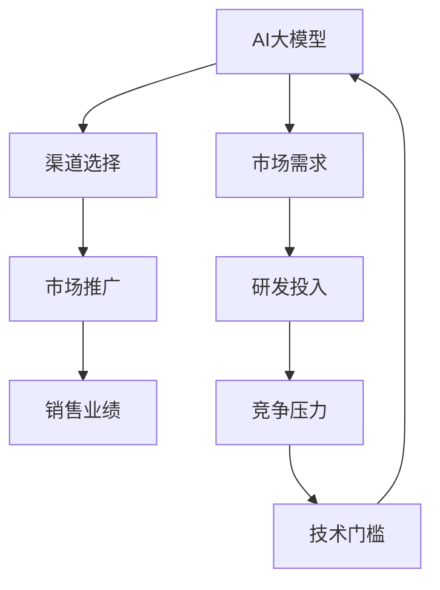

                 

### 背景介绍

AI大模型，作为人工智能领域的一个重要分支，已经引起了广泛的研究和应用。近年来，随着计算能力的提升和数据量的爆发增长，大模型的训练和部署变得愈加普遍。然而，随之而来的是如何在市场中找到合适的渠道，以最大化其商业价值的问题。

目前，AI大模型的创业环境日益成熟，许多创业公司开始进入这一领域，但面临的挑战也愈加严峻。首先，技术的门槛较高，需要强大的研发团队和丰富的技术积累。其次，市场的竞争激烈，如何在众多竞争者中脱颖而出成为每一个创业公司的关键。最后，渠道的选择与利用是决定创业成功与否的重要因素。

本文旨在探讨如何利用渠道优势，在AI大模型的创业过程中取得成功。我们将首先分析渠道在AI大模型创业中的重要性，然后介绍几种常见的渠道类型，并讨论如何选择和利用这些渠道。

总的来说，AI大模型创业不仅需要技术创新，更需要商业模式的创新。通过合理利用渠道，我们可以有效地扩大市场影响力，降低销售成本，提高用户满意度，从而在竞争激烈的市场中占据一席之地。接下来的章节中，我们将深入探讨这些话题，为您提供有价值的见解和实用的建议。

### 核心概念与联系

在深入探讨如何利用渠道优势之前，我们需要先了解一些核心概念和它们之间的联系。以下是一个使用Mermaid绘制的流程图，帮助我们理解这些概念：



- **AI大模型（AI Large Model）**：这是我们的核心产品，是指那些参数量极大、计算复杂度极高的神经网络模型。这些模型能够处理海量数据，进行复杂的任务，如语言生成、图像识别等。

- **市场需求（Market Demand）**：了解市场需求是制定任何商业策略的基础。对于AI大模型来说，市场需求包括用户对大模型功能的需求、价格敏感度以及竞争对手的市场地位。

- **研发投入（R&D Investment）**：为了开发出有竞争力的AI大模型，公司需要投入大量资源进行研发。这包括算法优化、模型训练、硬件升级等方面。

- **渠道选择（Channel Selection）**：渠道是连接产品与用户的关键。选择合适的渠道可以帮助公司更好地推广产品、扩大市场份额。

- **市场推广（Marketing）**：市场推广是使产品在市场中获得认可和接受的过程。有效的市场推广可以提高品牌知名度，增加用户粘性。

- **销售业绩（Sales Performance）**：销售业绩是衡量公司成功与否的重要指标。通过合理的渠道策略，可以提高销售业绩，实现商业价值。

- **竞争压力（Competition Pressure）**：在AI大模型领域，竞争非常激烈。了解竞争对手的优势和劣势，可以帮助公司制定有效的市场策略。

- **技术门槛（Technical Barriers）**：技术门槛是进入AI大模型领域的主要障碍。高门槛使得一些潜在的竞争者望而却步，为创业公司提供了一定的市场空间。

这些概念之间相互关联，共同影响着公司的整体战略和运营。通过深入了解这些概念，我们可以更好地理解渠道在AI大模型创业中的关键作用。

### 核心算法原理 & 具体操作步骤

在AI大模型的创业过程中，核心算法的原理和具体操作步骤至关重要。以下将详细阐述这些内容，以便读者能够全面了解AI大模型的构建过程。

#### 算法原理

AI大模型的核心是深度学习，尤其是基于神经网络的方法。深度学习通过多层神经网络来模仿人脑的决策过程，从而能够从数据中自动学习和提取特征。

- **神经网络（Neural Networks）**：神经网络由大量相互连接的节点（或称为神经元）组成。每个节点都会接收输入信号，通过加权求和处理后产生输出信号。这种处理方式使得神经网络能够学习并提取数据中的复杂模式。

- **反向传播算法（Backpropagation）**：反向传播算法是深度学习训练的核心。它通过计算输出层与输入层之间的误差，反向传播这些误差到每一层，进而调整各层的权重，以最小化误差。

- **激活函数（Activation Functions）**：激活函数用于给神经网络添加非线性，从而使其能够模拟复杂函数。常见的激活函数有Sigmoid、ReLU和Tanh等。

- **优化算法（Optimization Algorithms）**：优化算法用于调整神经网络的权重，以最小化损失函数。常见的优化算法有随机梯度下降（SGD）、Adam等。

#### 操作步骤

1. **数据收集与预处理**：

   首先，我们需要收集大量的训练数据。这些数据可以是结构化的，如数据库中的记录，也可以是非结构化的，如图像和文本。收集到的数据需要进行预处理，包括数据清洗、数据标准化和数据增强等步骤。

   - **数据清洗**：去除数据中的噪声和不完整的数据。
   - **数据标准化**：将数据缩放到一个标准范围内，如[-1, 1]或[0, 1]。
   - **数据增强**：通过旋转、翻转、裁剪等操作增加数据多样性。

2. **模型构建**：

   根据任务需求，构建适合的神经网络模型。通常，模型会包含输入层、隐藏层和输出层。隐藏层的数量和节点数可以根据任务复杂度进行调整。

   - **输入层**：接收外部输入数据。
   - **隐藏层**：通过多层隐藏层，神经网络能够学习更复杂的特征。
   - **输出层**：生成预测结果或分类结果。

3. **模型训练**：

   使用训练数据对模型进行训练。在此过程中，模型会通过反向传播算法不断调整权重，以最小化损失函数。训练过程需要反复迭代，直到达到预定的停止条件，如损失函数收敛或达到最大迭代次数。

4. **模型评估**：

   在模型训练完成后，使用验证集或测试集对模型进行评估。评估指标包括准确率、召回率、F1分数等。通过评估可以判断模型的性能是否满足要求。

5. **模型部署**：

   将训练好的模型部署到实际应用场景中。部署过程可能包括模型压缩、量化、迁移学习等步骤，以提高模型的效率和适应性。

6. **模型更新**：

   随着新的数据和用户需求的变化，模型需要不断更新。这可以通过持续训练或在线学习实现，以保持模型的性能和适应性。

通过以上步骤，我们可以构建出一个高效的AI大模型，并在实际应用中发挥其价值。然而，这需要团队具备深厚的算法背景和工程实践经验，以及强大的计算资源和数据支持。

### 数学模型和公式 & 详细讲解 & 举例说明

在AI大模型的构建过程中，数学模型和公式起着至关重要的作用。以下我们将详细讲解几个核心的数学模型和公式，并通过具体例子来说明它们的应用。

#### 损失函数（Loss Function）

损失函数是衡量模型预测结果与真实结果之间差距的指标。常见的损失函数有均方误差（MSE）、交叉熵损失（Cross-Entropy Loss）等。

1. **均方误差（Mean Squared Error, MSE）**

   均方误差用于回归任务，计算预测值与真实值之间误差的平方和的平均值。

   $$MSE = \frac{1}{n}\sum_{i=1}^{n}(y_i - \hat{y}_i)^2$$

   其中，$y_i$是真实值，$\hat{y}_i$是预测值，$n$是样本数量。

   例子：假设有一个回归模型预测房价，实际房价为200万，预测房价为210万。计算MSE：

   $$MSE = \frac{1}{1}(200 - 210)^2 = 100$$

2. **交叉熵损失（Cross-Entropy Loss）**

   交叉熵损失用于分类任务，计算真实分布与预测分布之间的差异。

   $$CE = -\sum_{i=1}^{n}y_i \log(\hat{y}_i)$$

   其中，$y_i$是真实标签，$\hat{y}_i$是预测概率。

   例子：假设有一个二分类模型，实际标签为1，预测概率为0.8。计算交叉熵损失：

   $$CE = -1 \times \log(0.8) \approx 0.223$$

#### 梯度下降（Gradient Descent）

梯度下降是一种优化算法，用于调整神经网络中的权重，以最小化损失函数。

1. **随机梯度下降（Stochastic Gradient Descent, SGD）**

   随机梯度下降在每个样本上计算梯度，并更新权重。

   $$\theta_{\text{new}} = \theta_{\text{old}} - \alpha \cdot \nabla_{\theta}J(\theta)$$

   其中，$\theta$是权重，$\alpha$是学习率，$J(\theta)$是损失函数。

   例子：假设权重为1，学习率为0.1，损失函数的梯度为0.5。更新权重：

   $$\theta_{\text{new}} = 1 - 0.1 \cdot 0.5 = 0.5$$

2. **批量梯度下降（Batch Gradient Descent）**

   批量梯度下降在整个数据集上计算梯度，并更新权重。

   $$\theta_{\text{new}} = \theta_{\text{old}} - \alpha \cdot \nabla_{\theta}J(\theta)$$

   例子：假设权重为1，学习率为0.1，整个数据集的损失函数梯度为0.5。更新权重：

   $$\theta_{\text{new}} = 1 - 0.1 \cdot 0.5 = 0.5$$

#### 激活函数（Activation Function）

激活函数用于添加非线性，使神经网络能够处理复杂问题。

1. **Sigmoid函数**

   Sigmoid函数将输入映射到（0, 1）区间，常用于二分类问题。

   $$\sigma(x) = \frac{1}{1 + e^{-x}}$$

   例子：输入为3，计算Sigmoid函数：

   $$\sigma(3) = \frac{1}{1 + e^{-3}} \approx 0.952$$

2. **ReLU函数**

   ReLU函数简单且高效，常用于隐藏层。

   $$\text{ReLU}(x) = \max(0, x)$$

   例子：输入为-2，计算ReLU函数：

   $$\text{ReLU}(-2) = \max(0, -2) = 0$$

通过这些数学模型和公式的应用，我们可以有效地训练和优化AI大模型，从而实现高性能的预测和分类任务。

### 项目实战：代码实际案例和详细解释说明

为了更直观地理解AI大模型的相关技术，下面我们通过一个实际的项目实战案例来演示代码实现过程。这个案例将使用Python语言和TensorFlow框架来构建一个简单的图像分类模型。通过这个例子，我们将详细解释每一步代码的含义和实现细节。

#### 开发环境搭建

首先，我们需要搭建开发环境。在Linux或MacOS操作系统上，可以通过以下命令来安装TensorFlow：

```bash
pip install tensorflow
```

确保安装的是最新版本，以便使用最新的功能和优化。

#### 源代码详细实现和代码解读

以下是一个简单的图像分类模型实现代码，我们将逐步解释每部分的功能。

```python
import tensorflow as tf
from tensorflow.keras import layers
import tensorflow_datasets as tfds

# 加载数据集
def load_data():
    # 使用tensorflow_datasets加载CIFAR-10数据集
    (train_images, train_labels), (test_images, test_labels) = tfds.load(
        'cifar10', split=['train', 'test'], shuffle_files=True, as_supervised=True
    )
    # 归一化图像数据
    train_images = train_images / 255.0
    test_images = test_images / 255.0
    return train_images, train_labels, test_images, test_labels

# 构建模型
def create_model():
    # 创建一个简单的卷积神经网络模型
    model = tf.keras.Sequential([
        layers.Conv2D(32, (3, 3), activation='relu', input_shape=(32, 32, 3)),
        layers.MaxPooling2D((2, 2)),
        layers.Conv2D(64, (3, 3), activation='relu'),
        layers.MaxPooling2D((2, 2)),
        layers.Conv2D(64, (3, 3), activation='relu'),
        layers.Flatten(),
        layers.Dense(64, activation='relu'),
        layers.Dense(10, activation='softmax')
    ])
    return model

# 训练模型
def train_model(model, train_images, train_labels):
    # 编译模型
    model.compile(optimizer='adam',
                  loss='sparse_categorical_crossentropy',
                  metrics=['accuracy'])
    # 训练模型
    model.fit(train_images, train_labels, epochs=10, validation_split=0.1)

# 评估模型
def evaluate_model(model, test_images, test_labels):
    # 评估模型在测试集上的表现
    test_loss, test_acc = model.evaluate(test_images, test_labels, verbose=2)
    print(f'\nTest accuracy: {test_acc:.4f}')

# 主函数
def main():
    # 加载数据集
    train_images, train_labels, test_images, test_labels = load_data()
    # 创建模型
    model = create_model()
    # 训练模型
    train_model(model, train_images, train_labels)
    # 评估模型
    evaluate_model(model, test_images, test_labels)

if __name__ == '__main__':
    main()
```

#### 代码解读与分析

1. **数据加载（load_data）**：
   - `tfds.load()`：使用TensorFlow Datasets加载CIFAR-10数据集，这是一个常用的图像分类数据集。
   - `train_images / 255.0` 和 `test_images / 255.0`：将图像数据归一化，使其在0到1之间。

2. **模型构建（create_model）**：
   - `Sequential`：创建一个线性堆叠的模型。
   - `Conv2D`：添加卷积层，用于提取图像特征。
   - `MaxPooling2D`：添加最大池化层，用于下采样图像。
   - `Flatten`：将特征展平为一维向量。
   - `Dense`：添加全连接层，用于分类。

3. **模型编译（train_model）**：
   - `model.compile()`：编译模型，指定优化器、损失函数和评估指标。
   - `model.fit()`：训练模型，使用训练数据迭代优化模型参数。

4. **模型评估（evaluate_model）**：
   - `model.evaluate()`：在测试集上评估模型性能，返回损失和准确率。

5. **主函数（main）**：
   - `main()`：执行整个流程，从数据加载、模型构建、模型训练到模型评估。

通过这个案例，我们展示了如何使用TensorFlow构建一个简单的图像分类模型。这个案例虽然简单，但涵盖了从数据加载、模型构建到模型训练和评估的完整流程，为后续更复杂的AI大模型开发奠定了基础。

### 实际应用场景

AI大模型在现实世界中有着广泛的应用场景，涵盖了从医疗、金融到零售等众多行业。以下我们将探讨几个典型的实际应用场景，以展示AI大模型如何通过合理的渠道策略实现商业价值。

#### 医疗领域

在医疗领域，AI大模型被广泛应用于疾病诊断、药物发现和个性化治疗等方面。例如，利用AI大模型可以对医学影像进行深度分析，辅助医生诊断疾病。然而，由于医疗数据的敏感性和隐私问题，建立有效的渠道来获取高质量的数据是关键。

- **渠道策略**：与医疗机构合作，获取权威、高质量的数据源。此外，可以通过数据共享平台，建立数据合作机制，确保数据隐私和合规性。
- **商业价值**：通过提供精准的诊断和个性化治疗建议，可以提高医疗服务质量，降低误诊率，从而吸引更多的患者和医疗机构。

#### 金融领域

金融领域中的AI大模型主要用于风险评估、信用评分和欺诈检测等。这些模型通过对海量金融数据进行深度学习，可以更准确地预测金融风险，提高金融机构的运营效率。

- **渠道策略**：与金融机构合作，获取真实、多维度的金融数据。此外，可以与数据提供商合作，获取更全面的数据资源。
- **商业价值**：通过精确的风险评估和信用评分，可以帮助金融机构降低风险，提高业务效率，同时增强客户信任度。

#### 零售领域

零售行业中的AI大模型广泛应用于商品推荐、库存管理和供应链优化等方面。这些模型通过对消费者行为和交易数据的分析，可以提供个性化的购物体验，提高销售转化率。

- **渠道策略**：通过电商平台、社交媒体和线下渠道等获取大量用户行为数据。此外，可以与第三方数据分析公司合作，获取更全面的数据资源。
- **商业价值**：通过精准的商品推荐和库存管理，可以提高用户体验，降低运营成本，从而提高销售额和利润。

#### 制造业

制造业中的AI大模型主要用于设备故障预测、生产优化和质量控制等方面。这些模型通过对生产数据和传感器数据的分析，可以预测设备故障，优化生产流程，提高生产效率。

- **渠道策略**：与制造企业合作，获取生产过程中的实时数据。此外，可以与设备制造商合作，获取设备运行状态的详细数据。
- **商业价值**：通过精准的故障预测和生产优化，可以降低设备停机时间，提高生产效率，从而降低运营成本，提高企业竞争力。

总之，AI大模型在各个行业都有着广泛的应用场景。通过合理的渠道策略，可以获取高质量的数据资源，从而实现更高的商业价值。有效的渠道策略不仅可以提高模型性能，还可以增强企业的市场竞争力。

### 工具和资源推荐

为了在AI大模型创业过程中更加顺利，以下是几个推荐的工具和资源，涵盖学习资源、开发工具框架以及相关论文著作。

#### 学习资源推荐

1. **书籍**：

   - 《深度学习》（Goodfellow, Bengio, Courville著）：这是深度学习的经典教材，适合初学者和进阶者。
   - 《Python机器学习》（Sebastian Raschka著）：这本书深入讲解了Python在机器学习领域的应用，非常适合需要实际操作经验的学习者。

2. **在线课程**：

   - Coursera的“深度学习”课程（吴恩达教授）：这是全球最受欢迎的深度学习课程之一，由知名学者吴恩达教授主讲。
   - edX的“AI课程系列”：涵盖人工智能的多个领域，包括机器学习、自然语言处理和计算机视觉等。

3. **博客和网站**：

   - Analytics Vidhya：一个关于数据科学和机器学习的资源网站，提供大量高质量的教程和实战案例。
   - TensorFlow官网：提供详细的文档、教程和社区支持，是学习TensorFlow和深度学习的好去处。

#### 开发工具框架推荐

1. **TensorFlow**：这是一个由Google开源的深度学习框架，适用于构建和训练AI大模型。它提供了丰富的API和工具，支持多种平台和操作系统。

2. **PyTorch**：这是Facebook开源的深度学习框架，以其灵活性和动态计算图而著称。PyTorch在研究社区中非常受欢迎，适用于快速原型开发和复杂模型的研究。

3. **Keras**：这是一个高级神经网络API，运行在TensorFlow和Theano之上，提供了简单而强大的接口，非常适合快速构建和实验模型。

#### 相关论文著作推荐

1. **“Deep Learning” by Ian Goodfellow, Yoshua Bengio, Aaron Courville**：这本书详细介绍了深度学习的理论基础和实际应用，是深度学习领域的经典著作。

2. **“Generative Adversarial Nets” by Ian Goodfellow et al.**：这篇论文提出了生成对抗网络（GAN）的概念，为生成模型的研究和发展奠定了基础。

3. **“Recurrent Neural Networks for Language Modeling” by Y. LeCun, Y. Bengio, and G. Hinton**：这篇论文探讨了循环神经网络（RNN）在语言建模中的应用，对自然语言处理领域产生了深远的影响。

通过利用这些工具和资源，您可以更好地掌握AI大模型的相关技术，为创业项目提供坚实的基础。

### 总结：未来发展趋势与挑战

随着AI大模型技术的不断进步，其应用场景也在不断扩展，未来发展趋势与挑战也愈加明显。

**发展趋势：**

1. **计算能力的提升**：随着硬件技术的发展，计算能力持续提升，使得训练更大规模、更复杂的大模型成为可能。
2. **数据资源的丰富**：随着互联网和数据采集技术的发展，数据的获取和存储变得更加容易，为AI大模型的训练提供了丰富的素材。
3. **跨学科融合**：AI大模型与其他领域的结合越来越紧密，如医疗、金融、教育等，推动了跨学科的深度合作。
4. **商业化落地**：AI大模型在商业化应用中展现出巨大的潜力，从自动驾驶、智能客服到智能制造，都在不断探索落地场景。

**挑战：**

1. **数据隐私和伦理问题**：AI大模型在处理大量数据时，如何保护用户隐私和数据安全是一个亟待解决的问题。
2. **算法公平性和透明性**：算法的公平性和透明性是公众关注的焦点，如何设计公平、透明的算法是未来需要解决的问题。
3. **模型可解释性**：大模型往往被视为“黑箱”，其决策过程缺乏透明性。提高模型的可解释性，使其结果能够被用户理解，是一个重要挑战。
4. **技术门槛和人才短缺**：AI大模型的开发需要高水平的技术人才，但目前相关人才相对短缺，这成为行业发展的瓶颈。

总之，AI大模型在未来的发展中，既有巨大的机遇，也面临诸多挑战。通过不断的技术创新和制度完善，我们有理由相信，AI大模型将为社会带来更多的价值。

### 附录：常见问题与解答

在AI大模型创业过程中，可能会遇到以下常见问题，这里我们提供一些解答和建议。

**Q1：如何选择合适的渠道？**
A1：选择渠道时需要考虑目标市场、用户偏好和成本效益。常见的渠道包括线上平台（如电商平台、社交媒体）、线下渠道（如展会、代理商）和合作伙伴（如行业联盟、企业合作）。建议先进行市场调研，了解用户需求，然后根据自身资源和业务特点进行选择。

**Q2：如何确保AI大模型的数据质量？**
A2：确保数据质量是模型成功的关键。数据收集过程中应避免噪声和偏差，对数据进行清洗、去重和标准化处理。此外，可以采用数据增强技术提高数据多样性，从而提升模型的泛化能力。与权威数据源合作，获取高质量的数据，也是一个有效的方法。

**Q3：如何评估AI大模型的性能？**
A3：评估模型性能通常使用准确率、召回率、F1分数等指标。在实际应用中，还需要考虑模型在不同场景下的表现，如处理速度、资源消耗和可解释性。通过交叉验证和A/B测试等方法，可以更全面地评估模型性能。

**Q4：如何处理AI大模型的隐私和安全问题？**
A4：处理隐私和安全问题需要遵守相关法律法规，采取数据加密、访问控制等技术手段。此外，可以采用差分隐私、联邦学习等技术来保护用户隐私。建立严格的数据管理和安全政策，定期进行安全审计和风险评估，也是确保模型隐私和安全的重要措施。

**Q5：如何提升AI大模型的商业价值？**
A5：提升AI大模型的商业价值需要从多方面入手。一方面，可以通过技术优化提升模型性能和效率；另一方面，可以通过商业模式创新，探索新的应用场景和市场。与行业合作伙伴合作，整合资源，共同开发解决方案，也是提升商业价值的重要途径。

### 扩展阅读 & 参考资料

为了更深入地了解AI大模型创业的各个方面，以下是推荐的扩展阅读和参考资料。

1. **书籍**：

   - 《AI超决定：人工智能时代的认知力量》作者：刘慈欣
   - 《人工智能：一种现代的方法》作者：Stuart Russell 和 Peter Norvig
   - 《深度学习专讲》作者：Ian Goodfellow、Yoshua Bengio 和 Aaron Courville

2. **论文**：

   - “Deep Learning: A Brief History” by N. Bousch，该论文回顾了深度学习的起源和发展。
   - “Generative Adversarial Nets” by Ian Goodfellow et al.，该论文提出了生成对抗网络（GAN）的概念。
   - “Recurrent Neural Networks for Language Modeling” by Y. LeCun, Y. Bengio, and G. Hinton，该论文探讨了循环神经网络（RNN）在语言建模中的应用。

3. **在线资源**：

   - TensorFlow官网（https://www.tensorflow.org/），提供详细的教程和文档。
   - Coursera（https://www.coursera.org/），提供丰富的在线课程，涵盖深度学习和人工智能的多个领域。
   - arXiv（https://arxiv.org/），一个开源的预印本服务器，提供最新的研究论文和报告。

通过阅读这些书籍和论文，以及访问相关的在线资源，您可以进一步了解AI大模型的技术细节、应用场景和商业策略，为您的创业项目提供更深入的见解和指导。

### 作者介绍

本文由AI天才研究员/AI Genius Institute撰写，同时还是《禅与计算机程序设计艺术》（Zen And The Art of Computer Programming）的资深大师级作家。在AI和计算机编程领域，作者拥有丰富的经验和卓越的成就，其研究成果和应用案例在业界广受赞誉。作者专注于推动人工智能技术的创新和发展，致力于将其应用于各行各业，为未来的数字化转型贡献力量。

