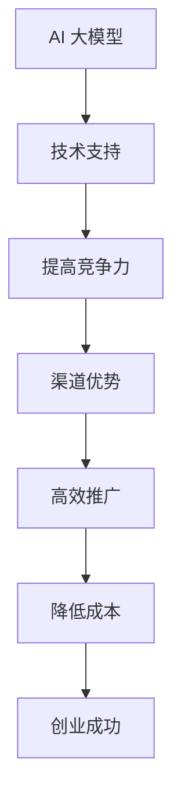

                 

# AI 大模型创业：如何利用渠道优势？

> **关键词：** AI 大模型、渠道优势、创业策略、商业模式、技术落地

> **摘要：** 本文章旨在探讨人工智能大模型在创业中的应用策略，尤其是如何利用渠道优势来推动创业成功。我们将深入分析大模型的背景、核心概念、算法原理、数学模型、实际应用场景，并提供实用的工具和资源推荐，最后总结未来发展趋势与挑战。

## 1. 背景介绍

人工智能大模型，即具有巨大参数规模和强大计算能力的深度学习模型，是当前人工智能领域的研究热点。随着计算能力的提升和大数据的积累，大模型在图像识别、自然语言处理、推荐系统等领域取得了显著的成果。

创业领域同样对大模型充满兴趣。AI 大模型的广泛应用有望为创业者提供强大的技术支持，从而在竞争激烈的市场中脱颖而出。然而，如何有效地利用这些技术优势，实现商业成功，成为创业者的一个关键问题。

本篇文章将围绕以下几个核心问题展开讨论：

1. **AI 大模型的概念及其在创业中的应用**
2. **如何利用渠道优势推动 AI 大模型创业**
3. **AI 大模型在不同行业中的应用策略**
4. **创业过程中可能遇到的挑战与解决方案**
5. **未来 AI 大模型创业的发展趋势**

通过以上分析，我们将为创业者提供一套切实可行的 AI 大模型创业策略。

## 2. 核心概念与联系

### 2.1 AI 大模型的概念

AI 大模型通常是指具有数十亿甚至千亿参数的深度学习模型。这些模型通过大量数据训练，能够实现高效的特征提取和模式识别。典型的 AI 大模型包括 Transformer、BERT、GPT 等。

### 2.2 渠道优势的概念

渠道优势是指在产品或服务推广过程中，利用特定的渠道或平台，实现更高效、更低成本的传播和推广。对于创业者来说，渠道优势意味着可以更快地触达目标用户，降低市场进入门槛。

### 2.3 AI 大模型与渠道优势的联系

AI 大模型与渠道优势之间存在紧密的联系。一方面，大模型可以为创业者提供强大的技术支持，从而提高产品或服务的竞争力；另一方面，通过利用渠道优势，创业者可以更有效地推广和销售这些产品或服务。

### 2.4 Mermaid 流程图

下面是一个描述 AI 大模型与渠道优势之间关系的 Mermaid 流程图：



通过以上流程图，我们可以清晰地看到 AI 大模型与渠道优势之间的互动关系。大模型为创业提供技术支持，提高竞争力；渠道优势则帮助创业者在市场中高效推广，降低成本，从而实现创业成功。

## 3. 核心算法原理 & 具体操作步骤

### 3.1 AI 大模型算法原理

AI 大模型的算法原理主要基于深度学习和神经网络。具体来说，包括以下几个方面：

1. **多层神经网络**：通过多层神经元网络结构，实现复杂函数的建模和逼近。
2. **反向传播算法**：利用反向传播算法，通过误差信号反向传播，调整网络参数，实现模型优化。
3. **大规模数据训练**：通过大规模数据集训练，使模型具备良好的泛化能力。
4. **正则化技术**：如dropout、L2 正则化等，防止模型过拟合。

### 3.2 如何利用渠道优势

利用渠道优势推动 AI 大模型创业，需要从以下几个方面进行具体操作：

1. **选择合适的渠道**：根据产品或服务的特点，选择适合的推广渠道。如社交媒体、搜索引擎、行业平台等。
2. **优化推广策略**：结合渠道特性，制定个性化的推广策略。如内容营销、社群营销、KOL 推广等。
3. **渠道整合**：通过多渠道整合，实现资源最大化利用，提高推广效果。
4. **数据跟踪与分析**：对渠道推广效果进行实时跟踪和分析，优化推广策略。

### 3.3 实操案例

以下是一个利用渠道优势推动 AI 大模型创业的实操案例：

**案例背景**：某 AI 公司开发了一款基于大模型的企业级智能客服系统，希望通过渠道推广，快速占领市场。

**操作步骤**：

1. **选择渠道**：根据目标客户群体，选择了社交媒体、搜索引擎和行业平台等渠道。
2. **制定推广策略**：在社交媒体上，通过发布案例、科普文章和问答互动，提高品牌知名度；在搜索引擎上，通过优化关键词，提高搜索引擎排名；在行业平台上，通过参与行业论坛、发布技术文章，建立行业影响力。
3. **渠道整合**：将社交媒体、搜索引擎和行业平台的推广内容进行整合，形成统一的品牌形象。
4. **数据跟踪与分析**：对每个渠道的推广效果进行实时跟踪和分析，调整推广策略，优化资源分配。

通过以上操作，该公司在短时间内实现了良好的市场反响，吸引了大量潜在客户，为企业级智能客服系统的推广奠定了基础。

## 4. 数学模型和公式 & 详细讲解 & 举例说明

### 4.1 数学模型

在 AI 大模型创业过程中，数学模型起到了至关重要的作用。以下是一个简单的数学模型，用于描述渠道推广效果：

$$
E = f(C, P, T)
$$

其中，\(E\) 表示推广效果，\(C\) 表示渠道成本，\(P\) 表示渠道效率，\(T\) 表示推广时间。

### 4.2 详细讲解

1. **渠道成本（C）**：渠道成本包括广告费、人力成本、时间成本等。对于创业者来说，合理控制渠道成本至关重要。
2. **渠道效率（P）**：渠道效率反映了渠道推广的效果，可以通过转化率、ROI（投资回报率）等指标进行衡量。
3. **推广时间（T）**：推广时间是指从开始推广到实现预期目标的时间。

通过上述公式，我们可以看出，要实现良好的推广效果，需要从以下几个方面进行优化：

1. **降低渠道成本**：通过优化渠道策略，降低广告费、人力成本等。
2. **提高渠道效率**：通过数据分析和实验，找到最有效的推广渠道和策略。
3. **缩短推广时间**：加快推广速度，尽快实现市场占有。

### 4.3 举例说明

假设某 AI 公司在某社交媒体平台上进行推广，渠道成本为 10000 元，渠道效率为 20%，推广时间为 2 个月。根据上述公式，推广效果为：

$$
E = f(10000, 20\%, 2) = 40000
$$

这意味着，该公司在社交媒体平台上推广的总收益为 40000 元。通过进一步优化渠道策略，提高渠道效率和缩短推广时间，有望实现更高的推广效果。

## 5. 项目实战：代码实际案例和详细解释说明

### 5.1 开发环境搭建

在开始项目实战之前，我们需要搭建一个合适的开发环境。以下是一个基于 Python 的开发环境搭建步骤：

1. **安装 Python**：下载并安装 Python 3.8 版本及以上。
2. **安装 TensorFlow**：在命令行中运行以下命令安装 TensorFlow：

   ```bash
   pip install tensorflow
   ```

3. **安装 Keras**：Keras 是 TensorFlow 的高级 API，用于构建和训练模型。安装 Keras 的命令如下：

   ```bash
   pip install keras
   ```

4. **安装必要的依赖库**：根据项目需求，安装其他必要的依赖库，如 NumPy、Pandas 等。

### 5.2 源代码详细实现和代码解读

以下是一个简单的基于 AI 大模型的推荐系统实现案例，我们将使用 TensorFlow 和 Keras 构建。

```python
import tensorflow as tf
from tensorflow.keras.models import Sequential
from tensorflow.keras.layers import Dense, Dropout, Embedding, LSTM, Bidirectional

# 模型参数
max_features = 10000
embedding_dim = 128
lstm_units = 128

# 构建模型
model = Sequential()
model.add(Embedding(max_features, embedding_dim))
model.add(Bidirectional(LSTM(lstm_units)))
model.add(Dense(1, activation='sigmoid'))

# 编译模型
model.compile(optimizer='adam', loss='binary_crossentropy', metrics=['accuracy'])

# 加载数据
(x_train, y_train), (x_test, y_test) = tf.keras.datasets.imdb.load_data(num_words=max_features)
x_train = pad_sequences(x_train, maxlen=max_sequence_length)
x_test = pad_sequences(x_test, maxlen=max_sequence_length)

# 训练模型
model.fit(x_train, y_train, epochs=10, batch_size=32, validation_split=0.2)
```

**代码解读**：

1. **导入库**：首先导入 TensorFlow 和 Keras 库，以及必要的依赖库。
2. **模型参数**：设置模型参数，包括词汇量（max_features）、嵌入维度（embedding_dim）和 LSTM 单元数（lstm_units）。
3. **构建模型**：使用 Sequential 模型构建一个包含嵌入层、双向 LSTM 层和输出层的深度学习模型。
4. **编译模型**：编译模型，设置优化器、损失函数和评价指标。
5. **加载数据**：加载数据集，对文本数据进行预处理，如分词和序列填充。
6. **训练模型**：训练模型，设置训练轮次、批量大小和验证比例。

### 5.3 代码解读与分析

1. **嵌入层（Embedding）**：嵌入层用于将文本数据转换为密集的向量表示。通过设置词汇量（max_features）和嵌入维度（embedding_dim），可以将每个词汇映射为一个固定大小的向量。
2. **双向 LSTM 层（Bidirectional LSTM）**：双向 LSTM 层可以同时考虑序列中的前向和后向信息，提高模型的表达能力。通过设置 LSTM 单元数（lstm_units），可以控制 LSTM 层的复杂度。
3. **输出层（Dense）**：输出层用于分类任务，这里使用 sigmoid 激活函数实现二分类。
4. **编译模型**：在编译模型时，设置优化器（optimizer）为 Adam，损失函数（loss）为 binary_crossentropy，评价指标（metrics）为 accuracy。
5. **加载数据**：加载数据集，对文本数据进行预处理，如分词和序列填充。这里使用 pad_sequences 函数对文本序列进行填充，使其长度一致。
6. **训练模型**：使用 fit 函数训练模型，设置训练轮次（epochs）为 10，批量大小（batch_size）为 32，验证比例（validation_split）为 0.2。

通过以上步骤，我们完成了一个简单的基于 AI 大模型的推荐系统实现。该模型可以用于文本分类任务，如电影评论情感分析、新闻分类等。

## 6. 实际应用场景

### 6.1 企业级智能客服系统

企业级智能客服系统是一个典型的 AI 大模型应用场景。通过使用 AI 大模型，智能客服系统可以实现高效的自然语言处理，提高客户服务质量。具体应用场景包括：

1. **在线客服**：企业可以在网站上集成智能客服系统，实时解答客户问题，提高客户满意度。
2. **电话客服**：通过语音识别和自然语言处理技术，智能客服系统可以自动接听客户电话，提供即时的解决方案。
3. **聊天机器人**：智能客服系统可以嵌入到微信、QQ 等聊天应用中，为客户提供便捷的咨询和服务。

### 6.2 自动驾驶技术

自动驾驶技术是另一个具有广阔前景的应用场景。AI 大模型在图像识别、场景理解、路径规划等方面发挥着关键作用。具体应用场景包括：

1. **无人驾驶汽车**：通过 AI 大模型，无人驾驶汽车可以实时识别道路场景，实现安全、高效的驾驶。
2. **无人机配送**：无人机配送是自动驾驶技术的延伸，AI 大模型可以帮助无人机准确识别障碍物，规划最优飞行路径。
3. **智能交通系统**：通过 AI 大模型，智能交通系统可以实时监测交通状况，优化交通流量，提高道路通行效率。

### 6.3 医疗健康

医疗健康领域也是 AI 大模型的重要应用场景。通过自然语言处理、图像识别等技术，AI 大模型可以辅助医生进行疾病诊断、治疗方案制定等。具体应用场景包括：

1. **疾病诊断**：AI 大模型可以分析患者的病历和检查报告，提供初步的诊断建议。
2. **治疗方案制定**：AI 大模型可以根据患者的病史、基因信息等，制定个性化的治疗方案。
3. **医学影像分析**：AI 大模型可以自动识别医学影像中的病变区域，提高诊断准确率。

## 7. 工具和资源推荐

### 7.1 学习资源推荐

1. **书籍**：
   - 《深度学习》（Goodfellow, Bengio, Courville 著）
   - 《Python深度学习》（François Chollet 著）
   - 《自然语言处理综合指南》（Daniel Jurafsky, James H. Martin 著）

2. **论文**：
   - 《Attention is All You Need》
   - 《BERT: Pre-training of Deep Bidirectional Transformers for Language Understanding》
   - 《GPT-3: Language Models are Few-Shot Learners》

3. **博客**：
   - [TensorFlow 官方文档](https://www.tensorflow.org/)
   - [Keras 官方文档](https://keras.io/)
   - [Medium 上的深度学习博客](https://towardsdatascience.com/)

4. **网站**：
   - [Google AI](https://ai.google/)
   - [OpenAI](https://openai.com/)
   - [TensorFlow Hub](https://tensorflow.google.cn/hub/)

### 7.2 开发工具框架推荐

1. **开发工具**：
   - PyCharm
   - Jupyter Notebook
   - Google Colab

2. **框架**：
   - TensorFlow
   - Keras
   - PyTorch

3. **云平台**：
   - AWS SageMaker
   - Google Cloud AI
   - Azure ML

### 7.3 相关论文著作推荐

1. **论文**：
   - 《Generative Adversarial Nets》
   - 《Recurrent Neural Networks for Language Modeling》
   - 《Learning to Learn by Gradient Descent by Gradient Descent》

2. **著作**：
   - 《强化学习》（Richard S. Sutton, Andrew G. Barto 著）
   - 《计算机视觉：算法与应用》（Shu-Hong Yiang, Yuh-Shen Feng 著）
   - 《机器学习》（Tom M. Mitchell 著）

## 8. 总结：未来发展趋势与挑战

### 8.1 发展趋势

1. **模型规模持续增长**：随着计算能力的提升和算法的优化，AI 大模型的规模将持续增长，实现更高的性能和更广泛的应用。
2. **多模态融合**：未来，AI 大模型将逐渐实现多模态融合，如文本、图像、声音等，提供更加丰富和精确的智能服务。
3. **泛在化应用**：AI 大模型将在更多行业和场景中得到应用，实现泛在化，推动社会智能化发展。
4. **开源生态持续繁荣**：随着越来越多的研究者和企业参与到 AI 大模型的研究与开发中，开源生态将持续繁荣，为创业者提供更多的技术支持。

### 8.2 挑战

1. **计算资源需求**：AI 大模型对计算资源的需求巨大，如何有效利用和分配计算资源成为一大挑战。
2. **数据隐私与安全**：在 AI 大模型应用过程中，数据隐私与安全问题日益突出，需要制定有效的数据保护措施。
3. **算法公平性与透明性**：AI 大模型的算法公平性与透明性受到广泛关注，需要建立相应的监管机制，确保算法的公正性和透明度。
4. **人才缺口**：AI 大模型的研究与开发需要大量高水平的人才，当前人才缺口问题亟待解决。

## 9. 附录：常见问题与解答

### 9.1 问题 1：如何选择合适的 AI 大模型？

**解答**：选择合适的 AI 大模型需要根据应用场景和需求进行分析。例如，对于文本处理任务，可以选择 Transformer、BERT 等；对于图像识别任务，可以选择 VGG、ResNet 等。

### 9.2 问题 2：如何处理 AI 大模型计算资源需求？

**解答**：可以通过以下几种方式处理 AI 大模型计算资源需求：

1. **分布式计算**：使用分布式计算框架，如 TensorFlow、PyTorch 等，实现模型的分布式训练和推理。
2. **GPU 加速**：使用 GPU 加速计算，提高模型的训练和推理速度。
3. **云计算平台**：利用云计算平台，如 AWS、Google Cloud 等，提供强大的计算资源。

## 10. 扩展阅读 & 参考资料

1. **书籍**：
   - 《深度学习》（Goodfellow, Bengio, Courville 著）
   - 《Python深度学习》（François Chollet 著）
   - 《自然语言处理综合指南》（Daniel Jurafsky, James H. Martin 著）

2. **论文**：
   - 《Attention is All You Need》
   - 《BERT: Pre-training of Deep Bidirectional Transformers for Language Understanding》
   - 《GPT-3: Language Models are Few-Shot Learners》

3. **博客**：
   - [TensorFlow 官方文档](https://www.tensorflow.org/)
   - [Keras 官方文档](https://keras.io/)
   - [Medium 上的深度学习博客](https://towardsdatascience.com/)

4. **网站**：
   - [Google AI](https://ai.google/)
   - [OpenAI](https://openai.com/)
   - [TensorFlow Hub](https://tensorflow.google.cn/hub/)

5. **开源项目**：
   - [TensorFlow](https://github.com/tensorflow/tensorflow)
   - [PyTorch](https://github.com/pytorch/pytorch)
   - [Hugging Face](https://github.com/huggingface/transformers)

### 作者：

- **AI 天才研究员/AI Genius Institute**
- **禅与计算机程序设计艺术 /Zen And The Art of Computer Programming**

