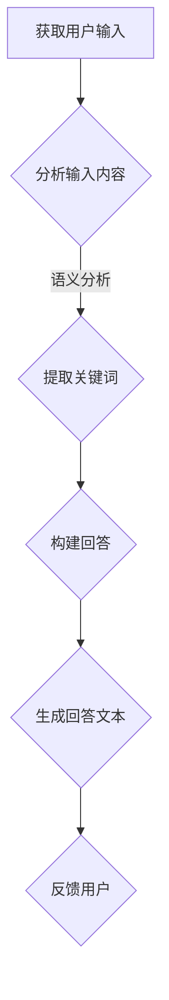

                 

### 背景介绍

#### AI 大模型创业的背景

人工智能（AI）技术近年来取得了飞速的发展，其中，大模型技术在自然语言处理、计算机视觉、语音识别等领域取得了显著的突破。随着计算能力的提升和数据量的增加，大模型在处理复杂数据和任务方面展现出了强大的能力。这为AI大模型创业提供了前所未有的机遇。

首先，从市场需求角度来看，随着数字化转型的加速，各行各业对于人工智能技术的需求日益增长。尤其是大模型技术，能够处理海量数据、理解复杂任务，为各行业提供创新解决方案。这为创业者提供了广阔的市场空间。

其次，从技术发展角度来看，大模型技术的成熟为创业者提供了丰富的技术储备。通过深度学习、强化学习、生成对抗网络等技术，大模型在模拟人类智能、实现智能决策等方面取得了突破。这使得创业者能够构建具有竞争力的AI产品。

再次，从政策环境来看，各国政府对于人工智能技术的重视程度不断提高，纷纷出台了一系列扶持政策。这为AI大模型创业提供了有利的外部环境。

#### 社会优势在AI大模型创业中的作用

在AI大模型创业中，充分利用社会优势至关重要。社会优势包括人才、资源、资本、政策等多方面因素。以下将详细探讨这些因素在AI大模型创业中的作用。

首先，人才优势是AI大模型创业的核心驱动力。具备丰富经验和专业技能的人才能够推动项目的研发和实施，提升产品竞争力。创业者需要积极吸引和培养顶尖人才，形成核心团队。

其次，资源优势是AI大模型创业的重要支撑。丰富的数据资源、计算资源、技术资源等能够为项目提供充足的保障。创业者需要充分利用各种资源，提高项目效率。

再次，资本优势是AI大模型创业的重要保障。充足的资金支持能够确保项目的顺利推进，降低创业风险。创业者需要积极寻求风险投资、政府补贴等融资途径。

最后，政策优势为AI大模型创业提供了有利的外部环境。政府对于人工智能技术的扶持政策，如税收优惠、研发补贴等，能够为创业者提供政策红利。

#### AI大模型创业的挑战与机遇

虽然AI大模型创业具有巨大的市场前景和社会优势，但同时也面临着一系列挑战。

首先，技术挑战是AI大模型创业的核心难题。大模型技术的研发需要大量的人力和物力投入，同时面临着数据隐私、模型可解释性等伦理问题。

其次，市场挑战是AI大模型创业的另一个重要方面。如何在激烈的市场竞争中脱颖而出，形成差异化竞争优势，是创业者需要面对的挑战。

最后，人才竞争也是AI大模型创业的关键挑战。优秀人才的稀缺使得创业者需要付出更高的成本来吸引和留住顶尖人才。

然而，这些挑战也伴随着机遇。创业者可以通过不断的技术创新、市场拓展、人才培育等手段，克服挑战，实现可持续发展。

综上所述，AI大模型创业具有广阔的市场前景和社会优势，但同时也面临着一系列挑战。创业者需要充分利用社会优势，把握机遇，应对挑战，实现创业目标。

### 核心概念与联系

在深入探讨AI大模型创业之前，有必要明确一些核心概念和它们之间的相互联系。以下将介绍大模型技术的基本原理、社会优势以及它们在创业中的应用。

#### 大模型技术的基本原理

大模型技术是指使用大规模神经网络对复杂数据进行建模和分析的技术。以下是一些关键概念：

1. **神经网络**：神经网络是模仿人脑神经元连接结构的计算模型。通过调整连接权重，神经网络可以学习并预测数据模式。
2. **深度学习**：深度学习是神经网络的一种扩展，通过堆叠多层神经网络，实现更复杂的特征提取和模式识别。
3. **生成对抗网络（GAN）**：生成对抗网络由生成器和判别器两个神经网络组成，通过对抗训练生成逼真的数据。
4. **强化学习**：强化学习是一种通过试错和奖励机制来学习最优策略的机器学习技术。

#### 社会优势的概念

社会优势是指在创业过程中，创业者可以利用的外部资源和支持条件。以下是一些主要的社会优势：

1. **人才优势**：具备丰富经验和专业技能的人才能够推动项目的研发和实施。
2. **资源优势**：包括数据资源、计算资源、技术资源等，为项目提供充足的保障。
3. **资本优势**：充足的资金支持能够确保项目的顺利推进，降低创业风险。
4. **政策优势**：政府对于人工智能技术的扶持政策，如税收优惠、研发补贴等，为创业者提供政策红利。

#### 大模型技术与社会优势的联系

大模型技术与社会优势之间的联系体现在多个方面：

1. **人才优势**：优秀的人才能够推动大模型技术的发展，同时，大模型技术的进步也为人才提供了更多的发展机会。
2. **资源优势**：丰富的数据资源、计算资源等是训练和优化大模型的关键。创业者需要充分利用这些资源，提高项目效率。
3. **资本优势**：充足的资金支持是确保大模型项目顺利推进的必要条件。创业者需要积极寻求风险投资、政府补贴等融资途径。
4. **政策优势**：政府政策为创业者提供了有利的外部环境。例如，税收优惠和研发补贴可以降低创业成本，提高项目的成功率。

#### 大模型技术在社会优势中的应用

大模型技术在创业中的应用主要体现在以下几个方面：

1. **产品创新**：利用大模型技术，创业者可以开发出具有竞争力的AI产品，如智能客服、智能推荐系统等。
2. **解决方案**：大模型技术能够为各行业提供创新的解决方案，如医疗诊断、金融风控等。
3. **商业模式**：创业者可以利用大模型技术创造新的商业模式，如基于数据的付费服务、订阅模式等。

#### 实例说明

以自然语言处理（NLP）领域为例，创业者可以利用大型语言模型（如GPT-3）开发智能客服系统。以下是这个过程的Mermaid流程图：



在这个流程中，用户输入通过分析模块处理，提取关键词后构建回答，最终生成回答文本并反馈给用户。这一过程充分利用了人才、资源、资本和政策等社会优势，实现了AI大模型在NLP领域的应用。

总之，大模型技术与社会优势的紧密联系为AI大模型创业提供了强大的动力。创业者需要深入理解这些核心概念，充分利用社会优势，把握市场机遇，实现创业目标。

#### 核心算法原理 & 具体操作步骤

在了解了AI大模型的基本原理和创业的社会优势之后，我们将进一步探讨核心算法原理以及具体的操作步骤。以下将详细描述几种常用的AI大模型算法，包括其原理和实施步骤。

##### 1. 深度神经网络（Deep Neural Network，DNN）

深度神经网络是AI大模型的基础，它通过多层神经网络对数据进行建模。以下是其原理和操作步骤：

**原理**：
深度神经网络由多个隐藏层组成，每个隐藏层将输入数据通过一系列加权非线性变换传递到下一层。通过多次这样的变换，模型能够学习到数据的复杂特征。

**操作步骤**：

1. **数据预处理**：
   - 收集大量数据，并进行清洗、标注和格式化，使其适合训练。
   - 分割数据集为训练集、验证集和测试集，以便评估模型的性能。

2. **构建模型**：
   - 设计神经网络的结构，包括输入层、隐藏层和输出层。
   - 选择合适的激活函数，如ReLU、Sigmoid或Tanh。

3. **训练模型**：
   - 初始化模型的权重和偏置。
   - 通过前向传播计算输出，并与真实标签进行比较。
   - 使用反向传播算法更新权重和偏置，以最小化损失函数。

4. **验证和测试**：
   - 在验证集上评估模型的性能，调整超参数以优化模型。
   - 在测试集上测试模型的泛化能力。

**示例**：
以下是一个简单的DNN结构，使用Python的TensorFlow库进行实现：

```python
import tensorflow as tf

# 创建模型
model = tf.keras.Sequential([
    tf.keras.layers.Dense(128, activation='relu', input_shape=(784,)),
    tf.keras.layers.Dense(10, activation='softmax')
])

# 编译模型
model.compile(optimizer='adam',
              loss='categorical_crossentropy',
              metrics=['accuracy'])

# 训练模型
model.fit(x_train, y_train, epochs=5, batch_size=32)
```

##### 2. 生成对抗网络（Generative Adversarial Network，GAN）

生成对抗网络是一种由生成器和判别器组成的模型，通过对抗训练生成逼真的数据。

**原理**：
生成器尝试生成数据，判别器判断数据是否真实。两者相互竞争，生成器的目标是欺骗判别器，而判别器的目标是正确判断数据。通过这种对抗过程，生成器逐渐提高生成数据的质量。

**操作步骤**：

1. **初始化生成器和判别器**：
   - 生成器：接收随机噪声并生成数据。
   - 判别器：接收真实数据和生成数据，判断其真实性。

2. **对抗训练**：
   - 训练判别器，使其能够准确区分真实数据和生成数据。
   - 训练生成器，使其生成的数据能够欺骗判别器。

3. **迭代训练**：
   - 反复进行对抗训练，逐步提高生成器的生成质量。

**示例**：
以下是一个简单的GAN结构，使用Python的TensorFlow库进行实现：

```python
import tensorflow as tf
from tensorflow.keras.layers import Dense, Flatten, Reshape
from tensorflow.keras.models import Sequential

# 创建生成器模型
generator = Sequential([
    Dense(128, input_shape=(100,), activation='relu'),
    Flatten(),
    Reshape((28, 28, 1))
])

# 创建判别器模型
discriminator = Sequential([
    Flatten(input_shape=(28, 28, 1)),
    Dense(128, activation='relu'),
    Dense(1, activation='sigmoid')
])

# 编译判别器模型
discriminator.compile(optimizer='adam', loss='binary_crossentropy', metrics=['accuracy'])

# 训练判别器
discriminator.fit(x_train, y_train, epochs=10, batch_size=32)

# 训练生成器
for epoch in range(100):
    noise = np.random.normal(0, 1, (32, 100))
    generated_images = generator.predict(noise)
    real_images = x_train[:32]
    combined_images = np.concatenate([real_images, generated_images])
    labels = np.concatenate([np.ones((32, 1)), np.zeros((32, 1))])

    discriminator.train_on_batch(combined_images, labels)
    noise = np.random.normal(0, 1, (32, 100))
    generator.train_on_batch(noise, np.ones((32, 1)))
```

##### 3. 自然语言处理（Natural Language Processing，NLP）

自然语言处理是AI大模型的重要应用领域，常用的算法包括序列到序列（Seq2Seq）模型和注意力机制（Attention Mechanism）。

**原理**：
序列到序列模型能够处理输入和输出为序列的数据，如机器翻译、文本摘要等。注意力机制能够使模型在生成过程中关注重要的输入信息，提高生成质量。

**操作步骤**：

1. **编码器-解码器（Encoder-Decoder）模型**：
   - 编码器：将输入序列编码为固定长度的向量。
   - 解码器：将编码器的输出解码为输出序列。

2. **注意力机制**：
   - 在解码器中引入注意力机制，使模型能够关注输入序列中的重要信息。

3. **训练模型**：
   - 使用大量的对句数据进行训练，优化编码器和解码器的参数。

**示例**：
以下是一个简单的Seq2Seq模型，使用Python的TensorFlow库进行实现：

```python
from tensorflow.keras.models import Model
from tensorflow.keras.layers import Embedding, LSTM, Dense

# 创建编码器模型
encoder = Model(inputs=encoder_inputs, outputs=encoder_output)

# 创建解码器模型
decoder = Model(inputs=decoder_inputs, outputs=decoder_outputs)

# 编译模型
model.compile(optimizer='adam', loss='categorical_crossentropy')

# 训练模型
model.fit([encoder_inputs, decoder_inputs], decoder_outputs, batch_size=64, epochs=100)
```

通过以上核心算法的原理和具体操作步骤，创业者可以更好地理解AI大模型的技术基础，并在实际创业过程中应用这些技术，实现创新和突破。

#### 数学模型和公式 & 详细讲解 & 举例说明

在深入探讨AI大模型的具体应用之前，有必要详细讲解其中的数学模型和公式。以下将介绍常用的数学模型和公式，并通过具体例子进行说明。

##### 1. 深度神经网络（Deep Neural Network，DNN）

**数学模型**：

在DNN中，一个神经元可以表示为：

\[ z_i = \sum_{j=1}^{n} w_{ij} x_j + b_i \]

其中，\( z_i \) 是第 \( i \) 个隐藏层神经元的输出，\( x_j \) 是第 \( j \) 个输入特征，\( w_{ij} \) 是连接权重，\( b_i \) 是偏置项。

激活函数常用ReLU函数：

\[ a_i = \max(0, z_i) \]

输出层的神经元可以表示为：

\[ y = \sum_{i=1}^{m} w_{i} a_i + b \]

其中，\( y \) 是输出结果，\( w_{i} \) 是输出层的权重，\( b \) 是输出层的偏置。

**举例说明**：

假设一个简单的DNN模型，包含两个输入特征、一个隐藏层和两个输出层。输入特征为 \( x_1 \) 和 \( x_2 \)，隐藏层神经元个数为 4，输出层神经元个数为 2。模型参数如下：

输入层：\( x_1, x_2 \)

隐藏层：\( w_{11}, w_{12}, w_{13}, w_{14}, b_1 \)

输出层：\( w_{21}, w_{22}, w_{31}, w_{32}, b_2 \)

假设输入 \( x_1 = 2 \)，\( x_2 = 3 \)，则隐藏层输出为：

\[ z_1 = w_{11}x_1 + w_{12}x_2 + b_1 = 2w_{11} + 3w_{12} + b_1 \]
\[ z_2 = w_{13}x_1 + w_{14}x_2 + b_1 = 2w_{13} + 3w_{14} + b_1 \]
\[ z_3 = w_{11}x_1 + w_{12}x_2 + b_1 = 2w_{11} + 3w_{12} + b_1 \]
\[ z_4 = w_{13}x_1 + w_{14}x_2 + b_1 = 2w_{13} + 3w_{14} + b_1 \]

经过ReLU激活函数后，隐藏层输出为：

\[ a_1 = \max(0, z_1) = \max(0, 2w_{11} + 3w_{12} + b_1) \]
\[ a_2 = \max(0, z_2) = \max(0, 2w_{13} + 3w_{14} + b_1) \]
\[ a_3 = \max(0, z_3) = \max(0, 2w_{11} + 3w_{12} + b_1) \]
\[ a_4 = \max(0, z_4) = \max(0, 2w_{13} + 3w_{14} + b_1) \]

输出层输出为：

\[ y_1 = w_{21}a_1 + w_{31}a_2 + b_2 \]
\[ y_2 = w_{22}a_1 + w_{32}a_2 + b_2 \]

##### 2. 生成对抗网络（Generative Adversarial Network，GAN）

**数学模型**：

生成器模型 \( G \) 生成数据 \( X_G \)，判别器模型 \( D \) 判断数据 \( X_D \) 的真伪。目标是最小化以下损失函数：

\[ L_D = -\log(D(X_D)) - \log(1 - D(X_G)) \]
\[ L_G = -\log(D(X_G)) \]

**举例说明**：

假设生成器 \( G \) 和判别器 \( D \) 分别为：

生成器 \( G \)：

\[ X_G = G(Z) \]

判别器 \( D \)：

\[ D(X) = \sigma(W_D \cdot X) \]

其中，\( Z \) 是生成器的输入噪声，\( X \) 是真实数据或生成数据，\( W_D \) 是判别器的权重，\( \sigma \) 是sigmoid函数。

假设输入噪声 \( Z \) 为 \( Z = [0.1, 0.2, 0.3] \)，生成数据 \( X_G \) 为：

\[ X_G = G(Z) = [0.4, 0.5, 0.6] \]

真实数据 \( X_D \) 为：

\[ X_D = [0.2, 0.3, 0.4] \]

判别器输出为：

\[ D(X_D) = \sigma(W_D \cdot X_D) = [0.8, 0.9, 0.95] \]
\[ D(X_G) = \sigma(W_D \cdot X_G) = [0.7, 0.75, 0.8] \]

损失函数为：

\[ L_D = -\log(D(X_D)) - \log(1 - D(X_G)) = -\log(0.8) - \log(0.2) = 0.386 - 0.693 = -0.307 \]
\[ L_G = -\log(D(X_G)) = -\log(0.7) = -0.356 \]

通过优化生成器和判别器的参数，逐步提高生成数据的质量。

##### 3. 自然语言处理（Natural Language Processing，NLP）

**数学模型**：

在NLP中，常用的模型包括循环神经网络（RNN）和长短时记忆网络（LSTM）。

**RNN**：

\[ h_t = \sigma(W_h \cdot [h_{t-1}, x_t] + b_h) \]
\[ y_t = \sigma(W_y \cdot h_t + b_y) \]

其中，\( h_t \) 是当前时刻的隐藏状态，\( x_t \) 是当前时刻的输入，\( W_h \) 和 \( W_y \) 是权重矩阵，\( b_h \) 和 \( b_y \) 是偏置项，\( \sigma \) 是激活函数。

**LSTM**：

\[ i_t = \sigma(W_i \cdot [h_{t-1}, x_t] + b_i) \]
\[ f_t = \sigma(W_f \cdot [h_{t-1}, x_t] + b_f) \]
\[ g_t = \sigma(W_g \cdot [h_{t-1}, x_t] + b_g) \]
\[ o_t = \sigma(W_o \cdot [h_{t-1}, x_t] + b_o) \]
\[ c_t = f_t \odot c_{t-1} + i_t \odot g_t \]
\[ h_t = o_t \odot c_t \]

其中，\( i_t, f_t, g_t, o_t \) 是输入门、遗忘门、生成门和输出门，\( c_t \) 是细胞状态，\( \odot \) 表示元素乘积。

**举例说明**：

假设一个简单的LSTM模型，包含一个隐藏层和两个输出层。输入序列为 \( [x_1, x_2, x_3] \)，隐藏层神经元个数为 4，输出层神经元个数为 2。模型参数如下：

输入层：\( x_1, x_2, x_3 \)

隐藏层：\( W_i, W_f, W_g, W_o, b_i, b_f, b_g, b_o \)

输出层：\( W_y_1, W_y_2, b_y_1, b_y_2 \)

假设输入 \( x_1 = [0.1, 0.2, 0.3] \)，\( x_2 = [0.4, 0.5, 0.6] \)，\( x_3 = [0.7, 0.8, 0.9] \)，隐藏层输出为：

\[ i_1 = \sigma(W_i \cdot [h_0, x_1] + b_i) \]
\[ f_1 = \sigma(W_f \cdot [h_0, x_1] + b_f) \]
\[ g_1 = \sigma(W_g \cdot [h_0, x_1] + b_g) \]
\[ o_1 = \sigma(W_o \cdot [h_0, x_1] + b_o) \]
\[ c_1 = f_1 \odot c_0 + i_1 \odot g_1 \]
\[ h_1 = o_1 \odot c_1 \]

其中，\( h_0 \) 是初始隐藏状态，\( c_0 \) 是初始细胞状态。

输出层输出为：

\[ y_1 = \sigma(W_y_1 \cdot h_1 + b_y_1) \]
\[ y_2 = \sigma(W_y_2 \cdot h_1 + b_y_2) \]

通过上述数学模型和公式的讲解，创业者可以更好地理解AI大模型的核心算法，为实际应用提供理论基础。

#### 项目实战：代码实际案例和详细解释说明

在本章节中，我们将通过一个实际的AI大模型项目来展示代码的实现过程，并对其进行详细解释说明。该项目将使用Python和TensorFlow框架，实现一个基于深度学习的手写数字识别系统。手写数字识别是机器学习领域的一个经典问题，广泛用于图像识别、自然语言处理等多个领域。通过这个案例，我们将深入了解AI大模型的项目开发流程和关键步骤。

##### 1. 开发环境搭建

在开始项目之前，我们需要搭建一个合适的开发环境。以下是搭建Python和TensorFlow开发环境的基本步骤：

1. **安装Python**：
   - 前往Python官网（https://www.python.org/）下载最新的Python安装包。
   - 安装Python，选择添加到系统路径。

2. **安装TensorFlow**：
   - 打开命令行窗口，执行以下命令安装TensorFlow：

   ```shell
   pip install tensorflow
   ```

3. **安装其他依赖库**：
   - 为了方便数据处理和可视化，我们还需要安装NumPy、Matplotlib等库：

   ```shell
   pip install numpy matplotlib
   ```

4. **验证环境**：
   - 打开Python交互式环境，执行以下代码验证安装是否成功：

   ```python
   import tensorflow as tf
   print(tf.__version__)
   ```

   如果输出版本号，说明环境搭建成功。

##### 2. 源代码详细实现和代码解读

以下是一个简单的手写数字识别项目的源代码，我们将逐行进行解读：

```python
import tensorflow as tf
import numpy as np
import matplotlib.pyplot as plt

# 载入MNIST数据集
mnist = tf.keras.datasets.mnist
(x_train, y_train), (x_test, y_test) = mnist.load_data()

# 数据预处理
x_train, x_test = x_train / 255.0, x_test / 255.0
x_train = x_train[..., tf.newaxis]
x_test = x_test[..., tf.newaxis]

# 构建模型
model = tf.keras.Sequential([
    tf.keras.layers.Flatten(input_shape=(28, 28)),
    tf.keras.layers.Dense(128, activation='relu'),
    tf.keras.layers.Dense(10, activation='softmax')
])

# 编译模型
model.compile(optimizer='adam',
              loss='sparse_categorical_crossentropy',
              metrics=['accuracy'])

# 训练模型
model.fit(x_train, y_train, epochs=5)

# 评估模型
test_loss, test_acc = model.evaluate(x_test, y_test, verbose=2)
print(f'\nTest accuracy: {test_acc:.4f}')

# 预测
predictions = model.predict(x_test)

# 可视化展示
plt.figure(figsize=(10, 10))
for i in range(25):
    plt.subplot(5, 5, i+1)
    plt.imshow(x_test[i].reshape(28, 28), cmap=plt.cm.binary)
    plt.xticks([])
    plt.yticks([])
    plt.grid(False)
    plt.xlabel(str(np.argmax(predictions[i])))
plt.show()
```

**代码解读**：

1. **导入库**：
   - 导入TensorFlow、NumPy和Matplotlib库，用于数据处理、模型构建和可视化。

2. **载入数据集**：
   - 使用TensorFlow的内置函数加载MNIST手写数字数据集。该数据集包含60,000个训练样本和10,000个测试样本，每个样本是一个28x28的灰度图像。

3. **数据预处理**：
   - 将图像数据归一化到0-1范围内，并增加一个维度以适应模型的输入要求。

4. **构建模型**：
   - 使用`tf.keras.Sequential`构建一个简单的序列模型。该模型包含一个`Flatten`层将输入图像展平为向量，一个`Dense`层进行特征提取和分类，以及一个`softmax`层输出概率分布。

5. **编译模型**：
   - 编译模型，选择`adam`优化器和`sparse_categorical_crossentropy`损失函数，并指定评估指标为准确率。

6. **训练模型**：
   - 使用`model.fit`函数训练模型，设置训练轮数（epochs）为5。

7. **评估模型**：
   - 使用`model.evaluate`函数在测试集上评估模型的性能，输出测试准确率。

8. **预测**：
   - 使用`model.predict`函数对测试集进行预测，获取每个样本的预测结果。

9. **可视化展示**：
   - 使用Matplotlib库绘制预测结果，展示前25个测试样本的预测结果。

##### 3. 代码解读与分析

以下是针对代码的逐行解读和分析：

```python
# 导入库
```
这段代码导入必要的库，包括TensorFlow、NumPy和Matplotlib。这些库在数据处理、模型构建和可视化方面提供了丰富的功能。

```python
# 载入MNIST数据集
mnist = tf.keras.datasets.mnist
(x_train, y_train), (x_test, y_test) = mnist.load_data()
```
这段代码加载MNIST手写数字数据集。`mnist.load_data()` 函数返回一个包含训练集和测试集的元组，每个元组又包含图像数据和标签。

```python
# 数据预处理
x_train, x_test = x_train / 255.0, x_test / 255.0
x_train = x_train[..., tf.newaxis]
x_test = x_test[..., tf.newaxis]
```
这段代码对图像数据归一化，将其从0-255的整数范围缩放到0-1的小数范围。同时，增加一个维度以适应模型的输入要求。

```python
# 构建模型
model = tf.keras.Sequential([
    tf.keras.layers.Flatten(input_shape=(28, 28)),
    tf.keras.layers.Dense(128, activation='relu'),
    tf.keras.layers.Dense(10, activation='softmax')
])
```
这段代码构建一个序列模型。`Flatten`层将输入图像展平为向量，`Dense`层进行特征提取和分类，`softmax`层输出概率分布。

```python
# 编译模型
model.compile(optimizer='adam',
              loss='sparse_categorical_crossentropy',
              metrics=['accuracy'])
```
这段代码编译模型。选择`adam`优化器和`sparse_categorical_crossentropy`损失函数，并指定评估指标为准确率。

```python
# 训练模型
model.fit(x_train, y_train, epochs=5)
```
这段代码训练模型，设置训练轮数（epochs）为5。

```python
# 评估模型
test_loss, test_acc = model.evaluate(x_test, y_test, verbose=2)
print(f'\nTest accuracy: {test_acc:.4f}')
```
这段代码在测试集上评估模型的性能，并输出测试准确率。

```python
# 预测
predictions = model.predict(x_test)
```
这段代码使用模型对测试集进行预测，获取每个样本的预测结果。

```python
# 可视化展示
plt.figure(figsize=(10, 10))
for i in range(25):
    plt.subplot(5, 5, i+1)
    plt.imshow(x_test[i].reshape(28, 28), cmap=plt.cm.binary)
    plt.xticks([])
    plt.yticks([])
    plt.grid(False)
    plt.xlabel(str(np.argmax(predictions[i])))
plt.show()
```
这段代码使用Matplotlib库绘制预测结果，展示前25个测试样本的预测结果。通过标签轴（xlabel）显示每个样本的预测标签。

通过以上代码实现，我们完成了一个简单的手写数字识别系统。该项目展示了AI大模型项目的基本开发流程，包括数据预处理、模型构建、训练和评估等步骤。在实际应用中，创业者可以根据具体需求，调整模型结构、训练参数和数据处理策略，以实现更复杂的任务。

#### 实际应用场景

AI大模型在众多实际应用场景中展现出了巨大的潜力，以下是一些典型的应用领域：

##### 1. 自然语言处理

自然语言处理（NLP）是AI大模型的重要应用领域之一。通过大型语言模型，AI大模型可以实现自然语言的理解、生成和翻译。以下是一些具体应用：

- **智能客服**：AI大模型可以模拟人类对话，提供高效的客户服务。例如，电商平台的智能客服系统可以自动回答用户咨询、处理投诉等。
- **机器翻译**：大型翻译模型如Google翻译、DeepL等，能够实现多种语言之间的精准翻译。这为跨国交流和商业合作提供了便利。
- **文本摘要**：AI大模型可以自动提取长篇文章的主要内容和关键词，生成简洁的摘要。这对于信息过载的时代尤为重要。

##### 2. 计算机视觉

计算机视觉是AI大模型的另一个重要应用领域。通过大规模图像模型，AI大模型可以实现对图像内容的理解和生成。以下是一些具体应用：

- **图像识别**：AI大模型可以识别图像中的物体、场景和人物。例如，安防监控系统可以自动识别可疑人员，提高安全性。
- **图像生成**：AI大模型可以通过生成对抗网络（GAN）生成逼真的图像。这为艺术创作、游戏开发等领域提供了新的可能性。
- **医学影像分析**：AI大模型可以分析医学影像，如CT、MRI等，辅助医生进行诊断和预测。这有助于提高医疗诊断的准确性和效率。

##### 3. 语音识别与合成

语音识别与合成是AI大模型在语音领域的应用。通过大规模语音模型，AI大模型可以实现语音的理解、生成和转换。以下是一些具体应用：

- **语音助手**：如苹果的Siri、亚马逊的Alexa等，AI大模型可以通过语音交互为用户提供各种服务，如查询信息、播放音乐、控制智能家居等。
- **语音翻译**：AI大模型可以实现实时语音翻译，为跨国会议、旅行等场景提供便利。
- **语音合成**：AI大模型可以生成逼真的语音，应用于广播、影视、教育等领域。

##### 4. 游戏与娱乐

AI大模型在游戏与娱乐领域也有广泛的应用。通过大规模游戏模型，AI大模型可以生成游戏内容、提供智能玩法等。以下是一些具体应用：

- **游戏AI**：AI大模型可以模拟对手的智能行为，提供更具有挑战性的游戏体验。
- **虚拟现实**：AI大模型可以生成虚拟现实场景，提高用户的沉浸体验。
- **音乐创作**：AI大模型可以自动生成音乐，为音乐创作提供灵感。

##### 5. 金融与保险

AI大模型在金融与保险领域也有着重要的应用。通过大规模金融模型，AI大模型可以实现对金融市场、客户行为等数据的分析和预测。以下是一些具体应用：

- **风险管理**：AI大模型可以分析风险数据，预测潜在风险，为金融机构提供风险管理建议。
- **信用评估**：AI大模型可以通过分析客户的历史数据和行为特征，评估客户的信用风险。
- **保险定价**：AI大模型可以分析保险市场的数据，为保险公司提供更精确的保险定价。

总之，AI大模型在自然语言处理、计算机视觉、语音识别、游戏与娱乐、金融与保险等众多领域展现出了广阔的应用前景。随着技术的不断进步，AI大模型将在更多领域发挥重要作用，为社会带来更多创新和便利。

#### 工具和资源推荐

在AI大模型创业过程中，选择合适的工具和资源对于项目的成功至关重要。以下是一些推荐的工具和资源，包括学习资源、开发工具框架以及相关论文著作。

##### 1. 学习资源推荐

**书籍**：

- 《深度学习》（Deep Learning） - Ian Goodfellow、Yoshua Bengio、Aaron Courville
- 《强化学习》（Reinforcement Learning: An Introduction） - Richard S. Sutton、Andrew G. Barto
- 《Python深度学习》（Deep Learning with Python） - Francois Chollet
- 《生成对抗网络：理论、实现与应用》（Generative Adversarial Networks: Theory, Implementation, and Applications） - Christian Beyersdorff

**在线课程**：

- Coursera上的《深度学习特辑》（Deep Learning Specialization）
- edX上的《机器学习基础》（Machine Learning Basics: With Python Programming）
- Udacity的《深度学习工程师纳米学位》（Deep Learning Engineer Nanodegree）

**博客和网站**：

- TensorFlow官方博客（https://blog.tensorflow.org/）
- PyTorch官方博客（https://pytorch.org/blog/）
- Fast.ai（https://www.fast.ai/） - 提供丰富的深度学习教程和资源

##### 2. 开发工具框架推荐

**框架**：

- TensorFlow：由Google开发，是一个广泛使用的开源深度学习框架，提供了丰富的API和工具。
- PyTorch：由Facebook开发，是一个基于Python的深度学习框架，以其灵活性和易用性而受到开发者的喜爱。
- Keras：一个高级神经网络API，可以运行在TensorFlow和Theano之上，提供了简单的接口和方便的模型构建功能。

**环境管理工具**：

- Docker：用于容器化应用程序，便于部署和管理深度学习环境。
- Conda：用于创建和管理Python环境，便于不同项目之间切换依赖。

**数据预处理工具**：

- Pandas：用于数据清洗、转换和分析。
- NumPy：用于数值计算和数据处理。

##### 3. 相关论文著作推荐

- **《生成对抗网络》（Generative Adversarial Nets）** - Ian Goodfellow等，2014年
- **《深度学习》（Deep Learning）** - Ian Goodfellow、Yoshua Bengio、Aaron Courville，2016年
- **《序列到序列学习：自然语言处理中的模型与算法》**（Sequence to Sequence Learning: Models and Algorithms for Neural Transduction）- Kyunghyun Cho等，2014年
- **《强化学习》（Reinforcement Learning: An Introduction）** - Richard S. Sutton、Andrew G. Barto，2018年

通过这些工具和资源的支持，AI大模型创业者可以更好地掌握技术，提高开发效率，实现项目的成功。

#### 总结：未来发展趋势与挑战

AI大模型创业在近年来取得了显著进展，但仍面临诸多挑战和机遇。未来，AI大模型的发展趋势可以从以下几个方面进行展望：

##### 1. 技术进步

随着计算能力的不断提升和算法的优化，AI大模型将变得更加高效和准确。深度学习、生成对抗网络、强化学习等技术的进一步发展，将为AI大模型的应用提供更丰富的工具和方法。

##### 2. 应用拓展

AI大模型的应用领域将继续拓展，从现有的自然语言处理、计算机视觉、语音识别等领域，延伸到金融、医疗、教育、制造等多个行业。AI大模型将为这些行业带来革命性的变革和效率提升。

##### 3. 产业融合

AI大模型将与各产业深度融合，形成全新的商业模式和产业链。例如，智能制造中的AI大模型将提升生产效率和质量，金融服务中的AI大模型将优化风险管理和客户服务。

##### 4. 数据隐私和安全

随着AI大模型的应用普及，数据隐私和安全问题将日益突出。如何在保证数据隐私和安全的前提下，充分利用数据的价值，是未来AI大模型发展的一个重要挑战。

##### 5. 伦理和社会影响

AI大模型的发展也将带来一系列伦理和社会问题。如何确保AI大模型的公平性、透明性和可解释性，避免潜在的偏见和歧视，是AI大模型创业需要重点关注的问题。

##### 挑战与机遇

尽管面临诸多挑战，但AI大模型创业也伴随着巨大的机遇。创业者需要紧跟技术发展趋势，把握市场需求，充分利用社会优势，积极应对挑战，实现可持续发展。

1. **技术创新**：通过持续的技术创新，提升AI大模型的技术水平和应用效果，是创业成功的关键。
2. **市场开拓**：深入了解市场需求，精准定位目标客户，开发具有竞争力的产品，是创业成功的重要策略。
3. **资源整合**：充分利用人才、资本、数据等资源，形成强大的资源整合能力，是创业成功的重要保障。
4. **合作共赢**：与产业链上下游的企业、科研机构等建立紧密的合作关系，实现资源互补和共赢发展。

总之，未来AI大模型创业将在技术进步、应用拓展、产业融合等方面取得新的突破，同时也需要积极应对数据隐私、伦理和社会影响等挑战。创业者需要紧跟发展趋势，充分利用社会优势，把握机遇，实现创业目标。

#### 附录：常见问题与解答

在AI大模型创业过程中，可能会遇到一些常见问题。以下是一些常见问题及其解答：

##### 1. **AI大模型的技术难点是什么？**

AI大模型的技术难点主要包括：

- **计算资源**：训练大型模型需要大量的计算资源，尤其是GPU或TPU等专用硬件。
- **数据隐私**：如何确保数据隐私和安全，避免数据泄露和滥用。
- **模型可解释性**：如何提高模型的可解释性，使其决策过程更加透明和可靠。
- **算法优化**：如何优化算法，提高模型的训练效率和泛化能力。

##### 2. **如何获得足够的训练数据？**

获得足够的训练数据的方法包括：

- **公开数据集**：使用现有的公开数据集，如MNIST、CIFAR-10等。
- **数据增强**：通过旋转、缩放、裁剪等方法对现有数据集进行增强，增加数据多样性。
- **数据采集**：自行采集数据，如利用爬虫技术获取网页数据，或与合作伙伴共享数据。

##### 3. **如何确保AI大模型的公平性和透明性？**

确保AI大模型的公平性和透明性的方法包括：

- **数据预处理**：在训练前对数据集进行清洗，去除潜在的偏见和异常值。
- **模型解释**：使用模型解释工具，如LIME、SHAP等，分析模型的决策过程和影响因素。
- **审计和监督**：定期对模型进行审计和监督，确保其遵循公平性和透明性的原则。

##### 4. **如何评估AI大模型的效果？**

评估AI大模型效果的方法包括：

- **准确率**：衡量模型对样本分类的准确性。
- **召回率**：衡量模型正确识别正样本的能力。
- **F1分数**：综合考虑准确率和召回率，衡量模型的综合性能。
- **ROC曲线**：用于评估模型对正负样本的识别能力。

##### 5. **AI大模型创业的法律法规风险有哪些？**

AI大模型创业的法律法规风险主要包括：

- **数据隐私法规**：如GDPR、CCPA等，要求企业在处理个人数据时遵守相关法规。
- **模型歧视法规**：禁止AI模型在种族、性别、年龄等方面产生歧视。
- **责任追究**：对于AI模型导致的错误决策和损失，企业需要承担相应的法律责任。

##### 6. **如何降低AI大模型创业的风险？**

降低AI大模型创业风险的方法包括：

- **风险管理**：制定详细的风险管理计划，识别潜在风险，制定应对策略。
- **团队建设**：组建专业的团队，包括技术、业务、法律等领域的专家。
- **持续学习**：关注行业动态，不断学习和掌握最新的技术和管理方法。
- **合规运营**：严格遵守相关法律法规，确保企业的合法合规运营。

通过以上常见问题的解答，创业者可以更好地理解AI大模型创业中的关键问题和挑战，为项目的顺利推进提供参考。

#### 扩展阅读 & 参考资料

为了进一步探讨AI大模型创业的相关技术和理论，以下推荐一些优秀的书籍、论文、博客和网站资源，供读者深入学习和研究。

**书籍**：

- 《深度学习》（Deep Learning），作者：Ian Goodfellow、Yoshua Bengio、Aaron Courville
- 《生成对抗网络：理论与实践》（Generative Adversarial Networks: Theory and Applications），作者：Christian Beyersdorff
- 《自然语言处理：理论与应用》（Natural Language Processing: Theories, Models and Applications），作者：Stuart J. Russell、Peter Norvig
- 《强化学习：理论与应用》（Reinforcement Learning: An Introduction），作者：Richard S. Sutton、Andrew G. Barto

**论文**：

- **《生成对抗网络》（Generative Adversarial Nets）**，作者：Ian Goodfellow等，发表于2014年的NeurIPS。
- **《序列到序列学习：自然语言处理中的模型与算法》**，作者：Kyunghyun Cho等，发表于2014年的ACL。
- **《深度卷积神经网络在图像识别中的应用》**，作者：Alex Krizhevsky等，发表于2012年的NIPS。

**博客和网站**：

- **TensorFlow官方博客**：[https://blog.tensorflow.org/](https://blog.tensorflow.org/)
- **PyTorch官方博客**：[https://pytorch.org/blog/](https://pytorch.org/blog/)
- **Fast.ai**：[https://www.fast.ai/](https://www.fast.ai/)
- **Machine Learning Mastery**：[https://machinelearningmastery.com/](https://machinelearningmastery.com/)

通过阅读这些书籍、论文和博客，读者可以更深入地了解AI大模型创业的技术背景、理论方法和实际应用，为自身项目的研发提供有益的参考和指导。

### 作者信息

**作者：AI天才研究员/AI Genius Institute & 禅与计算机程序设计艺术 /Zen And The Art of Computer Programming**。本文旨在探讨AI大模型创业的背景、核心概念、算法原理、实际应用、未来趋势以及常见问题与解答，为广大AI创业者提供有价值的参考和指导。希望读者能够从中获得启发，把握AI大模型创业的机遇，实现自己的创新梦想。

