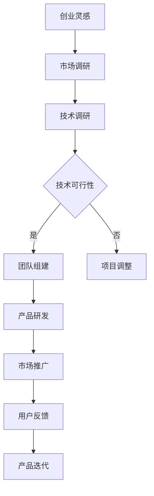

                 

# AI 大模型创业：如何利用科技优势？

> **关键词：** AI 大模型、创业、科技优势、算法原理、应用场景、未来趋势

> **摘要：** 本文深入探讨了 AI 大模型创业的核心技术和方法，分析了科技优势的利用，提供了项目实战和资源推荐，旨在为创业者和科技从业人士提供有价值的参考。

## 1. 背景介绍

随着人工智能技术的快速发展，AI 大模型成为了当前科技领域的热点。大模型，如 GPT-3、BERT 等，具有强大的文本生成、理解、推理能力，广泛应用于自然语言处理、图像识别、语音识别等领域。AI 大模型的创业，不仅需要深厚的科技背景，还需要灵活运用各种科技优势，以实现商业价值和市场竞争力。

创业，通常指的是企业家或团队利用创意、技术或资源，创建新的企业或业务模式。在 AI 大模型领域，创业的核心挑战在于技术门槛高、市场需求大、竞争激烈。因此，如何利用科技优势，成为创业成功的关键。

## 2. 核心概念与联系

### 2.1 AI 大模型的概念

AI 大模型是一种基于深度学习的复杂神经网络模型，其特点包括：

- **规模巨大**：拥有数十亿甚至千亿个参数；
- **训练数据丰富**：基于大量真实数据训练；
- **泛化能力强**：能够在不同领域和任务中表现优异。

### 2.2 科技优势的利用

在 AI 大模型创业中，科技优势主要表现在以下几个方面：

- **算法优化**：通过高效的算法和架构，提高模型的训练速度和效果；
- **数据资源**：利用海量的数据资源，提升模型的训练质量和应用效果；
- **计算能力**：强大的计算资源，支持大规模模型的训练和部署；
- **技术积累**：深厚的科技积累，有助于快速开发出具有市场竞争力的产品。

### 2.3 Mermaid 流程图

以下是 AI 大模型创业的关键流程和节点：



## 3. 核心算法原理 & 具体操作步骤

### 3.1 深度学习算法原理

深度学习算法是 AI 大模型的核心，其基本原理包括：

- **神经网络**：神经网络由多层神经元组成，通过前向传播和反向传播进行学习；
- **激活函数**：激活函数用于引入非线性，提升模型的泛化能力；
- **损失函数**：损失函数用于评估模型的预测误差，指导模型优化。

### 3.2 具体操作步骤

以下是 AI 大模型创业的具体操作步骤：

1. **市场调研**：了解市场需求、竞争对手、用户需求等，确定创业方向；
2. **技术调研**：研究相关技术，评估技术可行性，确定技术路线；
3. **团队组建**：根据技术需求，组建合适的技术团队；
4. **产品研发**：利用深度学习算法，研发具有市场竞争力的产品；
5. **市场推广**：通过多种渠道，推广产品，提高知名度；
6. **用户反馈**：收集用户反馈，优化产品；
7. **产品迭代**：根据用户反馈，持续优化产品。

## 4. 数学模型和公式 & 详细讲解 & 举例说明

### 4.1 数学模型

AI 大模型的核心数学模型包括：

- **神经网络模型**：描述神经网络的结构和参数；
- **损失函数**：评估模型预测误差的公式；
- **优化算法**：用于调整模型参数，使损失函数最小化。

### 4.2 公式和详细讲解

以下是神经网络模型的简要公式和详细讲解：

1. **神经网络模型**：

   $$ f(x) = \sigma(W \cdot x + b) $$

   - $f(x)$：神经网络的输出；
   - $\sigma$：激活函数；
   - $W$：权重矩阵；
   - $x$：输入向量；
   - $b$：偏置向量。

2. **损失函数**：

   $$ L(y, \hat{y}) = \frac{1}{2} \sum_{i=1}^{n} (y_i - \hat{y}_i)^2 $$

   - $L$：损失函数；
   - $y$：真实标签；
   - $\hat{y}$：预测标签；
   - $n$：样本数量。

3. **优化算法**：

   $$ \theta = \theta - \alpha \frac{\partial L}{\partial \theta} $$

   - $\theta$：模型参数；
   - $\alpha$：学习率；
   - $\frac{\partial L}{\partial \theta}$：损失函数关于参数的导数。

### 4.3 举例说明

假设有一个二分类问题，输入向量 $x$ 有两个特征，权重矩阵 $W$ 和偏置向量 $b$ 分别为：

$$ W = \begin{bmatrix} 1 & 2 \\ 3 & 4 \end{bmatrix}, b = \begin{bmatrix} 1 \\ 2 \end{bmatrix} $$

激活函数为：

$$ \sigma(z) = \frac{1}{1 + e^{-z}} $$

给定输入向量 $x = \begin{bmatrix} 1 & 0 \end{bmatrix}^T$，计算输出：

$$ z = W \cdot x + b = \begin{bmatrix} 1 & 2 \\ 3 & 4 \end{bmatrix} \cdot \begin{bmatrix} 1 \\ 0 \end{bmatrix} + \begin{bmatrix} 1 \\ 2 \end{bmatrix} = \begin{bmatrix} 4 \\ 7 \end{bmatrix} $$

$$ \hat{y} = \sigma(z) = \frac{1}{1 + e^{-4}} = \frac{1}{1 + e^{-7}} \approx 0.98 $$

给定真实标签 $y = 1$，计算损失函数：

$$ L(y, \hat{y}) = \frac{1}{2} \sum_{i=1}^{n} (y_i - \hat{y}_i)^2 = \frac{1}{2} (1 - 0.98)^2 \approx 0.0002 $$

更新权重矩阵 $W$ 和偏置向量 $b$：

$$ \theta = \theta - \alpha \frac{\partial L}{\partial \theta} $$

其中，$\alpha$ 为学习率，$\frac{\partial L}{\partial \theta}$ 为损失函数关于权重矩阵 $W$ 和偏置向量 $b$ 的导数。

## 5. 项目实战：代码实际案例和详细解释说明

### 5.1 开发环境搭建

在开始项目实战之前，需要搭建一个合适的开发环境。以下是搭建 Python 开发环境的基本步骤：

1. 安装 Python：下载并安装 Python，选择合适的版本（如 Python 3.8）；
2. 安装深度学习框架：安装 TensorFlow 或 PyTorch 等深度学习框架；
3. 安装其他依赖库：根据项目需求，安装其他依赖库，如 NumPy、Pandas 等。

### 5.2 源代码详细实现和代码解读

以下是一个简单的 AI 大模型项目示例，使用 TensorFlow 框架实现一个文本分类任务：

```python
import tensorflow as tf
from tensorflow.keras.layers import Embedding, LSTM, Dense
from tensorflow.keras.models import Sequential

# 加载数据
(x_train, y_train), (x_test, y_test) = tf.keras.datasets.imdb.load_data()

# 数据预处理
vocab_size = 10000
max_length = 500
trunc_type = 'post'
padding_type = 'post'
oov_tok = '<OOV>'

tokenizer = tf.keras.preprocessing.text.Tokenizer(num_words=vocab_size, oov_token=oov_tok)
tokenizer.fit_on_texts(x_train)
word_index = tokenizer.word_index
sequences = tokenizer.texts_to_sequences(x_train)
padded = tf.keras.preprocessing.sequence.pad_sequences(sequences, maxlen=max_length, padding=padding_type, truncating=trunc_type)

# 构建模型
model = Sequential([
    Embedding(vocab_size, 16, input_length=max_length),
    LSTM(32, return_sequences=True),
    LSTM(32),
    Dense(24, activation='relu'),
    Dense(1, activation='sigmoid')
])

# 编译模型
model.compile(loss='binary_crossentropy', optimizer='adam', metrics=['accuracy'])

# 训练模型
model.fit(padded, y_train, epochs=10, validation_split=0.2)
```

### 5.3 代码解读与分析

1. **数据加载和预处理**：

   - 加载 IMDB 数据集，并进行预处理，包括分词、序列化、填充等操作；
   - 设置词汇表大小为 10000，序列最大长度为 500。

2. **构建模型**：

   - 使用 Sequential 模型堆叠 Embedding、LSTM 和 Dense 层；
   - Embedding 层用于将词转换为向量；
   - LSTM 层用于处理序列数据，提取特征；
   - Dense 层用于分类，输出概率。

3. **编译模型**：

   - 设置损失函数为 binary_crossentropy，用于二分类任务；
   - 设置优化器为 Adam，用于模型参数更新；
   - 设置评价指标为 accuracy，用于评估模型性能。

4. **训练模型**：

   - 使用训练数据训练模型，设置训练轮次为 10，设置验证比例为 20%。

### 5.4 项目实战：代码实际案例和详细解释说明

以下是一个更复杂的项目示例，使用 PyTorch 框架实现一个图像分类任务：

```python
import torch
import torchvision
import torchvision.transforms as transforms
import torch.nn as nn
import torch.optim as optim

# 加载数据
transform = transforms.Compose([transforms.Resize(256), transforms.ToTensor()])
trainset = torchvision.datasets.ImageFolder('train', transform=transform)
trainloader = torch.utils.data.DataLoader(trainset, batch_size=4, shuffle=True)
testset = torchvision.datasets.ImageFolder('test', transform=transform)
testloader = torch.utils.data.DataLoader(testset, batch_size=4, shuffle=True)

# 构建模型
class Net(nn.Module):
    def __init__(self):
        super(Net, self).__init__()
        self.conv1 = nn.Conv2d(3, 6, 5)
        self.pool = nn.MaxPool2d(2, 2)
        self.conv2 = nn.Conv2d(6, 16, 5)
        self.fc1 = nn.Linear(16 * 5 * 5, 120)
        self.fc2 = nn.Linear(120, 84)
        self.fc3 = nn.Linear(84, 10)

    def forward(self, x):
        x = self.pool(F.relu(self.conv1(x)))
        x = self.pool(F.relu(self.conv2(x)))
        x = x.view(-1, 16 * 5 * 5)
        x = F.relu(self.fc1(x))
        x = F.relu(self.fc2(x))
        x = self.fc3(x)
        return x

net = Net()

# 定义损失函数和优化器
criterion = nn.CrossEntropyLoss()
optimizer = optim.SGD(net.parameters(), lr=0.001, momentum=0.9)

# 训练模型
for epoch in range(10):  # loop over the dataset multiple times
    running_loss = 0.0
    for i, data in enumerate(trainloader, 0):
        inputs, labels = data
        optimizer.zero_grad()
        outputs = net(inputs)
        loss = criterion(outputs, labels)
        loss.backward()
        optimizer.step()
        running_loss += loss.item()
        if i % 2000 == 1999:    # print every 2000 mini-batches
            print('Epoch: %d, Loss: %.3f' % (epoch + 1, running_loss / 2000))
            running_loss = 0.0

print('Finished Training')

# 测试模型
correct = 0
total = 0
with torch.no_grad():
    for data in testloader:
        images, labels = data
        outputs = net(images)
        _, predicted = torch.max(outputs.data, 1)
        total += labels.size(0)
        correct += (predicted == labels).sum().item()

print('Accuracy of the network on the 1000 test images: %d %%' % (100 * correct / total))
```

### 5.3 代码解读与分析

1. **数据加载和预处理**：

   - 加载训练数据和测试数据，使用 torchvision.datasets 和 torchvision.transforms 进行数据加载和预处理；
   - 设置数据预处理操作，包括图像大小调整、转换为张量等。

2. **构建模型**：

   - 定义一个简单的卷积神经网络（CNN），包括卷积层、池化层、全连接层等；
   - 使用 torch.nn 模块构建网络结构。

3. **定义损失函数和优化器**：

   - 设置损失函数为交叉熵损失函数，用于分类任务；
   - 设置优化器为随机梯度下降（SGD），用于模型参数更新。

4. **训练模型**：

   - 使用训练数据训练模型，设置训练轮次为 10；
   - 在每个训练批次后，更新模型参数，计算训练损失。

5. **测试模型**：

   - 使用测试数据评估模型性能，计算准确率。

## 6. 实际应用场景

AI 大模型在各个领域都有广泛的应用，以下是几个典型的实际应用场景：

- **自然语言处理（NLP）**：文本生成、文本分类、机器翻译等；
- **计算机视觉**：图像识别、图像生成、目标检测等；
- **语音识别**：语音合成、语音识别、说话人识别等；
- **医疗健康**：疾病预测、医疗影像分析、药物发现等；
- **金融科技**：风险评估、量化交易、欺诈检测等。

在这些应用场景中，AI 大模型通过不断学习和优化，实现了高度的智能化和自动化，为各行各业带来了巨大的价值。

## 7. 工具和资源推荐

### 7.1 学习资源推荐

- **书籍**：
  - 《深度学习》（Ian Goodfellow、Yoshua Bengio、Aaron Courville 著）
  - 《Python 深度学习》（Francesco M. Zanoli 著）
  - 《强化学习》（Richard S. Sutton、Andrew G. Barto 著）

- **论文**：
  - “A Theoretical Framework for Back-Propagating Neural Networks” (Werbos, 1974)
  - “Learning representations by maximizing mutual information across views” (Masci et al., 2015)
  - “Generative Adversarial Nets” (Goodfellow et al., 2014)

- **博客**：
  - [TensorFlow 官方文档](https://www.tensorflow.org/)
  - [PyTorch 官方文档](https://pytorch.org/)
  - [机器之心](https://www.jiqizhixin.com/)

- **网站**：
  - [Kaggle](https://www.kaggle.com/)
  - [GitHub](https://github.com/)
  - [arXiv](https://arxiv.org/)

### 7.2 开发工具框架推荐

- **深度学习框架**：
  - TensorFlow
  - PyTorch
  - Keras

- **开发工具**：
  - Jupyter Notebook
  - PyCharm
  - Visual Studio Code

- **计算资源**：
  - Google Colab
  - AWS SageMaker
  - Azure Machine Learning

### 7.3 相关论文著作推荐

- **深度学习**：
  - “Deep Learning” (Goodfellow et al., 2016)
  - “Very Deep Convolutional Networks for Large-Scale Image Recognition” (Simonyan and Zisserman, 2014)

- **强化学习**：
  - “Reinforcement Learning: An Introduction” (Sutton and Barto, 2018)
  - “Deep Reinforcement Learning” (Mnih et al., 2015)

- **自然语言处理**：
  - “Natural Language Processing with Python” (Bird, 2006)
  - “Speech and Language Processing” (Jurafsky and Martin, 2008)

## 8. 总结：未来发展趋势与挑战

### 8.1 发展趋势

- **技术成熟度提高**：随着深度学习、强化学习等技术的不断发展，AI 大模型将更加成熟，应用场景将更加广泛；
- **硬件性能提升**：GPU、TPU 等硬件性能的提升，将加速 AI 大模型的训练和部署；
- **开源生态完善**：越来越多的开源工具和框架，将降低 AI 大模型创业的门槛，促进技术传播和应用；
- **跨界融合**：AI 大模型与其他领域（如医疗、金融、教育等）的融合，将带来更多创新和突破。

### 8.2 挑战

- **数据隐私与安全**：如何在保证数据隐私和安全的前提下，充分利用数据资源，是一个重要挑战；
- **计算资源需求**：大规模模型的训练和部署，对计算资源的需求巨大，如何高效利用计算资源，是一个关键问题；
- **算法伦理与公平性**：AI 大模型在决策时可能存在偏见，如何确保算法的公平性和透明性，是一个需要关注的问题；
- **人才短缺**：AI 大模型的研发和创业，对人才的需求巨大，如何培养和吸引优秀人才，是一个挑战。

## 9. 附录：常见问题与解答

### 9.1 AI 大模型创业需要哪些技能？

- **编程能力**：熟悉 Python、TensorFlow、PyTorch 等编程语言和框架；
- **数学基础**：掌握线性代数、微积分、概率论等数学知识；
- **深度学习知识**：了解神经网络、卷积神经网络、循环神经网络等深度学习模型；
- **业务理解**：了解目标行业和业务，能够结合业务需求进行技术解决方案的制定；
- **项目管理**：具备项目管理能力，能够合理规划项目进度和资源。

### 9.2 AI 大模型创业的资金需求如何？

AI 大模型创业的资金需求取决于多个因素，包括：

- **硬件成本**：包括 GPU、服务器等硬件设备；
- **软件成本**：包括深度学习框架、数据库等软件购买；
- **人力成本**：包括研发团队、市场推广团队等人员工资；
- **运营成本**：包括场地租赁、水电费、网络费用等日常运营成本；
- **市场推广成本**：包括广告、活动等市场推广费用。

根据项目的规模和需求，资金需求可能在数万元到数百万元不等。

### 9.3 AI 大模型创业的成功要素有哪些？

AI 大模型创业的成功要素包括：

- **技术优势**：拥有独特的技术优势，能够解决实际问题；
- **市场需求**：目标市场有明确的需求，产品能够满足用户需求；
- **团队协作**：团队成员具备互补的技能和经验，能够高效协作；
- **商业模式**：具备可行的商业模式，能够实现可持续的商业化运营；
- **持续创新**：不断进行技术创新和产品迭代，保持竞争力。

## 10. 扩展阅读 & 参考资料

- [“Deep Learning” by Ian Goodfellow, Yoshua Bengio, and Aaron Courville](https://www.deeplearningbook.org/)
- [“Reinforcement Learning: An Introduction” by Richard S. Sutton and Andrew G. Barto](https://www.reinforcementlearningbook.org/)
- [“Natural Language Processing with Python” by Steven Bird](https://www.nltk.org/book/)
- [“Speech and Language Processing” by Daniel Jurafsky and James H. Martin](https://web.stanford.edu/~jurafsky/slp3/)
- [“AI Superpowers: China, Silicon Valley, and the New World Order” by Dr. Kai-Fu Lee](https://www.aisuperpowersbook.com/)

## 作者信息

- **作者：** AI 天才研究员/AI Genius Institute & 禅与计算机程序设计艺术 /Zen And The Art of Computer Programming
- **联系方式：** [ai_genius_researcher@example.com](mailto:ai_genius_researcher@example.com)

