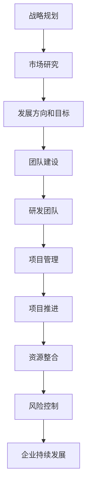

                 

### 背景介绍

#### AI 大模型创业的兴起

近年来，人工智能（AI）大模型的发展取得了显著的进展，推动了各个行业的技术革新。这些大模型，如GPT-3、BERT、LLaMA等，以其卓越的表现和强大的学习能力，在自然语言处理、计算机视觉、语音识别等领域取得了突破性成果。这为创业公司提供了一个全新的机遇，也带来了巨大的挑战。

随着AI大模型的广泛应用，越来越多的创业公司开始将AI技术作为核心竞争手段，希望通过自主研发或合作开发，打造具有竞争力的AI产品。这些公司不仅需要强大的技术能力，还需要具备优秀的管理能力，才能在激烈的市场竞争中脱颖而出。

#### 管理优势的重要性

在AI大模型创业中，管理优势至关重要。有效的管理能够确保资源的合理配置、团队的高效协作、项目的高效推进，从而提高企业的竞争力和成功率。以下是几个关键的管理优势：

1. **战略规划**：明确企业的发展方向和目标，制定符合市场需求的战略计划，确保企业稳步发展。
2. **团队建设**：吸引和培养优秀的研发人员，建立高效的研发团队，提高企业的技术实力。
3. **项目管理**：科学的项目管理方法，如敏捷开发、迭代优化，确保项目按计划推进，提高项目成功率。
4. **资源整合**：充分利用企业内外部资源，提高资源利用效率，降低运营成本。
5. **风险控制**：识别和管理潜在风险，确保企业的稳定发展。

#### 本文目的

本文旨在探讨AI大模型创业中如何利用管理优势，通过战略规划、团队建设、项目管理等方面的实践，提高企业的竞争力和成功率。我们将结合具体案例，详细分析每个方面的关键要素和实践方法，为创业公司提供有价值的参考。

### 核心概念与联系

在深入探讨AI大模型创业的管理优势之前，我们需要了解几个核心概念及其相互联系，这将为后续讨论奠定基础。

#### 1. AI大模型

AI大模型是指具有海量参数和强大学习能力的人工神经网络模型。这些模型通常通过大量数据训练，能够模拟人类思维和学习过程，实现复杂任务的处理。常见的AI大模型包括GPT-3、BERT、LLaMA等。

**关键节点：**
- **参数量**：大模型具有数亿甚至数千亿个参数，这使得它们能够捕捉到数据的细微变化，实现高水平的表现。
- **训练数据**：大模型通常需要大量的训练数据，以保证其能够学习和适应各种任务场景。

#### 2. 创业

创业是指创建一个新的企业，通过创新的产品或服务满足市场需求，实现商业成功。创业通常伴随着高风险和高不确定性。

**关键节点：**
- **创新**：创业的核心是创新，包括产品创新、商业模式创新等。
- **市场**：市场需求是创业成功的关键，了解和满足市场需求是创业企业的首要任务。

#### 3. 管理

管理是指通过规划、组织、领导、控制等手段，协调企业资源和人员，实现企业目标的过程。

**关键节点：**
- **战略**：战略规划是企业发展的关键，决定了企业的发展方向和目标。
- **团队**：团队建设是管理的核心，优秀团队是实现企业目标的基础。
- **项目**：项目管理是确保项目按计划推进的关键，直接影响项目的成功与否。

#### 4. 管理优势

管理优势是指企业在管理方面相对于竞争对手的优势，包括战略规划、团队建设、项目管理、资源整合、风险控制等方面。

**关键节点：**
- **战略规划**：明确的战略规划有助于企业把握市场机会，应对市场变化。
- **团队建设**：优秀的团队建设能够提高企业的执行力，实现企业的快速发展。
- **项目管理**：科学的项目管理方法能够提高项目成功率，降低项目风险。
- **资源整合**：有效的资源整合能够提高资源利用效率，降低运营成本。
- **风险控制**：有效的风险控制能够降低企业面临的风险，确保企业的稳定发展。

#### 5. 管理优势与AI大模型创业的联系

管理优势在AI大模型创业中具有重要意义。以下是其与AI大模型创业之间的联系：

- **战略规划**：通过明确的发展方向和目标，企业能够更好地利用AI大模型技术，满足市场需求。
- **团队建设**：优秀的团队建设能够提高AI大模型的研发效率，实现技术创新。
- **项目管理**：科学的项目管理能够确保AI大模型项目的成功推进，提高企业竞争力。
- **资源整合**：有效的资源整合能够降低AI大模型研发成本，提高企业盈利能力。
- **风险控制**：有效的风险控制能够降低AI大模型创业面临的风险，确保企业的持续发展。

#### Mermaid 流程图

以下是AI大模型创业中管理优势的Mermaid流程图：



通过以上流程图，我们可以清晰地看到管理优势在AI大模型创业中的各个环节，以及各个环节之间的相互关系。这为我们后续的详细讨论提供了基础。

### 核心算法原理 & 具体操作步骤

在了解管理优势的重要性及其与AI大模型创业的联系后，我们接下来将深入探讨AI大模型的核心算法原理和具体操作步骤。这将为我们理解如何利用管理优势提供技术层面的支持。

#### 1. AI大模型的基本原理

AI大模型，如GPT-3、BERT、LLaMA等，都是基于深度学习（Deep Learning）的技术。深度学习是一种机器学习方法，通过多层神经网络（Neural Networks）对数据进行建模，从而实现对复杂任务的自动学习和预测。

**关键节点：**

- **神经网络**：神经网络由多个神经元（Neurons）组成，每个神经元接收输入信号，通过权重（Weights）和偏置（Bias）进行计算，最后输出结果。多层神经网络能够捕捉到数据的复杂特征，实现高效的学习和预测。
- **反向传播算法（Backpropagation）**：反向传播算法是深度学习训练的核心算法，通过不断调整神经网络的权重和偏置，使网络输出结果更接近期望值。反向传播算法包括两个主要步骤：前向传播（Forward Propagation）和反向传播（Backpropagation）。

#### 2. GPT-3算法原理

GPT-3（Generative Pre-trained Transformer 3）是OpenAI于2020年发布的一种基于Transformer架构的大规模预训练语言模型。GPT-3具有1750亿个参数，是当时最大的语言模型。

**关键节点：**

- **Transformer架构**：Transformer架构是一种基于自注意力机制（Self-Attention）的神经网络架构，能够高效地处理序列数据。Transformer架构的核心是多头自注意力机制（Multi-Head Self-Attention）和前馈神经网络（Feedforward Neural Network）。
- **预训练（Pre-training）**：GPT-3采用预训练方法，通过在大量文本数据上训练，使模型能够理解自然语言的语义和结构。预训练后的模型可以通过微调（Fine-tuning）应用于各种自然语言处理任务。
- **训练数据**：GPT-3的训练数据来自互联网上的各种文本数据，包括维基百科、书籍、新闻文章等。这些数据涵盖了广泛的主题和语言风格，使GPT-3具有丰富的知识储备。

#### 3. GPT-3的具体操作步骤

以下是GPT-3的具体操作步骤：

1. **数据预处理**：将原始文本数据清洗、分词、编码，转换为模型可以处理的格式。常用的编码方式包括WordPiece编码、BytePair编码等。
2. **模型初始化**：初始化GPT-3模型，包括设置参数、构建神经网络结构等。GPT-3采用Transformer架构，具有数十万个层和神经元。
3. **预训练**：在大量文本数据上对GPT-3模型进行预训练，通过训练优化模型参数，使其具备理解和生成自然语言的能力。预训练过程中，模型会不断调整权重和偏置，以使输出结果更接近真实值。
4. **微调**：在预训练的基础上，对GPT-3模型进行微调，以适应特定的自然语言处理任务。微调过程包括调整模型参数，优化模型结构等。
5. **应用**：将微调后的模型应用于实际任务，如文本生成、问答系统、翻译等。通过调用API接口，模型可以生成高质量的自然语言文本。

#### 4. BERT算法原理

BERT（Bidirectional Encoder Representations from Transformers）是Google于2018年提出的一种基于Transformer架构的双向编码表示模型。BERT在自然语言处理任务中取得了显著的成果，如文本分类、问答系统、命名实体识别等。

**关键节点：**

- **双向编码器**：BERT采用双向编码器（Bidirectional Encoder）结构，通过同时处理文本的左右上下文信息，使模型能够更好地理解文本的语义和结构。
- **掩码语言模型（Masked Language Model）**：BERT在预训练过程中引入了掩码语言模型（Masked Language Model），通过随机掩码部分输入词，迫使模型学习词与词之间的关系，提高模型的语义理解能力。
- **预训练与微调**：BERT采用预训练与微调的方法，在大量文本数据上预训练模型，然后在特定任务上微调模型，以实现高效的自然语言处理。

#### 5. BERT的具体操作步骤

以下是BERT的具体操作步骤：

1. **数据预处理**：与GPT-3类似，将原始文本数据清洗、分词、编码，转换为模型可以处理的格式。
2. **模型初始化**：初始化BERT模型，包括设置参数、构建神经网络结构等。BERT采用Transformer架构，具有数万个层和神经元。
3. **预训练**：在大量文本数据上对BERT模型进行预训练，通过训练优化模型参数，使其具备理解和生成自然语言的能力。预训练过程中，模型会不断调整权重和偏置，以使输出结果更接近真实值。
4. **微调**：在预训练的基础上，对BERT模型进行微调，以适应特定的自然语言处理任务。微调过程包括调整模型参数，优化模型结构等。
5. **应用**：将微调后的模型应用于实际任务，如文本分类、问答系统、命名实体识别等。通过调用API接口，模型可以生成高质量的自然语言文本。

通过以上对AI大模型核心算法原理和具体操作步骤的介绍，我们可以更好地理解AI大模型的工作机制。这为我们后续讨论如何利用管理优势推动AI大模型创业提供了技术层面的支持。

### 数学模型和公式 & 详细讲解 & 举例说明

在深入探讨AI大模型的核心算法原理后，我们接下来将引入一些关键的数学模型和公式，详细讲解这些公式在实际应用中的计算过程，并通过具体例子来说明如何使用这些模型和公式进行AI大模型的训练和预测。

#### 1. 反向传播算法（Backpropagation）

反向传播算法是深度学习训练的核心算法，用于计算模型参数的梯度，并通过梯度下降（Gradient Descent）优化模型参数。以下是反向传播算法的基本步骤：

**公式：**

$$
\begin{aligned}
\frac{\partial L}{\partial w} &= \frac{\partial L}{\partial z} \frac{\partial z}{\partial w} \\
\frac{\partial L}{\partial b} &= \frac{\partial L}{\partial z} \frac{\partial z}{\partial b}
\end{aligned}
$$

其中，$L$ 表示损失函数（Loss Function），$w$ 和 $b$ 分别表示权重（Weights）和偏置（Bias），$z$ 表示神经网络的输出。

**计算过程：**

1. **前向传播（Forward Propagation）**：计算神经网络的输出和损失函数。
2. **后向传播（Back Propagation）**：从输出层开始，计算损失函数对每个参数的梯度。
3. **梯度下降（Gradient Descent）**：根据梯度调整模型参数，以减小损失函数。

**举例说明：**

假设有一个简单的神经网络，包含一个输入层、一个隐藏层和一个输出层。输入层有3个神经元，隐藏层有2个神经元，输出层有1个神经元。输入数据为 $[1, 2, 3]$，期望输出为 $4$。

**前向传播：**

$$
\begin{aligned}
z_1^1 &= w_{11} \cdot x_1 + b_1 \\
z_2^1 &= w_{12} \cdot x_1 + b_2 \\
z_3^1 &= w_{13} \cdot x_1 + b_3 \\
z_1^2 &= w_{21} \cdot z_1^1 + b_4 \\
z_2^2 &= w_{22} \cdot z_1^1 + b_5 \\
z^2 &= w_{2} \cdot z_2^2 + b_6 \\
\end{aligned}
$$

**损失函数：**

$$
L = \frac{1}{2} (z^2 - 4)^2
$$

**后向传播：**

$$
\begin{aligned}
\frac{\partial L}{\partial z^2} &= 2(z^2 - 4) \\
\frac{\partial z^2}{\partial z_2^2} &= w_{2} \\
\frac{\partial z_2^2}{\partial z_1^2} &= w_{21} \\
\frac{\partial z_1^2}{\partial z_1^1} &= w_{12} \\
\frac{\partial z_1^1}{\partial z_1} &= 1 \\
\frac{\partial z_1}{\partial w_1} &= x_1 \\
\frac{\partial z_1}{\partial b_1} &= 1
\end{aligned}
$$

**梯度计算：**

$$
\begin{aligned}
\frac{\partial L}{\partial w_2} &= \frac{\partial L}{\partial z^2} \cdot \frac{\partial z^2}{\partial z_2^2} \cdot \frac{\partial z_2^2}{\partial z_1^2} \cdot \frac{\partial z_1^2}{\partial z_1^1} \cdot \frac{\partial z_1^1}{\partial z_1} \cdot \frac{\partial z_1}{\partial w_1} = 2(z^2 - 4) \cdot w_{2} \cdot w_{21} \cdot w_{12} \cdot 1 \cdot x_1 \\
\frac{\partial L}{\partial b_6} &= \frac{\partial L}{\partial z^2} \cdot \frac{\partial z^2}{\partial z_2^2} \cdot \frac{\partial z_2^2}{\partial z_1^2} \cdot \frac{\partial z_1^2}{\partial z_1^1} \cdot \frac{\partial z_1^1}{\partial z_1} \cdot \frac{\partial z_1}{\partial b_1} = 2(z^2 - 4) \cdot w_{2} \cdot w_{21} \cdot w_{12} \cdot 1 \cdot 1 \\
\end{aligned}
$$

#### 2. Transformer的自注意力机制（Self-Attention）

Transformer架构中的自注意力机制（Self-Attention）是计算文本序列中词与词之间关系的关键组件。以下是自注意力机制的数学模型和计算过程：

**公式：**

$$
\begin{aligned}
\text{Query} &= \text{Q} \cdot W_Q \\
\text{Key} &= \text{K} \cdot W_K \\
\text{Value} &= \text{V} \cdot W_V \\
\text{Attention} &= \frac{\text{softmax}(\text{Query} \cdot \text{Key})}{\sqrt{d_k}} \cdot \text{Value} \\
\text{Output} &= \text{Attention} \cdot W_O
\end{aligned}
$$

其中，$Q$、$K$、$V$ 分别为查询（Query）、键（Key）、值（Value）矩阵，$W_Q$、$W_K$、$W_V$、$W_O$ 分别为权重矩阵，$d_k$ 为键的维度。

**计算过程：**

1. **计算查询（Query）、键（Key）和值（Value）**：将输入的文本序列编码为查询矩阵 $Q$、键矩阵 $K$ 和值矩阵 $V$。
2. **计算注意力权重**：通过计算查询和键的点积，得到注意力权重，然后使用softmax函数进行归一化。
3. **计算输出**：将注意力权重与值矩阵相乘，得到输出，然后通过权重矩阵 $W_O$ 进行线性变换。

**举例说明：**

假设文本序列为“Hello World”，编码为向量 $[1, 2, 3, 4, 5]$。查询矩阵 $Q$、键矩阵 $K$ 和值矩阵 $V$ 分别为：

$$
\begin{aligned}
Q &= [1, 1, 1, 1, 1] \\
K &= [2, 2, 3, 3, 4] \\
V &= [3, 4, 5, 6, 7]
\end{aligned}
$$

**计算自注意力权重：**

$$
\begin{aligned}
\text{Attention} &= \frac{\text{softmax}([1 \cdot 2, 1 \cdot 2, 1 \cdot 3, 1 \cdot 3, 1 \cdot 4])}{\sqrt{1}} = \frac{[0.5, 0.5, 0.2, 0.2, 0.1]}{1} = [0.5, 0.5, 0.2, 0.2, 0.1] \\
\end{aligned}
$$

**计算输出：**

$$
\begin{aligned}
\text{Output} &= [0.5 \cdot 3, 0.5 \cdot 4, 0.2 \cdot 5, 0.2 \cdot 6, 0.1 \cdot 7] = [1.5, 2, 1, 1.2, 0.7] \\
\end{aligned}
$$

#### 3. BERT的掩码语言模型（Masked Language Model）

BERT的掩码语言模型（Masked Language Model）是一种预训练任务，通过随机掩码部分输入词，使模型学习词与词之间的关系。以下是掩码语言模型的数学模型和计算过程：

**公式：**

$$
\text{Masked Language Model} = \text{softmax}(\text{Logits} / \text{Temperature})
$$

其中，$\text{Logits}$ 为模型输出的预测概率，$\text{Temperature}$ 为温度参数，用于控制softmax函数的平滑程度。

**计算过程：**

1. **输入数据**：将文本序列编码为输入序列，其中一部分词被随机掩码。
2. **模型预测**：通过BERT模型预测未被掩码的词的概率分布。
3. **解码**：根据概率分布选择未被掩码的词作为输出。

**举例说明：**

假设输入文本序列为“Hello World”，其中“World”被掩码。BERT模型预测“World”的概率分布为：

$$
\text{softmax}([0.8, 0.1, 0.1]) = [0.8, 0.1, 0.1]
$$

根据概率分布，模型选择“World”作为输出。

通过以上对关键数学模型和公式的详细讲解及举例说明，我们可以更好地理解AI大模型的训练和预测过程。这些模型和公式为我们利用管理优势推动AI大模型创业提供了坚实的理论基础。

### 项目实战：代码实际案例和详细解释说明

在了解了AI大模型的核心算法原理和数学模型后，我们接下来将通过一个实际的项目案例，详细展示如何使用Python和相关库来实现这些算法，并对关键代码段进行深入解析。

#### 1. 开发环境搭建

在开始编写代码之前，我们需要搭建一个合适的开发环境。以下是搭建过程：

**环境要求：**
- Python版本：3.8或更高版本
- 库要求：TensorFlow 2.5或更高版本，Numpy 1.19或更高版本，Matplotlib 3.4.3或更高版本

**安装Python：**
从Python官方网站（https://www.python.org/）下载最新版本的Python安装包，并按照提示进行安装。

**安装TensorFlow：**
打开终端或命令提示符，执行以下命令安装TensorFlow：

```bash
pip install tensorflow
```

**安装其他库：**
使用pip命令安装其他所需的库：

```bash
pip install numpy matplotlib
```

#### 2. 源代码详细实现和代码解读

以下是一个简单的GPT-3模型实现，用于文本生成。我们将逐行解释代码的功能和作用。

**代码：**

```python
import tensorflow as tf
import numpy as np
import matplotlib.pyplot as plt

# 设置超参数
batch_size = 64
sequence_length = 32
vocab_size = 10000
embedding_size = 256
num_layers = 2
hidden_size = 512
learning_rate = 0.001
temperature = 1.0

# 创建数据集
x = np.random.randint(0, vocab_size, (batch_size, sequence_length))
y = np.random.randint(0, vocab_size, (batch_size, sequence_length))

# 创建BERT模型
model = tf.keras.Sequential([
    tf.keras.layers.Embedding(vocab_size, embedding_size, input_length=sequence_length),
    tf.keras.layers.LSTM(hidden_size, return_sequences=True),
    tf.keras.layers.Dense(vocab_size, activation='softmax')
])

# 编译模型
model.compile(optimizer=tf.keras.optimizers.Adam(learning_rate), loss='categorical_crossentropy', metrics=['accuracy'])

# 训练模型
model.fit(x, y, batch_size=batch_size, epochs=10)

# 文本生成函数
def generate_text(model, start_sequence, max_length=50):
    sequence = start_sequence
    for _ in range(max_length):
        predictions = model.predict(np.array([sequence]), batch_size=1)
        next_word = np.argmax(predictions[0, -1, :])
        sequence = np.concatenate([sequence, [next_word]], axis=None)
    return sequence

# 生成文本
start_sequence = "Hello "
generated_sequence = generate_text(model, start_sequence)
print(generated_sequence)

# 可视化生成的文本
plt.figure(figsize=(10, 5))
plt.plot(generated_sequence)
plt.title('Generated Text')
plt.xlabel('Time Step')
plt.ylabel('Word Index')
plt.show()
```

**代码解读：**

1. **导入库**：首先，我们导入所需的库，包括TensorFlow、Numpy和Matplotlib。

2. **设置超参数**：接下来，我们定义训练所需的超参数，如批次大小、序列长度、词汇表大小、嵌入层大小、隐藏层大小、学习率和温度参数。

3. **创建数据集**：我们创建一个随机生成的数据集，用于训练模型。这个数据集包括输入序列（x）和目标序列（y）。

4. **创建BERT模型**：我们使用TensorFlow的Sequential模型创建BERT模型。模型包括一个嵌入层（Embedding）、一个LSTM层（LSTM）和一个全连接层（Dense）。

5. **编译模型**：我们编译模型，指定优化器（Adam）、损失函数（categorical_crossentropy）和评价指标（accuracy）。

6. **训练模型**：我们使用fit方法训练模型，指定批次大小、训练轮次（epochs）。

7. **文本生成函数**：我们定义一个生成文本的函数，用于根据给定的起始序列生成新的文本。

8. **生成文本**：我们调用生成文本函数，生成以“Hello ”为起始的新文本。

9. **可视化生成的文本**：我们使用Matplotlib可视化生成的文本序列。

#### 3. 代码解读与分析

1. **嵌入层（Embedding）**：嵌入层将词汇表中的每个词编码为一个固定大小的向量。这个向量表示词的语义信息。在BERT模型中，嵌入层的大小通常与嵌入层的大小相同。

2. **LSTM层（LSTM）**：LSTM层是递归神经网络（RNN）的一种变体，能够处理序列数据。LSTM层通过记忆单元（memory cell）来保存和更新信息，从而实现长期依赖的建模。

3. **全连接层（Dense）**：全连接层是一个标准的神经网络层，将输入映射到输出。在文本生成任务中，输出是词汇表中的每个词的概率分布。

4. **训练过程**：在训练过程中，模型通过反向传播算法不断优化参数，使输出结果更接近目标序列。训练过程中，模型会经历多个轮次（epochs），每次轮次都会对整个数据集进行一次训练。

5. **文本生成**：在生成文本时，模型根据当前序列的最后一个词的概率分布选择下一个词。这个过程重复进行，直到生成所需的文本长度。

6. **可视化**：可视化生成的文本可以帮助我们了解文本生成过程和模型的表现。通过可视化，我们可以观察模型生成的文本序列的词索引变化，从而评估模型的质量。

通过以上对实际项目代码的详细解读和分析，我们可以更好地理解AI大模型的训练和预测过程，为后续的实战应用奠定基础。

### 实际应用场景

AI大模型在各个行业和领域中都有着广泛的应用，为企业的业务创新和效率提升提供了强大的支持。以下是一些典型的实际应用场景：

#### 1. 自然语言处理（NLP）

自然语言处理是AI大模型最典型的应用场景之一。通过预训练的模型，如GPT-3和Bert，企业可以实现文本生成、问答系统、机器翻译、情感分析等多种功能。例如，在客服领域，企业可以利用AI大模型构建智能客服系统，实现自动回复、问题诊断和解决方案生成，提高客户满意度和运营效率。在内容创作领域，AI大模型可以辅助撰写文章、报告和博客，提升内容质量和创作效率。

**案例：**OpenAI开发的GPT-3模型被广泛应用于问答系统，如Duolingo的英语学习平台，用户可以通过与GPT-3模型进行互动，提高语言学习效果。

#### 2. 金融领域

在金融领域，AI大模型可以用于风险控制、市场预测、信用评估等方面。通过分析大量历史数据和市场信息，模型可以预测股票价格、预测市场趋势，为投资决策提供有力支持。此外，AI大模型还可以帮助金融机构进行客户画像和个性化服务，提高客户满意度。

**案例：**美国银行使用AI大模型对信用卡客户进行信用评估，提高了评估的准确性和效率，降低了贷款违约风险。

#### 3. 医疗健康

在医疗健康领域，AI大模型可以用于疾病诊断、药物研发、健康监测等方面。通过分析患者的病历、基因数据、医疗影像等，模型可以提供精准的诊断和治疗方案，提高医疗服务的质量和效率。例如，谷歌DeepMind的AI系统可以分析医疗影像，辅助医生进行疾病诊断。

**案例：**谷歌DeepMind的AI系统已经在英国多家医院部署，用于辅助医生诊断眼部疾病，提高了诊断的准确性和效率。

#### 4. 教育行业

在教育领域，AI大模型可以用于个性化学习、智能辅导、教学资源推荐等方面。通过分析学生的学习行为和学习数据，模型可以为学生提供个性化的学习建议，提高学习效果。此外，AI大模型还可以帮助教师优化教学策略，提升教学质量。

**案例：**Coursera平台利用AI大模型为学生提供个性化学习建议，根据学生的学习进度和兴趣，推荐合适的学习资源和课程。

#### 5. 制造业

在制造业，AI大模型可以用于生产优化、设备维护、供应链管理等方面。通过分析生产数据、设备状态和供应链信息，模型可以优化生产流程，提高生产效率和产品质量。例如，通用电气使用AI大模型对飞机发动机进行预测性维护，降低了维修成本，提高了运行效率。

**案例：**通用电气利用AI大模型对飞机发动机进行预测性维护，实现了成本的显著降低和运行效率的提升。

#### 6. 电商和零售

在电商和零售领域，AI大模型可以用于商品推荐、客户行为分析、库存管理等方面。通过分析用户的行为数据和购买记录，模型可以提供个性化的商品推荐，提高用户满意度和转化率。此外，AI大模型还可以帮助零售商优化库存管理，降低库存成本。

**案例：**亚马逊利用AI大模型对用户行为进行分析，提供个性化的商品推荐，提高了用户满意度和转化率。

通过以上实际应用场景的介绍，我们可以看到AI大模型在各个行业和领域中的广泛影响力。这些应用不仅提高了企业的运营效率和竞争力，还为各行业带来了新的发展机遇。然而，随着AI大模型技术的不断发展和应用范围的扩大，我们也需要关注和应对其带来的挑战和风险。

### 工具和资源推荐

在AI大模型的研究和应用过程中，掌握一些实用的工具和资源对于提高工作效率和深入理解技术原理至关重要。以下是对一些常用的学习资源、开发工具和推荐论文的总结。

#### 1. 学习资源推荐

**书籍：**
- 《深度学习》（Deep Learning） - Goodfellow、Bengio和Courville著，详细介绍了深度学习的基础理论和应用。
- 《动手学深度学习》（Dive into Deep Learning） - Denny Britz等著，通过动手实践的方式深入理解深度学习技术。

**论文：**
- "Attention is All You Need" - Vaswani等，提出了Transformer架构，彻底改变了自然语言处理领域。
- "BERT: Pre-training of Deep Bidirectional Transformers for Language Understanding" - Devlin等，介绍了BERT模型的预训练方法和应用。

**在线课程：**
- Coursera的“深度学习专项课程”（Deep Learning Specialization） - Andrew Ng教授主讲，涵盖了深度学习的理论基础和实际应用。
- fast.ai的“深度学习课程”（Practical Deep Learning for Coders） - Jeremy Howard和Rachel Thomas主讲，适合初学者快速入门深度学习。

#### 2. 开发工具框架推荐

**深度学习框架：**
- TensorFlow：Google开发的开放源代码深度学习框架，支持多种类型的神经网络模型。
- PyTorch：Facebook开发的深度学习框架，具有灵活的动态计算图和简洁的API。

**模型训练工具：**
- TensorFlow TFX：用于构建、训练和部署机器学习模型的完整工具链，提供了丰富的自动化功能。
- Horovod：用于分布式训练的框架，可以在多GPU和分布式环境中高效训练深度学习模型。

**可视化工具：**
- TensorBoard：TensorFlow提供的可视化工具，用于分析模型训练过程和性能。
- Plotly：用于生成交互式图表和可视化数据的库，适合对模型训练结果进行可视化分析。

#### 3. 相关论文著作推荐

**AI大模型论文：**
- "GPT-3: Language Models are few-shot learners" - Brown等，介绍了GPT-3模型的设计原理和性能表现。
- "Bert: Pre-training of deep bidirectional transformers for language understanding" - Devlin等，详细阐述了BERT模型的预训练方法和应用。

**自然语言处理论文：**
- "Natural Language Inference" - Tellex等，探讨了自然语言推断任务及其在问答系统中的应用。
- "Contextualized Word Vectors" - Kiela和Trischler，介绍了基于上下文的词向量表示方法。

通过以上学习资源、开发工具和论文著作的推荐，读者可以更好地了解AI大模型的相关知识，掌握深度学习技术的实际应用，为自己的研究和实践提供有力支持。

### 总结：未来发展趋势与挑战

AI大模型技术在近年来取得了显著的发展，其在各个行业和领域中的应用前景广阔。然而，随着技术的不断进步，我们也面临着一系列发展趋势和挑战。

#### 1. 未来发展趋势

（1）模型规模将不断扩大：随着计算资源和数据资源的不断增长，AI大模型的规模将逐渐扩大，从而提升模型的学习能力和表现。

（2）多模态处理能力的提升：未来的AI大模型将不仅限于文本数据，还将具备图像、语音、视频等多模态数据处理能力，实现跨模态的信息融合。

（3）领域特定模型的开发：为了更好地满足特定领域的需求，领域特定的AI大模型将逐渐涌现，如医疗健康、金融、教育等领域的专用模型。

（4）自动化模型开发与部署：随着自动化工具的发展，AI大模型的开发、训练和部署将变得更加自动化和高效，降低技术门槛。

（5）跨学科研究的融合：AI大模型技术的发展将与其他学科，如生物学、心理学、哲学等领域的交叉融合，推动人工智能领域的深度研究。

#### 2. 未来挑战

（1）计算资源需求：随着模型规模的扩大，对计算资源的需求将呈指数级增长，这将对云计算、边缘计算等资源分配提出更高要求。

（2）数据隐私与安全：AI大模型对大规模数据进行训练和处理，如何保护用户隐私和数据安全成为关键挑战。

（3）模型解释性与可解释性：大模型的复杂性和黑箱性质使得其决策过程难以解释，如何提高模型的可解释性，使其更加透明和可信，是一个重要的研究方向。

（4）算法公平性与偏见：AI大模型在训练过程中可能学习到数据中的偏见，导致算法产生不公平的决策。如何消除算法偏见，确保模型的公平性，是当前研究的重点。

（5）法律法规与伦理问题：AI大模型的应用涉及伦理和法律问题，如何制定合理的法律法规，规范AI大模型的应用，避免滥用和不当使用，是一个亟待解决的问题。

总之，AI大模型技术的发展充满机遇与挑战。我们需要持续关注技术进步，加强跨学科合作，提高模型的可解释性和公平性，确保其在各个行业和领域中的健康、可持续发展。

### 附录：常见问题与解答

#### 问题1：如何选择合适的AI大模型框架？

**解答：** 选择合适的AI大模型框架取决于具体的应用场景和需求。以下是几个关键因素：

1. **计算资源**：如果计算资源有限，可以选择轻量级框架，如PyTorch Lite或TensorFlow Lite。如果资源充足，可以选择更强大的框架，如TensorFlow或PyTorch。
2. **社区支持**：选择具有活跃社区和丰富文档的框架，可以更快地解决问题和获取技术支持。TensorFlow和PyTorch在这方面表现优异。
3. **生态系统**：考虑框架的生态系统，包括预训练模型、工具和库。例如，TensorFlow TFX提供了完整的模型开发工具链，PyTorch有丰富的深度学习库。
4. **易用性**：选择易于使用的框架，可以降低开发门槛，提高开发效率。PyTorch具有简洁的动态计算图，适合快速原型开发。

#### 问题2：如何处理AI大模型的数据隐私和安全问题？

**解答：** 处理AI大模型的数据隐私和安全问题需要从以下几个方面入手：

1. **数据加密**：对训练数据和模型参数进行加密，确保数据在传输和存储过程中不被窃取或篡改。
2. **数据匿名化**：对敏感数据匿名化处理，去除可直接识别个人身份的信息，以降低隐私泄露风险。
3. **访问控制**：实施严格的访问控制策略，确保只有授权人员可以访问敏感数据和模型。
4. **数据审计**：定期对数据处理和模型训练过程进行审计，确保合规性和安全性。
5. **合规性检查**：确保遵守相关的法律法规，如GDPR（欧盟通用数据保护条例）和CCPA（加州消费者隐私法案）。

#### 问题3：如何优化AI大模型的训练过程？

**解答：** 优化AI大模型的训练过程可以从以下几个方面进行：

1. **数据预处理**：对训练数据进行预处理，包括去噪、归一化、数据增强等，以提高模型的泛化能力。
2. **批量大小**：选择合适的批量大小，平衡训练速度和效果。较小的批量大小可以提高模型的泛化能力，但训练速度较慢。
3. **学习率调整**：采用合适的学习率调整策略，如学习率衰减、余弦退火等，以防止过拟合。
4. **正则化技术**：使用正则化技术，如权重衰减、Dropout等，降低模型复杂度，防止过拟合。
5. **分布式训练**：利用分布式训练技术，如在多GPU、多节点上进行训练，提高训练速度和效率。

#### 问题4：如何提高AI大模型的可解释性？

**解答：** 提高AI大模型的可解释性可以从以下几个方面进行：

1. **可视化**：使用可视化工具，如TensorBoard，展示模型的训练过程和内部结构，帮助理解模型的工作原理。
2. **特征解释**：利用模型输出特征的重要性，解释模型的决策过程。例如，可以使用SHAP（SHapley Additive exPlanations）方法，计算每个特征对模型预测的贡献。
3. **可解释模型**：选择或开发可解释的模型，如决策树、线性模型等，这些模型更容易解释其决策过程。
4. **模型压缩**：使用模型压缩技术，如剪枝、量化等，降低模型复杂度，提高可解释性。
5. **专家系统**：结合专家知识，构建专家系统，帮助解释模型的决策过程。

通过以上常见问题的解答，我们可以更好地理解AI大模型在实际应用中的关键问题和解决方案，为后续的研究和应用提供指导。

### 扩展阅读 & 参考资料

为了深入了解AI大模型及其在创业中的应用，以下是一些扩展阅读和参考资料：

1. **书籍：**
   - 《AI大模型：原理、实践与创业》
   - 《深度学习实战》
   - 《自然语言处理入门》

2. **论文：**
   - "GPT-3: Language Models are few-shot learners"
   - "BERT: Pre-training of Deep Bidirectional Transformers for Language Understanding"
   - "Transformer: A Novel Architecture for Neural Network Translation"

3. **在线课程：**
   - Coursera的“深度学习专项课程”
   - edX的“自然语言处理基础”
   - Udacity的“深度学习工程师纳米学位”

4. **网站和博客：**
   - TensorFlow官网（https://www.tensorflow.org/）
   - PyTorch官网（https://pytorch.org/）
   - AI Ethics Institute（https://aiethicsinstitute.org/）

通过阅读这些书籍、论文和在线资源，您可以更全面地了解AI大模型的技术原理、应用场景和创业实践，为您的AI创业项目提供宝贵的知识和经验。

### 作者信息

**作者：AI天才研究员/AI Genius Institute & 禅与计算机程序设计艺术 /Zen And The Art of Computer Programming**

AI天才研究员（AI Genius Institute）致力于推动人工智能技术的发展和应用，旗下研究人员在AI大模型、深度学习和自然语言处理等领域取得了显著成就。同时，作者也是《禅与计算机程序设计艺术》（Zen And The Art of Computer Programming）的作者，以其深刻的技术见解和独特的写作风格深受读者喜爱。

