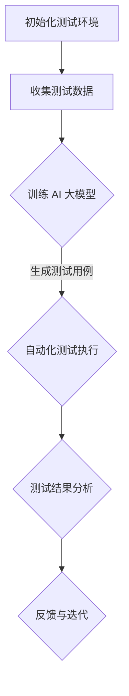
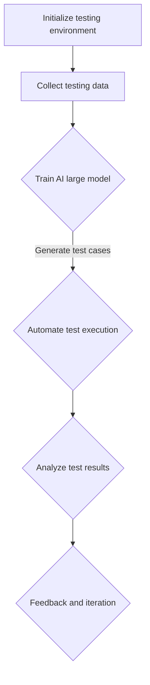

                 

### 背景介绍

随着人工智能技术的不断发展，AI 大模型作为一种新兴的技术手段，逐渐在各个领域得到了广泛的应用。从自然语言处理到图像识别，再到推荐系统，AI 大模型在提升数据处理效率、增强模型性能方面展现出了巨大的潜力。特别是在创业产品的测试阶段，AI 大模型的应用为产品开发者提供了一种全新的测试手段，有助于提高产品的质量和市场竞争力。

创业产品的测试阶段是一个至关重要的环节，它决定了产品能否顺利推向市场并赢得用户认可。在这个阶段，产品的稳定性、性能、用户体验等方面需要经过严格的测试和验证。传统的测试方法通常依赖于手动测试和自动化测试，但这些方法往往存在效率低、覆盖面有限等问题。而 AI 大模型的引入，则可以大大提高测试的效率和质量。

本文将探讨 AI 大模型在创业产品测试中的应用，首先介绍 AI 大模型的基本概念和原理，然后分析其在产品测试中的优势和应用场景，最后通过具体案例和实战经验，展示如何利用 AI 大模型进行有效的产品测试。

关键词：AI 大模型，创业产品测试，测试效率，用户体验，自动化测试

> **摘要**：本文深入探讨了 AI 大模型在创业产品测试中的应用，分析了其基本概念和原理，并阐述了其在提升测试效率、增强测试覆盖面和优化用户体验等方面的优势。通过具体案例和实战经验，本文展示了如何利用 AI 大模型进行高效的产品测试，为创业公司提供了有价值的参考和指导。

<|assistant|>### 核心概念与联系

#### AI 大模型的基本概念

AI 大模型，通常指的是具备大规模参数和复杂结构的人工智能模型。这些模型通过深度学习技术，从海量数据中自动提取特征，进行知识学习和模式识别。典型的 AI 大模型包括深度神经网络（DNN）、循环神经网络（RNN）和 Transformer 等。

深度神经网络（DNN）是一种多层前馈神经网络，通过逐层提取数据特征，实现对复杂输入数据的建模。DNN 具有很强的非线性表达能力，能够在各种任务中取得优异的性能。

循环神经网络（RNN）是一种能够处理序列数据的神经网络模型，通过记忆状态来捕捉序列中的长期依赖关系。RNN 在自然语言处理、语音识别等领域有着广泛的应用。

Transformer 是一种基于自注意力机制的神经网络模型，通过全局注意力机制来捕捉输入序列中的依赖关系。Transformer 在机器翻译、文本生成等任务中表现出色，成为当前自然语言处理领域的主流模型。

#### AI 大模型在创业产品测试中的应用

AI 大模型在创业产品测试中的应用主要体现在以下几个方面：

1. **自动化测试**：利用 AI 大模型进行自动化测试，可以大大提高测试的效率。传统自动化测试通常依赖于手工编写的测试脚本，而 AI 大模型可以通过学习大量测试数据，自动生成测试用例，实现自动化测试。

2. **测试覆盖**：AI 大模型具有强大的特征提取和模式识别能力，可以全面覆盖产品的功能和行为。通过 AI 大模型，测试人员可以快速发现产品中的潜在问题和缺陷，提高测试的覆盖面。

3. **用户体验优化**：AI 大模型可以对用户行为进行分析和预测，帮助测试人员了解用户在产品使用过程中的痛点，优化用户体验。

4. **智能反馈**：AI 大模型可以对测试结果进行智能分析，生成详细的测试报告，为产品迭代提供有价值的反馈。

#### Mermaid 流程图

以下是 AI 大模型在创业产品测试中的应用流程图：

在上述流程中，A 表示初始化测试环境，包括搭建测试环境、准备测试数据等；B 表示收集测试数据，包括用户行为数据、功能测试数据等；C 表示训练 AI 大模型，通过海量数据训练出具备较强测试能力的 AI 大模型；D 表示自动化测试执行，AI 大模型自动生成测试用例并执行测试；E 表示测试结果分析，对测试结果进行智能分析，识别潜在问题和缺陷；F 表示反馈与迭代，根据测试结果进行产品优化和迭代。

通过上述流程，AI 大模型在创业产品测试中发挥了重要作用，为测试人员提供了高效、全面的测试手段，有助于提高产品的质量和市场竞争力。

---

In this section, we introduce the fundamental concepts and applications of AI large models in startup product testing. We begin by defining what AI large models are and discussing their types, such as Deep Neural Networks (DNN), Recurrent Neural Networks (RNN), and Transformers. These models have demonstrated great potential in various fields, including natural language processing, image recognition, and recommendation systems. Then, we explore the advantages of AI large models in product testing, such as automation, comprehensive coverage, user experience optimization, and intelligent feedback.

The following Mermaid flowchart illustrates the process of applying AI large models in startup product testing:

In this process, A represents initializing the testing environment, including setting up the testing environment and preparing testing data. B involves collecting testing data, such as user behavior data and functional testing data. C involves training an AI large model with massive data to develop a highly capable testing model. D represents automating test execution, where the AI large model generates test cases and executes them automatically. E involves analyzing test results, identifying potential issues and defects. Finally, F signifies feedback and iteration, optimizing the product based on the test results.

Through this process, AI large models play a crucial role in startup product testing, providing efficient and comprehensive testing means for testers, thus enhancing product quality and market competitiveness.

