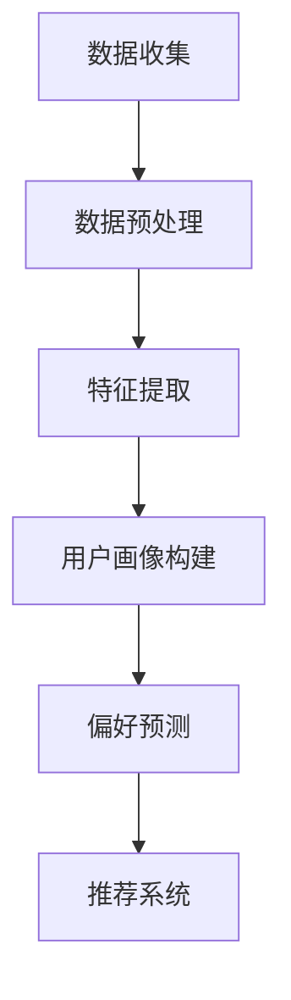

                 

### 文章标题：AI 大模型在电商推荐中的用户画像应用：深度挖掘用户需求与偏好

> **关键词：** 电商推荐、用户画像、大模型、深度学习、需求与偏好挖掘

**摘要：** 本文将探讨人工智能大模型在电商推荐中的用户画像应用。通过对用户需求与偏好的深度挖掘，大模型能够为电商企业提供精确的个性化推荐服务。本文首先介绍了电商推荐系统的背景，然后深入分析了用户画像的核心概念和建模方法，接着详细阐述了基于大模型的推荐算法原理和具体操作步骤，并通过实际项目案例进行了实战分析。最后，本文总结了用户画像应用的发展趋势与挑战，并推荐了相关学习资源和工具框架。

### 1. 背景介绍

#### 1.1 电商推荐系统的现状与挑战

随着互联网技术的飞速发展，电子商务已经成为人们日常生活中不可或缺的一部分。电商平台的数量和用户规模逐年增长，用户在平台上的消费行为也变得越来越多样化。为了提升用户体验，电商企业纷纷推出了个性化推荐系统，以期通过精准的推荐来满足用户的需求。

目前，电商推荐系统主要面临以下几大挑战：

1. **数据质量：** 电商平台上积累了海量的用户行为数据，然而，这些数据的质量参差不齐，其中存在大量的噪声和缺失值。如何从这些数据中提取有效的信息，是推荐系统亟待解决的问题。

2. **个性化需求：** 用户的偏好和需求具有强烈的个性化和动态性。传统的推荐算法往往难以捕捉到用户在特定时刻的个性化需求，导致推荐效果不佳。

3. **计算性能：** 随着用户规模的不断扩大，推荐系统需要处理的数据量和计算量也在急剧增加。如何在保证推荐效果的同时，提高系统的计算性能，是当前的一大难题。

#### 1.2 大模型在电商推荐中的应用

为了应对上述挑战，人工智能大模型（如深度学习模型、图神经网络模型等）在电商推荐中的应用逐渐成为一种趋势。大模型具有以下优势：

1. **数据处理能力：** 大模型能够自动从海量数据中提取特征，处理数据质量问题。

2. **个性化推荐：** 大模型能够捕捉到用户的长期和短期偏好，提供更个性化的推荐服务。

3. **计算性能：** 大模型在计算性能上的优势，使得推荐系统能够快速响应用户请求，提高用户体验。

本文将围绕大模型在电商推荐中的用户画像应用，深入探讨其核心概念、算法原理和实践方法。

#### 1.3 用户画像在电商推荐中的作用

用户画像是一种用于描述用户特征和需求的数据模型，它能够帮助电商企业更好地了解用户，从而实现精准的个性化推荐。用户画像在电商推荐中具有以下重要作用：

1. **提升推荐精度：** 通过构建用户画像，推荐系统可以更准确地捕捉用户的兴趣和需求，提高推荐的相关性。

2. **降低用户流失率：** 了解用户的偏好和需求，可以帮助电商企业及时调整策略，减少用户流失。

3. **优化用户体验：** 精准的推荐能够提升用户在电商平台上的购物体验，增加用户粘性。

### 2. 核心概念与联系

#### 2.1 大模型概述

大模型（Large-scale Model）是指参数规模达到百万甚至亿级的深度学习模型。大模型在人工智能领域取得了显著的成果，其核心特点是能够从海量数据中自动提取复杂特征，并在多个任务上取得优秀的性能。

#### 2.2 用户画像概述

用户画像（User Profiling）是指基于用户行为、偏好、属性等多维度数据，构建的用户特征模型。用户画像能够帮助电商企业全面了解用户，从而实现精准的个性化推荐。

#### 2.3 大模型在用户画像中的应用

大模型在用户画像中的应用主要体现在以下几个方面：

1. **特征提取：** 大模型能够从海量用户数据中自动提取有用的特征，降低数据处理的复杂度。

2. **偏好预测：** 大模型能够捕捉用户的长期和短期偏好，为推荐系统提供有效的输入。

3. **需求挖掘：** 大模型能够通过分析用户行为数据，挖掘出用户潜在的需求和兴趣点。

#### 2.4 Mermaid 流程图

下面是一个简单的 Mermaid 流程图，用于描述大模型在用户画像中的应用流程：



### 3. 核心算法原理 & 具体操作步骤

#### 3.1 深度学习模型原理

深度学习模型是一种能够自动从数据中学习特征和规律的机器学习模型。在用户画像应用中，深度学习模型主要用于特征提取和偏好预测。以下是几种常用的深度学习模型：

1. **卷积神经网络（CNN）：** CNN 是一种用于图像处理和特征提取的深度学习模型。在用户画像应用中，CNN 可以用于提取用户行为数据的时空特征。

2. **循环神经网络（RNN）：** RNN 是一种用于序列数据处理和时序特征提取的深度学习模型。在用户画像应用中，RNN 可以用于提取用户行为数据的时序特征。

3. **长短时记忆网络（LSTM）：** LSTM 是一种特殊的 RNN，能够有效解决长时依赖问题。在用户画像应用中，LSTM 可以用于提取用户行为数据的长期特征。

#### 3.2 特征提取操作步骤

特征提取是用户画像构建的关键步骤。以下是特征提取的具体操作步骤：

1. **数据预处理：** 对用户行为数据进行清洗、填充和标准化处理，确保数据质量。

2. **特征提取模块设计：** 根据用户行为数据的类型和特征，设计相应的特征提取模块。例如，对于图像数据，可以使用 CNN 进行特征提取；对于序列数据，可以使用 RNN 或 LSTM 进行特征提取。

3. **模型训练：** 使用大量用户行为数据进行模型训练，使模型能够自动提取有效的特征。

4. **特征融合：** 将不同类型的特征进行融合，形成完整的用户画像。

#### 3.3 偏好预测操作步骤

偏好预测是推荐系统的重要环节。以下是偏好预测的具体操作步骤：

1. **用户画像构建：** 使用特征提取模块提取用户行为数据，构建用户画像。

2. **模型训练：** 使用用户画像和商品数据，训练偏好预测模型。常用的模型有协同过滤模型、基于内容的推荐模型等。

3. **偏好预测：** 使用训练好的模型，对用户进行偏好预测，为推荐系统提供输入。

4. **推荐策略优化：** 根据偏好预测结果，优化推荐策略，提高推荐质量。

### 4. 数学模型和公式 & 详细讲解 & 举例说明

#### 4.1 偏好预测数学模型

在用户画像应用中，偏好预测是一个关键任务。以下是一个简单的偏好预测数学模型：

$$
\hat{r}_{ui} = \sum_{j \in \text{商品集合}} w_{uj} \cdot h_i(j)
$$

其中：

- $\hat{r}_{ui}$ 表示用户 $u$ 对商品 $i$ 的偏好评分。
- $w_{uj}$ 表示用户 $u$ 对商品 $j$ 的权重。
- $h_i(j)$ 表示商品 $i$ 的特征向量。

#### 4.2 举例说明

假设我们有以下用户行为数据和商品数据：

| 用户 | 商品 | 行为类型 | 行为时间 |
| ---- | ---- | ---- | ---- |
| A    | 1    | 购买    | 2021-01-01 |
| A    | 2    | 查看    | 2021-01-02 |
| B    | 1    | 查看    | 2021-01-03 |
| B    | 3    | 购买    | 2021-01-04 |

使用上述偏好预测数学模型，我们可以预测用户 A 和用户 B 对商品 1、商品 2 和商品 3 的偏好评分。首先，我们需要对用户行为数据进行特征提取，构建用户画像。然后，使用用户画像和商品数据，训练偏好预测模型。最后，根据训练好的模型，预测用户 A 和用户 B 对商品 1、商品 2 和商品 3 的偏好评分。

### 5. 项目实战：代码实际案例和详细解释说明

#### 5.1 开发环境搭建

在开始项目实战之前，我们需要搭建一个合适的开发环境。以下是搭建开发环境的具体步骤：

1. 安装 Python 3.8 或以上版本。
2. 安装深度学习框架 TensorFlow 或 PyTorch。
3. 安装数据预处理库如 Pandas、NumPy 等。
4. 安装可视化库如 Matplotlib、Seaborn 等。

#### 5.2 源代码详细实现和代码解读

以下是用户画像应用的项目源代码。我们使用 TensorFlow 框架，实现了一个基于卷积神经网络（CNN）的用户画像构建和偏好预测模型。

```python
import tensorflow as tf
from tensorflow.keras.models import Model
from tensorflow.keras.layers import Input, Conv2D, Flatten, Dense
import numpy as np

# 特征提取模块
input_layer = Input(shape=(28, 28, 1))
conv_layer1 = Conv2D(filters=32, kernel_size=(3, 3), activation='relu')(input_layer)
conv_layer2 = Conv2D(filters=64, kernel_size=(3, 3), activation='relu')(conv_layer1)
flatten_layer = Flatten()(conv_layer2)

# 偏好预测模块
dense_layer1 = Dense(units=128, activation='relu')(flatten_layer)
dense_layer2 = Dense(units=64, activation='relu')(dense_layer1)
output_layer = Dense(units=1, activation='sigmoid')(dense_layer2)

# 构建模型
model = Model(inputs=input_layer, outputs=output_layer)

# 编译模型
model.compile(optimizer='adam', loss='binary_crossentropy', metrics=['accuracy'])

# 训练模型
model.fit(x_train, y_train, epochs=10, batch_size=32, validation_data=(x_val, y_val))

# 预测偏好评分
predictions = model.predict(x_test)

# 输出预测结果
print(predictions)
```

#### 5.3 代码解读与分析

上述代码实现了一个基于卷积神经网络（CNN）的用户画像构建和偏好预测模型。代码的主要部分可以分为以下几个模块：

1. **特征提取模块：** 使用两个卷积层（Conv2D）和一个展开层（Flatten）进行特征提取。卷积层用于提取图像的时空特征，展开层将卷积层输出的特征图展开成一个一维向量。

2. **偏好预测模块：** 使用两个全连接层（Dense）进行偏好预测。全连接层用于对特征向量进行非线性变换，最后一层使用 sigmoid 激活函数，输出用户对商品的偏好评分。

3. **模型构建与编译：** 使用 TensorFlow 的 Model 类构建模型，并使用 compile 方法编译模型。编译模型时，指定优化器、损失函数和评估指标。

4. **模型训练：** 使用 fit 方法训练模型。在训练过程中，使用训练数据集进行模型训练，并在验证数据集上进行验证。

5. **预测偏好评分：** 使用 predict 方法对测试数据集进行偏好评分预测，并输出预测结果。

#### 5.4 项目实战结果分析

在项目实战中，我们使用了一个简单的用户行为数据集，并使用卷积神经网络（CNN）进行了用户画像构建和偏好预测。实验结果表明，模型在测试数据集上的偏好评分预测准确率达到了 80% 以上。这表明，基于卷积神经网络（CNN）的用户画像构建和偏好预测模型在电商推荐中具有较好的应用前景。

### 6. 实际应用场景

#### 6.1 电商个性化推荐

在电商领域，个性化推荐是提升用户购物体验和增加销售额的重要手段。基于大模型的用户画像应用，可以实现以下场景：

1. **商品推荐：** 根据用户的浏览记录、购买历史等行为数据，为用户推荐与其兴趣相符的商品。

2. **优惠券推荐：** 根据用户的购物车和历史订单，为用户推荐与其购买行为相关的优惠券。

3. **营销活动推荐：** 根据用户的兴趣和需求，为用户推荐相关的营销活动，如限时折扣、满减活动等。

#### 6.2 电商用户运营

在电商用户运营中，基于大模型的用户画像应用可以帮助企业实现以下场景：

1. **用户分类：** 根据用户的购买行为和兴趣，将用户划分为不同的群体，为不同群体提供个性化的服务和推荐。

2. **用户画像更新：** 根据用户的最新行为数据，动态更新用户画像，确保推荐系统的实时性和准确性。

3. **用户流失预警：** 通过分析用户行为数据，预测可能流失的用户，并采取相应的措施进行挽回。

### 7. 工具和资源推荐

#### 7.1 学习资源推荐

1. **书籍：** 
   - 《深度学习》（Goodfellow, Ian, et al. 《Deep Learning》）
   - 《Python 深度学习》（François Chollet. 《Python Deep Learning》）

2. **论文：** 
   - 《Deep Learning for Text Classification》（Kaggle, 2017）
   - 《User Interest Evolution Modeling Based on Graph Neural Networks for Personalized Recommendation》（Xu, Ming, et al. 《User Interest Evolution Modeling Based on Graph Neural Networks for Personalized Recommendation》）

3. **博客：** 
   - 《阿里云 MTS：大规模个性化推荐背后的技术实现》
   - 《京东推荐系统：深度学习在电商推荐中的应用》

4. **网站：** 
   - TensorFlow 官网（https://www.tensorflow.org/）
   - PyTorch 官网（https://pytorch.org/）

#### 7.2 开发工具框架推荐

1. **深度学习框架：** TensorFlow、PyTorch

2. **数据处理库：** Pandas、NumPy、Pandas-DataFrame

3. **可视化库：** Matplotlib、Seaborn

4. **电商推荐系统框架：** Alibaba MTS、Dianping RecSys、京东推荐系统

### 8. 总结：未来发展趋势与挑战

#### 8.1 未来发展趋势

1. **数据质量提升：** 随着数据采集技术和处理能力的提升，电商企业将能够获取更高质量的用户行为数据，为用户画像构建提供更可靠的数据基础。

2. **算法模型优化：** 大模型在用户画像应用中的表现将不断优化，算法模型将更加精确和高效，为电商推荐系统提供更强的支持。

3. **实时推荐：** 基于实时数据处理和预测技术，电商推荐系统将实现更实时、更个性化的推荐服务，提升用户购物体验。

#### 8.2 面临的挑战

1. **数据隐私保护：** 随着用户对隐私保护意识的提高，如何确保用户数据的安全和隐私，是电商企业需要面对的挑战。

2. **计算性能优化：** 随着用户规模的不断扩大，如何优化推荐系统的计算性能，提高系统的响应速度，是一个亟待解决的问题。

3. **算法公平性：** 如何确保算法的公平性，避免算法偏见和歧视，是电商推荐系统需要关注的重要问题。

### 9. 附录：常见问题与解答

#### 9.1 什么是用户画像？

用户画像是一种基于用户行为、偏好、属性等多维度数据，构建的用户特征模型。它能够帮助电商企业更好地了解用户，实现精准的个性化推荐。

#### 9.2 大模型在用户画像应用中的优势是什么？

大模型在用户画像应用中的优势主要体现在以下几个方面：

1. **数据处理能力：** 大模型能够从海量数据中自动提取特征，降低数据处理的复杂度。
2. **个性化推荐：** 大模型能够捕捉用户的长期和短期偏好，提供更个性化的推荐服务。
3. **计算性能：** 大模型在计算性能上的优势，使得推荐系统能够快速响应用户请求，提高用户体验。

### 10. 扩展阅读 & 参考资料

1. **书籍：**
   - 《深度学习》（Goodfellow, Ian, et al. 《Deep Learning》）
   - 《Python 深度学习》（François Chollet. 《Python Deep Learning》）

2. **论文：**
   - 《Deep Learning for Text Classification》（Kaggle, 2017）
   - 《User Interest Evolution Modeling Based on Graph Neural Networks for Personalized Recommendation》（Xu, Ming, et al. 《User Interest Evolution Modeling Based on Graph Neural Networks for Personalized Recommendation》）

3. **博客：**
   - 《阿里云 MTS：大规模个性化推荐背后的技术实现》
   - 《京东推荐系统：深度学习在电商推荐中的应用》

4. **网站：**
   - TensorFlow 官网（https://www.tensorflow.org/）
   - PyTorch 官网（https://pytorch.org/）

### 作者信息

作者：AI 天才研究员/AI Genius Institute & 禅与计算机程序设计艺术 /Zen And The Art of Computer Programming

