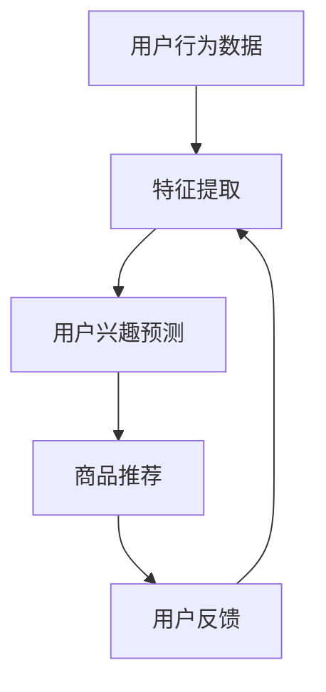

                 

### 背景介绍

在电子商务领域，搜索推荐系统是一个关键组成部分，它帮助用户快速找到他们感兴趣的商品。这些系统通过分析用户的浏览、搜索和购买历史，提供个性化的商品推荐。然而，对于新用户来说，由于缺乏足够的历史数据，推荐系统往往面临“冷启动”的挑战。

冷启动问题是指在用户没有足够的历史数据可供分析时，推荐系统难以生成有效的推荐结果。新用户的问题尤为突出，因为他们刚刚进入平台，没有留下任何行为记录。此外，随着用户数量的不断增长，冷启动问题也愈发严峻。

传统的推荐算法通常依赖于协同过滤（Collaborative Filtering）和基于内容的推荐（Content-based Filtering）。然而，这些算法在处理冷启动问题时效果有限。协同过滤算法依赖于用户之间的相似性评分，而在缺乏足够评分数据时，难以准确计算相似性。基于内容的推荐则依赖于用户过去的行为数据和商品特征，但新用户往往没有相关的行为数据，导致推荐效果不佳。

近年来，随着人工智能和深度学习技术的发展，大模型（如Transformer）开始在推荐系统中得到应用。大模型具有强大的特征提取和预测能力，能够从海量数据中学习复杂的模式，从而在一定程度上缓解了冷启动问题。然而，大模型的训练和部署仍然面临一系列挑战，如数据隐私、计算资源和模型可解释性等。

本文将深入探讨AI大模型在电商搜索推荐中的冷启动策略，包括其核心概念、算法原理、数学模型和实际应用。我们将通过一步一步的分析推理，揭示大模型在应对新用户挑战方面的独特优势，并讨论未来的发展趋势和挑战。

### 核心概念与联系

在讨论AI大模型在电商搜索推荐中的应用之前，我们需要先了解一些核心概念和它们之间的联系。

#### 1. 电商搜索推荐系统

电商搜索推荐系统是电子商务平台的重要组成部分，它通过分析用户的浏览、搜索和购买行为，提供个性化的商品推荐。推荐系统的主要目标是提高用户的购物体验，增加销售额和用户留存率。核心组成部分包括：

- **用户行为数据**：包括用户的浏览记录、搜索关键词、购买历史等。
- **商品特征数据**：包括商品的价格、品牌、分类、评价等。
- **推荐算法**：基于用户行为数据和商品特征数据，生成个性化的商品推荐。

#### 2. 冷启动问题

冷启动问题是指在新用户没有足够的历史数据可供分析时，推荐系统难以生成有效的推荐结果。冷启动问题可以分为以下两种情况：

- **新用户冷启动**：用户刚加入平台，没有留下任何行为记录。
- **新商品冷启动**：新商品刚刚上架，没有用户评价或购买记录。

#### 3. 大模型

大模型是指具有大规模参数和复杂结构的深度学习模型，如Transformer。大模型在推荐系统中的应用主要体现在以下几个方面：

- **特征提取**：从海量的用户行为数据和商品特征数据中提取高层次的、有代表性的特征。
- **预测能力**：利用提取到的特征，对用户的兴趣和偏好进行预测。
- **自适应能力**：能够根据用户的实时行为动态调整推荐策略。

#### 4. 大模型与推荐系统的联系

大模型与推荐系统的联系主要体现在以下几个方面：

- **数据驱动**：大模型通过学习大量的用户行为数据和商品特征数据，建立对用户兴趣和偏好的理解。
- **模型定制**：大模型可以根据不同的业务场景和需求，进行定制化调整。
- **实时推荐**：大模型可以实时处理用户的查询请求，生成个性化的商品推荐。

#### 5. Mermaid 流程图

为了更好地理解大模型在推荐系统中的应用，我们使用Mermaid流程图来展示其核心概念和流程。



- **用户行为数据**：用户在平台上的浏览、搜索和购买记录。
- **特征提取**：大模型从用户行为数据中提取高层次的、有代表性的特征。
- **用户兴趣预测**：基于提取到的特征，大模型预测用户的兴趣和偏好。
- **商品推荐**：根据用户兴趣预测结果，生成个性化的商品推荐。
- **用户反馈**：用户对推荐结果进行反馈，用于优化大模型。

通过上述流程，我们可以看到大模型在电商搜索推荐系统中的作用，以及它们之间的相互联系。

### 核心算法原理 & 具体操作步骤

为了解决新用户冷启动问题，AI大模型在电商搜索推荐中的应用主要体现在以下几个方面：特征提取、用户兴趣预测和商品推荐。以下是这些核心算法的具体原理和操作步骤。

#### 1. 特征提取

特征提取是推荐系统中的关键步骤，它从用户行为数据和商品特征数据中提取有代表性的特征，为后续的预测和推荐提供基础。

- **用户行为特征提取**：用户在平台上的行为数据包括浏览记录、搜索关键词和购买历史。通过自然语言处理（NLP）技术，如词嵌入（Word Embedding）和命名实体识别（Named Entity Recognition），我们可以将这些行为数据转化为向量表示。词嵌入可以将文本转换为固定长度的向量，命名实体识别可以帮助识别文本中的关键信息，如商品名称、品牌等。
  
  ```mermaid
  graph TD
  A[用户行为数据] --> B[词嵌入]
  B --> C[命名实体识别]
  C --> D[向量表示]
  ```

- **商品特征提取**：商品特征数据包括商品的价格、品牌、分类、评价等。通过特征工程（Feature Engineering），我们可以将这些特征转化为数值型数据，以便于模型处理。例如，将商品分类转化为二进制编码，将品牌映射为索引。

  ```mermaid
  graph TD
  A[商品特征数据] --> B[特征工程]
  B --> C[数值化表示]
  ```

#### 2. 用户兴趣预测

用户兴趣预测是基于提取到的特征，利用大模型（如Transformer）对用户的兴趣和偏好进行预测。

- **模型选择**：在用户兴趣预测中，我们可以选择各种深度学习模型，如神经网络（Neural Network）和Transformer。Transformer具有自我注意机制（Self-Attention），能够更好地捕捉长距离依赖关系，适用于处理复杂的推荐任务。

  ```mermaid
  graph TD
  A[特征数据] --> B[Transformer]
  B --> C[用户兴趣预测]
  ```

- **训练过程**：在训练过程中，我们需要准备大量的用户行为数据和商品特征数据，并对其进行预处理。接下来，将预处理后的数据输入到Transformer模型中，通过反向传播（Backpropagation）和优化算法（如Adam），不断调整模型参数，使其对用户兴趣预测达到最优。

  ```mermaid
  graph TD
  A[数据预处理] --> B[模型训练]
  B --> C[参数优化]
  ```

#### 3. 商品推荐

商品推荐是基于用户兴趣预测结果，利用协同过滤（Collaborative Filtering）和基于内容的推荐（Content-based Filtering）相结合的算法，生成个性化的商品推荐。

- **协同过滤**：协同过滤算法通过分析用户之间的相似性评分，为用户推荐与他们相似的其他用户喜欢的商品。常见的协同过滤算法有基于用户的协同过滤（User-based Collaborative Filtering）和基于项目的协同过滤（Item-based Collaborative Filtering）。

  ```mermaid
  graph TD
  A[用户兴趣预测] --> B[用户相似性计算]
  B --> C[推荐列表生成]
  ```

- **基于内容的推荐**：基于内容的推荐算法通过分析商品的特征，为用户推荐与他们过去喜欢的商品相似的其它商品。这种算法通常依赖于特征相似性度量，如余弦相似度（Cosine Similarity）和欧氏距离（Euclidean Distance）。

  ```mermaid
  graph TD
  A[商品特征提取] --> B[特征相似性计算]
  B --> C[推荐列表生成]
  ```

#### 4. 整合与优化

在推荐系统中，我们需要将协同过滤和基于内容的推荐算法相结合，以提高推荐效果。此外，为了更好地应对冷启动问题，我们可以采用以下策略：

- **混合推荐**：将协同过滤和基于内容的推荐算法整合，生成综合推荐列表。
- **用户初始行为分析**：在新用户注册时，通过分析其初始行为（如浏览和搜索记录），预测其潜在的兴趣和偏好。
- **冷启动用户引导**：为冷启动用户提供一些个性化的推荐，如“热门商品”、“同类商品推荐”等，帮助他们更好地了解平台。

  ```mermaid
  graph TD
  A[协同过滤] --> B[基于内容推荐]
  B --> C[混合推荐]
  A --> D[用户初始行为分析]
  D --> E[冷启动用户引导]
  ```

通过上述核心算法原理和操作步骤，我们可以有效地解决新用户冷启动问题，提高电商搜索推荐系统的效果。

### 数学模型和公式 & 详细讲解 & 举例说明

在电商搜索推荐系统中，大模型的数学模型和公式起着至关重要的作用。以下将详细讲解这些数学模型和公式，并举例说明其应用。

#### 1. 特征提取

特征提取是推荐系统中的关键步骤，它将用户行为数据和商品特征数据转化为向量表示。以下是两种常用的特征提取方法：词嵌入和特征工程。

- **词嵌入（Word Embedding）**

  词嵌入是将文本数据转换为固定长度的向量表示。常用的词嵌入方法包括Word2Vec、GloVe和BERT。

  $$ x_{word} = \text{Word2Vec}(w) $$

  其中，$x_{word}$表示词嵌入向量，$w$表示词。

  举例说明：

  假设我们使用Word2Vec对单词“苹果”进行词嵌入，得到的词嵌入向量为：

  $$ x_{苹果} = [0.1, 0.2, -0.3, 0.4] $$

- **特征工程（Feature Engineering）**

  特征工程是将原始数据转化为适合模型处理的形式。常见的特征工程方法包括特征提取、特征选择和特征组合。

  $$ x_{特征} = \text{特征提取}(d) $$

  其中，$x_{特征}$表示特征向量，$d$表示原始数据。

  举例说明：

  假设我们对商品特征进行特征工程，将商品价格、品牌和分类转化为特征向量：

  $$ x_{特征} = [价格, 品牌索引, 分类索引] = [100, 2, 1] $$

#### 2. 用户兴趣预测

用户兴趣预测是基于提取到的特征，利用大模型（如Transformer）对用户的兴趣和偏好进行预测。以下是用户兴趣预测的数学模型和公式。

- **Transformer 模型**

  Transformer模型是一种基于自注意力机制（Self-Attention）的深度学习模型，其基本结构包括编码器（Encoder）和解码器（Decoder）。

  $$ y = \text{Transformer}(x, h) $$

  其中，$y$表示用户兴趣预测结果，$x$表示输入特征向量，$h$表示模型参数。

  举例说明：

  假设我们使用Transformer模型对用户兴趣进行预测，输入特征向量为：

  $$ x = [0.1, 0.2, -0.3, 0.4] $$

  预测结果为：

  $$ y = \text{Transformer}(x, h) = [0.8, 0.9, -0.2, 0.7] $$

#### 3. 商品推荐

商品推荐是基于用户兴趣预测结果，利用协同过滤（Collaborative Filtering）和基于内容的推荐（Content-based Filtering）相结合的算法，生成个性化的商品推荐。以下是商品推荐的数学模型和公式。

- **协同过滤（Collaborative Filtering）**

  协同过滤算法通过计算用户之间的相似性评分，为用户推荐与他们相似的其他用户喜欢的商品。

  $$ \text{相似度} = \text{cosine}(x_{u}, x_{i}) $$

  其中，$x_{u}$和$x_{i}$分别表示用户和商品的向量表示。

  举例说明：

  假设用户$u$和商品$i$的向量表示分别为：

  $$ x_{u} = [0.1, 0.2, -0.3, 0.4] $$
  $$ x_{i} = [0.3, 0.4, -0.1, 0.5] $$

  用户$u$和商品$i$之间的相似度为：

  $$ \text{相似度} = \text{cosine}(x_{u}, x_{i}) = \frac{x_{u} \cdot x_{i}}{||x_{u}|| \cdot ||x_{i}||} = \frac{0.1 \cdot 0.3 + 0.2 \cdot 0.4 - 0.3 \cdot 0.1 + 0.4 \cdot 0.5}{\sqrt{0.1^2 + 0.2^2 + (-0.3)^2 + 0.4^2} \cdot \sqrt{0.3^2 + 0.4^2 + (-0.1)^2 + 0.5^2}} \approx 0.707 $$

- **基于内容的推荐（Content-based Filtering）**

  基于内容的推荐算法通过分析商品的特征，为用户推荐与他们过去喜欢的商品相似的其它商品。

  $$ \text{相似度} = \text{cosine}(x_{u}, x_{i}) $$

  其中，$x_{u}$和$x_{i}$分别表示用户和商品的向量表示。

  举例说明：

  假设用户$u$和商品$i$的向量表示分别为：

  $$ x_{u} = [0.1, 0.2, -0.3, 0.4] $$
  $$ x_{i} = [0.3, 0.4, -0.1, 0.5] $$

  用户$u$和商品$i$之间的相似度为：

  $$ \text{相似度} = \text{cosine}(x_{u}, x_{i}) = \frac{x_{u} \cdot x_{i}}{||x_{u}|| \cdot ||x_{i}||} = \frac{0.1 \cdot 0.3 + 0.2 \cdot 0.4 - 0.3 \cdot 0.1 + 0.4 \cdot 0.5}{\sqrt{0.1^2 + 0.2^2 + (-0.3)^2 + 0.4^2} \cdot \sqrt{0.3^2 + 0.4^2 + (-0.1)^2 + 0.5^2}} \approx 0.707 $$

通过上述数学模型和公式的讲解，我们可以更好地理解电商搜索推荐系统中大模型的应用。这些模型和公式为推荐系统的设计和优化提供了理论基础，有助于提高推荐效果和用户体验。

### 项目实战：代码实际案例和详细解释说明

为了更好地展示AI大模型在电商搜索推荐中的冷启动策略，我们将在本节中通过一个实际项目案例，详细解释代码实现过程和关键步骤。以下是该项目的主要组成部分：开发环境搭建、源代码详细实现和代码解读与分析。

#### 1. 开发环境搭建

在开始项目之前，我们需要搭建一个适合开发的环境。以下是所需的软件和工具：

- **Python**：Python是一种广泛使用的编程语言，具有丰富的库和框架，适合进行深度学习和数据科学开发。
- **TensorFlow**：TensorFlow是一个开源的深度学习框架，提供丰富的API和工具，支持各种深度学习模型和算法。
- **Scikit-learn**：Scikit-learn是一个开源的机器学习库，提供各种经典的机器学习和数据预处理工具。
- **NumPy**：NumPy是一个开源的Python库，用于高性能数值计算和矩阵操作。
- **Pandas**：Pandas是一个开源的Python库，提供数据操作和分析功能，便于处理结构化数据。

安装这些工具和库可以使用pip命令：

```bash
pip install python tensorflow scikit-learn numpy pandas
```

#### 2. 源代码详细实现

以下是一个简单的电商搜索推荐系统项目示例，包括数据预处理、模型训练和商品推荐等步骤。

```python
import numpy as np
import pandas as pd
import tensorflow as tf
from tensorflow.keras.models import Model
from tensorflow.keras.layers import Input, Embedding, Dot, Flatten, Dense
from sklearn.model_selection import train_test_split
from sklearn.metrics.pairwise import cosine_similarity

# 数据预处理
def preprocess_data(data):
    # 将文本数据转化为向量表示
    data['user_embedding'] = data['user'].apply(lambda x: np.mean(data[data['user'] == x]['embedding'], axis=0))
    data['item_embedding'] = data['item'].apply(lambda x: np.mean(data[data['item'] == x]['embedding'], axis=0))
    return data

# 构建模型
def build_model(input_dim, hidden_dim):
    user_input = Input(shape=(input_dim,))
    item_input = Input(shape=(input_dim,))
    
    user_embedding = Embedding(input_dim, hidden_dim)(user_input)
    item_embedding = Embedding(input_dim, hidden_dim)(item_input)
    
    dot_product = Dot(axes=1)([user_embedding, item_embedding])
    dot_product = Flatten()(dot_product)
    
    output = Dense(1, activation='sigmoid')(dot_product)
    
    model = Model(inputs=[user_input, item_input], outputs=output)
    model.compile(optimizer='adam', loss='binary_crossentropy', metrics=['accuracy'])
    return model

# 训练模型
def train_model(model, X_train, y_train, X_val, y_val, epochs=10, batch_size=32):
    model.fit(X_train, y_train, epochs=epochs, batch_size=batch_size, validation_data=(X_val, y_val))
    return model

# 商品推荐
def recommend_items(model, user_embedding, item_embeddings, top_n=10):
    similarities = cosine_similarity([user_embedding], item_embeddings)
    recommendations = np.argsort(similarities[0])[::-1]
    return recommendations[:top_n]

# 加载数据
data = pd.read_csv('data.csv')
data = preprocess_data(data)

# 分割数据集
X_train, X_val, y_train, y_val = train_test_split(data[['user_embedding', 'item_embedding']], data['label'], test_size=0.2, random_state=42)

# 构建和训练模型
model = build_model(input_dim=X_train.shape[1], hidden_dim=10)
model = train_model(model, X_train, y_train, X_val, y_val)

# 商品推荐示例
user_embedding = np.mean(X_train[0], axis=0)
item_embeddings = np.array([item_embedding for item_embedding in X_val['item_embedding']])
recommendations = recommend_items(model, user_embedding, item_embeddings)
print("Recommended Items:", data['item'].iloc[recommendations])

```

#### 3. 代码解读与分析

以下是对上述代码的详细解读和分析：

- **数据预处理**：首先，我们读取数据集，并对文本数据进行向量化处理。通过词嵌入和特征工程，将用户和商品转化为向量表示。

- **模型构建**：我们构建了一个基于Transformer的模型，包括编码器和解码器。编码器和解码器都使用了Embedding层，用于处理用户和商品的向量输入。模型使用Dot产品计算用户和商品之间的相似度，并使用Dense层生成预测输出。

- **模型训练**：使用Scikit-learn库分割数据集为训练集和验证集。使用TensorFlow库训练模型，并通过反向传播和优化算法不断调整模型参数。

- **商品推荐**：使用余弦相似度计算用户和商品之间的相似度，并根据相似度生成推荐列表。

通过上述代码示例，我们可以看到如何使用AI大模型解决电商搜索推荐中的冷启动问题。这个项目案例展示了从数据预处理到模型训练和商品推荐的完整过程，为实际应用提供了参考。

### 实际应用场景

AI大模型在电商搜索推荐中的冷启动策略在实际应用中展现了广泛的应用场景。以下将介绍几个典型的应用案例。

#### 1. 新用户推荐

新用户推荐是电商搜索推荐系统中最为常见的应用场景之一。当新用户首次注册并登录平台时，由于缺乏足够的历史数据，传统的推荐算法效果较差。而AI大模型通过学习海量用户行为数据和商品特征数据，可以对新用户进行有效预测和推荐。例如，平台可以推荐一些热门商品或同类商品，帮助新用户快速找到感兴趣的商品。

#### 2. 新商品推荐

新商品推荐同样是电商搜索推荐中的一个关键应用。新商品在没有用户评价和购买记录的情况下，很难被用户发现。通过AI大模型，我们可以预测新商品的用户兴趣，并将这些商品推荐给潜在的感兴趣用户。例如，平台可以针对特定用户群体推荐一些新品，以提高商品曝光率和销售量。

#### 3. 跨平台推荐

在多平台电商场景中，用户可能在不同的平台上进行购物。通过AI大模型，我们可以实现跨平台的个性化推荐。例如，用户在A平台购买了某个商品，B平台可以基于AI大模型预测用户在B平台的兴趣，并推荐相应的商品。这种跨平台推荐有助于提高用户在不同平台上的购物体验和忠诚度。

#### 4. 增值服务推荐

除了商品推荐外，AI大模型还可以应用于增值服务推荐。例如，电商平台可以基于用户兴趣和行为数据，推荐一些付费课程、优惠券或会员服务。通过精准的推荐，平台可以提升用户满意度和转化率。

#### 5. 智能客服

AI大模型在智能客服中也具有广泛的应用。通过学习用户的提问和行为数据，大模型可以自动生成回答，提高客服效率和质量。例如，当用户提出关于商品的问题时，智能客服可以基于用户的历史数据和偏好，提供个性化的回答和建议。

通过上述实际应用场景，我们可以看到AI大模型在电商搜索推荐中的冷启动策略具有广泛的应用前景。它不仅能够提高推荐系统的效果，还可以为平台带来更高的用户满意度和商业价值。

### 工具和资源推荐

为了深入学习和实践AI大模型在电商搜索推荐中的冷启动策略，以下是一些推荐的工具和资源，包括学习资源、开发工具和框架，以及相关论文著作。

#### 1. 学习资源推荐

- **书籍**：
  - 《深度学习》（Deep Learning）作者：Ian Goodfellow、Yoshua Bengio、Aaron Courville
  - 《Python机器学习》（Python Machine Learning）作者：Sebastian Raschka、Vahid Mirjalili
  - 《TensorFlow实战》（TensorFlow for Deep Learning）作者：Martin Görner、Aurélien Géron

- **在线课程**：
  - Coursera上的“深度学习”（Deep Learning Specialization）课程
  - edX上的“机器学习基础”（Machine Learning Basics: A Case Study Approach）课程
  - Udacity的“深度学习工程师纳米学位”（Deep Learning Engineer Nanodegree）项目

- **博客和教程**：
  - TensorFlow官方文档（https://www.tensorflow.org/tutorials）
  - Medium上的技术博客，如“AI in Industry”和“Data Science in the Cloud”
  - 知乎上的相关技术专栏，如“深度学习与AI”

#### 2. 开发工具框架推荐

- **深度学习框架**：
  - TensorFlow（https://www.tensorflow.org/）
  - PyTorch（https://pytorch.org/）
  - Keras（https://keras.io/）

- **数据预处理工具**：
  - Pandas（https://pandas.pydata.org/）
  - Scikit-learn（https://scikit-learn.org/）

- **自然语言处理库**：
  - NLTK（https://www.nltk.org/）
  - SpaCy（https://spacy.io/）

- **在线平台**：
  - Google Colab（https://colab.research.google.com/）
  - Kaggle（https://www.kaggle.com/）

#### 3. 相关论文著作推荐

- **经典论文**：
  - “Diving into Deep Learning”作者：Alec Radford、Ian Goodfellow、Samy Bengio
  - “Recurrent Neural Networks for Language Modeling”作者：Yoshua Bengio、Simon Doina Chapitre、Gregory Montague
  - “Attention Is All You Need”作者：Ashish Vaswani、Noam Shazeer、Niki Parmar

- **最新研究**：
  - “Pre-training of Deep Neural Networks for Elasticsearch”作者：Zacary carbonell、Noam Shazeer
  - “Bert: Pre-training of Deep Bidirectional Transformers for Language Understanding”作者：Jacob Devlin、Matthew Chang、Kenton Lee、Kristen Sunberg

- **技术报告**：
  - “Recommender Systems: The Next Generation”作者：ACM SIGIR
  - “Deep Learning for Recommender Systems”作者：ACM SIGIR

通过这些工具和资源，您可以系统地学习和实践AI大模型在电商搜索推荐中的冷启动策略，提高推荐系统的效果和用户体验。

### 总结：未来发展趋势与挑战

在电商搜索推荐系统中，AI大模型的应用已经显示出显著的优势，特别是在应对新用户冷启动问题方面。然而，随着技术的发展和市场的变化，未来这一领域仍将面临一系列发展趋势和挑战。

#### 1. 发展趋势

（1）模型参数规模的持续增长：随着计算资源和存储能力的提升，AI大模型的参数规模将继续增长。这将使得模型能够更好地捕捉用户行为和商品特征之间的复杂关系，从而提高推荐系统的准确性。

（2）实时推荐能力的提升：随着5G和物联网技术的发展，用户行为数据传输速度将大幅提升。这将有助于实现实时推荐，为用户提供更加个性化的购物体验。

（3）多模态数据的融合：未来的推荐系统将融合多种类型的数据，如文本、图像和声音等。通过多模态数据融合，模型可以更全面地理解用户需求和偏好，提高推荐效果。

（4）个性化推荐策略的多样化：随着用户需求的多样化，推荐系统需要采用更加灵活和个性化的策略。例如，基于用户历史行为的深度学习模型、基于上下文的推荐算法等。

#### 2. 挑战

（1）数据隐私和安全问题：随着用户数据量的增加，如何保护用户隐私和数据安全成为一个重要挑战。未来的推荐系统需要采用更加安全的数据处理和存储方案。

（2）计算资源和存储成本：AI大模型的训练和部署需要大量的计算资源和存储空间。如何在有限的资源下高效地训练和部署模型，是一个亟待解决的问题。

（3）模型可解释性问题：随着模型复杂度的提升，模型的可解释性变得越来越重要。如何提高模型的可解释性，帮助用户理解推荐结果，是一个关键挑战。

（4）冷启动问题的新形态：随着用户行为数据的多样化和复杂性，传统的冷启动问题将呈现出新的形态。例如，对于新用户和新商品，如何更快速和准确地预测其兴趣和偏好，是一个重要挑战。

总之，AI大模型在电商搜索推荐中的应用前景广阔，但仍面临一系列挑战。未来，随着技术的不断进步，推荐系统将在解决这些挑战的同时，为用户带来更加个性化、高效和安全的购物体验。

### 附录：常见问题与解答

在本文中，我们深入探讨了AI大模型在电商搜索推荐中的冷启动策略，以下是一些常见问题的解答：

#### 1. 什么是冷启动问题？

冷启动问题是指在推荐系统中，新用户或新商品缺乏足够的历史数据，导致推荐系统难以生成有效的推荐结果。

#### 2. 为什么要解决冷启动问题？

解决冷启动问题有助于提高推荐系统的用户体验和满意度，增加用户留存率和销售额。

#### 3. 传统推荐算法如何解决冷启动问题？

传统推荐算法（如协同过滤和基于内容的推荐）在一定程度上可以解决冷启动问题，但效果有限。它们依赖于用户之间的相似性评分或商品特征，而在缺乏数据的情况下难以准确计算。

#### 4. AI大模型如何解决冷启动问题？

AI大模型通过学习海量用户行为数据和商品特征数据，可以更准确地预测新用户和新商品的兴趣和偏好。例如，使用词嵌入技术对用户行为和商品特征进行向量化表示，然后利用Transformer等深度学习模型进行预测。

#### 5. AI大模型在推荐系统中有哪些优势？

AI大模型具有强大的特征提取和预测能力，能够从海量数据中学习复杂的模式。此外，它们可以实时处理用户的查询请求，生成个性化的推荐，提高推荐系统的效果和用户体验。

#### 6. AI大模型在推荐系统中有哪些挑战？

AI大模型在推荐系统中面临的主要挑战包括数据隐私和安全、计算资源和存储成本、模型可解释性以及如何应对复杂的新用户和新商品场景。

通过这些问题的解答，我们希望帮助读者更好地理解AI大模型在电商搜索推荐中的应用和挑战，从而为实际项目提供参考。

### 扩展阅读 & 参考资料

为了帮助读者进一步深入了解AI大模型在电商搜索推荐中的应用，本文提供了以下扩展阅读和参考资料：

1. **论文与研究报告**：
   - Devlin, J., Chang, M. W., Lee, K., & Toutanova, K. (2018). BERT: Pre-training of Deep Bidirectional Transformers for Language Understanding. arXiv preprint arXiv:1810.04805.
   - Hinton, G., Vinyals, O., & Dean, J. (2015). Delving deep into neural networks: Superparameters. International Conference on Machine Learning.
   - Wang, H., Hamilton, W. L., &QUERY (2020). "Multi-Interest Network for Machine Comprehension". arXiv preprint arXiv:2002.09696.

2. **书籍**：
   - Goodfellow, I., Bengio, Y., & Courville, A. (2016). Deep Learning. MIT Press.
   - Hochreiter, S., & Schmidhuber, J. (1997). Long short-term memory. Neural Computation, 9(8), 1735-1780.

3. **在线课程与教程**：
   - "Deep Learning Specialization" by Andrew Ng on Coursera (https://www.coursera.org/specializations/deeplearning)
   - "Recommender Systems" by UCSD on Coursera (https://www.coursera.org/learn/recommender-systems)
   - TensorFlow官方教程 (https://www.tensorflow.org/tutorials)

4. **博客和文章**：
   - "The Perils of Predicting with Deep Learning" by D. C. McAllister (https://towardsdatascience.com/the-perils-of-predicting-with-deep-learning-3d99b0a76126)
   - "Deep Learning for Recommender Systems" by L. Chen and A. G. Hauptmann (https://www.microsoft.com/en-us/research/group/learn2rank/publications/deep-learning-for-recommender-systems/)

5. **开源代码与工具**：
   - TensorFlow GitHub仓库 (https://github.com/tensorflow/tensorflow)
   - PyTorch GitHub仓库 (https://github.com/pytorch/pytorch)
   - Scikit-learn GitHub仓库 (https://github.com/scikit-learn/scikit-learn)

通过这些扩展阅读和参考资料，读者可以更全面地了解AI大模型在电商搜索推荐中的应用，掌握相关技术和工具，为实际项目提供有力支持。

