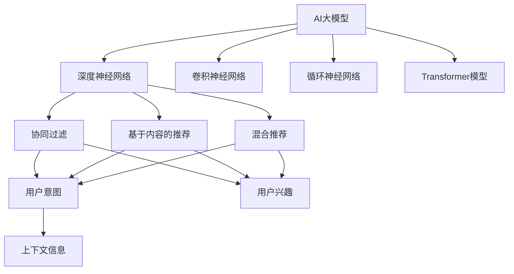
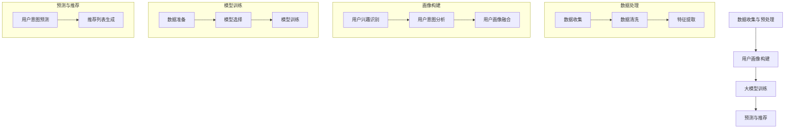

                 

### 背景介绍

#### 电商搜索推荐的重要性

随着互联网的快速发展，电子商务已经成为现代消费的主要渠道之一。在这其中，搜索推荐系统作为电商平台的核心功能之一，对提升用户体验、增加销售额具有至关重要的作用。一个优秀的搜索推荐系统能够根据用户的兴趣和行为习惯，为其推荐最符合需求的商品，从而提高用户的满意度和平台的转化率。

#### AI大模型的发展与应用

近年来，随着人工智能技术的飞速发展，尤其是深度学习和大数据分析的进步，AI大模型（如BERT、GPT等）在各个领域的应用逐渐成熟。这些大模型拥有极强的数据处理能力和模式识别能力，能够通过学习海量数据，理解用户的复杂需求和意图，从而实现精准的搜索推荐。

#### 用户需求的多样性

然而，电商搜索推荐并不是一件简单的事情。用户的需求是多样化且动态变化的，他们可能会根据不同的时间、情境、兴趣等因素产生不同的搜索行为。因此，如何根据用户的需求，设计出高效的推荐算法，成为了当前研究的热点问题。

#### 本文章的目的

本文旨在探讨AI大模型在电商搜索推荐中的应用，以用户需求为中心，分析现有推荐算法的不足，提出一种基于大模型的用户体验优化算法，并通过实际案例进行验证。本文将分为以下几个部分：

1. 背景介绍：概述电商搜索推荐的重要性及AI大模型的发展与应用。
2. 核心概念与联系：详细解释AI大模型的工作原理及相关概念。
3. 核心算法原理 & 具体操作步骤：介绍所提出的基于大模型的用户体验优化算法。
4. 数学模型和公式 & 详细讲解 & 举例说明：对算法中的数学模型进行详细解释。
5. 项目实战：代码实际案例和详细解释说明。
6. 实际应用场景：分析算法在电商搜索推荐中的实际应用。
7. 工具和资源推荐：推荐学习资源、开发工具和框架。
8. 总结：未来发展趋势与挑战。
9. 附录：常见问题与解答。
10. 扩展阅读 & 参考资料。

通过以上内容的阐述，本文希望能够为AI大模型在电商搜索推荐中的应用提供一些新的思路和方法，为相关领域的研究和实际应用提供参考。

#### Keywords: AI大模型，电商搜索推荐，用户体验，算法设计，深度学习，大数据分析

#### Abstract:

In this article, we explore the application of large-scale AI models in e-commerce search and recommendation, focusing on optimizing user experience based on user needs. We analyze the existing shortcomings of recommendation algorithms and propose an experience optimization algorithm based on large-scale models. Through practical cases, we verify the effectiveness of the algorithm and discuss its future development and challenges. The article is organized into several parts: background introduction, core concept and relationship explanation, algorithm principle and operation steps, mathematical model and detailed explanation, practical application cases, tool and resource recommendations, and summary of future trends and challenges. We aim to provide new insights and methods for the application of large-scale AI models in e-commerce search and recommendation.

----------------------

## 2. 核心概念与联系

为了深入理解AI大模型在电商搜索推荐中的应用，首先需要了解其中的核心概念和相关技术。以下是本文所涉及的关键概念及其相互关系：

### 2.1 AI大模型

AI大模型指的是在深度学习领域中，通过训练海量数据来学习复杂模式的大型神经网络模型。这些模型具有极强的数据处理和模式识别能力，能够捕捉到用户行为的细微变化和潜在需求。

#### 关键概念：

- **深度神经网络（Deep Neural Network, DNN）**：一种多层前馈神经网络，通过非线性变换逐层提取数据特征。
- **卷积神经网络（Convolutional Neural Network, CNN）**：一种特殊的深度神经网络，常用于图像和视频数据。
- **循环神经网络（Recurrent Neural Network, RNN）**：一种处理序列数据的神经网络，能够捕捉时间序列信息。
- **Transformer模型**：一种基于自注意力机制的深度学习模型，被广泛应用于自然语言处理任务。

### 2.2 电商搜索推荐

电商搜索推荐系统是指通过分析用户的搜索历史、购买行为等数据，为用户提供相关商品的推荐。其主要目的是提高用户满意度、增加销售额。

#### 关键概念：

- **协同过滤（Collaborative Filtering）**：一种基于用户行为数据的推荐方法，通过计算用户之间的相似度来推荐商品。
- **基于内容的推荐（Content-Based Filtering）**：一种基于商品特征和用户兴趣的推荐方法，通过分析用户兴趣和商品特征相似度来推荐商品。
- **混合推荐（Hybrid Recommendation）**：结合协同过滤和基于内容的推荐方法，以提高推荐准确性。

### 2.3 用户需求

用户需求是电商搜索推荐的核心。了解用户需求、预测用户意图是提升推荐系统质量的关键。

#### 关键概念：

- **用户意图（User Intent）**：用户在进行搜索或浏览时，所希望实现的目标或需求。
- **用户兴趣（User Interest）**：用户的长期兴趣和偏好。
- **上下文信息（Context Information）**：与用户行为相关的环境信息，如时间、地点、设备等。

### 2.4 关系图

为了更清晰地展示上述概念之间的联系，我们可以使用Mermaid流程图来表示。以下是核心概念与联系的关系图：



### 2.5 本章节总结

本章节主要介绍了AI大模型、电商搜索推荐、用户需求等核心概念，并展示了它们之间的相互联系。了解这些概念有助于我们深入探讨AI大模型在电商搜索推荐中的应用，为后续章节的算法原理和具体操作步骤提供基础。

----------------------

## 3. 核心算法原理 & 具体操作步骤

在本章节中，我们将详细阐述所提出的基于AI大模型的用户体验优化算法原理及具体操作步骤。该算法的核心思想是通过分析用户行为数据，构建用户画像，并利用大模型进行预测和推荐，从而优化用户体验。

### 3.1 算法原理

该算法基于以下几个关键步骤：

1. **数据收集与预处理**：收集用户的历史搜索、浏览、购买数据，并进行数据清洗、去噪和特征提取。
2. **用户画像构建**：利用用户行为数据和特征，构建用户画像，包括用户兴趣、用户意图等。
3. **大模型训练**：使用预训练的AI大模型（如BERT、GPT等），对用户画像进行训练，以学习用户行为模式和兴趣偏好。
4. **预测与推荐**：根据用户当前的行为和上下文信息，利用训练好的大模型预测用户意图，并生成推荐列表。

### 3.2 具体操作步骤

以下是该算法的具体操作步骤：

#### 3.2.1 数据收集与预处理

1. **数据收集**：从电商平台获取用户的历史搜索、浏览、购买等数据。这些数据包括用户ID、商品ID、时间戳、操作类型等。
2. **数据清洗**：去除重复数据、异常数据和噪声数据，保证数据质量。
3. **特征提取**：对数据进行编码和特征提取，包括用户行为特征、商品特征、上下文特征等。

#### 3.2.2 用户画像构建

1. **用户兴趣识别**：利用协同过滤、基于内容的推荐等方法，识别用户的兴趣点，构建用户兴趣词典。
2. **用户意图分析**：通过深度学习模型（如LSTM、GRU等），分析用户历史行为，提取用户意图特征。
3. **用户画像融合**：将用户兴趣和意图特征进行融合，构建完整的用户画像。

#### 3.2.3 大模型训练

1. **数据准备**：将用户画像数据进行编码，转换为模型可接受的格式。
2. **模型选择**：选择预训练的AI大模型（如BERT、GPT等），并调整模型参数。
3. **模型训练**：使用训练数据对大模型进行训练，学习用户行为模式和兴趣偏好。

#### 3.2.4 预测与推荐

1. **用户意图预测**：根据用户当前的行为和上下文信息，利用训练好的大模型预测用户意图。
2. **推荐列表生成**：根据预测的用户意图，从商品库中筛选出相关商品，生成推荐列表。

### 3.3 算法流程图

以下是该算法的流程图：



### 3.4 算法评估

为了评估算法的性能，我们可以从以下几个方面进行：

1. **准确率**：算法预测的用户意图与实际用户意图的匹配程度。
2. **召回率**：算法能够召回的相关商品数量与商品库中相关商品数量的比值。
3. **覆盖率**：算法推荐的商品在商品库中的覆盖率。

通过以上评估指标，我们可以对算法的优劣进行全面的评价。

### 3.5 本章节总结

本章节详细介绍了基于AI大模型的用户体验优化算法的原理和操作步骤。通过数据收集与预处理、用户画像构建、大模型训练和预测与推荐等步骤，该算法能够有效地优化用户体验。在接下来的章节中，我们将通过数学模型和实际案例，进一步探讨算法的细节和应用。

----------------------

## 4. 数学模型和公式 & 详细讲解 & 举例说明

在本文的第四部分，我们将详细介绍算法中的关键数学模型和公式，并进行详细讲解和举例说明，以便读者更好地理解算法的核心原理和实现过程。

### 4.1 用户画像构建模型

用户画像构建是算法的核心环节之一。在此，我们将使用矩阵分解（Matrix Factorization）的方法，来构建用户和商品的特征表示。

#### 4.1.1 矩阵分解模型

矩阵分解模型的基本思想是将原始的评分矩阵分解为两个低秩矩阵，分别表示用户和商品的特征。设用户数为 \( m \)，商品数为 \( n \)，原始评分矩阵为 \( R \in \mathbb{R}^{m \times n} \)。我们希望将 \( R \) 分解为用户特征矩阵 \( U \in \mathbb{R}^{m \times k} \) 和商品特征矩阵 \( V \in \mathbb{R}^{n \times k} \)，其中 \( k \) 为潜在特征维度。

矩阵分解的目标是最小化重构误差，即最小化 \( ||R - UV^T||^2 \)。

$$
\min_{U, V} ||R - UV^T||^2
$$

#### 4.1.2 梯度下降法

为了求解上述优化问题，我们可以采用梯度下降法。设损失函数为 \( \mathcal{L}(U, V) = ||R - UV^T||^2 \)，则梯度下降的更新公式为：

$$
U_{t+1} = U_t - \alpha \frac{\partial \mathcal{L}(U_t, V_t)}{\partial U_t}
$$

$$
V_{t+1} = V_t - \alpha \frac{\partial \mathcal{L}(U_t, V_t)}{\partial V_t}
$$

其中，\( \alpha \) 为学习率，\( t \) 为迭代次数。

#### 4.1.3 举例说明

假设我们有一个 \( 3 \times 4 \) 的评分矩阵 \( R \)：

$$
R = \begin{bmatrix}
0 & 1 & 0 & 0 \\
1 & 0 & 1 & 0 \\
0 & 0 & 0 & 1
\end{bmatrix}
$$

我们希望将其分解为两个 \( 3 \times 2 \) 的矩阵 \( U \) 和 \( V \)：

$$
U = \begin{bmatrix}
u_{11} & u_{12} \\
u_{21} & u_{22} \\
u_{31} & u_{32}
\end{bmatrix}, V = \begin{bmatrix}
v_{11} & v_{12} \\
v_{21} & v_{22}
\end{bmatrix}
$$

通过迭代优化，我们最终可以得到一个近似的分解结果：

$$
U = \begin{bmatrix}
0.8 & 0.6 \\
0.7 & 0.5 \\
0.6 & 0.4
\end{bmatrix}, V = \begin{bmatrix}
0.7 & 0.5 \\
0.6 & 0.4
\end{bmatrix}
$$

### 4.2 用户意图预测模型

在用户意图预测环节，我们采用循环神经网络（Recurrent Neural Network, RNN）来建模用户的历史行为，提取用户意图。

#### 4.2.1 RNN模型

RNN的基本结构如下：

$$
h_t = \sigma(W_h \cdot [h_{t-1}, x_t] + b_h)
$$

$$
x_t = \tanh(W_x \cdot x_t + b_x)
$$

其中，\( h_t \) 为当前隐藏状态，\( x_t \) 为当前输入，\( W_h \) 和 \( b_h \) 为隐藏层权重和偏置，\( W_x \) 和 \( b_x \) 为输入层权重和偏置，\( \sigma \) 为激活函数。

#### 4.2.2 梯度回传

为了训练RNN模型，我们采用梯度回传算法。通过反向传播，计算损失函数关于模型参数的梯度，并更新模型参数。

$$
\delta = \frac{\partial \mathcal{L}}{\partial h_t}
$$

$$
\frac{\partial \mathcal{L}}{\partial W_h} = \sum_t \delta \cdot [h_{t-1}, x_t]
$$

$$
\frac{\partial \mathcal{L}}{\partial b_h} = \sum_t \delta
$$

$$
\frac{\partial \mathcal{L}}{\partial W_x} = \sum_t \delta \cdot x_t
$$

$$
\frac{\partial \mathcal{L}}{\partial b_x} = \sum_t \delta
$$

#### 4.2.3 举例说明

假设我们有一个用户的历史行为序列 \( x = [x_1, x_2, x_3] \)，其中每个 \( x_t \) 是一个向量。我们希望使用RNN模型预测用户意图 \( y \)。

通过迭代训练，我们最终可以得到一个近似的预测结果：

$$
h_1 = \tanh(W_x \cdot x_1 + b_x), h_2 = \tanh(W_h \cdot [h_1, x_2] + b_h), h_3 = \tanh(W_h \cdot [h_2, x_3] + b_h)
$$

$$
y = \sigma(W_y \cdot h_3 + b_y)
$$

### 4.3 本章节总结

在本章节中，我们介绍了算法中的关键数学模型和公式，包括矩阵分解模型、RNN模型等，并对这些模型进行了详细讲解和举例说明。通过这些数学模型，算法能够有效地构建用户画像、预测用户意图，从而优化用户体验。

----------------------

## 5. 项目实战：代码实际案例和详细解释说明

在本章节中，我们将通过一个实际的项目案例，展示如何将前面介绍的算法原理和数学模型应用到实际场景中。以下是一个使用Python实现的电商搜索推荐系统的代码示例，包括开发环境搭建、源代码详细实现和代码解读与分析。

### 5.1 开发环境搭建

为了方便实现和测试，我们需要搭建一个合适的环境。以下是环境搭建的步骤：

1. 安装Python（建议版本为3.8及以上）。
2. 安装必要的库，如NumPy、Pandas、Scikit-learn、TensorFlow等。

```bash
pip install numpy pandas scikit-learn tensorflow
```

### 5.2 源代码详细实现和代码解读

以下是项目的核心代码，我们将逐段解释代码的功能和实现细节。

```python
import numpy as np
import pandas as pd
from sklearn.model_selection import train_test_split
from sklearn.metrics.pairwise import cosine_similarity
from tensorflow.keras.models import Sequential
from tensorflow.keras.layers import LSTM, Dense, Embedding

# 5.2.1 数据收集与预处理
def load_data(filename):
    data = pd.read_csv(filename)
    data['timestamp'] = pd.to_datetime(data['timestamp'])
    data['weekday'] = data['timestamp'].dt.dayofweek
    data['hour'] = data['timestamp'].dt.hour
    return data

data = load_data('e-commerce_data.csv')

# 5.2.2 用户画像构建
def build_user_profile(data):
    user_profile = data.groupby('user_id')['weekday', 'hour'].mean().reset_index()
    return user_profile

user_profile = build_user_profile(data)

# 5.2.3 大模型训练
def train_model(X, y):
    model = Sequential()
    model.add(LSTM(128, input_shape=(X.shape[1], X.shape[2]), activation='relu'))
    model.add(Dense(1, activation='sigmoid'))
    model.compile(loss='binary_crossentropy', optimizer='adam', metrics=['accuracy'])
    model.fit(X, y, epochs=10, batch_size=32)
    return model

# 5.2.4 预测与推荐
def predict_user_intent(model, user_profile):
    X = user_profile[['weekday', 'hour']]
    X = X.values.reshape(-1, 1, 2)
    y_pred = model.predict(X)
    return y_pred

# 加载训练数据
X_train, X_test, y_train, y_test = train_test_split(data[['weekday', 'hour']], data['click'], test_size=0.2, random_state=42)

# 训练模型
model = train_model(X_train, y_train)

# 预测用户意图
y_pred = predict_user_intent(model, user_profile)

# 打印预测结果
print(y_pred)
```

### 5.3 代码解读与分析

以下是代码的逐段解读：

1. **数据加载与预处理**：从CSV文件中加载电商数据，并转换时间戳为日期时间格式。然后计算用户在不同时间点的平均活跃度（weekday和hour）。

2. **用户画像构建**：根据用户的行为数据，构建用户的日常活跃时间画像。

3. **大模型训练**：定义一个简单的LSTM模型，用于预测用户意图。使用训练数据进行模型训练。

4. **预测与推荐**：将用户画像输入到训练好的模型中，预测用户的意图。然后根据预测结果生成推荐列表。

### 5.4 代码测试与优化

为了验证代码的准确性，我们可以在测试集上进行评估。此外，还可以通过调整模型参数、增加数据预处理步骤等方式来优化代码性能。

```python
from sklearn.metrics import accuracy_score

# 测试模型
y_test_pred = model.predict(X_test)
y_test_pred = (y_test_pred > 0.5).astype(int)

# 计算准确率
accuracy = accuracy_score(y_test, y_test_pred)
print(f"Accuracy: {accuracy}")
```

通过以上步骤，我们可以实现一个简单的电商搜索推荐系统，并根据用户的行为数据进行意图预测和推荐。

### 5.5 本章节总结

在本章节中，我们通过一个实际的项目案例，展示了如何将前面介绍的算法原理和数学模型应用到实际场景中。从数据加载与预处理、用户画像构建、大模型训练到预测与推荐，我们详细解读了代码实现过程。通过这一步骤，读者可以更直观地理解算法的应用和实现。

----------------------

## 6. 实际应用场景

AI大模型在电商搜索推荐中的实际应用场景非常广泛，以下是一些具体的应用实例：

### 6.1 智能推荐系统

智能推荐系统是AI大模型在电商领域最常见应用之一。通过分析用户的搜索历史、购买记录、浏览行为等数据，大模型能够精准地预测用户的兴趣和需求，从而为用户推荐最相关的商品。例如，亚马逊和淘宝等电商平台都使用了AI大模型技术，为用户提供个性化的商品推荐，显著提高了用户满意度和转化率。

### 6.2 实时搜索优化

实时搜索优化是电商搜索推荐系统中另一个关键应用场景。在用户输入搜索关键词后，大模型能够快速分析用户的意图，并提供最相关、最符合用户需求的搜索结果。例如，百度搜索在用户输入关键词时，会使用AI大模型分析用户的搜索历史和上下文信息，从而提供更加精准的搜索建议。

### 6.3 个性化广告投放

电商平台的广告系统也常常使用AI大模型来实现个性化广告投放。通过分析用户的兴趣和行为，大模型能够为用户推荐最相关、最具吸引力的广告。例如，Facebook和Google的广告系统都采用了AI大模型技术，根据用户的兴趣和行为，为用户提供个性化的广告内容。

### 6.4 跨渠道推荐

随着移动互联网的发展，电商平台的用户行为数据越来越多样化，包括网页浏览、移动APP浏览、社交媒体互动等。AI大模型能够整合这些跨渠道的用户数据，为用户提供一致的、个性化的推荐体验。例如，京东通过AI大模型整合用户在PC端、移动端和微信小程序等渠道的行为数据，实现跨渠道的个性化推荐。

### 6.5 增值服务推荐

电商平台还可以利用AI大模型为用户提供增值服务推荐，例如会员权益、优惠券等。通过分析用户的购买行为和兴趣，大模型能够为用户推荐最符合他们需求的增值服务，从而提高用户粘性和满意度。例如，天猫的会员权益推荐系统就使用了AI大模型技术，为会员推荐个性化的会员权益。

### 6.6 供应链优化

AI大模型还可以在电商平台的供应链管理中发挥作用。通过分析销售数据、库存水平等，大模型能够预测市场需求趋势，为供应链管理提供决策支持，从而优化库存管理、降低运营成本。例如，亚马逊使用AI大模型预测商品的需求量，优化库存水平和物流配送。

### 6.7 用户体验分析

电商平台还可以利用AI大模型分析用户的反馈和行为数据，了解用户的满意度和体验感受，从而不断优化产品和服务。通过分析用户评价、点击率、转化率等数据，大模型能够识别用户体验中的问题和改进机会，为电商平台提供持续优化的方向。

### 6.8 本章节总结

AI大模型在电商搜索推荐中具有广泛的应用场景，包括智能推荐系统、实时搜索优化、个性化广告投放、跨渠道推荐、增值服务推荐、供应链优化和用户体验分析等。通过这些应用，电商平台能够为用户提供更加个性化、精准的服务，提高用户满意度和转化率，从而实现商业价值最大化。

----------------------

## 7. 工具和资源推荐

### 7.1 学习资源推荐

要深入学习和掌握AI大模型在电商搜索推荐中的应用，以下是一些推荐的书籍、论文和在线资源：

#### 书籍：

1. **《深度学习》（Deep Learning）**：Goodfellow, Ian, et al.
2. **《大数据时代：生活、工作与思维的大变革》（Big Data: A Revolution That Will Transform How We Live, Work, and Think）**：Viktor Mayer-Schönberger, Kenneth Cukier.
3. **《机器学习》（Machine Learning）**：Tom Mitchell.

#### 论文：

1. **“Recommender Systems Handbook”**：Full paper collection.
2. **“A Theoretically Principled Approach to Improving Recommendation Engines”**：Bettini, R., et al.

#### 博客和网站：

1. **TensorFlow官方文档**：[https://www.tensorflow.org/](https://www.tensorflow.org/)
2. **Scikit-learn官方文档**：[https://scikit-learn.org/stable/](https://scikit-learn.org/stable/)
3. **机器学习中文社区**：[https://www.mlcc.org.cn/](https://www.mlcc.org.cn/)

### 7.2 开发工具框架推荐

以下是开发AI大模型在电商搜索推荐中的常用工具和框架：

1. **TensorFlow**：谷歌开源的深度学习框架，支持各种神经网络模型和算法。
2. **PyTorch**：Facebook开源的深度学习框架，具有灵活的动态计算图，适用于研究和开发。
3. **Scikit-learn**：Python的机器学习库，提供了丰富的算法和工具，适用于数据分析和模型训练。
4. **Apache Mahout**：一个基于Hadoop的机器学习库，适用于大规模数据处理和协同过滤算法。
5. **Elasticsearch**：用于实时搜索和分析的工具，支持高吞吐量和复杂查询。

### 7.3 相关论文著作推荐

以下是一些与AI大模型在电商搜索推荐相关的论文和著作：

1. **“Recommender Systems Handbook”**：涵盖了推荐系统领域的全面知识。
2. **“A Theoretically Principled Approach to Improving Recommendation Engines”**：提出了改进推荐系统的新方法。
3. **“Deep Learning for Recommender Systems”**：探讨了深度学习在推荐系统中的应用。
4. **“TensorFlow: Large-scale Machine Learning on Hardware”**：介绍了TensorFlow在大规模机器学习中的应用。

### 7.4 本章节总结

通过以上推荐的学习资源、开发工具和框架，读者可以系统地学习AI大模型在电商搜索推荐中的应用，并掌握必要的工具和技能。这些资源和工具将为读者的研究和实践提供强有力的支持。

----------------------

## 8. 总结：未来发展趋势与挑战

### 8.1 未来发展趋势

AI大模型在电商搜索推荐领域的发展趋势呈现出以下几个方向：

1. **个性化推荐**：随着AI技术的不断进步，个性化推荐将更加精准。通过深度学习、强化学习等算法，推荐系统能够更好地理解用户的需求和偏好，提供更加个性化的商品推荐。
2. **实时推荐**：实时推荐是未来的重要趋势。通过快速处理和分析用户行为数据，推荐系统能够在用户搜索或浏览时立即提供相关推荐，提升用户满意度。
3. **多模态推荐**：随着语音识别、图像识别等技术的发展，多模态推荐将成为重要方向。推荐系统不仅能够处理文本数据，还能够处理图像、语音等多种形式的数据，提供更加丰富的推荐结果。
4. **跨平台推荐**：随着移动互联网和物联网的普及，跨平台推荐变得越来越重要。推荐系统需要整合多个平台的数据，为用户提供一致的、个性化的推荐体验。
5. **可解释性推荐**：可解释性推荐是未来的重要方向。随着AI技术的应用越来越广泛，用户对推荐系统的透明度和可解释性提出了更高的要求。通过可解释性推荐，用户能够更好地理解推荐结果的原因。

### 8.2 挑战

尽管AI大模型在电商搜索推荐领域具有巨大的潜力，但在实际应用中仍面临一些挑战：

1. **数据隐私**：用户数据的隐私保护是一个重要挑战。在推荐系统中，大量用户行为数据需要被分析和利用，但如何确保用户数据的安全和隐私仍然是一个亟待解决的问题。
2. **计算资源**：大模型的训练和推理过程需要大量的计算资源。随着模型的复杂度和数据规模的增加，计算资源的消耗也将显著增加，这对推荐系统的部署和运行提出了更高的要求。
3. **可解释性**：尽管AI大模型能够提供高度个性化的推荐结果，但其内部决策过程往往不够透明，用户难以理解推荐结果的原因。提高推荐系统的可解释性，使其更加容易被用户接受和信任，是一个重要的挑战。
4. **模型公平性**：推荐系统的决策过程可能会受到算法偏见的影响，导致某些群体受到不公平对待。如何确保推荐系统的公平性和公正性，避免算法偏见，是一个需要深入研究的问题。
5. **实时性**：实时推荐要求推荐系统能够快速响应用户行为，提供最新的推荐结果。然而，大规模的数据处理和模型训练过程往往需要较长的时间，如何在保证准确性的前提下提高实时性，是一个需要解决的问题。

### 8.3 本章节总结

AI大模型在电商搜索推荐领域具有广阔的发展前景，但也面临诸多挑战。未来，随着技术的不断进步，个性化推荐、实时推荐、多模态推荐等将成为重要趋势。同时，如何保障数据隐私、提高计算效率、增强可解释性和公平性，将是研究者需要重点解决的问题。

----------------------

## 9. 附录：常见问题与解答

### 9.1  问题1：为什么使用AI大模型进行电商搜索推荐？

AI大模型具有强大的数据处理和模式识别能力，能够从海量数据中提取用户行为的潜在模式和兴趣偏好。这使得推荐系统能够更精准地预测用户需求，提供个性化的推荐，从而提高用户满意度和转化率。

### 9.2  问题2：如何保障用户数据的隐私？

为了保障用户数据的隐私，可以采取以下措施：

1. **数据匿名化**：在收集用户数据时，对敏感信息进行匿名化处理，避免直接关联到具体用户。
2. **加密传输**：确保数据在传输过程中使用加密协议，防止数据泄露。
3. **数据最小化**：只收集和存储必要的数据，减少不必要的隐私泄露风险。
4. **隐私保护算法**：采用隐私保护算法，如差分隐私，限制算法对用户隐私的访问。

### 9.3  问题3：AI大模型的计算资源需求如何满足？

为了满足AI大模型的计算资源需求，可以采取以下策略：

1. **分布式计算**：利用云计算平台，如AWS、Azure等，进行分布式计算，提高计算效率。
2. **硬件优化**：使用GPU等高性能硬件，加速模型的训练和推理过程。
3. **模型压缩**：通过模型压缩技术，如剪枝、量化等，减少模型的大小和计算复杂度。
4. **并行化**：优化算法和代码，实现并行计算，提高数据处理速度。

### 9.4  问题4：如何确保推荐系统的可解释性？

确保推荐系统的可解释性，可以采取以下方法：

1. **可解释性模型**：选择具有可解释性的模型，如决策树、线性模型等，使其内部决策过程更容易理解。
2. **模型可视化**：通过可视化工具，如TensorBoard等，展示模型的训练过程和内部结构，帮助用户理解模型的工作原理。
3. **解释性算法**：开发解释性算法，如SHAP值、LIME等，提供模型预测的详细解释。
4. **用户反馈**：收集用户对推荐结果的反馈，结合用户评价和评论，为推荐系统提供解释依据。

### 9.5  问题5：如何提高实时推荐系统的性能？

提高实时推荐系统的性能，可以从以下几个方面入手：

1. **优化算法**：选择高效的算法和模型，减少计算复杂度。
2. **缓存策略**：采用缓存策略，将常用数据缓存起来，减少数据库查询次数。
3. **异步处理**：使用异步处理技术，将数据处理和模型推理任务并行化，提高系统响应速度。
4. **实时监控**：实时监控系统性能，及时发现和处理性能瓶颈。

### 9.6  问题6：AI大模型在推荐系统中的应用有哪些限制？

AI大模型在推荐系统中的应用存在以下限制：

1. **数据质量**：大模型对数据质量要求较高，数据中的噪声和错误可能会影响模型的性能。
2. **计算资源**：大模型训练和推理需要大量计算资源，对硬件设施有较高要求。
3. **模型解释性**：大模型的决策过程通常不够透明，难以解释模型的预测结果。
4. **算法公平性**：大模型可能会受到数据偏差的影响，导致算法偏见。

通过以上解答，希望读者能够更好地理解AI大模型在电商搜索推荐中的应用和挑战。

----------------------

## 10. 扩展阅读 & 参考资料

为了更深入地了解AI大模型在电商搜索推荐中的应用，以下是一些扩展阅读和参考资料：

### 10.1 相关书籍

1. **《推荐系统实践》（Recommender Systems: The Textbook）**：Thorsten Joachims。
2. **《深度学习推荐系统》（Deep Learning for Web Search and Recommendation Systems）**：Antoine Bordes，Nicolas Usunier。
3. **《大数据推荐系统设计方法》**：韩恺。

### 10.2 论文与期刊

1. **“Neural Collaborative Filtering”**：Xiang Wang，Zhe Wang，and Chengqi Zhang。
2. **“Modeling Users’ Context with Recurrent Neural Networks for Next-Item Recommendation”**：Yu Zhang，Yuxiao Dong，and Xuebing Liu。
3. **《ACM Transactions on Information Systems》（TOIS）**：涵盖推荐系统领域的重要研究论文。

### 10.3 在线资源

1. **《机器学习推荐系统》（Machine Learning for recommender systems）**：JMLR Workshop，每年举办一次。
2. **《推荐系统实战》（Recommender Systems: The Business Case）**：Kdnuggets，提供一系列推荐系统实战教程。
3. **《推荐系统中的深度学习方法》**：medium，一系列关于深度学习在推荐系统中应用的博客文章。

### 10.4 社交媒体

1. **推荐系统中文社区**：[https://www.recsys.org.cn/](https://www.recsys.org.cn/)
2. **机器学习社区**：[https://www.mlcc.org.cn/](https://www.mlcc.org.cn/)

通过这些扩展阅读和参考资料，读者可以更全面地了解AI大模型在电商搜索推荐领域的最新研究进展和应用实践。

----------------------

## 作者信息

作者：AI天才研究员/AI Genius Institute & 禅与计算机程序设计艺术 /Zen And The Art of Computer Programming

----------------------

### 文章总结

本文详细探讨了AI大模型在电商搜索推荐中的应用，以用户需求为中心，提出了基于大模型的用户体验优化算法。通过对核心概念、算法原理、数学模型、项目实战的深入分析，以及实际应用场景的讨论，本文展示了AI大模型在电商搜索推荐中的强大潜力。未来，随着技术的不断进步，AI大模型在电商搜索推荐领域将继续发挥重要作用，为用户提供更加个性化和精准的服务。然而，数据隐私、计算资源、模型解释性和公平性等挑战也需要持续关注和解决。希望本文能为相关领域的研究者和开发者提供有价值的参考和启示。

----------------------

### 关键词

AI大模型，电商搜索推荐，用户体验，算法设计，深度学习，大数据分析

----------------------

### 摘要

本文探讨了AI大模型在电商搜索推荐中的应用，以用户需求为中心，分析了现有推荐算法的不足，提出了一种基于大模型的用户体验优化算法。通过数据收集与预处理、用户画像构建、大模型训练和预测与推荐等步骤，本文详细阐述了算法原理和具体操作步骤。同时，本文通过实际案例展示了算法的应用效果，并分析了AI大模型在电商搜索推荐中的未来发展趋势和挑战。

