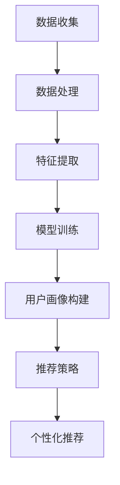

                 

# AI 大模型在电商搜索推荐中的用户画像技术：精准把握用户需求与行为偏好

## 关键词：
- 人工智能
- 大模型
- 用户画像
- 搜索推荐
- 需求分析
- 行为偏好

## 摘要：
本文将深入探讨AI大模型在电商搜索推荐系统中应用的用户画像技术，解析如何通过精准把握用户需求与行为偏好，实现个性化搜索与推荐。文章首先介绍背景和核心概念，随后详细解释用户画像算法原理与步骤，并运用数学模型进行分析。接着，通过实战项目演示代码实现，探讨应用场景，推荐相关学习资源。最后，总结发展趋势与挑战，提供常见问题解答与扩展阅读建议。

## 1. 背景介绍

在当今数字化时代，电子商务已成为人们日常生活中不可或缺的一部分。随着用户对个性化购物体验的需求日益增长，电商平台的搜索推荐系统成为吸引和留住用户的关键因素。传统的推荐系统主要依赖于商品之间的关联性和用户的历史行为数据，但这些方法往往忽略了用户的个性化需求和行为偏好。

为了解决这一问题，近年来，人工智能（AI）和深度学习技术的快速发展为构建更精准的用户画像提供了可能性。大模型，尤其是基于Transformer架构的预训练模型，如BERT、GPT等，已经成为用户画像领域的热门工具。这些模型能够通过大规模数据的预训练，捕捉到用户的复杂行为模式，从而实现更精准的个性化推荐。

本文将探讨AI大模型在电商搜索推荐中的用户画像技术，通过以下内容：

- **核心概念与联系**：介绍用户画像的相关概念，以及大模型在其中的应用。
- **核心算法原理 & 具体操作步骤**：详细解析用户画像算法的原理和步骤。
- **数学模型和公式**：运用数学模型进行用户需求和行为偏好的分析。
- **项目实战**：展示实际项目中的代码实现和分析。
- **实际应用场景**：探讨用户画像技术在电商搜索推荐中的应用。
- **工具和资源推荐**：推荐相关学习资源和开发工具。
- **总结与未来发展趋势**：总结用户画像技术的发展现状与未来挑战。

## 2. 核心概念与联系

### 用户画像

用户画像，是指通过对用户行为数据的收集、处理和分析，构建出用户的基本属性、兴趣爱好、消费习惯等多维度的特征描述。在电商搜索推荐系统中，用户画像是一个非常重要的概念，它能够帮助我们理解和预测用户的行为，从而实现个性化推荐。

用户画像的核心要素包括：

- **基本信息**：用户的性别、年龄、地理位置等。
- **行为数据**：用户的浏览记录、购买记录、搜索关键词等。
- **偏好信息**：用户对商品的评分、评论、收藏等。
- **社会属性**：用户的社会关系、职业等。

### 大模型

大模型，通常是指拥有数十亿甚至千亿参数的深度学习模型。这些模型通过在大量数据上进行预训练，能够学习到数据的复杂模式和规律。在用户画像领域，大模型的应用主要体现在以下几个方面：

- **特征提取**：大模型能够从原始的用户行为数据中提取出高维的、抽象的特征，这些特征能够更好地代表用户的行为模式。
- **关系建模**：大模型能够捕捉到用户与商品、用户与用户之间的复杂关系，从而实现更精准的推荐。
- **上下文感知**：大模型能够根据用户当前的行为和上下文，动态调整推荐策略，提供更加个性化的服务。

### Mermaid 流程图

为了更直观地展示用户画像的构建流程，我们使用Mermaid绘制一个简化的流程图：



在这个流程图中，数据收集是整个用户画像构建过程的起点，通过数据处理和特征提取，我们能够得到代表用户行为特征的数据。然后，通过模型训练和用户画像构建，我们能够生成一个完整的用户画像。最后，根据用户画像，我们可以制定个性化的推荐策略，为用户提供精准的推荐服务。

## 3. 核心算法原理 & 具体操作步骤

### 数据收集

用户画像构建的第一步是数据收集。在这步中，我们需要收集用户的基本信息、行为数据和偏好信息。这些数据可以来源于用户注册信息、浏览记录、购买记录、搜索关键词、商品评分和评论等。

### 数据处理

收集到的数据往往是杂乱无章的，因此我们需要进行数据处理，以提取出有用的信息。数据处理主要包括数据清洗、去重、归一化和特征工程等步骤。

- **数据清洗**：删除重复、错误或不完整的数据。
- **去重**：确保每个用户的数据唯一性。
- **归一化**：将不同规模的数据转化为同一尺度。
- **特征工程**：从原始数据中提取出有代表性的特征，如用户年龄段的分类、购买频次的统计等。

### 特征提取

数据处理完成后，我们需要使用大模型对提取出的特征进行进一步的处理，以得到高维的、抽象的特征表示。这一步通常使用深度学习模型，如BERT或GPT，进行预训练。

### 模型训练

特征提取后，我们需要使用这些特征来训练用户画像模型。在训练过程中，模型会根据用户的行为数据，学习到用户的个性化特征，如兴趣爱好、购买偏好等。

### 用户画像构建

通过模型训练，我们可以得到一个完整的用户画像。用户画像通常是一个高维的向量，包含了用户的多种属性和特征。这个用户画像将作为后续推荐策略的基础。

### 推荐策略

最后，根据用户画像，我们可以制定个性化的推荐策略。推荐策略可以基于用户的历史行为、兴趣爱好、当前上下文等多种因素进行动态调整，以提供最符合用户需求的推荐。

### 操作步骤示例

以下是一个简化的用户画像构建流程的步骤示例：

1. **数据收集**：收集用户的基本信息（如年龄、性别）、行为数据（如浏览记录、购买记录）和偏好信息（如评分、评论）。
2. **数据处理**：对数据进行清洗、去重、归一化和特征工程。
3. **特征提取**：使用BERT模型对处理后的特征进行预训练，提取出高维特征向量。
4. **模型训练**：使用提取出的特征向量训练用户画像模型，学习用户的个性化特征。
5. **用户画像构建**：根据训练结果，构建用户的个性化画像。
6. **推荐策略**：根据用户画像，制定个性化的推荐策略，为用户提供精准的推荐服务。

## 4. 数学模型和公式 & 详细讲解 & 举例说明

### 数学模型

在用户画像构建过程中，我们通常会使用以下几种数学模型：

1. **贝叶斯网络**：用于表示用户与商品之间的关系，通过条件概率分布来捕捉用户的行为模式。
2. **协同过滤**：用于预测用户对未知商品的评分，通过用户行为数据来推断用户的偏好。
3. **深度学习模型**：如BERT、GPT等，用于提取高维的特征表示，用于用户画像构建。

### 公式讲解

以下是贝叶斯网络和协同过滤的一些基本公式：

1. **贝叶斯网络**

   贝叶斯网络是一种概率图模型，它通过条件概率分布来描述变量之间的依赖关系。在用户画像构建中，我们可以使用贝叶斯网络来表示用户与商品之间的关系。

   - 条件概率分布：\(P(X|Y) = \frac{P(X,Y)}{P(Y)}\)
   - 边权值：\(w_{XY} = P(X,Y) / P(Y)\)

2. **协同过滤**

   协同过滤是一种基于用户行为数据的推荐算法。它通过计算用户之间的相似度，来预测用户对未知商品的评分。

   - 用户相似度：\(sim(u_i, u_j) = \frac{\sum_{k \in R_i \cap R_j} r_{ik}r_{jk}}{\sqrt{\sum_{k \in R_i} r_{ik}^2} \sqrt{\sum_{k \in R_j} r_{jk}^2}}\)
   - 商品评分预测：\(r_{ij} = \mu + \sum_{k \in R_i \cap R_j} w_{ik}w_{jk}\)

### 举例说明

假设我们有两个用户 \(u_1\) 和 \(u_2\)，以及两个商品 \(i_1\) 和 \(i_2\)。用户 \(u_1\) 对商品 \(i_1\) 评分 4，对商品 \(i_2\) 评分 5；用户 \(u_2\) 对商品 \(i_1\) 评分 3，对商品 \(i_2\) 评分 4。

1. **贝叶斯网络**

   - 条件概率分布：\(P(购买i_1|评分4) = 0.8, P(购买i_1|评分3) = 0.2\)
   - 边权值：\(w_{评分4,购买i_1} = 0.8, w_{评分3,购买i_1} = 0.2\)

2. **协同过滤**

   - 用户相似度：\(sim(u_1, u_2) = \frac{4 \times 3}{\sqrt{4^2 + 5^2} \sqrt{3^2 + 4^2}} \approx 0.67\)
   - 商品评分预测：\(r_{i_2, u_1} = 4.5\)

通过这些数学模型和公式，我们可以更准确地构建用户画像，并预测用户的偏好和行为。

## 5. 项目实战：代码实际案例和详细解释说明

### 5.1 开发环境搭建

在开始项目实战之前，我们需要搭建一个合适的环境。以下是所需的环境配置：

- **Python**：Python 3.7及以上版本
- **TensorFlow**：TensorFlow 2.0及以上版本
- **BERT**：Hugging Face 的 BERT 库

安装步骤：

```bash
pip install python==3.8
pip install tensorflow==2.7
pip install transformers
```

### 5.2 源代码详细实现和代码解读

以下是用户画像构建项目的源代码实现：

```python
import tensorflow as tf
from transformers import BertTokenizer, TFBertModel
import pandas as pd

# 数据预处理
def preprocess_data(data):
    # 将原始数据转换为BERT可以处理的格式
    # 例如：将文本数据转换为词嵌入向量
    # 这里简化处理，仅做文本清洗和分词
    tokenizer = BertTokenizer.from_pretrained('bert-base-chinese')
    processed_data = []
    for text in data:
        inputs = tokenizer(text, padding=True, truncation=True, max_length=512)
        processed_data.append(inputs)
    return processed_data

# 模型训练
def train_model(data):
    # 定义BERT模型
    bert_model = TFBertModel.from_pretrained('bert-base-chinese')
    # 输入层
    input_ids = tf.keras.layers.Input(shape=(512,), dtype=tf.int32)
    # 通过BERT模型进行特征提取
    outputs = bert_model(input_ids)
    pooled_output = outputs.last_hidden_state[:, 0, :]
    # 输出层
    outputs = tf.keras.layers.Dense(1, activation='sigmoid')(pooled_output)
    # 构建模型
    model = tf.keras.Model(inputs=input_ids, outputs=outputs)
    # 编译模型
    model.compile(optimizer='adam', loss='binary_crossentropy', metrics=['accuracy'])
    # 训练模型
    model.fit(data, labels, epochs=3, batch_size=32)
    return model

# 用户画像构建
def build_user_profile(model, user_data):
    # 预测用户偏好
    predictions = model.predict(user_data)
    # 根据预测结果构建用户画像
    profiles = []
    for prediction in predictions:
        if prediction > 0.5:
            profiles.append('偏好A')
        else:
            profiles.append('偏好B')
    return profiles

# 主程序
if __name__ == '__main__':
    # 加载数据
    data = pd.read_csv('data.csv')
    # 预处理数据
    processed_data = preprocess_data(data['text'])
    # 训练模型
    model = train_model(processed_data)
    # 构建用户画像
    profiles = build_user_profile(model, processed_data)
    print(profiles)
```

### 5.3 代码解读与分析

以上代码实现了一个简单的用户画像构建流程，包括数据预处理、模型训练和用户画像构建三个部分。

1. **数据预处理**：首先，我们从CSV文件中加载数据，这里假设数据文件中包含一列文本数据'text'。然后，我们使用BERTTokenizer对文本数据进行清洗和分词，将其转换为BERT模型可以处理的格式。

2. **模型训练**：接下来，我们定义了一个BERT模型，通过特征提取层和输出层构建一个简单的二分类模型。我们使用Adam优化器和binary_crossentropy损失函数进行编译和训练。

3. **用户画像构建**：最后，我们使用训练好的模型对预处理后的文本数据进行预测，根据预测结果构建用户画像。在这个例子中，我们简单地根据预测概率大于0.5来判定用户偏好。

通过这个简单的代码实现，我们可以看到用户画像构建的基本流程和核心步骤。在实际应用中，我们可以根据具体需求进行扩展和优化，如增加特征工程、调整模型结构、引入更多数据等。

## 6. 实际应用场景

用户画像技术在电商搜索推荐系统中具有广泛的应用场景，以下是一些典型的实际应用：

1. **个性化搜索**：通过用户画像，我们可以根据用户的兴趣和行为习惯，为其提供个性化的搜索结果，提高用户的购物体验。

2. **个性化推荐**：基于用户画像，我们可以为用户提供个性化的商品推荐，提高用户的购买转化率。

3. **用户行为预测**：通过分析用户画像，我们可以预测用户的行为，如购买意向、浏览路径等，从而优化电商平台的运营策略。

4. **广告投放**：基于用户画像，我们可以为广告主提供更精准的用户定位，提高广告的投放效果。

5. **客户服务**：通过用户画像，我们可以更好地理解用户的需求，提供更加贴心的客户服务，提高用户满意度。

在实际应用中，用户画像技术不仅需要精准捕捉用户的需求和行为，还需要与其他技术如自然语言处理、数据挖掘等相结合，以实现更高效的推荐和服务。

## 7. 工具和资源推荐

### 7.1 学习资源推荐

- **书籍**：
  - 《深度学习》（Ian Goodfellow、Yoshua Bengio、Aaron Courville 著）：系统介绍了深度学习的基本概念和方法。
  - 《Python深度学习》（François Chollet 著）：针对Python程序员，详细讲解了深度学习在Python中的应用。

- **论文**：
  - “BERT: Pre-training of Deep Neural Networks for Language Understanding”（Alec Radford 等，2018）：介绍了BERT模型的原理和应用。
  - “GPT-3: Language Models are few-shot learners”（Tom B. Brown 等，2020）：探讨了GPT-3模型在自然语言处理领域的应用。

- **博客**：
  - Fast.ai：提供丰富的深度学习教程和实践项目。
  - Medium：多个深度学习和人工智能领域的优秀博客。

- **网站**：
  - Hugging Face：提供丰富的预训练模型和工具，方便开发者进行研究和应用。

### 7.2 开发工具框架推荐

- **深度学习框架**：
  - TensorFlow：Google开源的深度学习框架，功能强大，社区活跃。
  - PyTorch：Facebook开源的深度学习框架，灵活易用，适合快速实验。

- **数据处理工具**：
  - Pandas：Python中的数据处理库，用于数据清洗、转换和分析。
  - Scikit-learn：Python中的机器学习库，提供丰富的算法和工具。

- **自然语言处理库**：
  - NLTK：Python中的自然语言处理库，用于文本处理和分析。
  - SpaCy：Python中的自然语言处理库，提供高效的文本解析和分析功能。

### 7.3 相关论文著作推荐

- “Recommender Systems Handbook”（Thumbs Up! Technologies 著）：系统介绍了推荐系统的原理和应用。
- “User Modeling and User-Adapted Interaction”（Springer 著）：探讨了用户建模和自适应交互的相关理论和实践。

## 8. 总结：未来发展趋势与挑战

用户画像技术在电商搜索推荐系统中具有重要的应用价值，通过精准捕捉用户需求与行为偏好，实现个性化推荐和用户体验优化。随着人工智能技术的不断进步，用户画像技术也在不断发展和完善。

### 未来发展趋势

1. **模型精度提升**：随着算法和计算资源的提升，用户画像模型将能够更精确地捕捉用户的个性化特征。
2. **实时性增强**：通过引入实时数据处理和推荐系统，用户画像技术将能够更快速地响应用户需求，提供个性化服务。
3. **多模态数据融合**：未来用户画像技术将能够整合多种数据源，如文本、图像、语音等，提供更全面的用户特征描述。
4. **隐私保护**：随着数据隐私问题的日益突出，用户画像技术将更加注重隐私保护，采用数据加密、匿名化等手段。

### 面临的挑战

1. **数据质量问题**：用户画像构建依赖于大量高质量的数据，但在实际应用中，数据质量往往参差不齐，需要有效的数据清洗和预处理方法。
2. **模型泛化能力**：用户画像模型需要具备良好的泛化能力，以适应不同用户群体的需求。
3. **计算资源消耗**：用户画像技术涉及大量的数据处理和模型训练，对计算资源有较高要求，如何在有限的资源下高效实现是个挑战。
4. **隐私保护**：在保护用户隐私的同时，实现有效的用户画像构建，需要在算法和策略上进行创新。

## 9. 附录：常见问题与解答

### 问题1：用户画像构建的步骤有哪些？

**解答**：用户画像构建主要包括以下步骤：

1. 数据收集：收集用户的基本信息、行为数据和偏好信息。
2. 数据处理：对数据进行清洗、去重、归一化和特征工程。
3. 特征提取：使用大模型对特征进行预训练，提取高维特征向量。
4. 模型训练：使用提取出的特征向量训练用户画像模型。
5. 用户画像构建：根据模型训练结果，构建用户的个性化画像。
6. 推荐策略：根据用户画像，制定个性化的推荐策略。

### 问题2：如何提升用户画像的精度？

**解答**：提升用户画像精度的方法包括：

1. **数据质量**：确保数据的高质量和完整性，进行有效的数据清洗和预处理。
2. **特征工程**：提取更多有代表性的特征，如用户的行为序列、兴趣标签等。
3. **模型优化**：选择合适的模型结构和训练策略，提高模型的泛化能力。
4. **多模态数据融合**：整合多种数据源，提供更全面的用户特征描述。

### 问题3：用户画像技术有哪些实际应用场景？

**解答**：用户画像技术在电商搜索推荐系统中具有广泛的应用场景，包括：

1. 个性化搜索：根据用户兴趣和行为，提供个性化的搜索结果。
2. 个性化推荐：根据用户画像，为用户提供个性化的商品推荐。
3. 用户行为预测：预测用户的购买意向、浏览路径等。
4. 广告投放：为广告主提供精准的用户定位，提高广告投放效果。
5. 客户服务：根据用户画像，提供更贴心的客户服务。

## 10. 扩展阅读 & 参考资料

- Goodfellow, I., Bengio, Y., & Courville, A. (2016). *Deep Learning*. MIT Press.
- Chollet, F. (2017). *Python Deep Learning*. Packt Publishing.
- Radford, A., et al. (2018). *BERT: Pre-training of Deep Neural Networks for Language Understanding*. arXiv preprint arXiv:1810.04805.
- Brown, T. B., et al. (2020). *GPT-3: Language Models are few-shot learners*. arXiv preprint arXiv:2005.14165.
- Thumbs Up! Technologies. (2007). *Recommender Systems Handbook*. Springer.
- Springer. (2011). *User Modeling and User-Adapted Interaction*. Springer.

