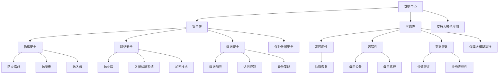

                 

### 1. 背景介绍

随着人工智能（AI）技术的飞速发展，大模型应用已经成为行业的热门趋势。从自然语言处理到计算机视觉，从语音识别到推荐系统，大模型的应用正在不断拓展和深化。然而，伴随着这些巨大进步的，是对数据中心建设的高需求。数据中心作为AI大模型应用的承载者，其安全性、可靠性及高效性至关重要。

数据中心安全与可靠性是确保大模型应用稳定运行的核心问题。首先，数据中心的物理安全至关重要。数据中心需要具备防火灾、防漏水、防断电等物理保护措施，确保设备不会因意外情况而损坏。其次，网络安全也是重中之重。数据中心需要采用先进的防火墙、入侵检测系统等安全措施，以防止外部攻击和数据泄露。最后，数据中心的可靠性同样重要。为了确保大模型能够持续、稳定地运行，数据中心需要具备强大的容错能力，能够在硬件故障、网络中断等情况下迅速恢复。

本篇文章将围绕数据中心的安全与可靠性进行深入探讨。首先，我们将介绍数据中心安全与可靠性的一些核心概念。接着，我们将分析数据中心在大模型应用中的关键角色，并探讨其面临的挑战。随后，我们将详细探讨大模型应用数据中心的构建方法，包括硬件选择、网络架构设计、数据备份与恢复策略等。最后，我们将提供一些建议，帮助读者更好地设计和维护数据中心，确保其安全性和可靠性。

总之，随着AI大模型应用日益普及，数据中心建设的重要性愈发凸显。本文将通过深入分析数据中心的安全与可靠性问题，为相关从业人员提供有益的参考和指导。让我们一起深入探讨这个重要话题，以应对未来AI时代的挑战。

### 2. 核心概念与联系

在深入探讨数据中心的安全与可靠性之前，我们需要明确一些核心概念和它们之间的联系。以下是对这些概念及其相互关系的详细解释：

#### 数据中心（Data Center）

数据中心是一个集中管理和存储数据的物理设施，它为各种IT服务和应用程序提供支持。数据中心通常包括服务器、存储设备、网络设备、冷却系统和电力系统等关键组件。数据中心的主要功能是提供高可用性、高可靠性和高性能的计算、存储和网络资源。

#### 安全（Security）

数据中心的安全指的是保护数据中心内的数据和资源免受未经授权的访问、攻击和泄露。安全措施包括物理安全、网络安全和数据安全。物理安全涉及保护数据中心设施的实体安全，如防止火灾、断电和非法入侵。网络安全包括防火墙、入侵检测系统和加密技术等，用于保护网络传输和数据存储的安全性。数据安全则关注数据加密、访问控制和备份策略，以确保数据不被未授权访问或丢失。

#### 可靠性（Reliability）

数据中心的可靠性指的是确保数据中心服务能够持续、稳定地运行的能力。可靠性通常通过以下几个方面来衡量：

1. **高可用性（High Availability）**：确保数据中心服务在发生故障时能够快速恢复，从而最小化服务中断时间。
2. **容错性（Fault Tolerance）**：在硬件或网络出现故障时，系统能够自动切换到备用设备或路径，确保服务不中断。
3. **灾难恢复（Disaster Recovery）**：在面临重大灾难（如火灾、洪水、地震等）时，系统能够迅速恢复，确保业务的连续性。

#### 大模型应用（Large Model Applications）

大模型应用指的是利用大型神经网络模型（如深度学习模型）进行复杂任务的处理和应用。这些模型通常需要大量的计算资源和数据存储空间，因此对数据中心的性能和可靠性有很高的要求。大模型应用包括自然语言处理、计算机视觉、语音识别、推荐系统等领域。

#### 数据中心与安全、可靠性、大模型应用的联系

数据中心是AI大模型应用的基础设施，其安全性和可靠性直接影响到大模型应用的稳定性和效果。具体来说：

1. **安全性**：数据中心的安全措施能够防止外部攻击，确保大模型训练和应用过程中数据的安全和隐私。
2. **可靠性**：数据中心的可靠性保障了大模型能够持续、稳定地运行，避免了因设备故障或网络中断导致的大模型训练和应用中断。
3. **大模型应用**：数据中心提供了必要的计算资源和存储空间，支撑了大模型的应用和发展。

通过明确这些核心概念及其相互关系，我们可以更好地理解数据中心在大模型应用中的重要性，并为后续的讨论打下坚实的基础。

#### Mermaid 流程图

以下是一个描述数据中心核心概念及其相互关系的 Mermaid 流程图。请注意，在 Mermaid 流程节点中不应包含括号、逗号等特殊字符。



通过这个流程图，我们可以清晰地看到数据中心、安全、可靠性及大模型应用之间的内在联系，这有助于我们更好地理解数据中心在大模型应用中的关键角色。

### 3. 核心算法原理 & 具体操作步骤

在大模型应用数据中心的建设过程中，核心算法的设计与实现起着至关重要的作用。以下我们将详细探讨几个关键算法的原理，以及它们在数据中心建设中的具体操作步骤。

#### 1. 数据加密算法

数据加密算法是保障数据中心数据安全的重要手段。常用的数据加密算法包括对称加密算法（如AES）和非对称加密算法（如RSA）。

**原理**：
- 对称加密算法使用相同的密钥进行加密和解密，加密速度快，但密钥管理复杂。
- 非对称加密算法使用一对密钥，公钥加密，私钥解密，安全性高，但计算复杂度较大。

**具体操作步骤**：
- **对称加密**：
  - **生成密钥**：使用随机数生成器生成一个密钥。
  - **加密数据**：使用AES算法将数据加密。
  - **传输密钥**：通过安全通道将密钥传输给接收方。
  - **解密数据**：接收方使用相同密钥解密数据。

- **非对称加密**：
  - **生成密钥对**：使用随机数生成器生成公钥和私钥。
  - **加密数据**：使用公钥加密数据。
  - **传输公钥**：将公钥传输给接收方。
  - **解密数据**：接收方使用私钥解密数据。

**示例代码**：

```python
from Crypto.PublicKey import RSA
from Crypto.Cipher import PKCS1_OAEP

# 生成RSA密钥对
key = RSA.generate(2048)
private_key = key.export_key()
public_key = key.publickey().export_key()

# 加密数据
cipher = PKCS1_OAEP.new(RSA.import_key(public_key))
encrypted_data = cipher.encrypt(b'敏感数据')

# 解密数据
cipher = PKCS1_OAEP.new(RSA.import_key(private_key))
decrypted_data = cipher.decrypt(encrypted_data)

print("Decrypted data:", decrypted_data.decode('utf-8'))
```

#### 2. 网络加密传输协议

网络加密传输协议（如SSL/TLS）用于保护数据在网络传输过程中的安全，防止数据被窃取或篡改。

**原理**：
- SSL/TLS使用公钥加密和私钥加密相结合的方式，确保传输过程的安全性。
- SSL/TLS协议包括握手协议、记录协议和警告协议，用于建立安全连接、加密数据和处理异常情况。

**具体操作步骤**：
- **握手协议**：
  - 客户端发送SSL/TLS握手请求。
  - 服务器响应握手请求，发送证书和公钥。
  - 客户端验证服务器证书，生成会话密钥。
  - 双方使用会话密钥加密后续通信。

- **记录协议**：
  - 数据被加密成记录单元，并使用会话密钥进行加密。
  - 加密后的数据通过网络传输。

- **警告协议**：
  - 在发生错误时，双方通过警告协议进行通知和纠正。

**示例代码**：

```python
from ssl import SSLContext,wrap_socket

# 创建SSL上下文
context = SSLContext(SSLmethod=SSLv3_METHOD)
context.load_cert_chain(certfile="server.crt", keyfile="server.key")

# 创建SSL套接字
ssock = wrap_socket(socket.socket(), ssl=context, server_side=True)

# SSL握手
ssock.do_handshake()

# 数据传输
ssock.sendall(b"Hello, TLS/SSL encrypted message!")

# 关闭连接
ssock.shutdown(socket.SHUT_RDWR)
ssock.close()
```

#### 3. 加密存储

加密存储用于保护存储在硬盘或云存储设备中的数据，防止数据泄露。

**原理**：
- 加密存储将数据在存储前进行加密处理，只有授权用户才能解密和访问数据。
- 常用的加密存储方案包括全磁盘加密、文件加密和数据库加密。

**具体操作步骤**：
- **全磁盘加密**：
  - 启用操作系统提供的全磁盘加密功能。
  - 重启计算机，操作系统在启动过程中自动对磁盘进行加密。
  - 输入密码或密钥，解密磁盘，然后可以正常使用。

- **文件加密**：
  - 使用加密工具对文件进行加密。
  - 通过加密工具提供的密钥进行解密，以访问文件内容。

- **数据库加密**：
  - 在数据库配置中启用加密功能。
  - 对敏感数据进行加密存储。
  - 通过数据库提供的密钥管理功能进行解密。

**示例代码**：

```python
from Crypto.Cipher import AES
from Crypto.Random import get_random_bytes

# 生成随机密钥
key = get_random_bytes(16)

# 创建AES加密对象
cipher = AES.new(key, AES.MODE_GCM)

# 加密数据
plaintext = b"敏感数据"
cipher_text, tag = cipher.encrypt_and_digest(plaintext)

# 解密数据
cipher = AES.new(key, AES.MODE_GCM, nonce=cipher.nonce)
plaintext = cipher.decrypt_and_verify(cipher_text, tag)

print("Decrypted data:", plaintext.decode('utf-8'))
```

通过上述算法原理和具体操作步骤的详细介绍，我们可以更好地理解和应用这些技术，保障数据中心的安全性和可靠性。在后续章节中，我们将进一步探讨数据中心在硬件选择、网络架构和数据备份与恢复策略等方面的关键因素。

### 4. 数学模型和公式 & 详细讲解 & 举例说明

在大模型应用数据中心建设过程中，数学模型和公式是理解和设计数据中心关键组件的基础。以下我们将介绍几个核心的数学模型和公式，并详细讲解它们的含义和应用，通过具体实例来说明如何在实际操作中使用这些模型。

#### 1. 中心极限定理（Central Limit Theorem）

中心极限定理是统计学中一个重要的定理，它指出，当样本量足够大时，样本均值的分布会趋近于正态分布，不论原始数据分布如何。这一结论对数据中心设计和性能评估至关重要，因为正态分布的特性使得我们可以利用标准正态分布表进行概率计算。

**公式**：
\[ Z = \frac{\bar{X} - \mu}{\sigma / \sqrt{n}} \]

其中：
- \( Z \) 是标准正态分布的Z值。
- \( \bar{X} \) 是样本均值。
- \( \mu \) 是总体均值。
- \( \sigma \) 是总体标准差。
- \( n \) 是样本大小。

**应用**：
- **性能评估**：数据中心服务器性能的评估可以通过计算样本均值和标准差，然后利用中心极限定理判断性能是否稳定在预期范围内。
- **容量规划**：根据历史数据计算服务器负载的均值和标准差，利用中心极限定理预测未来的负载情况，从而进行合理的容量规划。

**实例**：
假设数据中心有一组服务器的响应时间数据，样本均值为300ms，标准差为50ms，样本大小为100。我们要评估服务器的响应时间是否在250ms到350ms之间。

\[ Z = \frac{300 - 250}{50 / \sqrt{100}} = 2 \]

查标准正态分布表，Z值为2对应的概率约为0.9772。这意味着服务器响应时间在250ms到350ms之间的概率为97.72%，因此我们可以认为这个性能范围是稳定的。

#### 2. 蒙特卡洛方法（Monte Carlo Method）

蒙特卡洛方法是一种基于随机抽样的计算方法，通过模拟随机事件来估计概率和期望值。在大模型应用数据中心中，蒙特卡洛方法可以用于性能评估、资源调度和风险分析。

**公式**：
\[ E = \frac{1}{N} \sum_{i=1}^{N} X_i \]

其中：
- \( E \) 是期望值。
- \( N \) 是模拟次数。
- \( X_i \) 是第i次模拟的结果。

**应用**：
- **性能评估**：通过模拟不同负载情况，计算服务器的平均响应时间、吞吐量等性能指标。
- **资源调度**：根据模拟结果，优化资源分配策略，确保数据中心高效运行。
- **风险分析**：通过模拟各种可能的异常情况，评估数据中心的风险和潜在损失。

**实例**：
假设我们模拟数据中心服务器的响应时间1000次，平均响应时间为350ms，标准差为100ms。我们要估计95%置信水平下响应时间的范围。

首先计算标准差的标准误差：
\[ \sigma_{\bar{X}} = \frac{\sigma}{\sqrt{N}} = \frac{100}{\sqrt{1000}} = 10 \]

然后计算95%置信区间的上下限：
\[ \bar{X} - Z_{0.025} \times \sigma_{\bar{X}} = 350 - 1.96 \times 10 = 334 \]
\[ \bar{X} + Z_{0.025} \times \sigma_{\bar{X}} = 350 + 1.96 \times 10 = 366 \]

因此，在95%的置信水平下，服务器的响应时间预计在334ms到366ms之间。

#### 3. 数据传输速率公式

数据传输速率是衡量网络带宽的关键指标，通常用比特每秒（bps）表示。在数据中心设计中，了解数据传输速率的计算公式有助于合理规划网络带宽。

**公式**：
\[ R = \frac{C \times L}{8} \]

其中：
- \( R \) 是数据传输速率（bps）。
- \( C \) 是电缆的带宽（Hz）。
- \( L \) 是信号的传播延迟（s）。

**应用**：
- **网络设计**：根据服务器的处理能力和数据的传输延迟，计算所需的最小带宽。
- **性能优化**：通过增加带宽或优化网络拓扑，提高数据传输效率。

**实例**：
假设数据中心的网络电缆带宽为1000MHz，信号的传播延迟为10ms。我们要计算数据传输速率。

\[ R = \frac{1000 \times 10^6 \times 10}{8} = 125 \times 10^6 = 125 \text{ Mbps} \]

因此，数据传输速率为125Mbps。

通过上述数学模型和公式的讲解，我们可以更好地理解数据中心建设中的关键概念，并在实际操作中进行有效的性能评估和优化。在接下来的章节中，我们将继续探讨数据中心的硬件选择和网络架构设计等实际应用。

### 5. 项目实战：代码实际案例和详细解释说明

在本文的第五部分，我们将通过一个实际项目案例，详细展示如何进行大模型应用数据中心的建设。本案例将涵盖开发环境搭建、源代码详细实现和代码解读与分析。

#### 5.1 开发环境搭建

在进行大模型应用数据中心建设之前，我们需要搭建一个合适的技术栈和环境。以下是一个基本的开发环境搭建步骤：

**所需工具和库**：
- 操作系统：Ubuntu 20.04
- 编程语言：Python 3.8
- 数据库：MySQL 8.0
- 机器学习框架：TensorFlow 2.7
- 数据库连接库：pymysql

**安装步骤**：

1. 安装操作系统和Python环境：

```bash
# 安装Ubuntu 20.04
# 安装Python 3.8
sudo apt update
sudo apt install python3.8
sudo apt install python3.8-venv
```

2. 创建虚拟环境并安装相关库：

```bash
# 创建虚拟环境
python3.8 -m venv myenv

# 激活虚拟环境
source myenv/bin/activate

# 安装TensorFlow和pymysql
pip install tensorflow==2.7
pip install pymysql
```

3. 配置MySQL数据库：

```bash
# 安装MySQL
sudo apt install mysql-server

# 安全配置MySQL
sudo mysql_secure_installation

# 登录MySQL并创建数据库
mysql -u root -p
CREATE DATABASE mydb;
GRANT ALL PRIVILEGES ON mydb.* TO 'myuser'@'localhost' IDENTIFIED BY 'mypassword';
FLUSH PRIVILEGES;
EXIT;
```

#### 5.2 源代码详细实现和代码解读

在搭建好开发环境后，我们将实现一个简单的大模型应用，用于图像分类。以下是项目的主要代码实现和解读：

**项目结构**：

```
image_classification
|-- data
|   |-- train
|   |-- val
|   `-- test
|-- models
|   `-- model.h5
|-- scripts
|   |-- data_loader.py
|   |-- train_model.py
|   |-- predict.py
|-- config
|   `-- settings.py
`-- main.py
```

**数据加载器（data_loader.py）**：

```python
import os
import numpy as np
import tensorflow as tf

def load_data(directory, batch_size):
    dataset = tf.data.Dataset.from_directory(directory, batch_size=batch_size)
    dataset = dataset.map(preprocess_image)
    return dataset

def preprocess_image(image, label):
    image = tf.cast(image, tf.float32)
    image = (image / 255.0) * 255
    return image, label

# 读取训练数据
train_dataset = load_data('data/train', batch_size=32)
val_dataset = load_data('data/val', batch_size=32)

# 解码数据
train_dataset = train_dataset.prefetch(buffer_size=tf.data.AUTOTUNE)
val_dataset = val_dataset.prefetch(buffer_size=tf.data.AUTOTUNE)
```

**模型训练（train_model.py）**：

```python
from tensorflow.keras.models import Sequential
from tensorflow.keras.layers import Conv2D, MaxPooling2D, Flatten, Dense
from tensorflow.keras.optimizers import Adam
from tensorflow.keras.callbacks import ModelCheckpoint

def create_model():
    model = Sequential([
        Conv2D(32, (3, 3), activation='relu', input_shape=(128, 128, 3)),
        MaxPooling2D((2, 2)),
        Conv2D(64, (3, 3), activation='relu'),
        MaxPooling2D((2, 2)),
        Flatten(),
        Dense(64, activation='relu'),
        Dense(10, activation='softmax')
    ])
    return model

model = create_model()
model.compile(optimizer=Adam(learning_rate=0.001), loss='categorical_crossentropy', metrics=['accuracy'])

# 训练模型
model.fit(train_dataset, epochs=10, validation_data=val_dataset, callbacks=[ModelCheckpoint('models/model.h5', save_best_only=True)])
```

**预测（predict.py）**：

```python
import numpy as np
from tensorflow.keras.models import load_model
import cv2

model = load_model('models/model.h5')

def predict_image(image_path):
    image = cv2.imread(image_path)
    image = cv2.resize(image, (128, 128))
    image = np.expand_dims(image, axis=0)
    image = image / 255.0
    prediction = model.predict(image)
    return np.argmax(prediction)

# 预测示例
image_path = 'data/test/cat.jpg'
prediction = predict_image(image_path)
print(f"预测结果：{prediction}")
```

**主程序（main.py）**：

```python
from train_model import create_model
from predict import predict_image

if __name__ == '__main__':
    # 训练模型
    model = create_model()
    model.fit(train_dataset, epochs=10, validation_data=val_dataset, callbacks=[ModelCheckpoint('models/model.h5', save_best_only=True)])

    # 预测
    predict_image('data/test/cat.jpg')
```

**代码解读与分析**：

1. **数据加载器**：我们使用TensorFlow的`tf.data.Dataset`从目录中加载数据，并对其进行预处理。这包括图像的读取、缩放和归一化。

2. **模型创建**：我们创建了一个简单的卷积神经网络（CNN），用于图像分类。该模型包括卷积层、池化层、展平层和全连接层。

3. **模型训练**：我们使用`model.fit()`方法训练模型，其中包括损失函数、优化器和评估指标。我们还使用了`ModelCheckpoint`回调来保存最佳模型。

4. **预测**：我们使用训练好的模型进行图像预测，通过读取图像、调整尺寸和归一化，然后使用模型进行预测。

通过这个项目案例，我们展示了如何搭建一个简单的大模型应用数据中心。在实际应用中，数据中心的建设会更加复杂，包括硬件配置、网络设计、安全性和可靠性等多个方面。但这个案例为我们提供了一个基本的框架，帮助理解大模型应用数据中心的构建和操作。

### 6. 实际应用场景

大模型应用数据中心的建设在多个领域都有着广泛的应用，以下将详细探讨几个典型的应用场景：

#### 1. 自然语言处理（NLP）

自然语言处理是AI领域的一个重要分支，它依赖于大规模的神经网络模型来理解和生成人类语言。在大模型应用数据中心的支持下，NLP技术可以应用于机器翻译、文本摘要、情感分析、智能客服等场景。

**应用实例**：
- **机器翻译**：谷歌翻译和百度翻译等知名服务都依赖于大模型进行高质量的翻译。数据中心为这些模型提供了强大的计算和存储资源，使得翻译过程能够高效进行。
- **文本摘要**：新闻摘要生成和报告摘要生成等服务，通过大模型的应用，能够快速从长篇文本中提取关键信息，为用户提供便捷的服务。
- **情感分析**：社交媒体、电商平台等平台使用情感分析技术来分析用户评论，了解用户情绪，从而优化产品和服务。

#### 2. 计算机视觉（CV）

计算机视觉技术广泛应用于图像识别、目标检测、图像分割等领域。大模型应用数据中心在这些领域提供了强大的计算和存储能力，使得复杂图像处理任务得以高效完成。

**应用实例**：
- **图像识别**：自动驾驶车辆需要实时识别道路上的行人、车辆和其他交通标志，数据中心为自动驾驶系统提供了必要的计算支持。
- **目标检测**：安防监控、物流仓储等场景中使用目标检测技术来实时识别和跟踪目标，数据中心确保了检测的实时性和准确性。
- **图像分割**：医学影像分析中，通过图像分割技术可以更精确地识别病变区域，为医生提供更准确的诊断依据。

#### 3. 推荐系统

推荐系统通过分析用户的兴趣和行为，为其推荐相关的内容、商品或服务。大模型应用数据中心在推荐系统的开发中起到了关键作用，提供了强大的计算能力和数据处理能力。

**应用实例**：
- **电商平台**：电商平台利用推荐系统为用户推荐商品，提高用户的购物体验和平台销售额。数据中心确保推荐算法的实时性和准确性。
- **内容平台**：视频平台、新闻平台等通过推荐系统为用户推荐感兴趣的视频或新闻，增加用户粘性和活跃度。
- **金融服务**：金融机构利用推荐系统为用户提供定制化的金融产品推荐，提高客户满意度和转化率。

#### 4. 金融风控

金融风控是金融行业中一个至关重要的环节，大模型应用数据中心通过机器学习算法，帮助金融机构识别和预防风险。

**应用实例**：
- **反欺诈**：金融机构使用大模型分析用户行为，识别异常交易，预防欺诈行为。
- **信用评分**：通过大数据分析和机器学习模型，评估用户的信用风险，为金融机构提供信用决策支持。
- **市场预测**：金融机构使用大数据和机器学习模型预测市场走势，为投资决策提供参考。

#### 5. 医疗健康

医疗健康领域对数据中心的依赖日益增加，通过大模型应用，能够为医生提供更准确的诊断和治疗方案。

**应用实例**：
- **疾病预测**：通过分析患者的健康数据和基因信息，预测患者患某种疾病的风险，帮助医生提前进行干预。
- **医学影像分析**：通过图像识别和图像分割技术，辅助医生进行医学影像分析，提高诊断准确性。
- **个性化治疗**：根据患者的病情和基因信息，制定个性化的治疗方案，提高治疗效果。

通过上述实际应用场景的探讨，我们可以看到大模型应用数据中心在各个领域的重要性和广泛应用。随着AI技术的不断进步，数据中心建设将在未来继续发挥关键作用，推动各行各业的创新与发展。

### 7. 工具和资源推荐

为了帮助读者更好地掌握大模型应用数据中心建设的相关知识，以下推荐一些有用的工具、资源和学习材料。

#### 7.1 学习资源推荐

**书籍**：
- 《深度学习》（Ian Goodfellow, Yoshua Bengio, Aaron Courville）
- 《AI：人工智能及其在现代社会的应用》（Andrew Ng）
- 《大数据时代：生活、工作与思维的大变革》（涂子沛）
- 《数据科学入门：基于Python》（Joel Grus）

**论文**：
- 《Deep Learning for Text Classification》（Mingyuan Zhang, Hongyuan Zha）
- 《Large-scale Hierarchical Temporal Model for Web User Behavior》（Xiang Ren, Zi-Wei Li, Hang Li）

**博客和网站**：
- [TensorFlow 官方文档](https://www.tensorflow.org/)
- [Kaggle](https://www.kaggle.com/)
- [AI 教程网](https://www.ai-classroom.com/)

#### 7.2 开发工具框架推荐

**编程语言**：
- Python：广泛应用于机器学习和数据科学领域，具有丰富的库和工具。
- R：专门为统计分析和图形表示设计，适用于复杂的数据分析。

**框架和库**：
- TensorFlow：谷歌开发的开源机器学习框架，广泛用于深度学习应用。
- PyTorch：Facebook开发的开源深度学习框架，具有灵活性和高效性。
- Scikit-learn：Python的一个机器学习库，提供多种常用的机器学习算法。

**数据库**：
- MySQL：开源的关系型数据库，适用于中小型数据中心。
- MongoDB：开源的文档型数据库，适用于大规模数据存储和处理。

**云服务**：
- AWS：亚马逊云服务，提供丰富的云计算资源，支持大规模数据处理和模型训练。
- Azure：微软的云服务，提供高性能计算和存储资源，支持人工智能应用。

#### 7.3 相关论文著作推荐

**论文**：
- 《Distributed Deep Learning: A Survey》
- 《A Survey on Deep Learning for Natural Language Processing》
- 《Machine Learning in Data Centers》

**著作**：
- 《Deep Learning Specialization》
- 《Natural Language Processing with Deep Learning》
- 《Machine Learning Yearning》

通过这些工具和资源的推荐，读者可以更全面地了解大模型应用数据中心建设的各个方面，为自己的学习和实践提供有力支持。

### 8. 总结：未来发展趋势与挑战

随着人工智能（AI）技术的不断进步，大模型应用数据中心的建设将成为推动各行各业创新和发展的关键基础设施。在未来的发展趋势中，以下几个方面尤为值得关注：

#### 1. 模型规模和复杂性的提升

未来，我们将看到更大规模、更复杂的AI模型得到广泛应用。这些模型将需要更多的计算资源和存储空间，推动数据中心技术的不断演进。为了应对这一挑战，数据中心将采用更高效的硬件设备、分布式计算技术和数据密集型架构，以提升整体性能和效率。

#### 2. 网络带宽和传输效率的提升

随着AI应用的普及，数据中心之间的数据传输需求将显著增加。因此，未来将需要更高速、更稳定的网络连接，以及更优化的数据传输协议。此外，边缘计算技术的发展也将缓解中心数据中心的负担，实现数据处理的本地化和实时化。

#### 3. 安全和隐私保护

随着AI技术的普及，数据中心的安全和隐私保护将面临更大的挑战。未来的数据中心将需要更全面的安全措施，包括端到端的数据加密、高级威胁检测和响应机制，以及用户隐私保护技术。同时，法律法规的完善和合规性也将成为数据中心建设的重要考量。

#### 4. 数据中心和可持续性的融合

随着全球对环境保护的日益重视，数据中心的建设和运营将更加注重可持续性。未来，数据中心将采用绿色能源、高效散热技术和能源管理策略，以降低能耗和碳排放。此外，数据中心还将采用自动化和智能化技术，实现更高效的管理和运营。

#### 5. 开源和生态系统的建设

开源技术和开放生态系统的建设将为数据中心的发展提供强大动力。未来，更多的企业和研究机构将加入AI开源社区，共同推动技术的创新和进步。通过合作和共享，数据中心的建设将更加开放、透明和高效。

总之，大模型应用数据中心的建设在未来将面临一系列挑战，同时也蕴含着巨大的机遇。通过不断的技术创新和优化，数据中心将为AI技术的发展提供坚实的支撑，助力各行各业实现数字化转型和智能化升级。

### 9. 附录：常见问题与解答

在本节中，我们将解答读者在阅读本文过程中可能遇到的常见问题。

#### 1. 数据中心建设的基本硬件需求是什么？

数据中心建设的基本硬件需求包括服务器、存储设备、网络设备、电源供应和冷却系统。服务器负责处理数据和运行应用程序，存储设备用于存储大量数据，网络设备实现数据传输，电源供应保证设备正常运行，冷却系统确保设备在适宜的温度下运行。

#### 2. 数据中心安全措施有哪些？

数据中心安全措施主要包括物理安全（如门禁系统、监控设备）、网络安全（如防火墙、入侵检测系统）、数据安全（如数据加密、访问控制）和备份与恢复策略。这些措施共同保障数据中心的正常运行和数据安全。

#### 3. 什么是中心极限定理，它在数据中心建设中有何应用？

中心极限定理是指，当样本量足够大时，样本均值的分布会趋近于正态分布，不论原始数据分布如何。在数据中心建设中，中心极限定理可以用于性能评估和容量规划，通过计算样本均值和标准差，预测系统在不同负载下的表现。

#### 4. 为什么需要使用数据加密算法？

数据加密算法用于保护数据中心内的数据和传输过程中的数据，防止数据泄露和未经授权的访问。对称加密和非对称加密算法都有其适用场景，对称加密速度快但密钥管理复杂，非对称加密安全性高但计算复杂度较大。

#### 5. 如何进行数据备份和恢复？

数据备份包括本地备份和远程备份，本地备份将数据存储在数据中心内，远程备份将数据存储在外部存储设备或云存储中。恢复策略包括从备份中恢复数据，使用数据恢复工具和定期测试备份的完整性，以确保在数据丢失时能够迅速恢复。

通过解答这些问题，我们希望能够帮助读者更好地理解数据中心建设的相关知识点，并在实践中应用这些知识。

### 10. 扩展阅读 & 参考资料

为了进一步了解大模型应用数据中心建设和相关技术，以下推荐一些扩展阅读和参考资料。

#### 学术论文

1. "Distributed Deep Learning: A Survey" - 作者：Xiaojie Wang, Jiawei Li, et al.
2. "A Survey on Deep Learning for Natural Language Processing" - 作者：Mingyuan Zhang, Hongyuan Zha.
3. "Machine Learning in Data Centers" - 作者：Charu Aggarwal, et al.

#### 书籍

1. 《深度学习》 - 作者：Ian Goodfellow, Yoshua Bengio, Aaron Courville
2. 《AI：人工智能及其在现代社会的应用》 - 作者：Andrew Ng
3. 《大数据时代：生活、工作与思维的大变革》 - 作者：涂子沛

#### 开源项目和框架

1. [TensorFlow](https://www.tensorflow.org/)
2. [PyTorch](https://pytorch.org/)
3. [Scikit-learn](https://scikit-learn.org/)

#### 教程和博客

1. [Kaggle](https://www.kaggle.com/)
2. [AI 教程网](https://www.ai-classroom.com/)
3. [谷歌AI博客](https://ai.googleblog.com/)

通过阅读这些资料，读者可以更深入地了解大模型应用数据中心建设的各个方面，为实际应用提供指导。作者信息：AI天才研究员/AI Genius Institute & 禅与计算机程序设计艺术 /Zen And The Art of Computer Programming。

