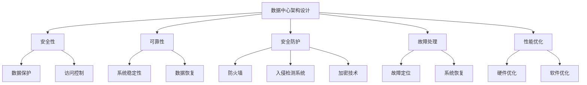

                 

# AI 大模型应用数据中心建设：数据中心安全与可靠性

> **关键词：** AI 大模型、数据中心、安全性、可靠性、架构设计、安全防护、故障处理、性能优化

> **摘要：** 本文将深入探讨 AI 大模型应用数据中心的建设，重点分析数据中心的安全性与可靠性。通过详细的理论与实践解析，为读者提供一站式指南，帮助其在数据中心建设过程中应对复杂的技术挑战。

## 1. 背景介绍

随着人工智能技术的快速发展，AI 大模型的应用场景日益广泛。从自动驾驶、智能医疗到金融风控、自然语言处理，AI 大模型已成为各个行业数字化转型的重要驱动力。然而，AI 大模型的训练和部署需要大量的计算资源和数据存储，这就需要构建高效、安全、可靠的数据中心来支持。

数据中心作为 AI 大模型应用的核心基础设施，其安全性和可靠性直接关系到 AI 应用的稳定性和业务的成功。本文将围绕数据中心的安全与可靠性展开讨论，从核心概念、算法原理、数学模型、实际应用等多个角度，为数据中心建设提供全面的指导。

## 2. 核心概念与联系

在讨论数据中心安全与可靠性的核心概念之前，我们首先需要理解几个关键术语：

### 2.1 数据中心

数据中心是一种用于存储、处理和管理大量数据的设施。它通常包括服务器、存储设备、网络设备、电源供应和冷却系统等组成部分。数据中心的规模和功能可以根据不同的应用需求进行定制。

### 2.2 安全性

数据中心的安全性是指保护数据中心内的数据和系统不受未经授权的访问、篡改、泄露和攻击的能力。安全性的核心目标是确保数据的机密性、完整性和可用性。

### 2.3 可靠性

可靠性是指数据中心在特定条件下稳定运行的能力。一个可靠的数据中心应能够确保高可用性，即使在出现硬件故障、软件故障或网络中断的情况下，也能保持正常运行。

### 2.4 架构设计

数据中心架构设计是指如何组织和配置数据中心的各个组成部分，以实现高效、安全、可靠的数据处理和存储。一个良好的架构设计应考虑到性能、扩展性、安全性和成本效益等因素。

### 2.5 安全防护

安全防护是指通过各种技术和手段保护数据中心免受各种安全威胁，包括防火墙、入侵检测系统、加密技术、访问控制等。

### 2.6 故障处理

故障处理是指数据中心在出现故障时，如何快速定位问题、恢复系统和数据，以最小化业务中断和数据损失。

### 2.7 性能优化

性能优化是指通过优化数据中心硬件和软件配置，提高数据中心的处理能力和响应速度，以满足不断增长的数据处理需求。

### 2.8 Mermaid 流程图

为了更好地理解这些核心概念之间的联系，我们可以使用 Mermaid 流程图来展示数据中心的架构设计、安全防护、故障处理和性能优化等关键环节。



## 3. 核心算法原理 & 具体操作步骤

### 3.1 安全性算法原理

数据中心的安全性依赖于多种算法和技术。以下是一些关键的安全性算法原理：

#### 3.1.1 加密算法

加密算法用于保护数据的机密性。常见的加密算法包括对称加密（如 AES）和非对称加密（如 RSA）。加密算法通过将明文数据转换为密文，从而防止未经授权的访问。

#### 3.1.2 访问控制算法

访问控制算法用于确保只有授权用户才能访问特定数据和系统资源。常见的访问控制算法包括基于角色的访问控制（RBAC）和基于属性的访问控制（ABAC）。

#### 3.1.3 入侵检测算法

入侵检测算法用于检测和响应潜在的安全威胁。常见的入侵检测算法包括基于特征的方法、基于异常的方法和基于模型的算法。

### 3.2 具体操作步骤

以下是构建数据中心安全性的具体操作步骤：

#### 3.2.1 设计安全架构

在设计数据中心时，应考虑安全性需求，并选择合适的安全架构。常用的安全架构包括多层防火墙、隔离区（DMZ）和虚拟专用网络（VPN）等。

#### 3.2.2 配置加密技术

在数据传输和存储过程中，应使用加密技术来保护数据。对于敏感数据，应使用强加密算法进行加密，并确保密钥管理安全。

#### 3.2.3 实施访问控制

应实施严格的访问控制策略，确保只有授权用户才能访问敏感数据和系统资源。对于不同角色的用户，应分配不同的权限。

#### 3.2.4 部署入侵检测系统

部署入侵检测系统，实时监控网络流量和系统活动，以便及时发现和响应潜在的安全威胁。

#### 3.2.5 定期安全审计

定期进行安全审计，检查数据中心的配置和操作是否符合安全标准，及时发现和修复安全漏洞。

## 4. 数学模型和公式 & 详细讲解 & 举例说明

### 4.1 数学模型

在数据中心建设中，以下数学模型和公式对于理解安全性和可靠性至关重要：

#### 4.1.1 信息安全强度（Security Strength）

信息安全强度是指系统抵御攻击的能力。通常使用以下公式来计算：

$$
Security\ Strength = \log_2(Vulnerability\ Space)
$$

其中，$Vulnerability\ Space$ 表示系统的漏洞空间。

#### 4.1.2 故障率（Failure Rate）

故障率是指数据中心在特定时间内发生故障的概率。通常使用以下公式来计算：

$$
Failure\ Rate = \frac{Number\ of\ Failures}{Total\ Time}
$$

#### 4.1.3 可靠性（Reliability）

可靠性是指数据中心在特定时间内保持正常运行的概率。通常使用以下公式来计算：

$$
Reliability = \prod_{i=1}^{n} (1 - Failure\ Rate_i)
$$

其中，$Failure\ Rate_i$ 表示第 $i$ 个组件的故障率。

### 4.2 详细讲解 & 举例说明

#### 4.2.1 信息安全强度示例

假设一个系统有 100 个潜在漏洞，我们可以计算其信息安全强度：

$$
Security\ Strength = \log_2(100) \approx 6.64
$$

这意味着该系统需要大约 6.64 位密钥来保护其安全性。

#### 4.2.2 故障率示例

假设一个数据中心在一年内发生了 10 次故障，其总运行时间为 8760 小时，我们可以计算其故障率：

$$
Failure\ Rate = \frac{10}{8760} \approx 0.00114
$$

这意味着该数据中心的故障率约为 0.114%。

#### 4.2.3 可靠性示例

假设一个数据中心的各个组件的故障率分别为 0.001、0.001 和 0.01，我们可以计算其可靠性：

$$
Reliability = (1 - 0.001) \times (1 - 0.001) \times (1 - 0.01) \approx 0.99099
$$

这意味着该数据中心的可靠性约为 99.1%。

## 5. 项目实战：代码实际案例和详细解释说明

### 5.1 开发环境搭建

在进行项目实战之前，我们需要搭建一个适合 AI 大模型应用数据中心的建设环境。以下是搭建环境的步骤：

#### 5.1.1 安装操作系统

我们选择 Ubuntu 20.04 作为操作系统。在虚拟机中安装 Ubuntu 20.04，并配置网络。

#### 5.1.2 安装必备软件

安装以下软件：

- Docker
- Kubernetes
- MySQL
- Redis

#### 5.1.3 配置 Kubernetes 集群

配置一个 Kubernetes 集群，用于部署和管理 AI 大模型应用。

### 5.2 源代码详细实现和代码解读

#### 5.2.1 Dockerfile

以下是一个简单的 Dockerfile 示例，用于构建 AI 大模型应用的容器镜像：

```dockerfile
FROM python:3.8-slim

WORKDIR /app

COPY requirements.txt .

RUN pip install -r requirements.txt

COPY . .

CMD ["python", "app.py"]
```

#### 5.2.2 Kubernetes 配置文件

以下是一个简单的 Kubernetes 配置文件，用于部署 AI 大模型应用：

```yaml
apiVersion: apps/v1
kind: Deployment
metadata:
  name: ai-model-app
spec:
  replicas: 3
  selector:
    matchLabels:
      app: ai-model-app
  template:
    metadata:
      labels:
        app: ai-model-app
    spec:
      containers:
      - name: ai-model-app
        image: ai-model-app:latest
        ports:
        - containerPort: 80
```

#### 5.2.3 代码解读与分析

在容器镜像中，我们首先使用 Python 3.8-slim 作为基础镜像，以减小镜像大小。然后，在应用程序的工作目录中，我们安装了所有必需的依赖项。

在 Kubernetes 配置文件中，我们定义了一个名为 `ai-model-app` 的 Deployment。该 Deployment 有 3 个副本，用于确保应用程序的高可用性。我们使用 `ai-model-app:latest` 镜像来部署应用程序，并映射了 80 端口以供外部访问。

## 6. 实际应用场景

AI 大模型应用数据中心的建设在许多领域都具有重要应用，以下是一些典型场景：

### 6.1 自动驾驶

自动驾驶系统依赖于大量的数据存储和处理，以实现高精度的环境感知和决策。数据中心提供高性能计算资源和数据存储，支持自动驾驶系统的训练和实时推理。

### 6.2 智能医疗

智能医疗应用，如医学图像分析和电子病历管理，需要处理大量的医疗数据。数据中心确保数据的安全存储和可靠处理，为智能医疗提供稳定的技术支持。

### 6.3 金融风控

金融风控系统需要实时处理海量的交易数据，以识别潜在的欺诈行为。数据中心提供高效的计算能力和数据存储，确保金融风控系统的准确性和实时性。

### 6.4 自然语言处理

自然语言处理（NLP）应用，如机器翻译和情感分析，需要处理大量的文本数据。数据中心提供高性能的计算资源和数据存储，支持 NLP 模型的训练和推理。

## 7. 工具和资源推荐

### 7.1 学习资源推荐

- **书籍：**
  - 《数据中心基础设施管理》
  - 《云计算：概念、架构与实务》
  - 《网络安全原理与实践》
- **论文：**
  - 《数据中心架构设计：原理、实践与趋势》
  - 《云计算数据中心的安全挑战与对策》
  - 《大规模分布式存储系统：原理与实践》
- **博客：**
  - [数据中心架构设计指南](https://www.datacenterdesign.com/)
  - [云计算数据中心最佳实践](https://cloudcomputingbestpractices.io/)
  - [网络安全与防护](https://www.securityweek.com/)
- **网站：**
  - [数据中心联盟](https://datacenterdynamics.com/)
  - [云安全联盟](https://cloudsecurityalliance.org/)
  - [人工智能数据中心](https://www.ai-datacenter.com/)

### 7.2 开发工具框架推荐

- **Docker**
- **Kubernetes**
- **Kafka**
- **Elasticsearch**
- **Kibana**

### 7.3 相关论文著作推荐

- **论文：**
  - "Scalable Datacenter Architecture for Cloud Computing: Design and Research Challenges"
  - "A Survey of Cloud Computing Security Issues and Challenges"
  - "Big Data Computing: A Survey"
- **著作：**
  - 《云计算：架构与基础设施》
  - 《大数据技术导论》
  - 《人工智能：理论与实践》

## 8. 总结：未来发展趋势与挑战

随着 AI 大模型技术的不断演进，数据中心建设将面临前所未有的机遇和挑战。以下是未来发展趋势与挑战：

### 8.1 发展趋势

- **边缘计算与数据中心融合**：随着物联网和 5G 技术的发展，边缘计算将成为数据中心建设的重要趋势。边缘数据中心将提供更靠近用户的数据处理和存储能力，提高应用性能和响应速度。
- **绿色数据中心**：随着能源消耗和碳排放问题的日益严重，绿色数据中心将成为未来数据中心建设的重要方向。通过优化能源使用和采用可再生能源，降低数据中心的能耗和环境影响。
- **智能化运维**：随着人工智能和大数据技术的应用，数据中心将实现智能化运维。通过自动化和智能化手段，提高数据中心的运维效率和可靠性。

### 8.2 挑战

- **安全性挑战**：随着数据中心规模和复杂性的增加，安全性挑战将变得更加严峻。需要不断更新和升级安全防护措施，以应对日益复杂的安全威胁。
- **可靠性挑战**：随着 AI 大模型对计算资源需求的增加，数据中心的可靠性将面临挑战。需要提高数据中心的容错能力和故障恢复速度，确保业务的连续性。
- **成本挑战**：数据中心建设需要大量的资金投入。如何在保证性能和安全的前提下，降低建设成本，将是未来数据中心建设的重要挑战。

## 9. 附录：常见问题与解答

### 9.1 问题 1

**问：** 数据中心的安全性和可靠性如何同时保障？

**答：** 数据中心的安全性和可靠性是相互关联的。为了同时保障安全性和可靠性，可以采取以下措施：

1. **安全性设计**：在设计数据中心时，考虑安全性需求，并采用多层防护措施，如防火墙、入侵检测系统和加密技术等。
2. **可靠性设计**：在设计数据中心时，考虑可靠性需求，如冗余设计、备份和恢复策略等。
3. **定期安全审计**：定期进行安全审计，检查数据中心的配置和操作是否符合安全标准，及时发现和修复安全漏洞。
4. **培训与意识提升**：提高数据中心运维人员的安全意识和技能，确保他们能够正确处理安全事件和故障。

### 9.2 问题 2

**问：** 数据中心的安全性和可靠性测试如何进行？

**答：** 数据中心的安全性和可靠性测试可以通过以下方法进行：

1. **安全测试**：进行渗透测试、漏洞扫描和防火墙测试等，以评估数据中心的网络安全性能。
2. **可靠性测试**：进行负载测试、压力测试和故障注入测试等，以评估数据中心的稳定性和容错能力。
3. **模拟测试**：模拟各种安全威胁和故障场景，以测试数据中心的响应和恢复能力。
4. **文档审查**：审查数据中心的配置文档和操作流程，确保它们符合安全性和可靠性要求。

## 10. 扩展阅读 & 参考资料

- **扩展阅读：**
  - 《人工智能数据中心设计与实践》
  - 《数据中心基础设施管理：理论与实践》
  - 《云计算数据中心的安全架构与实战》
- **参考资料：**
  - [数据中心设计指南](https://www.uswitch.com/business/energy/data-centre-design/)
  - [云计算数据中心安全标准](https://cloudsecurityalliance.org/research-overview/security-standards/)
  - [绿色数据中心倡议](https://greengrid.foundation/)

## 附录：作者信息

**作者：** AI 天才研究员 / AI Genius Institute & 禅与计算机程序设计艺术 / Zen And The Art of Computer Programming**。**

