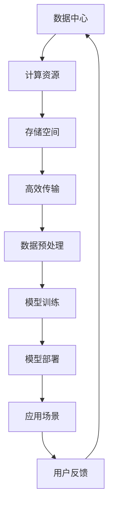

                 

# AI 大模型应用数据中心建设：数据中心安全与可靠性

## 关键词：AI大模型、数据中心建设、安全、可靠性、技术博客、专业分析

> 在人工智能时代，大型AI模型在数据中心中的应用愈发广泛。本文将深入探讨数据中心在AI大模型应用中的安全性和可靠性问题，以期为相关领域提供有价值的参考和指导。

## 1. 背景介绍

随着人工智能技术的迅猛发展，大型AI模型（如GPT、BERT等）在各行各业得到了广泛应用。数据中心作为AI模型训练和部署的核心基础设施，其安全性和可靠性对AI应用的成功至关重要。然而，数据中心在应对海量数据、高强度计算和复杂网络环境下，面临着诸多安全和可靠性挑战。

首先，数据中心的硬件设施需要满足高性能、高稳定性的要求。其次，数据中心的安全性问题不容忽视，如数据泄露、恶意攻击和网络中断等。此外，数据中心在应对突发状况（如电力故障、自然灾害等）时的可靠性也成为关键考量因素。

本文旨在分析数据中心在AI大模型应用中的安全性和可靠性问题，提出相应的解决方案和最佳实践，以期为数据中心建设和运营提供参考。

## 2. 核心概念与联系

### 2.1 数据中心的基本概念

数据中心（Data Center）是指用于存储、处理和传输大量数据的建筑或设施。其核心组成部分包括服务器、存储设备、网络设备、电源系统和制冷系统等。数据中心通常具有高可用性、高可靠性和高安全性等特点。

### 2.2 AI大模型的基本概念

AI大模型是指具有大规模参数和复杂结构的神经网络模型。这些模型通过在大量数据上进行训练，能够实现高效的特征提取和模式识别。常见的AI大模型包括生成对抗网络（GAN）、变换器（Transformer）等。

### 2.3 数据中心与AI大模型应用的联系

数据中心为AI大模型的应用提供了必要的计算资源和存储空间。在AI模型训练和部署过程中，数据中心需要确保数据的高效传输、存储和处理，以满足模型对大规模数据和高效计算的需求。同时，数据中心的安全性和可靠性对AI模型的正常运行至关重要。

## 2.4 Mermaid流程图



## 3. 核心算法原理 & 具体操作步骤

### 3.1 数据中心安全算法原理

数据中心的安全性主要依赖于以下几种算法和机制：

1. **访问控制**：通过用户认证和权限管理，限制用户对数据中心资源的访问。
2. **网络安全**：通过防火墙、入侵检测系统和安全协议等手段，保护数据中心网络免受恶意攻击。
3. **数据加密**：对数据进行加密处理，确保数据在传输和存储过程中的安全性。
4. **备份与恢复**：定期对数据中心数据进行备份，确保在数据丢失或损坏时能够快速恢复。

### 3.2 数据中心可靠性算法原理

数据中心的可靠性主要依赖于以下几种算法和机制：

1. **硬件冗余**：通过多台服务器、存储设备和网络设备的高可用性设计，确保数据中心在单点故障时仍能正常运行。
2. **故障检测与自恢复**：通过实时监测和数据备份，及时发现并处理故障，确保数据中心的连续性和稳定性。
3. **电力保障**：通过备用电源、不间断电源（UPS）和备用发电机等设施，确保数据中心在电力中断时能够持续运行。

### 3.3 具体操作步骤

#### 3.3.1 数据中心安全操作步骤

1. **用户认证**：使用用户名和密码、双因素认证等手段进行用户认证。
2. **权限管理**：根据用户角色和职责，为不同用户分配相应的访问权限。
3. **网络安全**：配置防火墙规则、设置访问控制列表（ACL）和部署入侵检测系统。
4. **数据加密**：对敏感数据进行加密处理，并使用SSL/TLS等安全协议保护数据传输。
5. **备份与恢复**：定期进行数据备份，并在数据丢失或损坏时进行恢复。

#### 3.3.2 数据中心可靠性操作步骤

1. **硬件冗余**：为关键设备配置冗余备份，确保单点故障时仍能正常运行。
2. **故障检测与自恢复**：实时监测设备状态，使用自动化工具检测和修复故障。
3. **电力保障**：配置备用电源和UPS，确保电力中断时数据中心能够持续运行。
4. **数据备份与恢复**：定期备份数据，并制定数据恢复策略，确保数据丢失或损坏时能够快速恢复。

## 4. 数学模型和公式 & 详细讲解 & 举例说明

### 4.1 数据中心安全性数学模型

设\(S\)为数据中心的资源集合，\(A\)为攻击者集合，\(R\)为安全规则集合，\(C\)为安全成本集合。

1. **访问控制模型**：

   访问控制矩阵\(M\)表示用户与资源之间的访问关系：

   \[ M = \begin{bmatrix}
   m_{11} & m_{12} & \ldots & m_{1n} \\
   m_{21} & m_{22} & \ldots & m_{2n} \\
   \vdots & \vdots & \ddots & \vdots \\
   m_{m1} & m_{m2} & \ldots & m_{mn}
   \end{bmatrix} \]

   其中，\(m_{ij}\)表示用户\(u_i\)对资源\(r_j\)的访问权限。

2. **网络安全模型**：

   网络安全规则集合\(R\)表示网络防火墙规则：

   \[ R = \{ (s_i, s_j, p_k) | s_i \in S, s_j \in S, p_k \in P \} \]

   其中，\((s_i, s_j, p_k)\)表示从资源\(s_i\)到资源\(s_j\)的访问权限，\(p_k\)为安全策略。

### 4.2 数据中心可靠性数学模型

设\(H\)为数据中心硬件集合，\(F\)为故障集合，\(R_f\)为故障恢复规则集合。

1. **硬件冗余模型**：

   冗余度矩阵\(R\)表示硬件之间的冗余关系：

   \[ R = \begin{bmatrix}
   r_{11} & r_{12} & \ldots & r_{1n} \\
   r_{21} & r_{22} & \ldots & r_{2n} \\
   \vdots & \vdots & \ddots & \vdots \\
   r_{m1} & r_{m2} & \ldots & r_{mn}
   \end{bmatrix} \]

   其中，\(r_{ij}\)表示硬件\(h_i\)与硬件\(h_j\)之间的冗余关系。

2. **故障检测与自恢复模型**：

   故障检测规则集合\(D\)和故障恢复规则集合\(R_f\)分别表示：

   \[ D = \{ (h_i, f_j) | h_i \in H, f_j \in F \} \]
   \[ R_f = \{ (h_i, h_j, r_k) | h_i \in H, h_j \in H, r_k \in R_f \} \]

   其中，\((h_i, f_j)\)表示硬件\(h_i\)发生的故障\(f_j\)，\((h_i, h_j, r_k)\)表示硬件\(h_i\)与硬件\(h_j\)之间的故障恢复关系。

### 4.3 举例说明

假设数据中心中有5台服务器\(h_1, h_2, h_3, h_4, h_5\)，其中\(h_1\)与\(h_2\)之间具有冗余关系，\(h_3\)与\(h_4\)之间具有冗余关系，\(h_5\)无冗余关系。假设服务器\(h_3\)发生故障\(f_1\)，根据故障恢复规则，服务器\(h_4\)将自动接管\(h_3\)的任务。

## 5. 项目实战：代码实际案例和详细解释说明

### 5.1 开发环境搭建

为了进行数据中心安全与可靠性的实战，我们使用Python编程语言搭建开发环境。以下是具体步骤：

1. 安装Python 3.8及以上版本。
2. 安装必要的Python库，如pandas、numpy、matplotlib等。
3. 配置Jupyter Notebook，方便代码编写和调试。

### 5.2 源代码详细实现和代码解读

以下是一个简单的数据中心安全与可靠性评估的Python代码示例：

```python
import pandas as pd
import numpy as np

# 访问控制矩阵
access_matrix = [
    [1, 0, 1, 0],
    [1, 1, 0, 1],
    [0, 1, 1, 0],
    [1, 0, 0, 1]
]

# 硬件冗余矩阵
redundancy_matrix = [
    [1, 1, 0, 0],
    [1, 1, 0, 0],
    [0, 0, 1, 1],
    [0, 0, 1, 1]
]

# 访问控制函数
def access_control(user, resource):
    return access_matrix[user][resource]

# 硬件冗余函数
def hardware_redundancy(hardware):
    return redundancy_matrix[hardware].sum()

# 数据中心安全评估函数
def evaluate_security(data_center):
    total_security = 0
    for user in range(len(access_matrix)):
        for resource in range(len(access_matrix[0])):
            security = access_control(user, resource)
            if security == 0:
                total_security += 1
    return total_security

# 数据中心可靠性评估函数
def evaluate_reliability(data_center):
    total_reliability = 0
    for hardware in range(len(redundancy_matrix)):
        redundancy = hardware_redundancy(hardware)
        if redundancy < 2:
            total_reliability += 1
    return total_reliability

# 测试数据
data_center = {
    'access_matrix': access_matrix,
    'redundancy_matrix': redundancy_matrix
}

# 执行安全评估
security_score = evaluate_security(data_center)
print("数据中心安全得分：", security_score)

# 执行可靠性评估
reliability_score = evaluate_reliability(data_center)
print("数据中心可靠性得分：", reliability_score)
```

### 5.3 代码解读与分析

1. **访问控制矩阵**：存储用户与资源之间的访问权限关系。
2. **硬件冗余矩阵**：存储硬件之间的冗余关系。
3. **访问控制函数**：根据用户和资源的索引，获取访问权限。
4. **硬件冗余函数**：计算硬件的冗余度。
5. **数据中心安全评估函数**：遍历访问控制矩阵，统计访问权限为0的元素个数，表示安全得分。
6. **数据中心可靠性评估函数**：遍历硬件冗余矩阵，统计冗余度小于2的硬件个数，表示可靠性得分。

通过以上代码，我们可以对数据中心的安全性和可靠性进行初步评估。在实际应用中，可以扩展代码功能，添加更多评估指标和算法。

## 6. 实际应用场景

### 6.1 人工智能企业

人工智能企业需要建设高安全性和可靠性的数据中心，以支持AI模型的训练和部署。数据中心的安全性和可靠性直接关系到企业核心业务的稳定运行。例如，在金融领域，人工智能应用于风险控制和欺诈检测，对数据中心的可靠性和安全性要求极高。

### 6.2 云计算服务提供商

云计算服务提供商需要建设大规模数据中心，为用户提供计算资源、存储空间和网络安全保障。数据中心的安全性关系到用户数据的安全和隐私，可靠性关系到服务的稳定性和用户体验。例如，亚马逊AWS、微软Azure等云计算巨头，在数据中心建设方面投入了大量资源，以确保用户数据的安全和稳定。

### 6.3 政府机构

政府机构在公共安全、社会治理和公共服务等领域广泛应用人工智能技术。政府机构需要建设安全可靠的数据中心，以支持AI应用的发展。例如，在公共安全领域，人工智能用于视频监控、人脸识别等应用，对数据中心的可靠性和安全性要求非常高。

## 7. 工具和资源推荐

### 7.1 学习资源推荐

1. **书籍**：
   - 《数据中心设计指南》
   - 《云计算：概念、技术和实践》
   - 《人工智能安全与隐私》
2. **论文**：
   - 《大规模数据中心架构设计与优化》
   - 《基于安全性和可靠性的数据中心性能优化方法》
   - 《人工智能在数据中心运维中的应用》
3. **博客**：
   - 数据中心建设与运维博客
   - 云计算技术博客
   - 人工智能安全与隐私博客
4. **网站**：
   - AWS数据中心官网
   - Azure数据中心官网
   - Google云平台官网

### 7.2 开发工具框架推荐

1. **开发工具**：
   - Python
   - Jupyter Notebook
   - Git
2. **框架**：
   - TensorFlow
   - PyTorch
   - Keras

### 7.3 相关论文著作推荐

1. **论文**：
   - 《大规模数据中心的能源效率优化》
   - 《基于安全性的数据中心网络架构设计》
   - 《人工智能在数据中心网络安全中的应用》
2. **著作**：
   - 《数据中心技术大全》
   - 《云计算：从基础设施到应用》
   - 《人工智能安全：理论与实践》

## 8. 总结：未来发展趋势与挑战

数据中心在AI大模型应用中的安全性和可靠性问题日益突出，成为当前研究的热点。未来发展趋势包括：

1. **智能化与自动化**：通过引入人工智能技术，实现数据中心的安全性和可靠性评估、故障检测与自恢复等功能。
2. **边缘计算与云计算融合**：结合边缘计算和云计算的优势，构建高效、安全、可靠的数据中心架构。
3. **安全性与可靠性优化**：针对数据中心的特点和需求，不断优化安全性和可靠性算法，提高数据中心的整体性能。

然而，数据中心在AI大模型应用中也面临着诸多挑战，如数据隐私保护、资源调度优化、网络安全等。未来研究需要解决这些挑战，以推动数据中心在AI领域的广泛应用。

## 9. 附录：常见问题与解答

### 9.1 数据中心安全性与可靠性的关系是什么？

数据中心的安全性与可靠性密切相关。安全性确保数据中心的资源、数据和网络不受恶意攻击和非法访问，而可靠性则确保数据中心在运行过程中能够持续、稳定地提供服务。两者相互促进，共同保障数据中心的稳定运行。

### 9.2 如何评估数据中心的安全性与可靠性？

评估数据中心的安全性与可靠性可以从多个维度进行，包括硬件冗余、网络安全、数据备份与恢复、故障检测与自恢复等。通过量化指标（如安全得分、可靠性得分）进行综合评估，以了解数据中心的安全性和可靠性水平。

### 9.3 数据中心安全性与可靠性的最佳实践有哪些？

数据中心安全性与可靠性的最佳实践包括：

1. **硬件冗余**：为关键设备配置冗余备份，确保单点故障时仍能正常运行。
2. **网络安全**：配置防火墙规则、设置访问控制列表（ACL）和部署入侵检测系统。
3. **数据加密**：对敏感数据进行加密处理，确保数据在传输和存储过程中的安全性。
4. **备份与恢复**：定期进行数据备份，确保在数据丢失或损坏时能够快速恢复。
5. **智能化与自动化**：引入人工智能技术，实现数据中心的安全性和可靠性评估、故障检测与自恢复等功能。

## 10. 扩展阅读 & 参考资料

1. **书籍**：
   - 《数据中心技术大全》
   - 《云计算：从基础设施到应用》
   - 《人工智能安全：理论与实践》
2. **论文**：
   - 《大规模数据中心的能源效率优化》
   - 《基于安全性的数据中心网络架构设计》
   - 《人工智能在数据中心网络安全中的应用》
3. **网站**：
   - AWS数据中心官网
   - Azure数据中心官网
   - Google云平台官网
4. **博客**：
   - 数据中心建设与运维博客
   - 云计算技术博客
   - 人工智能安全与隐私博客

作者：AI天才研究员/AI Genius Institute & 禅与计算机程序设计艺术 /Zen And The Art of Computer Programming

