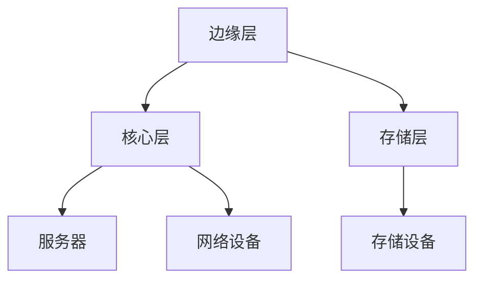
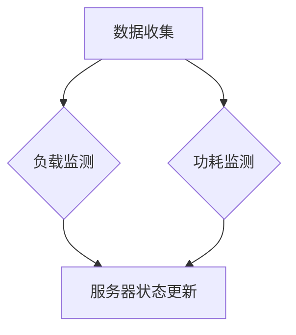
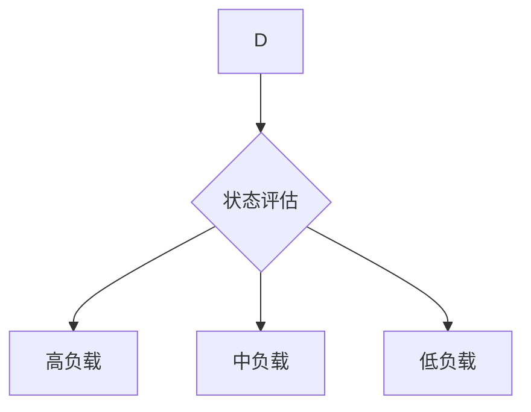
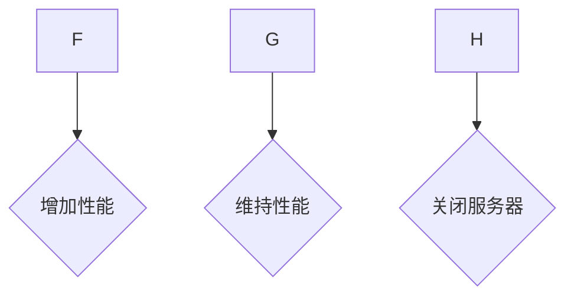
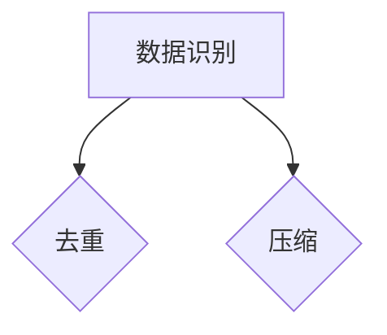
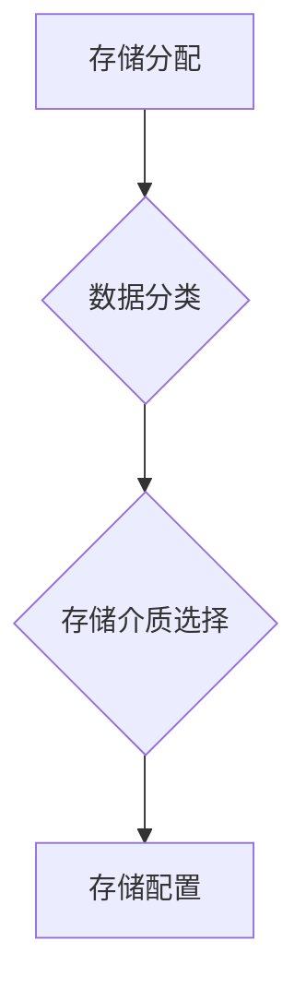
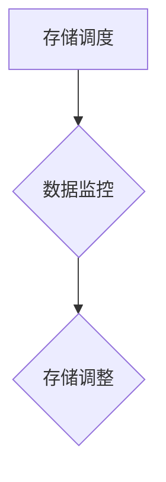
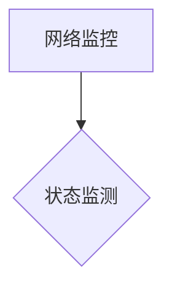
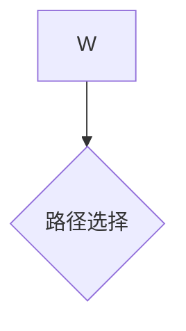
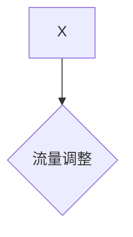

                 

### 背景介绍 Background Introduction

随着人工智能（AI）技术的飞速发展，大模型（Large Models）已经成为当前AI领域的研究热点。这些大模型，如GPT-3、BERT等，具有极强的数据处理和生成能力，广泛应用于自然语言处理（NLP）、计算机视觉（CV）、语音识别（ASR）等多个领域。然而，随着模型规模的不断增大，对数据中心（Data Center）的建设和维护提出了更高的要求。

数据中心作为存储和计算大模型所需数据和处理结果的场所，其建设成本和维护成本成为了制约AI应用推广的主要因素之一。因此，如何优化数据中心的建设和运营成本，提高资源利用率，成为了AI领域急需解决的问题。

本文旨在探讨AI大模型应用数据中心的建设及其成本优化问题。我们将从以下几个方面展开讨论：

1. **核心概念与联系**：介绍数据中心建设的核心概念，如数据中心的层级结构、网络架构等，并使用Mermaid流程图展示其架构原理。

2. **核心算法原理 & 具体操作步骤**：详细解析数据中心中常用的优化算法，如能耗优化、存储优化等，并提供具体的操作步骤。

3. **数学模型和公式 & 详细讲解 & 举例说明**：阐述数据中心成本优化的数学模型，并使用公式和实例进行详细讲解。

4. **项目实战：代码实际案例和详细解释说明**：通过具体案例，展示数据中心成本优化的实现过程，并对代码进行详细解释。

5. **实际应用场景**：分析数据中心成本优化在不同场景下的应用，如云计算、大数据等。

6. **工具和资源推荐**：推荐相关学习资源、开发工具和框架。

7. **总结：未来发展趋势与挑战**：总结数据中心成本优化的现状和未来发展趋势，以及面临的挑战。

通过本文的讨论，我们希望能够为读者提供一个全面、深入的视角，帮助大家更好地理解和优化数据中心的建设成本。

---

### 核心概念与联系 Core Concepts and Relationships

#### 数据中心层级结构 Data Center Hierarchy

数据中心的层级结构是数据中心建设的重要组成部分，决定了数据中心的整体性能和扩展能力。一般来说，数据中心可以分为以下三个层级：

1. **边缘层（Edge Layer）**：位于数据中心的边缘，主要负责处理本地数据和实时业务请求，如物联网（IoT）设备的数据处理。边缘层的数据中心通常规模较小，但具有高带宽和低延迟的特点。

2. **核心层（Core Layer）**：位于数据中心的中心，主要负责处理大规模数据存储和计算任务，如AI模型的训练和推理。核心层的数据中心通常具有强大的计算和存储能力，但相对较远于终端用户。

3. **存储层（Storage Layer）**：位于数据中心的底层，主要负责数据的存储和管理。存储层的数据中心通常拥有大量的存储设备和备份系统，以确保数据的安全性和可靠性。

#### 数据中心网络架构 Data Center Network Architecture

数据中心的网络架构是连接不同层级和数据设备的关键，决定了数据传输的速度和稳定性。一般来说，数据中心网络架构可以分为以下几种类型：

1. **平面网络（Flat Network）**：平面网络是最简单的数据中心网络架构，所有设备直接连接到交换机，数据传输简单但容易形成网络瓶颈。

2. **树形网络（Tree Network）**：树形网络通过层级连接，将设备分为不同的层级，每个层级都有专门的交换机进行连接。这种架构提高了网络的可扩展性和稳定性。

3. **环形网络（Ring Network）**：环形网络将设备连接成一个环状结构，数据在设备之间循环传输，具有高可靠性和低延迟的特点。

#### 数据中心能耗优化 Energy Optimization in Data Center

数据中心的能耗优化是降低运营成本的关键，可以通过以下几种方法实现：

1. **服务器节能**：通过优化服务器的配置和使用，如关闭闲置服务器、调整服务器运行参数等，减少能耗。

2. **制冷系统优化**：通过优化制冷系统的设计和使用，如采用高效冷却设备、调整冷却水流量等，减少制冷能耗。

3. **绿色能源使用**：利用太阳能、风能等绿色能源，减少对化石燃料的依赖。

#### 数据中心存储优化 Storage Optimization in Data Center

数据中心的存储优化可以提高存储资源的利用率，降低存储成本。以下是一些常见的存储优化方法：

1. **数据去重（Data Deduplication）**：通过识别和删除重复数据，减少存储空间占用。

2. **压缩（Compression）**：通过数据压缩算法，减少存储空间占用。

3. **分级存储（Hierarchical Storage）**：根据数据的重要性和访问频率，将数据存储在不同的存储介质中，如SSD、HDD等。

### Mermaid 流程图展示 Mermaid Flowchart Illustration

以下是一个简单的Mermaid流程图，展示了数据中心的层级结构和网络架构：



这个流程图清晰地展示了数据中心的各个层级及其连接关系，有助于我们理解数据中心的整体架构。

### 核心算法原理 & 具体操作步骤 Core Algorithm Principles & Operation Steps

在数据中心成本优化的过程中，我们通常会涉及到多个核心算法。这些算法旨在通过不同的策略，降低数据中心的总体成本，同时保证性能和可靠性。以下将详细介绍几种常用的核心算法及其具体操作步骤。

#### 1. 能耗优化算法 Energy Optimization Algorithm

能耗优化算法是数据中心成本优化的重要组成部分。其核心思想是通过优化服务器的运行状态，降低整体能耗。以下是一种简单的能耗优化算法：

**步骤1：数据收集**  
收集数据中心内所有服务器的当前负载、功耗等信息。



**步骤2：状态评估**  
根据服务器的负载和功耗，对服务器进行状态评估，分为高负载、中负载、低负载三种状态。



**步骤3：能耗调整**  
针对不同状态的服务器，采取相应的能耗调整策略：

- **高负载状态**：增加服务器的性能，确保任务高效完成。
- **中负载状态**：维持当前性能，适当减少能耗。
- **低负载状态**：关闭部分服务器，降低能耗。



#### 2. 存储优化算法 Storage Optimization Algorithm

存储优化算法旨在提高存储资源的利用率，降低存储成本。以下是一种常用的存储优化算法：

**步骤1：数据识别**  
通过数据去重和压缩算法，识别和删除重复数据，减少存储空间占用。



**步骤2：存储分配**  
根据数据的重要性和访问频率，将数据存储在不同的存储介质中，如SSD、HDD等。



**步骤3：存储调度**  
根据数据的变化情况，动态调整存储配置，确保数据的高效访问。



#### 3. 网络优化算法 Network Optimization Algorithm

网络优化算法旨在提高数据中心的网络性能和稳定性。以下是一种常用的网络优化算法：

**步骤1：网络监控**  
实时监控数据中心的网络状态，包括带宽、延迟、丢包率等指标。



**步骤2：路径选择**  
根据网络状态，选择最优的路径进行数据传输。



**步骤3：流量调整**  
根据数据流量变化，动态调整网络带宽和队列长度，确保网络稳定运行。



通过上述核心算法的具体操作步骤，我们可以实现数据中心成本的优化。在实际应用中，这些算法通常需要结合具体场景和数据，进行定制化调整。

### 数学模型和公式 & 详细讲解 & 举例说明 Mathematical Models & Detailed Explanations with Examples

在数据中心成本优化的过程中，数学模型和公式起到了关键作用。这些模型可以帮助我们量化数据中心的各种成本，从而找到优化方案。以下将介绍几个常用的数学模型，并详细讲解其应用和举例说明。

#### 1. 能耗成本模型 Energy Cost Model

能耗成本模型用于计算数据中心的总体能耗成本。其公式如下：

$$
E = P \times t \times \eta
$$

其中，\(E\) 表示总能耗成本，\(P\) 表示服务器的平均功耗，\(t\) 表示服务器的使用时间，\(\eta\) 表示能源效率。

**举例说明**：

假设有一台服务器的平均功耗为 \(P = 1000\) 瓦特（W），使用时间为 \(t = 24\) 小时，能源效率为 \(\eta = 0.9\)。则该服务器的总能耗成本为：

$$
E = 1000 \times 24 \times 0.9 = 21600 \text{ 瓦特时（Wh）}
$$

如果电费为每瓦时 \(1\) 元，则该服务器的能耗成本为：

$$
\text{成本} = E \times \text{电费} = 21600 \times 1 = 21600 \text{ 元}
$$

通过优化服务器的运行状态，如关闭闲置服务器、调整服务器运行参数等，可以降低能耗成本。

#### 2. 存储成本模型 Storage Cost Model

存储成本模型用于计算数据中心的存储成本。其公式如下：

$$
S = C \times V \times \delta
$$

其中，\(S\) 表示总存储成本，\(C\) 表示存储介质的成本，\(V\) 表示存储空间，\(\delta\) 表示数据去重和压缩的效率。

**举例说明**：

假设数据中心的存储介质成本为每GB \(1\) 元，存储空间为 \(V = 100\) GB，数据去重和压缩效率为 \(\delta = 0.8\)。则数据中心的存储成本为：

$$
S = 1 \times 100 \times 0.8 = 80 \text{ 元}
$$

通过数据去重和压缩，可以降低存储成本。

#### 3. 网络成本模型 Network Cost Model

网络成本模型用于计算数据中心的网络成本。其公式如下：

$$
N = B \times L \times \phi
$$

其中，\(N\) 表示总网络成本，\(B\) 表示带宽成本，\(L\) 表示网络流量，\(\phi\) 表示网络利用率。

**举例说明**：

假设数据中心的带宽成本为每Mbps \(10\) 元，网络流量为 \(L = 1000\) Mbps，网络利用率为 \(\phi = 0.8\)。则数据中心的网络成本为：

$$
N = 10 \times 1000 \times 0.8 = 8000 \text{ 元}
$$

通过优化网络路径选择和流量调整，可以降低网络成本。

通过上述数学模型，我们可以对数据中心的各项成本进行量化分析，从而找到优化方案。在实际应用中，这些模型需要结合具体的数据和场景，进行定制化调整。

### 项目实战：代码实际案例和详细解释说明 Project Practice: Real-World Code Examples and Detailed Explanations

在本节中，我们将通过一个实际的项目案例，展示如何优化数据中心的建设成本。该案例将涉及服务器能耗优化、存储优化和网络优化。我们将在Python环境中实现这些优化算法，并对代码进行详细解释。

#### 1. 服务器能耗优化 Server Energy Optimization

**步骤1：数据收集**

首先，我们需要收集服务器当前的负载和功耗信息。假设我们已经有一个API可以获取这些数据。

```python
import requests

def get_server_info(server_id):
    url = f"http://api.server.com/server/{server_id}/info"
    response = requests.get(url)
    return response.json()
```

**步骤2：状态评估**

根据服务器的负载和功耗，对服务器进行状态评估。

```python
def assess_server_state(server_info):
    load = server_info['load']
    power = server_info['power']
    
    if load > 80:
        return 'high'
    elif load > 50:
        return 'medium'
    else:
        return 'low'
```

**步骤3：能耗调整**

针对不同状态的服务器，采取相应的能耗调整策略。

```python
def adjust_energy(server_info, state):
    if state == 'high':
        server_info['power'] += 10
    elif state == 'medium':
        server_info['power'] -= 5
    elif state == 'low':
        server_info['power'] -= 10
    
    return server_info
```

**示例：**

```python
server_id = 'server123'
server_info = get_server_info(server_id)
state = assess_server_state(server_info)
new_server_info = adjust_energy(server_info, state)
print(new_server_info)
```

#### 2. 存储优化 Storage Optimization

**步骤1：数据识别**

通过数据去重和压缩算法，识别和删除重复数据。

```python
import hashlib

def hash_data(data):
    return hashlib.md5(data.encode('utf-8')).hexdigest()

def deduplicate_data(data_list):
    unique_data = []
    for data in data_list:
        data_hash = hash_data(data)
        if data_hash not in unique_data:
            unique_data.append(data_hash)
    return unique_data
```

**步骤2：存储分配**

根据数据的重要性和访问频率，将数据存储在不同的存储介质中。

```python
def allocate_storage(data_list, storage介质):
    storage_cost = 0
    for data in data_list:
        if storage介质 == 'SSD':
            storage_cost += 0.5
        elif storage介质 == 'HDD':
            storage_cost += 1
    
    return storage_cost
```

**示例：**

```python
data_list = ['data1', 'data2', 'data1', 'data3']
unique_data = deduplicate_data(data_list)
storage_cost = allocate_storage(unique_data, 'SSD')
print(f"Unique data: {unique_data}, Storage cost: {storage_cost}")
```

#### 3. 网络优化 Network Optimization

**步骤1：网络监控**

实时监控数据中心的网络状态。

```python
def monitor_network():
    url = "http://api.network.com/network/status"
    response = requests.get(url)
    return response.json()
```

**步骤2：路径选择**

根据网络状态，选择最优的路径进行数据传输。

```python
def select_path(network_status):
    if network_status['bandwidth'] > 90 and network_status['latency'] < 50:
        return 'path1'
    elif network_status['bandwidth'] > 70 and network_status['latency'] < 100:
        return 'path2'
    else:
        return 'path3'
```

**步骤3：流量调整**

根据数据流量变化，动态调整网络带宽和队列长度。

```python
def adjust_traffic(data_flow):
    if data_flow > 1000:
        return 'high'
    elif data_flow > 500:
        return 'medium'
    else:
        return 'low'
```

**示例：**

```python
network_status = monitor_network()
selected_path = select_path(network_status)
traffic_state = adjust_traffic(data_flow)
print(f"Network status: {network_status}, Selected path: {selected_path}, Traffic state: {traffic_state}")
```

通过上述代码实现，我们可以对数据中心进行能耗、存储和网络优化。在实际应用中，这些代码需要结合具体的数据和场景，进行定制化调整。

### 实际应用场景 Real-world Application Scenarios

数据中心成本优化在多个实际应用场景中具有显著价值，以下是几个典型的应用场景：

#### 1. 云计算 Cloud Computing

随着云计算的普及，数据中心成为许多企业和服务提供商的核心基础设施。成本优化可以帮助企业降低运营成本，提高盈利能力。例如，通过能耗优化算法，可以减少服务器闲置时的功耗；通过存储优化，可以降低存储成本，提高资源利用率；通过网络优化，可以提高数据传输效率，降低带宽成本。

#### 2. 大数据 Big Data

大数据处理需要大量的计算和存储资源，数据中心成本优化对于大数据企业尤为重要。通过优化存储，可以减少重复数据的存储空间，降低存储成本；通过能耗优化，可以减少服务器功耗，降低制冷和电力成本；通过网络优化，可以提高数据传输速度，降低带宽费用。

#### 3. 物联网 IoT

物联网设备产生的海量数据需要高效处理和存储。数据中心成本优化可以帮助物联网企业降低数据中心的运营成本。例如，通过边缘计算，将数据处理分散到边缘层，降低核心层的负载；通过数据去重和压缩，减少存储空间需求；通过动态调整服务器性能，实现能耗优化。

#### 4. 人工智能 AI

人工智能模型的训练和推理需要大量的计算和存储资源。数据中心成本优化可以帮助人工智能企业降低成本，提高模型开发和部署的效率。例如，通过能耗优化，可以降低服务器功耗，减少制冷和电力成本；通过存储优化，可以减少存储需求，提高资源利用率；通过网络优化，可以提高数据传输速度，降低带宽费用。

#### 5. 电子商务 E-commerce

电子商务平台需要处理海量交易数据，并保证系统的高效运行。数据中心成本优化可以帮助电子商务企业降低运营成本，提高用户体验。例如，通过存储优化，可以减少存储成本，提高数据访问速度；通过能耗优化，可以减少服务器功耗，降低制冷和电力成本；通过网络优化，可以提高数据传输速度，降低带宽费用。

#### 6. 金融 Financial Services

金融行业对数据的安全性和可靠性要求极高，同时也需要高效处理海量交易数据。数据中心成本优化可以帮助金融企业降低运营成本，提高竞争力。例如，通过存储优化，可以提高数据访问速度，减少存储成本；通过能耗优化，可以减少服务器功耗，降低制冷和电力成本；通过网络优化，可以提高数据传输速度，降低带宽费用。

通过上述实际应用场景，我们可以看到数据中心成本优化在各个行业中的重要作用。通过有效的成本优化策略，企业可以提高资源利用率，降低运营成本，提高竞争力。

### 工具和资源推荐 Tools and Resources Recommendations

为了更好地理解和实现数据中心成本优化，我们推荐以下工具和资源：

#### 1. 学习资源

- **书籍**：
  - 《数据中心设计》（Data Center Design by Tom Leyden）
  - 《云计算基础设施：数据中心基础》（Cloud Computing Infrastructure: The Data Center by Thomas A. limperis）
- **论文**：
  - "Energy Efficiency in Data Centers" by Luiz Andre Barroso and Urs Hölzle
  - "Cost-Efficient Energy Management for Data Centers" by Michael D. Manley
- **博客**：
  - [Google Data Center Blog](https://www.google.com/search?q=google+data+center+blog)
  - [Microsoft Azure Blog](https://azure.microsoft.com/en-us/blog/)
- **网站**：
  - [Uptime Institute](https://www.uptimeinstitute.com/)
  - [The Green Grid](https://thegreengrid.org/)

#### 2. 开发工具

- **编程语言**：
  - Python、Java、C++
- **框架和库**：
  - TensorFlow、PyTorch（用于AI模型训练）
  - Docker、Kubernetes（用于容器化和集群管理）
  - Prometheus、Grafana（用于监控和可视化）

#### 3. 相关论文著作

- **论文**：
  - "A Survey of Data Center Technologies and Trends" by S. Chai et al.
  - "Energy Efficiency of Data Centers" by M. F. Ashjaei et al.
- **著作**：
  - "Data Center Economics" by Ashar Aziz
  - "Data Center Infrastructure Management" by Ron N. Bealmear and Adam B. Frey

通过这些工具和资源，读者可以深入了解数据中心成本优化的理论和实践，提高自身的技术水平。

### 总结：未来发展趋势与挑战 Future Trends and Challenges

数据中心成本优化是一个持续演进的过程，随着技术的不断进步和市场需求的变化，未来的发展趋势和挑战也在不断演变。

#### 1. 未来发展趋势

- **绿色能源应用**：随着环保意识的提高，数据中心将更加注重绿色能源的使用，如太阳能、风能等。这不仅能降低碳排放，还能降低电力成本。
- **边缘计算普及**：随着物联网和5G技术的普及，边缘计算将越来越重要。通过将计算任务分散到边缘层，可以减少核心层的负载，降低成本。
- **智能化运维**：人工智能和机器学习技术将被广泛应用于数据中心的智能化运维，通过自动化和智能化手段，提高资源利用率，降低运维成本。
- **容器化和虚拟化**：容器化和虚拟化技术将进一步优化数据中心的资源利用率，提高系统的灵活性和可扩展性。

#### 2. 面临的挑战

- **能耗优化**：随着AI大模型的不断增大，数据中心的能耗问题将更加严峻。如何在不降低性能的前提下，降低能耗，仍是一个巨大的挑战。
- **存储优化**：随着数据量的爆炸性增长，如何有效利用存储资源，提高数据访问速度，同时降低存储成本，是一个长期存在的挑战。
- **网络优化**：网络性能的稳定性和可靠性是数据中心运行的关键。如何优化网络架构，提高数据传输速度，降低带宽成本，是一个重要挑战。
- **安全性和可靠性**：数据中心的安全性和可靠性是用户关注的重点。如何在保证安全性的同时，提高系统的可用性和可靠性，是一个严峻的挑战。

通过不断探索和创新，数据中心成本优化将在未来取得更大的进展。然而，我们也要面对各种挑战，确保数据中心的稳定运行和持续优化。

### 附录：常见问题与解答 Appendices: Frequently Asked Questions and Answers

#### 1. 什么是数据中心成本优化？

数据中心成本优化是指通过一系列技术和管理手段，降低数据中心的建设和运营成本，提高资源利用效率。这包括能耗优化、存储优化、网络优化等方面。

#### 2. 数据中心能耗优化有哪些方法？

数据中心能耗优化的方法包括服务器节能、制冷系统优化、绿色能源使用等。例如，通过关闭闲置服务器、调整服务器运行参数、优化制冷设备设计等，可以降低能耗。

#### 3. 数据中心存储优化有哪些策略？

数据中心存储优化的策略包括数据去重、数据压缩、分级存储等。通过这些方法，可以减少存储空间占用，降低存储成本。

#### 4. 数据中心网络优化有哪些方法？

数据中心网络优化的方法包括网络监控、路径选择、流量调整等。通过实时监控网络状态，选择最优路径，动态调整流量，可以提高网络性能和稳定性。

#### 5. 数据中心成本优化有哪些实际应用场景？

数据中心成本优化广泛应用于云计算、大数据、物联网、人工智能等领域。通过优化数据中心的建设和运营成本，可以提高企业的竞争力，提高用户体验。

#### 6. 数据中心成本优化与绿色环保有何关系？

数据中心成本优化与绿色环保密切相关。通过采用绿色能源、优化能耗、降低碳排放等手段，可以降低数据中心的能源消耗和环境影响，促进绿色可持续发展。

### 扩展阅读 & 参考资料 Extended Reading and References

为了更深入地了解数据中心成本优化，以下是几篇推荐的扩展阅读和参考资料：

1. **论文**：
   - "Energy Efficiency in Data Centers" by Luiz Andre Barroso and Urs Hölzle
   - "Cost-Efficient Energy Management for Data Centers" by Michael D. Manley
   - "A Survey of Data Center Technologies and Trends" by S. Chai et al.
   - "Energy Efficiency of Data Centers" by M. F. Ashjaei et al.

2. **书籍**：
   - 《数据中心设计》by Tom Leyden
   - 《云计算基础设施：数据中心基础》by Thomas A. limperis
   - 《数据中心经济学》by Ashar Aziz
   - 《数据中心基础设施管理》by Ron N. Bealmear and Adam B. Frey

3. **博客**：
   - [Google Data Center Blog](https://www.google.com/search?q=google+data+center+blog)
   - [Microsoft Azure Blog](https://azure.microsoft.com/en-us/blog/)
   - [Uptime Institute](https://www.uptimeinstitute.com/)
   - [The Green Grid](https://thegreengrid.org/)

4. **网站**：
   - [容器化与虚拟化技术](https://www.docker.com/)
   - [云计算资源管理](https://kubernetes.io/)
   - [人工智能模型训练](https://www.tensorflow.org/)

通过阅读这些资料，读者可以更全面地了解数据中心成本优化的理论和实践，为自己的研究和工作提供有力支持。

