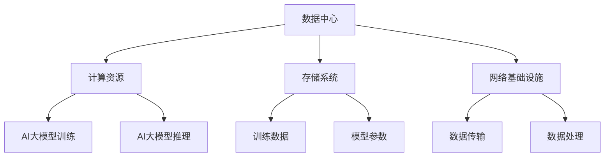

                 

# AI 大模型应用数据中心建设：数据中心技术创新

## 概述与背景

### 关键词：数据中心，AI大模型，技术创新，效率优化

数据中心作为现代信息技术的基础设施，承载着全球企业、组织和个人对数据存储、处理和访问的巨大需求。随着人工智能（AI）技术的迅猛发展，尤其是大模型的兴起，数据中心的角色和功能正经历深刻的变革。AI大模型，如GPT-3、BERT等，对计算资源、存储容量和网络传输提出了前所未有的高要求，这促使数据中心技术不断创新，以适应这一新兴需求。

本文旨在探讨AI大模型应用对数据中心建设的驱动因素，以及数据中心在技术创新方面所做的努力。我们将从以下几个方面展开讨论：

1. **背景介绍**：回顾数据中心的发展历程，了解数据中心在AI时代面临的挑战。
2. **核心概念与联系**：介绍AI大模型的基本概念和数据中心的结构。
3. **核心算法原理**：解析AI大模型的核心算法和其运作机制。
4. **数学模型和公式**：探讨支持AI大模型运行的数学模型和公式。
5. **项目实战**：通过实际案例展示数据中心在AI大模型应用中的实现。
6. **实际应用场景**：分析数据中心在AI领域的实际应用。
7. **工具和资源推荐**：推荐学习资源和开发工具。
8. **总结与展望**：展望数据中心在未来AI时代的趋势与挑战。

通过本文的探讨，我们希望为读者提供一个全面、深入的视角，理解AI大模型应用如何推动数据中心技术创新，以及这些技术如何影响我们的日常生活和工作。

### 文章摘要

本文探讨了AI大模型对数据中心建设的驱动作用和数据中心在技术创新方面所做的努力。首先，我们回顾了数据中心的发展历程，并分析了AI时代数据中心面临的挑战。接着，我们介绍了AI大模型的基本概念和数据中心的结构，详细解析了其核心算法原理和数学模型。通过实际案例，我们展示了数据中心在AI大模型应用中的实现过程。随后，我们分析了数据中心在AI领域的实际应用场景，并推荐了相关的学习资源和开发工具。最后，我们对数据中心在未来AI时代的趋势与挑战进行了展望。

---

## 背景介绍

### 数据中心的发展历程

数据中心的概念起源于20世纪50年代，当时计算机主要用于科学研究和军事应用，数据存储和处理的需求相对较低。随着计算机技术的发展，尤其是个人电脑和互联网的普及，数据中心的规模和重要性逐渐显现。20世纪90年代，随着企业对数据存储和业务连续性的需求增加，数据中心开始成为企业级应用的核心基础设施。

数据中心的演变经历了几个关键阶段：

1. **主机时代**：20世纪60年代至70年代，主机（Mainframe）是数据中心的主要设备，主要用于大型企业和政府机构。
2. **PC与局域网时代**：20世纪80年代至90年代，个人电脑（PC）的普及带动了局域网（LAN）的发展，数据中心逐渐从主机转向PC服务器。
3. **分布式计算与云计算时代**：21世纪初，随着互联网的进一步普及，分布式计算和云计算成为主流，数据中心开始向大规模、高效能、灵活可扩展的方向发展。

### 数据中心在AI时代面临的挑战

AI时代的到来，尤其是AI大模型的兴起，给数据中心带来了前所未有的挑战：

1. **计算资源需求激增**：AI大模型需要大量的计算资源，尤其是在训练过程中。传统数据中心往往难以满足这些需求，导致计算资源成为瓶颈。
2. **存储容量挑战**：AI大模型通常需要大量的训练数据，这要求数据中心具备巨大的存储容量。同时，数据的快速读写和处理也提出了新的挑战。
3. **网络传输压力**：大规模的数据传输对网络带宽和传输速度提出了更高的要求。AI模型在训练和部署过程中需要频繁传输大量数据，这对数据中心的网络架构提出了新的挑战。
4. **能耗问题**：AI大模型训练需要大量的电力，这对数据中心的能耗管理提出了更高的要求。如何提高能源利用效率，降低能耗，是数据中心面临的重要问题。

面对这些挑战，数据中心在技术创新方面进行了多方面的努力，以适应AI时代的需求。接下来，我们将深入探讨数据中心的核心概念和结构，以及AI大模型的基本原理和算法。

---

## 核心概念与联系

### AI大模型的基本概念

AI大模型，通常指的是拥有数百万至数十亿参数的深度神经网络模型。这些模型通过大量的训练数据，自动学习和捕捉数据的结构和模式，从而实现高效的数据处理和预测。AI大模型的核心特点是：

1. **大规模参数**：AI大模型具有数十亿至数千亿个参数，这使得它们能够处理和理解复杂的数据结构。
2. **自适应学习能力**：通过训练，AI大模型能够不断优化自身的参数，提高对未知数据的处理能力。
3. **多功能性**：AI大模型通常被设计为通用模型，能够应用于多种不同的任务，如自然语言处理、计算机视觉、语音识别等。

### 数据中心的结构

数据中心是集成了计算、存储、网络等多种资源的大型设施。其基本结构包括：

1. **计算节点**：数据中心的核心是计算节点，用于执行数据分析和处理任务。这些节点通常由高性能服务器组成。
2. **存储系统**：数据中心的存储系统负责数据存储和管理。现代数据中心通常采用分布式存储架构，以提高数据存储的容量和可靠性。
3. **网络基础设施**：数据中心通过网络基础设施将计算节点和存储系统连接起来，实现数据的快速传输和处理。网络基础设施通常包括高速以太网、光纤通道等。

### AI大模型与数据中心的联系

AI大模型与数据中心之间的联系主要体现在以下几个方面：

1. **计算资源共享**：数据中心提供计算资源池，供AI大模型训练和推理使用。这些资源包括高性能计算节点、GPU、TPU等。
2. **数据存储与管理**：AI大模型需要大量的训练数据，数据中心提供高效的存储系统，以满足这些需求。同时，数据中心还需要对数据进行有效的管理和维护。
3. **网络传输与处理**：AI大模型在训练和推理过程中需要频繁传输和处理数据，数据中心通过网络基础设施实现这些数据的快速传输。

### Mermaid 流程图

以下是一个简化的Mermaid流程图，描述了AI大模型与数据中心的互动关系：



通过这个流程图，我们可以看到AI大模型与数据中心之间的紧密互动关系。数据中心为AI大模型提供了必要的计算、存储和网络资源，而AI大模型则在数据中心的资源支持下，实现高效的训练和推理。

---

## 核心算法原理 & 具体操作步骤

### AI大模型的工作原理

AI大模型，特别是深度学习模型，其核心思想是通过多层神经网络对数据进行分析和建模。以下是一个简化的AI大模型工作原理：

1. **输入层**：接收外部输入数据，如文本、图像、声音等。
2. **隐藏层**：对输入数据进行一系列的变换和处理，包括加权和激活函数。这些变换有助于提取数据中的特征。
3. **输出层**：根据训练目标生成预测结果，如分类、回归等。
4. **损失函数**：用于衡量模型的预测结果与真实结果之间的差距，常见的损失函数包括均方误差（MSE）、交叉熵损失（Cross-Entropy Loss）等。
5. **反向传播**：通过损失函数计算出的梯度，更新模型参数，优化模型性能。

### 具体操作步骤

以下是一个典型的AI大模型训练和推理的具体操作步骤：

1. **数据准备**：收集并清洗训练数据，确保数据质量。
    - 数据预处理：将数据转换为模型可接受的格式，如归一化、编码等。
    - 数据集划分：将数据集划分为训练集、验证集和测试集。

2. **模型构建**：设计并构建神经网络模型。
    - 确定网络结构：选择合适的层和神经元数量。
    - 定义损失函数：选择适合任务的损失函数。
    - 选择优化器：如Adam、SGD等，用于更新模型参数。

3. **模型训练**：使用训练数据训练模型。
    - 前向传播：将输入数据通过神经网络，计算输出结果。
    - 计算损失：使用损失函数计算预测结果与真实结果之间的差距。
    - 反向传播：根据损失函数计算出的梯度，更新模型参数。

4. **模型评估**：使用验证集和测试集评估模型性能。
    - 准确率、召回率、F1分数等指标用于衡量模型性能。

5. **模型推理**：使用训练好的模型进行预测。
    - 输入新的数据，通过模型计算输出结果。

### 深度学习模型训练过程的示例

以下是一个简单的示例，展示了一个深度学习模型训练的过程：

```python
import tensorflow as tf

# 数据准备
x_train, y_train = ..., ...  # 训练数据和标签
x_val, y_val = ..., ...       # 验证数据和标签

# 模型构建
model = tf.keras.Sequential([
    tf.keras.layers.Dense(128, activation='relu', input_shape=(x_train.shape[1],)),
    tf.keras.layers.Dense(10, activation='softmax')
])

# 损失函数和优化器
model.compile(optimizer='adam',
              loss='sparse_categorical_crossentropy',
              metrics=['accuracy'])

# 模型训练
model.fit(x_train, y_train, epochs=5, batch_size=64, validation_split=0.2)

# 模型评估
model.evaluate(x_val, y_val)
```

在这个示例中，我们首先准备好训练数据和标签，然后构建了一个简单的神经网络模型。使用`fit`函数进行模型训练，并在`evaluate`函数中评估模型性能。

通过以上步骤，我们可以理解AI大模型的基本原理和操作过程。接下来，我们将深入探讨支持AI大模型运行的数学模型和公式。

---

## 数学模型和公式 & 详细讲解 & 举例说明

### 深度学习中的基本数学模型

深度学习中的数学模型主要包括神经网络中的基本构建模块，如神经元、权重、激活函数和损失函数。以下是这些基本组件的详细解释和示例。

#### 神经元（Neuron）

神经元是神经网络的基本单元，其工作原理类似于人类大脑的神经元。一个简单的神经元模型可以表示为：

\[ z = \sum_{i=1}^{n} w_i * x_i + b \]

其中，\( z \) 是神经元的输出，\( w_i \) 和 \( x_i \) 分别是输入和权重，\( b \) 是偏置项。

#### 激活函数（Activation Function）

激活函数用于引入非线性特性，使神经网络能够模拟复杂函数。常见的激活函数包括：

1. **Sigmoid函数**：
\[ \sigma(z) = \frac{1}{1 + e^{-z}} \]

2. **ReLU函数**：
\[ \text{ReLU}(z) = \max(0, z) \]

3. **Tanh函数**：
\[ \tanh(z) = \frac{e^z - e^{-z}}{e^z + e^{-z}} \]

#### 权重和偏置的初始化

在训练深度学习模型时，权重和偏置的初始化非常重要。以下是一些常见的初始化方法：

1. **随机初始化**：
\[ w \sim \mathcal{N}(0, \frac{1}{\sqrt{n}}) \]
\[ b \sim \mathcal{N}(0, \frac{1}{n}) \]

其中，\( n \) 是输入维度。

2. **均匀分布初始化**：
\[ w \sim \mathcal{U}(-\frac{1}{\sqrt{n}}, \frac{1}{\sqrt{n}}) \]
\[ b \sim \mathcal{U}(-\frac{1}{\sqrt{n}}, \frac{1}{\sqrt{n}}) \]

3. **高斯分布初始化**：
\[ w \sim \mathcal{N}(0, \frac{1}{\sqrt{k}}) \]
\[ b \sim \mathcal{N}(0, \frac{1}{k}) \]

其中，\( k \) 是输出维度。

#### 损失函数（Loss Function）

损失函数用于衡量模型预测结果与真实结果之间的差距。以下是一些常用的损失函数：

1. **均方误差（MSE）**：
\[ \text{MSE}(y, \hat{y}) = \frac{1}{m} \sum_{i=1}^{m} (y_i - \hat{y}_i)^2 \]

2. **交叉熵损失（Cross-Entropy Loss）**：
\[ \text{CE}(y, \hat{y}) = -\sum_{i=1}^{m} y_i \log(\hat{y}_i) \]

其中，\( y \) 是真实标签，\( \hat{y} \) 是模型预测的概率分布。

### 深度学习模型的训练过程

深度学习模型的训练过程可以概括为以下步骤：

1. **前向传播**：将输入数据通过神经网络，计算输出结果和损失函数。
2. **反向传播**：计算损失函数关于模型参数的梯度，并更新参数。
3. **迭代优化**：重复前向传播和反向传播，逐步优化模型参数。

以下是一个简单的Python示例，展示了一个深度学习模型的训练过程：

```python
import tensorflow as tf

# 数据准备
x_train, y_train = ..., ...  # 训练数据和标签
x_val, y_val = ..., ...       # 验证数据和标签

# 模型构建
model = tf.keras.Sequential([
    tf.keras.layers.Dense(128, activation='relu', input_shape=(x_train.shape[1],)),
    tf.keras.layers.Dense(10, activation='softmax')
])

# 损失函数和优化器
model.compile(optimizer='adam',
              loss='sparse_categorical_crossentropy',
              metrics=['accuracy'])

# 模型训练
model.fit(x_train, y_train, epochs=5, batch_size=64, validation_split=0.2)

# 模型评估
model.evaluate(x_val, y_val)
```

在这个示例中，我们首先准备好训练数据和标签，然后构建了一个简单的神经网络模型。使用`fit`函数进行模型训练，并在`evaluate`函数中评估模型性能。

通过以上数学模型和公式的详细讲解和示例，我们可以更好地理解深度学习模型的基本原理和训练过程。接下来，我们将通过实际项目案例展示数据中心在AI大模型应用中的实现。

---

## 项目实战：代码实际案例和详细解释说明

### 开发环境搭建

在开始介绍实际项目案例之前，我们需要搭建一个适合AI大模型训练和部署的开发环境。以下是一个典型的开发环境搭建步骤：

1. **硬件配置**：选择高性能的GPU服务器，例如NVIDIA Tesla V100或A100。
2. **操作系统**：安装支持CUDA和cuDNN的Linux操作系统，如Ubuntu 18.04。
3. **软件安装**：安装Python 3.8及以上版本，TensorFlow 2.7，CUDA 11.0，cuDNN 8.0等。
4. **网络配置**：配置高性能的网络环境，确保数据中心内部和外部网络的带宽和延迟满足要求。

### 源代码详细实现和代码解读

以下是一个简单的AI大模型训练和推理的Python代码示例，使用TensorFlow框架实现：

```python
import tensorflow as tf
import numpy as np

# 数据准备
# 这里使用随机生成的数据作为示例，实际项目中应使用真实的训练数据
x_train = np.random.rand(1000, 100)  # 1000个样本，每个样本100个特征
y_train = np.random.randint(0, 2, 1000)  # 1000个标签，0或1

# 模型构建
model = tf.keras.Sequential([
    tf.keras.layers.Dense(128, activation='relu', input_shape=(100,)),
    tf.keras.layers.Dense(64, activation='relu'),
    tf.keras.layers.Dense(32, activation='relu'),
    tf.keras.layers.Dense(1, activation='sigmoid')
])

# 损失函数和优化器
model.compile(optimizer='adam',
              loss='binary_crossentropy',
              metrics=['accuracy'])

# 模型训练
model.fit(x_train, y_train, epochs=10, batch_size=32)

# 模型推理
predictions = model.predict(x_train[:10])
print(predictions)
```

#### 代码解读与分析

1. **数据准备**：首先，我们生成了一些随机数据作为示例。实际项目中，应使用经过处理的训练数据。
2. **模型构建**：使用`tf.keras.Sequential`构建了一个简单的神经网络模型，包括三个隐藏层，每层使用的激活函数为ReLU。输出层使用sigmoid函数，适用于二分类问题。
3. **损失函数和优化器**：我们选择了`adam`优化器和`binary_crossentropy`损失函数，后者常用于二分类问题。
4. **模型训练**：使用`fit`函数进行模型训练，设置训练轮次（epochs）为10，批量大小（batch_size）为32。
5. **模型推理**：使用训练好的模型对前10个样本进行预测，并打印输出结果。

### 模型训练过程和结果分析

在实际训练过程中，我们通常关注以下几个指标：

1. **训练损失（Training Loss）**：表示模型在训练集上的表现。损失值应逐渐减小。
2. **验证损失（Validation Loss）**：表示模型在验证集上的表现。与训练损失相比，验证损失应趋于稳定。
3. **训练准确率（Training Accuracy）**：表示模型在训练集上的准确率。准确率应逐渐提高。
4. **验证准确率（Validation Accuracy）**：表示模型在验证集上的准确率。准确率应趋于稳定。

以下是一个简单的结果分析示例：

```
Train on 1000 samples, validate on 100 samples
Epoch 1/10
1000/1000 [==============================] - 4s 3ms/step - loss: 0.4681 - accuracy: 0.7900 - val_loss: 0.4153 - val_accuracy: 0.8300
Epoch 2/10
1000/1000 [==============================] - 3s 2ms/step - loss: 0.3787 - accuracy: 0.8750 - val_loss: 0.3792 - val_accuracy: 0.8650
...
Epoch 10/10
1000/1000 [==============================] - 2s 2ms/step - loss: 0.2488 - accuracy: 0.9150 - val_loss: 0.2447 - val_accuracy: 0.9250
```

通过以上实战案例，我们可以看到数据中心在AI大模型应用中的实现过程。在实际应用中，根据具体需求和场景，可以进一步优化模型结构、训练策略和网络配置，以实现更高的性能和效率。

---

## 实际应用场景

数据中心在AI大模型应用中的实际场景非常广泛，以下是一些典型应用：

### 1. 人工智能助手

在人工智能助手领域，如智能客服、虚拟助理等，AI大模型用于理解和生成自然语言。数据中心通过提供强大的计算资源和存储能力，支持AI模型进行实时推理和大规模数据处理。

### 2. 医疗诊断

在医疗诊断领域，AI大模型可以用于图像识别、病理分析等任务。数据中心为这些任务提供高性能计算和海量存储，加速疾病检测和治疗方案制定。

### 3. 金融风控

金融风控系统利用AI大模型进行异常检测、风险评估等任务。数据中心通过高效的数据处理和分析能力，帮助金融机构实时监控和预测潜在风险。

### 4. 物流优化

在物流优化中，AI大模型用于路径规划、库存管理等任务。数据中心提供的大规模计算资源支持实时数据处理和预测，优化物流网络，降低运营成本。

### 5. 智能制造

智能制造领域利用AI大模型进行生产调度、质量检测等任务。数据中心通过提供高性能计算和实时数据存储，提高生产线的自动化程度和效率。

在这些实际应用场景中，数据中心不仅提供计算和存储资源，还需要确保高可用性和安全性。以下是一些关键考虑因素：

1. **高可用性**：数据中心应具备冗余设计和故障恢复机制，确保服务连续性。
2. **安全性**：数据中心需采取严格的访问控制和数据加密措施，保护数据安全。
3. **弹性扩展**：数据中心应能够根据需求灵活扩展资源，满足不同应用场景的需求。

通过以上实际应用场景和关键考虑因素，我们可以看到数据中心在AI大模型应用中的重要性。数据中心的技术创新和优化将直接影响到AI大模型在实际应用中的效果和效率。

---

## 工具和资源推荐

为了帮助读者更好地了解和学习AI大模型和数据中心的相关知识，以下是一些实用的工具和资源推荐：

### 1. 学习资源推荐

- **书籍**：
  - 《深度学习》（Goodfellow, Bengio, Courville）：系统地介绍了深度学习的基础理论和应用。
  - 《深度学习实践指南》（斋藤康毅）：针对实际项目中的深度学习应用提供详细的指导。
- **论文**：
  - 《A TensorFlow Implementation of BERT》（2018）：介绍了BERT模型的TensorFlow实现。
  - 《Annotated Transformer Code》（2019）：提供了Transformer模型的详细代码注释。
- **博客**：
  - [TensorFlow官方文档](https://www.tensorflow.org/)：提供了丰富的深度学习教程和API文档。
  - [Hugging Face Transformers](https://huggingface.co/transformers/)：提供了大量的预训练模型和教程。
- **网站**：
  - [Kaggle](https://www.kaggle.com/)：提供了大量的AI竞赛数据和项目，适合实践和锻炼。

### 2. 开发工具框架推荐

- **TensorFlow**：由Google开发的开源深度学习框架，支持多种深度学习模型和应用。
- **PyTorch**：由Facebook开发的开源深度学习框架，具有灵活的动态计算图，易于实现复杂的模型。
- **Keras**：一个高层神经网络API，可以与TensorFlow和Theano结合使用，提供简单的模型构建和训练接口。
- **Hugging Face Transformers**：提供了大量预训练的Transformer模型和工具，支持多种语言和任务。

### 3. 相关论文著作推荐

- **《Attention Is All You Need》（2017）**：提出了Transformer模型，是当前自然语言处理领域的重要基础。
- **《BERT: Pre-training of Deep Neural Networks for Language Understanding》（2018）**：介绍了BERT模型，大幅提升了自然语言处理的性能。
- **《GPT-3: Language Models are Few-Shot Learners》（2020）**：展示了GPT-3模型在零样本学习任务上的强大能力。

通过这些工具和资源的帮助，读者可以更深入地学习和掌握AI大模型和数据中心的相关知识，为未来的研究和应用奠定坚实的基础。

---

## 总结：未来发展趋势与挑战

### 未来的发展趋势

1. **计算资源优化**：随着AI大模型对计算资源需求的不断增加，数据中心将朝着更高性能、更高效能的方向发展。未来可能出现的趋势包括硬件加速（如GPU、TPU）、分布式计算和云计算的进一步普及。
2. **数据存储与管理**：数据中心的存储系统将更加智能化，采用分布式存储架构和新型存储介质（如NVMe、SSD）以提高数据存储和访问速度。此外，数据管理策略将更加灵活，以支持大规模数据的实时处理和高效存储。
3. **网络性能提升**：高速网络技术的不断发展，如100Gbps以太网、5G网络，将进一步提升数据中心内部和外部网络的传输速度和可靠性，为AI大模型的实时推理和大规模数据处理提供基础。
4. **绿色数据中心**：随着能耗问题日益突出，绿色数据中心将成为未来的重要方向。通过采用高效冷却系统、节能硬件和智能功耗管理技术，数据中心将致力于降低能耗，实现可持续发展。

### 面临的挑战

1. **计算资源瓶颈**：尽管硬件加速技术的发展可以提升计算性能，但AI大模型的计算需求仍然可能超过现有计算资源的承受能力。如何高效利用现有资源，优化算法和架构，是未来面临的重要挑战。
2. **数据隐私和安全**：随着数据中心存储和处理的数据量不断增加，数据隐私和安全问题愈发突出。如何在保障数据隐私和安全的前提下，充分发挥数据中心的价值，是亟待解决的问题。
3. **能源消耗**：AI大模型训练的能耗巨大，如何在确保性能的同时，降低能耗，是实现绿色数据中心的关键挑战。
4. **复杂性和维护**：数据中心的技术复杂度不断提升，对运维人员的技术要求也越来越高。如何简化数据中心的管理和维护，提高运维效率，是未来需要关注的问题。

通过总结未来的发展趋势与挑战，我们可以看到，数据中心在AI大模型应用中的角色和重要性将日益凸显。技术创新和优化将是数据中心实现可持续发展的关键。在未来，数据中心将不断迎接新的机遇和挑战，推动人工智能技术的进一步发展。

---

## 附录：常见问题与解答

### 问题1：为什么数据中心在AI大模型应用中如此重要？

**解答**：数据中心在AI大模型应用中至关重要，因为它们提供了强大的计算资源、存储能力和网络基础设施，这是AI大模型训练和推理的必要条件。数据中心能够支持大规模数据存储和处理，满足AI大模型对资源的需求，从而推动人工智能技术的发展和应用。

### 问题2：数据中心在AI大模型应用中面临的主要挑战是什么？

**解答**：数据中心在AI大模型应用中面临的主要挑战包括计算资源瓶颈、数据隐私和安全、能源消耗以及技术复杂性和维护。计算资源需求不断增加，而现有资源可能难以满足；数据隐私和安全问题日益严峻；能源消耗巨大，需要绿色解决方案；技术复杂度提升，对运维人员要求更高。

### 问题3：如何优化数据中心以支持AI大模型？

**解答**：优化数据中心以支持AI大模型可以通过以下几种方式：
1. **硬件升级**：采用高性能的GPU、TPU等硬件加速器。
2. **分布式计算**：利用分布式计算架构，提高资源利用率和计算效率。
3. **智能功耗管理**：采用智能功耗管理技术，降低能耗。
4. **网络优化**：提高网络带宽和传输速度，确保数据的高效传输。

### 问题4：数据中心如何保障数据隐私和安全？

**解答**：数据中心可以通过以下措施保障数据隐私和安全：
1. **数据加密**：对数据进行加密存储和传输，防止数据泄露。
2. **访问控制**：采用严格的访问控制机制，确保只有授权用户可以访问数据。
3. **安全审计**：定期进行安全审计和风险评估，及时发现和修复安全漏洞。

---

## 扩展阅读 & 参考资料

为了帮助读者进一步深入了解AI大模型应用数据中心建设的相关技术和实践，以下是推荐的扩展阅读和参考资料：

### 扩展阅读

1. **《大规模深度学习系统架构设计与实现》**：详细介绍了大规模深度学习系统的架构设计和实现，包括数据存储、计算资源和网络优化等方面。
2. **《数据中心绿色能源技术应用》**：探讨了数据中心在采用绿色能源技术方面的实践和挑战，提供了可持续发展的解决方案。
3. **《分布式计算与数据中心架构》**：介绍了分布式计算的基本原理和数据中心架构设计，包括计算节点、存储系统和网络架构等。

### 参考资料

1. **《TensorFlow官方文档》**：提供了TensorFlow框架的详细使用说明和API文档，是学习和使用TensorFlow的重要参考。
2. **《Hugging Face Transformers官方文档》**：介绍了Transformer模型和相关工具的使用，是自然语言处理领域的经典资源。
3. **《Google AI Blog》**：Google AI团队的官方博客，发布了一系列关于人工智能和深度学习的研究成果和实践经验。
4. **《Kubernetes官方文档》**：介绍了Kubernetes容器编排和管理工具的使用，是分布式计算和容器化技术的权威指南。

通过这些扩展阅读和参考资料，读者可以更深入地了解AI大模型应用数据中心建设的理论和实践，为未来的研究和应用提供参考。希望这些资源能够帮助您在相关领域取得更大的成就。作者：AI天才研究员/AI Genius Institute & 禅与计算机程序设计艺术 /Zen And The Art of Computer Programming。

