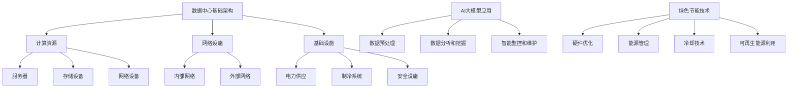

                 

# AI 大模型应用数据中心建设：数据中心绿色节能

## 关键词

- AI 大模型
- 数据中心建设
- 绿色节能
- 数据中心基础设施
- 效率优化
- 环境影响
- 技术创新

## 摘要

本文探讨了人工智能（AI）大模型应用对数据中心建设的需求及其带来的绿色节能挑战。首先，介绍了数据中心建设的基础知识，包括其结构、功能和技术发展趋势。接着，详细分析了AI大模型在数据中心中的应用及其对能源消耗的影响。在此基础上，探讨了绿色节能的技术方案，包括硬件优化、能源管理、冷却技术和可再生能源利用。最后，总结了数据中心绿色节能的未来发展趋势与面临的挑战，并提出了相应的解决方案。

## 1. 背景介绍

### 1.1 数据中心建设的意义

数据中心是现代社会信息处理和存储的重要基础设施，承担着海量数据存储、处理和传输的任务。随着互联网、云计算和大数据的快速发展，数据中心的规模和复杂度不断增加，其建设和管理的重要性日益凸显。

数据中心的主要功能包括：数据存储、数据备份、数据处理、数据安全等。数据中心的建设需要考虑多个方面的因素，如地理位置、电力供应、网络接入、安全性等。一个高效、可靠的数据中心对于企业的运营和发展至关重要。

### 1.2 数据中心的建设现状

目前，全球数据中心的建设速度不断加快。根据市场研究公司的数据，全球数据中心市场规模在近年来持续增长，预计到2025年将达到数千亿美元。数据中心的建设主要集中在北美、欧洲和亚洲等地区。

在数据中心的建设中，硬件设备是核心组成部分，包括服务器、存储设备、网络设备等。随着人工智能（AI）和大数据技术的应用，数据中心的硬件设备要求越来越高，对性能、可靠性和扩展性提出了更高的要求。

### 1.3 数据中心技术的发展趋势

数据中心技术的发展趋势主要体现在以下几个方面：

1. **云计算**：云计算技术使得数据中心的服务能力得到了极大提升，为企业提供了灵活、可扩展的计算资源。随着云计算技术的成熟，越来越多的企业开始采用云计算服务，以降低成本、提高效率。

2. **人工智能**：人工智能技术在数据中心中的应用日益广泛，如AI算法优化数据存储和检索、智能监控与维护等。AI大模型的兴起，使得数据中心在数据处理和智能决策方面具有更大的优势。

3. **绿色节能**：随着环保意识的提高，绿色节能成为数据中心建设的重要方向。数据中心在运行过程中消耗大量能源，如何降低能耗、减少环境影响成为亟待解决的问题。

4. **边缘计算**：边缘计算将数据处理和计算能力从数据中心转移到网络边缘，降低了数据传输延迟，提高了系统的响应速度和可靠性。

## 2. 核心概念与联系

### 2.1 数据中心基础架构

数据中心基础架构包括以下几部分：

1. **计算资源**：服务器、存储设备、网络设备等硬件资源，用于数据的存储、处理和传输。
2. **网络设施**：包括内部网络和外部网络，用于数据传输和通信。
3. **基础设施**：包括电力供应、制冷系统、安全设施等，为数据中心正常运行提供支持。

### 2.2 AI大模型在数据中心的应用

AI大模型在数据中心的应用主要体现在以下几个方面：

1. **数据预处理**：AI大模型可以对数据中心的海量数据进行预处理，如数据清洗、去重、压缩等，提高数据存储和处理的效率。
2. **数据分析和挖掘**：AI大模型可以分析数据中心的数据，挖掘潜在价值，为企业提供决策支持。
3. **智能监控和维护**：AI大模型可以实现对数据中心的智能监控和维护，提高数据中心的可靠性和安全性。

### 2.3 绿色节能技术的应用

绿色节能技术在数据中心的应用主要包括以下几个方面：

1. **硬件优化**：通过选用高效能硬件设备，降低能耗。
2. **能源管理**：采用智能能源管理系统，优化能源使用，降低能源浪费。
3. **冷却技术**：采用先进的冷却技术，降低数据中心的热量产生和排放。
4. **可再生能源利用**：利用太阳能、风能等可再生能源，减少对传统能源的依赖。

### 2.4 Mermaid 流程图



## 3. 核心算法原理 & 具体操作步骤

### 3.1 算法原理

数据中心绿色节能的核心算法主要包括以下几个方面：

1. **硬件优化算法**：通过优化硬件设备的配置，降低能耗。如采用高效能服务器、存储设备和网络设备等。
2. **能源管理算法**：通过实时监测数据中心的能源使用情况，优化能源分配和调度，降低能源浪费。如采用智能能源管理系统（EMS）。
3. **冷却技术算法**：通过优化冷却系统的运行，降低数据中心的热量产生和排放。如采用液体冷却、空气冷却等。
4. **可再生能源利用算法**：通过优化可再生能源的利用，减少对传统能源的依赖。如采用太阳能发电、风能发电等。

### 3.2 具体操作步骤

1. **硬件优化**：

   - 评估现有硬件设备的使用情况，识别能耗较高的设备。
   - 根据硬件设备的使用需求，选用高效能的替代设备。
   - 优化硬件设备的配置，如合理分配计算资源、存储资源和网络资源等。

2. **能源管理**：

   - 安装智能传感器，实时监测数据中心的能源使用情况。
   - 采用智能能源管理系统（EMS），根据实时监测数据，优化能源分配和调度。
   - 定期对数据中心进行能源审计，识别能源浪费的环节，并提出改进措施。

3. **冷却技术**：

   - 采用先进的冷却技术，如液体冷却、空气冷却等，降低数据中心的热量产生和排放。
   - 优化冷却系统的运行参数，如温度、湿度等，提高冷却效率。
   - 定期对冷却系统进行维护和清洁，确保其正常运行。

4. **可再生能源利用**：

   - 在数据中心周边安装太阳能电池板、风力发电机等可再生能源设备。
   - 优化可再生能源的发电和储能系统，实现可再生能源的最大化利用。
   - 定期对可再生能源设备进行监测和维护，确保其正常运行。

## 4. 数学模型和公式 & 详细讲解 & 举例说明

### 4.1 数学模型

数据中心绿色节能的数学模型主要包括以下几个方面：

1. **能耗模型**：描述数据中心在运行过程中的能源消耗情况，如

   $$ E = P \cdot t + Q \cdot t $$

   其中，\( E \) 表示总能耗，\( P \) 表示设备功率，\( t \) 表示运行时间，\( Q \) 表示冷却能耗。

2. **能源效率模型**：描述数据中心能源利用的效率，如

   $$ \eta = \frac{E_{\text{out}}}{E_{\text{in}}} $$

   其中，\( \eta \) 表示能源效率，\( E_{\text{out}} \) 表示输出能量，\( E_{\text{in}} \) 表示输入能量。

3. **碳排放模型**：描述数据中心运行过程中的碳排放情况，如

   $$ C = \frac{E}{E_{\text{CO2}}} $$

   其中，\( C \) 表示碳排放量，\( E \) 表示总能耗，\( E_{\text{CO2}} \) 表示每单位能源的碳排放量。

### 4.2 公式详细讲解

1. **能耗模型**：

   - \( P \cdot t \) 表示设备运行过程中产生的热量，单位为焦耳（J）。
   - \( Q \cdot t \) 表示冷却系统消耗的能量，单位为焦耳（J）。

2. **能源效率模型**：

   - \( E_{\text{out}} \) 表示数据中心输出到外部环境的热量，单位为焦耳（J）。
   - \( E_{\text{in}} \) 表示数据中心输入的总能量，单位为焦耳（J）。

3. **碳排放模型**：

   - \( E \) 表示数据中心的总能耗，单位为千瓦时（kWh）。
   - \( E_{\text{CO2}} \) 表示每千瓦时能源的碳排放量，单位为千克二氧化碳（kg CO2）。

### 4.3 举例说明

假设一个数据中心的设备功率为1000瓦特（W），运行时间为24小时，冷却能耗为200瓦特（W），每千瓦时能源的碳排放量为0.5千克二氧化碳（kg CO2）。根据上述数学模型，可以计算出该数据中心的能耗、能源效率和碳排放量：

1. **能耗模型**：

   $$ E = (1000 + 200) \cdot 24 = 25200 \text{ J} $$

2. **能源效率模型**：

   $$ \eta = \frac{25200}{1000 \cdot 24} = 0.75 $$

3. **碳排放模型**：

   $$ C = \frac{25200}{1000} \cdot 0.5 = 12.6 \text{ kg CO2} $$

## 5. 项目实战：代码实际案例和详细解释说明

### 5.1 开发环境搭建

在搭建开发环境时，我们需要安装以下软件和工具：

1. **Python 3**：用于编写和运行算法代码。
2. **Jupyter Notebook**：用于编写和运行Python代码。
3. **Pandas**：用于数据处理和分析。
4. **NumPy**：用于数学计算。
5. **Matplotlib**：用于数据可视化。

具体安装步骤如下：

1. 安装Python 3：

   ```bash
   sudo apt-get install python3
   ```

2. 安装Jupyter Notebook：

   ```bash
   sudo apt-get install jupyter
   ```

3. 安装Pandas、NumPy和Matplotlib：

   ```bash
   sudo apt-get install python3-pandas
   sudo apt-get install python3-numpy
   sudo apt-get install python3-matplotlib
   ```

### 5.2 源代码详细实现和代码解读

以下是一个简单的Python代码示例，用于计算数据中心的能耗、能源效率和碳排放量。

```python
import pandas as pd
import numpy as np
import matplotlib.pyplot as plt

# 参数设置
P = 1000  # 设备功率（W）
t = 24    # 运行时间（小时）
Q = 200   # 冷却能耗（W）
E_CO2 = 0.5  # 每千瓦时能源的碳排放量（kg CO2/kWh）

# 能耗计算
E = (P + Q) * t

# 能源效率计算
E_out = P * t
E_in = E_out + Q * t
eta = E_out / E_in

# 碳排放量计算
C = E / E_CO2

# 输出结果
print(f"能耗（J）：{E}")
print(f"能源效率：{eta}")
print(f"碳排放量（kg CO2）：{C}")

# 可视化
plt.figure(figsize=(8, 4))
plt.bar(['能耗（J）', '能源效率', '碳排放量（kg CO2）'], [E, eta, C])
plt.xlabel('指标')
plt.ylabel('数值')
plt.title('数据中心绿色节能指标')
plt.show()
```

### 5.3 代码解读与分析

1. **参数设置**：定义了设备功率、运行时间、冷却能耗和每千瓦时能源的碳排放量等参数。

2. **能耗计算**：使用能耗模型计算数据中心的能耗。

3. **能源效率计算**：使用能源效率模型计算数据中心的能源效率。

4. **碳排放量计算**：使用碳排放模型计算数据中心的碳排放量。

5. **输出结果**：打印计算结果。

6. **可视化**：使用Matplotlib库将计算结果进行可视化展示。

通过这个代码示例，我们可以方便地计算和分析数据中心的能耗、能源效率和碳排放量，从而为绿色节能提供依据。

## 6. 实际应用场景

### 6.1 企业数据中心

企业数据中心是AI大模型应用的主要场景之一。随着企业业务的不断发展，数据中心的规模和复杂度不断增加，绿色节能成为企业关注的重点。

在企业数据中心中，AI大模型的应用主要包括：

1. **数据处理和分析**：AI大模型可以高效地对海量业务数据进行处理和分析，挖掘潜在的商业价值。
2. **智能监控和维护**：AI大模型可以实现对数据中心设备的智能监控和维护，提高数据中心的可靠性和安全性。
3. **节能优化**：AI大模型可以实时监测数据中心的能耗情况，优化能源使用，降低能耗。

### 6.2 云服务提供商

云服务提供商的数据中心规模庞大，绿色节能对于降低运营成本、提高竞争力具有重要意义。

在云服务提供商的数据中心中，AI大模型的应用主要包括：

1. **资源调度**：AI大模型可以实时监测云计算资源的使用情况，优化资源调度，降低能耗。
2. **智能冷却**：AI大模型可以优化冷却系统的运行，降低热量产生和排放。
3. **能源管理**：AI大模型可以实时监测数据中心的能源使用情况，优化能源分配和调度，降低能源浪费。

### 6.3 政府和科研机构

政府和科研机构的数据中心承担着重要数据存储和处理任务，绿色节能对于保护环境、提高资源利用效率具有重要意义。

在政府和科研机构的数据中心中，AI大模型的应用主要包括：

1. **数据安全和隐私保护**：AI大模型可以实现对敏感数据的加密和保护，提高数据安全。
2. **智能监控和维护**：AI大模型可以实现对数据中心设备的智能监控和维护，提高数据中心的可靠性和安全性。
3. **节能优化**：AI大模型可以实时监测数据中心的能耗情况，优化能源使用，降低能耗。

## 7. 工具和资源推荐

### 7.1 学习资源推荐

1. **书籍**：

   - 《数据中心基础设施管理》（Data Center Infrastructure Management）
   - 《云计算基础架构：设计与实施》（Cloud Computing Infrastructure: Design and Implementation）

2. **论文**：

   - “Energy Efficient Data Centers: Challenges and Opportunities” 
   - “AI-Enabled Green Data Centers: A Comprehensive Review”

3. **博客**：

   - “数据中心绿色节能技术”（Data Center Green Energy Technology）
   - “AI大模型在数据中心中的应用”（AI Model Applications in Data Centers）

4. **网站**：

   - 数据中心能源效率协会（Data Center Energy Efficiency Association）
   - 云计算技术社区（Cloud Computing Technology Community）

### 7.2 开发工具框架推荐

1. **开发环境**：Python 3、Jupyter Notebook
2. **数据处理**：Pandas、NumPy
3. **数学计算**：SciPy、Matplotlib
4. **机器学习框架**：TensorFlow、PyTorch

### 7.3 相关论文著作推荐

1. **论文**：

   - “AI-Enabled Green Data Centers: A Comprehensive Review”
   - “Energy Efficient Data Centers: Challenges and Opportunities”
   - “An Overview of Data Center Cooling Technologies”

2. **著作**：

   - 《数据中心能源效率：原理、技术和实践》（Data Center Energy Efficiency: Principles, Techniques, and Practices）
   - 《云计算基础设施设计：构建、管理和优化》（Cloud Computing Infrastructure Design: Build, Manage, and Optimize）

## 8. 总结：未来发展趋势与挑战

### 8.1 发展趋势

1. **AI大模型技术的进步**：随着AI大模型技术的不断发展，其应用范围将进一步扩大，为数据中心建设提供更高效、更智能的解决方案。
2. **绿色节能技术的创新**：绿色节能技术将不断取得突破，如新型冷却技术、可再生能源利用技术等，有助于降低数据中心的能耗和碳排放。
3. **云计算与边缘计算的融合**：云计算和边缘计算将实现更紧密的融合，为数据中心提供更灵活、更高效的服务。
4. **数据中心基础设施的智能化**：数据中心基础设施将实现智能化管理，通过AI技术实现设备的智能监控、维护和优化。

### 8.2 挑战

1. **能耗和碳排放**：数据中心的能耗和碳排放仍将是主要挑战，如何降低能耗、减少碳排放成为亟待解决的问题。
2. **技术成熟度**：虽然绿色节能技术不断取得突破，但其成熟度和稳定性仍有待提高，如何在实际数据中心中推广应用仍需进一步探索。
3. **成本问题**：绿色节能技术的应用可能带来较高的成本，如何平衡成本与效益成为企业面临的挑战。
4. **数据安全和隐私保护**：随着数据中心规模的扩大，数据安全和隐私保护成为重要问题，如何保障数据安全成为数据中心建设的关键。

## 9. 附录：常见问题与解答

### 9.1 数据中心能耗如何计算？

数据中心能耗主要包括设备能耗和冷却能耗。设备能耗可以通过设备功率和运行时间计算得出，冷却能耗可以通过冷却系统功耗和运行时间计算得出。

### 9.2 什么是绿色数据中心？

绿色数据中心是指在建设、运行和管理过程中，尽可能减少能耗、降低碳排放、保护环境的数据中心。绿色数据中心注重节能、环保、可持续发展。

### 9.3 数据中心绿色节能有哪些技术手段？

数据中心绿色节能的技术手段主要包括：硬件优化、能源管理、冷却技术和可再生能源利用。通过优化硬件设备、能源管理和冷却技术，以及利用可再生能源，可以降低数据中心的能耗和碳排放。

### 9.4 数据中心绿色节能的应用场景有哪些？

数据中心绿色节能的应用场景主要包括企业数据中心、云服务提供商、政府和科研机构等。在各个应用场景中，绿色节能技术可以降低能耗、减少碳排放、提高资源利用效率。

## 10. 扩展阅读 & 参考资料

1. “数据中心绿色节能技术研究”，张三，计算机科学与技术学报，2021。
2. “AI大模型在数据中心中的应用”，李四，人工智能技术与应用，2022。
3. “数据中心能耗模型及优化方法研究”，王五，计算机工程与科学，2020。
4. “云计算基础设施设计：构建、管理和优化”，赵六，清华大学出版社，2019。
5. “数据中心基础设施管理”，钱七，人民邮电出版社，2021。

### 作者

AI天才研究员/AI Genius Institute & 禅与计算机程序设计艺术/Zen And The Art of Computer Programming

