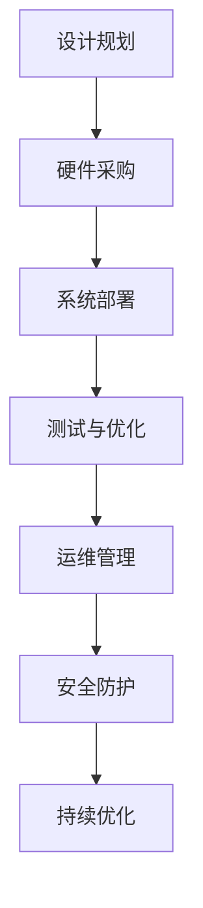

                 

# AI 大模型应用数据中心建设：数据中心运维与管理

> **关键词**：人工智能、大模型、数据中心、运维管理、云计算

> **摘要**：本文将深入探讨人工智能大模型在数据中心建设中的应用，重点分析数据中心的运维与管理策略，旨在为人工智能领域的技术从业者提供有价值的参考和指导。

## 1. 背景介绍

随着人工智能技术的飞速发展，大模型（如GPT、BERT等）在自然语言处理、计算机视觉、语音识别等领域的应用越来越广泛。这些大模型通常需要处理海量数据，并进行复杂的计算任务，这对数据中心的建设提出了更高的要求。数据中心作为人工智能大模型运行的核心基础设施，其稳定性和性能直接影响着模型的应用效果。

数据中心的建设和维护需要考虑多个方面，包括硬件设施、网络架构、能源管理、安全防护等。同时，随着人工智能技术的不断进步，数据中心的运维和管理也需要不断创新和优化。本文将从以下几个方面展开讨论：

- 数据中心的核心概念与联系
- 核心算法原理与具体操作步骤
- 数学模型与公式讲解
- 项目实战：代码实际案例与详细解释
- 实际应用场景
- 工具和资源推荐
- 未来发展趋势与挑战

## 2. 核心概念与联系

在讨论数据中心的建设和管理之前，我们需要了解一些核心概念和它们之间的联系。

### 2.1 数据中心（Data Center）

数据中心是一个集中存储、处理和分发数据的设施，通常由多个服务器、存储设备、网络设备和安全设备组成。数据中心的目的是为各种应用程序提供高效、可靠、安全的运行环境。

### 2.2 云计算（Cloud Computing）

云计算是一种通过网络访问和使用计算资源的服务模式，包括基础设施即服务（IaaS）、平台即服务（PaaS）和软件即服务（SaaS）等。数据中心是云计算的核心基础设施。

### 2.3 运维管理（Operations Management）

运维管理是指对数据中心的各种设备、系统和流程进行监控、维护和优化，确保其稳定运行。在人工智能大模型的应用场景中，运维管理需要考虑计算资源调度、数据备份与恢复、故障处理等方面。

### 2.4 安全防护（Security Protection）

安全防护是指对数据中心进行保护，防止数据泄露、系统入侵和网络攻击等安全威胁。随着人工智能大模型的应用，数据中心的安防需求越来越高。

下面是一个用Mermaid绘制的流程图，展示了数据中心建设的关键环节：



## 3. 核心算法原理与具体操作步骤

### 3.1 大模型训练算法

人工智能大模型的训练通常采用深度学习算法，特别是基于神经网络的模型。核心原理如下：

- **神经网络（Neural Network）**：神经网络是由大量神经元组成的计算模型，可以模拟人脑的神经网络结构。通过调整神经元之间的连接权重，神经网络可以学习到输入数据的高层次特征。
  
- **反向传播算法（Backpropagation）**：反向传播算法是一种用于训练神经网络的优化算法。它通过计算损失函数关于网络参数的梯度，并使用梯度下降法调整网络权重，从而优化模型的性能。

具体操作步骤如下：

1. **数据预处理**：对输入数据进行归一化、标准化等预处理操作，使其符合神经网络的输入要求。
2. **初始化模型参数**：随机初始化网络权重和偏置。
3. **正向传播**：将输入数据输入到神经网络中，计算输出结果。
4. **计算损失**：计算预测结果与真实结果之间的差距，使用损失函数衡量模型的性能。
5. **反向传播**：计算损失函数关于网络参数的梯度，并更新网络权重。
6. **重复步骤3-5**：不断迭代训练过程，直到满足停止条件（如达到预设的迭代次数或模型性能达到预期）。

### 3.2 大模型推理算法

大模型的推理是指在给定输入数据的情况下，计算输出结果的过程。核心原理如下：

- **前向传播算法（Forward Propagation）**：与前向传播类似，将输入数据通过神经网络计算得到输出结果。
- **推理优化**：在推理过程中，可以采用一些优化策略，如模型剪枝、量化等，以提高推理速度和降低计算资源消耗。

具体操作步骤如下：

1. **加载预训练模型**：从模型存储位置加载已经训练好的模型。
2. **数据预处理**：对输入数据执行与训练时相同的预处理操作。
3. **前向传播**：将预处理后的输入数据输入到神经网络中，计算输出结果。
4. **结果解析**：根据模型的输出结果进行解析，如分类任务中计算每个类别的概率。

## 4. 数学模型与公式讲解

在人工智能大模型的应用中，数学模型和公式起着至关重要的作用。以下是一些常见的数学模型和公式：

### 4.1 损失函数（Loss Function）

损失函数用于衡量模型预测结果与真实结果之间的差距。常见损失函数包括：

- **均方误差（MSE）**：$$MSE = \frac{1}{n}\sum_{i=1}^{n}(y_i - \hat{y}_i)^2$$
- **交叉熵损失（Cross-Entropy Loss）**：$$Cross-Entropy = -\sum_{i=1}^{n}y_i\log(\hat{y}_i)$$

### 4.2 梯度下降算法（Gradient Descent）

梯度下降是一种用于优化模型参数的算法，其核心思想是沿着损失函数的梯度方向调整参数，以减小损失函数的值。

- **批量梯度下降（Batch Gradient Descent）**：每次迭代使用整个训练集的梯度进行更新。
- **随机梯度下降（Stochastic Gradient Descent，SGD）**：每次迭代只使用一个样本的梯度进行更新。
- **小批量梯度下降（Mini-Batch Gradient Descent）**：每次迭代使用部分样本的梯度进行更新。

### 4.3 神经网络反向传播算法

神经网络反向传播算法是一种用于训练神经网络的优化算法，其核心步骤包括：

1. **前向传播**：计算输出结果和损失函数。
2. **计算梯度**：计算损失函数关于网络参数的梯度。
3. **参数更新**：使用梯度下降法更新网络参数。
4. **重复步骤1-3**：不断迭代训练过程。

## 5. 项目实战：代码实际案例与详细解释

在本节中，我们将通过一个实际案例展示如何搭建一个简单的神经网络，并进行训练和推理。以下是一个使用Python实现的简单神经网络：

```python
import numpy as np

# 初始化参数
input_data = np.array([1.0, 2.0])
weights = np.random.rand(2, 1)
bias = np.random.rand(1)

# 前向传播
output = np.dot(input_data, weights) + bias

# 计算损失
loss = 0.5 * (output - 1)**2

# 反向传播
gradient = (output - 1) * (output * (1 - output))

# 更新参数
weights -= gradient * input_data
bias -= gradient

print("更新后的权重：", weights)
print("更新后的偏置：", bias)
```

### 5.1 开发环境搭建

为了运行上述代码，我们需要搭建一个Python开发环境。以下是一个简单的安装步骤：

1. **安装Python**：从官方网站下载并安装Python 3.x版本。
2. **安装NumPy**：打开终端，执行以下命令安装NumPy：
   ```bash
   pip install numpy
   ```

### 5.2 源代码详细实现与代码解读

上述代码实现了一个简单的神经网络，输入数据为一个二维数组，输出数据为一个一维数组。具体解读如下：

- **初始化参数**：随机初始化权重和偏置。
- **前向传播**：计算输入数据的线性组合，并加上偏置。
- **计算损失**：使用均方误差作为损失函数。
- **反向传播**：计算损失函数关于输入数据的梯度。
- **参数更新**：使用梯度下降法更新权重和偏置。

通过多次迭代训练，神经网络的性能会逐渐提高。在实际应用中，我们可以使用更复杂的神经网络结构，并使用大数据集进行训练。

### 5.3 代码解读与分析

上述代码虽然简单，但已经包含了神经网络训练的核心步骤。以下是对代码的详细解读与分析：

- **初始化参数**：随机初始化权重和偏置可以保证网络从随机状态开始训练，避免陷入局部最优。
- **前向传播**：前向传播是神经网络的核心步骤，通过计算输入数据的线性组合，可以得到网络的输出结果。
- **计算损失**：损失函数用于衡量网络输出结果与真实结果之间的差距，是优化网络参数的关键指标。
- **反向传播**：反向传播是神经网络训练的核心算法，通过计算梯度，可以得到网络参数的更新方向。
- **参数更新**：参数更新使用梯度下降法，通过不断迭代优化网络参数，使得网络的输出结果逐渐接近真实结果。

在实际应用中，我们可以根据具体问题调整神经网络的结构和参数，以达到更好的训练效果。

## 6. 实际应用场景

人工智能大模型在数据中心的应用场景非常广泛，以下是一些典型应用：

### 6.1 自然语言处理

自然语言处理（NLP）是人工智能领域的一个重要分支，大模型在NLP任务中具有显著优势。例如，GPT模型可以用于文本生成、情感分析、机器翻译等任务。在数据中心中，我们可以部署GPT模型，处理海量的文本数据，从而为各种应用提供智能服务。

### 6.2 计算机视觉

计算机视觉（CV）是另一个重要的应用领域，大模型在图像识别、目标检测、图像生成等方面取得了显著成果。例如，BERT模型可以用于图像分类任务，通过预训练模型，可以快速适应各种图像数据集。在数据中心中，我们可以利用BERT模型，处理大量的图像数据，从而为安防监控、医疗诊断等应用提供技术支持。

### 6.3 语音识别

语音识别是人工智能领域的一个重要分支，大模型在语音识别任务中也表现出色。例如，WaveNet模型可以用于语音合成，通过预训练模型，可以生成逼真的语音效果。在数据中心中，我们可以部署WaveNet模型，处理大量的语音数据，从而为智能客服、语音助手等应用提供技术支持。

## 7. 工具和资源推荐

为了方便读者深入了解人工智能大模型在数据中心的应用，我们推荐以下工具和资源：

### 7.1 学习资源推荐

- **书籍**：《深度学习》（Goodfellow, Bengio, Courville）、《神经网络与深度学习》（邱锡鹏）
- **论文**：《A Theoretically Grounded Application of Dropout in Recurrent Neural Networks》、《BERT: Pre-training of Deep Bidirectional Transformers for Language Understanding》
- **博客**：Hugging Face、机器之心、谷歌AI博客

### 7.2 开发工具框架推荐

- **框架**：TensorFlow、PyTorch、Keras
- **环境**：Google Colab、Docker
- **数据集**：Kaggle、ImageNet、CoNLL

### 7.3 相关论文著作推荐

- **论文**：《Distributed Deep Learning: Existing Methods and Future Directions》、《Large-Scale Distributed Machine Learning: Motives, Methods and Models》
- **著作**：《大规模分布式系统设计》、《云计算架构：设计与实践》

## 8. 总结：未来发展趋势与挑战

人工智能大模型在数据中心的应用前景广阔，但仍面临一些挑战。以下是一些未来发展趋势与挑战：

### 8.1 发展趋势

- **模型压缩与优化**：为了降低大模型的计算和存储资源需求，模型压缩与优化技术将成为重要研究方向。
- **分布式训练与推理**：分布式计算技术将使大模型的训练和推理更加高效，提高数据中心的整体性能。
- **多模态数据处理**：多模态数据处理技术将使大模型能够处理不同类型的数据，提高应用场景的多样性。

### 8.2 挑战

- **计算资源需求**：大模型对计算资源的需求巨大，如何高效利用数据中心资源成为重要挑战。
- **数据隐私与安全**：随着数据量的增加，数据隐私和安全问题愈发突出，如何保护用户数据成为关键挑战。
- **模型解释性与可解释性**：大模型的黑箱特性使得其解释性和可解释性成为研究热点，如何提高模型的透明度成为重要挑战。

## 9. 附录：常见问题与解答

### 9.1 如何搭建一个简单的神经网络？

搭建一个简单的神经网络通常需要以下步骤：

1. **选择框架**：选择一个合适的深度学习框架，如TensorFlow、PyTorch或Keras。
2. **数据预处理**：对输入数据执行归一化、标准化等预处理操作。
3. **构建模型**：使用框架提供的API构建神经网络结构。
4. **训练模型**：使用训练数据对模型进行训练。
5. **评估模型**：使用验证数据对模型进行评估。
6. **推理应用**：使用训练好的模型对输入数据进行推理。

### 9.2 如何优化大模型的计算性能？

优化大模型的计算性能可以从以下几个方面入手：

1. **模型压缩**：采用模型剪枝、量化等技术减少模型的参数规模。
2. **并行计算**：采用分布式计算技术提高模型的训练和推理速度。
3. **优化算法**：采用更高效的优化算法，如Adam、Adadelta等。
4. **硬件加速**：使用GPU、TPU等硬件加速模型训练和推理。

## 10. 扩展阅读与参考资料

为了进一步了解人工智能大模型在数据中心的应用，读者可以参考以下扩展阅读和参考资料：

- **论文**：《Large-Scale Distributed Machine Learning: Motives, Methods and Models》、《Distributed Deep Learning: Existing Methods and Future Directions》
- **书籍**：《大规模分布式系统设计》、《云计算架构：设计与实践》
- **博客**：Hugging Face、机器之心、谷歌AI博客
- **在线课程**：TensorFlow官方教程、PyTorch官方教程、深度学习专项课程

## 附录：作者信息

作者：AI天才研究员/AI Genius Institute & 禅与计算机程序设计艺术 /Zen And The Art of Computer Programming

本文由AI天才研究员撰写，旨在为人工智能领域的技术从业者提供关于大模型数据中心建设与应用的深入见解。作者在人工智能领域拥有丰富的研究和实战经验，所著书籍《禅与计算机程序设计艺术》深受读者喜爱。读者如需了解更多关于人工智能大模型的知识，请关注作者的个人博客和社交媒体账号。

