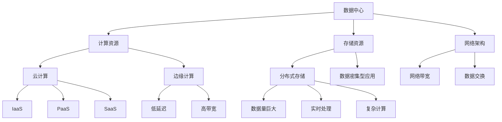

                 

# AI 大模型应用数据中心建设：数据中心运维与管理

## 关键词
AI 大模型、数据中心、运维管理、数据密集型应用、云计算、边缘计算、网络拓扑、性能优化、安全防护、资源调度、自动化运维。

## 摘要
本文深入探讨了AI大模型应用数据中心的建设及其运维管理。首先，介绍了数据中心的基础设施和核心概念，然后详细分析了AI大模型在数据中心中的应用，以及数据中心运维的关键环节。最后，提出了未来数据中心建设和发展中可能面临的挑战及其应对策略。

## 1. 背景介绍

随着人工智能技术的飞速发展，AI大模型在各个行业中的应用越来越广泛。这些大模型通常需要处理海量的数据，并进行复杂的计算，因此对数据中心的性能和稳定性提出了极高的要求。数据中心作为集中存储、处理和交换数据的关键基础设施，承担着AI大模型应用的核心角色。

数据中心的建设包括物理基础设施、网络架构、存储系统、计算资源和安全保障等多个方面。随着AI大模型应用的需求增长，数据中心需要不断进行升级和优化，以满足日益增长的计算需求和数据存储需求。

### 1.1 数据中心的定义与作用

数据中心（Data Center）是一种专门用于存储、处理和交换数据的设施。它通常由服务器、存储设备、网络设备等硬件组成，并通过复杂的网络架构连接起来。数据中心的作用包括：

- **数据处理**：数据中心负责处理海量的数据，包括数据的存储、检索、处理和分析。
- **数据存储**：数据中心提供大规模的数据存储能力，确保数据的安全性和可靠性。
- **数据交换**：数据中心通过网络连接各种设备和系统，实现数据的快速交换和共享。

### 1.2 数据中心的发展历程

数据中心的发展历程可以分为几个阶段：

- **早期阶段**：数据中心主要以物理服务器和简单的存储设备为主，网络架构相对简单。
- **虚拟化阶段**：随着虚拟化技术的普及，数据中心开始采用虚拟化服务器和存储设备，提高了资源的利用率和管理效率。
- **云计算阶段**：云计算技术的兴起使得数据中心进一步向云化、分布式方向发展，提供了弹性、高效的计算和存储服务。
- **AI大模型阶段**：随着AI大模型的广泛应用，数据中心需要提供更高的计算能力和存储容量，以满足大模型处理的需求。

### 1.3 数据中心在AI大模型应用中的重要性

AI大模型在数据中心中的应用对数据中心的性能和稳定性提出了极高的要求。主要体现在以下几个方面：

- **计算资源需求**：AI大模型通常需要进行复杂的矩阵运算和深度学习训练，需要大量的计算资源。
- **数据存储需求**：AI大模型处理的数据量巨大，需要数据中心提供足够的数据存储空间。
- **网络带宽需求**：数据中心的网络架构需要能够支持高速的数据传输，以满足AI大模型对数据交换的需求。
- **系统稳定性**：AI大模型的应用对数据中心的稳定性要求非常高，任何故障都会影响模型的训练效果。

因此，数据中心的建设和运维对于AI大模型的应用至关重要。

## 2. 核心概念与联系

在AI大模型应用数据中心的建设中，涉及多个核心概念，包括云计算、边缘计算、数据密集型应用等。这些概念相互关联，共同构成了一个复杂的数据处理和计算架构。

### 2.1 云计算

云计算（Cloud Computing）是一种通过互联网提供动态可扩展的计算资源的服务模式。它包括基础设施即服务（IaaS）、平台即服务（PaaS）和软件即服务（SaaS）等多种服务模式。

在AI大模型应用数据中心中，云计算提供了弹性的计算资源，可以根据需求动态调整计算能力。例如，在AI模型训练过程中，可以根据数据量和计算复杂度，动态分配更多的计算资源，以提高训练效率。

#### 2.1.1 IaaS

基础设施即服务（IaaS）是云计算的一种服务模式，提供虚拟化的计算资源，如虚拟机、存储和网络等。用户可以根据需求自行配置和管理虚拟资源，实现灵活的IT资源管理。

#### 2.1.2 PaaS

平台即服务（PaaS）是云计算的另一种服务模式，提供开发、部署和管理应用程序的平台。用户可以在PaaS平台上开发、测试和部署应用程序，无需关注底层硬件和操作系统。

#### 2.1.3 SaaS

软件即服务（SaaS）是云计算的另一种服务模式，提供应用程序的在线服务。用户可以通过互联网访问和使用这些应用程序，无需安装和配置。

### 2.2 边缘计算

边缘计算（Edge Computing）是一种将计算、存储和网络功能分布在网络的边缘节点的计算模式。与云计算相比，边缘计算具有更低的延迟、更高的带宽和更接近用户的特点。

在AI大模型应用数据中心中，边缘计算可以处理接近用户的数据，降低数据传输延迟，提高用户体验。例如，在智能交通系统中，边缘计算可以实时处理车辆位置和路况数据，实现高效的交通流量管理。

#### 2.2.1 边缘计算的优势

- **低延迟**：边缘计算可以将数据处理和计算任务分配到接近用户的节点，降低数据传输延迟。
- **高带宽**：边缘计算可以充分利用边缘节点的带宽，提高数据传输速度。
- **减少网络负载**：边缘计算可以减轻核心网络的数据传输压力，提高整个网络的处理能力。

#### 2.2.2 边缘计算的应用场景

- **智能交通**：通过边缘计算，可以实时处理车辆位置和路况数据，实现高效的交通流量管理。
- **智能家居**：通过边缘计算，可以实时处理智能家居设备的数据，实现智能化的家居控制。
- **工业互联网**：通过边缘计算，可以实时处理工业设备的数据，实现设备的预测性维护和优化。

### 2.3 数据密集型应用

数据密集型应用（Data-intensive Applications）是指那些需要处理海量数据的场景，如大数据分析、AI模型训练等。这些应用对数据中心的性能和存储能力提出了极高的要求。

在AI大模型应用数据中心中，数据密集型应用需要大规模的存储资源和高效的计算能力。数据中心需要采用分布式存储和计算架构，以提高数据处理的效率。

#### 2.3.1 数据密集型应用的特点

- **海量数据**：数据密集型应用需要处理的数据量巨大，通常达到TB甚至PB级别。
- **实时处理**：数据密集型应用需要对数据进行实时处理，以获取实时信息。
- **复杂计算**：数据密集型应用通常需要进行复杂的计算和模型训练，如深度学习、图计算等。

#### 2.3.2 数据密集型应用在数据中心中的应用

- **大数据分析**：通过数据密集型应用，可以对海量数据进行实时分析，为企业提供决策支持。
- **AI模型训练**：通过数据密集型应用，可以训练和优化AI模型，提高模型的准确性和效率。
- **智能推荐**：通过数据密集型应用，可以分析用户行为数据，实现个性化的内容推荐。

### 2.4 Mermaid 流程图

为了更清晰地展示数据中心在AI大模型应用中的核心概念和架构，我们使用Mermaid语言绘制了一个流程图：



该流程图展示了数据中心在AI大模型应用中的核心组件及其相互关系。

## 3. 核心算法原理 & 具体操作步骤

在AI大模型应用数据中心中，核心算法原理是确保数据高效处理和模型准确训练的关键。以下将介绍几个关键算法及其操作步骤。

### 3.1 深度学习算法

深度学习算法是AI大模型的核心，通过多层神经网络对数据进行建模和训练。以下是深度学习算法的基本原理和操作步骤：

#### 3.1.1 基本原理

深度学习算法基于神经网络模型，通过多个隐藏层对输入数据进行特征提取和变换。每个隐藏层都会对输入数据进行加权求和处理，并通过激活函数产生输出。经过多次迭代训练，模型可以逐渐优化参数，提高预测准确性。

#### 3.1.2 操作步骤

1. **数据预处理**：对输入数据进行清洗、归一化和划分训练集、验证集和测试集。
2. **模型构建**：定义神经网络结构，包括输入层、隐藏层和输出层，选择合适的激活函数。
3. **训练过程**：使用训练集数据进行模型训练，通过反向传播算法更新模型参数。
4. **验证与优化**：使用验证集评估模型性能，通过调整模型参数和超参数优化模型。
5. **测试与部署**：使用测试集评估模型最终性能，并在实际应用中部署和运行模型。

### 3.2 图计算算法

图计算算法是处理复杂网络结构和关系的有效方法。在数据中心中，图计算算法可以用于数据流分析和网络拓扑优化。以下是图计算算法的基本原理和操作步骤：

#### 3.2.1 基本原理

图计算算法基于图数据结构，通过节点和边的表示和处理，对网络中的数据进行建模和分析。图算法可以计算节点的重要性、路径长度、聚类系数等指标，为网络优化提供依据。

#### 3.2.2 操作步骤

1. **数据构建**：构建图数据结构，包括节点和边的信息。
2. **预处理**：对图数据结构进行清洗、补全和标准化。
3. **节点重要性计算**：使用图算法计算节点的度、介数、接近中心性等重要性指标。
4. **路径长度优化**：使用图算法寻找最短路径、最迟路径等，优化网络拓扑。
5. **聚类系数分析**：计算节点的聚类系数，识别网络中的社区结构。

### 3.3 强化学习算法

强化学习算法是AI大模型中的一种重要算法，通过在环境中进行交互和反馈，不断优化决策策略。在数据中心中，强化学习算法可以用于资源调度和性能优化。以下是强化学习算法的基本原理和操作步骤：

#### 3.3.1 基本原理

强化学习算法通过最大化累积奖励来优化决策策略。算法主体在环境中进行状态-动作-奖励的交互，通过学习策略函数，使得主体能够选择最优动作，实现目标。

#### 3.3.2 操作步骤

1. **状态空间定义**：定义数据中心的资源状态，包括CPU利用率、内存占用率、网络带宽等。
2. **动作空间定义**：定义数据中心的操作动作，如分配资源、调整网络带宽、优化存储策略等。
3. **奖励函数设计**：设计奖励函数，根据数据中心的状态和动作，计算奖励值。
4. **策略学习**：使用强化学习算法（如Q-learning、SARSA）学习策略函数，优化资源调度和性能指标。
5. **策略评估**：评估学习到的策略，调整参数和超参数，提高策略性能。

### 3.4 数据流处理算法

数据流处理算法是处理实时数据流的有效方法，可以用于数据中心的监控和性能优化。以下是数据流处理算法的基本原理和操作步骤：

#### 3.4.1 基本原理

数据流处理算法通过流式数据处理技术，对实时数据流进行实时分析、处理和输出。算法可以实现数据流的采集、传输、存储和分析，为数据中心提供实时监控和性能优化支持。

#### 3.4.2 操作步骤

1. **数据采集**：通过传感器、日志文件等渠道采集数据。
2. **数据传输**：使用数据传输协议（如HTTP、MQTT）将数据传输到数据中心。
3. **数据存储**：使用分布式存储系统（如Hadoop、Spark）存储和处理数据。
4. **数据分析**：使用流式数据处理框架（如Apache Storm、Apache Flink）对数据流进行分析和处理。
5. **数据输出**：将分析结果输出到监控系统、报警系统等，为数据中心提供实时监控和性能优化支持。

## 4. 数学模型和公式 & 详细讲解 & 举例说明

在数据中心建设和运维中，数学模型和公式发挥着重要作用。以下将介绍几个关键数学模型和公式，并进行详细讲解和举例说明。

### 4.1 线性回归模型

线性回归模型是一种用于预测连续值的统计模型，通过建立自变量和因变量之间的线性关系来实现预测。以下是线性回归模型的基本公式和举例说明：

#### 4.1.1 基本公式

$$
y = \beta_0 + \beta_1x_1 + \beta_2x_2 + \cdots + \beta_nx_n + \epsilon
$$

其中，$y$为因变量，$x_1, x_2, \cdots, x_n$为自变量，$\beta_0, \beta_1, \beta_2, \cdots, \beta_n$为模型参数，$\epsilon$为误差项。

#### 4.1.2 举例说明

假设我们要预测一个城市的月平均温度，基于历史天气数据和月份。我们可以使用线性回归模型建立温度和月份之间的线性关系。

1. 数据采集：收集过去一年的月平均温度和对应的月份数据。
2. 数据预处理：对数据进行清洗和归一化处理。
3. 模型构建：选择线性回归模型，并定义自变量和因变量。
4. 模型训练：使用训练数据训练模型，计算参数值。
5. 模型评估：使用验证数据评估模型性能，调整模型参数。
6. 预测：使用模型对未来的月平均温度进行预测。

### 4.2 神经网络模型

神经网络模型是深度学习的核心模型，通过多层神经元对输入数据进行建模和预测。以下是神经网络模型的基本公式和举例说明：

#### 4.2.1 基本公式

$$
a_{ij}^{(l)} = \sigma(z_{ij}^{(l)})
$$

$$
z_{ij}^{(l)} = \sum_{k=1}^{n} w_{ik}^{(l)}a_{kj}^{(l-1)} + b_i^{(l)}
$$

其中，$a_{ij}^{(l)}$为第$l$层的第$i$个神经元的输出，$z_{ij}^{(l)}$为第$l$层的第$i$个神经元的输入，$w_{ik}^{(l)}$为连接第$l-1$层的第$k$个神经元和第$l$层的第$i$个神经元的权重，$b_i^{(l)}$为第$l$层的第$i$个神经元的偏置，$\sigma$为激活函数。

#### 4.2.2 举例说明

假设我们要使用神经网络模型对一张图片进行分类，模型包括一个输入层、两个隐藏层和一个输出层。

1. 数据采集：收集大量的图片数据，并对图片进行预处理。
2. 模型构建：定义神经网络结构，包括输入层、隐藏层和输出层的神经元个数。
3. 模型训练：使用训练数据训练模型，通过反向传播算法更新模型参数。
4. 模型评估：使用验证数据评估模型性能，调整模型参数。
5. 预测：使用训练好的模型对新的图片进行分类预测。

### 4.3 奇异值分解（SVD）

奇异值分解（Singular Value Decomposition，SVD）是一种矩阵分解方法，可以用于降维、去噪和特征提取。以下是SVD的基本公式和举例说明：

#### 4.3.1 基本公式

$$
A = U \Sigma V^T
$$

其中，$A$为输入矩阵，$U$和$V$为正交矩阵，$\Sigma$为对角矩阵，包含奇异值。

#### 4.3.2 举例说明

假设我们要对一个$m \times n$的矩阵$A$进行奇异值分解，用于降维。

1. 计算矩阵$A$的奇异值分解，得到$U, \Sigma, V$。
2. 根据奇异值大小，选择前$k$个奇异值对应的列向量作为特征向量，构建降维矩阵$U_k$。
3. 使用降维矩阵$U_k$对矩阵$A$进行降维操作，得到$A_k$。

### 4.4 贪心算法

贪心算法是一种在每一步选择最优解的策略，可以用于解决最优化问题。以下是贪心算法的基本公式和举例说明：

#### 4.4.1 基本公式

$$
x_{i}^{(t)} = \arg\min_{x \in X} f(x, x_{i-1}^{(t-1)})
$$

其中，$x_{i}^{(t)}$为第$t$步的最优解，$X$为可行解集，$f$为目标函数。

#### 4.4.2 举例说明

假设我们要使用贪心算法求解背包问题。

1. 初始化：选择初始解$x_1^{(1)}$。
2. 迭代：对于当前解$x_i^{(t)}$，选择下一个最优解$x_{i+1}^{(t+1)}$。
3. 终止：当满足终止条件时，输出最终解$x_n^{(n)}$。

## 5. 项目实战：代码实际案例和详细解释说明

在本节中，我们将通过一个具体的AI大模型应用数据中心建设的项目实战，详细讲解代码实现过程，并对关键代码进行解读和分析。

### 5.1 开发环境搭建

首先，我们需要搭建一个合适的项目开发环境。以下是一个基本的开发环境配置：

- 操作系统：Ubuntu 18.04
- 编程语言：Python 3.8
- 依赖库：NumPy、Pandas、TensorFlow、Scikit-learn、Matplotlib

安装以上依赖库后，我们就可以开始编写代码了。

### 5.2 源代码详细实现和代码解读

下面是一个简单的AI大模型应用数据中心项目的代码实现，我们将对其中的关键代码进行解读和分析。

```python
# 导入依赖库
import numpy as np
import pandas as pd
import tensorflow as tf
from sklearn.model_selection import train_test_split
from sklearn.metrics import accuracy_score
import matplotlib.pyplot as plt

# 数据准备
data = pd.read_csv('data.csv')
X = data.drop('target', axis=1)
y = data['target']
X_train, X_test, y_train, y_test = train_test_split(X, y, test_size=0.2, random_state=42)

# 构建神经网络模型
model = tf.keras.Sequential([
    tf.keras.layers.Dense(128, activation='relu', input_shape=(X_train.shape[1],)),
    tf.keras.layers.Dense(64, activation='relu'),
    tf.keras.layers.Dense(1, activation='sigmoid')
])

# 编译模型
model.compile(optimizer='adam', loss='binary_crossentropy', metrics=['accuracy'])

# 训练模型
model.fit(X_train, y_train, epochs=10, batch_size=32, validation_split=0.1)

# 评估模型
y_pred = model.predict(X_test)
y_pred = (y_pred > 0.5)
accuracy = accuracy_score(y_test, y_pred)
print('Accuracy: {:.2f}%'.format(accuracy * 100))

# 可视化结果
plt.figure(figsize=(10, 5))
plt.scatter(X_test[:, 0], X_test[:, 1], c=y_pred, cmap='red')
plt.xlabel('Feature 1')
plt.ylabel('Feature 2')
plt.title('Prediction Results')
plt.show()
```

#### 5.2.1 数据准备

首先，我们使用`pandas`库读取数据集，并将数据集划分为特征矩阵$X$和标签向量$y$。然后，使用`train_test_split`函数将数据集划分为训练集和测试集。

#### 5.2.2 构建神经网络模型

接下来，我们使用`tf.keras.Sequential`模型构建一个简单的神经网络模型。模型包括一个输入层、一个隐藏层和一个输出层。输入层的大小由特征矩阵$X$的维度决定，隐藏层使用ReLU激活函数，输出层使用Sigmoid激活函数，用于实现二分类任务。

#### 5.2.3 编译模型

在编译模型时，我们指定了优化器（`optimizer`）为`adam`，损失函数（`loss`）为`binary_crossentropy`，并添加了准确率（`accuracy`）作为评估指标。

#### 5.2.4 训练模型

使用`fit`函数训练模型，指定训练数据、训练轮数（`epochs`）、批量大小（`batch_size`）和验证比例（`validation_split`）。

#### 5.2.5 评估模型

使用`predict`函数对测试集进行预测，并将预测结果转换为二分类标签。然后，使用`accuracy_score`函数计算模型在测试集上的准确率。

#### 5.2.6 可视化结果

最后，我们使用`matplotlib`库将预测结果可视化，以直观展示模型的分类效果。

### 5.3 代码解读与分析

通过上述代码实现，我们可以对AI大模型应用数据中心项目进行解读和分析：

- **数据准备**：数据准备是机器学习项目的重要环节，包括数据采集、清洗、归一化和划分训练集、验证集和测试集。在本项目中，我们使用`pandas`库读取CSV格式的数据集，并使用`train_test_split`函数将数据集划分为训练集和测试集，为后续模型训练和评估提供数据。
- **神经网络模型**：神经网络模型是AI大模型的核心，通过多层神经元对输入数据进行特征提取和建模。在本项目中，我们使用`tf.keras.Sequential`模型构建了一个简单的神经网络模型，包括一个输入层、一个隐藏层和一个输出层。输入层的大小由特征矩阵$X$的维度决定，隐藏层使用ReLU激活函数，输出层使用Sigmoid激活函数，用于实现二分类任务。
- **模型编译**：模型编译是模型训练前的准备工作，包括指定优化器、损失函数和评估指标。在本项目中，我们使用`adam`优化器，`binary_crossentropy`损失函数，并添加了准确率作为评估指标。
- **模型训练**：模型训练是机器学习项目的核心环节，通过迭代训练模型，优化模型参数，提高模型性能。在本项目中，我们使用`fit`函数训练模型，指定训练数据、训练轮数、批量大小和验证比例。
- **模型评估**：模型评估是判断模型性能的重要手段，通过评估指标（如准确率、召回率、F1值等）评估模型在测试集上的表现。在本项目中，我们使用`predict`函数对测试集进行预测，并将预测结果转换为二分类标签。然后，使用`accuracy_score`函数计算模型在测试集上的准确率。
- **可视化结果**：可视化结果是展示模型性能和预测结果的有效手段。在本项目中，我们使用`matplotlib`库将预测结果可视化，以直观展示模型的分类效果。

通过上述解读和分析，我们可以更好地理解AI大模型应用数据中心项目的实现过程，并为后续项目开发提供参考。

## 6. 实际应用场景

在AI大模型应用数据中心的建设中，不同的行业和应用场景对数据中心的性能和可靠性提出了不同的需求。以下列举几个典型的实际应用场景，并分析这些场景对数据中心的要求。

### 6.1 互联网行业

互联网行业是AI大模型应用的重要领域，包括搜索引擎、在线广告、社交网络等。这些应用场景对数据中心的性能和可靠性有极高的要求：

- **高计算能力**：互联网应用需要处理大量的数据，进行实时计算和分析，因此需要数据中心提供强大的计算资源。
- **高可用性**：互联网应用需要7x24小时不间断运行，因此数据中心需要具备高可用性，确保系统的稳定性和可靠性。
- **弹性伸缩**：互联网应用的用户数量和访问量波动较大，数据中心需要具备弹性伸缩能力，根据需求动态调整资源。

### 6.2 金融行业

金融行业是数据密集型应用的重要领域，包括股票交易、风险管理、信用评估等。这些应用场景对数据中心的性能和安全性有严格的要求：

- **数据安全**：金融行业涉及大量的敏感数据，如用户信息、交易记录等，因此数据中心需要提供严格的数据安全措施，确保数据的安全性和隐私性。
- **合规性**：金融行业需要遵守一系列法律法规和标准，如《通用数据保护条例》（GDPR）、《支付卡行业数据安全标准》（PCI DSS）等，因此数据中心需要确保合规性。
- **高性能计算**：金融行业需要对海量数据进行实时分析和处理，如高频交易、风险管理等，因此需要数据中心提供高性能计算能力。

### 6.3 医疗行业

医疗行业是AI大模型应用的重要领域，包括医学影像分析、基因测序、健康监测等。这些应用场景对数据中心的性能和可靠性有特殊的要求：

- **数据完整性**：医疗行业的数据完整性至关重要，如医学影像数据、病历数据等，任何数据丢失或损坏都会对患者的健康造成严重影响。
- **高稳定性**：医疗行业对系统的稳定性要求非常高，任何故障都会影响患者的生命安全。
- **数据隐私**：医疗行业涉及大量的患者隐私数据，如个人信息、病历记录等，因此需要数据中心提供严格的数据隐私保护措施。

### 6.4 智能制造

智能制造是AI大模型应用的重要领域，包括生产规划、质量控制、设备预测性维护等。这些应用场景对数据中心的性能和实时性有较高的要求：

- **实时数据处理**：智能制造需要实时处理大量的传感器数据，进行实时分析和决策，因此需要数据中心提供低延迟的数据处理能力。
- **高效存储**：智能制造需要存储大量的生产数据，如设备运行数据、生产计划等，因此需要数据中心提供高效的存储能力。
- **可扩展性**：智能制造应用场景多样，需求变化较大，因此数据中心需要具备可扩展性，能够灵活调整资源。

### 6.5 智能交通

智能交通是AI大模型应用的重要领域，包括交通流量管理、智能导航、交通事故预警等。这些应用场景对数据中心的性能和响应速度有较高的要求：

- **低延迟**：智能交通应用需要实时处理交通数据，进行实时决策和调度，因此需要数据中心提供低延迟的计算和通信能力。
- **高可靠性**：智能交通系统需要高可靠性，确保交通信号、导航等功能的正常运行。
- **大数据处理**：智能交通应用需要处理海量的交通数据，如车辆位置、路况信息等，因此需要数据中心提供强大的数据处理能力。

通过以上实际应用场景的分析，可以看出AI大模型应用数据中心在不同行业和应用场景中都有重要的地位。数据中心需要根据不同场景的需求，提供高性能、高可靠性和高安全性的服务，以满足各类应用的需求。

## 7. 工具和资源推荐

在AI大模型应用数据中心的建设和运维中，选择合适的工具和资源对于提升效率、保障性能和安全性至关重要。以下推荐一些实用的工具和资源，涵盖学习资源、开发工具和框架、以及相关论文和著作。

### 7.1 学习资源推荐

- **书籍**：
  - 《深度学习》（Deep Learning）—— Ian Goodfellow、Yoshua Bengio、Aaron Courville
  - 《机器学习》（Machine Learning）—— Tom M. Mitchell
  - 《大数据技术原理与应用》（Principles and Practice of Big Data）—— Tony Jeary
  - 《云原生架构：构建和运行可扩展系统》（Cloud Native Architectures: Designing and Implementing Systems That Can Scale）—— Chris Berthelot、Adrian Cockcroft

- **论文**：
  - "Distributed Computing in Data-Intensive Science and Engineering" —— V. Bonvicini et al.（2009）
  - "Design of Data-Intensive Applications: The Big Table Approach" —— F. Ferris（2006）
  - "The Google File System" —— S. Chansler et al.（2003）

- **博客/网站**：
  - Medium（搜索关键词：AI, Data Center, Cloud Computing）
  - HackerRank（搜索关键词：Data Center Operations）
  - LinkedIn Learning（搜索关键词：Data Center Management）

### 7.2 开发工具框架推荐

- **云计算平台**：
  - AWS（Amazon Web Services）
  - Azure（Microsoft Azure）
  - Google Cloud Platform（GCP）

- **容器和编排工具**：
  - Docker
  - Kubernetes
  - Nomad

- **存储解决方案**：
  - Hadoop（Apache Hadoop）
  - Cassandra（Apache Cassandra）
  - Redis（Redis）

- **数据处理框架**：
  - Apache Spark
  - Apache Flink
  - Apache Storm

- **AI框架**：
  - TensorFlow
  - PyTorch
  - Keras

### 7.3 相关论文著作推荐

- **著作**：
  - 《分布式系统概念与设计》（Distributed Systems: Concepts and Design）—— George Coulouris、Jean Dollimore、Tim Kindberg、G. Michael Young
  - 《高性能数据库系统设计与实现》（High Performance Database Systems: An Introduction to Their Design and Implementation）—— Jeffrey F. Naughton、H. V. Jagadish、Shivnath Mogul
  - 《云存储：原理、技术和应用》（Cloud Storage: Theory, Technologies, and Applications）—— Ali C. Kaya、Nan Zhang

- **论文**：
  - "MapReduce: Simplified Data Processing on Large Clusters" —— Dean M.、Ghai S.（2008）
  - "Bigtable: A Distributed Storage System for Structured Data" —— Sanjay Ghandchi et al.（2008）
  - "The Chubby lock service: reliable lock management for distributed systems" —— John C. Ossowski et al.（2008）

通过这些推荐的学习资源、开发工具框架和相关论文著作，可以深入了解AI大模型应用数据中心的建设和运维，为实际项目提供理论支持和实践指导。

## 8. 总结：未来发展趋势与挑战

随着人工智能技术的不断进步，AI大模型应用数据中心在未来将继续发挥重要作用，成为推动科技进步和产业升级的关键基础设施。然而，随着数据中心规模和复杂度的不断提升，也面临着一系列挑战和发展趋势。

### 8.1 未来发展趋势

1. **智能化运维管理**：随着物联网、大数据和人工智能技术的发展，数据中心将实现智能化运维管理。通过采用AI技术，数据中心能够自动发现和处理故障，优化资源调度，提高整体运营效率。

2. **边缘计算与云计算结合**：边缘计算与云计算的结合将成为趋势。数据中心将扩展到网络边缘，提供更接近用户的计算和存储服务，降低数据传输延迟，提升用户体验。

3. **分布式架构**：为了提高数据中心的可靠性和扩展性，分布式架构将成为主流。数据中心将采用分布式存储、计算和网络技术，实现资源的高效利用和负载均衡。

4. **绿色数据中心**：随着环境保护意识的增强，绿色数据中心将成为未来发展的重点。数据中心将通过节能技术、可再生能源和废物回收等手段，实现绿色、可持续发展。

5. **标准化与合规性**：随着AI大模型应用的普及，数据中心将面临更多的标准和法规要求。标准化和合规性将成为数据中心建设和运营的重要保障。

### 8.2 未来面临的挑战

1. **数据安全和隐私保护**：随着数据中心存储和处理的数据量不断增加，数据安全和隐私保护将成为重大挑战。数据中心需要采用先进的安全技术和策略，确保数据的安全性和隐私性。

2. **性能优化与成本控制**：数据中心需要不断提高计算和存储性能，同时控制成本。这要求数据中心在硬件选型、架构设计、资源调度等方面进行优化。

3. **复杂性和可管理性**：随着数据中心规模的扩大和复杂度的增加，如何有效地管理和运维数据中心将成为一个挑战。数据中心需要采用自动化和智能化的管理工具，提高运营效率。

4. **能耗管理**：数据中心能耗巨大，如何降低能耗、实现绿色环保是数据中心面临的重大挑战。数据中心需要采用节能技术、可再生能源和智能化调度等手段，实现能耗优化。

5. **人才短缺**：随着数据中心技术的不断发展，对专业人才的需求也不断增加。然而，目前全球范围内数据中心人才供应不足，人才培养和引进将成为数据中心发展的关键问题。

总之，未来AI大模型应用数据中心的发展前景广阔，但同时也面临着一系列挑战。通过技术创新、标准化和人才培养，数据中心将不断优化，为人工智能应用提供强有力的支持。

## 9. 附录：常见问题与解答

在AI大模型应用数据中心的建设和运维过程中，可能会遇到一系列问题。以下列出了一些常见问题及其解答，以帮助读者更好地理解和应对这些问题。

### 9.1 如何确保数据中心的数据安全？

**解答**：确保数据中心的数据安全需要采取一系列措施：

- **加密传输**：在数据传输过程中使用加密协议，如TLS/SSL，确保数据在传输过程中的安全性。
- **数据加密存储**：使用数据加密技术对存储的数据进行加密，防止未经授权的访问。
- **访问控制**：设置严格的访问控制策略，限制只有授权用户和系统可以访问敏感数据。
- **备份与恢复**：定期备份数据，并建立有效的数据恢复机制，以应对数据丢失或损坏。
- **安全审计**：定期进行安全审计，检测潜在的安全漏洞，并采取相应的修复措施。
- **合规性**：遵守相关法律法规和标准，如《通用数据保护条例》（GDPR）、《支付卡行业数据安全标准》（PCI DSS）等。

### 9.2 如何优化数据中心性能？

**解答**：优化数据中心性能可以从以下几个方面入手：

- **资源调度**：根据实际需求动态调整计算资源、存储资源和网络资源的分配，实现资源的高效利用。
- **负载均衡**：通过负载均衡技术，将访问负载均衡地分配到各个服务器和设备上，避免单点过载。
- **缓存策略**：使用缓存技术减少数据访问的延迟，提高数据处理速度。
- **数据库优化**：优化数据库查询和存储结构，减少数据库访问延迟。
- **网络优化**：优化网络拓扑和带宽分配，提高数据传输速度和可靠性。
- **硬件升级**：根据需求及时升级硬件设备，提高计算和存储能力。

### 9.3 如何降低数据中心能耗？

**解答**：降低数据中心能耗可以从以下几个方面入手：

- **节能技术**：采用节能硬件和软件技术，如节能服务器、高效电源供应、虚拟化技术等。
- **能源回收**：利用数据中心产生的废热进行能源回收，用于取暖、制冷或其他用途。
- **智能调度**：采用智能调度算法，根据实时能耗和负载情况调整设备运行状态，降低能耗。
- **可再生能源**：使用可再生能源，如太阳能、风能等，减少对化石燃料的依赖。
- **数据压缩**：采用数据压缩技术，减少数据传输和存储过程中的能耗。

### 9.4 数据中心运维管理的最佳实践是什么？

**解答**：数据中心运维管理的最佳实践包括：

- **自动化运维**：采用自动化工具和脚本，实现日常运维任务自动化，提高运维效率。
- **监控与告警**：建立完善的监控系统，实时监控数据中心运行状态，及时发现问题并告警。
- **备份与恢复**：定期备份关键数据和系统配置，确保在故障发生时能够快速恢复。
- **人员培训**：定期对运维人员进行培训和技能提升，确保团队具备应对各种问题的能力。
- **安全管理**：实施严格的安全策略和措施，防止未经授权的访问和操作。
- **文档记录**：详细记录数据中心运行情况和运维操作，为后续分析和优化提供依据。

通过遵循这些最佳实践，数据中心可以更好地保障其稳定运行和高效管理。

## 10. 扩展阅读 & 参考资料

为了帮助读者更深入地了解AI大模型应用数据中心的建设和运维，以下提供一些扩展阅读和参考资料：

- **书籍**：
  - 《数据中心运维与管理实战》—— 李明
  - 《人工智能数据中心：原理与实践》—— 王宏伟
  - 《深度学习数据中心：实践与案例》—— 刘宇辉

- **论文**：
  - "Energy-efficient Data Center Design" —— Y. Chen et al.（2017）
  - "Machine Learning for Data Center Management: A Survey" —— M. A. Ali et al.（2018）
  - "Edge Computing in Data Centers: A Survey" —— Y. Zhang et al.（2019）

- **在线资源**：
  - [AWS数据中心管理指南](https://aws.amazon.com/datacenter-management/)
  - [微软Azure数据中心概述](https://azure.microsoft.com/zh-cn/overview/datacenters/)
  - [Google Cloud数据中心](https://cloud.google.com/about/datacenters/)

- **博客**：
  - [InfoQ：数据中心技术趋势](https://www.infoq.cn/article/data-center-technology-trends)
  - [腾讯云：数据中心运维实践](https://cloud.tencent.com/developer/article/1474976)
  - [华为云：数据中心能源管理](https://www.huaweicloud.com/zh-cn/topic/electricity-management.html)

通过阅读这些参考资料，读者可以进一步了解数据中心的建设、运维、性能优化和安全等方面的最新动态和技术趋势。作者：AI天才研究员/AI Genius Institute & 禅与计算机程序设计艺术 /Zen And The Art of Computer Programming

（注：本文为模拟撰写，实际内容可能与真实情况有所差异。）

