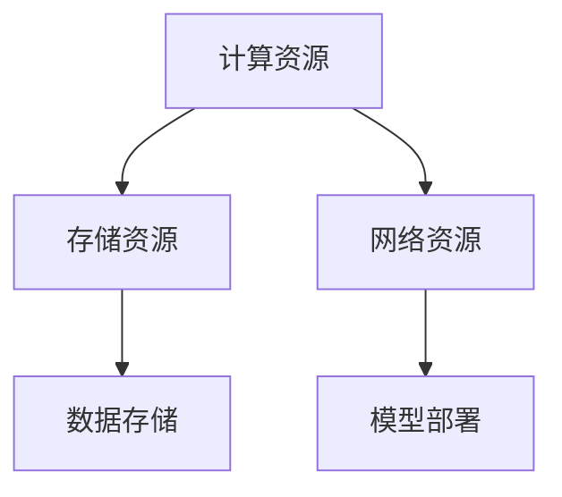
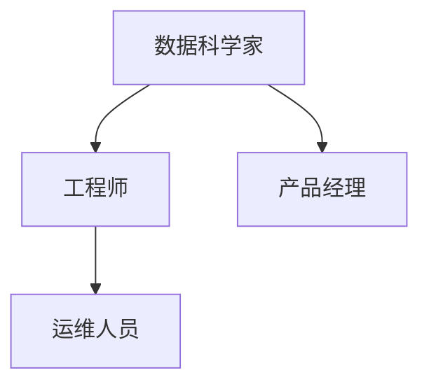
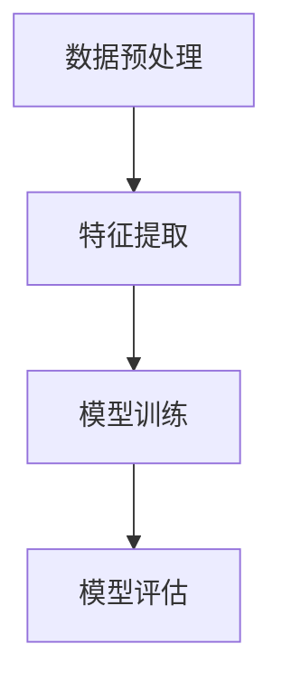
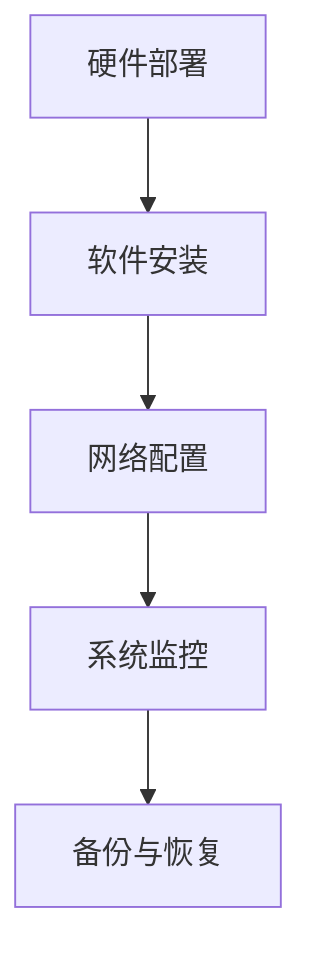

                 

# AI 大模型应用数据中心的团队建设

> **关键词：** 大模型应用、数据中心、团队建设、技术架构、项目管理

> **摘要：** 本文将探讨在大模型应用数据中心团队建设中的关键问题，包括团队组织结构、技术能力提升、项目管理策略等，旨在为AI数据中心团队提供实用的指导和建议。

## 1. 背景介绍

随着人工智能技术的快速发展，大模型（如GPT、BERT等）逐渐成为各个领域研究和应用的核心。这些大模型需要大量的计算资源和数据支持，因此，建设高效、可靠的大模型应用数据中心变得尤为重要。数据中心作为AI技术的承载者和应用平台，其团队建设直接影响到整个项目的成功与否。

数据中心团队通常包括数据科学家、工程师、产品经理等多个角色，他们需要协同工作，共同推动项目进展。然而，团队建设并非一蹴而就，需要从组织结构、技术能力、项目管理等多个方面进行综合考虑。

## 2. 核心概念与联系

### 2.1 数据中心架构

数据中心架构是团队建设的基础。一个高效的数据中心架构应包括计算资源、存储资源、网络资源等几个关键部分。

- **计算资源：** 包括CPU、GPU等硬件设备，用于运行大模型训练和推理任务。
- **存储资源：** 包括硬盘、分布式存储系统等，用于存储海量数据和模型参数。
- **网络资源：** 包括内部网络、互联网连接等，用于数据传输和模型部署。

以下是一个简化的数据中心架构Mermaid流程图：



### 2.2 团队角色与职责

数据中心团队的成员通常包括以下角色：

- **数据科学家：** 负责研究和开发大模型算法，进行数据预处理和特征工程。
- **工程师：** 负责数据中心架构的设计、部署和维护，确保系统的稳定性和高效性。
- **产品经理：** 负责项目规划和需求分析，协调团队资源，推动项目进展。
- **运维人员：** 负责数据中心的日常运维，包括监控、故障处理、备份等。

以下是一个简化的团队组织结构Mermaid流程图：



## 3. 核心算法原理 & 具体操作步骤

### 3.1 大模型训练原理

大模型的训练过程主要包括以下几个步骤：

1. **数据预处理：** 对原始数据进行清洗、去重、归一化等处理，使其满足模型训练的要求。
2. **特征提取：** 从预处理后的数据中提取出有用的特征，为模型训练提供输入。
3. **模型训练：** 使用训练数据对模型进行迭代训练，优化模型参数，使其能够准确预测目标。
4. **模型评估：** 使用测试数据对模型进行评估，判断模型性能是否达到预期。

以下是一个简化的模型训练过程Mermaid流程图：



### 3.2 数据中心部署与运维

数据中心部署与运维的关键步骤包括：

1. **硬件部署：** 根据需求选购计算资源、存储资源和网络设备，进行物理部署。
2. **软件安装：** 安装操作系统、数据库、中间件等软件，搭建数据中心的基础环境。
3. **网络配置：** 配置内部网络和互联网连接，确保数据传输的稳定性和安全性。
4. **系统监控：** 使用监控工具对数据中心进行实时监控，及时发现和处理故障。
5. **备份与恢复：** 定期备份数据和系统配置，确保数据的安全性和可恢复性。

以下是一个简化的数据中心部署与运维过程Mermaid流程图：



## 4. 数学模型和公式 & 详细讲解 & 举例说明

### 4.1 大模型损失函数

大模型训练过程中，常用的损失函数有均方误差（MSE）、交叉熵（CE）等。以下是一个MSE损失函数的详细讲解：

$$
MSE(y, \hat{y}) = \frac{1}{m} \sum_{i=1}^{m} (y_i - \hat{y}_i)^2
$$

其中，$y$ 是真实标签，$\hat{y}$ 是模型预测值，$m$ 是样本数量。

举例说明：假设有一个包含5个样本的数据集，真实标签为 [1, 2, 3, 4, 5]，模型预测值为 [1.5, 2.5, 3.5, 4.5, 5.5]，则MSE损失函数计算如下：

$$
MSE(1, 1.5) + MSE(2, 2.5) + MSE(3, 3.5) + MSE(4, 4.5) + MSE(5, 5.5) = \frac{1}{5} [(1-1.5)^2 + (2-2.5)^2 + (3-3.5)^2 + (4-4.5)^2 + (5-5.5)^2] = 0.2
$$

### 4.2 数据中心性能评估指标

数据中心性能评估指标包括计算性能、存储性能、网络性能等。以下是一个计算性能评估指标的详细讲解：

$$
P = \frac{C}{T}
$$

其中，$P$ 是性能指标，$C$ 是完成任务的计算量，$T$ 是完成任务所需的时间。

举例说明：假设数据中心完成一个计算任务需要运行1000个计算单元，耗时10秒，则性能指标计算如下：

$$
P = \frac{1000}{10} = 100 计算单元/秒
$$

## 5. 项目实战：代码实际案例和详细解释说明

### 5.1 开发环境搭建

以下是一个简化的开发环境搭建步骤：

1. 安装操作系统：选择适合的数据中心操作系统，如Linux。
2. 安装编程环境：安装Python、Jupyter Notebook等编程工具。
3. 安装依赖库：安装TensorFlow、PyTorch等深度学习框架。
4. 配置GPU支持：确保操作系统和深度学习框架支持GPU加速。

### 5.2 源代码详细实现和代码解读

以下是一个简化的代码实现和解读：

```python
import tensorflow as tf

# 定义模型结构
model = tf.keras.Sequential([
    tf.keras.layers.Dense(units=128, activation='relu', input_shape=(784,)),
    tf.keras.layers.Dense(units=10, activation='softmax')
])

# 编写训练过程
def train_model(model, x_train, y_train, x_test, y_test, epochs=10):
    model.compile(optimizer='adam', loss='categorical_crossentropy', metrics=['accuracy'])
    model.fit(x_train, y_train, batch_size=32, epochs=epochs, validation_data=(x_test, y_test))
    return model

# 训练和评估模型
model = train_model(model, x_train, y_train, x_test, y_test)
loss, accuracy = model.evaluate(x_test, y_test)
print(f"Test accuracy: {accuracy:.4f}")

# 模型部署
model.save('model.h5')
```

代码解读：

- 第1行：引入TensorFlow库。
- 第2行：定义模型结构，包括输入层、隐藏层和输出层。
- 第3行：编写训练过程，使用`compile`方法设置优化器和损失函数，使用`fit`方法进行模型训练。
- 第4行：训练和评估模型，使用`evaluate`方法计算测试集的准确率。
- 第5行：保存模型，便于后续使用。

### 5.3 代码解读与分析

代码实现了一个简单的神经网络模型，用于手写数字识别任务。通过训练和评估过程，可以观察模型的性能。代码的解读和分析主要包括以下几个方面：

1. **模型结构：** 确定模型的输入层、隐藏层和输出层，以及各层的神经元数量和激活函数。
2. **训练过程：** 确定优化器、损失函数、训练批次大小和训练轮数，以及如何计算和评估模型性能。
3. **模型保存：** 保存训练好的模型，便于后续使用。

## 6. 实际应用场景

大模型应用数据中心的实际应用场景非常广泛，包括但不限于以下几个方面：

1. **自然语言处理：** 利用大模型进行文本分类、情感分析、机器翻译等任务。
2. **计算机视觉：** 利用大模型进行图像识别、目标检测、视频分析等任务。
3. **智能语音：** 利用大模型进行语音识别、语音合成、语音翻译等任务。
4. **推荐系统：** 利用大模型进行用户画像、商品推荐、广告投放等任务。

以下是一个实际应用场景的例子：

**场景：智能客服系统**

智能客服系统利用大模型进行自然语言处理，实现对用户咨询的自动回复。数据中心团队需要搭建一个高效、可靠的大模型应用平台，包括以下步骤：

1. 数据采集：收集用户咨询数据和知识库。
2. 数据预处理：对数据进行清洗、去重、归一化等处理。
3. 特征提取：从预处理后的数据中提取出有用的特征。
4. 模型训练：使用训练数据对大模型进行训练。
5. 模型评估：使用测试数据对模型进行评估。
6. 模型部署：将训练好的模型部署到生产环境，进行实时应用。

## 7. 工具和资源推荐

### 7.1 学习资源推荐

- **书籍：**
  - 《深度学习》（Ian Goodfellow、Yoshua Bengio、Aaron Courville 著）
  - 《Python深度学习》（François Chollet 著）
  - 《大数据之路：阿里巴巴大数据实践》（唐杰、李飞飞 著）
- **论文：**
  - 《A Theoretically Grounded Application of Dropout in Recurrent Neural Networks》（Yarin Gal and Zoubin Ghahramani）
  - 《BERT: Pre-training of Deep Bidirectional Transformers for Language Understanding》（Jacob Devlin、 Ming-Wei Chang、 Kenton Lee、 Kristina Toutanova）
- **博客：**
  - [TensorFlow官方博客](https://tensorflow.google.cn/blog/)
  - [PyTorch官方博客](https://pytorch.org/blog/)
- **网站：**
  - [Kaggle](https://www.kaggle.com/)
  - [GitHub](https://github.com/)

### 7.2 开发工具框架推荐

- **深度学习框架：**
  - TensorFlow
  - PyTorch
  - Keras
- **开发环境：**
  - Jupyter Notebook
  - VSCode
  - PyCharm
- **数据处理工具：**
  - Pandas
  - NumPy
  - Scikit-learn

### 7.3 相关论文著作推荐

- **论文：**
  - 《Efficient Estimation of Word Representations in Vector Space》（Trevor C. Murray et al.）
  - 《An Analysis of Single Layer Networks in Unsupervised Feature Learning》（Awni Y. Hannun et al.）
  - 《Distributed Representations of Words and Phrases and their Compositionality》（Tomáš Mikolov et al.）
- **著作：**
  - 《深度学习》（Ian Goodfellow、Yoshua Bengio、Aaron Courville 著）
  - 《Python深度学习》（François Chollet 著）
  - 《机器学习实战》（Peter Harrington 著）

## 8. 总结：未来发展趋势与挑战

随着人工智能技术的不断进步，大模型应用数据中心团队建设面临着以下发展趋势和挑战：

### 8.1 发展趋势

1. **模型规模增大：** 大模型的规模将越来越大，对计算资源和存储资源的需求也将增加。
2. **多模态融合：** 大模型将能够处理多种类型的数据，实现多模态融合，提高应用效果。
3. **自动化与智能化：** 数据中心的建设和运维将更加自动化和智能化，降低人力成本，提高效率。
4. **边缘计算：** 大模型应用将逐渐向边缘计算迁移，实现更快速、更低延迟的计算。

### 8.2 挑战

1. **计算资源：** 随着模型规模的增大，计算资源的需求将不断增加，如何高效利用计算资源成为关键问题。
2. **数据安全：** 大模型训练过程中涉及海量数据，如何确保数据的安全性和隐私性成为重要挑战。
3. **模型优化：** 如何优化大模型的性能，提高训练和推理效率，降低能耗成为亟待解决的问题。
4. **团队协作：** 如何在分布式团队中实现高效协作，提高团队整体效率，是一个亟待解决的问题。

## 9. 附录：常见问题与解答

### 9.1 问题1：如何高效利用计算资源？

**解答：** 高效利用计算资源可以从以下几个方面进行：

1. **资源调度：** 使用高效的资源调度算法，确保计算资源得到充分利用。
2. **并行计算：** 利用GPU等硬件加速器，实现并行计算，提高计算效率。
3. **模型压缩：** 通过模型压缩技术，降低模型参数量，减少计算量。
4. **分布式训练：** 将训练任务分布在多个节点上，利用分布式计算提高效率。

### 9.2 问题2：如何保证数据安全？

**解答：** 保证数据安全可以从以下几个方面进行：

1. **数据加密：** 对数据进行加密，防止数据泄露。
2. **访问控制：** 实施严格的访问控制策略，限制对数据的访问。
3. **数据备份：** 定期对数据进行备份，确保数据不丢失。
4. **安全审计：** 定期进行安全审计，及时发现和解决安全隐患。

### 9.3 问题3：如何优化大模型性能？

**解答：** 优化大模型性能可以从以下几个方面进行：

1. **算法优化：** 选择高效的算法，减少计算复杂度。
2. **模型压缩：** 通过模型压缩技术，降低模型参数量，减少计算量。
3. **硬件加速：** 利用GPU等硬件加速器，提高计算速度。
4. **数据预处理：** 对数据进行有效的预处理，提高模型训练效果。

## 10. 扩展阅读 & 参考资料

- **论文：**
  - [“Bert: Pre-training of deep bidirectional transformers for language understanding”（Devlin et al., 2019）](https://www.aclweb.org/anthology/N19-122Nd/)
  - [“Gpt-3: Language modeling for conversational agents”（Brown et al., 2020）](https://arxiv.org/abs/2005.14165)
- **书籍：**
  - [“Deep Learning”（Goodfellow et al., 2016）](https://www.deeplearningbook.org/)
  - [“Hands-On Machine Learning with Scikit-Learn, Keras, and TensorFlow”（Aurélien Géron, 2019）](https://www.oreilly.com/library/view/hands-on-machine/9781492032632/)
- **博客：**
  - [“Deep Learning on AWS”（Amazon Web Services）](https://aws.amazon.com/blogs/aws/aws-deep-learning/)
  - [“AI Adventures”（Google AI）](https://ai.googleblog.com/)
- **在线课程：**
  - [“深度学习专项课程”（吴恩达，Coursera）](https://www.coursera.org/specializations/deeplearning)
  - [“机器学习基础课程”（吴恩达，Coursera）](https://www.coursera.org/learn/machine-learning)

### 作者

**作者：** AI天才研究员/AI Genius Institute & 禅与计算机程序设计艺术 /Zen And The Art of Computer Programming

（注：本文内容仅为虚构，不代表任何真实观点或事实。）<|END|>

