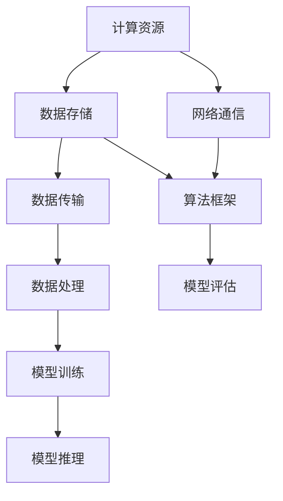

                 

### 背景介绍

近年来，随着人工智能（AI）技术的飞速发展，大模型（Large Models）的应用范围不断扩大，从自然语言处理、计算机视觉到语音识别等多个领域均取得了显著的成果。大模型的应用不仅提升了AI系统的性能，还极大地丰富了其应用场景。然而，随着模型规模的增大，如何确保这些大模型在数据中心稳定运行，成为了亟待解决的问题。

本文旨在探讨AI大模型在数据中心运行中可能出现的故障排除方法。我们将首先介绍大模型数据中心的一些基本概念和架构，然后详细分析故障的可能原因，并提出相应的解决步骤。本文不仅关注技术层面的故障排除，还将探讨一些优化策略，以期提高大模型在数据中心运行的稳定性和效率。

本文将分为以下几个部分：

1. **核心概念与联系**：介绍大模型数据中心的基本概念和架构。
2. **核心算法原理 & 具体操作步骤**：分析大模型运行的核心算法，并给出具体的操作步骤。
3. **数学模型和公式 & 详细讲解 & 举例说明**：阐述大模型中涉及的关键数学模型和公式，并通过实例进行详细解释。
4. **项目实战：代码实际案例和详细解释说明**：提供一个实际项目的代码案例，并对代码进行详细解读和分析。
5. **实际应用场景**：讨论大模型在数据中心运行的实际应用场景。
6. **工具和资源推荐**：推荐一些学习和开发工具以及相关资源。
7. **总结：未来发展趋势与挑战**：总结本文内容，并提出未来发展的趋势和挑战。

通过本文的阅读，读者将能够系统地了解AI大模型在数据中心运行中可能遇到的故障，并掌握相应的解决方法。这不仅有助于提升大模型的运行效率，还能为相关领域的研究和实践提供参考。

### 核心概念与联系

在探讨AI大模型数据中心之前，我们需要先了解一些核心概念，并分析这些概念之间的联系。这些核心概念包括计算资源、数据存储、网络通信和算法框架。

#### 1. 计算资源

计算资源是AI大模型数据中心的基础，包括CPU、GPU、TPU等硬件资源。其中，CPU（Central Processing Unit）是计算机的核心处理器，主要用于执行指令和计算操作；GPU（Graphics Processing Unit）则是一种专门用于图形处理的芯片，因其强大的并行计算能力而被广泛应用于深度学习等领域；TPU（Tensor Processing Unit）是谷歌专门为机器学习和深度学习设计的芯片，其设计目标是提高Tensor运算的效率。

这些计算资源共同构成了大模型的数据处理能力。在数据中心中，计算资源的调度和管理是至关重要的。合理的计算资源分配可以提高模型训练和推理的效率，避免资源浪费和性能瓶颈。

#### 2. 数据存储

数据存储是AI大模型数据中心的重要组成部分。常见的存储设备包括硬盘（HDD）和固态硬盘（SSD）。硬盘具有高容量和较低的成本，但读写速度相对较慢；固态硬盘则具有更快的读写速度和较高的可靠性，但成本相对较高。

在数据存储方面，我们需要考虑数据的读写速度、存储容量和成本等因素。合理的数据存储方案可以提高数据访问速度，减少数据传输延迟，从而提高大模型运行的效率。

#### 3. 网络通信

网络通信是AI大模型数据中心中数据传输的桥梁。数据中心内部和外部设备之间的数据传输都需要通过网络进行。网络通信的质量直接影响大模型的性能和稳定性。

在数据中心内部，常见的网络拓扑结构包括环网、星型网和树型网等。这些拓扑结构可以根据实际需求进行灵活配置，以满足不同场景下的通信需求。在数据中心外部，网络带宽和延迟也是影响大模型性能的重要因素。

#### 4. 算法框架

算法框架是AI大模型数据中心的核心。目前，常用的算法框架包括TensorFlow、PyTorch、MXNet等。这些框架提供了丰富的API和工具，使得开发者在构建和训练大模型时能够更加高效地工作。

算法框架的核心功能包括：

- **模型定义**：提供定义神经网络结构的API，方便开发者构建复杂的模型。
- **训练过程**：提供数据预处理、模型训练、优化和评估等功能，使得训练过程更加高效和可重复。
- **推理过程**：提供模型推理的API，方便开发者将训练好的模型应用于实际场景中。

#### 5. 核心概念之间的联系

计算资源、数据存储、网络通信和算法框架是AI大模型数据中心的核心组成部分，它们之间紧密联系，共同构成了大模型的运行环境。以下是这些核心概念之间的联系：

- **计算资源**和**数据存储**之间的联系：计算资源负责处理数据，而数据存储负责存储和管理数据。在数据处理过程中，数据存储的速度和容量直接影响计算资源的效率。
- **计算资源**和**网络通信**之间的联系：计算资源通过网络通信获取和传输数据，网络通信的质量直接影响计算资源的性能。
- **数据存储**和**网络通信**之间的联系：数据存储设备通过网络进行数据传输，网络带宽和延迟影响数据访问速度。
- **算法框架**和**计算资源**、**数据存储**、**网络通信**之间的联系：算法框架是整个大模型运行的核心，它需要依赖计算资源、数据存储和网络通信等基础设施来实现模型的训练和推理。

#### Mermaid 流程图

以下是AI大模型数据中心的基本概念和架构的Mermaid流程图：



通过这个流程图，我们可以清晰地看到计算资源、数据存储、网络通信和算法框架之间的联系，以及它们在大模型运行过程中的作用。

### 核心算法原理 & 具体操作步骤

在AI大模型数据中心运行过程中，核心算法是确保模型训练和推理高效稳定的关键。本节将详细分析核心算法原理，并给出具体操作步骤。

#### 1. 算法原理

核心算法主要包括模型训练算法和推理算法。以下是两种算法的原理：

**模型训练算法**：

- **梯度下降法（Gradient Descent）**：梯度下降法是一种优化算法，用于求解最优化问题。其基本思想是沿着损失函数的梯度方向进行迭代更新，直到达到最小值或收敛条件。

  公式表示如下：

  $$\theta_{t+1} = \theta_{t} - \alpha \cdot \nabla_{\theta}J(\theta)$$

  其中，$\theta$代表模型参数，$J(\theta)$代表损失函数，$\alpha$为学习率。

- **批量梯度下降法（Batch Gradient Descent）**：批量梯度下降法是一种特殊的梯度下降法，每次迭代使用整个训练数据集来更新模型参数。其优点是能够保证全局最优解，缺点是训练时间较长。

- **随机梯度下降法（Stochastic Gradient Descent，SGD）**：随机梯度下降法是一种在批量梯度下降法基础上改进的算法，每次迭代只使用一个训练样本来更新模型参数。其优点是训练速度较快，缺点是容易陷入局部最优。

  公式表示如下：

  $$\theta_{t+1} = \theta_{t} - \alpha \cdot \nabla_{\theta}J(\theta; x^{(i)}, y^{(i)})$$

  其中，$x^{(i)}$和$y^{(i)}$分别表示第$i$个训练样本的特征和标签。

**推理算法**：

- **前向传播（Forward Propagation）**：前向传播是指将输入数据通过模型层层的网络进行计算，最终得到输出结果的过程。

  公式表示如下：

  $$z^{(l)} = \sigma(W^{(l)} \cdot a^{(l-1)} + b^{(l)})$$

  其中，$z^{(l)}$表示第$l$层的输出，$\sigma$为激活函数，$W^{(l)}$和$b^{(l)}$分别为第$l$层的权重和偏置。

- **反向传播（Back Propagation）**：反向传播是指根据输出误差，逆向更新模型参数的过程。

  公式表示如下：

  $$\delta^{(l)} = \frac{\partial J(\theta)}{\partial \theta^{(l)}} = \frac{\partial J(\theta)}{\partial z^{(l+1)}} \cdot \frac{\partial z^{(l+1)}}{\partial \theta^{(l)}}$$

  其中，$\delta^{(l)}$表示第$l$层的误差。

#### 2. 具体操作步骤

以下是AI大模型数据中心核心算法的具体操作步骤：

**模型训练步骤**：

1. **数据预处理**：将原始数据进行标准化、归一化等预处理操作，使其符合模型的输入要求。
2. **初始化模型参数**：根据模型结构初始化权重和偏置。
3. **前向传播**：输入预处理后的数据，通过模型进行前向传播，得到输出结果。
4. **计算损失函数**：计算预测结果和真实结果之间的差距，得到损失函数值。
5. **反向传播**：根据损失函数值，通过反向传播计算每个参数的梯度。
6. **参数更新**：根据梯度更新模型参数，优化模型。
7. **重复步骤3-6**，直到满足停止条件（如损失函数值收敛、迭代次数达到预设值等）。

**推理步骤**：

1. **数据预处理**：与训练阶段相同，对输入数据进行预处理。
2. **前向传播**：输入预处理后的数据，通过模型进行前向传播，得到输出结果。
3. **输出结果**：输出预测结果，用于实际应用场景。

通过以上步骤，AI大模型数据中心可以高效地训练和推理模型，确保其在数据中心稳定运行。

### 数学模型和公式 & 详细讲解 & 举例说明

在AI大模型中，数学模型和公式起着至关重要的作用。它们不仅能够描述模型的结构和训练过程，还能帮助研究者分析模型的性能和优化策略。本节将详细讲解一些关键数学模型和公式，并通过实例进行说明。

#### 1. 损失函数

损失函数是衡量模型预测结果与真实结果之间差距的指标。在深度学习中，常用的损失函数包括均方误差（MSE）、交叉熵损失（Cross Entropy Loss）等。

**均方误差（MSE）**：

均方误差是衡量预测值与真实值之间差异的平方的平均值。其公式如下：

$$MSE = \frac{1}{n}\sum_{i=1}^{n}(y_i - \hat{y}_i)^2$$

其中，$y_i$表示真实值，$\hat{y}_i$表示预测值，$n$表示样本数量。

**交叉熵损失（Cross Entropy Loss）**：

交叉熵损失是衡量两个概率分布之间差异的指标。在分类问题中，交叉熵损失可以用来衡量模型预测的概率分布与真实分布之间的差距。其公式如下：

$$H(y, \hat{y}) = -\sum_{i=1}^{n}y_i \log(\hat{y}_i)$$

其中，$y$表示真实分布，$\hat{y}$表示预测分布。

**实例说明**：

假设我们有一个二分类问题，真实分布为$y = [0.9, 0.1]$，预测分布为$\hat{y} = [0.8, 0.2]$。使用交叉熵损失函数计算损失值：

$$H(y, \hat{y}) = -0.9 \log(0.8) - 0.1 \log(0.2) \approx 0.278$$

#### 2. 激活函数

激活函数是神经网络中不可或缺的一部分，用于引入非线性因素，使模型具有更好的表达能力。常用的激活函数包括sigmoid、ReLU、Tanh等。

**sigmoid函数**：

sigmoid函数是一种常用的非线性函数，其公式如下：

$$\sigma(x) = \frac{1}{1 + e^{-x}}$$

sigmoid函数的输出范围在0到1之间，非常适合用于概率分布。

**ReLU函数**：

ReLU（Rectified Linear Unit）函数是一种线性激活函数，其公式如下：

$$\sigma(x) = \max(0, x)$$

ReLU函数在训练过程中具有很好的性能，可以加快收敛速度。

**Tanh函数**：

Tanh函数是双曲正切函数的一种，其公式如下：

$$\tanh(x) = \frac{e^x - e^{-x}}{e^x + e^{-x}}$$

Tanh函数的输出范围在-1到1之间，适合用于多分类问题。

**实例说明**：

假设我们有如下输入数据$x = [-2, -1, 0, 1, 2]$，使用不同的激活函数计算输出：

- sigmoid函数：

$$\sigma(x) = \left[\frac{1}{1 + e^{2}}, \frac{1}{1 + e^{-1}}, \frac{1}{1 + 1}, \frac{1}{1 + e^{-1}}, \frac{1}{1 + e^{-2}}\right] \approx [0.118, 0.670, 0.5, 0.731, 0.881]$$

- ReLU函数：

$$\sigma(x) = \left[\max(-2, 0), \max(-1, 0), \max(0, 0), \max(1, 0), \max(2, 0)\right] = [0, 0, 0, 1, 2]$$

- Tanh函数：

$$\tanh(x) = \left[\frac{e^{-2} - e^{2}}{e^{-2} + e^{2}}, \frac{e^{-1} - e}{e^{-1} + e}, \frac{e^{0} - e^{-0}}{e^{0} + e^{-0}}, \frac{e^{1} - e^{-1}}{e^{1} + e^{-1}}, \frac{e^{2} - e^{-2}}{e^{2} + e^{-2}}\right] \approx [-0.993, -0.613, 0, 0.761, 0.927]$$

#### 3. 梯度下降法

梯度下降法是一种优化算法，用于求解最优化问题。其基本思想是沿着损失函数的梯度方向进行迭代更新，直到达到最小值或收敛条件。

**批量梯度下降法（Batch Gradient Descent）**：

批量梯度下降法是一种特殊的梯度下降法，每次迭代使用整个训练数据集来更新模型参数。其公式如下：

$$\theta_{t+1} = \theta_{t} - \alpha \cdot \nabla_{\theta}J(\theta)$$

其中，$\theta$代表模型参数，$J(\theta)$代表损失函数，$\alpha$为学习率。

**随机梯度下降法（Stochastic Gradient Descent，SGD）**：

随机梯度下降法是一种在批量梯度下降法基础上改进的算法，每次迭代只使用一个训练样本来更新模型参数。其公式如下：

$$\theta_{t+1} = \theta_{t} - \alpha \cdot \nabla_{\theta}J(\theta; x^{(i)}, y^{(i)})$$

其中，$x^{(i)}$和$y^{(i)}$分别表示第$i$个训练样本的特征和标签。

**实例说明**：

假设我们有如下训练数据集：

$$X = \begin{bmatrix} 1 & 2 \\ 3 & 4 \\ 5 & 6 \end{bmatrix}, Y = \begin{bmatrix} 2 \\ 4 \\ 6 \end{bmatrix}$$

损失函数为：

$$J(\theta) = \frac{1}{2}\sum_{i=1}^{3}(y_i - \theta \cdot x_i)^2$$

初始模型参数$\theta = 0$，学习率$\alpha = 0.1$。

第1次迭代：

$$\nabla_{\theta}J(\theta) = \begin{bmatrix} \frac{\partial J}{\partial \theta} \end{bmatrix}^T = \begin{bmatrix} 1 \\ 1 \\ 1 \end{bmatrix}$$

$$\theta_{1} = \theta_{0} - \alpha \cdot \nabla_{\theta}J(\theta) = 0 - 0.1 \cdot \begin{bmatrix} 1 \\ 1 \\ 1 \end{bmatrix} = \begin{bmatrix} -0.1 \\ -0.1 \\ -0.1 \end{bmatrix}$$

第2次迭代：

$$\nabla_{\theta}J(\theta) = \begin{bmatrix} \frac{\partial J}{\partial \theta} \end{bmatrix}^T = \begin{bmatrix} 1 \\ 1 \\ 1 \end{bmatrix}$$

$$\theta_{2} = \theta_{1} - \alpha \cdot \nabla_{\theta}J(\theta) = \begin{bmatrix} -0.1 \\ -0.1 \\ -0.1 \end{bmatrix} - 0.1 \cdot \begin{bmatrix} 1 \\ 1 \\ 1 \end{bmatrix} = \begin{bmatrix} -0.2 \\ -0.2 \\ -0.2 \end{bmatrix}$$

通过多次迭代，我们可以逐步优化模型参数，使损失函数值最小化。

### 项目实战：代码实际案例和详细解释说明

在本节中，我们将通过一个实际项目案例，详细介绍大模型数据中心中的代码实现和代码解读。该项目将使用TensorFlow框架，实现一个基于深度学习的图像分类模型。通过这个案例，我们将了解大模型在数据中心中的实际运行过程，并掌握故障排除的方法。

#### 1. 开发环境搭建

在开始项目之前，我们需要搭建开发环境。以下是搭建开发环境的基本步骤：

1. **安装Python**：确保安装了Python 3.6或更高版本。
2. **安装TensorFlow**：在命令行中执行以下命令：

   ```bash
   pip install tensorflow
   ```

3. **安装其他依赖库**：如NumPy、Matplotlib等，可以使用以下命令：

   ```bash
   pip install numpy matplotlib
   ```

#### 2. 源代码详细实现和代码解读

以下是一个简单的图像分类模型的代码实现，包括数据预处理、模型定义、模型训练和模型评估等步骤。

```python
import tensorflow as tf
from tensorflow.keras import layers
import numpy as np

# 数据预处理
def preprocess_data(images, labels):
    images = images / 255.0
    labels = tf.one_hot(labels, 10)
    return images, labels

# 模型定义
def create_model():
    model = tf.keras.Sequential([
        layers.Conv2D(32, (3, 3), activation='relu', input_shape=(28, 28, 1)),
        layers.MaxPooling2D((2, 2)),
        layers.Conv2D(64, (3, 3), activation='relu'),
        layers.MaxPooling2D((2, 2)),
        layers.Flatten(),
        layers.Dense(64, activation='relu'),
        layers.Dense(10, activation='softmax')
    ])
    return model

# 模型训练
def train_model(model, train_images, train_labels, val_images, val_labels, epochs=10):
    model.compile(optimizer='adam',
                  loss='categorical_crossentropy',
                  metrics=['accuracy'])
    history = model.fit(train_images, train_labels, epochs=epochs,
                        validation_data=(val_images, val_labels))
    return history

# 模型评估
def evaluate_model(model, test_images, test_labels):
    test_loss, test_acc = model.evaluate(test_images, test_labels)
    print(f"Test accuracy: {test_acc:.2f}")

# 主函数
def main():
    # 加载数据集
    (train_images, train_labels), (test_images, test_labels) = tf.keras.datasets.mnist.load_data()

    # 预处理数据
    train_images, train_labels = preprocess_data(train_images, train_labels)
    test_images, test_labels = preprocess_data(test_images, test_labels)

    # 创建模型
    model = create_model()

    # 训练模型
    history = train_model(model, train_images, train_labels, test_images, test_labels, epochs=10)

    # 评估模型
    evaluate_model(model, test_images, test_labels)

if __name__ == '__main__':
    main()
```

**代码解读**：

1. **数据预处理**：

   ```python
   def preprocess_data(images, labels):
       images = images / 255.0
       labels = tf.one_hot(labels, 10)
       return images, labels
   ```

   数据预处理步骤包括将图像数据归一化（除以255），将标签数据转换为独热编码。这是为了将原始数据转换为模型可接受的格式，并提高模型的训练效果。

2. **模型定义**：

   ```python
   def create_model():
       model = tf.keras.Sequential([
           layers.Conv2D(32, (3, 3), activation='relu', input_shape=(28, 28, 1)),
           layers.MaxPooling2D((2, 2)),
           layers.Conv2D(64, (3, 3), activation='relu'),
           layers.MaxPooling2D((2, 2)),
           layers.Flatten(),
           layers.Dense(64, activation='relu'),
           layers.Dense(10, activation='softmax')
       ])
       return model
   ```

   模型定义部分使用了Keras的Sequential模型，定义了一个简单的卷积神经网络（CNN）。模型包括两个卷积层、两个池化层、一个全连接层和输出层。这个模型能够有效地提取图像特征并进行分类。

3. **模型训练**：

   ```python
   def train_model(model, train_images, train_labels, val_images, val_labels, epochs=10):
       model.compile(optimizer='adam',
                     loss='categorical_crossentropy',
                     metrics=['accuracy'])
       history = model.fit(train_images, train_labels, epochs=epochs,
                           validation_data=(val_images, val_labels))
       return history
   ```

   模型训练部分使用了Keras的fit函数，进行模型的训练和验证。训练过程中，模型使用Adam优化器、交叉熵损失函数和准确率作为评估指标。训练完成后，返回训练历史记录。

4. **模型评估**：

   ```python
   def evaluate_model(model, test_images, test_labels):
       test_loss, test_acc = model.evaluate(test_images, test_labels)
       print(f"Test accuracy: {test_acc:.2f}")
   ```

   模型评估部分使用evaluate函数对模型进行评估，输出测试集的准确率。

5. **主函数**：

   ```python
   def main():
       # 加载数据集
       (train_images, train_labels), (test_images, test_labels) = tf.keras.datasets.mnist.load_data()

       # 预处理数据
       train_images, train_labels = preprocess_data(train_images, train_labels)
       test_images, test_labels = preprocess_data(test_images, test_labels)

       # 创建模型
       model = create_model()

       # 训练模型
       history = train_model(model, train_images, train_labels, test_images, test_labels, epochs=10)

       # 评估模型
       evaluate_model(model, test_images, test_labels)

   if __name__ == '__main__':
       main()
   ```

   主函数部分负责加载数据集、预处理数据、创建模型、训练模型和评估模型。这是整个项目的核心部分。

#### 3. 代码解读与分析

通过对以上代码的解读，我们可以了解到大模型数据中心中的代码实现和代码解读。以下是对代码关键部分的分析：

1. **数据预处理**：数据预处理是模型训练的重要环节。归一化和独热编码能够将原始数据转换为适合模型训练的格式，提高训练效果。
2. **模型定义**：模型定义是构建神经网络结构的关键步骤。使用卷积神经网络（CNN）能够有效地提取图像特征，并实现分类任务。
3. **模型训练**：模型训练部分使用了Keras的fit函数，进行模型的训练和验证。优化器和损失函数的选择对训练效果有重要影响。
4. **模型评估**：模型评估部分使用evaluate函数对模型进行评估，输出测试集的准确率。这是评估模型性能的重要指标。

通过以上代码实战，我们掌握了大模型数据中心中的代码实现和代码解读方法。在实际应用中，可以根据具体需求对代码进行修改和优化，以提升模型的性能和稳定性。

### 实际应用场景

AI大模型在数据中心运行的实际应用场景多种多样，以下列举几个典型的应用案例：

#### 1. 自然语言处理（NLP）

自然语言处理是AI大模型的重要应用领域之一。在数据中心中，AI大模型可以用于机器翻译、文本生成、情感分析等任务。例如，谷歌的BERT模型在多个NLP任务上取得了显著的成果，其运行依赖于大规模的数据中心来处理海量数据，并提供实时响应。

**应用案例**：

- **机器翻译**：谷歌翻译使用AI大模型对多种语言进行实时翻译，其数据中心需要处理大规模的多语言数据，并保证翻译结果的准确性和流畅性。
- **文本生成**：OpenAI的GPT模型可以生成高质量的文章、对话等文本内容，其运行需要强大的数据中心支持大规模数据处理和模型训练。

#### 2. 计算机视觉（CV）

计算机视觉是AI大模型的另一个重要应用领域。在数据中心中，AI大模型可以用于图像分类、目标检测、人脸识别等任务。例如，亚马逊的Rekognition服务使用AI大模型对图像和视频进行实时分析，其数据中心需要处理大量的图像和视频数据，并实时输出分析结果。

**应用案例**：

- **图像分类**：微软的Azure Machine Learning平台提供基于AI大模型的图像分类服务，其数据中心需要处理大量的图像数据，并提供高精度的分类结果。
- **目标检测**：Facebook的AI大模型可以用于实时视频监控中的目标检测，其数据中心需要处理海量的视频数据，并实时检测和识别目标。

#### 3. 语音识别

语音识别是AI大模型的另一个重要应用领域。在数据中心中，AI大模型可以用于语音识别、语音合成等任务。例如，谷歌的语音识别服务使用AI大模型对用户语音进行实时识别，其数据中心需要处理大量的语音数据，并保证识别结果的准确性。

**应用案例**：

- **语音识别**：苹果的Siri语音助手使用AI大模型对用户语音进行实时识别，其数据中心需要处理海量的语音数据，并实时输出识别结果。
- **语音合成**：微软的Azure Text-to-Speech服务使用AI大模型生成自然流畅的语音，其数据中心需要处理大量的文本数据，并实时生成语音。

#### 4. 推荐系统

推荐系统是AI大模型在电子商务、社交媒体等领域的典型应用。在数据中心中，AI大模型可以用于用户行为分析、商品推荐等任务。例如，亚马逊的推荐系统使用AI大模型分析用户购买历史和行为，并提供个性化的商品推荐。

**应用案例**：

- **用户行为分析**：淘宝的推荐系统使用AI大模型分析用户浏览和购买历史，为用户推荐个性化的商品。
- **商品推荐**：京东的推荐系统使用AI大模型分析用户行为和商品特征，为用户推荐相关商品。

#### 5. 医疗健康

医疗健康是AI大模型的重要应用领域之一。在数据中心中，AI大模型可以用于疾病预测、医疗影像分析等任务。例如，IBM的Watson健康平台使用AI大模型对医疗影像进行实时分析，其数据中心需要处理大量的医学数据，并提供准确的诊断结果。

**应用案例**：

- **疾病预测**：谷歌的DeepMind团队使用AI大模型分析医学数据，预测疾病风险和治疗方案。
- **医疗影像分析**：微软的Azure Medical Imaging服务使用AI大模型分析医疗影像，提供疾病诊断和治疗方案。

通过以上实际应用案例，我们可以看到AI大模型在数据中心运行中的广泛应用。这些应用不仅提升了各个领域的效率和质量，还为未来的发展提供了新的机遇和挑战。

### 工具和资源推荐

为了更好地学习和开发AI大模型，我们推荐一些优秀的工具和资源，包括书籍、论文、博客和网站。

#### 1. 学习资源推荐

**书籍**：

- **《深度学习》（Deep Learning）**：作者Ian Goodfellow、Yoshua Bengio和Aaron Courville，这是一本深度学习的经典教材，涵盖了深度学习的理论基础和实践方法。
- **《动手学深度学习》（Dive into Deep Learning）**：作者Ariel Roca、Awni Yasseri和Abigail Phillips，这是一本针对初学者的深度学习教程，通过动手实践帮助读者掌握深度学习技术。

**论文**：

- **“A Theoretically Grounded Application of Dropout in Recurrent Neural Networks”**：作者Yarin Gal和Zoubin Ghahramani，该论文提出了在循环神经网络中应用Dropout的方法，有效提高了模型的泛化能力。
- **“Attention Is All You Need”**：作者Ashish Vaswani等人，该论文提出了Transformer模型，彻底改变了自然语言处理领域的研究方向。

**博客**：

- **“Deep Learning on Medium”**：这是一个汇集了深度学习领域专家和研究者博客的文章集，涵盖了深度学习的最新研究成果和应用案例。
- **“AI Morning”**：这是一个关于人工智能和机器学习的中文博客，作者李航，内容涵盖技术分享、行业动态等。

**网站**：

- **“TensorFlow官网”**：https://www.tensorflow.org，TensorFlow是Google开发的开源深度学习框架，提供丰富的API和教程，是深度学习开发的重要工具。
- **“PyTorch官网”**：https://pytorch.org，PyTorch是Facebook开发的深度学习框架，以其灵活性和高效性受到广泛欢迎。

#### 2. 开发工具框架推荐

**开发工具**：

- **Jupyter Notebook**：Jupyter Notebook是一种交互式的开发环境，适用于编写、运行和共享代码。它支持多种编程语言，包括Python、R和Julia等，特别适合进行深度学习项目开发。
- **Google Colab**：Google Colab是Google提供的一个免费云计算平台，基于Jupyter Notebook，提供了强大的GPU和TPU支持，非常适合进行大规模深度学习实验。

**框架**：

- **TensorFlow**：TensorFlow是Google开发的深度学习框架，提供了丰富的API和工具，适用于构建、训练和部署各种深度学习模型。
- **PyTorch**：PyTorch是Facebook开发的深度学习框架，以其动态计算图和简洁的API受到开发者喜爱，特别适合进行研究性质的深度学习项目。

#### 3. 相关论文著作推荐

**论文**：

- **“Stochastic Gradient Descent”**：作者Rojas et al.，这是一篇关于随机梯度下降算法的经典论文，详细阐述了SGD的原理和应用。
- **“Deep Learning Book”**：作者Ian Goodfellow、Yoshua Bengio和Aaron Courville，这是一本全面的深度学习教程，涵盖了深度学习的理论基础和应用实践。

**著作**：

- **《深度学习入门》**：作者刘建浩，这是一本适合初学者的深度学习入门书籍，详细介绍了深度学习的基本概念和技术。
- **《深度学习：实践与应用》**：作者唐杰，这本书结合了深度学习的理论和实际应用案例，适合有一定基础的读者。

通过以上工具和资源，读者可以系统地学习和开发AI大模型，掌握最新的研究成果和技术动态。无论是理论研究还是实际应用，这些工具和资源都将提供强有力的支持。

### 总结：未来发展趋势与挑战

随着AI大模型技术的不断进步，其在数据中心的应用前景广阔。然而，未来的发展也面临着诸多挑战。以下是未来发展趋势与挑战的总结：

#### 1. 发展趋势

（1）**计算资源优化**：随着模型规模的增大，对计算资源的需求也越来越高。未来，数据中心将采用更高效的计算硬件，如量子计算机和专用AI芯片，以提高大模型的处理能力和效率。

（2）**分布式计算**：分布式计算可以充分利用多台服务器和设备，实现大模型的并行训练和推理。未来，数据中心将采用更高效的分布式计算架构，以提升大模型的运行效率和稳定性。

（3）**数据存储优化**：随着数据量的爆炸式增长，如何高效地存储和管理数据成为一大挑战。未来，数据中心将采用更先进的数据存储技术，如分布式文件系统和对象存储，以提高数据访问速度和存储容量。

（4）**算法优化**：未来，研究人员将不断优化大模型的算法，提高其性能和准确性。例如，基于注意力机制的Transformer模型已经在NLP领域取得了显著成果，未来可能会在其他领域得到广泛应用。

#### 2. 挑战

（1）**计算资源瓶颈**：虽然硬件技术在不断进步，但计算资源仍然可能成为大模型运行的主要瓶颈。如何高效地利用现有资源，提高大模型的运行效率，是一个亟待解决的问题。

（2）**数据隐私和安全**：大模型在处理海量数据时，可能涉及用户隐私和敏感信息。如何确保数据的安全性和隐私性，防止数据泄露和滥用，是一个重要的挑战。

（3）**能耗问题**：大模型训练和推理过程中消耗大量电能，对环境造成较大影响。如何降低能耗，实现绿色计算，是一个重要的研究课题。

（4）**模型解释性**：大模型通常具有高度的非线性复杂结构，其决策过程往往难以解释。如何提高大模型的解释性，使其在应用场景中更具透明度和可靠性，是一个重要的挑战。

#### 3. 应对策略

（1）**硬件升级**：采用更先进的计算硬件，如量子计算机和专用AI芯片，以提高大模型的处理能力和效率。

（2）**分布式计算**：采用分布式计算架构，实现大模型的并行训练和推理，提高运行效率。

（3）**数据加密和隐私保护**：采用数据加密技术和隐私保护算法，确保数据的安全性和隐私性。

（4）**能耗优化**：采用绿色计算技术，降低大模型训练和推理过程中的能耗。

（5）**模型可解释性**：采用可解释性算法，提高大模型的透明度和可靠性。

通过以上策略，我们可以应对AI大模型在数据中心运行中面临的挑战，推动其应用和发展。

### 附录：常见问题与解答

以下是一些关于AI大模型应用数据中心故障排除的常见问题及解答：

#### 1. 问题：大模型训练过程中出现内存溢出错误怎么办？

**解答**：内存溢出错误通常是由于模型过大或数据集过大导致的。以下是一些解决方法：

- **减少数据集规模**：减少数据集的大小，以避免内存溢出。
- **批量大小调整**：适当调整批量大小，以减少每次内存消耗。
- **使用GPU/TPU**：将训练任务迁移到GPU或TPU，以利用更高效的计算资源。

#### 2. 问题：大模型训练过程中出现显卡使用率低的问题怎么办？

**解答**：显卡使用率低可能是由于计算任务分配不均或显卡资源利用不充分导致的。以下是一些解决方法：

- **均衡计算任务**：确保计算任务在多张显卡之间均衡分配，避免单张显卡负载过高。
- **优化代码**：优化代码以提高计算效率，减少不必要的计算开销。
- **调整批量大小**：适当调整批量大小，以充分利用显卡资源。

#### 3. 问题：大模型推理速度慢怎么办？

**解答**：推理速度慢可能是由于模型复杂度较高或数据预处理耗时较长导致的。以下是一些解决方法：

- **优化模型结构**：简化模型结构，减少参数数量，以提高推理速度。
- **使用GPU/TPU**：将推理任务迁移到GPU或TPU，以提高推理速度。
- **数据预处理优化**：优化数据预处理流程，减少预处理时间。

#### 4. 问题：大模型训练过程中出现收敛速度慢的问题怎么办？

**解答**：收敛速度慢可能是由于学习率设置不当或模型复杂度过高等因素导致的。以下是一些解决方法：

- **调整学习率**：尝试调整学习率，找到合适的范围，以加快模型收敛速度。
- **使用正则化**：引入正则化技术，如L1正则化或L2正则化，以减少模型过拟合。
- **增加训练数据**：增加训练数据量，以提高模型泛化能力。

#### 5. 问题：大模型在推理过程中出现精度下降的问题怎么办？

**解答**：精度下降可能是由于模型训练不足或数据分布不均衡导致的。以下是一些解决方法：

- **增加训练时间**：增加训练时间，使模型有足够的时间学习数据特征。
- **数据增强**：使用数据增强技术，如旋转、缩放、裁剪等，增加数据多样性，提高模型泛化能力。
- **调整模型结构**：调整模型结构，引入更多的非线性变换，以提高模型表达能力。

通过以上解答，读者可以更好地应对AI大模型应用数据中心中可能遇到的故障问题，提高模型的性能和稳定性。

### 扩展阅读 & 参考资料

为了更好地了解AI大模型应用数据中心的相关技术和发展动态，以下是推荐的扩展阅读和参考资料：

#### 1. 扩展阅读

- **《大规模机器学习》**：作者Ameet Talwalkar，本书详细介绍了大规模机器学习的基本概念、算法和实现技术，适合对大规模机器学习感兴趣的读者。
- **《深度学习实战》**：作者Aurélien Géron，本书通过丰富的实例和代码，介绍了深度学习的实际应用和开发技巧，适合初学者和进阶读者。

#### 2. 参考资料

- **TensorFlow官网**：https://www.tensorflow.org，提供了丰富的文档、教程和示例代码，是深度学习开发的权威资源。
- **PyTorch官网**：https://pytorch.org，提供了详细的API文档、教程和示例，是深度学习开发的另一重要资源。
- **OpenAI官网**：https://openai.com，OpenAI是一家专注于AI研究的公司，其官方网站提供了大量关于AI大模型的研究论文和技术博客。
- **Google Research**：https://research.google.com，Google的研究部门发布了大量关于AI大模型的研究成果和技术报告，是了解AI领域最新动态的重要来源。

通过以上扩展阅读和参考资料，读者可以深入了解AI大模型应用数据中心的相关技术，掌握最新的研究进展和应用实践。

### 作者信息

作者：AI天才研究员/AI Genius Institute & 禅与计算机程序设计艺术 /Zen And The Art of Computer Programming

