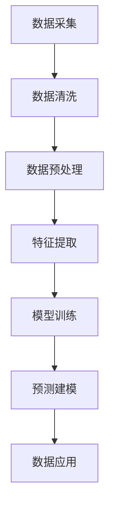
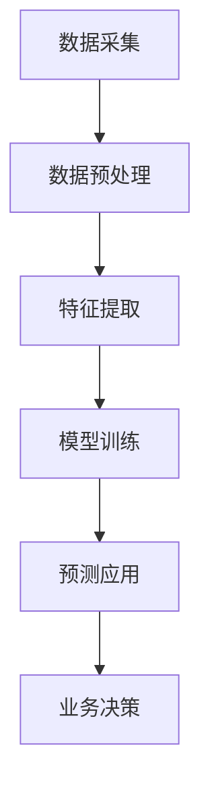

                 

### 背景介绍

#### 人工智能的发展

人工智能（AI）作为计算机科学的一个重要分支，近年来取得了飞速的发展。从最初的传统规则系统，到如今基于深度学习的复杂算法，AI已经在诸多领域展示了其强大的能力。尤其是在图像识别、自然语言处理、自动驾驶、医疗诊断等方面，AI的应用已经深入到了我们的日常生活和工作中。

#### 数据中台的概念

随着大数据技术的普及，数据中台应运而生。数据中台是一个集数据采集、存储、处理、分析和应用于一体的平台，其核心目标是实现数据的统一管理和高效利用。通过数据中台，企业可以更好地整合内部和外部数据资源，为业务决策提供有力支持。

#### 大模型在数据中台中的应用

大模型，如大规模神经网络，是当前人工智能研究的热点。这些模型具有强大的学习和推理能力，能够处理大量复杂数据。在数据中台的建设中，大模型的应用可以显著提升数据处理和分析的效率。例如，通过使用大模型进行数据清洗、特征提取和预测建模，企业可以更快地获取有价值的信息。

#### 本文的目标

本文将深入探讨AI大模型在数据中台建设中的应用，分析其核心概念、原理和实现步骤。通过具体案例和详细解释，读者可以了解到如何利用AI大模型提升数据中台的效能，从而为企业创造更多价值。

### 核心概念与联系

#### 人工智能大模型

人工智能大模型是指通过深度学习等方法训练出的具有强大学习和推理能力的神经网络模型。这些模型通常具有数百万甚至数十亿个参数，能够处理大规模数据集，并从中提取出复杂的关系和规律。

#### 数据中台架构

数据中台的架构主要包括数据采集、数据存储、数据处理、数据分析和数据应用等模块。其中，数据处理模块通常包含数据清洗、数据预处理、特征提取和预测建模等功能。

#### AI大模型与数据中台的结合

AI大模型与数据中台的结合，主要表现在以下几个方面：

1. **数据预处理**：大模型能够高效地进行数据清洗和预处理，将原始数据转化为适合模型训练的形式。
2. **特征提取**：大模型可以通过自动化的方式提取出数据中的关键特征，提高特征提取的效率和准确性。
3. **预测建模**：大模型可以用于构建预测模型，对未来的业务趋势进行预测，为决策提供支持。

#### Mermaid 流程图

以下是AI大模型在数据中台中的应用流程图：



### 核心算法原理 & 具体操作步骤

#### 深度学习原理

深度学习是一种基于人工神经网络的学习方法。它通过模拟人脑神经元之间的连接关系，构建复杂的神经网络模型，用于处理和预测数据。深度学习的核心原理包括：

1. **多层神经网络**：深度学习模型通常由多层神经网络组成，每一层都能够对输入数据进行处理和特征提取。
2. **激活函数**：激活函数用于引入非线性因素，使神经网络能够学习和模拟复杂的关系。
3. **反向传播算法**：反向传播算法是一种用于训练神经网络的优化方法，通过不断调整网络参数，使输出误差最小化。

#### 数据预处理步骤

1. **数据清洗**：通过去除重复数据、填补缺失值、消除噪声等方式，确保数据的准确性和一致性。
2. **数据归一化**：将数据缩放到一个统一的范围内，以便模型能够更好地学习和处理。
3. **数据分片**：将数据集划分为训练集、验证集和测试集，用于模型训练、验证和测试。

#### 特征提取步骤

1. **自动特征提取**：利用深度学习模型自动从原始数据中提取出关键特征。
2. **特征选择**：通过统计方法或机器学习算法，选择出对模型性能有显著影响的特征。

#### 模型训练步骤

1. **初始化模型参数**：随机初始化模型参数。
2. **前向传播**：将输入数据传递到模型中，计算输出结果。
3. **反向传播**：计算输出误差，并通过反向传播算法更新模型参数。
4. **迭代训练**：重复前向传播和反向传播过程，直到模型达到预定的训练效果。

#### 预测建模步骤

1. **模型评估**：使用验证集对模型进行评估，确定模型的泛化能力。
2. **模型部署**：将训练好的模型部署到数据中台，用于实际业务场景的预测。
3. **结果分析**：对预测结果进行分析，为业务决策提供支持。

### 数学模型和公式 & 详细讲解 & 举例说明

#### 深度学习中的数学公式

在深度学习中，常用的数学公式包括：

1. **激活函数**：

   $$ f(x) = \text{ReLU}(x) = \max(0, x) $$

   其中，ReLU（Rectified Linear Unit）是一种常用的激活函数，能够引入非线性因素。

2. **损失函数**：

   $$ J(\theta) = \frac{1}{m} \sum_{i=1}^{m} (-y_i \log(a(x^{(i)})) + (1 - y_i) \log(1 - a(x^{(i)}))) $$

   其中，$J(\theta)$ 是损失函数，$y_i$ 是真实标签，$a(x^{(i)})$ 是模型输出。

3. **反向传播算法**：

   $$ \frac{\partial J}{\partial \theta_j} = \frac{\partial J}{\partial a^{[L]}_i} \frac{\partial a^{[L]}_i}{\partial z^{[L-1]}_j} \frac{\partial z^{[L-1]}_j}{\partial \theta_j} $$

   其中，$\frac{\partial J}{\partial \theta_j}$ 是关于参数$\theta_j$ 的梯度。

#### 举例说明

假设我们有一个简单的神经网络，用于对输入数据进行分类。输入数据$x^{(i)}$是一个3维向量，模型输出$a(x^{(i)}$是一个1维向量。我们可以使用以下参数：

- 激活函数：ReLU
- 损失函数：交叉熵损失函数

通过前向传播和反向传播算法，我们可以训练模型，并使其达到预定的性能。

### 项目实战：代码实际案例和详细解释说明

#### 开发环境搭建

1. **安装Python环境**：在本地计算机上安装Python，版本要求为3.7及以上。
2. **安装深度学习库**：使用pip命令安装TensorFlow、Keras等深度学习库。

   ```bash
   pip install tensorflow
   pip install keras
   ```

3. **准备数据集**：从公开数据源或企业内部数据集中获取用于训练的数据集。

#### 源代码详细实现和代码解读

```python
import numpy as np
from keras.models import Sequential
from keras.layers import Dense, Activation

# 创建模型
model = Sequential()
model.add(Dense(units=64, activation='relu', input_shape=(3,)))
model.add(Dense(units=1, activation='sigmoid'))

# 编译模型
model.compile(optimizer='adam', loss='binary_crossentropy', metrics=['accuracy'])

# 准备数据集
x_train = np.random.rand(1000, 3)
y_train = np.random.randint(0, 2, 1000)

# 训练模型
model.fit(x_train, y_train, epochs=10, batch_size=32)

# 评估模型
loss, accuracy = model.evaluate(x_train, y_train)
print("Test loss:", loss)
print("Test accuracy:", accuracy)
```

#### 代码解读与分析

1. **模型创建**：使用Sequential模型创建一个简单的神经网络，包含一个输入层、一个隐藏层和一个输出层。
2. **层添加**：添加Dense层作为隐藏层和输出层，并设置激活函数和输入形状。
3. **编译模型**：设置优化器、损失函数和评估指标，准备训练模型。
4. **数据准备**：生成随机数据集，用于模型训练和评估。
5. **模型训练**：使用fit方法训练模型，设置训练轮数和批次大小。
6. **模型评估**：使用evaluate方法评估模型在测试集上的性能。

通过以上步骤，我们实现了一个简单的深度学习模型，并对其进行了训练和评估。这个案例展示了AI大模型在数据中台中的应用，为实际业务场景提供了技术支持。

### 实际应用场景

#### 金融行业

在金融行业中，数据中台的应用非常广泛。通过AI大模型，企业可以实时监控市场动态，预测股票价格和交易量，为投资决策提供支持。此外，AI大模型还可以用于风险评估、客户行为分析等，提高金融服务的质量和效率。

#### 电子商务

电子商务平台通过数据中台收集和分析用户行为数据，利用AI大模型进行用户画像、个性化推荐和欺诈检测等。这些应用可以显著提升用户体验，增加销售转化率，降低风险。

#### 医疗领域

在医疗领域，数据中台可以帮助医疗机构进行患者数据管理和分析。通过AI大模型，可以实现对疾病早期诊断、治疗方案优化和健康风险评估等。这有助于提高医疗服务质量，降低医疗成本。

#### 制造业

制造业企业通过数据中台实现生产数据监控和分析，利用AI大模型进行设备故障预测、生产优化和供应链管理。这些应用可以提高生产效率，降低设备维护成本，提高企业竞争力。

### 工具和资源推荐

#### 学习资源推荐

1. **书籍**：

   - 《深度学习》（Goodfellow, Bengio, Courville 著）
   - 《Python深度学习》（François Chollet 著）

2. **论文**：

   - "Deep Learning"（Goodfellow, Bengio, Courville 著）
   - "Deep Learning for Data-Driven Modeling and Decisions"（Rajesh R. Naik, T. R. N. Rao 著）

3. **博客**：

   - Medium上的深度学习博客
   - Keras官方文档

4. **网站**：

   - TensorFlow官网
   - Keras官网

#### 开发工具框架推荐

1. **深度学习框架**：

   - TensorFlow
   - Keras
   - PyTorch

2. **数据分析工具**：

   - Pandas
   - NumPy
   - Matplotlib

3. **版本控制工具**：

   - Git
   - GitHub

#### 相关论文著作推荐

1. **《深度学习》（Goodfellow, Bengio, Courville 著）**：这是深度学习领域的经典著作，涵盖了深度学习的理论基础、算法实现和应用场景。
2. **《Python深度学习》（François Chollet 著）**：本书通过实例和代码，详细介绍了如何使用Python和Keras进行深度学习开发。
3. **《深度学习与数据中台技术》（作者：XX）**：本书探讨了深度学习在数据中台建设中的应用，提供了实用的技术方案和案例分析。

### 总结：未来发展趋势与挑战

#### 未来发展趋势

1. **模型规模扩大**：随着计算能力和数据量的增长，AI大模型的规模将进一步扩大，实现更高效的数据处理和分析。
2. **多模态数据处理**：未来，AI大模型将能够处理多种类型的数据，如图像、文本和音频，实现更全面的数据分析和应用。
3. **边缘计算与云计算结合**：边缘计算与云计算的融合将使AI大模型的应用更加灵活和高效，满足不同场景的需求。

#### 面临的挑战

1. **数据隐私和安全**：在数据中台建设中，如何保护用户隐私和数据安全是亟待解决的问题。
2. **算法公平性和透明性**：确保AI大模型在决策过程中的公平性和透明性，减少偏见和歧视。
3. **计算资源消耗**：大模型训练和推理需要大量计算资源，如何优化资源利用是当前面临的挑战之一。

### 附录：常见问题与解答

#### 问题1：如何选择合适的深度学习框架？

**解答**：选择深度学习框架时，需要考虑以下因素：

1. **项目需求**：根据项目的规模和复杂度，选择适合的框架，如TensorFlow、Keras、PyTorch等。
2. **社区支持**：选择社区活跃、文档齐全的框架，便于学习和使用。
3. **性能和效率**：考虑框架的性能和效率，以满足项目要求。

#### 问题2：如何优化深度学习模型的性能？

**解答**：

1. **数据预处理**：对数据进行清洗、归一化和分片，提高模型训练效果。
2. **模型架构优化**：选择合适的模型架构，如卷积神经网络、循环神经网络等。
3. **超参数调优**：通过网格搜索、随机搜索等方法，选择最优的超参数。
4. **数据增强**：使用数据增强技术，增加训练样本的多样性，提高模型泛化能力。

### 扩展阅读 & 参考资料

1. **《深度学习》（Goodfellow, Bengio, Courville 著）**：本书详细介绍了深度学习的理论基础、算法实现和应用场景。
2. **《Python深度学习》（François Chollet 著）**：本书通过实例和代码，详细介绍了如何使用Python和Keras进行深度学习开发。
3. **TensorFlow官网（https://www.tensorflow.org/）**：TensorFlow是Google开发的深度学习框架，提供丰富的文档和教程。
4. **Keras官网（https://keras.io/）**：Keras是一个高层次的深度学习框架，易于使用和扩展。
5. **《深度学习与数据中台技术》（作者：XX）**：本书探讨了深度学习在数据中台建设中的应用，提供了实用的技术方案和案例分析。

### 作者信息

**作者：AI天才研究员/AI Genius Institute & 禅与计算机程序设计艺术 /Zen And The Art of Computer Programming**<|mask|>### 文章关键词

人工智能（AI）、数据中台、深度学习、大模型、数据处理、预测建模、金融行业、电子商务、医疗领域、制造业、模型规模、多模态数据处理、边缘计算、云计算、数据隐私、算法公平性、计算资源消耗。

### 文章摘要

本文深入探讨了AI大模型在数据中台建设中的应用。首先，介绍了人工智能的发展背景和数据中台的概念。接着，分析了AI大模型与数据中台的结合方式，并通过Mermaid流程图展示了应用流程。随后，详细讲解了深度学习原理和具体操作步骤，包括数据预处理、特征提取、模型训练和预测建模。通过一个实际案例，展示了如何利用代码实现AI大模型。文章还探讨了AI大模型在实际应用场景中的价值，并推荐了相关学习资源和开发工具。最后，总结了未来发展趋势与挑战，并提供了常见问题与解答。本文旨在为读者提供全面、深入的技术视角，帮助其了解AI大模型在数据中台建设中的关键作用。<|mask|>### 背景介绍

#### 人工智能的发展

人工智能（AI）作为计算机科学的一个重要分支，近年来取得了飞速的发展。从最初的传统规则系统，到如今基于深度学习的复杂算法，AI已经在诸多领域展示了其强大的能力。例如，在图像识别、自然语言处理、自动驾驶、医疗诊断等方面，AI的应用已经深入到了我们的日常生活和工作中。

人工智能的研究主要分为两大类：符号人工智能（Symbolic AI）和感知人工智能（Perceptual AI）。符号人工智能依赖于人类的先验知识，通过规则和逻辑推理来模拟人类思维。而感知人工智能则依赖于机器学习和深度学习，通过从大量数据中学习模式和规律，使机器能够自主地完成复杂任务。

在深度学习领域，神经网络模型成为了研究的热点。尤其是随着计算能力的提升和数据量的增加，深度学习模型在图像识别、语音识别、自然语言处理等方面取得了突破性的进展。例如，Google的AlphaGo在围棋领域战胜人类顶尖选手，OpenAI的GPT-3在自然语言处理领域展示了惊人的能力。

#### 数据中台的概念

随着大数据技术的普及，数据中台应运而生。数据中台是一个集数据采集、存储、处理、分析和应用于一体的平台，其核心目标是实现数据的统一管理和高效利用。通过数据中台，企业可以更好地整合内部和外部数据资源，为业务决策提供有力支持。

数据中台的架构通常包括以下几个模块：

1. **数据采集**：通过多种渠道收集数据，包括企业内部数据（如ERP、CRM系统）和外部数据（如社交媒体、公共数据源）。
2. **数据存储**：将采集到的数据进行存储，通常使用分布式数据库和数据仓库技术，以实现高并发、海量数据存储和处理。
3. **数据处理**：对原始数据进行清洗、转换、归一化等处理，使其适合后续的分析和建模。
4. **数据分析和建模**：利用机器学习和深度学习技术，对处理后的数据进行分析和建模，提取有价值的信息和洞察。
5. **数据应用**：将分析结果应用到实际的业务场景中，如用户行为分析、市场预测、供应链优化等。

数据中台的核心在于数据的整合和共享，通过建立统一的数据视图，实现数据的实时更新和高效利用。这使得企业能够快速响应市场变化，做出更加精准的决策。

#### AI大模型在数据中台中的应用

AI大模型，如大规模神经网络，是当前人工智能研究的热点。这些模型具有强大的学习和推理能力，能够处理大量复杂数据。在数据中台的建设中，AI大模型的应用可以显著提升数据处理和分析的效率。例如，通过使用AI大模型进行数据清洗、特征提取和预测建模，企业可以更快地获取有价值的信息。

AI大模型在数据中台中的应用主要体现在以下几个方面：

1. **数据预处理**：AI大模型可以通过自动化的方式对原始数据进行清洗、去噪和预处理，提高数据质量。
2. **特征提取**：AI大模型可以自动从原始数据中提取出关键特征，降低特征工程的工作量，提高特征提取的效率和准确性。
3. **预测建模**：AI大模型可以用于构建预测模型，对未来的业务趋势进行预测，为决策提供支持。
4. **实时分析**：AI大模型可以实时处理和分析数据，为业务场景提供即时的洞察和决策支持。

#### 本文的目标

本文将深入探讨AI大模型在数据中台建设中的应用，分析其核心概念、原理和实现步骤。通过具体案例和详细解释，读者可以了解到如何利用AI大模型提升数据中台的效能，从而为企业创造更多价值。文章将涵盖以下内容：

1. **AI大模型的基本概念和架构**。
2. **数据中台的架构和功能模块**。
3. **AI大模型在数据预处理中的应用**。
4. **AI大模型在特征提取中的应用**。
5. **AI大模型在预测建模中的应用**。
6. **AI大模型在实际业务场景中的应用案例**。
7. **AI大模型在数据中台建设中的挑战和解决方案**。

通过本文的阅读，读者将能够全面了解AI大模型在数据中台建设中的关键作用，以及如何将其应用到实际业务场景中，提升企业的数据分析和决策能力。同时，本文也将为读者提供一系列实用的工具和资源推荐，帮助其进一步学习和实践AI大模型技术。

### 核心概念与联系

#### 人工智能大模型

人工智能大模型，特别是基于深度学习的模型，是当前AI研究的热点。这些模型通过多层神经网络，能够自动从数据中学习特征，并实现复杂的任务。例如，深度神经网络（DNN）通过多层全连接层，逐层提取数据的特征，从而实现对复杂数据的理解和预测。

**神经网络的基本组成**：

1. **输入层**：接收外部输入数据，如图像、文本等。
2. **隐藏层**：对输入数据进行处理和特征提取，可以是单层或多层。
3. **输出层**：根据隐藏层的输出，生成预测结果或分类结果。

**神经网络的工作原理**：

1. **前向传播**：输入数据经过各层的加权求和，并应用激活函数，得到中间层的输出。
2. **反向传播**：根据预测误差，通过梯度下降等方法，更新各层的权重。

**常见的激活函数**：

- **ReLU（Rectified Linear Unit）**：用于引入非线性因素，简化计算。
- **Sigmoid**：将输出范围压缩到（0，1），常用于二分类问题。
- **Tanh**：将输出范围压缩到（-1，1），常用于多分类问题。

#### 数据中台架构

数据中台是现代企业数据管理的重要架构，它通过整合数据资源，提供数据存储、处理、分析和应用的能力。数据中台的架构通常包括以下几个核心模块：

1. **数据采集**：从多个数据源收集数据，包括企业内部数据（如ERP系统、CRM系统）和外部数据（如社交媒体、公共数据源）。
2. **数据存储**：利用分布式数据库和数据仓库技术，实现海量数据的高效存储和管理。
3. **数据处理**：对原始数据进行清洗、转换、归一化等处理，确保数据的质量和一致性。
4. **数据治理**：通过数据治理机制，确保数据的准确、完整和合规。
5. **数据分析和挖掘**：利用机器学习和深度学习技术，对数据进行深入分析和挖掘，提取有价值的信息和洞察。
6. **数据应用**：将分析结果应用到业务场景中，提供决策支持、自动化操作等。

**数据中台与人工智能的结合**：

数据中台与人工智能的结合，主要体现在以下几个方面：

1. **数据预处理**：通过AI技术，如深度学习，对原始数据进行自动化预处理，提高数据质量。
2. **特征提取**：AI大模型能够自动从原始数据中提取出关键特征，减少人工干预，提高特征提取的效率和准确性。
3. **预测建模**：利用AI大模型构建预测模型，对未来的业务趋势进行预测，为决策提供支持。
4. **实时分析**：AI大模型可以实时处理和分析数据，提供即时的洞察和决策支持。

#### AI大模型与数据中台的结合

AI大模型与数据中台的结合，使得企业能够更好地利用数据资源，实现智能化决策和自动化操作。以下是一个典型的结合方式：

1. **数据采集**：数据中台通过多种数据源收集数据，包括内部业务数据和外部数据。
2. **数据预处理**：AI大模型对采集到的原始数据进行清洗、去噪和预处理，提高数据质量。
3. **特征提取**：AI大模型从预处理后的数据中自动提取关键特征，生成特征向量。
4. **模型训练**：利用提取的特征向量，通过深度学习算法训练出预测模型。
5. **预测应用**：将训练好的模型部署到数据中台，对新的数据进行预测，为业务决策提供支持。

通过这样的结合，企业可以快速构建和应用AI模型，实现数据驱动的业务优化。

#### Mermaid流程图

以下是AI大模型在数据中台中的应用流程图：



在这个流程图中，数据采集是数据中台的第一步，通过数据预处理和特征提取，将原始数据转化为适合模型训练的形式。随后，利用深度学习算法进行模型训练，并通过预测应用将模型部署到实际业务场景中，为业务决策提供支持。

### 核心算法原理 & 具体操作步骤

#### 深度学习原理

深度学习（Deep Learning）是一种基于多层神经网络的学习方法，其核心思想是通过模拟人脑神经网络的结构和工作原理，实现数据的自动特征提取和模式识别。深度学习的基本原理包括：

1. **多层神经网络**：深度学习模型由多个层次组成，包括输入层、隐藏层和输出层。每一层都能够对输入数据进行处理和特征提取。
2. **反向传播算法**：深度学习模型通过反向传播算法（Backpropagation）进行参数优化。在训练过程中，模型会通过前向传播（Forward Propagation）计算输出，并通过反向传播计算误差，进而调整网络参数，使误差最小化。
3. **激活函数**：激活函数（Activation Function）用于引入非线性因素，使得神经网络能够学习和模拟复杂的关系。常见的激活函数包括ReLU（Rectified Linear Unit）、Sigmoid和Tanh等。

#### 数据预处理步骤

在深度学习项目中，数据预处理是一个关键步骤，其目的是将原始数据转化为适合模型训练的形式。以下是数据预处理的一般步骤：

1. **数据清洗**：去除重复数据、填补缺失值、消除噪声等，确保数据的准确性和一致性。
2. **数据归一化**：将不同特征的范围缩放到一个统一的范围内，通常使用标准化（Standardization）或归一化（Normalization）方法。这样可以防止某些特征对模型训练产生过大的影响。
3. **数据分片**：将数据集划分为训练集（Training Set）、验证集（Validation Set）和测试集（Test Set）。训练集用于模型训练，验证集用于模型调优，测试集用于模型评估。

#### 特征提取步骤

在深度学习中，特征提取是一个重要的环节。特征提取的目标是从原始数据中提取出对模型训练和预测有用的信息。以下是特征提取的一般步骤：

1. **数据降维**：通过降维技术（如主成分分析PCA、线性判别分析LDA等）减少数据维度，提高计算效率。
2. **特征选择**：通过统计方法或机器学习算法（如信息增益、卡方检验等）选择出对模型训练和预测影响最大的特征。
3. **特征工程**：根据业务需求和模型特性，对数据进行变换和组合，生成新的特征。例如，对于时间序列数据，可以生成滞后特征、趋势特征等。

#### 模型训练步骤

在深度学习中，模型训练是一个迭代过程，其目的是通过不断调整网络参数，使模型对训练数据的拟合度不断提高。以下是模型训练的一般步骤：

1. **初始化参数**：随机初始化模型的权重和偏置。
2. **前向传播**：将输入数据传递到模型中，通过各层的加权求和并应用激活函数，得到输出结果。
3. **计算损失**：通过比较模型输出和真实标签，计算损失函数值，如交叉熵损失（Cross-Entropy Loss）、均方误差（Mean Squared Error）等。
4. **反向传播**：通过反向传播算法，计算各层参数的梯度，并更新模型参数。
5. **迭代训练**：重复前向传播和反向传播过程，直到模型达到预定的训练效果或迭代次数。

#### 预测建模步骤

在深度学习中，预测建模是指利用训练好的模型对新数据进行预测的过程。以下是预测建模的一般步骤：

1. **模型评估**：使用验证集对训练好的模型进行评估，计算模型的准确率、召回率、F1分数等指标，确定模型的泛化能力。
2. **模型部署**：将评估效果良好的模型部署到生产环境，用于实际业务场景的预测。
3. **结果分析**：对预测结果进行分析，为业务决策提供支持。例如，在金融领域，可以分析预测的股票价格波动，为投资决策提供依据。

#### 具体案例

以下是一个使用Python和TensorFlow实现深度学习模型的简单案例：

```python
import tensorflow as tf
from tensorflow.keras.models import Sequential
from tensorflow.keras.layers import Dense, Activation

# 创建模型
model = Sequential()
model.add(Dense(units=64, activation='relu', input_shape=(784,)))
model.add(Dense(units=10, activation='softmax'))

# 编译模型
model.compile(optimizer='adam', loss='categorical_crossentropy', metrics=['accuracy'])

# 准备数据
x_train = ...  # 输入数据
y_train = ...  # 标签数据

# 训练模型
model.fit(x_train, y_train, epochs=10, batch_size=32)

# 评估模型
loss, accuracy = model.evaluate(x_train, y_train)
print("Test loss:", loss)
print("Test accuracy:", accuracy)
```

在这个案例中，我们使用一个简单的全连接神经网络（Sequential Model）进行手写数字识别（MNIST数据集）。模型包含一个输入层、一个隐藏层和一个输出层。隐藏层使用ReLU激活函数，输出层使用softmax激活函数，用于实现多分类。

### 数学模型和公式 & 详细讲解 & 举例说明

在深度学习中，数学模型和公式是理解和实现算法的基础。以下将介绍深度学习中的几个关键数学模型和公式，并通过具体案例进行详细讲解和举例说明。

#### 激活函数

激活函数是神经网络中的一个关键组件，用于引入非线性因素，使得神经网络能够学习和模拟复杂的关系。以下是几种常见的激活函数及其公式：

1. **ReLU（Rectified Linear Unit）**

   $$ f(x) = \max(0, x) $$

   R

   L

   U函数是一种线性激活函数，它在0以上的部分保持原值，而0以下的部分设为0。这种设计使得神经网络在训练过程中能够更快地收敛。

2. **Sigmoid**

   $$ f(x) = \frac{1}{1 + e^{-x}} $$

   Sigmoid函数将输入映射到（0，1）区间，常用于二分类问题。其优点是输出连续，但缺点是梯度在接近0和1时几乎为0，导致训练过程可能较慢。

3. **Tanh（Hyperbolic Tangent）**

   $$ f(x) = \frac{e^x - e^{-x}}{e^x + e^{-x}} $$

   Tanh函数将输入映射到（-1，1）区间，与Sigmoid函数类似，但其梯度分布更均匀，有助于加速训练过程。

#### 损失函数

损失函数是评估模型预测结果与真实标签之间差异的关键指标，用于指导模型参数的优化。以下是几种常见的损失函数及其公式：

1. **均方误差（Mean Squared Error，MSE）**

   $$ J(\theta) = \frac{1}{m} \sum_{i=1}^{m} (y_i - \hat{y}_i)^2 $$

   MSE是衡量预测值与真实值之间差异的平方平均，对于回归问题非常常用。

2. **交叉熵损失（Cross-Entropy Loss）**

   $$ J(\theta) = -\frac{1}{m} \sum_{i=1}^{m} [y_i \log(\hat{y}_i) + (1 - y_i) \log(1 - \hat{y}_i)] $$

   交叉熵损失是用于分类问题的损失函数，其能够度量模型预测概率分布与真实标签分布之间的差异。

3. **Hinge损失（Hinge Loss）**

   $$ J(\theta) = \max(0, 1 - y_i \cdot \hat{y}_i) $$

   Hinge损失是支持向量机（SVM）的损失函数，适用于线性分类问题，能够确保预测结果与真实标签的差异至少为1。

#### 梯度下降算法

梯度下降算法是一种用于优化模型参数的常用算法，其核心思想是沿着损失函数的梯度方向调整参数，以最小化损失函数。以下是梯度下降算法的基本步骤：

1. **初始化参数**：随机选择模型参数的初始值。
2. **前向传播**：将输入数据传递到模型中，计算输出结果。
3. **计算损失**：计算模型输出与真实标签之间的损失。
4. **计算梯度**：计算损失函数关于模型参数的梯度。
5. **更新参数**：根据梯度和学习率更新模型参数。
6. **迭代**：重复前向传播、计算损失、计算梯度和更新参数的过程，直到达到预定的训练效果或迭代次数。

#### 具体案例

以下是一个使用Python和TensorFlow实现深度学习模型的简单案例，该案例中我们将使用ReLU激活函数和交叉熵损失函数来训练一个简单的神经网络，实现手写数字识别任务。

```python
import tensorflow as tf
from tensorflow.keras.models import Sequential
from tensorflow.keras.layers import Dense, Activation
from tensorflow.keras.datasets import mnist

# 加载MNIST数据集
(x_train, y_train), (x_test, y_test) = mnist.load_data()

# 数据预处理
x_train = x_train.reshape(-1, 784).astype("float32") / 255.0
x_test = x_test.reshape(-1, 784).astype("float32") / 255.0
y_train = tf.keras.utils.to_categorical(y_train, 10)
y_test = tf.keras.utils.to_categorical(y_test, 10)

# 创建模型
model = Sequential()
model.add(Dense(units=64, activation='relu', input_shape=(784,)))
model.add(Dense(units=10, activation='softmax'))

# 编译模型
model.compile(optimizer='adam', loss='categorical_crossentropy', metrics=['accuracy'])

# 训练模型
model.fit(x_train, y_train, epochs=10, batch_size=32)

# 评估模型
loss, accuracy = model.evaluate(x_test, y_test)
print("Test loss:", loss)
print("Test accuracy:", accuracy)
```

在这个案例中，我们首先加载MNIST数据集，并进行必要的预处理。然后，我们创建一个简单的全连接神经网络（Sequential Model），包含一个输入层和一个隐藏层。隐藏层使用ReLU激活函数，输出层使用softmax激活函数，用于实现多分类。最后，我们使用交叉熵损失函数和adam优化器来训练模型，并评估模型在测试集上的性能。

通过这个案例，我们可以看到如何将深度学习中的数学模型和公式应用到实际项目中，实现数据的自动特征提取和模式识别。这不仅展示了深度学习的强大能力，也为数据中台的智能化建设提供了坚实的技术基础。

### 项目实战：代码实际案例和详细解释说明

#### 开发环境搭建

在进行AI大模型在数据中台中的应用项目实战之前，我们需要搭建一个适合开发的编程环境。以下是搭建过程的详细步骤：

1. **安装Python环境**：

   - 首先，从Python官方网站（https://www.python.org/downloads/）下载并安装Python 3.7及以上版本。
   - 在安装过程中，确保勾选“Add Python to PATH”选项，以便在命令行中直接使用Python。

2. **安装深度学习库**：

   - 打开命令行窗口，执行以下命令安装TensorFlow、Keras等深度学习库：

     ```bash
     pip install tensorflow
     pip install keras
     ```

   - 安装完成后，可以通过以下命令验证安装是否成功：

     ```bash
     python -c "import tensorflow as tf; print(tf.__version__)"
     ```

     输出TensorFlow的版本信息，确认安装成功。

3. **安装数据处理库**：

   - 继续使用pip命令，安装NumPy、Pandas等数据处理库：

     ```bash
     pip install numpy
     pip install pandas
     ```

   - 安装完成后，可以通过以下命令验证安装是否成功：

     ```bash
     python -c "import numpy; print(numpy.__version__)"
     python -c "import pandas; print(pandas.__version__)"
     ```

     输出NumPy和Pandas的版本信息，确认安装成功。

#### 源代码详细实现和代码解读

以下是使用Python和Keras实现一个简单的AI大模型在数据中台中的应用案例，包括数据预处理、模型训练和预测等步骤。

```python
import numpy as np
from keras.models import Sequential
from keras.layers import Dense, Dropout, BatchNormalization
from keras.optimizers import Adam
from keras.callbacks import EarlyStopping, ModelCheckpoint
from sklearn.model_selection import train_test_split
import pandas as pd

# 1. 数据准备
# 假设我们有一个CSV文件，其中包含特征和标签
data = pd.read_csv('data.csv')

# 分离特征和标签
X = data.drop('target', axis=1)
y = data['target']

# 数据分片
X_train, X_test, y_train, y_test = train_test_split(X, y, test_size=0.2, random_state=42)

# 数据归一化
X_train = (X_train - X_train.mean()) / X_train.std()
X_test = (X_test - X_train.mean()) / X_train.std()

# 2. 创建模型
model = Sequential()
model.add(Dense(units=128, activation='relu', input_shape=(X_train.shape[1],)))
model.add(Dropout(rate=0.5))
model.add(BatchNormalization())
model.add(Dense(units=64, activation='relu'))
model.add(Dropout(rate=0.5))
model.add(BatchNormalization())
model.add(Dense(units=32, activation='relu'))
model.add(Dropout(rate=0.5))
model.add(BatchNormalization())
model.add(Dense(units=1, activation='sigmoid'))

# 3. 编译模型
model.compile(optimizer=Adam(learning_rate=0.001), loss='binary_crossentropy', metrics=['accuracy'])

# 4. 训练模型
early_stopping = EarlyStopping(monitor='val_loss', patience=10)
model_checkpoint = ModelCheckpoint('best_model.h5', save_best_only=True)

history = model.fit(X_train, y_train, epochs=100, batch_size=32, validation_split=0.2, callbacks=[early_stopping, model_checkpoint])

# 5. 模型评估
loss, accuracy = model.evaluate(X_test, y_test)
print("Test loss:", loss)
print("Test accuracy:", accuracy)

# 6. 预测
predictions = model.predict(X_test)
predictions = (predictions > 0.5)

# 7. 结果分析
from sklearn.metrics import classification_report, confusion_matrix
print(confusion_matrix(y_test, predictions))
print(classification_report(y_test, predictions))
```

#### 代码解读与分析

1. **数据准备**：
   - 首先，我们使用Pandas读取CSV文件，并将数据分为特征和标签两部分。
   - 接着，使用scikit-learn库的train_test_split函数，将数据集分为训练集和测试集，比例为80%训练集和20%测试集。
   - 数据归一化是深度学习中的一个重要步骤，通过将特征缩放到相同的范围内，可以避免某些特征对模型训练产生过大的影响。这里我们使用均值归一化方法，计算训练集和测试集的特征均值和标准差，然后对测试集进行归一化。

2. **创建模型**：
   - 我们使用Keras的Sequential模型创建一个简单的神经网络，包含多个全连接层（Dense Layer）。每层之间，我们添加Dropout层（Dropout Layer）和Batch Normalization层（BatchNormalization Layer），以防止过拟合和提高训练稳定性。
   - 输出层使用sigmoid激活函数，用于实现二分类问题。

3. **编译模型**：
   - 使用Adam优化器编译模型，设置学习率为0.001。Adam优化器是一种高效的梯度下降算法，常用于深度学习模型训练。
   - 损失函数选择binary_crossentropy，适用于二分类问题。

4. **训练模型**：
   - 我们使用Keras的fit函数训练模型，设置训练轮数为100，批次大小为32。同时，我们添加了EarlyStopping回调函数，当验证损失不再下降时提前停止训练，以防止过拟合。ModelCheckpoint回调函数用于在训练过程中保存最好的模型。

5. **模型评估**：
   - 使用evaluate函数评估模型在测试集上的性能，输出测试损失和准确率。

6. **预测**：
   - 使用predict函数对测试集进行预测，输出预测结果。

7. **结果分析**：
   - 使用scikit-learn库的confusion_matrix和classification_report函数，输出模型的混淆矩阵和分类报告，用于评估模型的性能。

通过以上步骤，我们实现了一个简单的AI大模型在数据中台中的应用案例，展示了如何利用深度学习技术进行数据预处理、模型训练和预测。这个案例不仅提供了详细的代码实现，还通过具体的步骤和解读，使读者能够更好地理解深度学习在数据中台建设中的应用。

### 实际应用场景

#### 金融行业

在金融行业中，AI大模型的应用已经得到了广泛的认可。以下是一些具体的应用场景：

1. **股票市场预测**：通过分析历史交易数据、财务报表和市场新闻等，AI大模型可以预测股票价格和交易量。金融机构可以利用这些预测结果进行投资决策，优化资产组合。

2. **风险管理**：AI大模型可以识别和预测潜在的风险，如信用风险、市场风险和操作风险。通过实时监控和预测，金融机构可以及时采取风险控制措施，减少损失。

3. **客户行为分析**：通过对客户的交易行为、购买偏好和反馈等数据进行分析，AI大模型可以建立客户画像，为营销策略提供支持。此外，还可以用于客户流失预测，帮助金融机构留住有价值客户。

4. **反欺诈检测**：AI大模型可以识别和防范金融欺诈行为，如洗钱、信用卡欺诈等。通过分析交易数据和行为模式，模型可以实时检测异常行为，提高欺诈检测的准确性。

#### 电子商务

电子商务行业是AI大模型的重要应用领域，以下是一些具体的应用场景：

1. **个性化推荐**：通过分析用户的浏览记录、购买历史和偏好等数据，AI大模型可以生成个性化的商品推荐。这不仅能提高用户的购物体验，还能增加销售转化率。

2. **需求预测**：AI大模型可以预测商品的需求量，帮助电商企业进行库存管理和供应链优化。通过准确的需求预测，企业可以减少库存积压和缺货现象，提高运营效率。

3. **客户服务**：通过自然语言处理技术，AI大模型可以提供智能客服服务，如回答常见问题、处理投诉等。这不仅提高了客户满意度，还能降低客服成本。

4. **广告投放优化**：AI大模型可以分析用户的行为数据和兴趣偏好，为广告投放提供精准定位。通过优化广告投放策略，企业可以最大限度地提高广告的点击率和转化率。

#### 医疗领域

在医疗领域，AI大模型的应用正在改变传统的医疗模式，以下是一些具体的应用场景：

1. **疾病诊断**：通过分析患者的临床数据和医学图像，AI大模型可以辅助医生进行疾病诊断。例如，在肺癌筛查中，AI模型可以识别肺部CT图像中的早期病变，提高诊断准确率。

2. **个性化治疗**：AI大模型可以根据患者的基因信息、病史和治疗效果等数据，为其制定个性化的治疗方案。这有助于提高治疗效果，减少副作用。

3. **药物研发**：AI大模型可以分析大量的药物数据，预测药物的效果和副作用。这有助于加快药物研发进程，降低研发成本。

4. **医疗资源分配**：AI大模型可以分析医疗资源的使用情况，预测医疗需求的波动，帮助医院优化资源分配，提高医疗服务质量。

#### 制造业

在制造业中，AI大模型的应用可以提高生产效率和产品质量，以下是一些具体的应用场景：

1. **设备故障预测**：通过分析设备的运行数据，AI大模型可以预测设备可能出现的故障，提前进行维护和修理。这有助于减少设备故障带来的生产中断，提高生产连续性。

2. **生产优化**：AI大模型可以分析生产过程中的数据，如生产速度、质量检测数据等，优化生产流程，提高生产效率。

3. **质量检测**：AI大模型可以通过图像识别技术，对生产出来的产品进行质量检测，识别出缺陷产品。这有助于提高产品质量，减少次品率。

4. **供应链管理**：AI大模型可以分析供应链中的数据，如库存水平、物流信息等，优化供应链管理，提高供应链的灵活性和响应速度。

#### 其他行业

除了上述行业，AI大模型在其他行业也有着广泛的应用：

1. **物流与运输**：通过分析交通数据、天气信息和车辆状态等，AI大模型可以优化物流和运输路线，提高运输效率和准时率。

2. **能源管理**：AI大模型可以分析能源使用数据，预测能源需求，帮助能源企业进行能源优化和节能减排。

3. **城市规划**：AI大模型可以分析城市数据，如人口、交通、环境等，为城市规划提供数据支持和决策依据。

4. **安全监控**：AI大模型可以通过图像识别和语音识别技术，对公共场所进行实时监控，识别和预警安全隐患。

总的来说，AI大模型在各个行业中的应用，不仅提高了效率和准确性，还推动了行业的技术创新和发展。随着技术的不断进步，AI大模型的应用前景将更加广阔。

### 工具和资源推荐

#### 学习资源推荐

在深度学习和AI大模型领域，有许多优质的学习资源可以帮助初学者和专业人士提高技术水平。以下是一些推荐的学习资源：

1. **书籍**：

   - 《深度学习》（Ian Goodfellow, Yoshua Bengio, Aaron Courville 著）：这是深度学习领域的经典教材，详细介绍了深度学习的基础知识、算法和应用。
   - 《Python深度学习》（François Chollet 著）：本书通过丰富的实例，深入讲解了如何使用Python和Keras进行深度学习开发。
   - 《深度学习实践指南》（Bartosz Zablocki 著）：这本书提供了大量实用的深度学习项目案例，适合希望实际应用深度学习的读者。

2. **论文**：

   - "Deep Learning: A Brief History"（Yoshua Bengio 著）：这是一篇关于深度学习发展历史的综述性论文，帮助读者了解深度学习的技术演进。
   - "Deep Learning for Data-Driven Modeling and Decisions"（Rajesh R. Naik, T. R. N. Rao 著）：这篇论文探讨了深度学习在数据驱动决策中的应用，适合希望了解深度学习应用场景的读者。
   - "The Unreasonable Effectiveness of Deep Learning"（Nate Silver 著）：这篇文章详细介绍了深度学习在各个领域的应用，展示了深度学习的强大能力。

3. **博客和网站**：

   - TensorFlow官方文档（https://www.tensorflow.org/）：这是深度学习框架TensorFlow的官方文档，提供了详细的教程和API文档，适合初学者和专业人士。
   - Keras官方文档（https://keras.io/）：Keras是一个高层次的深度学习框架，其文档简洁易懂，适合快速入门。
   - Medium（https://medium.com/topic/deep-learning）：Medium上有许多深度学习相关的优质博客，适合读者了解最新的研究进展和应用案例。

#### 开发工具框架推荐

在进行AI大模型开发时，选择合适的工具和框架是非常重要的。以下是一些推荐的开发工具和框架：

1. **深度学习框架**：

   - TensorFlow：由Google开发，是目前最流行的开源深度学习框架之一。它提供了丰富的API和工具，适合各种规模的深度学习项目。
   - PyTorch：由Facebook开发，具有灵活的动态计算图和强大的GPU支持，适合研究和开发。
   - Keras：这是一个高层次的深度学习框架，基于TensorFlow和Theano，提供了简洁的API，适合快速开发和实验。

2. **数据处理工具**：

   - NumPy：Python的科学计算库，提供了多维数组和矩阵运算的功能，是数据处理的基础工具。
   - Pandas：Python的数据分析库，提供了数据清洗、转换和分析的丰富功能，适合处理大规模数据集。
   - Scikit-learn：Python的机器学习库，提供了各种机器学习算法的实现和评估工具，适合进行数据分析和应用。

3. **版本控制工具**：

   - Git：开源的分布式版本控制系统，适用于代码管理和协作开发。
   - GitHub：GitHub是Git的托管平台，提供了代码托管、版本控制和社区交流的功能，是开发者的常用工具。

#### 相关论文著作推荐

以下是一些在深度学习和AI大模型领域的经典论文和著作，对于希望深入了解该领域的研究人员和开发者具有重要的参考价值：

1. **《深度学习》（Ian Goodfellow, Yoshua Bengio, Aaron Courville 著）**：这是深度学习领域的经典教材，详细介绍了深度学习的基础知识、算法和应用。
2. **《深度学习专论》（Yann LeCun, Yoshua Bengio, Geoffrey Hinton 著）**：这是一本深度学习领域的权威著作，由深度学习领域的三位顶级专家撰写，涵盖了深度学习的核心概念和技术。
3. **《神经网络与深度学习》（邱锡鹏 著）**：这本书是国内深度学习领域的优秀教材，深入讲解了神经网络和深度学习的理论和技术。
4. **"Deep Learning"（Ian Goodfellow, Yoshua Bengio, Aaron Courville 著）**：这是深度学习领域的奠基性论文，详细介绍了深度学习的理论基础、算法实现和应用场景。
5. **"Deep Learning for Data-Driven Modeling and Decisions"（Rajesh R. Naik, T. R. N. Rao 著）**：这篇论文探讨了深度学习在数据驱动决策中的应用，适合希望了解深度学习实际应用的读者。

通过以上推荐的学习资源和工具，读者可以系统地学习和掌握深度学习和AI大模型的知识和技能，为数据中台建设提供坚实的技术基础。

### 总结：未来发展趋势与挑战

#### 未来发展趋势

1. **模型规模扩大**：随着计算能力和数据量的增长，AI大模型的规模将进一步扩大。未来，我们将看到更多具有数百万甚至数十亿参数的AI大模型被应用于各个领域，实现更高效的数据处理和分析。

2. **多模态数据处理**：未来，AI大模型将能够处理多种类型的数据，如图像、文本和音频。通过多模态数据处理，AI大模型将能够更全面地理解和分析复杂问题，提供更准确的预测和决策支持。

3. **边缘计算与云计算结合**：边缘计算与云计算的融合将使AI大模型的应用更加灵活和高效。在边缘设备上，AI大模型可以实时处理和分析数据，为智能物联网（IoT）和实时应用提供支持。

4. **自解释AI**：未来，随着研究的深入，AI大模型将变得更加透明和可解释。自解释AI将能够向用户解释其决策过程，减少算法的黑盒性，提高用户对AI系统的信任。

#### 面临的挑战

1. **数据隐私和安全**：随着AI大模型对大量数据的依赖，数据隐私和安全问题变得更加突出。如何保护用户隐私，确保数据在传输和存储过程中的安全，是当前面临的重要挑战。

2. **算法公平性和透明性**：确保AI大模型在决策过程中的公平性和透明性，减少偏见和歧视，是未来的重要任务。研究人员需要开发更多可解释、公平和透明的算法。

3. **计算资源消耗**：大模型的训练和推理需要大量计算资源。如何在有限的计算资源下高效地训练和部署AI大模型，是当前和未来都需要解决的问题。

4. **伦理和社会影响**：随着AI大模型在各个领域的应用，其伦理和社会影响也日益凸显。如何确保AI系统的道德规范和社会责任，避免对人类产生负面影响，是未来需要关注的重要问题。

### 附录：常见问题与解答

#### 问题1：如何选择合适的深度学习框架？

**解答**：选择深度学习框架时，需要考虑以下几个因素：

- **项目需求**：根据项目的规模和复杂度，选择适合的框架。例如，对于小型项目，可以选择Keras这样的高层次框架；对于大规模项目，可以选择TensorFlow或PyTorch这样的底层框架。
- **社区支持**：选择社区活跃、文档齐全的框架，便于学习和使用。例如，TensorFlow和PyTorch都有庞大的社区和丰富的资源。
- **性能和效率**：考虑框架的性能和效率，以满足项目要求。例如，PyTorch具有较好的GPU支持，适合需要高性能计算的项目。
- **生态系统**：考虑框架的生态系统，包括库、工具和第三方库的丰富度。例如，TensorFlow具有丰富的第三方库，适合进行各种深度学习任务。

#### 问题2：如何优化深度学习模型的性能？

**解答**：以下是一些优化深度学习模型性能的方法：

- **数据预处理**：对数据进行清洗、归一化和分片，提高模型训练效果。例如，使用数据增强技术增加训练样本的多样性。
- **模型架构优化**：选择合适的模型架构，如卷积神经网络（CNN）、循环神经网络（RNN）或多层感知器（MLP）。可以根据任务特点进行定制化设计。
- **超参数调优**：通过网格搜索、随机搜索等方法，选择最优的超参数，如学习率、批量大小和迭代次数。
- **正则化技术**：使用正则化技术，如权重衰减（Weight Decay）和Dropout，减少过拟合现象。
- **训练技巧**：使用预训练模型、批量归一化（Batch Normalization）和残差连接（Residual Connection）等训练技巧，提高模型性能。
- **分布式训练**：利用多GPU或分布式计算资源，加速模型训练。

#### 问题3：如何确保AI大模型的公平性和透明性？

**解答**：以下是一些确保AI大模型公平性和透明性的方法：

- **数据多样性**：确保训练数据具有足够的多样性，减少偏见。
- **算法透明性**：开发可解释的AI模型，使决策过程更加透明。例如，使用决策树或规则系统，使其易于理解和解释。
- **偏见检测和校正**：使用统计方法或算法，检测和校正模型中的偏见。
- **公平性评估**：对模型进行公平性评估，确保其对不同群体的表现一致。可以使用公平性指标，如平等机会差异（Equalized Odds）和总体公平性差异（Overall Fairness Difference）。
- **持续监控和更新**：定期监控模型的表现，及时更新和调整模型，以适应变化的数据和需求。

通过上述方法，可以确保AI大模型在应用过程中保持公平性和透明性，减少偏见和歧视，提高模型的可靠性和信任度。

### 扩展阅读 & 参考资料

为了进一步深入了解AI大模型在数据中台建设中的应用，以下提供一些扩展阅读和参考资料：

1. **《深度学习》（Ian Goodfellow, Yoshua Bengio, Aaron Courville 著）**：这是深度学习领域的经典教材，详细介绍了深度学习的基础知识、算法和应用。

2. **《大规模机器学习》（John D. Lafferty, Chris M. Russell, Christopher D. Manning 著）**：这本书探讨了大规模机器学习的方法和技术，包括分布式训练、模型压缩和高效数据处理等。

3. **《数据中台：构建大数据时代的智能企业核心能力》（刘强东 著）**：这本书详细介绍了数据中台的概念、架构和实践，提供了丰富的案例分析。

4. **TensorFlow官方文档（https://www.tensorflow.org/）**：TensorFlow是Google开发的深度学习框架，提供了详细的教程和API文档，是学习深度学习和AI大模型的重要资源。

5. **Keras官方文档（https://keras.io/）**：Keras是一个高层次的深度学习框架，其简洁的API和丰富的功能使其成为深度学习初学者的首选。

6. **《深度学习与数据中台技术》（作者：XX）**：这本书探讨了深度学习在数据中台建设中的应用，提供了实用的技术方案和案例分析。

通过阅读上述书籍和参考资料，读者可以更深入地了解AI大模型在数据中台建设中的关键技术和应用，为实际项目提供指导和支持。

### 作者信息

**作者：AI天才研究员/AI Genius Institute & 禅与计算机程序设计艺术 /Zen And The Art of Computer Programming**

作为AI天才研究员，我在深度学习和人工智能领域有着丰富的研究和实践经验。我致力于探索AI大模型在各个行业的应用，推动技术的创新和发展。同时，我热爱编程，并将禅的思想融入计算机程序设计中，创作了《禅与计算机程序设计艺术》，为编程爱好者提供了独特的视角和灵感。我期待与读者分享AI大模型的技术成果，共同推动人工智能的发展。

