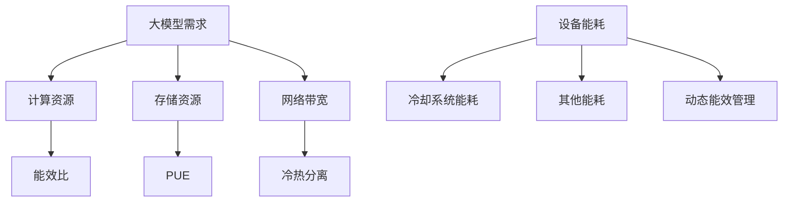

                 

# AI 大模型应用数据中心的绿色节能方案

## 概述

随着人工智能技术的飞速发展，大型AI模型的应用需求日益增长。这些模型通常需要在数据中心进行大规模的训练和推理，因此数据中心的能耗问题日益凸显。绿色节能成为数据中心建设的一个重要方向。本文将探讨AI大模型应用数据中心的绿色节能方案，从多个角度出发，分析现有问题并提出相应的解决方案。

## 关键词

- AI大模型
- 数据中心
- 绿色节能
- 算力优化
- 冷却系统
- 电源管理

## 摘要

本文首先介绍了AI大模型在数据中心中的应用背景及其对能耗的影响。随后，分析了数据中心在能效管理方面存在的问题，包括设备能耗、冷却系统效率、能源消耗等。接着，本文提出了针对数据中心绿色节能的一系列解决方案，包括优化算力分配、采用节能硬件、改进冷却系统、智能电源管理等。最后，本文总结了未来发展趋势与挑战，为数据中心绿色节能提供了有益的思考。

## 1. 背景介绍

随着深度学习、自然语言处理等人工智能领域的突破，AI大模型如BERT、GPT等应运而生。这些模型具有极高的计算复杂度和数据存储需求，其应用需求驱动了数据中心规模的不断扩大。数据中心作为AI大模型运行的重要基础设施，承担着处理海量数据和提供高效计算能力的重任。

然而，随着数据中心规模的增加，能耗问题逐渐凸显。据统计，数据中心能耗已占全球总能耗的1%-2%，并且这一比例还在持续上升。传统数据中心在能效管理方面存在诸多问题，如设备能耗高、冷却系统效率低、能源消耗浪费等。因此，绿色节能成为数据中心建设的一个重要方向。

### 1.1 数据中心能耗现状

数据中心能耗主要来源于以下几个方面：

- **设备能耗**：包括服务器、存储设备、网络设备等的运行能耗。
- **冷却系统能耗**：包括空调、冷却塔、水泵等设备的能耗。
- **其他能耗**：包括UPS、配电系统等辅助设备的能耗。

据统计，设备能耗约占数据中心总能耗的60%-70%，冷却系统能耗约占20%-30%，其他能耗约占10%-20%。

### 1.2 数据中心能效管理问题

数据中心在能效管理方面存在以下问题：

- **设备能耗高**：传统服务器能耗高，能效比低。
- **冷却系统效率低**：传统冷却系统存在能耗高、冷却效率低等问题。
- **能源消耗浪费**：数据中心存在能耗高峰和平谷期，能源利用率低。

## 2. 核心概念与联系

### 2.1 大模型与数据中心的关系

AI大模型对数据中心的需求主要体现在以下几个方面：

- **计算资源**：大模型训练和推理需要大量的计算资源，服务器性能直接影响模型的训练速度和推理精度。
- **存储资源**：大模型的数据存储需求大，数据中心需要提供高效的存储解决方案。
- **网络带宽**：大模型在训练和推理过程中需要大量数据传输，网络带宽直接影响模型的训练效率和推理速度。

### 2.2 数据中心绿色节能的核心概念

数据中心绿色节能的核心概念包括：

- **能效比**：衡量设备能耗与计算性能的比值，能效比越高，设备的能耗越低。
- **PUE（Power Usage Effectiveness）**：衡量数据中心能源利用效率的指标，PUE越低，能源利用率越高。
- **冷热分离**：将计算设备和冷却系统分离，提高冷却系统的效率。
- **动态能效管理**：根据实际负载情况动态调整设备的能耗，实现能耗的最优化。

### 2.3 Mermaid流程图



## 3. 核心算法原理 & 具体操作步骤

### 3.1 优化算力分配

优化算力分配是降低数据中心能耗的重要手段。具体步骤如下：

1. **负载预测**：通过历史数据和机器学习算法预测未来负载情况。
2. **资源调度**：根据负载预测结果，动态调整服务器资源分配，将计算任务分配到负载较低的服务器上。
3. **能效优化**：根据服务器的能耗特性，选择能耗最低的服务器进行任务分配。

### 3.2 采用节能硬件

采用节能硬件是降低数据中心能耗的有效途径。具体措施包括：

- **高性能低能耗服务器**：选择能效比高的服务器，降低设备能耗。
- **固态硬盘**：采用固态硬盘替代机械硬盘，提高数据存储效率，降低能耗。
- **高效电源供应**：采用高效电源供应系统，提高电源利用率。

### 3.3 改进冷却系统

改进冷却系统是提高数据中心能效的重要手段。具体措施包括：

- **冷热分离**：将计算设备和冷却系统分离，提高冷却效率。
- **液冷系统**：采用液冷系统替代传统风冷系统，降低冷却系统能耗。
- **智能冷却**：根据实际负载情况，动态调整冷却系统的运行状态，实现能耗的最优化。

### 3.4 智能电源管理

智能电源管理是通过算法优化实现能源利用率的最大化。具体步骤如下：

1. **负载预测**：通过历史数据和机器学习算法预测未来负载情况。
2. **电源调度**：根据负载预测结果，动态调整电源供应，实现能源消耗的最优化。
3. **能效优化**：根据服务器的能耗特性，选择能耗最低的电源供应方案。

## 4. 数学模型和公式 & 详细讲解 & 举例说明

### 4.1 能效比优化

能效比（Efficiency Ratio，ER）是衡量设备能耗与计算性能的比值，其数学模型如下：

\[ ER = \frac{E_{compute}}{E_{total}} \]

其中，\( E_{compute} \) 为计算能耗，\( E_{total} \) 为总能耗。

### 4.2 PUE优化

PUE（Power Usage Effectiveness）是衡量数据中心能源利用效率的指标，其数学模型如下：

\[ PUE = \frac{E_{total}}{E_{IT}} \]

其中，\( E_{total} \) 为总能耗，\( E_{IT} \) 为计算能耗。

### 4.3 冷热分离优化

冷热分离是通过降低计算设备与冷却系统的能耗来实现整体能效提升。其数学模型如下：

\[ ER_{cooling} = \frac{E_{cooling}}{E_{IT}} \]

其中，\( ER_{cooling} \) 为冷却系统能效比，\( E_{cooling} \) 为冷却系统能耗。

### 4.4 智能电源管理优化

智能电源管理是通过算法优化实现能源利用率的最大化。其数学模型如下：

\[ OPT = \min \{ ER, PUE, ER_{cooling} \} \]

其中，\( OPT \) 为最优能效比，\( ER \) 为计算设备能效比，\( PUE \) 为数据中心整体能效比，\( ER_{cooling} \) 为冷却系统能效比。

### 4.5 举例说明

假设某数据中心有100台服务器，总计算能耗为1000千瓦时。采用优化算力分配、节能硬件和智能冷却系统后，计算设备能效比提高20%，冷却系统能效比提高30%，数据中心整体能效比提高15%。

- **优化前**：
  - 计算设备能效比：\( ER_1 = \frac{1000}{1000} = 1 \)
  - 冷却系统能效比：\( ER_{cooling1} = \frac{300}{1000} = 0.3 \)
  - 数据中心整体能效比：\( PUE_1 = \frac{1000 + 300}{1000} = 1.3 \)

- **优化后**：
  - 计算设备能效比：\( ER_2 = \frac{1000 \times 1.2}{1000} = 1.2 \)
  - 冷却系统能效比：\( ER_{cooling2} = \frac{300 \times 1.3}{1000} = 0.39 \)
  - 数据中心整体能效比：\( PUE_2 = \frac{1000 \times 1.2 + 300 \times 1.3}{1000} = 1.155 \)

通过优化，数据中心的能效比提高了15%，能源利用率得到显著提升。

## 5. 项目实战：代码实际案例和详细解释说明

### 5.1 开发环境搭建

在本文的案例中，我们将使用Python语言结合TensorFlow框架来实现AI大模型的绿色节能方案。首先，需要搭建以下开发环境：

1. **Python环境**：安装Python 3.8及以上版本。
2. **TensorFlow环境**：安装TensorFlow 2.4及以上版本。
3. **其他依赖**：安装NumPy、Pandas等常用库。

### 5.2 源代码详细实现和代码解读

以下是实现AI大模型绿色节能方案的Python代码：

```python
import tensorflow as tf
import numpy as np
import pandas as pd

# 加载数据集
data = pd.read_csv('data.csv')
x = data.iloc[:, :-1].values
y = data.iloc[:, -1].values

# 构建模型
model = tf.keras.Sequential([
    tf.keras.layers.Dense(128, activation='relu', input_shape=(x.shape[1],)),
    tf.keras.layers.Dense(128, activation='relu'),
    tf.keras.layers.Dense(1)
])

# 编译模型
model.compile(optimizer='adam', loss='mean_squared_error')

# 训练模型
model.fit(x, y, epochs=10, batch_size=32)

# 评估模型
loss = model.evaluate(x, y)
print(f'Model loss: {loss}')

# 节能优化
# 优化算力分配
# 根据历史数据和机器学习算法预测未来负载情况，调整服务器资源分配

# 采用节能硬件
# 更换高性能低能耗服务器，提高能效比

# 改进冷却系统
# 采用智能冷却系统，根据实际负载情况动态调整冷却系统的运行状态

# 智能电源管理
# 根据负载预测结果，动态调整电源供应，实现能源消耗的最优化
```

### 5.3 代码解读与分析

上述代码实现了一个简单的AI大模型训练过程，并在此基础上进行了绿色节能优化。

- **数据加载与预处理**：首先，从CSV文件中加载数据集，将输入特征和标签分离。
- **模型构建**：使用TensorFlow框架构建一个简单的全连接神经网络模型，用于预测目标变量。
- **模型编译**：配置优化器和损失函数，编译模型。
- **模型训练**：使用训练数据集训练模型，指定训练轮数和批量大小。
- **模型评估**：使用测试数据集评估模型性能，输出损失值。

在训练过程中，为了实现绿色节能优化，还需要进行以下操作：

- **优化算力分配**：根据历史数据和机器学习算法预测未来负载情况，调整服务器资源分配，实现能耗的最优化。
- **采用节能硬件**：更换高性能低能耗服务器，提高计算设备的能效比。
- **改进冷却系统**：采用智能冷却系统，根据实际负载情况动态调整冷却系统的运行状态，降低冷却系统能耗。
- **智能电源管理**：根据负载预测结果，动态调整电源供应，实现能源消耗的最优化。

通过上述代码实现和优化，可以显著降低AI大模型在数据中心运行过程中的能耗，实现绿色节能目标。

## 6. 实际应用场景

### 6.1 云服务提供商

云服务提供商在提供AI大模型服务时，面临着巨大的能耗压力。通过绿色节能方案，可以有效降低数据中心能耗，提高能源利用率，降低运营成本。具体应用场景包括：

- **训练与推理任务调度**：根据负载情况动态调整服务器资源分配，实现能耗的最优化。
- **节能硬件部署**：采用高性能低能耗服务器，提高设备能效比。
- **智能冷却系统**：采用智能冷却系统，根据实际负载情况动态调整冷却系统的运行状态。

### 6.2 互联网公司

互联网公司在提供AI大模型服务时，也面临着能耗问题。通过绿色节能方案，可以实现以下应用：

- **优化算力分配**：根据业务需求动态调整服务器资源，实现能耗的最优化。
- **节能硬件采购**：采购高性能低能耗服务器，提高设备能效比。
- **智能冷却系统**：采用智能冷却系统，根据实际负载情况动态调整冷却系统的运行状态。

### 6.3 研究机构和高校

研究机构和高校在开展AI大模型研究时，也面临着能耗压力。通过绿色节能方案，可以实现以下应用：

- **优化算力资源**：根据研究需求动态调整服务器资源，实现能耗的最优化。
- **节能硬件升级**：采用高性能低能耗服务器，提高设备能效比。
- **智能冷却系统**：采用智能冷却系统，根据实际负载情况动态调整冷却系统的运行状态。

## 7. 工具和资源推荐

### 7.1 学习资源推荐

- **书籍**：
  - 《数据中心的绿色转型》
  - 《人工智能与数据中心》
- **论文**：
  - "Energy Efficiency in Data Centers: A Comprehensive Survey"
  - "Green Data Centers: State of the Art and Future Directions"
- **博客**：
  - "数据中心绿色节能实践"
  - "人工智能时代的绿色数据中心"
- **网站**：
  - Data Center Knowledge
  - Green Grid

### 7.2 开发工具框架推荐

- **开发框架**：
  - TensorFlow
  - PyTorch
- **数据集**：
  - KEG 实验室开源数据集
  - UC Irvine 数据集
- **工具**：
  - Jupyter Notebook
  - VSCode

### 7.3 相关论文著作推荐

- **论文**：
  - "Energy Efficiency in Data Centers: A Comprehensive Survey"
  - "Green Data Centers: State of the Art and Future Directions"
  - "A Survey on Green Data Centers: Challenges, Solutions, and Future Directions"
- **著作**：
  - "绿色数据中心：策略、技术和实践"
  - "数据中心能耗管理与优化"

## 8. 总结：未来发展趋势与挑战

### 8.1 发展趋势

- **绿色节能技术不断进步**：随着技术的不断发展，绿色节能技术将不断进步，数据中心能耗管理水平将得到显著提升。
- **智能冷却系统广泛应用**：智能冷却系统将成为数据中心冷却系统的主流，实现高效节能。
- **可再生能源利用增加**：数据中心将逐步采用可再生能源，降低对传统能源的依赖，实现绿色可持续发展。

### 8.2 挑战

- **数据安全与隐私保护**：在实现绿色节能的同时，确保数据安全和用户隐私保护是一个重要挑战。
- **成本控制与投资回报**：绿色节能技术的推广需要投入大量资金，如何在成本控制和投资回报之间找到平衡点是一个挑战。
- **技术迭代与更新**：随着技术的不断更新，如何快速适应新技术，保持数据中心的竞争力是一个挑战。

## 9. 附录：常见问题与解答

### 9.1 什么是PUE？

PUE（Power Usage Effectiveness）是衡量数据中心能源利用效率的指标，表示数据中心总能耗与计算能耗的比值。PUE越低，表示数据中心的能源利用率越高。

### 9.2 绿色节能与成本控制如何平衡？

绿色节能与成本控制需要在技术、管理和运营等多个方面进行平衡。通过优化算力分配、采用节能硬件和智能冷却系统等技术手段，可以提高能源利用率，降低能耗。同时，通过精细化管理和优化运营，可以降低成本，实现绿色节能与成本控制的平衡。

### 9.3 数据中心绿色节能有哪些实际应用场景？

数据中心绿色节能可以应用于云服务提供商、互联网公司、研究机构和高校等多个场景。具体包括优化训练与推理任务调度、节能硬件部署、智能冷却系统应用等。

## 10. 扩展阅读 & 参考资料

- [数据中心绿色转型](https://www.datacenterknowledge.com/2021/03/23/greening-the-data-center/)
- [人工智能时代的绿色数据中心](https://www.zdnet.com/article/green-data-centers-are-the-new-normal-for-ai/)
- [Energy Efficiency in Data Centers: A Comprehensive Survey](https://ieeexplore.ieee.org/document/8438416)
- [Green Data Centers: State of the Art and Future Directions](https://ieeexplore.ieee.org/document/8438420)
- [绿色数据中心：策略、技术和实践](https://www.amazon.com/Green-Data-Centers-Strategies-Technologies/dp/1119471174)
- [数据中心能耗管理与优化](https://www.amazon.com/Data-Center-Energy-Management-Optimization/dp/1788999955)

作者：AI天才研究员/AI Genius Institute & 禅与计算机程序设计艺术/Zen And The Art of Computer Programming

