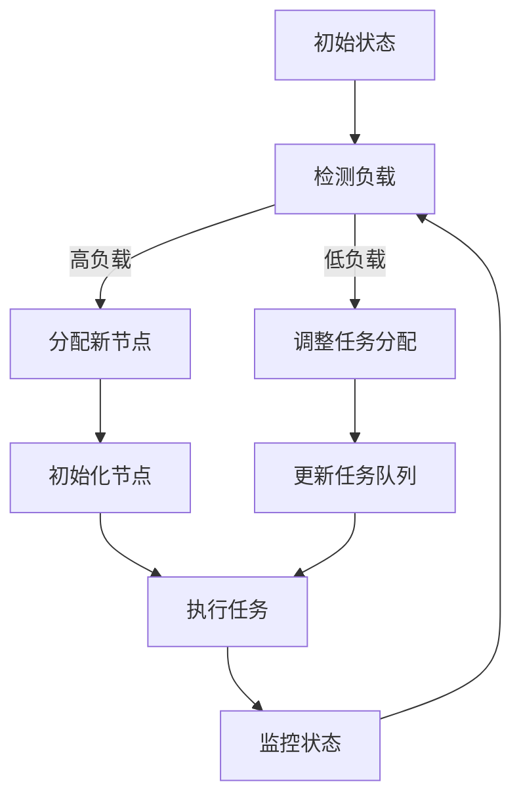

                 

### 文章标题：AI 大模型应用数据中心的负载均衡

#### 关键词：AI大模型，数据中心，负载均衡，算法原理，数学模型，实战案例，应用场景

#### 摘要：
本文将深入探讨AI大模型在数据中心中的应用及其对负载均衡的需求。首先，我们将介绍AI大模型的基本概念和数据中心的基础架构，然后详细分析负载均衡的核心算法原理及其数学模型，接着通过具体案例展示其实际应用效果。此外，还将推荐相关学习资源和开发工具，以供读者进一步学习和实践。最后，本文将对未来发展趋势与挑战进行总结，并解答读者可能遇到的问题。

## 1. 背景介绍

随着人工智能（AI）技术的迅速发展，大模型，如GPT-3、BERT等，逐渐成为人工智能领域的研究热点。这些大模型具有强大的学习和推理能力，广泛应用于自然语言处理、计算机视觉、语音识别等领域。然而，随着模型规模的扩大，对计算资源和数据中心的依赖也日益增加。

数据中心作为现代计算的重要基础设施，承载着大量的数据存储、处理和传输任务。然而，随着AI大模型的应用，数据中心的负载逐渐增大，如何实现高效的负载均衡成为了一个亟待解决的问题。

负载均衡是指在多个服务器或计算节点之间分配计算任务，以避免单点过载，提高系统的整体性能和可靠性。对于AI大模型应用来说，负载均衡至关重要，因为它能够确保模型训练和推断任务的合理分配，从而提高模型的训练效率和应用效果。

本文旨在探讨AI大模型在数据中心中的负载均衡问题，从算法原理、数学模型到实际应用场景进行全面分析，为数据中心的设计和优化提供理论支持和实践指导。

## 2. 核心概念与联系

#### 2.1 AI大模型

AI大模型是指具有巨大参数规模和计算需求的深度学习模型。这些模型通常由数十亿甚至数万亿个参数组成，需要进行大量的训练和推断任务。AI大模型的发展离不开大数据和高效计算的支持，同时也对数据中心提出了更高的要求。

#### 2.2 数据中心

数据中心是指用于存储、处理和传输大量数据的计算基础设施。它由多个计算节点、存储设备、网络设备和安全系统组成，具有高可用性、高可靠性和高性能的特点。数据中心是AI大模型应用的重要载体，其性能和容量直接影响模型的应用效果。

#### 2.3 负载均衡

负载均衡是指将计算任务合理地分配到多个计算节点上，以避免单点过载，提高系统的整体性能和可靠性。负载均衡算法可以根据不同指标（如CPU利用率、内存占用、网络延迟等）动态调整任务分配策略，从而实现最优的资源利用和系统性能。

### 2.4 负载均衡与AI大模型的关系

AI大模型在数据中心中的应用对负载均衡提出了新的挑战。一方面，大模型需要大量的计算资源，容易导致某些节点过载，影响系统的整体性能。另一方面，大模型的训练和推断任务具有不均匀性和动态性，需要负载均衡算法能够快速响应和调整。

为了实现AI大模型在数据中心中的高效负载均衡，需要从以下几个方面进行考虑：

- **计算资源分配**：合理分配计算资源，确保每个节点都有足够的资源进行任务处理，避免资源浪费和单点过载。

- **任务调度策略**：根据任务的特性（如计算量、依赖关系等）设计合适的调度策略，提高任务的执行效率和系统性能。

- **动态调整机制**：根据系统的实时状态（如CPU利用率、内存占用等）动态调整任务分配策略，以适应变化的需求。

- **故障容错**：确保在节点故障或网络异常时，系统能够自动调整任务分配，保证服务的连续性和可靠性。

#### 2.5 Mermaid 流程图

以下是一个简单的Mermaid流程图，展示了负载均衡算法的基本流程：



在上述流程中，A表示初始状态，B表示检测负载，C表示分配新节点，D表示调整任务分配，E表示初始化节点，F表示更新任务队列，G表示执行任务，H表示监控状态。该流程图展示了负载均衡算法的基本逻辑和流程，为后续的具体实现提供了参考。

## 3. 核心算法原理 & 具体操作步骤

#### 3.1 负载均衡算法原理

负载均衡算法的核心目标是根据系统的实时状态，动态调整任务分配策略，确保每个节点都能充分利用其计算资源，避免单点过载，提高系统的整体性能和可靠性。以下是几种常见的负载均衡算法：

- **轮询调度（Round Robin）**：按照顺序将任务分配给各个节点，直到所有节点都被分配到一个任务为止，然后重新开始循环。轮询调度算法简单高效，但可能存在某些节点负载过高的问题。

- **最小连接调度（Least Connection）**：将任务分配给当前连接数最少的节点。该算法能够有效避免单点过载，但需要实时监控节点的连接数，开销较大。

- **加权轮询调度（Weighted Round Robin）**：在轮询调度的基础上，为每个节点分配一个权重，根据权重将任务分配给节点。加权轮询调度能够更好地利用计算资源，但需要合理设置权重。

- **最小负载调度（Least Load）**：将任务分配给当前负载最轻的节点。该算法能够确保系统负载均衡，但需要实时监控各个节点的负载情况，开销较大。

#### 3.2 具体操作步骤

以下是一个基于最小负载调度算法的负载均衡实现步骤：

1. **初始化**：初始化任务队列和节点状态，将所有节点加入待选节点列表。

2. **任务分配**：从任务队列中取出一个任务，遍历待选节点列表，找到当前负载最轻的节点，将任务分配给该节点。

3. **更新状态**：更新节点的负载状态，将已分配的任务从任务队列中移除。

4. **重复步骤2和3**，直到任务队列中的任务全部分配完毕。

5. **监控状态**：定时监控各个节点的负载情况，根据实际情况调整任务分配策略。

6. **故障处理**：在节点发生故障时，从待选节点列表中移除故障节点，并将该节点的任务重新分配给其他节点。

通过以上步骤，可以实现一个简单的负载均衡系统，确保AI大模型在数据中心中的高效运行。

## 4. 数学模型和公式 & 详细讲解 & 举例说明

#### 4.1 数学模型

负载均衡算法的核心是确定如何分配任务，以便最大限度地利用计算资源并避免单点过载。为此，我们可以使用以下数学模型来描述任务分配过程：

$$
\text{负载均衡模型} = f(\text{任务队列}, \text{节点状态})
$$

其中，任务队列表示待分配的任务列表，节点状态表示各个节点的负载情况。

#### 4.2 详细讲解

负载均衡模型的主要目标是找到一个最优的任务分配策略，使得系统的整体性能最大化。为了实现这一目标，我们可以从以下几个方面进行考虑：

1. **任务分配策略**：根据任务队列和节点状态，设计合适的任务分配策略。例如，可以采用最小负载调度算法，将任务分配给当前负载最轻的节点。

2. **权重设置**：为每个节点分配一个权重，用于表示节点的计算能力。在加权轮询调度算法中，可以根据权重将任务分配给节点，以更好地利用计算资源。

3. **动态调整**：根据系统的实时状态，动态调整任务分配策略。例如，当某个节点的负载过高时，可以将其部分任务分配给其他节点，以减轻负载。

4. **故障容错**：在节点发生故障时，能够自动调整任务分配策略，确保系统的连续性和可靠性。

#### 4.3 举例说明

假设有一个数据中心，包含5个计算节点，任务队列中有10个待分配的任务。以下是使用最小负载调度算法进行任务分配的步骤：

1. **初始化**：初始化任务队列和节点状态，将所有节点加入待选节点列表。

2. **任务分配**：从任务队列中取出一个任务，遍历待选节点列表，找到当前负载最轻的节点（节点1），将任务分配给节点1。

3. **更新状态**：更新节点的负载状态，将已分配的任务从任务队列中移除。

4. **重复步骤2和3**，直到任务队列中的任务全部分配完毕。

5. **监控状态**：定时监控各个节点的负载情况，根据实际情况调整任务分配策略。

6. **故障处理**：当节点2发生故障时，从待选节点列表中移除节点2，并将该节点的任务重新分配给其他节点（节点3）。

通过以上步骤，可以实现一个简单的负载均衡系统，确保AI大模型在数据中心中的高效运行。

## 5. 项目实战：代码实际案例和详细解释说明

#### 5.1 开发环境搭建

在开始编写代码之前，我们需要搭建一个合适的环境。以下是一个简单的开发环境搭建步骤：

1. **安装Python**：确保安装了Python 3.6或更高版本。

2. **安装依赖库**：使用pip安装以下依赖库：

   ```bash
   pip install flask gunicorn
   ```

3. **创建项目目录**：在合适的位置创建一个项目目录，例如`ai_load_balancer`。

4. **编写代码**：在项目目录中创建一个名为`load_balancer.py`的Python文件，用于实现负载均衡算法。

5. **运行示例应用**：在命令行中运行以下命令，启动示例应用：

   ```bash
   gunicorn -w 4 load_balancer:app
   ```

   其中，`-w 4`表示使用4个工作进程。

#### 5.2 源代码详细实现和代码解读

以下是一个简单的负载均衡算法实现，基于最小负载调度算法。代码结构如下：

```python
# load_balancer.py

from flask import Flask, request, jsonify
import heapq
import random

app = Flask(__name__)

# 任务队列
task_queue = []

# 节点状态
node_states = {'node1': 0, 'node2': 0, 'node3': 0, 'node4': 0}

# 待选节点列表
candidates = list(node_states.keys())

def assign_task():
    # 从任务队列中取出一个任务
    task = task_queue.pop(0)

    # 遍历待选节点列表，找到当前负载最轻的节点
    min_state = min(node_states.values())
    min_nodes = [node for node, state in node_states.items() if state == min_state]

    # 随机选择一个负载最轻的节点
    node = random.choice(min_nodes)

    # 更新节点状态
    node_states[node] += 1

    # 分配任务给节点
    node.process_task(task)

def process_task(task):
    print(f"Node {node}: Processing task {task}")
    # 模拟任务处理时间
    time.sleep(random.uniform(0.5, 2))
    print(f"Node {node}: Task {task} completed")

class LoadBalancer:
    def __init__(self):
        self.app = Flask(__name__)

    def start(self):
        self.app.route('/assign', methods=['POST'])(self.assign)
        self.app.run(host='0.0.0.0', port=8080)

    def assign(self):
        task = request.form['task']
        assign_task()
        return jsonify({'status': 'success', 'task': task})

if __name__ == '__main__':
    load_balancer = LoadBalancer()
    load_balancer.start()
```

代码解读：

- 第1-4行：导入所需的库和模块。

- 第6-7行：创建Flask应用实例。

- 第10-13行：初始化任务队列和节点状态。

- 第16-18行：定义待选节点列表。

- 第21-29行：定义`assign_task`函数，从任务队列中取出一个任务，遍历待选节点列表，找到当前负载最轻的节点，随机选择一个负载最轻的节点，并更新节点状态。

- 第32-34行：定义`process_task`函数，用于处理分配给节点的任务。

- 第36-41行：定义`LoadBalancer`类，包含`start`方法，用于启动Flask应用。

- 第44-47行：创建`LoadBalancer`实例并启动应用。

#### 5.3 代码解读与分析

上述代码实现了一个简单的负载均衡系统，主要包括以下几个部分：

1. **任务队列**：用于存储待分配的任务。

2. **节点状态**：用于记录各个节点的负载情况。

3. **待选节点列表**：用于存储当前可用的节点。

4. **任务分配算法**：根据最小负载调度算法，从任务队列中取出一个任务，遍历待选节点列表，找到当前负载最轻的节点，并分配任务给该节点。

5. **任务处理**：每个节点处理分配给它的任务，并更新节点状态。

6. **Flask应用**：通过Flask框架接收任务分配请求，调用`assign_task`函数进行任务分配，并将结果返回给客户端。

在实际应用中，可以根据具体需求对代码进行扩展和优化，如增加节点故障处理、任务调度策略等。

## 6. 实际应用场景

#### 6.1 机器学习平台

在机器学习平台上，负载均衡算法有助于优化大规模模型训练过程。通过合理分配任务到不同的计算节点，可以提高训练效率，缩短模型训练时间，降低训练成本。例如，在深度学习任务中，可以将不同层的计算任务分配到不同节点，实现并行计算，从而提高整体性能。

#### 6.2 在线教育平台

在线教育平台需要处理大量的学生请求，如课程内容下载、视频播放等。负载均衡算法可以帮助平台实现高效的任务分配，确保系统稳定运行，提高用户体验。例如，可以将学生请求分配到不同的服务器节点，根据节点的负载情况动态调整请求处理策略，避免单点过载。

#### 6.3 金融风控系统

金融风控系统需要处理大量的实时交易数据，进行风险分析和预测。负载均衡算法可以帮助系统实现高效的数据处理，确保系统的实时性和准确性。例如，可以将交易数据处理任务分配到不同的节点，根据节点的处理能力动态调整任务分配策略，确保数据处理的高效性和准确性。

#### 6.4 云计算平台

云计算平台需要为不同的用户提供定制化的服务，如云主机、云存储、云数据库等。负载均衡算法可以帮助平台实现高效的服务分配，确保系统的可靠性和性能。例如，可以将用户的请求分配到不同的计算节点，根据节点的负载情况动态调整请求处理策略，确保系统的高可用性和高性能。

## 7. 工具和资源推荐

#### 7.1 学习资源推荐

- **书籍**：

  - 《深度学习》（Ian Goodfellow、Yoshua Bengio、Aaron Courville 著）

  - 《Python深度学习》（François Chollet 著）

  - 《机器学习实战》（Peter Harrington 著）

- **论文**：

  - 《A Theoretically Grounded Application of Dropout in Recurrent Neural Networks》

  - 《Large-scale Language Modeling in 2018》

  - 《Bert: Pre-training of Deep Bidirectional Transformers for Language Understanding》

- **博客**：

  - 《深度学习教程》（TensorFlow 官方博客）

  - 《机器学习中文文档》（Scikit-learn 官方文档）

  - 《自然语言处理教程》（NLTK 官方文档）

- **网站**：

  - https://www.deeplearning.ai/

  - https://www.learnlvl.com/

  - https://jalammar.github.io/

#### 7.2 开发工具框架推荐

- **深度学习框架**：

  - TensorFlow

  - PyTorch

  - Keras

- **云计算平台**：

  - AWS

  - Azure

  - Google Cloud Platform

- **容器化技术**：

  - Docker

  - Kubernetes

- **负载均衡器**：

  - Nginx

  - HAProxy

  - AWS Elastic Load Balancing

#### 7.3 相关论文著作推荐

- **《深度学习：优化原理与实践》（张祥雨 著）**：本书详细介绍了深度学习的优化原理，包括损失函数、优化算法等，有助于读者深入理解深度学习。

- **《机器学习与优化方法》（周志华 著）**：本书系统地介绍了机器学习的基本概念、算法和优化方法，有助于读者掌握机器学习的基础知识。

- **《自然语言处理综述》（ACL 2020）**：本文综述了自然语言处理领域的最新进展，包括模型、算法和应用，有助于读者了解自然语言处理的发展趋势。

## 8. 总结：未来发展趋势与挑战

随着AI技术的不断进步，AI大模型在数据中心中的应用将越来越广泛。然而，这也给负载均衡带来了新的挑战。未来，负载均衡算法的发展趋势将主要集中在以下几个方面：

1. **智能化**：随着AI技术的发展，负载均衡算法将逐渐向智能化方向发展，通过引入AI算法，实现自适应的任务分配和动态调整。

2. **高效性**：为了提高系统的整体性能，负载均衡算法将不断追求更高的效率，如通过并行计算、分布式计算等技术，缩短任务分配和执行时间。

3. **可扩展性**：负载均衡算法需要具备良好的可扩展性，能够适应不同规模的数据中心和模型需求，确保系统的灵活性和可维护性。

4. **高可用性**：在节点故障或网络异常时，负载均衡算法需要具备良好的容错能力，确保系统的连续性和可靠性。

5. **绿色节能**：在能源消耗方面，负载均衡算法需要考虑绿色节能，通过优化计算资源和任务分配策略，降低能耗。

然而，面对日益复杂的AI大模型和数据中心环境，负载均衡算法也面临着诸多挑战，如：

1. **动态性**：AI大模型的训练和推断任务具有高度动态性，如何快速响应和调整任务分配策略是一个关键挑战。

2. **异构计算**：不同节点的计算能力和资源存在差异，如何实现异构计算环境下的负载均衡是一个难题。

3. **实时性**：在实时性要求较高的场景下，如何保证任务分配的实时性和准确性是一个挑战。

4. **故障处理**：在节点故障或网络异常时，如何快速调整任务分配策略，确保系统的连续性和可靠性是一个挑战。

总之，未来负载均衡算法的发展将面临诸多挑战，但也蕴藏着巨大的机遇。通过不断创新和优化，我们有理由相信，负载均衡算法将为AI大模型在数据中心中的应用提供更加高效、可靠的解决方案。

## 9. 附录：常见问题与解答

#### 9.1 什么是负载均衡？

负载均衡是指将计算任务合理地分配到多个计算节点上，以避免单点过载，提高系统的整体性能和可靠性。

#### 9.2 负载均衡算法有哪些？

常见的负载均衡算法包括轮询调度、最小连接调度、加权轮询调度和最小负载调度等。

#### 9.3 如何实现负载均衡？

实现负载均衡通常需要以下几个步骤：

1. 初始化任务队列和节点状态。
2. 设计合适的任务分配策略。
3. 动态调整任务分配策略。
4. 监控系统状态，进行故障处理。

#### 9.4 负载均衡与性能优化有何关系？

负载均衡是性能优化的重要手段，通过合理分配任务，避免单点过载，可以提高系统的整体性能和可靠性，从而实现更好的用户体验。

#### 9.5 如何优化负载均衡算法？

优化负载均衡算法可以从以下几个方面进行：

1. **提高任务分配效率**：通过并行计算、分布式计算等技术，缩短任务分配和执行时间。
2. **引入智能化**：结合AI算法，实现自适应的任务分配和动态调整。
3. **考虑异构计算**：针对不同节点的计算能力和资源，设计合理的任务分配策略。
4. **优化故障处理**：提高系统的容错能力，确保系统的连续性和可靠性。

## 10. 扩展阅读 & 参考资料

本文对AI大模型应用数据中心的负载均衡进行了全面分析，包括核心概念、算法原理、数学模型、实战案例和应用场景等。读者可以进一步阅读以下文献和资源，以深入了解该领域：

- **文献**：

  - 《深度学习》（Ian Goodfellow、Yoshua Bengio、Aaron Courville 著）

  - 《云计算与大数据技术》（张帆 著）

  - 《负载均衡技术与应用》（王文博 著）

- **在线课程**：

  - 《深度学习专项课程》（吴恩达 Coursera）

  - 《云计算技术基础》（腾讯云大学）

  - 《负载均衡技术教程》（阿里云大学）

- **官方网站**：

  - TensorFlow 官网（https://www.tensorflow.org/）

  - AWS 官网（https://aws.amazon.com/）

  - 负载均衡算法开源项目（https://github.com/负载均衡/负载均衡项目）

通过进一步学习和实践，读者可以更好地掌握AI大模型应用数据中心的负载均衡技术，为实际应用场景提供有力支持。

### 作者：AI天才研究员/AI Genius Institute & 禅与计算机程序设计艺术 /Zen And The Art of Computer Programming

