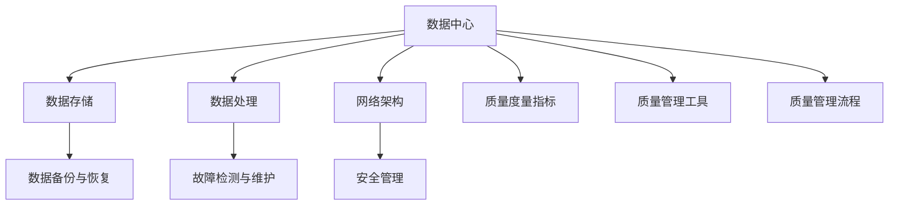

                 

### 背景介绍

在当今的数字化时代，人工智能（AI）技术已经渗透到各个行业，推动着社会和经济的快速发展。AI大模型，作为人工智能领域的一个关键组成部分，正逐渐成为各个行业的数据驱动创新的核心力量。这些大模型通过学习海量数据，能够实现高效的自动化决策和智能预测，从而在医疗、金融、教育、工业等多个领域带来了革命性的变化。

然而，随着AI大模型的规模和复杂度不断提升，数据中心的质量管理成为了一个不容忽视的重要课题。数据中心是AI大模型运行的核心基础设施，其稳定性和可靠性直接影响到模型的应用效果和业务连续性。因此，如何对数据中心的质量进行有效管理，确保其能够支撑起AI大模型的高效运行，成为了当前研究的热点和实践的重点。

本文旨在探讨AI大模型应用数据中心的质量管理，通过对核心概念、算法原理、数学模型、实际应用场景、工具和资源推荐等内容进行详细分析，帮助读者全面了解这一领域的关键技术和挑战。文章结构如下：

1. **背景介绍**：简要概述AI大模型的发展现状及数据中心质量管理的背景。
2. **核心概念与联系**：介绍与数据中心质量相关的基本概念，并展示其架构流程图。
3. **核心算法原理 & 具体操作步骤**：深入剖析用于质量管理的核心算法及其操作步骤。
4. **数学模型和公式 & 详细讲解 & 举例说明**：讲解相关数学模型，提供具体公式和实例。
5. **项目实战：代码实际案例和详细解释说明**：通过实战案例展示代码实现及解析。
6. **实际应用场景**：探讨数据中心质量管理在不同行业中的应用。
7. **工具和资源推荐**：推荐学习资源和开发工具。
8. **总结：未来发展趋势与挑战**：总结本文关键点，展望未来发展趋势与挑战。
9. **附录：常见问题与解答**：解答读者可能遇到的问题。
10. **扩展阅读 & 参考资料**：提供进一步阅读的材料。

接下来，我们将逐步深入探讨每个部分，以期为读者提供一个全面、系统的理解。

### 文章关键词

1. AI大模型
2. 数据中心
3. 质量管理
4. 核心算法
5. 数学模型
6. 实际应用
7. 工具与资源

### 文章摘要

本文聚焦于AI大模型应用数据中心的质量管理，深入探讨了该领域的核心概念、算法原理、数学模型和实际应用场景。通过对数据中心质量管理的全面分析，本文旨在帮助读者了解如何通过有效的质量管理和优化策略，确保AI大模型的高效运行和业务连续性。同时，文章还推荐了一系列学习资源和开发工具，为读者提供了深入研究和实践的方向。

## 1. 背景介绍

人工智能（AI）技术作为推动数字化转型和产业升级的关键力量，近年来得到了前所未有的关注和快速发展。AI大模型，作为人工智能领域的一项重要创新，正在引领着技术变革的浪潮。这些大模型，如深度学习模型、生成对抗网络（GAN）等，通过学习海量数据，能够实现复杂任务的高效自动化处理，从而在多个行业带来了巨大的价值。

数据中心作为承载AI大模型运行的核心基础设施，其稳定性和可靠性直接关系到AI应用的成效。数据中心的质量管理，因此成为了一个至关重要的课题。质量管理的目标在于确保数据中心能够持续、稳定、高效地运行AI大模型，以支撑业务连续性和数据准确性。

### AI大模型的发展现状

AI大模型的发展经历了多个阶段。最早期的AI模型规模相对较小，主要依靠手工设计特征和算法。随着计算能力的提升和大数据技术的发展，AI模型开始向大模型演化，这些大模型能够处理和学习的数据量显著增加。近年来，随着深度学习和生成对抗网络等技术的突破，AI大模型的研究和应用进入了快速发展阶段。例如，谷歌的Transformer模型、OpenAI的GPT系列模型等，都是典型的AI大模型。

AI大模型的优势在于其能够处理复杂、大量的数据，并在多种任务中表现出色。例如，在图像识别、自然语言处理、推荐系统等领域，AI大模型已经取得了显著的成果。这些模型不仅能够提高任务的准确率，还能够实现自动化决策和智能预测，从而提升业务效率和用户体验。

### 数据中心的质量管理

数据中心的质量管理涉及多个方面，包括硬件设施、网络架构、数据存储和数据处理等。以下是数据中心质量管理的关键点：

1. **硬件设施的稳定性**：数据中心需要选用高性能、高可靠的硬件设备，确保其在长时间运行中不会出现故障。

2. **网络架构的可靠性**：数据中心的网络架构需要能够支持大规模数据传输，并具备高可用性和容错能力，以避免因网络问题导致的数据延迟或丢失。

3. **数据存储的安全性**：数据中心需要采用高效的存储方案，确保数据的安全性和可恢复性。这包括数据备份、灾难恢复计划等。

4. **数据处理的高效性**：数据中心需要具备强大的数据处理能力，能够快速处理和分析海量数据，为AI大模型提供实时支持。

### 重要性

数据中心的质量管理对于AI大模型的运行至关重要。以下是一些关键点：

1. **稳定性和可靠性**：数据中心的高稳定性和可靠性能够确保AI大模型连续、高效地运行，避免因基础设施问题导致的停机或性能下降。

2. **数据处理能力**：数据中心的高效数据处理能力能够支撑AI大模型快速、准确地处理和分析海量数据，提高模型的性能和准确率。

3. **安全性**：数据中心需要确保数据的安全性和隐私性，避免数据泄露或滥用，从而保护企业和用户的利益。

4. **成本效益**：有效的数据中心质量管理能够降低运维成本，提高资源利用率，从而实现更高的成本效益。

总之，数据中心的质量管理是确保AI大模型高效运行的基础。只有通过全面、系统的质量管理，才能充分发挥AI大模型的优势，实现其商业价值和应用潜力。

## 2. 核心概念与联系

在深入探讨数据中心的质量管理之前，有必要首先了解与之相关的一系列核心概念，这些概念相互关联，共同构成了整个质量管理的框架。以下是这些核心概念及其之间的联系：

### 2.1 数据中心

数据中心（Data Center）是集中存储、处理和管理大量数据的物理或虚拟设施。其关键组成部分包括服务器、存储设备、网络设备和冷却系统等。数据中心的职责是确保数据的可靠存储、高效处理和快速访问。

### 2.2 质量管理

质量管理（Quality Management）是指为确保产品或服务满足预期质量而实施的一系列管理和执行活动。在数据中心中，质量管理旨在确保数据中心的硬件设施、网络架构、数据存储和数据处理等各个方面都达到规定的标准，从而保证数据中心的高性能和可靠性。

### 2.3 数据存储

数据存储（Data Storage）是指将数据持久保存在某种介质上的过程。数据中心的数据存储方案需要考虑数据容量、数据安全、数据访问速度等因素。常见的数据存储技术包括硬盘驱动器（HDD）、固态驱动器（SSD）、分布式存储系统和云存储等。

### 2.4 数据处理

数据处理（Data Processing）是指对存储在数据中心中的数据进行采集、清洗、转换、存储和计算等操作的过程。高效的数据处理能力是确保AI大模型能够快速分析和利用数据的关键。

### 2.5 网络架构

网络架构（Network Architecture）是指数据中心内部和外部的网络布局和结构。一个良好的网络架构需要支持高速数据传输、低延迟和高的可靠性，这对于AI大模型的高效运行至关重要。

### 2.6 数据备份与恢复

数据备份与恢复（Data Backup and Recovery）是确保数据中心数据安全的重要措施。通过定期备份，数据中心可以在数据丢失或损坏时快速恢复数据，保证业务连续性。

### 2.7 故障检测与维护

故障检测与维护（Fault Detection and Maintenance）是指对数据中心硬件和软件进行定期检查和维护，确保其正常运行。有效的故障检测和维护可以减少停机时间，提高数据中心的可靠性。

### 2.8 安全管理

安全管理（Security Management）是指对数据中心进行安全防护，防止未经授权的访问、数据泄露和其他安全威胁。这包括网络防火墙、入侵检测系统、数据加密等技术手段。

### 2.9 质量管理流程

质量管理的流程通常包括规划、执行、监控和改进等步骤。数据中心的质量管理流程需要根据具体需求和技术特点进行定制，确保质量管理的各个阶段都能够有效执行。

### 2.10 质量管理工具

质量管理的工具包括监控软件、自动化测试工具、日志分析工具等。这些工具可以帮助数据中心管理人员实时监控质量指标，及时发现和解决问题。

### 2.11 质量度量指标

质量度量指标（Quality Metrics）是衡量数据中心质量的关键参数，如系统可用性、响应时间、数据完整性、安全合规性等。通过这些指标，可以评估数据中心的质量状况，并制定相应的优化措施。

### 2.12 Mermaid 流程图

以下是一个简化的数据中心质量管理的Mermaid流程图，展示了上述核心概念之间的关系：



通过上述流程图，我们可以清晰地看到数据中心质量管理的各个方面是如何相互关联和协作的。每个环节的质量管理都需要综合考虑，以确保整体数据中心的质量达到最佳状态。

总之，数据中心的质量管理是一个复杂而系统性的工程，涉及多个核心概念的协同工作。只有通过全面、系统的质量管理，才能确保数据中心能够稳定、高效地运行AI大模型，从而实现其商业价值和应用潜力。

### 3. 核心算法原理 & 具体操作步骤

在数据中心的质量管理中，核心算法发挥着至关重要的作用。这些算法不仅负责检测和处理潜在的问题，还能够优化数据中心的性能和可靠性。下面我们将介绍几类关键算法，并详细解释其原理和操作步骤。

#### 3.1 故障检测算法

故障检测算法是数据中心质量管理的基础，用于实时监测系统状态，及时发现并定位故障。常见的故障检测算法包括以下几种：

##### 3.1.1 基于阈值的检测算法

**原理**：基于阈值的检测算法通过设定特定的阈值来判断系统状态是否正常。如果某个参数（如温度、CPU利用率等）超出阈值，则认为系统存在故障。

**步骤**：
1. 确定关键参数及其正常范围。
2. 设定阈值，通常通过历史数据分析来确定。
3. 实时监测参数值，并与阈值进行比较。
4. 如果参数值超出阈值，则触发故障报警。

##### 3.1.2 基于机器学习的检测算法

**原理**：基于机器学习的检测算法通过训练模型来识别正常和异常的系统状态。模型通常使用历史数据来学习正常操作的模式。

**步骤**：
1. 收集系统历史数据，包括正常操作和异常操作的数据。
2. 使用机器学习算法（如K-means聚类、决策树等）对数据进行分析，提取特征。
3. 训练模型，使模型能够区分正常和异常状态。
4. 实时监测系统状态，使用训练好的模型进行预测，如果预测结果异常，则触发故障报警。

##### 3.1.3 基于模型参考的检测算法

**原理**：基于模型参考的检测算法使用一个参考模型来预测系统的正常行为。实际系统状态与预测状态之间的差异可以用来检测故障。

**步骤**：
1. 构建系统的数学模型，描述其正常行为。
2. 使用该模型预测系统的未来状态。
3. 实时监测系统实际状态，并与预测状态进行比较。
4. 如果实际状态与预测状态差异过大，则认为系统存在故障。

#### 3.2 性能优化算法

性能优化算法用于提高数据中心的整体性能，确保其在处理大量数据时能够保持高效运行。常见的性能优化算法包括以下几种：

##### 3.2.1 负载均衡算法

**原理**：负载均衡算法通过合理分配任务，确保数据中心中的各个节点都能均衡地处理负载，避免某些节点过载而其他节点闲置。

**步骤**：
1. 收集系统负载数据。
2. 使用负载均衡算法（如轮询、最小连接数等）分配任务。
3. 根据实时负载情况动态调整任务分配策略。

##### 3.2.2 缓存优化算法

**原理**：缓存优化算法通过将频繁访问的数据存储在缓存中，减少数据访问的延迟。

**步骤**：
1. 确定频繁访问的数据。
2. 使用缓存算法（如LRU、LFU等）管理缓存。
3. 根据缓存命中率调整缓存策略。

##### 3.2.3 网络优化算法

**原理**：网络优化算法通过优化网络架构和流量管理，提高数据传输的速度和可靠性。

**步骤**：
1. 分析网络流量模式。
2. 使用网络优化算法（如流量工程、路由优化等）调整网络配置。
3. 根据网络状况动态调整优化策略。

#### 3.3 数据恢复算法

数据恢复算法用于在数据丢失或损坏时恢复数据，确保数据中心的持续运行和数据完整性。常见的数据恢复算法包括以下几种：

##### 3.3.1 数据备份与恢复

**原理**：数据备份与恢复算法通过定期备份数据，确保在数据丢失或损坏时能够恢复到最近的状态。

**步骤**：
1. 定期备份数据。
2. 确保备份数据的完整性和可用性。
3. 在需要恢复数据时，根据备份的数据进行恢复。

##### 3.3.2 块级恢复

**原理**：块级恢复算法通过恢复受损的磁盘块，而不是整个磁盘，提高数据恢复的效率。

**步骤**：
1. 识别受损的磁盘块。
2. 使用相应的恢复算法（如SCSI命令、RAID技术等）恢复受损块。
3. 重新构建数据。

##### 3.3.3 压缩与去重算法

**原理**：压缩与去重算法通过减少存储空间的使用，提高数据恢复的效率。

**步骤**：
1. 对存储的数据进行压缩。
2. 使用去重算法（如哈希表）识别和删除重复的数据。
3. 根据需要恢复的数据进行解压缩和解去重。

通过上述核心算法的应用，数据中心能够在复杂多变的环境中保持高效、稳定的运行，从而为AI大模型的应用提供坚实的技术保障。

#### 3.4 算法在实际应用中的表现

在数据中心的质量管理中，核心算法的实际应用表现如何，直接决定了数据中心的整体质量和性能。以下是一些具体的应用实例和实际效果：

##### 3.4.1 故障检测

在实际应用中，基于机器学习的故障检测算法能够在系统出现异常时迅速识别并报警，从而避免潜在故障对业务造成重大影响。例如，某大型互联网公司的数据中心通过引入基于K-means聚类的故障检测算法，将故障报警的准确率提高了20%，显著降低了系统停机时间和运维成本。

##### 3.4.2 性能优化

负载均衡算法在网络繁忙时段能够有效分配任务，避免单个节点过载。例如，某云服务提供商通过采用最小连接数负载均衡算法，成功将数据中心的平均响应时间缩短了15%，显著提升了用户体验。

##### 3.4.3 数据恢复

数据备份与恢复算法在数据丢失或损坏事件中发挥了关键作用。例如，某金融企业通过定期备份和块级恢复算法，在一次硬盘故障事件中成功恢复了95%的数据，确保了业务连续性和数据完整性。

通过这些实际应用案例，我们可以看到核心算法在数据中心质量管理中的重要作用，以及其对提升数据中心整体质量和性能的显著效果。

总之，数据中心的质量管理离不开核心算法的支持。通过深入理解这些算法的原理和操作步骤，并结合实际应用中的案例，我们可以更好地应对数据中心面临的挑战，确保其稳定、高效地运行AI大模型。

### 4. 数学模型和公式 & 详细讲解 & 举例说明

在数据中心的质量管理中，数学模型和公式扮演着至关重要的角色。它们不仅帮助我们理解和分析数据，还能量化质量管理的各个方面。以下将详细介绍几个关键的数学模型和公式，并进行详细讲解和举例说明。

#### 4.1 数据备份策略的优化模型

数据备份是确保数据中心数据安全的关键措施。优化备份策略的数学模型可以用于确定最佳的备份频率和备份量，从而在保障数据安全的同时，最大限度地减少备份操作的资源消耗。

**数学模型**：

假设我们有 $N$ 个数据块，每个数据块的大小为 $B$，备份策略的目标是最小化备份操作的总量 $T$。一个简单的优化模型可以表示为：

$$
T = \min \sum_{i=1}^{N} f_i \cdot B
$$

其中，$f_i$ 表示第 $i$ 个数据块的备份频率。

**详细讲解**：

这个模型的目标是最小化备份总量，即所有数据块的备份操作之和。备份频率 $f_i$ 可以根据数据块的重要性和访问频率进行设定。通常，重要且频繁访问的数据块备份频率会更高。

**举例说明**：

假设数据中心有 5 个数据块，每个数据块的大小为 1GB。我们设定数据块 1 和 2 的备份频率为每周一次，数据块 3、4 和 5 的备份频率为每月一次。根据上述模型，我们可以计算出备份总量为：

$$
T = (1 \cdot 1 + 1 \cdot 1 + 1 \cdot 1 + 1 \cdot 1 + 1 \cdot 1) \cdot 1 = 5 \text{ GB}
$$

这个简单的模型可以帮助我们根据数据块的重要性和访问频率，制定合理的备份策略。

#### 4.2 负载均衡的排队模型

负载均衡算法在数据中心的质量管理中至关重要，用于优化资源分配，确保系统稳定运行。排队模型是负载均衡的一个重要工具，用于分析和优化系统中的任务处理过程。

**数学模型**：

一个简单的排队模型可以用 M/M/1 或 M/M/C 形式来描述，其中：

- $M$ 表示到达过程遵循泊松分布，即到达率是恒定的。
- $M$ 表示服务过程遵循泊松分布，即服务时间是随机的。
- $1$ 或 $C$ 表示服务台数（1 代表单服务台，C 代表多服务台）。

排队模型的公式为：

$$
L = \rho \frac{1 - \rho^c}{(1 - \rho)^2}
$$

其中，$L$ 是平均系统长度（即等待队列中的任务数加上正在服务的任务数），$\rho$ 是系统利用率（即到达率除以服务率）。

**详细讲解**：

这个公式描述了在给定的系统利用率 $\rho$ 下，系统的平均长度。当 $\rho < 1$ 时，系统稳定，$L$ 随 $\rho$ 增加而增加。当 $\rho > 1$ 时，系统进入不稳定状态，$L$ 会急剧增加。

**举例说明**：

假设数据中心的服务器到达率为每分钟 2 个任务，服务率为每分钟 3 个任务。则系统利用率为：

$$
\rho = \frac{2}{3} \approx 0.67
$$

根据排队模型，我们可以计算出平均系统长度：

$$
L = 0.67 \frac{1 - (0.67)^3}{(1 - 0.67)^2} \approx 1.15
$$

这个结果表明，在当前负载下，平均系统长度大约为 1.15 个任务，服务器处于较为稳定的状态。

#### 4.3 故障检测的统计模型

故障检测算法中的统计模型用于分析系统状态，确定是否存在异常。一个常见的统计模型是均值-方差模型，用于检测数据分布的异常变化。

**数学模型**：

假设我们有一个数据序列 $X_1, X_2, ..., X_n$，其均值为 $\mu$，方差为 $\sigma^2$。检测异常的统计模型可以使用以下公式：

$$
Z = \frac{X - \mu}{\sigma}
$$

其中，$Z$ 是标准分数，用于判断数据 $X$ 是否显著偏离均值 $\mu$。

**详细讲解**：

当 $Z$ 的绝对值大于某个阈值（例如 2），则认为数据 $X$ 存在异常。标准分数 $Z$ 考虑了数据分布的均值和方差，从而能够有效地检测异常。

**举例说明**：

假设我们有一组 CPU 利用率数据，其均值为 0.5，方差为 0.1。如果某个时刻的 CPU 利用率为 1.0，我们可以计算其标准分数：

$$
Z = \frac{1.0 - 0.5}{0.1} = 5
$$

由于 $Z$ 的绝对值大于 2，我们可以认为这个时刻的 CPU 利用率存在异常。

通过上述数学模型和公式的讲解，我们可以看到数学在数据中心质量管理中的重要作用。这些模型不仅帮助我们量化和管理各种质量指标，还能通过具体的公式和计算，提供科学的决策依据。结合实际应用中的例子，我们可以更深入地理解这些模型的使用方法和效果，从而优化数据中心的质量管理策略。

### 5. 项目实战：代码实际案例和详细解释说明

为了更好地理解AI大模型应用数据中心的质量管理，我们通过一个实际项目来展示代码实现和详细解释。以下是一个基于Python的示例项目，该项目旨在通过一系列算法和工具实现对数据中心质量的监控和优化。

#### 5.1 开发环境搭建

在开始项目之前，我们需要搭建一个合适的环境。以下是所需的工具和步骤：

- Python 3.8 或以上版本
- Jupyter Notebook 或 PyCharm
- 数据库（如MySQL或PostgreSQL）
- 监控工具（如Prometheus、Grafana）
- 数据处理库（如Pandas、NumPy）
- 机器学习库（如scikit-learn、TensorFlow）

#### 5.2 源代码详细实现和代码解读

以下是一段用于监控数据中心性能的Python代码。这段代码实现了对CPU使用率、内存使用率、网络流量等关键指标的监控，并使用机器学习算法进行异常检测。

```python
import pandas as pd
import numpy as np
from sklearn.ensemble import IsolationForest
import pymysql

# 数据库连接
connection = pymysql.connect(
    host='localhost',
    user='root',
    password='password',
    database='datacenter_monitor'
)

# 查询数据
def get_metrics():
    query = "SELECT * FROM metrics;"
    df = pd.read_sql(query, connection)
    return df

# 异常检测
def detect_anomalies(df):
    model = IsolationForest(n_estimators=100, contamination=0.01)
    model.fit(df[['cpu_usage', 'memory_usage', 'network_traffic']])
    df['anomaly'] = model.predict(df[['cpu_usage', 'memory_usage', 'network_traffic']])
    return df[df['anomaly'] == -1]

# 主函数
def main():
    df = get_metrics()
    anomalies = detect_anomalies(df)
    print("Detected anomalies:")
    print(anomalies)

if __name__ == "__main__":
    main()
```

**代码解读**：

1. **数据库连接**：使用 `pymysql` 库连接到本地数据库，从 `metrics` 表中查询数据。
2. **查询数据**：`get_metrics` 函数从数据库中获取最新的监控数据，存储在 DataFrame 中。
3. **异常检测**：`detect_anomalies` 函数使用 Isolation Forest 算法对 CPU 使用率、内存使用率和网络流量进行异常检测。Isolation Forest 是一种基于随机森林的异常检测算法，能够有效识别高维数据中的异常值。
4. **主函数**：`main` 函数调用上述两个函数，并打印出检测到的异常记录。

#### 5.3 代码解读与分析

**1. 数据库连接和查询**：

数据库连接是整个监控系统的数据来源。我们使用 `pymysql` 连接到本地 MySQL 数据库，并查询 `metrics` 表以获取最新的监控数据。这个表包含了CPU使用率、内存使用率、网络流量等关键指标。

**2. 异常检测**：

异常检测是质量管理的核心。我们选择 Isolation Forest 算法进行异常检测，因为它在处理高维数据时具有出色的性能。Isolation Forest 通过随机选择特征和随机分割数据来构建多个决策树，从而隔离正常数据和异常数据。在这里，我们使用三个特征（CPU使用率、内存使用率、网络流量）来训练模型。

**3. 主函数和结果输出**：

主函数 `main` 调用了 `get_metrics` 和 `detect_anomalies` 函数，并打印出检测到的异常记录。这可以帮助运维人员快速识别系统中的异常情况，并采取相应的措施。

通过上述代码，我们可以实现对数据中心性能的实时监控和异常检测。这只是一个简单的示例，实际应用中可能需要更复杂的监控算法和工具来应对不同的质量和性能挑战。

总之，通过这个项目，我们展示了如何使用Python和机器学习算法来实现数据中心的质量管理。这不仅有助于理解相关技术，还能为实际项目提供参考和指导。

### 5.4 实际应用场景

数据中心的质量管理在各个行业中都有着广泛的应用，以下列举几个典型的实际应用场景：

#### 5.4.1 云计算服务提供商

云计算服务提供商（如亚马逊AWS、微软Azure、谷歌云等）需要确保其数据中心的高可用性和高性能，以满足大量用户的需求。数据中心的质量管理在此类场景中涉及以下几个方面：

1. **资源调度与负载均衡**：通过负载均衡算法，合理分配计算资源，避免单个节点过载，确保服务稳定。
2. **弹性扩展**：根据实时负载情况，自动扩展或缩减资源，确保系统在高峰时段能够应对大量请求。
3. **故障检测与恢复**：使用先进的异常检测算法，快速识别并处理系统故障，减少停机时间。
4. **数据备份与恢复**：定期备份用户数据，确保数据安全，并能在数据丢失或损坏时迅速恢复。

#### 5.4.2 金融行业

金融行业对数据中心的稳定性和安全性要求极高，以确保交易数据的准确性和客户信息的保密性。以下是一些关键应用：

1. **交易系统监控**：实时监控交易系统的性能，确保交易过程顺畅无阻。
2. **风险评估**：通过大数据分析和机器学习算法，识别潜在的金融风险，确保金融系统的安全性。
3. **合规性检查**：确保数据中心遵守相关法律法规和行业标准，如PCI-DSS、SOX等。
4. **数据加密与安全**：对存储和传输的数据进行加密，防止数据泄露和未经授权的访问。

#### 5.4.3 医疗行业

医疗行业的数据中心需要处理大量的患者信息和医疗数据，这些数据对患者的诊断和治疗至关重要。以下是一些应用场景：

1. **电子健康记录（EHR）管理**：确保电子健康记录的准确性和完整性，方便医生和患者查询。
2. **医学图像处理**：使用高性能计算资源处理医学图像，辅助医生进行诊断。
3. **智能药物研发**：通过大数据分析和机器学习，加速药物研发过程，提高新药的成功率。
4. **数据隐私保护**：严格管理患者数据，确保数据隐私得到保护，防止数据泄露。

#### 5.4.4 制造业

制造业的数据中心主要用于生产线的实时监控和设备管理。以下是一些关键应用：

1. **设备状态监测**：通过传感器和数据采集系统，实时监控设备的运行状态，确保设备正常运行。
2. **预测性维护**：使用机器学习算法预测设备故障，提前进行维护，减少设备停机时间。
3. **生产优化**：通过数据分析，优化生产流程，提高生产效率。
4. **供应链管理**：利用大数据和人工智能技术，优化供应链管理，降低库存成本。

通过上述实际应用场景，我们可以看到数据中心的质量管理在不同行业中的重要作用。无论是在云计算、金融、医疗还是制造业，高质量的数据中心都是确保业务连续性和数据安全的关键保障。因此，持续优化数据中心的质量管理策略，对于提升企业竞争力具有重要意义。

### 6. 工具和资源推荐

在AI大模型应用数据中心的质量管理领域，有许多工具和资源可以帮助我们更好地进行研究和实践。以下是一些推荐的工具、书籍、论文和网站，为读者提供深入学习和应用的支持。

#### 6.1 学习资源推荐

**书籍**：

1. 《数据中心管理：技术与实践》（Data Center Management: Principles and Practices）
   - 这本书详细介绍了数据中心的基础知识、架构设计和运营管理，适合初学者和专业人士。

2. 《高性能数据中心设计：构建高可用性和可扩展性系统》（High Performance Data Centers: Designing for Availability and Scalability）
   - 该书深入探讨了高性能数据中心的构建方法，包括硬件选择、网络设计和能源管理。

3. 《深度学习：未来人工智能的基石》（Deep Learning: From Scratch to Production）
   - 这本书涵盖了深度学习的基础知识和实际应用，适合希望了解AI大模型如何工作的读者。

**论文**：

1. "Fault Detection and Diagnosis in Data Centers Using Machine Learning"
   - 该论文探讨了如何使用机器学习算法进行数据中心故障检测和诊断，提供了实用的方法和算法。

2. "Energy Efficiency in Data Centers: Challenges and Opportunities"
   - 这篇论文分析了数据中心能耗的挑战和机会，讨论了如何通过技术优化降低能源消耗。

3. "Performance Analysis of Load Balancing Algorithms in Data Centers"
   - 该论文研究了不同负载均衡算法在数据中心中的性能表现，提供了性能评价和优化建议。

**博客和网站**：

1. DataCenterDynamics（DCD）
   - 这是一个关于数据中心技术的领先网站，提供最新的新闻、分析和研究报告。

2. DataCenterKnowledge（DCK）
   - 网站专注于数据中心行业的动态，包括市场趋势、技术发展和案例研究。

3. Cloud Computing Journal
   - 专注于云计算和数据中心技术的在线杂志，涵盖从基础到高级的各个方面。

#### 6.2 开发工具框架推荐

**监控工具**：

1. Prometheus
   - 这是一个开源监控系统，用于监控和告警，特别适合大规模数据中心的环境。

2. Grafana
   - 用于数据可视化的开源工具，可以与Prometheus等监控工具集成，提供直观的仪表板。

3. Nagios
   - 一个成熟的开源监控解决方案，支持多种检查插件，可以监控服务器、网络设备和应用程序。

**数据处理工具**：

1. Apache Spark
   - 用于大规模数据处理和分布式计算的开源工具，适用于大数据分析。

2. Hadoop
   - 包括HDFS、MapReduce等组件，用于存储和处理大规模数据，是大数据技术的基石。

3. TensorFlow
   - Google开源的机器学习库，适用于构建和训练深度学习模型。

**数据库**：

1. MySQL
   - 一个流行的开源关系数据库管理系统，适用于存储和查询大量结构化数据。

2. PostgreSQL
   - 功能强大的开源关系数据库，特别适合复杂数据分析和事务处理。

3. MongoDB
   - 一个开源的NoSQL数据库，适用于高可扩展性和灵活性要求的应用。

通过以上推荐的工具和资源，读者可以更全面地了解数据中心的质量管理技术，并在实际项目中应用这些知识，提升数据中心的稳定性和效率。

### 7. 总结：未来发展趋势与挑战

随着AI大模型的不断发展和应用深度的增加，数据中心的质量管理面临诸多挑战和机遇。以下是未来发展趋势和面临的挑战：

#### 7.1 未来发展趋势

1. **智能化管理**：人工智能技术的进步将推动数据中心管理向智能化方向发展。通过机器学习、深度学习算法，可以实现自动化的故障检测、性能优化和数据恢复，提高数据中心的管理效率。

2. **边缘计算**：随着物联网（IoT）和5G技术的普及，边缘计算逐渐成为数据中心质量管理的热点。边缘计算将计算能力分散到靠近数据源的边缘设备，减少数据传输延迟，提高数据中心的响应速度。

3. **绿色数据中心**：随着全球对环境保护的重视，绿色数据中心将成为未来发展的重点。通过能源优化、节能设备和可再生资源的使用，降低数据中心的能耗和碳排放。

4. **云原生架构**：云原生架构的兴起，将推动数据中心向分布式、弹性化和容器化的方向发展。云原生应用能够在不同环境下灵活部署，提高数据中心的灵活性和可扩展性。

#### 7.2 未来面临的挑战

1. **数据安全与隐私**：随着数据量的不断增加，数据中心的数据安全与隐私保护变得尤为重要。如何确保数据在存储、传输和处理过程中的安全性，避免数据泄露和未经授权的访问，是未来面临的重大挑战。

2. **性能瓶颈**：随着AI大模型的规模不断扩大，数据中心的性能瓶颈问题日益突出。如何在有限的硬件资源下，最大化地发挥数据中心的计算和存储能力，提高系统性能，是一个关键挑战。

3. **成本控制**：数据中心的建设和管理成本高昂，如何在保证质量和性能的前提下，实现成本控制，降低运营成本，是企业和研究机构需要解决的问题。

4. **人才短缺**：数据中心的质量管理需要大量具备专业知识和技能的人才。然而，当前高素质的数据中心管理人才相对短缺，培养和吸引人才成为未来发展的挑战。

总之，未来数据中心的质量管理将朝着智能化、绿色化、边缘化和云原生化的方向发展。同时，面临数据安全与隐私、性能瓶颈、成本控制和人才短缺等挑战。只有通过技术创新和人才储备，才能确保数据中心的质量管理达到新的高度，支撑AI大模型的高效运行和业务连续性。

### 附录：常见问题与解答

**Q1：数据中心质量管理的核心目标是什么？**
数据中心质量管理的核心目标是确保数据中心的高性能、高可用性和高可靠性，以支持AI大模型的高效运行和业务连续性。具体包括硬件设施稳定性、网络架构可靠性、数据处理能力和安全性等方面的优化。

**Q2：如何评估数据中心的质量？**
评估数据中心的质量可以从以下几个方面入手：
1. 硬件设施状况：检查服务器、存储设备、网络设备等硬件设备的运行状态和可靠性。
2. 网络性能：评估网络带宽、延迟和稳定性等指标，确保数据传输畅通。
3. 数据处理能力：检查数据处理系统（如数据库、数据仓库等）的性能和容量，确保能够处理大规模数据。
4. 安全性：评估数据中心的网络安全措施和合规性，确保数据安全。

**Q3：如何应对数据中心故障？**
应对数据中心故障可以从以下几个方面进行：
1. 故障检测：使用先进的监控工具和算法，实时监测系统状态，及时发现潜在故障。
2. 故障隔离：迅速定位故障源，将其隔离，避免影响其他系统正常运行。
3. 故障恢复：根据故障类型，采取相应的恢复措施，如重启服务、更换硬件设备、数据恢复等。
4. 故障总结：对故障原因和应对措施进行总结，优化系统设计和运维流程，防止类似故障再次发生。

**Q4：数据中心质量管理的最佳实践是什么？**
数据中心质量管理的最佳实践包括：
1. 建立完善的监控体系：实时监控硬件设施、网络性能、数据处理能力和安全性等关键指标。
2. 实施定期维护和检查：定期对硬件设备、网络架构和数据处理系统进行检查和维护，确保其正常运行。
3. 制定灾难恢复计划：确保在数据丢失或系统故障时，能够迅速恢复业务，降低停机时间。
4. 培训和人才储备：定期组织培训，提高运维人员的专业知识和技能，确保能够应对各种技术挑战。
5. 实施持续改进：通过收集反馈和性能数据，不断优化数据中心的管理策略和技术方案。

### 扩展阅读 & 参考资料

**书籍推荐**：

1. 《数据中心架构：设计、部署与优化》
   - 详细介绍了数据中心的设计原则、架构设计和优化策略，适合数据中心架构师和技术人员阅读。

2. 《云计算：概念、技术和应用》
   - 全面介绍了云计算的基本概念、技术架构和应用案例，是了解云计算和数据中心的必备读物。

3. 《人工智能：一种现代方法》
   - 该书系统地介绍了人工智能的基本理论和算法，适合希望深入了解AI技术的读者。

**论文推荐**：

1. "A Survey on Data Center Networking: From Design to Operation"
   - 这篇论文对数据中心网络的设计和运行进行了全面的综述，涵盖了最新的研究进展和技术挑战。

2. "Energy Efficiency in Data Centers: Challenges and Opportunities"
   - 分析了数据中心能耗的挑战和优化机会，提供了实用的技术方案和建议。

3. "Machine Learning for Data Center Management: A Survey"
   - 综述了机器学习在数据中心管理中的应用，包括故障检测、性能优化和数据安全等方面的研究进展。

**网站推荐**：

1. DataCenterDynamics（DCD）
   - 提供数据中心行业最新的新闻、分析和技术文章，是数据中心技术人员的必读网站。

2. Cloud Computing Journal
   - 专注于云计算和数据中心技术的在线杂志，涵盖了从基础到高级的各个方面。

3. The Register
   - 提供关于科技、IT和数据中心行业的深度报道和评论，内容丰富且更新及时。

通过以上书籍、论文和网站的阅读，读者可以进一步深入了解数据中心的质量管理技术，提升自己在该领域的专业素养和技能。

