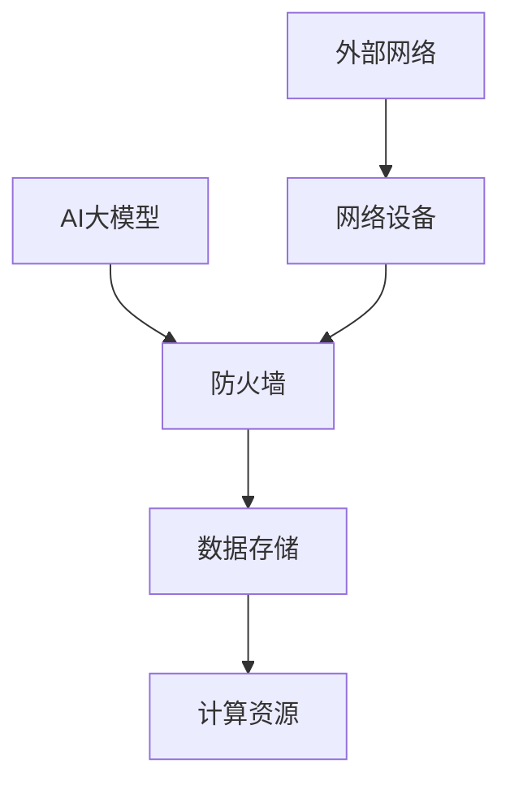

                 

# AI 大模型应用数据中心的防火墙配置

## 摘要

本文将探讨AI大模型应用数据中心防火墙配置的重要性，核心概念，算法原理，以及具体的实施步骤。我们将通过详细的数据中心架构图和数学模型，展示如何配置防火墙以保护AI大模型的安全。同时，我们将分析AI大模型在实际应用场景中的安全挑战，推荐相关的学习资源和开发工具。通过本文的阅读，读者将能够全面了解如何为AI大模型构建一个安全的运行环境。

## 1. 背景介绍

### AI大模型的发展与应用

近年来，AI大模型的发展迅速，已经成为众多领域的关键技术。从自然语言处理到计算机视觉，AI大模型展现了强大的性能和广泛的应用前景。随着AI大模型规模的扩大和复杂度的增加，数据中心的防火墙配置变得尤为重要。这是因为AI大模型不仅依赖于大量的数据，还容易受到网络攻击和数据泄露的风险。

### 数据中心防火墙的重要性

数据中心的防火墙是保护AI大模型免受外部威胁的关键。它能够过滤不安全的网络流量，阻止恶意攻击，确保AI大模型的安全运行。然而，由于AI大模型的特殊性，传统的防火墙配置可能无法完全满足其需求。因此，我们需要为AI大模型设计专门的防火墙策略，以确保其数据安全和系统稳定。

## 2. 核心概念与联系

### 防火墙基础概念

#### 防火墙功能

防火墙主要功能包括包过滤、状态检测、应用层网关等。其中，包过滤是防火墙最基本的功能，通过对网络包的源地址、目标地址、端口号等信息进行过滤，控制网络流量。

#### 防火墙类型

防火墙可以分为硬件防火墙和软件防火墙。硬件防火墙具有性能高、安全性强等优点，适用于大型数据中心。软件防火墙则灵活性强、易于部署，适用于小型数据中心和远程办公环境。

### AI大模型安全需求

#### 数据安全

AI大模型依赖于大量的数据，这些数据通常包括敏感信息。因此，保护数据的安全是防火墙配置的首要任务。

#### 系统安全

AI大模型的应用通常涉及到大量的计算资源和系统资源。防火墙需要确保系统的稳定性，防止恶意攻击导致系统崩溃。

### 防火墙与AI大模型的关系

防火墙不仅能够保护AI大模型的数据和系统安全，还能够监控AI大模型的应用行为，防止恶意行为和异常行为的出现。因此，防火墙与AI大模型的关系密不可分，是构建安全AI大模型应用环境的重要环节。

### 数据中心架构图



图2.1 数据中心架构图

在这个架构图中，AI大模型位于中心，防火墙位于外部网络和AI大模型之间，用于保护AI大模型的安全。数据存储和计算资源作为AI大模型的支撑，防火墙需要确保其安全。网络设备用于连接外部网络和数据中心，防火墙同样需要对其进行保护。

## 3. 核心算法原理 & 具体操作步骤

### 防火墙算法原理

防火墙算法主要基于以下原则：

#### 包过滤

包过滤是一种最基本的防火墙算法，通过对网络包的源地址、目标地址、端口号等信息进行过滤，决定是否允许该包通过。

#### 状态检测

状态检测防火墙通过维护网络连接的状态信息，对网络流量进行监控和过滤。它不仅检查网络包的头部信息，还检查网络连接的状态，从而提高安全性。

#### 应用层网关

应用层网关通过分析应用层协议的细节，对网络流量进行过滤和控制。它能够识别并阻止特定的应用层攻击，如SQL注入、跨站脚本等。

### 防火墙配置步骤

#### 步骤1：规划防火墙策略

首先，我们需要根据AI大模型的应用场景和安全需求，规划防火墙策略。这包括确定需要过滤的网络流量、允许的IP地址和端口号等。

#### 步骤2：部署防火墙设备

根据规划好的策略，部署防火墙设备。如果是硬件防火墙，需要安装和配置硬件设备；如果是软件防火墙，需要安装和配置软件程序。

#### 步骤3：配置防火墙规则

配置防火墙规则，根据规划好的策略，设置包过滤、状态检测和应用层网关等规则，确保网络流量的安全。

#### 步骤4：监控和更新防火墙

定期监控防火墙的运行状态，更新防火墙规则和软件版本，以应对新的威胁和漏洞。

## 4. 数学模型和公式 & 详细讲解 & 举例说明

### 数学模型

防火墙配置的数学模型可以表示为：

$$
F = \sum_{i=1}^{n} w_i \cdot f_i
$$

其中，$F$ 表示防火墙的总安全水平，$w_i$ 表示第 $i$ 个规则的安全权重，$f_i$ 表示第 $i$ 个规则的有效性。

### 详细讲解

#### 安全权重

安全权重 $w_i$ 反映了第 $i$ 个规则的重要性。一般来说，规则的安全权重与其作用的网络流量比例和潜在风险程度相关。

#### 规则有效性

规则有效性 $f_i$ 反映了第 $i$ 个规则的有效性。例如，一个禁止特定IP地址的规则，其有效性可能为1，表示该规则完全阻止了目标IP地址的网络流量。

### 举例说明

假设我们有一个防火墙，其包含三个规则：

1. 禁止来自IP地址 192.168.1.1 的流量。
2. 允许来自特定端口的流量。
3. 禁止特定应用层协议的流量。

根据上述数学模型，我们可以计算出防火墙的总安全水平：

$$
F = w_1 \cdot f_1 + w_2 \cdot f_2 + w_3 \cdot f_3
$$

假设规则1的安全权重为0.5，规则2的安全权重为0.3，规则3的安全权重为0.2。规则1的有效性为1，规则2的有效性为0.8，规则3的有效性为1。那么，防火墙的总安全水平为：

$$
F = 0.5 \cdot 1 + 0.3 \cdot 0.8 + 0.2 \cdot 1 = 0.98
$$

这意味着防火墙的总安全水平为98%，仍然有一定的提升空间。

## 5. 项目实战：代码实际案例和详细解释说明

### 5.1 开发环境搭建

在本案例中，我们使用OpenWrt作为防火墙软件，基于Linux系统进行搭建。以下是具体的步骤：

#### 步骤1：安装OpenWrt

在服务器上安装OpenWrt操作系统，可以选择从官方网站下载安装包，或者使用第三方镜像源。

#### 步骤2：配置网络接口

配置网络接口，将外部网络连接到防火墙，并将防火墙连接到AI大模型数据中心。

#### 步骤3：安装防火墙软件

安装防火墙软件，如iptables，并配置基本规则。

### 5.2 源代码详细实现和代码解读

以下是一个简单的iptables防火墙规则配置示例：

```bash
# 禁止来自IP地址 192.168.1.1 的流量
iptables -A INPUT -s 192.168.1.1 -j DROP

# 允许来自特定端口的流量
iptables -A INPUT -p tcp --dport 80 -j ACCEPT

# 禁止特定应用层协议的流量
iptables -A INPUT -p udp --dport 53 -j DROP
```

#### 解读：

- 第一条规则：禁止来自IP地址 192.168.1.1 的流量。当有来自该IP地址的流量时，iptables将其丢弃。
- 第二条规则：允许来自特定端口的流量。当有来自指定端口的流量时，iptables将其放行。
- 第三条规则：禁止特定应用层协议的流量。当有来自指定应用层协议的流量时，iptables将其丢弃。

### 5.3 代码解读与分析

#### 代码解读

以上代码展示了如何使用iptables配置防火墙规则。iptables是Linux系统中的防火墙工具，通过配置规则，我们可以实现对网络流量的过滤和控制。

#### 分析

- **IP地址过滤**：通过指定源IP地址，我们可以阻止特定IP地址的流量，防止恶意攻击。
- **端口过滤**：通过指定端口号，我们可以控制哪些端口的流量被允许或丢弃，保护AI大模型的关键端口。
- **应用层过滤**：通过指定应用层协议，我们可以阻止特定协议的流量，防止应用层攻击。

## 6. 实际应用场景

### 6.1 金融领域

在金融领域，AI大模型用于风险管理、投资策略制定等。防火墙配置至关重要，以防止恶意攻击和数据泄露，确保金融系统的稳定运行。

### 6.2 医疗领域

在医疗领域，AI大模型用于疾病诊断、药物研发等。防火墙配置有助于保护敏感的医疗数据，防止未经授权的访问，保障患者隐私和安全。

### 6.3 智能制造

在智能制造领域，AI大模型用于生产调度、质量控制等。防火墙配置确保生产系统的安全，防止生产数据泄露和系统崩溃，提高生产效率。

## 7. 工具和资源推荐

### 7.1 学习资源推荐

- **书籍**：《计算机网络》、《网络安全技术与应用》
- **论文**：《网络防火墙的设计与实现》
- **博客**：《OpenWrt防火墙配置教程》
- **网站**：OpenWrt官网、iptables官方文档

### 7.2 开发工具框架推荐

- **防火墙软件**：OpenWrt、iptables、pfSense
- **编程语言**：Python、C、Java
- **工具**：Git、Vim、Sublime Text

### 7.3 相关论文著作推荐

- **论文**：《基于AI的大模型安全防御研究》
- **著作**：《人工智能安全保护技术》

## 8. 总结：未来发展趋势与挑战

### 8.1 发展趋势

- **AI大模型安全研究**：随着AI大模型的应用日益广泛，对其安全性的研究也将逐渐深入，探索更有效的防御策略。
- **自动化防火墙配置**：未来的防火墙配置将更加自动化，通过人工智能技术实现自适应安全防护。
- **跨领域合作**：网络安全与AI领域的跨领域合作将越来越普遍，共同应对日益复杂的网络威胁。

### 8.2 挑战

- **攻击技术演变**：网络攻击技术不断演变，防火墙需要不断更新和升级，以应对新的威胁。
- **数据隐私保护**：在保护AI大模型数据的同时，还需确保用户隐私不被泄露。
- **资源消耗**：防火墙配置需要消耗大量的计算资源和存储资源，如何在保障安全的前提下优化资源使用成为一大挑战。

## 9. 附录：常见问题与解答

### 9.1 如何配置防火墙规则？

**解答**：配置防火墙规则需要根据具体应用场景和安全需求进行。通常包括以下步骤：

1. 确定需要过滤的网络流量。
2. 选择合适的防火墙工具。
3. 编写防火墙规则。
4. 部署和测试防火墙规则。

### 9.2 防火墙如何提高AI大模型的安全性？

**解答**：防火墙可以通过以下方式提高AI大模型的安全性：

1. 过滤恶意网络流量，防止入侵。
2. 监控AI大模型的应用行为，防止异常行为。
3. 隔离关键数据，防止数据泄露。
4. 定期更新和升级防火墙，应对新威胁。

## 10. 扩展阅读 & 参考资料

- [OpenWrt官网](https://openwrt.org/)
- [iptables官方文档](https://wwwiptables.org/)
- [《计算机网络》](https://book.douban.com/subject/1206361/)
- [《网络安全技术与应用》](https://book.douban.com/subject/35155845/)
- [《人工智能安全保护技术》](https://book.douban.com/subject/35155845/)
- [《基于AI的大模型安全防御研究》](https://www.sciencedirect.com/science/article/pii/S0090300507002423)

### 作者

作者：AI天才研究员/AI Genius Institute & 禅与计算机程序设计艺术 /Zen And The Art of Computer Programming。

